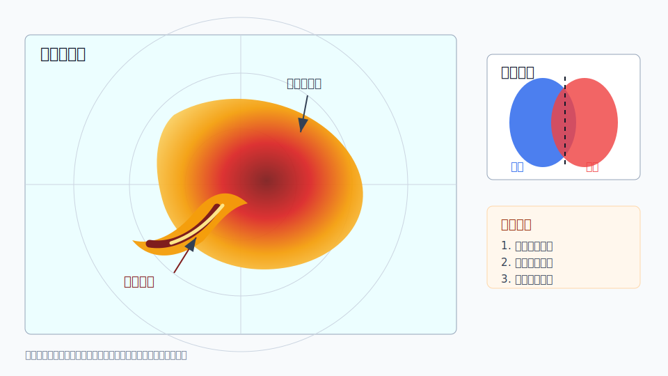

# C01 钩状回波与中气旋

## 元信息

- 标签：强对流、钩状回波、中气旋、龙卷、超级单体、反射率、径向速度
- 主要风险：龙卷、雷暴大风、冰雹、短时强降水
- 适用问题：用户询问钩状回波、旋转单体、右后侧回波卷曲或速度偶极

## 示意图

## 典型场景

成熟强单体在强垂直风切变环境下发展，主回波体右后侧出现向内卷曲的低层反射率结构。若速度产品同时显示紧邻的入流和出流速度偶极，说明存在中尺度旋转信号。

## 关键回波特征

- 低层反射率上，主回波体一侧出现钩状或逗号状卷曲。
- 钩状结构附近可能有弱回波区或有界弱回波区。
- 径向速度上，强入流和强出流紧邻形成速度偶极。
- 连续体扫中，旋转信号持续存在或增强，比单张图像更有意义。

## 需要继续核验

- 速度偶极是否连续、低层是否更强、垂直伸展是否明显。
- 地面是否有风向风速突变、气压涌升、灾情或目击报告。
- 环境场是否支持强垂直风切变和低层旋转。
- 目标距离雷达有多远，低层波束是否已经抬得过高。

## 易混淆点

- 反射率外观像钩状，不代表一定存在龙卷。
- 地形遮挡、距离过远或波束高度过高会弱化低层判断。
- 多单体合并时可能出现短暂卷曲形态，但不一定有持续中气旋。

## 使用边界

该案例适合解释“钩状回波为什么需要关注旋转风险”。不要把它用于直接宣布龙卷发生；必须结合速度产品、连续演变和地面核验。
