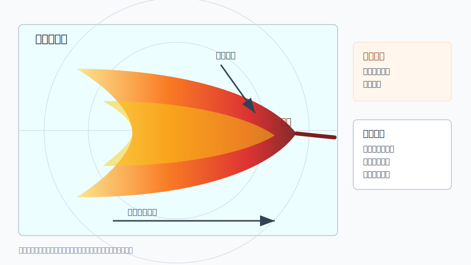

# C02 弓形回波与雷暴大风

## 元信息

- 标签：强对流、弓形回波、后侧入流、雷暴大风、下击暴流、反射率、径向速度
- 主要风险：雷暴大风、短时强降水、局地下击暴流
- 适用问题：用户询问弧形回波、弓形回波、回波前缘快速推进或大风风险

## 示意图

## 典型场景

线状对流或强对流群中，冷池和后侧入流增强，使回波前缘向前凸出，形成弓形结构。弓形顶端和两侧常是大风风险关注区。

## 关键回波特征

- 反射率前缘呈弧形或弓形外凸，移动速度较快。
- 弓形后侧可能出现弱回波槽，提示后侧入流通道。
- 径向速度显示前缘辐散、低层强风或速度突变。
- 地面自动站可能出现阵风增强、气压涌升、气温下降。

## 需要继续核验

- 弓形结构是否持续推进，还是短暂外观。
- 后侧入流与低层强风是否在速度产品中有支撑。
- 地面风是否已经增强，是否有树木、临时构筑物等脆弱目标。
- 环境是否支持冷池传播和下沉气流增强。

## 易混淆点

- 普通线状降水也可能局部呈弧形，但没有明显大风动量下传。
- 远距离低层资料不足时，近地面大风判断不可靠。
- 弓形回波不等于每一处前缘都会出现灾害性大风。

## 使用边界

该案例适合解释弓形回波与雷暴大风的关系。用于业务判断时必须结合速度产品和地面实况，不应单凭形态给出确定风灾结论。
