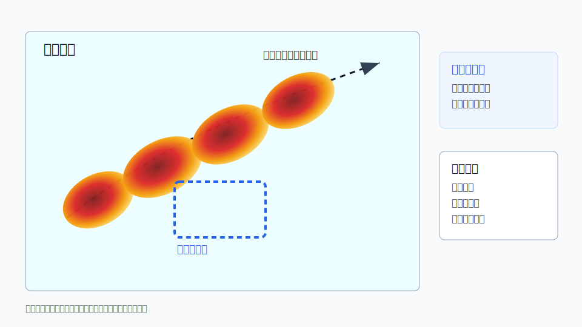

# C03 训练效应与短时强降水

## 元信息

- 标签：暴雨、训练效应、准静止回波、短时强降水、回波列车、反射率
- 主要风险：城市内涝、山洪、滑坡泥石流、中小河流洪水
- 适用问题：用户询问同一区域反复有强回波经过、降水持续偏强或局地暴雨风险

## 示意图

## 典型场景

多个对流单体沿近似相同路径移动，或者线状降水带在同一区域维持较长时间，导致局地累计雨量迅速增加。单个回波强度未必极端，但持续叠加会显著放大风险。

## 关键回波特征

- 强回波单体沿同一路径连续生成、移动和消散。
- 回波带移动方向与其排列方向接近平行，造成“列车效应”。
- 同一地点长时间处于中强到强回波覆盖下。
- 自动站雨量显示短历时累积快速增加。

## 需要继续核验

- 低空急流、水汽输送、切变线或地形抬升是否维持。
- 回波是否仍在上游不断新生。
- 累计雨量、土壤含水量、河流水位和城市排水能力。
- 地方暴雨和山洪地质灾害预警信息。

## 易混淆点

- 单张图像只能看到“强回波”，不能判断训练效应；必须看连续体扫。
- 回波强度不一定极强，但持续时间长仍可能造成严重影响。
- 雷达估测降水受地形、亮带和距离影响，需要自动站校验。

## 使用边界

该案例适合解释“为什么不一定最强的回波也会造成暴雨风险”。不要只凭案例推断具体雨量，应结合站点实况和定量降水估测。
