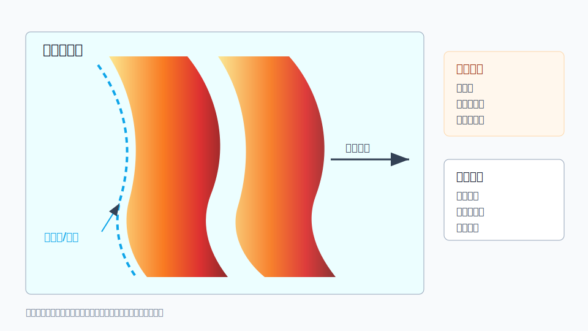

# C04 飑线与线状对流

## 元信息

- 标签：飑线、线状对流、阵风锋、速度辐合、雷暴大风、短时强降水
- 主要风险：雷暴大风、短时强降水、局地冰雹、强雷电
- 适用问题：用户询问长条状强回波、前沿整齐推进、阵风锋或线状强对流

## 示意图

## 典型场景

对流单体组织成连续或准连续的线状系统，前沿伴随阵风锋和低层辐合，系统整体快速移动。线状结构前缘常伴有短时强降水和雷暴大风。

## 关键回波特征

- 反射率呈长条状，前缘较整齐，局地有强回波核。
- 低层速度显示沿线辐合或前后风向风速突变。
- 前方可能存在阵风锋细线或新生对流。
- 弓形段、线回波波状结构或嵌入旋转段是重点关注区。

## 需要继续核验

- 系统移速、移向和前沿推进是否稳定。
- 前沿速度辐合和地面阵风是否匹配。
- 是否出现局部弓形段、旋转段或单体并入。
- 下游地区是否处在回波前沿路径上。

## 易混淆点

- 层状降水带也可呈线状，但缺少强对流前缘和速度辐合。
- 飑线内不同段落风险差异很大，不能用整体形态替代局地分析。
- 线状系统后部层状降水可能继续造成降水影响。

## 使用边界

该案例适合解释线状强对流的组织和传播风险。用于服务表达时，应强调快速移动、前沿突变和下游影响，而不是只描述“有一条回波带”。
