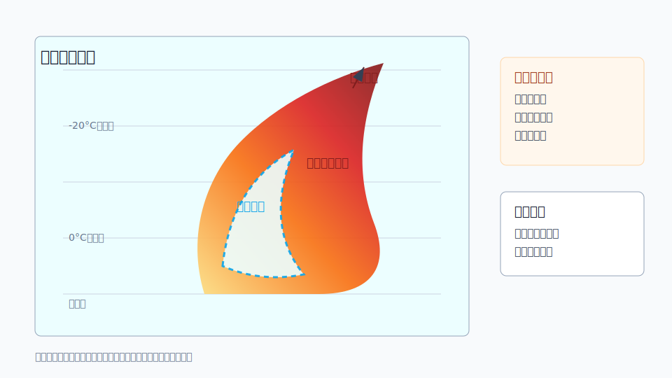

# C05 冰雹强单体

## 元信息

- 标签：冰雹、强回波核、弱回波区、回波顶高、三体散射、双偏振、强对流
- 主要风险：冰雹、雷暴大风、短时强降水
- 适用问题：用户询问强单体是否可能有冰雹、回波顶高、强回波核或双偏振识别

## 示意图

## 典型场景

强上升气流支撑水凝物在云内反复增长，形成深厚强回波核。若环境具有较强不稳定能量和垂直风切变，冰雹风险增加。

## 关键回波特征

- 强回波核深厚，垂直伸展高，回波顶较高。
- 低层或中层可能出现弱回波区或有界弱回波区。
- 双偏振产品可能显示大粒子或混合相水凝物特征。
- 个别情况下可出现三体散射等冰雹相关特征。

## 需要继续核验

- 0 摄氏度层和 -20 摄氏度层高度，强回波相对高度。
- 垂直风切变、对流有效位能和湿层厚度。
- 双偏振产品是否支持冰雹判断。
- 地面是否有冰雹报告或灾情反馈。

## 易混淆点

- 高反射率可能来自强降水，不一定是冰雹。
- 双偏振识别受雷达标定、距离、遮挡和算法影响。
- 小冰雹、大雨滴和融化冰雹在不同产品上可能表现相近。

## 使用边界

该案例适合提示冰雹判读需要“强回波垂直结构 + 环境 + 双偏振/实况”共同支撑。不要仅凭颜色强弱判断冰雹。
