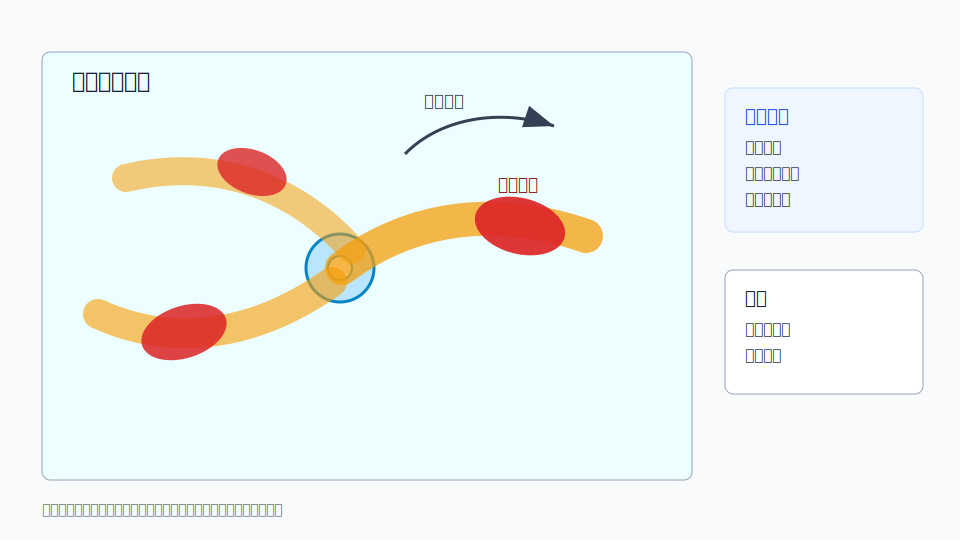

# C06 台风外围螺旋雨带

## 元信息

- 标签：台风雨带、螺旋雨带、嵌入对流、短时强降水、低层风切变、强对流
- 主要风险：短时强降水、局地大风、雷电、局地旋转风险
- 适用问题：用户询问台风外围雨带中的强回波、反复降水或局地强对流

## 示意图

## 典型场景

台风外围螺旋雨带在暖湿输送、低层辐合和地形作用下增强，雨带中嵌入短生命史强对流单体，造成短时强降水或局地大风。

## 关键回波特征

- 回波呈弧形或螺旋带状，随台风环流旋转移动。
- 雨带中嵌入局地强回波核，强度和位置快速变化。
- 同一地区可能受多条雨带先后影响，累计雨量增加。
- 低层速度场可见强风带、辐合或局地切变。

## 需要继续核验

- 台风中心位置、移动路径、强度和外围环流结构。
- 地形增雨、海陆风、季风水汽和冷空气共同作用。
- 自动站短时雨量和阵风实况。
- 官方台风、暴雨和强对流预警信息。

## 易混淆点

- 台风路径远离不代表外围雨带影响小。
- 螺旋雨带整体不一定每处都强，嵌入对流段才是重点。
- 台风雨带中强降水和大风风险可能空间错位。

## 使用边界

该案例适合解释台风外围雨带的局地化和间歇性风险。不要仅以台风中心距离判断用户所在地影响。
