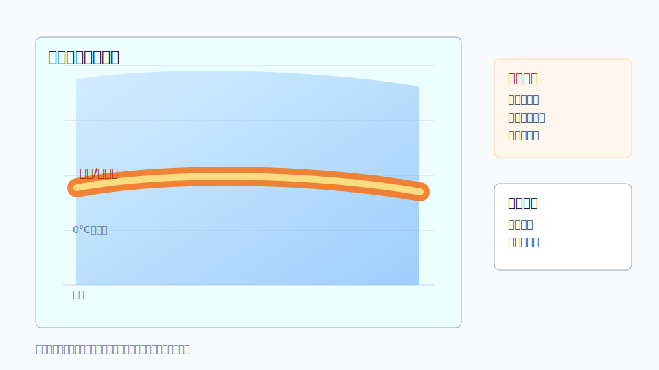

# C07 层状降水亮带

## 元信息

- 标签：层状降水、亮带、融化层、反射率误判、双偏振
- 主要风险：反射率误判、降水估测偏差
- 适用问题：用户询问大片层状降水中为什么出现一圈或一带较强回波

## 示意图

## 典型场景

层状降水中，冰晶或雪花穿过融化层时外部形成水膜，雷达反射率在融化层附近增强，表现为亮带。亮带常在一定高度层形成环状或带状增强。

## 关键回波特征

- 反射率在某一距离或高度附近形成相对连续增强带。
- 垂直剖面上增强层较薄，与融化层高度一致。
- 双偏振产品可辅助识别融化层特征。
- 地面降水强度未必与亮带处反射率增强相匹配。

## 需要继续核验

- 温度廓线和 0 摄氏度层高度。
- 亮带是否随雷达距离呈规律分布。
- 自动站雨量是否支持强降水判断。
- 是否存在嵌入对流，避免把全部强回波都归因于亮带。

## 易混淆点

- 亮带可能被误判为强对流或暴雨核心。
- 亮带影响定量降水估测，需要地面雨量订正。
- 层状区内也可能嵌入对流，不能一概排除强降水风险。

## 使用边界

该案例适合解释“反射率增强不一定代表近地面降水同等增强”。用于判断降水风险时必须结合地面实况和垂直结构。
