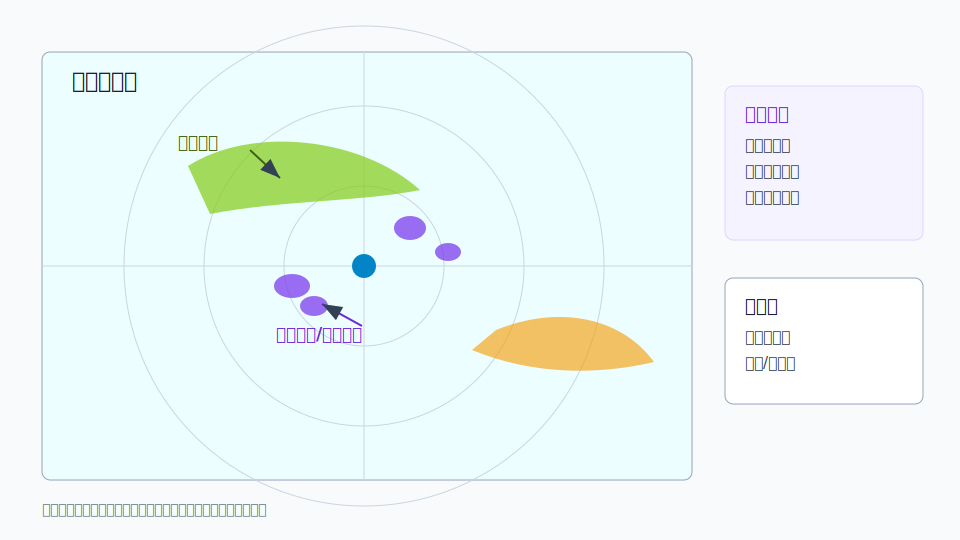

# C08 非气象回波与异常传播

## 元信息

- 标签：非气象回波、异常传播、地物回波、昆虫、鸟群、海杂波、质控
- 主要风险：误判降水、误判强对流、误导服务表达
- 适用问题：用户询问雷达图上大片奇怪回波、固定不动回波或无降水实况的强回波

## 示意图

## 典型场景

雷达波束在特殊大气折射条件下异常传播，或被地物、昆虫、鸟群、海面等非气象目标散射，造成图上出现类似降水的回波。

## 关键回波特征

- 回波位置相对固定，移动与环境风场不一致。
- 低仰角明显，高仰角减弱或消失。
- 与卫星云图、自动站降水、闪电资料不匹配。
- 双偏振产品可能显示非气象目标特征。

## 需要继续核验

- 不同仰角、不同雷达站和连续时次是否一致。
- 地面是否有降水、风、雷电等实况支撑。
- 当时是否存在逆温、湿度突变或特殊折射环境。
- 质控产品是否已经标记或滤除。

## 易混淆点

- 异常传播可能在图上很强，但地面没有降水。
- 真实浅薄降水也可能只在低仰角明显，需要自动站和卫星共同判断。
- 生物回波在特定时段可形成扩散状或环状结构。

## 使用边界

该案例适合提醒先做资料质控。任何“图上有回波所以一定下雨”的结论都需要地面实况和多源资料支撑。
