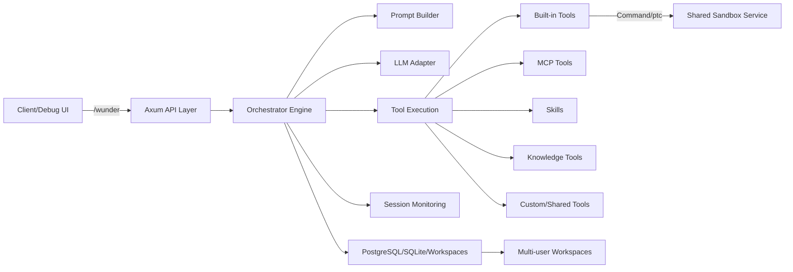
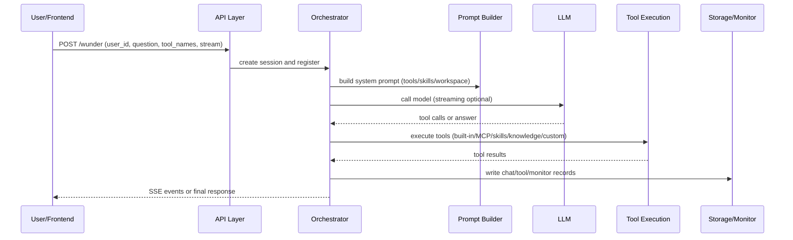
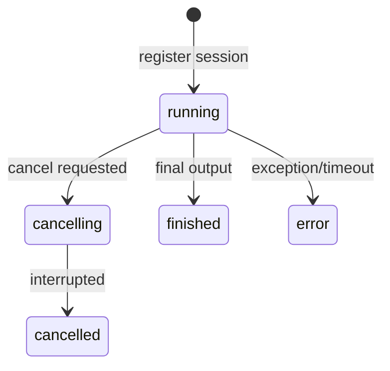

# wunder System Overview

## 1. One-page summary
wunder is an agent router: for developers, everything is an interface (API/config/tools); for LLMs, everything is a tool (callable, composable, governable). The system exposes a unified `/wunder` entry via Rust (Axum), supports both streaming SSE and non-streaming calls, and orchestrates LLMs, MCP, Skills, knowledge bases, and custom/shared tools into a reusable execution chain.

It also provides the A2A standard API at `/a2a` (JSON-RPC + SSE), and publishes AgentCard at `/.well-known/agent-card.json` for cross-system discovery.

The self-hosted MCP endpoint `/wunder/mcp` is implemented by the Rust server (streamable-http). Legacy Python FastAPI code under `app/` is kept for reference and sandbox service only; `Dockerfile.rust` + `docker-compose.rust.x86.yml`/`docker-compose.rust.arm.yml` are the recommended runtime for the Rust server.
With `sandbox.mode=sandbox`, built-in tools like command execution run via the shared sandbox service (`WUNDER_SANDBOX_ENDPOINT`); for docker compose deployments, prefer internal DNS `http://sandbox:9001` and do not publish port 9001.
Registered users are governed by daily request quotas (default tiers A/B/C), reset at midnight; each model call consumes one unit. Virtual `user_id`s are not quota-limited. Quota usage is surfaced via SSE (`quota_usage`) and UI stats for transparent cost control.

Its core value:
- Unified entry + strong tool orchestration: integrate multi-model, multi-tool, multi-skill into one control plane.
- Multi-user isolation + persistent workspaces: support concurrency and long-lived assets.
- Observable + controllable: session monitoring, tool heatmap, cancellation.
- Quota governance + cost control: per-call counting, daily reset, admin-adjustable limits, and user-visible consumption stats.
- Provider presets: built-in OpenAI-compatible provider presets (openai/openrouter/siliconflow/deepseek/moonshot/qwen, etc.) for faster onboarding.
- Throughput testing + capability evaluation: benchmark QPS/latency/resources and score test suites with regression comparisons.
- Long-term memory: opt-in per user, auto-summarize and append as `[Long-term Memory]` with timestamp prefixes.
- Language switching: front-end language selection syncs system prompts and API messages, controlled by `i18n.supported_languages`.

## 2. Architecture overview
### 2.1 Component diagram


### 2.2 Module responsibilities
- API layer (`src/api`): unified `/wunder` entry, A2A `/a2a`, and admin APIs for tools/workspaces/monitor.
- Orchestrator (`src/orchestrator.rs`): orchestration, tool routing, SSE event streaming.
- Tool layer (`src/tools.rs`): built-in tool specs and dispatcher.
- Workspace (`src/workspace.rs`): per-user workspace file management.
- Monitoring (`src/monitor.rs`): session lifecycle, events, and system snapshots persisted via the storage backend.
- Throughput testing (`src/throughput.rs`): run concurrency lists, randomize built-in questions, persist reports for replay/export.
- Capability evaluation (`src/evaluation_runner.rs` + `src/api/evaluation.rs`): run case suites, clean eval temp dir on start, precreate active items; cases live in `config/evaluation/cases`.
- Config (`src/config.rs` + `src/config_store.rs`): base config + admin overrides; supports `${ENV_VAR:-default}` expansion in YAML strings.
- Legacy Python code lives in `app/` (reference only) and the sandbox service.

## 3. Execution flow (request to answer)


Note: for registered users, each model call consumes one quota unit before invocation; if quota is exhausted the request is rejected with a quota error.
Note: after the final answer, the session is enqueued into long-term memory summarization. The summarization currently uses `app/prompts/memory_summary.txt` as the system prompt, merges history into a single user content, and writes memory/task logs for tracking.

## 4. Tool system (key points)
wunder abstracts all capabilities as "tools" and uses prompt injection + tool protocol to drive execution.

### 4.1 Tool types and sources
| Tool type | Source | Invocation | Sharing/Governance | Use case |
| --- | --- | --- | --- | --- |
| Built-in | `src/tools.rs` | Direct tool name | Admin enable list | File ops, commands, ptc |
| MCP | `config/wunder.yaml` + overrides + `/wunder/admin/mcp` | `server@tool` | Admin enable + allow_tools | External services (incl. `wunder@excute`/`wunder@doc2md`) |
| Skills | `skills/`, `EVA_SKILLS/`, user skills | Skill name | Admin/user enable | Codified workflows |
| Knowledge | `knowledge/` or user knowledge | Knowledge base tool | Admin/user config | Local knowledge retrieval |
| Custom tools | `data/user_tools/<user_id>` | `user_id@tool` | User config | Personal capabilities |
| Shared tools | Shared user config | `owner_id@tool` | Shared flag | Cross-user reuse |

## 5. Agent management testing
### 5.1 Overview
- Covers session management, throughput testing, and capability evaluation to keep concurrency stable and measurable.
- Admin endpoints live under `/wunder/admin/throughput/*` and `/wunder/admin/evaluation/*`, coordinated with monitoring.

### 5.2 Session management
#### 5.2.1 Concurrency rules
- One running session per user_id; conflicts return 429.
- Per-user mutual exclusion via `session_locks` with TTL heartbeats (stored in the selected storage backend).
- Session status is recorded by Monitor and visible in admin APIs.

#### 5.2.2 Session state machine


#### 5.2.3 Events and monitoring
- Event types: `progress/llm_request/knowledge_request/llm_output_delta/llm_stream_retry/llm_output/quota_usage/tool_call/tool_result/a2ui/token_usage/final/error` (filtered by `observability.monitor_drop_event_types`).
- Events are stored in the selected storage backend and visible via `/wunder/admin/monitor`.
- Events are truncated by `observability.monitor_event_limit` and `monitor_payload_max_chars` (<= 0 disables truncation).
- SSE disconnect does not stop tasks; events continue to be recorded.
- Overflowed SSE events are stored in `stream_events` and replayed.

### 5.3 Throughput testing
- Admin-triggered benchmarks run each concurrency level from a list and use a built-in question set.
- Metrics include QPS, success/error rates, latency buckets, and token usage with periodic sampling.
- Reports persist to `data/throughput` for replay and export.

### 5.4 Capability evaluation
- Test cases live in `config/evaluation/cases`, and runs can combine dimensions.
- Runs stream SSE progress and per-case status; eval temp dir is cleaned on start with active items precreated.
- Results persist in `evaluation_runs` / `evaluation_items`, with history review and deletion.

## 6. Workspace and persistence
- Workspace: `workspaces/<user_id>` (prompt shows `/workspaces/<user_id>/`), isolated and persistent.
- Workspace APIs support read/search/batch ops; UI uses tree view.
- Chat history/tool logs/artifacts/monitor/locks/overflow events are stored in the selected backend (PostgreSQL by default; SQLite optional).
- Throughput reports are stored under `data/throughput` for replay/export.
- Evaluation results are stored in `evaluation_runs` / `evaluation_items` for history.
- Long-term memory in `memory_records` with `[Long-term Memory]` prefix, per-user max 30.
- Memory task logs in `memory_task_logs` for latest summary per session.

## 7. Security and efficiency
- API auth: `/wunder`, `/a2a`, and `/wunder/mcp` require API key (`security.api_key`).
- Default admin account is `admin/admin`, auto-created on startup and protected from deletion (reset via user management).
- Tool access control: `security.allow_commands/allow_paths/deny_globs`.
- Sandbox execution: commands/ptc can run in shared sandbox with network/readonly constraints.
- Prompt caching and workspace tree caching reduce IO and repeated prompt builds.

## 8. Ops & entrypoints
- `/wunder`: unified call entry (stream/non-stream).
- `/a2a`: A2A JSON-RPC standard API (supports SSE streaming).
- `/.well-known/agent-card.json`: A2A AgentCard discovery entry.
- `/wunder/tools`: tool catalog (built-in/MCP/knowledge/skills/custom/shared).
- `/wunder/i18n`: language config (default, supported, aliases).
- `/wunder/temp_dir/*`: temp file upload/download/list/remove (no auth, rooted at `temp_dir/`).
- `/wunder/admin/*`: model/MCP/skills/tools/monitor/users management.
- `/wunder/admin/throughput/*`: throughput test management (start/stop/status/report).
- `/wunder/admin/evaluation/*`: capability evaluation management (start/cancel/stream/runs/cases).
- `/wunder/admin/memory/*`: long-term memory management.
- `/wunder/workspace/*`: workspace operations.
- `/`: admin debug UI entry (`web/index.html`), `web/simple-chat` temporarily disabled.
- `/wunder/ppt`: system intro PPT.
- `/wunder/ppt-en`: system intro PPT (EN).

## 9. Key paths
```text
src/                 # Rust server (Axum)
  api/               # /wunder, /a2a, admin APIs
  storage/           # SQLite/PostgreSQL persistence
app/                 # legacy Python reference + sandbox service
config/              # base config (wunder.yaml)
data/config/         # admin overrides (wunder.override.yaml)
workspaces/     # per-user workspaces
skills/              # built-in skills
EVA_SKILLS/          # skills directory
knowledge/           # shared knowledge base
temp_dir/            # temp files (/wunder/temp_dir/*)
web/                 # debug frontend
docs/ppt/            # system intro PPT
docs/ppt-en/         # system intro PPT (EN)
```

---
For deeper technical details, see: `docs/Design-Plan.md` and `docs/API-Documentation.md`.
