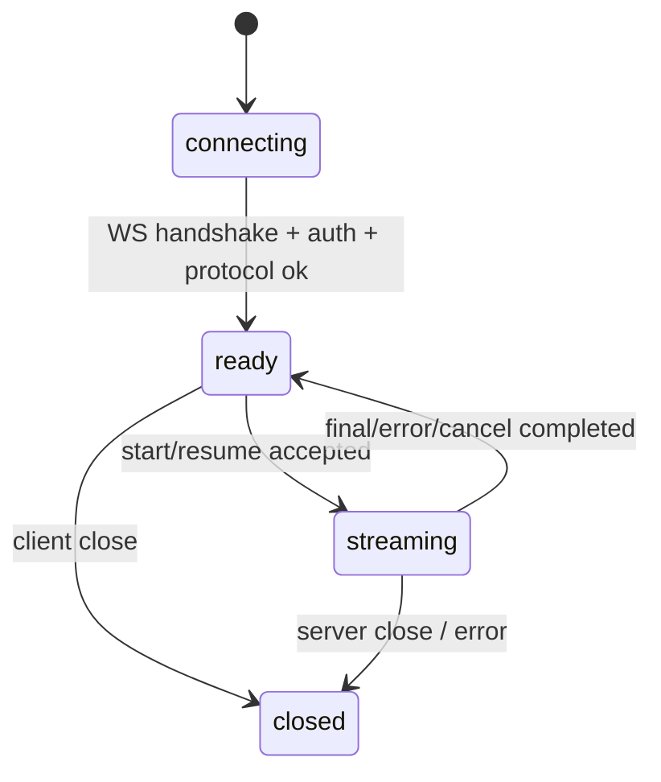
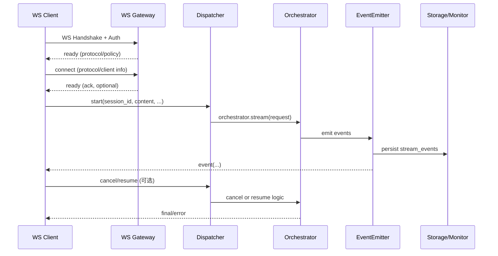

# WebSocket 可选传输方案（用户侧前端）

> 目标：默认使用 WebSocket 作为传输方式，同时保留 SSE 兼容通道，复用现有事件流与断线回放能力。

## 1. 背景与目标

- 现状：用户侧前端通过 HTTP + SSE 获取流式事件（`/wunder/chat/...`）。
- 新增：提供 WebSocket 作为**默认传输**，提升双向实时交互能力，同时保留 SSE 作为兼容通道。
- 约束：不破坏现有 SSE 行为与事件语义；事件类型、`event_id` 与断线回放逻辑保持一致。

## 2. 总体设计（节点与边界）

**关键节点**
1. **WS Client（frontend）**：建立连接、发送 start/resume/cancel、消费事件流。
2. **WS Gateway（Axum 路由层）**：鉴权、路由、握手升级、连接生命周期管理。
3. **Session Dispatcher（WS 会话调度器）**：将 WS 消息转为 `WunderRequest`，启动 orchestrator 流式执行。
4. **Orchestrator Stream**：复用 `orchestrator.stream()` 事件流。
5. **Event Emitter / Monitor / Storage**：事件推送 + `stream_events` 落库 + 断线回放。
6. **Resume Loader**：按 `after_event_id` 回放历史事件。

**边界原则**
- WS 仅替换“传输层”，业务语义与 SSE 完全一致。
- 事件仍由 `EventEmitter` 统一生成与持久化。
- 断线续传仍通过 `stream_events` 回放完成。

## 3. 端点设计（建议）

### 3.1 用户侧会话（主入口）
- **WS Endpoint**：`/wunder/chat/ws`
- 适用：用户侧前端聊天（当前 SSE 入口 `/wunder/chat/sessions/{session_id}/messages` 的替代传输）

### 3.2 统一入口（已实现）
- **WS Endpoint**：`/wunder/ws`
- 适用：统一 `/wunder` 入口的 WS 版本（与 `/wunder` POST 语义一致）

> 说明：`/wunder/chat/ws` 用于用户侧会话，`/wunder/ws` 主要面向统一 API 入口与服务端调用。

## 4. 认证与握手
**推荐策略（浏览器端）**
- WebSocket 无法在浏览器原生 API 中设置 `Authorization` Header。
- 方案 A（推荐）：使用 `Sec-WebSocket-Protocol` 传递 token（服务端解析，不落 URL）
  - 例：`new WebSocket(url, ["wunder", "wunder-auth.<token>"])`
- 方案 B：使用 Cookie（同源会话）
- 方案 C（兼容）：Query 传 `access_token`（不推荐，可能被日志/代理记录）

**非浏览器客户端**
- 允许 `Authorization: Bearer <token>` Header
- 使用 API Key 访问 `/wunder/ws` 时，需在 Query 中携带 `user_id` 用于解析目标用户

**鉴权复用**
- 复用现有 `resolve_user` / Bearer Token 鉴权逻辑。

**应用层握手（新增）**
- 连接建立后服务端会发送 `ready`，其中包含 `protocol`（协议版本）与 `policy`（传输策略）。
- 客户端建议发送 `type=connect` 进行协议协商，携带 `protocol_version` 或 `min_protocol_version/max_protocol_version` 与客户端信息。
- 若协议不兼容，服务端返回 `error` 并关闭连接。
- 兼容旧客户端：未发送 `connect` 时服务端按默认协议版本处理，但仍会下发 `ready`；推荐新客户端显式 `connect`，后续可升级为强制握手。

## 5. 协议设计（消息结构）

统一使用 JSON Envelope（`session_id` 可放在 envelope 或 payload，服务端取其一）：

```json
{
  "type": "connect | start | resume | watch | cancel | ping | event | error | ready | pong",
  "request_id": "req_xxx",
  "session_id": "sess_xxx",
  "payload": {}
}
```

> 多路复用：同一连接可并发多个 start/resume，需为每个请求设置 `request_id`，服务端返回的 `event/error` 都会携带对应 `request_id`；未提供时服务端会自动生成并回传。

### 5.1 Client -> Server

**connect**
```json
{
  "type": "connect",
  "request_id": "req_xxx",
  "payload": {
    "protocol_version": 1,
    "client": {
      "name": "frontend",
      "version": "1.0.0",
      "platform": "web",
      "mode": "chat"
    }
  }
}
```
> 说明：`protocol_version` 可替换为 `min_protocol_version/max_protocol_version`；服务端会校验范围并在不兼容时返回 `error`。未发送 `connect` 时会按默认协议版本处理。

**start**
```json
{
  "type": "start",
  "request_id": "req_xxx",
  "payload": {
    "session_id": "sess_xxx",
    "content": "用户输入",
    "stream": true,
    "attachments": []
  }
}
```
> 说明：当前仅支持 `session_id/content/stream/attachments`，其余字段保留为后续扩展。

**start（/wunder/ws）**
```json
{
  "type": "start",
  "request_id": "req_xxx",
  "payload": {
    "user_id": "u_123",
    "question": "用户问题",
    "stream": true,
    "session_id": "sess_xxx",
    "tool_names": ["search", "read_file"],
    "skip_tool_calls": false,
    "config_overrides": null,
    "language": "zh-CN"
  }
}
```
> 说明：`/wunder/ws` 使用与 `/wunder` POST 一致的请求体字段；`stream` 默认强制为 `true`。

**resume**
```json
{
  "type": "resume",
  "request_id": "req_xxx",
  "payload": {
    "session_id": "sess_xxx",
    "after_event_id": 123
  }
}
```

**watch**
```json
{
  "type": "watch",
  "request_id": "req_xxx",
  "payload": {
    "session_id": "sess_xxx",
    "after_event_id": 123
  }
}
```
> 说明：用于持续订阅会话流事件，直到客户端主动 `cancel` 或断开连接。

**cancel**
```json
{
  "type": "cancel",
  "payload": {
    "session_id": "sess_xxx"
  }
}
```
> 可选：携带 `request_id` 取消该 request 的流；若该流来自 `start`，会同步标记会话取消（`resume/watch` 仅停止流）。仅传 `session_id` 会取消该会话下的所有活跃流并标记会话取消。若同时提供，以 `request_id` 为准。

**ping**
```json
{ "type": "ping", "payload": { "ts": 1730000000 } }
```

### 5.2 Server -> Client

**ready**
```json
{
  "type": "ready",
  "payload": {
    "connection_id": "conn_xxx",
    "server_time": 1730000000,
    "protocol": { "version": 1, "min": 1, "max": 1 },
    "policy": {
      "max_message_bytes": 524288,
      "stream_queue_size": 256,
      "slow_client_queue_watermark": 2,
      "resume_poll_interval_s": 0.08,
      "resume_poll_max_interval_s": 0.8,
      "resume_poll_backoff_factor": 1.6,
      "resume_poll_backoff_after": 3,
      "stream_event_fetch_limit": 200
    },
    "features": {
      "multiplex": true,
      "resume": true,
      "watch": true,
      "ping_pong": true
    }
  }
}
```

**event（与 SSE 事件对齐）**
```json
{
  "type": "event",
  "request_id": "req_xxx",
  "payload": {
    "event": "llm_output_delta",
    "id": "123",
    "data": { "session_id": "sess_xxx", "timestamp": "...", "data": { "delta": "..." } }
  }
}
```

**slow_client（慢客户端告警）**
```json
{
  "type": "event",
  "request_id": "req_xxx",
  "payload": {
    "event": "slow_client",
    "data": { "reason": "queue_backpressure", "queue_capacity": 1, "ts": "..." }
  }
}
```

**error**
```json
{
  "type": "error",
  "request_id": "req_xxx",
  "payload": { "code": "BAD_REQUEST", "message": "..." }
}
```

**pong**
```json
{ "type": "pong", "payload": { "ts": 1730000001 } }
```

> 说明：`event` 内部字段与 SSE 完全一致（`event` / `id` / `data`），确保前端事件处理逻辑可复用。
> `slow_client` 表示客户端消费过慢导致队列压力，建议提示用户执行 `resume` 补齐。

## 6. 状态机与节点流程

### 6.1 连接状态机



### 6.2 数据流节点



## 7. 断线续传策略

- 仍以 `stream_events` 为唯一回放来源。
- 客户端断线后，重连发送 `resume` + `after_event_id`（必须为正数）。
- 服务端回放 `after_event_id` 之后事件，并继续推送后续实时事件。
- `llm_output_delta` 合并逻辑保持一致（`event_id_start/event_id_end`）。

## 8. 心跳与超时

- 服务端当前**不主动发送**心跳；客户端可按需发送 `type=ping`（文本消息）或 WS Ping 帧，服务端会返回 `pong`。
- 如需 keep-alive 与自动重连，可在前端扩展定时 `ping` 与重连策略。

## 9. 并发与背压

- 默认支持**多路复用**：同一连接可并发多个会话/请求，通过 `request_id` 区分。
- 事件仍落库 `stream_events`；连接异常或中断时，客户端可用 `resume` 回放补齐。
- 复用现有 `STREAM_EVENT_QUEUE_SIZE` 与落库逻辑；单请求背压不影响其他请求。

## 10. 错误处理与兼容性

- 服务端错误统一转为 `type=error` 事件。
- WS 为默认传输，SSE 作为兼容 fallback。
- 协议字段尽量与 SSE 事件语义一致，降低前端改造成本。

**常见错误码（code）**
- `INVALID_JSON`：消息无法解析为 JSON Envelope
- `PAYLOAD_REQUIRED` / `INVALID_PAYLOAD`：payload 缺失或结构不合法
- `INVALID_PROTOCOL_RANGE`：协议版本范围不合法
- `PROTOCOL_MISMATCH`：协议版本不兼容
- `ALREADY_CONNECTED`：重复握手/连接已初始化
- `QUESTION_REQUIRED` / `CONTENT_REQUIRED`：问题或内容为空
- `SESSION_REQUIRED` / `SESSION_NOT_FOUND`：缺少 session_id 或会话不存在
- `AFTER_EVENT_ID_REQUIRED`：resume 缺少 after_event_id
- `PERMISSION_DENIED` / `UNAUTHORIZED`：会话不属于当前用户或鉴权失败
- `UNSUPPORTED_TYPE`：未知消息类型
- `INVALID_REQUEST`：请求体校验未通过（后端返回 BAD_REQUEST）

## 11. 实施步骤（建议拆解）

### 11.1 后端
1. 新增 `src/api/chat_ws.rs`（或 `src/api/ws.rs`）：
   - `WebSocketUpgrade` + 鉴权 + 生命周期管理
   - 解析 `start/resume/cancel`
2. 复用 `orchestrator.stream()` 进行事件推送：
   - `StreamEvent` -> `event` 消息
3. 复用 `stream_events` 回放：
   - `resume` 时读取并推送回放事件
4. 增加连接级状态管理：
   - `ready/streaming` 状态
   - 单连接并发控制（busy 时返回 error）

### 11.2 前端
1. 新增 `frontend/src/utils/ws.js`：
   - 连接、消息分发、错误处理
2. 增加传输选择开关（默认 WS，失败回退 SSE）：
   - `transport: sse | ws | auto`
3. 将 `consumeSseStream` 的事件解析逻辑复用到 WS 消息处理

### 11.3 配置建议（可选）
```yaml
server:
  stream_transport: ws   # ws | sse | auto
```

### 11.4 测试清单
- WS 连接建立/鉴权失败
- start 正常推流 + final
- resume 回放 + 继续推送
- cancel 中断
- 弱网断连 + 自动重连
- SSE 与 WS 并存（互不影响）

## 12. 兼容性提示

- 浏览器原生 WebSocket 不允许自定义 Header，建议使用 `Sec-WebSocket-Protocol` 携带 token；Query 仅作为兼容方案。
- 多路复用依赖 `request_id` 区分并行请求；前端需按 `request_id` 路由事件。
