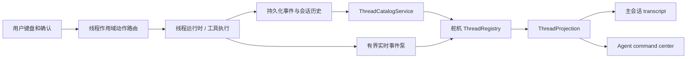

# 舵机（cli）实现方案：终端交互、工具轨迹与 Agent Command Center

> 注：本文为历史方案记录；蜂群编排（swarm / beeroom / 编排态 / hive pack / 工蜂卡）已于本次重构移除，文中相关章节不再对应当前系统能力。

## 1. 目标与边界

本方案将 `wunder-cli` 的 TUI 终端体验整体对齐参考实现的交互范式，同时保持 Wunder 已有的运行时、工具治理、会话存储和多智能体语义。最终用户应能在一个终端中完成以下操作：

1. 以紧凑、连续、可扫描的方式阅读用户轮次、模型输出、推理、工具调用及结果。
2. 在工具仍运行、子智能体仍执行或另一个线程等待输入时，使用 `←` 打开 **Agent command center**，查看所有可访问任务线程的状态，并切换监视目标。
3. 切走一个运行线程后继续接收其事件；回到该线程时看到不丢字、不串线程、顺序正确的实时尾部和历史记录。
4. 在 command center 中按状态、层级、智能体和更新时间定位线程；在宽终端查看详情，在窄终端仍可完成筛选和切换。
5. 继续支持本地 SQLite、离线启动、32 位 Windows 7 与 Ubuntu 18.04，不引入浏览器渲染链路或常驻本地 HTTP/ WebSocket bridge。

“线程”在本方案中始终指一个 `session_id` 对应的独立任务线程。它可以是用户主线程、由子智能体派生的线程，或蜂群工作线程。智能体身份、父线程、派生来源和运行账本是线程元数据，不得把多个线程合并为单一“智能体状态”。

本次不是把参考工程的 TUI 代码复制进来。参考工程采用自身的 app-server 协议、线程类型和渲染框架；Wunder 应复用其布局、状态隔离、稳定调用 ID 和回放策略，并接入自身的 `AppState`、线程运行时、SQLite、`StreamEvent` 与工具契约。

## 2. 现状结论与改造依据

| 范围 | Wunder 当前能力 | 问题 | 方案处理 |
| --- | --- | --- | --- |
| TUI 基础 | 已使用 Ratatui、Crossterm、帧调度、Markdown 流式渲染、滚动记录 | 主界面按单会话 `logs` 建模 | 改为“线程注册表 + 每线程投影 + 当前可见线程” |
| 工具呈现 | 已有补丁、命令、通用工具的 `SpecialLogEntry`，命令会话有输出缓冲 | 通用工具完成时按最后一个同名待完成项寻找，平行调用会错配 | 所有工具卡按 `(session_id, turn_id, tool_call_id)` 原位关联 |
| 命令输出 | 已有命令会话开始、增量、终态和头尾有界输出 | 卡片模型仍耦合当前会话日志 | 命令会话状态移入所属线程投影，离开页面仍持续更新 |
| 会话恢复 | 已有最近会话、历史恢复、统计读取、`/resume` 选择器 | 当前切换受全局 `busy` 和单 `stream_rx` 限制 | command center 使用分页线程目录；运行与可见线程解耦 |
| 多智能体 | 会话记录已有父线程、派生标签和派生者字段；运行时已按线程隔离锁与状态 | 舵机未把这些关系投影为可监视的线程树 | 在目录和详情中显示谱系及子线程聚合状态 |
| 事件持久化 | `stream_events` 有递增事件 ID，运行时已有重放与存储能力 | 舵机使用无界接收器，页面状态未按线程归属 | 有界事件管道、游标、落库后重放和每线程失效标记 |

参考实现中最值得直接借鉴的结构是：command center 不是临时会话列表，而是由持续维护的线程目录驱动；线程切换不取消后台事件监听；工具卡片由调用 ID 原位更新；终端宽度不足时减少元数据而不改变操作路径。

## 3. 目标体验

### 3.1 主会话视图

主视图保持“历史在上、输入在下”的终端对话结构，取消营销化面板和大面积边框。每个逻辑单元之间保留一行呼吸间距；普通消息使用首行符号和悬挂缩进，工具、补丁与命令使用结构化行而不是 JSON 墙。

```text
  › 用户请求文本，可换行并保持悬挂缩进

  • 思考中：简短推理摘要

  • Ran command  command text                         running · 3s
    └ first output line
      following output line

  • Read file  relative/path                           completed
    └ 12 lines · concise result preview

  • 助手回复的 Markdown 内容

  ◌ Working · 8s · Ctrl+C interrupt
  › 输入内容
  ← command center   / commands   @ files       72% context left
```

视觉规则如下：

- 默认前景色承载正文；次要信息使用可读的弱化色；键位采用统一强调色；成功、失败和运行中只使用语义色，不为普通文本硬编码终端主题不保证可读的颜色。
- 用户、助手、推理、工具、错误各有固定且有限的前缀。续行与换行不重复前缀，避免长内容左右跳动。
- 运行中的单元显示单个活动指示符和经过时间；完成后指示符冻结为成功、失败或中断状态，不再重绘整段历史。
- Markdown 继续使用当前最低必要能力。图片、表格、复杂 HTML、公式和大二进制结果显示可读摘要；原始内容仍可复制和导出。
- 输入区底部统一承载快捷键、附件/补全状态和上下文余量。宽度不足时先省略说明文字，再省略低优先级项，始终保留键本身、运行状态和上下文状态。

### 3.2 工具调用与结果

工具卡的目标是让用户一眼知道“正在做什么、是否结束、得到了什么”，而不是暴露全部协议载荷。

| 阶段 | 主行 | 次级内容 | 更新规则 |
| --- | --- | --- | --- |
| 已发起 | `• Calling <工具摘要>` | 必要参数摘要 | 用稳定调用 ID 创建卡片 |
| 流式执行 | `◌ Running <工具摘要> · 已用时` | 命令 stdout/stderr 或进度尾部 | 仅更新该卡片活动尾部，按帧合并 |
| 成功 | `• <动作摘要> · completed` | 最多若干行结果预览、数量或耗时 | 原位替换状态，保留调用摘要 |
| 失败/取消 | `! <动作摘要> · failed/cancelled` | 可行动的错误摘要 | 原位替换状态，保留错误分类 |

具体规则：

- `execute_command` 以 `command_session_id` 与 `tool_call_id` 双向关联。stdout、stderr、pty 分流显示；多命令返回时每个命令会话独立为一张卡，不覆盖同一工具调用下的其他命令。
- 补丁调用显示文件数、增删统计和有限文件列表；详情可显示受控 diff 预览。成功、拒绝、失败和取消是不同状态。
- 文件、搜索、知识、MCP、技能、浏览器和用户自定义工具走统一的 `ToolPresentation` 分类器。分类器输出动作名、参数摘要、结果摘要、预览行、错误与可展开原文，禁止 UI 层按任意 JSON 字段临时拼接。
- 结果预览对条目、行数、字符数和字节数设上限；超出部分显示“还有 N 项/已截断”。原始结果不复制到每个渲染缓存，保存在既有历史或事件来源中，详情页按需读取。
- 并发工具、重试和同名工具必须通过调用 ID 关联，禁止“从后向前找到第一个同名 pending 卡片”的回填方式。
- 历史重放优先恢复结构化工具卡。由于事件保留期已过且仅剩旧工具消息时，降级为只读历史摘要，绝不伪造运行态或完整输出。

### 3.3 Agent command center

在输入框为空、没有确认框/补全框/详情弹层且焦点位于对话输入时，按 `←` 打开 command center；输入不为空时 `←` 始终保留为移动光标。`Esc` 和 `←` 关闭 command center 并回到原线程。另提供一个可配置的显式快捷键和 `/threads` 命令作为发现入口。

宽度不少于 90 列时采用双栏，低于 90 列时退化为单栏；不会因宽度变化丢失筛选或切换能力。

```text
  Agent command center                         Group: Status
  [All 12] [Needs you 1] [Working 3] [Ready 2] [Inactive 6]
  ───────────────────────────────────────────────────────────
    Tasks                                      Task details
  › ● 任务标题                    Working  2m  标题
    ○ 另一线程                    Ready   8m  ● Working
    ! 等待确认的线程              Needs you   智能体、模型、工作目录
                                                父线程 / 派生来源
                                                当前轮次、工具、上下文
                                                最近活动和最后消息摘要

  ↑↓ select  Enter view/switch  Tab filter  / search  g group  r refresh  ? help
```

目录规则：

- 状态页签固定为“全部、需要处理、运行中、就绪、已结束”。状态必须来自统一投影，不能仅凭最后一条文本猜测。
- 默认按最近活动排序；`g` 在“父子谱系、状态、智能体/模型”间切换分组。父子谱系中根线程在前，子线程缩进显示；蜂群工作线程与普通子智能体使用来源标签区分，不混为一类。
- `/` 打开搜索，搜索标题、智能体、会话短标识和工作目录；搜索在服务层分页执行或按当前有界页执行，禁止一次装载全部历史会话。
- `↑/↓`、`PageUp/PageDown` 移动选择，`Tab/Shift+Tab` 切换状态页签，`Enter` 进入选中线程；`r` 仅刷新目录元数据；`?` 显示键位帮助。将来若加入重命名、归档、删除，必须使用显式确认且后端鉴权，不与本轮“监视/切换”绑定。
- 选中运行线程后按 `Enter` 切换为该线程的交互视图；选中非当前线程时，该线程的草稿、滚动位置、活动工具卡和未读计数保持。被其他入口占用写入权的线程以只读监视态打开，并明确提示原因。
- “需要处理”线程的详情显示待回答问题或待授权工具摘要；用户确认后才向该线程提交回应。确认请求必须带线程 ID，不能使用全局队列顺序推断归属。

## 4. 目标架构



### 4.1 运行时统一线程目录

在 `crates/wunder-runtime/` 增加可被本地舵机、蜂窝 façade 和舰体入口复用的线程目录服务。舵机不应自行拼接存储、监控器与运行队列的零散读取逻辑。

建议接口：

```rust
ThreadCatalogService::list(ThreadListQuery) -> ThreadPage
ThreadCatalogService::snapshot(user_id, session_id) -> ThreadSnapshot
ThreadCatalogService::changes(session_id, after_seq, limit) -> Vec<Value>
```

> 说明：`changes` 按 `thread_log_changes.change_seq` 分页返回 durable 变更帧（根治方案唯一 durable 游标，见第 10 节），帧形态与 runtime 共享的 change-frame 一致并携带 snapshot 守卫；transport `event_id` 不参与重连、去重或排序，舵机回放即走这一入口。

`ThreadListQuery` 至少包含用户范围、游标、1–100 的页大小、状态筛选、关键词、父线程筛选和排序键。`ThreadSnapshot` 至少包含以下字段：

- `session_id`、标题、智能体 ID、模型、工作目录、创建/最近活动时间；
- `parent_session_id`、派生标签、派生者、线程类别；
- 归一化的 `ThreadStatus`、运行轮次、是否可写、待处理原因；
- 当前/最近轮次的工具数、上下文用量、最后活动摘要、未读事件计数；
- 目录版本或水位，供舵机判断增量刷新。

> 落地状态（2026-10-07）：已具备 `session_id`、标题、智能体 ID、创建/最近活动时间、`parent_session_id`、派生标签与派生者、归一化 `ThreadStatus`、durable 轮次状态与运行轮次 `user_round`、`turn_status`、工具数、上下文用量与消耗 token、模型轮次、最后活动摘要（运行期取监控阶段行，落定后取该轮持久摘要）、`change_seq` 行级水位与页级 `watermark`，以及类型化 `pending_reason`（approval / user_input）。未具备的两项是**模型名**与**工作目录**：它们不在 durable 会话记录里，属于客户端进程自身的配置，目录服务不伪造来源；蜂巢侧的会话模型解析走智能体配置路径，舵机在 footer 显示自身模型与目录。未读事件计数由客户端用 `change_seq` 与本地 durable 游标相减得出，服务端不猜测客户端读取位置。

状态推导顺序固定为：显式待确认/待回答 > 线程运行时活跃或排队 > 终态错误/取消 > 有可继续上下文的就绪 > 已结束。目录服务读取现有会话元数据、线程运行时、监控投影与持久化尾事件；它是唯一的状态归一化位置。蜂巢、蜂窝和舵机以后可共享相同定义。

### 4.2 舵机 ThreadRegistry

新增 `crates/wunder-cli/tui/thread_registry.rs`，将目前 `TuiApp` 的全局 `session_id`、`logs`、`busy`、`stream_rx`、活动 Markdown 索引和命令会话映射拆为线程作用域状态：

```rust
struct ThreadRegistry {
    active_thread_id: SessionId,
    summaries: PagedThreadSummaries,
    projections: BoundedMap<SessionId, ThreadProjection>,
    streams: HashMap<SessionId, ThreadStreamHandle>,
}

struct ThreadProjection {
    transcript: TranscriptStore,
    draft: ComposerDraft,
    scroll: ScrollAnchor,
    tool_cells: HashMap<ToolCallKey, CellId>,
    command_sessions: CommandSessionDisplayState,
    status: ThreadStatus,
    last_seen_event_id: i64,
    unread: UnreadState,
}
```

要求如下：

- `active_thread_id` 只决定主视图渲染和输入投递目标，绝不决定后台任务是否继续运行。
- `ThreadProjection` 只保留可视历史窗口、稳定已完成块、活动尾块和必要索引。原始历史、完整工具结果和旧事件从现有持久层按需读取。
- 未在内存中的线程仅保留目录摘要。进入该线程时先用快照与游标加载，再订阅或回放到最新水位。淘汰线程投影前写回草稿、滚动锚点和已读游标。
- 不同线程的 `tool_call_id`、`command_session_id`、审批和 Markdown 流都在 `ThreadProjection` 内命名；跨线程绝不共享索引。
- 当前 `busy` 改为 `ThreadRunState`，并以线程为粒度判断。创建新会话、切换、取消和提交输入只检查目标线程状态，不能因另一个线程正在运行而全局拒绝。

### 4.3 有界事件泵与切换回放

现有单个无界 `stream_rx` 必须替换为按线程归属的事件泵。事件泵接收端、网络/运行时读取、投影更新和绘制分离：

1. 运行时先将可重放事件写入现有 `stream_events`，为每个线程维持单调事件 ID。
2. 每个运行线程的接收任务使用有界通道；达到高水位时读取端施加背压，而不是无界堆积或静默丢弃文本。
3. UI 每帧只处理有限数量事件；文本 delta 在约 16–33 ms 内合并到活动尾块。积压时提高单帧处理预算，但仍只重绘受影响线程。
4. 通道断开、投影被淘汰、事件序号跳变或 UI 发现积压过高时，标记该线程 `needs_replay`。重新从 `last_seen_event_id` 拉取分页事件，按事件 ID 去重、补齐并继续。
5. 切换线程时保存旧线程滚动锚点；新线程先显示已稳定内容，再把回放内容作为批次接入。用户停留底部才自动跟随，向上浏览时新输出只增加未读标记。
6. 任何线程收到 `final`、`error`、取消或命令会话终态，都必须立即固化活动尾块、清理该线程的运行句柄，并刷新目录状态。

不得为了降低复杂度使用“切换时取消旧流”“等完整回复后动画播放”“每 token 重建全部消息列表”或“收到事件但只保留最后一条”。

### 4.4 统一投影与工具关联

新增 `crates/wunder-cli/tui/transcript/`，以 `TranscriptCell` 取代主 `app.rs` 中既承载数据又承载渲染缓存的扁平 `LogEntry` 主模型。初期允许以适配层复用既有 Markdown、补丁和命令渲染代码。

建议单元类型：

```rust
enum TranscriptCell {
    UserMessage, AssistantMessage, Reasoning,
    Tool(ToolCell), Patch(PatchCell), Command(CommandCell),
    SystemNotice, Approval, Inquiry, Error,
}
```

`ToolCell` 的主键为：

```rust
struct ToolCallKey {
    session_id: String,
    turn_id: Option<String>,
    tool_call_id: String,
}
```

若早期事件未提供 `tool_call_id`，仅允许创建带临时本地 ID 的 pending 单元；一旦后续事件提供稳定 ID，必须显式迁移其索引。不得再次用工具名和最近位置猜测对应关系。命令会话的多重别名继续复用现有 `CommandSessionDisplayState`，但所有别名映射限定在同一 `ThreadProjection`。

### 4.5 Command center 视图模块

新增以下模块，避免继续把业务堆入 `tui/app.rs`：

- `tui/command_center/mod.rs`：状态、筛选、选择保持和公共动作；
- `tui/command_center/render.rs`：宽/窄布局、页签、列表、详情和帮助；
- `tui/command_center/input.rs`：键位优先级、搜索编辑与关闭逻辑；
- `tui/command_center/rows.rs`：分组、虚拟可视行、列裁剪和相对时间；
- `tui/thread_registry.rs`：目录、投影、订阅、淘汰与切换；
- `tui/transcript/`：单元模型、稳定渲染缓存、工具展示适配器；
- `thread_catalog.rs`：舵机对运行时目录服务的 façade，不直接散落查询存储。

主 `tui/app.rs` 只保留应用编排、顶层键位路由、线程作用域动作调度和生命周期协调。`tui/ui.rs` 根据当前模式在会话视图与 command center 之间选择绘制，不让 command center 变成覆盖在仍可编辑输入框上的脆弱弹窗。

## 5. 分阶段实施节点

### N0：基线、契约和回归样本

**改动**

- 记录当前 TUI 的固定宽度、窄宽度、工具并行、命令流、历史恢复、切换会话和确认流程的 Ratatui TestBackend 快照。
- 定义中文/英文术语、状态枚举、键位优先级和 `ThreadSnapshot` JSON/Rust 契约。
- 选取不含真实身份、密钥、业务名称或本机路径的虚拟事件夹具。

**验收**

- 基线测试可在不连接外部服务的情况下运行。
- 每个夹具含事件 ID、线程 ID、用户轮次、工具调用 ID 和至少一种并发或乱序场景。
- 文档明确新旧术语映射，不存在“会话/线程/智能体”混用。

### N1：运行时线程目录服务

**改动**

- 在 `crates/wunder-runtime/` 实现分页 `ThreadCatalogService` 和状态归一化。
- 基于现有会话记录中的父子关系、线程运行时状态、监控投影和持久化事件尾部生成目录/详情快照。
- 为舵机本地直接调用提供 façade；不通过本机 HTTP/ WebSocket 转发。

**验收**

- 根线程、子智能体线程和蜂群工作线程均能作为独立条目分页返回，并保留父线程关系。
- `running`、`queued`、待确认、失败、取消、就绪和结束态不会因重启或目录刷新闪回错误状态。
- 单页上限不超过 100，关键词和父线程筛选有明确游标语义。
- 舵机、蜂窝/舰体使用同一状态映射测试集。

### N2：线程注册表和有界实时链路

**改动**

- 引入 `ThreadRegistry`、每线程 `ThreadProjection` 和 `ThreadStreamHandle`。
- 将单一 `stream_rx`、全局 `busy`、全局活动 Markdown/命令会话索引迁移到线程作用域。
- 有界事件通道、事件游标、补水、焦点切换、投影淘汰和草稿/滚动锚点持久化落地。
- 将审批、问询、取消与输入动作绑定到明确的线程 ID。

**验收**

- A 线程流式输出期间切换到 B，A 继续完成；返回 A 后文本完整且顺序正确。
- A、B 同时运行同名工具时，每张卡只接收所属线程的结果。
- 事件积压、断线重连或投影淘汰后补齐，不重复、不丢失、不跨线程。迁移前以事件 ID 补齐；按根治方案迁移后以 `change_seq` durable 重放为最终验收真相（见第 10 节）。
- 内存与队列均有上限；达到上限时可通过回放恢复，测试证明没有静默丢字。

### N3：转录单元和 Codex 风格主布局

**改动**

- 建立 `TranscriptCell` 与 `ToolPresentation`；保留现有 Markdown 流式、补丁预览、命令会话头尾缓存为适配实现。
- 将布局改为连续 transcript、活动行、composer 和紧凑 footer；统一弱化文本、键位、高亮、语义状态和宽度裁剪策略。
- 为长消息采用稳定块 + 活动尾块，为历史采用限量加载和按宽度缓存。

**验收**

- 普通对话、Markdown、推理、错误、补丁、工具、命令、确认和问询在 40、80、120 列下均可读，续行不越界。
- 运行中每帧只更新活动尾块；已完成块不因新 token 重新解析。
- 上滚查看历史时位置不跳动；底部跟随只在用户位于底部时发生。
- 现有复制、附件、补全、斜杠命令、鼠标滚动和 Ctrl+C 行为保持可用。

### N4：工具调用卡原位更新

**改动**

- 按 `ToolCallKey` 建立 pending、delta、result 的完整关联索引。
- 将通用工具、补丁、命令、MCP/技能等结果接入统一摘要分类器；结果详情按需读取。
- 命令会话 stdout、stderr、pty 和最终结果合并为同一卡片；支持多命令并行。

**验收**

- 同名并行调用、重试、嵌套子线程调用和乱序 result 都能精确回填。
- 命令流逐步显示，最终结果替换活动尾部但不丢失调用标题、耗时、退出码或错误。
- 大输出、媒体和大 JSON 不导致大对象复制或无界增长；原始内容仍可复制/导出。
- 工具历史重放在可用结构化事件下与实时布局一致，在不可用时诚实降级。

### N5：Agent command center

**改动**

- 实现目录视图、状态页签、搜索、分组、双栏详情、窄屏退化、快捷键帮助和显式刷新。
- 实现 `←` 的上下文保护：仅空输入、无弹层时打开；其余情况保留编辑语义。
- 实现 `Enter` 线程切换、只读监视标志、未读提示和返回原视图。

**验收**

- 在一个运行线程、一个等待确认线程、一个子线程和一个已结束线程同时存在时，状态页签计数正确，筛选与切换准确。
- 90 列及以上有目录/详情双栏；低于 90 列自动单栏；低于最小终端尺寸给出可读缩放提示，不崩溃。
- 切换不会取消未选中线程；返回后草稿、滚动位置、运行卡和未读计数符合预期。
- `←` 不会劫持非空输入的光标左移、确认框、搜索框或工具详情中的左移操作。

### N6：多智能体语义、压测和发布门禁

**改动**

- 在目录详情显示父线程、派生者、线程类别、子线程计数和聚合状态；子智能体与蜂群工具保持语义区分。
- 做多线程流、历史回放、窗口 resize、离线 SQLite 启动和 Win7/Ubuntu 构建验证。
- 完成用户帮助、开发说明和功能迭代记录。

**验收**

- 子智能体是临时工作单元、蜂群调用已存在智能体的边界在 UI 标签和详情中清晰可见。
- 多线程高频 delta 下 UI 输入、选择、复制和滚动保持响应；任何一个线程异常不会使其他线程状态失效。
- Windows 7 x86 和 Ubuntu 18.04 目标构建通过；不引入不受支持的终端、浏览器或系统依赖。
- 所有新增状态、快捷键、降级行为和已知上限在帮助文本中可发现。

### N7：终端呈现样式完全对齐 Codex（呈现规范化）

N1–N6 完成的是"正确的数据与结构"；N7 把呈现像素级对齐 `D:\proj\参考\codex-main` 的 TUI 基线（用户以 codex 实截图为验收样张）。2026-10-02 差距盘点的结论是：事件→呈现链路架构与 codex 同构（帧调度合并、单元模型、可视窗口渲染、原生 scrollback、游标回放均已是业界标准做法），差距集中在**呈现层格式细节**，逐项清单与精确模板见第 11 节。

**改动**

- 修复 Working 行渲染门控：`draw_activity` 仅在 `activity_highlighted()` 时调用导致普通流式期间活动行空白，改为线程运行期间始终绘制；计时改为 `1m 53s` 紧凑分秒格式；中断键位提示改为 `esc`。
- 命令卡对齐：成功/失败 bullet 语义色（绿/红 bold）；失败头部内联 `Failed (exit N)`；输出尾部首行 `└` 引导、续行 4 空格悬挂缩进；折叠提示改为 `… +N lines (ctrl+t to expand)` 式样。
- 新增转录展开视图：`Ctrl+T` 打开当前线程转录 overlay（全量命令输出、`$ ` 前缀命令、`✓/✗ (exit)` 结果行），同键收起；命令卡与工具结果卡的折叠提示指向该入口。
- 补丁/编辑卡对齐：头部 `Edited <path> (+N -N)` / `Edited N files`；内联 diff 增加行号 gutter、hunk 间 `⋮` 分隔、暗/亮双通道底色与 ANSI-16 无背景降级；增加 `+ Show details` / `− Show less` 折叠披露；完成后补丁卡必须保留 diff 预览（不得退化为纯文件清单）。
- composer/footer 对齐：占位符与背景填充风格、`›` 提示符 bold；footer 增加任务标题与 `? for shortcuts`；新增 `⚠ N warnings · f2 to view` 警告条（含窄屏三级收缩）；将 `ui/status_line.rs` 死代码接入或移除。
- 连续只读命令（读文件/列目录/搜索）合并为 `• Exploring` 组卡，子项标题用强调色；用户消息前缀评估改为 `▌ ` 两列样式。

**验收**

- 与 codex 实截图逐项对照：命令成功/失败卡、编辑卡内联 diff、Working 行、composer/footer 四个区域在 80/120 列下格式一致；40 列降级顺序符合第 11 节规定。
- `Ctrl+T` 展开/收起不丢失滚动位置，展开视图中原始输出完整可复制。
- 无真彩、无色、减动画终端下：diff 退化为纯前景色、动画退化为静态符号，所有状态仍可由文本与符号区分。
- 全部新格式有 Ratatui TestBackend 快照测试覆盖（40/80/120 列），快照夹具使用脱敏虚拟内容。

## 6. 性能、可靠性与数据完整性门槛

| 项目 | 强制门槛 |
| --- | --- |
| 目录读取 | 分页，单页 1–100 条；UI 只渲染可视行及少量预取，不全量加载所有会话 |
| 内存 | 目录摘要、线程投影、工具预览、命令输出、事件队列都必须有上限；完整原文按需读取 |
| 流式刷新 | token/delta 在约 16–33 ms 合并；不为每个 token 重建全 transcript 或完整 Markdown |
| 事件完整性 | 通道背压 + durable 游标 + 补水；不得以丢弃文本作为常态降压策略。现状按事件 ID 去重，迁移后以 `change_seq` 为唯一 durable 真相，ephemeral 增量允许丢弃（见第 10 节） |
| 切换 | 保存每线程草稿/滚动锚点；只加载目标线程必要窗口；后台线程持续归档事件 |
| 锁 | 线程目录读取不持有长时间全局锁；运行、审批、取消和状态均按 session ID 隔离 |
| 重放 | 使用事件游标去重；完成块稳定，活动尾块增量更新；保留期外有诚实降级 |
| 可访问性 | 无颜色终端仍能由符号和文本区分状态；不依赖鼠标；所有关键操作有键位入口 |

建议的负载门禁：同时存在至少 20 个目录线程、4 个活跃流、每个活跃线程持续产生文本和工具事件时，输入响应、切换和滚动不能被阻塞；断开一个事件通道后恢复应只补对应线程，且不重复任何稳定消息或工具卡。

## 7. 测试矩阵

| 层级 | 用例 | 通过条件 |
| --- | --- | --- |
| 运行时单元测试 | 状态归一化、父子关系、分页/游标、关键词、目录水位 | 状态优先级固定；没有跨用户或跨线程条目 |
| TUI 单元测试 | `ToolCallKey` 关联、临时 ID 迁移、命令别名、多工具并发、输出截断 | 每个 result 只更新一个正确单元；头尾摘要稳定 |
| TUI 快照测试 | 40/80/120 列主视图、工具成功/失败、command center 宽/窄布局、帮助与空态 | 无越界、无 ANSI 依赖、列裁剪稳定 |
| 事件测试 | 积压、断线、重连、重复事件、事件跳号、切换时 delta | 通过游标回放后内容完整且无重复 |
| 集成测试 | A 运行→切 B→A 完成；待确认线程处理；父子线程与蜂群线程同时存在 | 不取消后台线程，不串屏，不丢草稿/滚动位置 |
| 兼容测试 | SQLite 离线启动、Win7 x86、Ubuntu 18.04、窄终端、无色终端 | 编译运行通过，降级文案可读 |

快照夹具和测试输出一律使用虚构、脱敏的线程名、文件名、命令和内容，不写入真实身份、密钥、业务名称或本机绝对路径。

## 8. 实施顺序、迁移与完成定义

N1、N2 是 N3–N5 的前置条件：在没有线程目录、线程作用域状态和可补水事件管道前，不开始把 command center 做成可切换界面。N3 与 N4 可并行推进，但 N4 合入前必须完成稳定调用 ID 关联。N5 在 N2、N3、N4 均通过后接入。N6 是发布门禁，不以视觉完成代替多线程可靠性验证。

迁移期间可保留旧 `/resume` 作为 command center 的兼容入口，但它应委托同一 `ThreadCatalogService` 和同一切换动作；完成后删除重复的单会话选择器逻辑。旧 `LogEntry`、全局 `busy`、单 `stream_rx` 和按工具名反向搜索 pending 项的路径应在迁移完成后移除，避免两套状态机长期并存。

完成的定义是：舵机在本地运行时能同时监视多个独立任务线程；`←` 能可靠打开 command center 并进入任一可访问线程；运行中的工具和输出以稳定卡片呈现；切换、重放、并发、确认与子线程场景均通过上述测试矩阵；所有队列、缓存、分页和降级行为满足本仓库性能与兼容要求。

## 9. 参考代码阅读索引

后续实现时可对照参考工程的以下相对模块，提取交互原则而非复制协议实现：

- `codex-rs/tui/src/app/agent_center/`：command center 的键位、行列表、宽窄布局、详情栏和帮助；
- `codex-rs/tui/src/app/agents_overview_threads.rs`：线程目录的增量维护与刷新；
- `codex-rs/tui/src/app/thread_event_buffer.rs`：按线程缓冲、切换回放与顺序控制；
- `codex-rs/tui/src/history_cell/`：消息、命令、补丁、MCP 工具的稳定单元呈现；
- `codex-rs/tui/src/chatwidget/rendering.rs` 与 `styles.md`：连续 transcript、composer、快捷键与终端配色准则；
- `crates/wunder-cli/tui/app.rs`、`command_session_display.rs`、`tool_display.rs`、`tui/markdown_stream.rs`：应复用或迁移的 Wunder 现有能力；
- `crates/wunder-runtime/src/services/stream_events.rs`、线程运行时和会话存储：目录服务与可回放事件的权威来源。
- `docs/聊天流式管线根治方案.md`：聊天流式 durable 游标（`change_seq`）、durable/ephemeral 分工、原子快照与单 reducer 的正确性基线（见第 10 节）。

N7 呈现对齐（第 11 节）另需精读的参考文件（2026-10-02 盘点核实）：

- `codex-rs/tui/src/exec_cell/render.rs`、`compact.rs`、`transcript.rs`、`model.rs`：命令卡头部/输出尾部/折叠提示/展开视图与多命令合并的权威实现；
- `codex-rs/tui/src/diff_render.rs`：内联 diff 的行号 gutter、双通道底色、ANSI 降级与宽度策略；
- `codex-rs/tui/src/history_cell/patches.rs` 与 `activity_preview.rs`：补丁卡与紧凑预览（`DETAIL_PREVIEW_LINES=3`）；
- `codex-rs/tui/src/status_indicator_widget.rs`（含 `timer.rs`）：Working 行精确拼接、`fmt_elapsed_compact` 分秒计时与 32ms/1000ms 双档刷新；
- `codex-rs/tui/src/transcript_view/layout.rs` 与 `disclosure.rs`：`+ Show details`/`− Show less`/`+ N lines (ctrl+t to expand)` 折叠披露；
- `codex-rs/tui/src/bottom_pane/footer.rs`、`chat_composer.rs`、`chat_composer/warning_notice.rs`：footer 字段组装、折叠顺序与 `⚠ N warnings · f2 to view` 警告条；
- `codex-rs/tui/src/style.rs`、`motion.rs`、`ui_consts.rs`、`keymap.rs`：语义色/键位样式/动画降级/前缀常量与默认键位。


## 10. 聊天流式游标对齐：《聊天流式管线根治方案》带来的新要求（待独立迁移）

`docs/聊天流式管线根治方案.md` 把“一会话、一份线程日志、一个 durable 游标 `change_seq`、一条确定性渲染路径”确立为用户聊天流式的唯一正确性基线，并明确只改用户聊天 WebSocket 的 v2 主路径；`orchestrator.stream()` 的其他消费者（含舵机）在**单独审计与迁移前保持原行为**。因此本方案以下现状应作为“预迁移基线”保留，在独立迁移节点完成对齐，不得据此宣布聊天流式已按根治方案验收：

- **durable 游标**：迁移前用 `stream_events.event_id` 作为重放/去重/排序的游标（`last_seen_event_id`、`replay_from`、`applied_event_ids`、目录服务的 `events(after_event_id)` 分页）。根治方案要求唯一 durable 游标是 `thread_log_changes.change_seq`；transport `event_id` 只保留于 v1 兼容，绝不参与 v2 重连、去重或排序。**已迁移（2026-10-07）**：`ThreadRegistry` 回放游标按 `change_seq` 水位推进，目录服务不再暴露 `after_event_id` 分页、改为 `changes(session_id, after_seq, limit)`，`ThreadSnapshot` 携带行级 `change_seq` 与页级 `watermark`；`last_seen_event_id`/`replay_from` 仅作 v1 残留字段保留（后者只在测试内可观测）。
- **durable / ephemeral 分工**：token delta 属可丢弃的 `thread_item_tail`（按 `(item_id, field, offset, base_seq)` 分片、有界），最终正确性由 durable `text_block` 重放保证。“不丢字 / 不串线程”必须以 durable 重放为验收真相；tail 未达其 `base_seq` 前不得应用，切换 item/field 前需提交旧 tail。
- **身份与顺序由服务端定义**：转录/工具单元的顺序来自持久化 `created_seq`/`item_index`，身份来自稳定 `item_id`，不使用客户端到达顺序、字符串匹配、评分或 localeCompare 推测关系（与本方案 N3/N4 已推进的稳定 `ToolCallKey` 方向一致）。
- **原子快照 + cursor 守卫**：进入线程的快照须与服务端在同一读事务取得并携带 snapshot cursor；客户端只接受 `snapshot_cursor >= 本地 lastSeq` 的快照，快照后从该 cursor 续看。
- **单 reducer**：`ThreadProjection` 只从 durable 帧做幂等折叠 + 按 offset 校验的 tail，不在渲染路径引入多条写入路径或启发式合并。

该迁移作为舵机的独立追加节点写入完成定义：舵机聊天流式的断线续传、去重、排序与快照恢复结果，须与该会话按 `change_seq` 重放的 durable 帧逐文本一致，并复用 runtime 的 session commit API（根治方案 M1-A）与原子快照/feeder（M1-C/M2-C）。

### 实施进展（2026-10-01）

- **ThreadRegistry durable 游标迁移完成**：`ThreadProjection` 新增 `last_change_seq`/`applied_durable_seqs`/`last_durable_replay_attempt` 字段与方法；`ThreadRegistry` 新增 `durable_cursor`/`mark_durable_applied`/`mark_durable_replay_attempt`/`replay_in_suppression_window`/`clear_durable_heal_state` 访问器；`clear_replay` 改为调用 `reset_durable_replay_suppression()`（保留 idempotency 守卫）。transport `event_id` 不再参与重连、去重或排序。
- **replay_thread_events_if_needed 迁移完成**：从旧 `load_thread_changes`/event_id 迁移到 `try_load_thread_changes` + 纯 `change_seq` watermark + 有界循环（`REPLAY_PAGE_SIZE=200`，`MAX_REPLAY_PAGES=4`）+ snapshot 守卫（`thread_snapshot_required` → `reload_transcript_from_history`）+ 1000ms resume 抑制。新增 `apply_durable_heal_frames`（只 heal `item_upsert` 内嵌 item 的 authoritative content/reasoning，分类 Assistant/Reasoning，内容包含双写守卫）与 `reload_transcript_from_history`。
- **共享 feeder 接入（2026-10-07 完成）**：舵机此前只通过目录 façade 的 `changes()` 分页取 durable 帧，**并未**挂 runtime 共享 feeder；现按 M1-C 直连 `watch_thread_changes`，`ThreadChangeFrame::{Change,SnapshotRequired,Overflow}` 三类帧都有明确归宿（折叠 / 原子快照 reload / 停止订阅转有界回放），一线程一条通道，重复挂接替换旧通道，杜绝双推。
- **验证状态（2026-10-07）**：`cargo test -p wunder-cli` → 256 passed / 0 failed；`replay_reapplies_from_cursor_without_duplicates` 已通过（上一条记录的 1 failed 是当时 `apply_durable_heal_frames` 读错帧形状所致，见下）。
- **剩余节点**：无 §10 待办。真正的剩余项是平台门禁与人工验收：Windows 7 x86 与 Ubuntu 18.04 构建产物上的真终端多线程序（快照测试证明帧内容一致，不证明终端兼容性）。M1-A/M4 对舵机的要求是「不得新增绕过 session commit API 的写入口」，当前舵机对 `thread_items`/`thread_turns`/`thread_log_changes` 零直写（只有引擎写），该不变量由代码边界保证。


## 11. 终端呈现对齐 Codex 规范（N7 依据）

2026-10-02 对照 `D:\proj\参考\codex-main`（`codex-rs/tui`）与 wunder 舵机现状逐项盘点。总体结论：事件→呈现链路**架构与 codex 同构**——帧调度合并（`frame_scheduler.rs` ≈ codex `FrameRequester`，均钳制 120fps）、单元化转录（`TranscriptCell` ≈ `HistoryCell`）、按可视窗口渲染并缓存、溢出归档原生 scrollback（`scrollback::insert_history_lines` ≈ `insert_history.rs`）、按游标回放——这些均是 codex/同类智能体终端的业界标准做法，无需重构；差距集中在呈现层格式。以下为逐项差距与目标模板，N7 按此执行。

### 11.1 差距清单（现状证据 → 目标）

| # | 区域 | wunder 现状（证据） | codex 目标 |
| --- | --- | --- | --- |
| 1 | 命令卡头部 | 标题词一致（`Ran/Failed`，patch_log.rs:978-990），但 exit code 在输出区 `  │ exit=1, 123ms` 行（:1000-1016）；完成一律 `• ` 前缀 | 成功 `•`绿bold / 失败 `•`红bold；失败头部内联 `Failed (exit {N})`bold（exec_cell/compact.rs:81-108）；探索组失败追加 ` · {n} failed`红 |
| 2 | 输出尾部前缀 | `  │ ` 管道前缀（patch_log.rs:769-771） | 首行 `  └ `dim + 续行 `    `（render.rs:566-571） |
| 3 | 折叠提示 | 静态 `... +{N} lines, truncated`（:1651-1664），无任何展开交互 | `… +{N} lines (ctrl+t to view transcript)`dim（render.rs:304-311, ui_consts.rs:12）；折叠披露 `+ {N} {lines} (ctrl+t to expand)`（transcript_view/layout.rs:38-53） |
| 4 | 展开视图 | 无（全仓库无 ctrl+t/expand 处理） | `Ctrl+T` 转录 overlay：`$ `品红命令前缀 + 全量输出 + `✓/✗ (exit) • {duration}` 结果行（exec_cell/transcript.rs:27-65；keymap.rs:1647） |
| 5 | 编辑卡 | 有内联彩色 diff（patch_log.rs:643-759 + theme.rs 真彩底色，仅 pending 构建后继承）；无行号、无详情入口；完成后可能退化为文件清单 | 头部 `{Added\|Deleted\|Edited} {path} (+{n}绿 -{n}红)`（diff_render.rs:450-481）；行号 gutter 右对齐、hunk 间 `⋮`dim（:884-983,661-670）；暗/亮双通道底色 + ANSI-16 纯前景降级；`+ Show details`/`− Show less` 折叠披露；紧凑预览 3 行 |
| 6 | Working 行 | 格式串存在但 `draw_activity` 被 `activity_highlighted()` 门控（ui.rs:18,33 + app.rs:676-683），**普通流式期间不渲染**；计时整秒；键位 ctrl+c | 运行期间始终显示 `• Working ({elapsed} • esc to interrupt)`dim + shimmer 动画；`fmt_elapsed_compact`：`{n}s`→`{m}m {ss}s`→`{h}h {mm}m {ss}s`（status_indicator_widget.rs:76-89,235-266）；32ms/1000ms 双档自调度刷新 |
| 7 | composer/footer | 占位符单行 dim 无边框；footer 左侧 模型·目录·`← command center /threads`，右侧 `N% context left`（composer.rs:126-151）；无任务标题、无 `? for shortcuts`、无警告条；`ui/status_line.rs` 为死代码未接线 | 占位符 `"Ask Codex to do anything"`dim + 背景填充 + `›`bold 提示符；footer：`{model} {effort}` · 工作目录 · 任务标题 ＋ `← for agents · ? for shortcuts`；右 `N% context left`；`⚠ {N} warnings · f2 to view` 暗琥珀警告条（warning_notice.rs:15-25, style.rs:189-202）；窄屏折叠顺序见 footer.rs:388-570 |
| 8 | 只读命令分组 | 无分组，每命令一张卡 | 连续 Read/List/Search 合并 `• Exploring`组卡，子项 `  └ ` 缩进 + accent 色标题（render.rs:313-448） |
| 9 | 用户消息前缀 | `• ` 前缀 | `▌ ` 两列前缀（ui_consts.rs:3-10） |
| 10 | 推理呈现 | 始终展开的 DIM markdown | 折叠式 reasoning 摘要（"Thought for" 风格），差异放状态行 details（`  └ ` 最多 3 行） |

### 11.2 呈现模板基线（验收样张对应）

```text
• Ran cargo test --workspace                       ← 成功：• 绿 bold，命令 bash 高亮
  └ test result: ok. 176 passed                    ← 首行 └ 引导，续行 4 空格
    （后续输出行）
  … +84 lines (ctrl+t to view transcript)          ← dim 折叠提示

• Failed (exit 1) cd frontend; npx playwright …    ← • 红 bold + Failed (exit N) bold

• Edited src\main.rs (+12 -3)                      ← +n 绿 / -n 红
  33 -   }).observe(document.documentElement, …    ← 行号 gutter + 红/绿底色行
  33 +   }).observe(document, …)
  ⋮                                                ← hunk 间 dim 分隔
  + Show details                                   ← 折叠披露；展开为 − Show less

◌ Working (1m 53s • esc to interrupt)              ← 运行中始终可见，shimmer/呼吸

› Ask Codex to do anything                         ← bold 提示符 + dim 占位符 + 背景填充
  {model} {effort} · {cwd} · {任务标题}            ← footer 左侧
  ← for agents · ? for shortcuts   ⚠ 2 warnings · f2 to view   N% context left
```

符号语义色表（对齐 codex `styles.md`/`style.rs`）：`•`dim=中性运行、`•`shimmer/呼吸=进行中动画、`•`绿bold=成功、`•`红bold=失败、`✘`品红bold=补丁失败、`✓/✗`=transcript 结果、`⚠`=警告（琥珀强调计数）、`⌗`类结构符（`└ │ ⋮`）一律 dim；避免 blue/yellow 前景，无色终端全部回落 Reset 且 diff 无背景。

### 11.3 实施与验收约束

- 呈现改动只动渲染层（`patch_log.rs`、`ui/`、`theme.rs`、`app.rs` 绘制门控），不改事件语义与 `ToolCallKey` 关联；展开视图读取的原始输出来自既有命令会话状态，不复制大对象。
- 用户截图样张与参考实现措辞存在版本差异（如 `ctrl+t to expand` 与 `ctrl+t to view transcript`）：以**样张措辞为准**实现，参考实现的折叠/降级逻辑照搬。
- 每个格式点的修改配 TestBackend 快照（40/80/120 列）与无色/减动画变体；快照夹具使用脱敏虚拟内容。


## 实施进度补充：线程显示状态隔离（待集成验证）

- 切换线程以移动所有权方式缓存日志、工具调用索引、命令输出状态、活动 Markdown 收集器、轮次指标、询问面板、草稿和附件；缓存命中不再重读历史。最多保留 31 个后台显示窗口及 1 个当前窗口；容量满时优先淘汰无流且无审批的窗口，全为受保护窗口时拒绝新切换并保留当前界面。
- 首次访问线程先读取历史，失败不移动原线程状态。切回时恢复所有待审批请求，消费剩余后台事件后再读取新事件，避免只处理前 512 条导致积压永久滞留。
- 本节点验收：A 线程命令持续输出时切至 B，再切回 A，命令卡原位追加且无跨线程内容；两线程同名工具、相同调用 ID 不互相覆盖；连续两条审批均可回应；草稿附件及长粘贴占位符随线程恢复；历史读取失败保持当前界面；缓存容量到界仍可切回已有线程。
- 验证状态：已执行 cargo check，当前被 runtime 线程日志存储接口的参数与实现不一致阻塞；尚未通过本节点集成编译及交互验收。该记录不代表整体方案完成。后续仍须完成 TranscriptCell 与实际渲染同步、全局分页搜索、回放缺口检测以及跨平台终端验收。


### 后续验证进展

- 当前工作树 `cargo check -p wunder-cli` 已通过，前述 runtime 编译阻塞已解除；此结论仅覆盖编译，不替代交互、性能或跨平台验收。
- Command Center 不再把当前可见线程等同于运行线程；审批优先于运行状态展示，状态筛选和计数随事件刷新。列表使用有界可见窗口，选择保持可见，行宽按终端列数截断。详情新增待审批数、积压事件数、流状态和回放标识。
- 回放修复双重去重和直接事件封装解析；按实际应用游标分页补齐，完成或错误消息延后至所属线程积压事件处理完成。保留期缺口检测仍待完成。


### 转录单元统一进展

- 前一节点 `cargo test -p wunder-cli --bin wunder-cli tui:: --no-fail-fast`：103 项通过。
- 实际日志单元改为 `TranscriptCell`，保留结构化工具内容和 Markdown 缓存；渲染、增量更新、工具结果回填及线程窗口保存使用同一份单元，移除只在创建时追加、此后不更新的纯文本 `TranscriptStore` 副本。
- 这是 N3 的数据源统一步骤，尚不代表 N3/N4 全部验收完成；类型化审批/询问单元、长文本增量预算以及完整工具调用键仍需按原节点逐项验证。


### 工具调用键与目录服务收敛进展（2026-09-29）

- **N4 工具卡关联**：结果回填全面改用 `ToolCallKey { turn_id, tool_call_id }`（会话作用域由线程视图状态隐含）。补丁、命令与通用工具的完成函数不再使用“从后向前找第一个同名 pending 卡片”的反查路径；无稳定 ID 的调用卡进入有界临时队列（上限 32），结果携带稳定 ID 时显式迁移索引，完全无 ID 的流按到达顺序消费，同名并行调用在携带 ID 时不串卡。跨卡索引随日志裁剪同步调整。
- **回放保留期缺口检测**：因 token delta 占用事件 ID 但不持久化，ID 相邻跳变是常态，不能作为缺口信号；现以“投影已应用过事件但持久事件水位为 0”为诚实信号，出现时明确提示实时事件超出保留期并降级为会话历史展示。
- **N1 目录服务修正**：关键词搜索从“分页后过滤”改为服务层分页执行（有界扫描最多 10 页 × 100 条，扫描外的匹配不返回）；`ThreadCatalogService::snapshot` 改为按会话 ID 直接读取并用父线程筛选统计子线程数，不再用搜索模拟。存储层新增 `count_child_chat_sessions` 批量子线程计数（SQLite/PostgreSQL 双实现，`UserStore` 委托）。
- **N5/N6 呈现**：命令中心搜索按 Enter 后走目录服务查询（本地输入仍对已加载页即时过滤）；详情栏新增“子线程”计数。类型化审批/询问单元已由 `LogKind::Approval` / `LogKind::Inquiry` 承载（`!` / `?` 前缀）。
- 验证状态：`cargo check --workspace` 通过；`cargo test -p wunder-cli` 169 项通过（含新增 ToolCallKey/临时卡匹配测试），`cargo test -p wunder-core --lib` 80 项通过；`cargo test -p wunder-runtime` 存在 15 项与本方案无关的既有失败（tools/catalog、prompting、worker_card 区域，属并行开发中的路径解析与文案断言）。剩余发布门禁：多线程高频 delta 压测、Windows 7 x86 与 Ubuntu 18.04 目标构建仍待执行。

### N6 压测与帮助可发现性进展（2026-09-30）

- **多线程高频压测落地**：新增 `tui/thread_registry_load_tests.rs` 三个门禁测试——① 24 个目录线程 + 4 条活跃流高频灌入：单帧抽取预算被严格遵守、后台线程未读计数准确、队列越界时 `needs_replay` 与诚实游标（`last_applied_event_id`）正确置位；② 4 条流各 300 事件的模拟帧循环：切换线程不打断生产者，最终逐线程 300 事件全部到达、无重复、无乱序；③ 回放重放 1..=128 且 1..=64 已应用：仅补齐缺失的 64 项，`clear_replay` 后状态复位。测试只依赖有界注册表结构，不需要模型连接。
- **帮助可发现性**：composer footer 新增 `← 线程中心 /threads` 提示项（窄终端时先截断说明文字、保留键位，符合 §3.1 降级顺序）；`/threads` 与 command center 内键位帮助此前已覆盖。
- 验证状态：压测已编写并注册，等待并行开发中的 wunder-runtime thread-log store trait 扩展（`thread_snapshot`/`upsert_thread_text_block` 返回值变更）在测试 feature 集下编译收敛后执行；本记录不代表 N6 发布门禁完成，Win7 x86 与 Ubuntu 18.04 目标构建仍待执行。

### N6 门禁收口与 I5 快照 reload 进展（2026-10-02）

- **压测两项遗留失败修复，套件零失败**：`switching_threads_keeps_background_streams_and_recovers_fully` 此前从未通过——`#[tokio::test]` 默认单线程 runtime 下帧循环全部为同步 `try_recv`、无任何让位点，生产者任务得不到调度；循环结束后先 `producer.await` 再排水构成死锁（生产者阻塞在已满通道的 send 上，无人消费）。修复：帧循环每帧 `yield_now().await`（对应真实帧循环的 await 间隙），尾部改为"排水直到全部通道关闭（期间让位）再 join"。`replay_reapplies_from_cursor_without_duplicates` 此前建模遗漏溢出幸存队列：溢出后队列仍保有 `MAX_PENDING_EVENTS` 条未消费事件，回放阶段被全部计入新增；修复为先按真实帧循环语义消费并标记幸存队列，再统计回放流新增。两项修复后全套 `cargo test -p wunder-cli --bin wunder-cli` **176 通过 0 失败，不再需要 `--skip switching_threads`**。
- **I5 原子快照全量 reload 落地（舵机侧）**：workspace façade 新增 `try_load_thread_snapshot`，复用存储层 `thread_snapshot`（同一读事务返回 `{cursor,turns,items,blocks,item_total}`）；`replay_thread_events_if_needed` 的快照守卫分支改为 `reload_transcript_from_snapshot`：仅接受 `cursor >= 本地 durable 水位` 的快照（过期快照按"无可回放"处理保留本地状态），命中时以 `snapshot_history_records` 投影 user/assistant/reasoning 会话条目（按 `created_seq,item_index` 排序，tool/approval/model_call 条目如实降级为保留期提示），随后推进 `change_seq` 水位、复位 heal 状态并清除回放信号；读取失败保留 `needs_replay` 待下次 resume 重试。基于旧会话历史的 `reload_transcript_from_history` 降级路径已删除。
- **文档勘误**：2026-10-01 进度中"舵机通过 runtime 共享 feeder `watch_thread_changes` 获取 durable 帧"与代码不符——该 feeder 目前仅被 runtime `ws_helpers`（chat_ws v2 主路径）消费，CLI 回放实际通过存储分页 `try_load_thread_changes`（spawn_blocking）取得 durable 帧，帧形态与 feeder `ThreadChangeFrame` 对齐。feeder 直连仍是 §10 剩余节点（start 基线 3.2）的一部分。
- **平台构建门禁评估**：跨平台构建基建已存在——`build-windows-win7-x86` CI job（`builders/build-win7-cli.ps1`，目标 `i686-win7-windows-gnu`，离线 nightly-2026-03-14 gnu 工具链 + msys2 i686 mingw）与 `builders/build-cli-linux-amd64-offline.sh`（Ubuntu 18.04 sysroot 交叉编译，glibc 上限 2.27）。本开发机（rustc 1.95.0 msvc host，仅有 x86_64 mingw）缺少已准备的离线工具链包与 18.04 sysroot，门禁按设计经由 CI 或先跑 prepare 脚本执行；本机直跑不在本轮范围。
- **仍待完成**：feeder 直连与 start 基线（§10 3.2）、慢客户端 `stream_overflow`（3.4）、子智能体同 commit API（M4）、真实终端下的多线程交互验收，以及经 CI 的两个平台目标构建产出。

### 呈现样式对齐盘点与 N7 立项（2026-10-02）

- **架构结论**：对照 codex-rs/tui 逐项核实，wunder 舵机事件→呈现链路与 codex 同构（帧调度合并钳制 120fps、单元化转录、可视窗口渲染+缓存、溢出归档原生 scrollback、按游标回放），属业界标准做法，无需重构。
- **呈现差距**：呈现层为部分对齐，共 10 项差距（详见 §11.1），关键项：① 无任何展开交互（codex 为 Ctrl+T 转录 overlay）；② 失败 exit code 不在头部；③ diff 无行号 gutter、无 `+ Show details` 披露、完成后可能退化为文件清单；④ **Working 行被 `activity_highlighted()` 门控，普通流式期间实际不渲染**（功能性缺陷）；⑤ footer 缺任务标题、`? for shortcuts`、`⚠ N warnings · f2 to view`，`ui/status_line.rs` 为死代码；⑥ 无 Exploring 只读命令分组；⑦ 用户前缀/推理折叠差异。
- **方案更新**：新增 N7 节点（呈现规范化，含修复 Working 行门控缺陷）、§11 呈现规范基线（差距表、呈现模板、符号语义色表、实施约束）、§9 补充 N7 精读文件清单。N7 验收以用户提供的 codex 实截图为样张，措辞以样张为准。
- 本记录为盘点与立项，不代表 N7 已实施。

### N7-A/N7-B 落地：命令卡、Ctrl+T 转录视图、编辑卡披露（2026-10-07）

对应 §11.1 的第 1–5、9、10 项，以及第 7 项的 footer 与死代码部分。

- **命令卡（差距 1/2/3）**：头部改为 `• Ran <cmd>` / `• Failed (exit N) <cmd>` + dim 耗时（成功绿 bold、失败红 bold、待执行用呼吸指示），exit code 从输出区移入头部；输出尾部首行 `  └ ` 引导、续行 4 空格悬挂缩进（移除 `  │ ` 管道前缀与中间塌缩助手）；折叠改为渲染期发生——正文只出 preview 行并插 `⋮ +N lines`，卡片内存由 `OUTPUT_WINDOW_LINES=120 / OUTPUT_WINDOW_CHARS=12_000` 有界。
- **Ctrl+T 转录视图（差距 4）**：新增 `tui/app/transcript_view.rs` + `tui/ui/transcript.rs::draw_view`。模态阅读层，所有卡片按展开态渲染，`↑↓/PgUp/PgDn/Home/End/滚轮` 滚动、`Ctrl+T` 或 `Esc`/`q` 关闭；视图关闭时只认领 Ctrl+T，其余按键仍归输入框与转录滚动；重建范围限制为最近 120 条且 2000 行上限，缓存随 `invalidate_transcript_metrics()` 一起失效；视图打开期间强制接管鼠标滚轮（`mouse_capture_enabled` 包含视图态），banner 让位给转录。
- **编辑卡（差距 5）**：`Edited/Added/Deleted <path> (+N -N)` 头部与完成后继承 diff 预览此前已具备；本轮补齐行号 gutter（`@@ -a,+b` 可解析时按旧/新文件给出右对齐 5 列，被窗口截掉的行继续计数，裸 `@@` 的 apply-patch 形态整块不出现槽列也不编造数字）、`⋮` 跳过标记（数据窗口 note 与渲染折叠共用同一符号）、`+ Show details (enter)` 披露；diff 数据窗口由 8 行抬到 40 行（`PATCH_DIFF_WINDOW_LINES`），折叠只发生在渲染期，否则卡片永远没有可展开的内容。
- **推理折叠（差距 10）**：非流式 `Reasoning` 只保留 3 行 + `⋮ +N lines` + `+ Show thinking (enter)`；流式中的思考块不折叠以保连续性。度量侧 `reasoning_folded_rows` 与渲染侧 `fold_reasoning_lines` 由一条断言测试锁定，避免"折叠改了渲染却忘了改度量"导致滚动上界漂移。
- **展开态与缓存一致性**：新增 `expanded_cards`（有界索引集，随日志裁剪/清空/快照 reload 复位），渲染与度量统一问 `card_is_expanded(index)`（= 视图打开 或 该卡被 Enter 展开）；视图开闭、Enter 切换均调用 `invalidate_transcript_metrics()`，否则转录缓存会拿视图留下的展开行当主视图命中。
- **footer 与符号（差距 7/9）**：composer 提示行末尾加 `? 快捷键 / ? for shortcuts`；快捷键面板补 Ctrl+T 与"F3 聚焦后方向键选中 + Enter 展开"；用户消息前缀 `• ` → `▌ `；删除自 0.3.7 起未声明 `mod` 的孤立 `tui/ui/status_line.rs`。
- **顺带修复**：特殊卡片的渲染分支此前不插入分隔空行，而度量一直为它计入 `transcript_entry_spacing_before`，滚动上界因此每卡虚高一格；现渲染与度量一致，卡片与普通条目的视觉间隔也统一。
- **与样张的有意偏差（三条，均为诚实取舍）**：① 折叠提示不再内嵌 `(ctrl+t to view transcript)`，改由独立的披露行说明键位，避免同一卡片出现两处提示；② 未实现 diff 的暗/亮双通道背景色——终端配色无法可靠探测（不做 OSC 11 查询），错误背景在亮色终端下会让差异不可读，故只保留前景语义色，这同时满足"ANSI-16 无背景降级"的验收方向；③ 披露开关绑在"F3 聚焦 + 方向键选中 + Enter"，不做鼠标点击命中卡片。中断键提示仍为 `ctrl+c`，因当前无 Esc→interrupt 绑定，不伪造键位。
- **验证状态**：`cargo test -p wunder-cli` → 226 通过 0 失败（含新增 banner/layout/transcript_view/patch_diff/折叠不变量用例）+ 1 项集成用例通过。仍待：40/80/120 列的 TestBackend 整屏快照基线（差距 6 已修 Working 行门控与 `1m 53s` 计时，但整屏快照未落）、`• Exploring` 只读命令组卡、`⚠ N warnings · f2 to view` 警告条与窄屏三级收缩、任务标题字段来源。本记录不代表 N7 完成，N1/N2/§10/平台门禁仍按原节点待验。

### N2 线程作用域动作与工具呈现分类器（2026-10-07）

- **`/new` 与 `Ctrl+N` 改为线程作用域（N2 验收项“创建新会话…不能因另一个线程正在运行而全局拒绝”）**：`SlashCommand::New`/`Resume` 进入 `available_during_task`，两处 `if self.busy` 的全局拒绝删除；`/resume` 与命令中心本来就走可后台切换的路径，此前被同一全局门挡住。仍拒绝的动作（`/review`、`/plan`、`/fork`、`/compact`）都是“改写当前线程”的动作，保留当前线程级门控是对的。
- **顺带修掉 `/new` 的状态泄漏（真缺陷）**：旧 `switch_to_new_session` 只换 `session_id`，既不移交可见线程（`logs`/`command_sessions`/`tool_log_indices`/`pending_attachments` 原样留在界面上并被归到新会话），又把 `active_approval` 与审批队列直接清空。现与 `switch_to_existing_session` 同形：`save_view_state` + `ThreadUiState::take` 入有界显示缓存、审批转入 `thread_registry.queue_approval`、缓存满且无可淘汰窗口时明确拒绝并说明原因；切换后若旧线程仍在流式，追加一条“仍在后台运行，可用 ← 或 /threads 回到它”的提示。
- **`tool_presentation.rs`：§3.2 要求的类型化分类器落地第一步**：工具名 → `ToolAccess`（Explore/Mutate/Execute/Delegate/Other）+ 双语动词，键表同时覆盖 ASCII 名与运行时目录已本地化的显示名（`读取文件` 等），`mcp__*` 归 Delegate，未知工具保留自身名字配通用动词。工具卡标题改由“分类器 + 会话语言”决定，删除 `looks_like_zh_text(tool_name)` 这一路猜测——它会给出英文会话里显示 `Using 读取文件`、中文会话里显示 `Used read_file` 的错配。
- **同类待清理站点（下一节点）**：`tui/app/helpers.rs` 四处与 `tool_display.rs`、`render.rs` 的结果摘要仍用“名字里有没有 CJK”推断语言；改为显式传入会话语言即可与分类器一致。`ToolPresentation` 还应接管 `summarize_tool_args` 的键顺序（现为 `path/file_path/query/url/...` 的通用猜测），这是 §3.2“禁止 UI 层按任意 JSON 字段临时拼接”的剩余部分。
- **`• Exploring` 组卡的正确做法已明确，本轮未实现**：分类器已能判定 Explore，但组卡必须与 N4 的 `ToolCallKey` 原位回填共存——渲染期合并相邻卡片会破坏“每条目一个度量单元”的窗口模型，创建期合并则会让 `write_completed_tool_cell` 用单子项结果覆盖整组。正确改动是让组卡持有 `Vec<(ToolCallKey, 子项)>` 并把完成回填定位到子项，属独立一次改造。
- **整屏 TestBackend 快照的阻塞点与出路**：`tui`、`app`、`frame_scheduler` 都是 bin crate 的私有模块，集成测试进不去；bin 内单测要构造 `TuiApp` 必须先 `CliRuntime::init`，而它会写十余个进程级环境变量（`WUNDER_HOME`、`WUNDER_CONFIG_PATH`、`WUNDER_WORKSPACE_SINGLE_ROOT`…）并打开 SQLite，与同进程并行运行的用例互相污染。出路是把 `wunder-cli` 拆成 lib + bin 两个目标（或提供只读注入的测试构造入口），这是可测试性改造而非快照本身；本轮先用纯函数级不变量覆盖（40/80/120 列卡片不越界、折叠度量与渲染一致、banner fit、布局收缩），整屏快照留待拆分后补。
- **清理**：`patch_log::looks_like_zh_text` 已删；`ThreadProjection.session_id` 冗余字段删除（映射键即会话 ID）；v1 游标访问器 `replay_from` 收进 `#[cfg(test)]`，仅用于测试观测遗留字段。`cargo test -p wunder-cli` → **230 通过 0 失败**，wunder-cli 无 dead_code 告警。
- **“线程是否在跑”收成单一问句（§4.2 要求“以线程为粒度判断”，§8 要求避免两套状态并存）**：新增 `thread_has_live_work(id) = active_stream_sessions ∪ registry.has_stream(id)` 与 `thread_is_running(id) = (id 是当前可见线程 ∧ busy) ∪ thread_has_live_work(id)`，替换此前散落在活动行、状态行、Ctrl+C 中断/退出、两处提交入口、斜杠命令可用性门、命令中心行状态与两处显示缓存淘汰守卫共 9 处的 `busy || has_stream(...)` 手工组合。两个集合不是冗余：`active_stream_sessions` 覆盖“提示词已提交、流接收通道尚未建立”的窗口，只用 `has_stream` 会让这段时间被判成空闲（Working 行不显示、缓存窗口可被误淘汰、同线程可被重复提交）。`busy` 由此退化为可见线程的运行镜像，只在提交、终态、切换三处写入。命令中心刷新循环内因持有 `command_center` 可变借用无法调用 `&self` 方法，改为同式的字段级三判据并注释指向规范问句。

### N7-C 落地：Exploring 组卡、整屏帧快照、footer 收缩（2026-10-07）

对应 §11.1 的第 6 项（`• Exploring` 组卡）与第 7/8 项的剩余部分，以及 N0/N3 一直缺的整屏 TestBackend 快照。

- **`• Exploring` 组卡（差距 6）**：新增 `tui/app/exploring_group.rs`，`SpecialLogEntry::Exploring` 持有 `Vec<ExploringChild>`，子项自带 `ToolCallKey`。渲染按样张：头部活动期 `◌ Exploring`（中文“探索中”）、全部落定后 `• Explored`（“已探索”），子项首行 `  └ ` 引导、其余 4 空格悬挂，标题词 `Read/List/Search` 用强调色，失败在行尾追加 ` failed`，结果一行摘要以 ` · ` 分隔跟随其后。宽度让位顺序为“结果注整体消失 → 目标省略号截断”，子项一律单行不换行，行宽不越界由测试锁定。
- **事件路由与 N4 关联共存**：创建期在 `push_generic_tool_call_log` 判定 `ToolPresentation::workspace_read`，命中则并入尾部未闭合的组，否则新建组；`complete_generic_tool_log` 先按 `ToolCallKey` 定位卡片，若目标是组则 `apply_result` 只改命中的子项，**不再走 `write_completed_tool_cell` 整卡覆盖**——这正是上一节记录的“组卡必须持有子项级索引”的落地。无稳定 ID 的结果按到达顺序取该工具最早的 pending 子项；已全落定的组不再认领结果，孤儿结果仍独立成卡，不伪造归属。
- **有界性**：单卡子项上限 24（`CHILDREN_LIMIT`），满员即另起新卡；紧凑视图只渲染前 6 行，其余折叠为 `⋮ +N lines` + `+ Show details (enter)`，`is_collapsible` 与 Ctrl+T 展开视图复用同一路径。组的 `entry.text` 保留全部子项纯文本，复制与 scrollback 归档不丢内容。
- **与样张的有意偏差（两条）**：① 不把 `execute_command` 的只读 shell 命令（`ls`/`cat`/`grep`）解析成 Read/List/Search 归组——codex 靠 `ParsedCommand` 解析 argv，wunder 的命令语义在命令会话卡里已有头部与退出码，解析 shell 反而出错，故只归并类型化的只读工具；② 子项带一行结果摘要（codex 只显示 exit code），因为舵机的读工具结果本身就是“N 行/N 项”这类信息，丢掉等于丢用户要看的唯一内容。
- **整屏 TestBackend 快照（N0/N3 验收项，差距 4/8 的复现基线）**：不必先做 lib/bin 拆分——`CliRuntime` 字段全 `pub`，测试夹具直接以临时目录为根构造它，绕开会写十余个进程级 `WUNDER_*` 环境变量的 `CliRuntime::init`，`AppState::new_with_options(..., cli_default())` 用 SQLite + 关闭渠道/网关/队列/定时即可跑真 `ui::draw`。新增 `tui/app/snapshot_tests.rs` 三用例：40/80/120 列整屏合成（含每行不越界的硬不变量、`▌` 用户行、`+ Show thinking (enter)` 折叠不外泄）、Working 行 + Ctrl+T 模态视图的开合与缓存一致性、tool_call/tool_result 事件路径的组卡归并。
- **footer 窄屏收缩改“键永不丢”（差距 7，§3.1 降级顺序）**：旧 `build_footer_spans` 顺序消费条目，说明文字与纯文本项（模型名、工作目录）把预算吃光后 `break`，40 列下 `?` 与 `←` 直接被丢——正是整屏快照抓到的缺陷。现在每个条目先为“其后所有快捷键的最小宽度”预留预算，纯文本项与说明文字先让位、再截断，键本身最后才可能因终端过窄而丢弃。附带把参数摘要键序交给分类器：`tool_presentation::target_argument` 成为唯一优先级表，`summarize_tool_args` 与组卡共用。
- **语言猜测清零（§3.2 的剩余部分）**：`tool_display::summarize_tool_result` 签名改为 `(payload, is_zh)`，`tui/app/helpers.rs` 的四个工具行格式化函数与 `render.rs` 线渲染的同名函数一律显式接收会话语言，删除两份“工具名里有 CJK 就当作中文”的猜测（`looks_like_zh_text`，`render.rs` 中对问题正文的那处判断保留——它判的是内容语言而非目录名）。英文会话遇中文目录显示名不再输出混合语言，中文会话遇 ASCII 工具名不再输出英文摘要；`ToolPresentation` 由此成为“名字→措辞”的唯一映射点，参数摘要键序也归它（`target_argument`）。
- **验证状态**：`cargo test -p wunder-cli` → **243 通过 0 失败** + 1 项集成用例通过；`cargo check -p wunder-cli` 无 dead_code 告警。仍待：`⚠ N warnings · f2 to view` 警告条与三级收缩、footer 任务标题来源、`helpers.rs` 四处与 `tool_display.rs`/`render.rs` 的 CJK 语言猜测清理、N1 目录契约字段与 `change_seq` 分页、§10 剩余节点、经 CI 的 Win7 x86 与 Ubuntu 18.04 目标构建。本记录不代表 N7 或整体方案完成。

### N7-D 收口：警告条、任务标题与键位（2026-10-07）

§11.1 差距表 1–10 项到此全部有实现与快照覆盖，N7 呈现规范化在呈现层收口。

- **`⚠ N warnings · f2 to view` 警告条（差距 7 剩余项）**：新增 `tui/app/session_warnings.rs`。提醒只来自真实降级事件，三条入口都在既有代码路径上——审批被拒（`ApprovalResponse::Deny`）、线程实时事件超出保留期（`notify_replay_history_expired`）、工具参数在调用前被运行时修复（`tool_result` 的 `meta.repair.strategy`）。存储有界：最多 24 条、单条 160 字符、相邻同文折叠为 `×N` 计数而不是无限追加；列表按最新在前。
- **窄屏三级收缩**：`⚠ N warnings · f2 to view` → `⚠ N · f2`（< 40 列）→ `⚠N`（< 24 列），先后顺序是“先丢说明句、再丢键位、数字永不丢”，与 §3.1 对 footer 的要求一致；`theme::warning_text()` 用琥珀 bold 只作用于计数段，句子保持 dim，无色终端仍可由文本区分。
- **F2 面板与键位重排**：F2 开合提醒列表（复用 `modals::draw_shortcuts_modal` 的通用列表弹层，不新增模态机），Esc 或再次 F2 关闭；面板只显示前 12 条并诚实标注“另有 N 条未显示”。鼠标模式切换从 F2 移到 F4，`/mouse` 用法文案（中英）与快捷键面板同步；顺带删除一条从未被任何生产者使用的 `/mouse` 中文映射死分支。提醒与面板开关状态随 `ThreadUiState` 一起在线程视图间保存/恢复，切走再回不丢。
- **footer 任务标题（差距 7 剩余项）**：`session_task_title()` 取当前线程首条用户消息首行，28 字符上限，作为纯文本项排在模型名与工作目录之前；它因此成为窄屏最先让位的一项，键位仍由 `build_footer_spans` 的键宽预算保住。标题来自已有转录内容，不新增存储读取，也不引入“标题何时生成”的异步状态。
- **验证状态**：`cargo test -p wunder-cli` → **248 通过 0 失败** + 1 项集成用例通过，无 dead_code 告警。新增快照：提醒条在 80 列的完整句子、20 列的仅计数、F2/Esc 经 `on_key` 真实按键的开合；footer 标题在 120 列可见、40 列让位而 `←`、`?` 仍在。
- **仍未完成（不属于呈现层）**：N1 目录契约缺字段（上下文用量、未读计数、目录水位、最后活动摘要）与 `ThreadCatalogService::events()` 仍按 `after_event_id` 分页（§10 要求迁移为 `change_seq`）；§10 剩余节点（feeder 直连、start 基线 3.2、慢客户端 `stream_overflow` 3.4、子智能体同 commit API M4）；经 CI 的 Windows 7 x86 与 Ubuntu 18.04 目标构建；以及真实终端下的人工验收（快照证明的是帧内容，不是终端兼容性）。本记录不宣布方案整体完成。

### N1 目录契约补齐与 durable 水位（2026-10-07）

对应 §4.1 契约字段清单、N1 验收项与 §10 的目录分页迁移。

- **契约字段落地**：`ThreadSnapshot` 去掉裸 `monitor: Value`，改为类型化行字段——`user_round`、`turn_status`、`last_activity`、`context_tokens`、`consumed_tokens`、`tool_calls`、`model_rounds`、`change_seq`（行级 durable 水位）、`pending_reason`（`approval` / `user_input` 枚举）；`ThreadPage` 新增页级 `watermark`。舵机命令中心详情栏据此显示轮次·工具·上下文、最近活动、游标与未折叠增量，并把 `needs_you` 的成因写成一行（等待授权 / 等待回答），不再只给一个状态词。
- **状态归一化收成一张优先级表**：新增 `StatusSignals`（chat 行、监控投影、durable 轮次、在线运行时四路信号，各有唯一来源），按 §4.1 固定顺序推导：显式待确认/待回答 > 活运行或排队 > 终态错误 > 已载入且空闲 > durable 终态或归档 > 就绪。关键修正是**就绪必须有活证据**：此前只要 chat 行写着 idle/ready 就算就绪， detached 线程重启后会闪回错误状态；现在未载入但轮次已终态的线程老实归入已结束。durable 轮次状态压过陈旧的监控行。
- **单页读取从 4N 次查询降到 2 次批量**：存储层新增 `thread_turn_tails(user_id, session_ids)`（SQLite/PostgreSQL 双实现），一次取回整页的轮次、轮次状态、该轮持久摘要与 `latest_change_seq`；监控层 `session_usage_summaries` 从裸元组改为类型化 `SessionUsageSummary`，目录页不再克隆任何事件尾。蜂巢会话列表改用同一份批量尾部读取，替代逐行猜测。
- **§10 目录分页游标迁移完成**：`ThreadCatalogService::changes(session_id, after_seq, limit)` 成为舵机回放的唯一入口（内部复用 runtime `try_load_thread_changes` 的 change_seq 分页与 snapshot 守卫），`tui/app.rs` 不再直接调 workspace 读取；`events(after_event_id)` 这一 v1 接口从未实现、已从契约中删除。新增 `ThreadRegistry::flag_durable_lag`：目录水位超过本地投影游标且该线程无活流时标记一次回放请求，切进后台线程即可立刻补齐，游标本身不在这里推进。
- **批量读取的归属复核（缺陷由新用例抓到）**：水位那条 `thread_logs` 批量查询最初只按 `session_id IN (...)` 过滤，等于让一个归属者凭已知会话 ID 探到他人的 `change_seq`；两侧都补回 `user_id` 条件，用例断言跨归属批量读取返回空集。
- **同一状态映射收成一张表（2026-10-07 收口）**：`StatusSignals` 改为公开契约（`record`/`monitor`/`turn`/`runtime`/`running` 五路信号，各有唯一来源），同时导出两种视图——`resolve()` 给目录 5 态，`runtime_status()` 给远端 wire 词汇（`queued`/`running`/`waiting_user_input`/`completed`/`cancelled`/`failed`/`idle`，比 5 态更细但仍按同一优先级推导）。蜂巢会话列表的旧 `resolve_catalog_runtime_status` 已删除并改为共用该表，两份状态机不再并存。表驱动用例 `one_mapping_table_answers_both_clients` 用 19 组信号同时断言两种视图，就是 N1 验收项要的“同一状态映射测试集”。蜂窝目前没有线程目录视图，不参与该映射；列表路径的 `runtime` 信号留空（沿用旧行为：该行只读监控投影，避免为整页做在线运行时探测），活跃单体线程仍由 `load_chat_session_activity` 给出。两处刻意的语义收紧：取消/中断不再算“就绪”而算“已结束”（wire 仍返回 `cancelled`），审批被拒的轮次算失败（旧 wire 落为 `idle`）。
- **验证状态**：`cargo check --workspace --all-targets` 无新增错误；`cargo test -p wunder-cli` → **252 通过 0 失败** + 1 项集成用例通过；`cargo test -p wunder-runtime --lib` 中 thread_catalog（8）、sqlite thread_log_store（24）、chat_runtime_projection（6）、usage_accounting（4）全绿。整套仍有 17 项与本方案无关的既有失败（tools/prompting/worker_card 文案与路径、v1 队列恢复、monitor round floor、log stats），属并行开发区域。
- **不属于本轮仍未完成**：模型名与工作目录这类客户端配置项不进目录契约（已在 §4.1 标注）；§10 剩余节点（feeder 直连与 start 基线 3.2、慢客户端 `stream_overflow` 3.4、子智能体同 commit API M4）——已于同日「§10 收口」完成；经 CI 的 Windows 7 x86 与 Ubuntu 18.04 目标构建；真实终端下的人工多线程验收。本记录不宣布 N1 或方案整体完成。

### N5 收口：只读监视与写入占用（2026-10-07）

对应 §3.3「被其他入口占用写入权的线程以只读监视态打开，并明确提示原因」与 §5 N5 验收项。

- **占用判定只有一处**：`ThreadCatalogService::write_access(user_id, session_id) -> ThreadWriteAccess { writable, reason }` 复用舰体 HTTP 层已有的判定（会话编排上下文 → 蜂巢状态 → 成员绑定，命中即 `build_locked_thread_message` 给出说明），因此蜂巢拒绝与舵机只读看到的是同一个事实。判定刻意按线程读取而不是随目录页读取：它需要三次存储读，摊到每行等于给 100 行的目录页加 300 次查询。
- **舵机行为**：`←`/`Enter` 切到被占线程时照常渲染完整转录与实时状态，composer 占位改为「⊘ 只读监视：该线程的写入权由蜂群运行持有」，`start_stream_request` 在校验链最前端拒收并把引擎给出的原因写成一条 Error 行（不产生用户回显、不置 busy、不启动流）；新建线程与读到可写时自动清除该状态。占用判定在每次发送前重新读取，因为线程可能在切换之后才被蜂群接管；读取失败按可写放行，避免本机一次 IO 故障把用户锁在自己的机器外。
- **顺带关闭的真实缺口**：舵机与蜂窝直接走引擎提交路径，而 `reject_locked_orchestration_session` 只在 HTTP 层生效，此前本地壳可以向蜂群持有的线程写入。本地侧的尊重规则现在落在 `write_access` 上，HTTP 与本地共用判定。
- **契约补充**：为让本地壳与夹具能读取/构造同一占用记录，`lib.rs` 导出 `orchestration_session_meta_key`、`orchestration_hive_state_meta_key`、`orchestration_member_binding_meta_key` 与 `ORCHESTRATION_MODE`（连同只读判定的读侧 `write_access`，不再需要任何客户端自行拼 key）。
- **验证状态**：runtime `services::thread_catalog` 10 项通过，其中 `write_access_reports_the_orchestration_owner_and_allows_plain_threads` 用真实 meta 种子断言可写线程放行、被占线程给出非空原因、他人归属读不到该结论；舵机整屏快照 `a_thread_owned_by_a_run_opens_read_only_and_refuses_input` 走真实提交入口断言拒收、无用户回显、composer 出现 ⊘。`cargo test -p wunder-cli` → 253 通过 0 失败；`cargo check --workspace --all-targets` 无新增错误。
- **仍未完成**：§10 剩余节点（feeder 直连、start 基线 3.2、慢客户端 `stream_overflow` 3.4、子智能体同 commit API M4）——已于同日「§10 收口」完成，见下一节；经 CI 的 Windows 7 x86 与 Ubuntu 18.04 目标构建；真实终端下的人工多线程验收。本记录不宣布方案整体完成。

### §10 收口：durable 折叠、feeder 直连与逐文本一致基线（2026-10-07）

对应 §10 的完成定义与《聊天流式管线根治方案》§3.2/§3.3/§3.4、M1-C/M2-C。

- **先修的是一个从未生效的分支**：`apply_durable_heal_frames` 一直在读 `data["item"]`，而 `item_upsert` 帧的权威内容是 `data["payload"]`（M1-A 的完整提交行：`payload.payload.content` 为正文、`reasoning_content` 为思考，`visibility` 决定是否可见）。形状证据取自生产侧用例 `thread_change_frames_embed_item_payloads` 与存储层 `committed_item_payload`。后果是断线续传与切换回放**恢复不出任何助手/思考文本**，§10 的完成定义因此不可能成立；此前该回放路径只有游标推进是真的，文本折叠是死代码。
- **折叠改按稳定身份落位（§10「身份与顺序由服务端定义」）**：`TranscriptCell` 新增 `durable_id`，折叠一个 durable 行时先在窗口内找同一 `item_id` 的既有单元并原位覆盖（后继修订胜出、本地已见到更长尾则保留本地），找不到才认领取被打断的流留下的半截单元（同类、未绑定身份、且 durable 文本以其为前缀），否则追加。扫描窗口 64 个单元有界，不做全历史 `contains` 搜索。这样修订不重复、被打断的答案被补全、第二个 item 正常追加、`model_internal` 条目永不入转录。
- **快照恢复与重放共用一份投影**：`item_row_history_record`（提交行 → 历史记录）同时服务原子快照的 `items` 数组和 durable 帧，`record_transcript_lines`（思考在前、正文在后）同时服务快照恢复与折叠，两条路径不再各写一套规则——这是「逐文本一致」得以成立的前提。
- **舵机直连共享 feeder（M1-C）**：`ThreadRegistry` 新增 `durable_feeds`，**全进程最多一条且只属于当前可见线程**——`insert_durable_feed` 丢弃非活跃线程的通道并拒绝为离线线程挂接，`activate()` 结束离开线程的 feed（接收端被丢即 feeder 任务自然退出，因此不必引入 `tokio-util`），`drain_durable_feeds` 每 tick 有界折叠 64 帧。三类帧都有归宿：`Change` 折叠、`SnapshotRequired` 走 I5 原子快照、`Overflow` 与慢客户端同源。离线线程继续由目录水位 `flag_durable_lag` 在切回时补齐，不会长成「每个后台线程一条轮询任务」。
- **start 基线（§3.2）**：`start_stream_request` 在接受轮次之前读 `thread_log_changes` 水位写入该线程游标，并**先释放旧 feed 再按新基线重挂**，否则上一次的 feed 会把基线以下的旧帧再送一遍；`switch_to_existing_session` 在读取历史之前取基线，落在加载窗口内的提交由身份守卫识别为已存在而不是被跳过，也不会二次追加。
- **慢客户端（§3.4）**：feeder 通道深度到 192 即判定本机跟不上——停止订阅（丢弃接收端）并 `demand_durable_replay` 发起一次有界回放，从折叠已推进的游标补齐；线程空闲且已追平时释放 feeder，不留空闲轮询。
- **验收用例**：`durable_replay_and_snapshot_recovery_land_the_same_text` 是 §10 完成定义的性质测试——参照转录由测试自己从 change 帧按 `change_seq` 折叠得到（独立于被测折叠逻辑），再断言重放、重复折叠同一批帧、原子快照恢复三条路径逐文本一致。另两条 `the_durable_feed_folds_commits_behind_the_start_baseline`、`a_slow_client_stops_the_feed_and_catches_up_by_replay` 用真实 AppState 与真实 feeder 通道驱动，后者把通道填满后验证「停止订阅 → 一次有界回放 → 游标追平水位」。
- **M1-A/M4 在舵机侧的读法**：根治方案对本地壳的要求是「新增写入口不得绕过 session commit API」。舵机对 `thread_items`/`thread_turns`/`thread_log_changes` 零直写（只有引擎与存储层写），子智能体与 queue 交接的 durable change 由折叠路径按身份恢复，因此本地侧不需要也不应再造提交通道；这条不变量由代码边界保证，不是靠舵机重复实现一个 committer。
- **验证状态**：`cargo test -p wunder-cli` → **256 通过 0 失败**（含 3 条新增 durable 用例）；`cargo check -p wunder-cli --all-targets` 干净；`replay_reapplies_from_cursor_without_duplicates` 由本节的形状修正带绿。随后的 N7-E 与 feed 归属上界各加用例，本轮结束时为 260 通过 0 失败（见下一节）。
- **仍未完成**：经 CI 的 Windows 7 x86 与 Ubuntu 18.04 目标构建；真终端下多智能体线程并发流式的人工验收（快照测试证明帧内容与折叠一致，不证明终端兼容性）。本记录不宣布方案整体完成。

### N7-E 收口：§11.1 残项盘点与两处呈现补齐（2026-10-07）

按 §11.1 差距清单逐项核实现状（证据来自当前代码，不是记录转述），结论：#1–#6、#9、#10 已在此前 N7-A/B/C/D 落地并有快照覆盖（`  └ ` 尾前缀与 4 空格悬挂缩进在 `patch_log.rs:926-936`，`▌ ` 用户前缀在 `app/helpers.rs:80`，Working 行、警告条、任务标题、Ctrl+T 视图、思考折叠、Exploring 组卡均有用例）。本轮补掉剩余两处：

- **#8 探索组失败计数**：组卡头部在存在失败子调用时追加 ` · {n} failed` / ` · 失败 {n}`（danger 红+bold），与 codex `render.rs` 的探索组头部同构；子项级 ` 失败`/` failed` 标注保留，`summary_text()`（复制与 scrollback 的纯文本形）同样带计数。降级顺序明确：计数是窄屏第一个让位项，20 列只剩图标与标题——这条由既有宽度不变量用例（20/24/40/80/120 列 × 折叠/展开，「任何一行不得超出给定列数」）当场抓出并钉住，避免"加了样式但破了宽度"。
- **#7 composer 呈现权重**：新增 `theme::composer_prompt(focused)` 与 `theme::composer_surface()`。提示符 `›` 两态都保 bold（聚焦青色 bold、非聚焦 dim+bold），输入区整行填表面底色，沿用转录选中同款 `Rgb(24,36,48)`，与既有 diff/popup 底色同族——本仓库的配色前提本就是深色终端（diff 前景已是浅色 RGB），因此不新增色彩假设。整屏快照用例改为直接检视 `Buffer` 单元格样式：断言提示符单元格含 BOLD，且提示符所在行每一列都带该底色（只有字形上色不算通过）。
- **§6 可访问性 / §7 兼容测试「无色终端」**：`theme.rs` 新增单一退化点 `degrade(style)`，命中 `NO_COLOR`（de-facto 约定，读一次存入 `OnceLock`）时把 fg/bg 一律置为 `Color::Reset`，只保留 bold/dim/underline 等权重；带色构造（accent/success/danger/warning/brand/link、diff 六件套、popup/modal/transcript 选中、composer 底色）全部改走该点。颜色的角色由此变成纯强调：状态区分继续由 `• ◌ ⚠ ✘ └ ⋮` 与 `Failed (exit N)`、`· N failed`、`+/-` 行标记这些符号与文字承担。快照侧同时去掉「硬编码某个 RGB」的断言——composer 底色用例改为断言整行 bg 取值一致且非默认，因此同一用例在两种色彩模式下都必须通过；`NO_COLOR=1 cargo test -p wunder-cli` 是本轮实际跑过的门禁，不是推断。
- **验证状态**：`cargo test -p wunder-cli` → **260 通过 0 失败**（含 N7-E 的 2 条新增与 3 条加严的既有断言、feed 归属上界用例），无新增 warning；同一套在 `NO_COLOR=1` 下同样全绿。
- **仍未完成**：真终端下的实际色值对比（浅色主题终端里这族深底色带的观感只能目测，代码侧已保证 `NO_COLOR` 降级不丢信息）；经 CI 的 Windows 7 x86 与 Ubuntu 18.04 构建门禁；`←` 命令中心与多线程流式在真实终端下的人工验收。本记录不宣布方案整体完成。

### N7-F 收口：Esc 中断键（§11.1 #6 的最后一处措辞债）（2026-10-07）

此前工作行写 `ctrl+c to interrupt`，而 codex 的键是 Esc。记录的取舍是「没有 Esc→interrupt 绑定，拒绝在 UI 上伪造键位」——本轮把绑定补上，于是措辞不必再让步。

- **键位**：可见线程有轮次在跑时，`on_key` 的 Esc 分支走 `request_esc_interrupt`，向 monitor 请求取消该轮次；没有可中断轮次时明确回一句「未找到可中断轮次，该线程正在自行收尾」，不静默吞键。空闲时 Esc 保持原行为（清空输入草稿）。
- **安全边界**：Esc 永远不退出会话，也不武装 1.5s 退出窗口——那两件事仍只属于 Ctrl+C（Windows 控制台的原生中断/退出键）。因此把 Esc 当"退一步"按的用户不会误关会话，Ctrl+C 的两段式语义也没被改动。
- **优先级**：Esc 仍先让位于任何打开的覆盖层（快捷键面板、命令中心、恢复选择、问询面板、提醒面板、转录聚焦），这些分支在到达 Esc 中断之前就已 return，所以不会出现"想关面板却把轮次停了"。
- **措辞与可发现性**：工作行改为 `• Working (1m 53s · esc to interrupt)` / `• 运行中 (1m 53s · Esc 可中断)`；`?` 面板增列 esc 中断一行，同时保留 `ctrl + c to exit`。
- **验证状态**：`esc_interrupts_the_running_round_and_never_closes_the_session` 断言「有回应、不退出、不武装退出窗口、整屏帧里出现 esc to interrupt 且不再出现 ctrl+c to interrupt」，并另测空闲态草稿清空；`cargo test -p wunder-cli` → **261 通过 0 失败**。§11.1 差距表到此时 10 项全部关闭，其中 #6 的目标措辞由本轮实现而非标注规避。

### N7-G 收口：§11.2 呈现模板验收样张（2026-10-07）

§11.2 的样张此前只是文字描述，没有一帧能证明它。本轮把样张写成 TestBackend 断言（`the_acceptance_sample_composes_the_documented_template`）：同一帧内同时要求成功命令卡（`Ran … · 1200ms` + `└` 首行 + 折叠行 + `+ Show details (enter)`）、失败命令卡（`Failed (exit 1)` 内联）、完成态编辑卡（`Edited src/main.rs (+12 -3 2 hunks)` + 行号槽 + hunk 分隔 + 折叠披露）、运行行（`Working (0s · esc to interrupt)`）、composer 提示符与 footer，并在 40 列复验不越界且文件名不被挤掉；两种折叠符也分工明确（`…` 是命令卡隐藏的输出，`⋮` 是 diff 内被折叠的行段）。样张一次通过即暴露四处真实缺陷，全部按源头修掉，而不是把断言降级去迁就现状：

- **完成态卡片丢掉了挂起态承诺的数字**：`build_completed_patch_log` 只读 `added/updated/deleted/moved/hunks_applied`（这些是**文件数**与块数），从未读工具结果里的 `data.added_lines/deleted_lines`（真正的**行数**，生产端 `apply_patch_tool.rs:374-390`，且 `tool_result_payload.rs:1039` 已把它们保留在载荷里）。于是 pending→completed 折叠会把用户刚看到的 `(+12 -3 2 hunks)` 换成 `(2 hunks)`。现改为完成态优先用行数生成同一形状摘要，行数缺失才退回文件数；每文件行同样读自己的 `added_lines/deleted_lines`。hunk 标签收敛到一个格式化函数，中文界面统一为「N 个块」，并让该写法能被摘要回读解析（原来 zh 的「个块」在增量合并时会把块数丢掉）。新增断言：折叠前后数字必须相等。
- **diff 行号与符号的顺序、以及行底色的连续性**：参考实现是 `33 - 内容`（号在前、符号在后），我们是 `- 33 内容`，符号列与号列错位；改为号在前。行号单元格此前用的是无底色样式，在红/绿整行底色中间留一个无色缺口（实测缓冲里表现为 `Some(Rgb(58,24,24))` 之间夹着 `Some(Reset)`）；改为随行自身底色。连续性断言经反向改回旧实现验证为**可失败**，不是自证。
- **折叠行没有指向能兑现它的键**：§11.1 #3 与样张第 473 行都要求 `… +N lines (ctrl+t to view transcript)`，我们只有 `⋮ +N lines`，用户无从知道 Ctrl+T 能看全量。现补上键位指引并本地化（`⋮`→`…`，`⋮` 只保留在 diff 内部表示被折叠的行段），但当输出窗口**自身**已截断时不再承诺该键——覆盖层此时确实拿不回被丢的行，改说「窗口已截断」。`CommandSection` 携带语言标记，折叠文案随界面语言生成；中文长串在 24/40 列复验不越界。

刻意保留的一处措辞差异：样张把折叠披露写作 codex 的 `(ctrl+t to expand)`，本机每张卡的就地展开键是 Enter（Ctrl+T 是整屏只读视图），因此披露行仍为 `+ Show details (enter)`，而 `ctrl+t` 由折叠行承担；两个键位在 `?` 面板与本行都可见，不存在伪造键位。

- **模态弹层按条目数预留高度，窄屏把尾部裁掉**：`centered_popup`/`anchored_popup` 用 `lines.len() + 2` 申请高度，而弹层自身会把每条目按宽度换行——40 列下快捷键面板 8 条变 16 行，只申请到 10 行，于是最后三条（含 N7-F 刚加的 `esc to interrupt a running round`）静默消失。改为按真实换行行数计算（空行计一行，仍受屏高与最小高度钳制），条目数不再等于行数。

同一轮把 §7 快照矩阵里点名却一直没有帧的项补上：command center 120 列（列表 + 分隔线 + 详情双栏）、60 列（退回单栏，不靠裁切挤成两栏）、24 列（直接说明"终端过窄"而不是画一半列表）；线程目录为空时的真实契约是不打开弹层、把原因作为通知落到转录并留在画面；帮助面板与审批模态在 40 列下键位与三个选项都可见且不越界。

- **验证状态**：`cargo test -p wunder-cli` → **270 通过 0 失败**（269 单测 + 1 集成），`NO_COLOR=1` 下同为 269 通过；新增 `a_completed_card_keeps_the_counts_it_promised_while_pending`、`a_fold_only_points_at_the_overlay_when_it_can_honour_the_promise`、`a_chinese_fold_hint_still_fits_the_narrowest_frame`、`a_diff_row_keeps_its_tint_across_the_number_column`、`the_command_center_lays_out_for_every_sampled_terminal_width`、`an_empty_thread_directory_says_why_it_did_not_open`、`the_help_panel_and_the_approval_modal_survive_a_narrow_screen`。模态高度与底色连续性两处断言都在改回旧实现时确实变红，不是自证。样张覆盖的仍是渲染层，未改事件语义与 `ToolCallKey` 关联。本记录不宣布方案整体完成：CI 的 Windows 7 x86 与 Ubuntu 18.04 构建门禁、真终端下的色值对比与多线程流式人工验收仍未执行。
