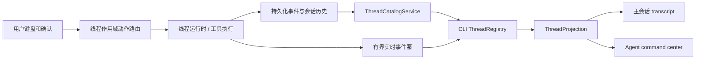

# CLI 版本实现方案：终端交互、工具轨迹与 Agent Command Center

## 1. 目标与边界

本方案将 `wunder-cli` 的 TUI 终端体验整体对齐参考实现的交互范式，同时保持 Wunder 已有的运行时、工具治理、会话存储和多智能体语义。最终用户应能在一个终端中完成以下操作：

1. 以紧凑、连续、可扫描的方式阅读用户轮次、模型输出、推理、工具调用及结果。
2. 在工具仍运行、子智能体仍执行或另一个线程等待输入时，使用 `←` 打开 **Agent command center**，查看所有可访问任务线程的状态，并切换监视目标。
3. 切走一个运行线程后继续接收其事件；回到该线程时看到不丢字、不串线程、顺序正确的实时尾部和历史记录。
4. 在 command center 中按状态、层级、智能体和更新时间定位线程；在宽终端查看详情，在窄终端仍可完成筛选和切换。
5. 继续支持本地 SQLite、离线启动、32 位 Windows 7 与 Ubuntu 18.04，不引入浏览器渲染链路或常驻本地 HTTP/ WebSocket bridge。

“线程”在本方案中始终指一个 `session_id` 对应的独立任务线程。它可以是用户主线程、由子智能体派生的线程，或蜂群工作线程。智能体身份、父线程、派生来源和运行账本是线程元数据，不得把多个线程合并为单一“智能体状态”。

本次不是把参考工程的 TUI 代码复制进来。参考工程采用自身的 app-server 协议、线程类型和渲染框架；Wunder 应复用其布局、状态隔离、稳定调用 ID 和回放策略，并接入自身的 `AppState`、线程运行时、SQLite、`StreamEvent` 与工具契约。

## 2. 现状结论与改造依据

| 范围 | Wunder 当前能力 | 问题 | 方案处理 |
| --- | --- | --- | --- |
| TUI 基础 | 已使用 Ratatui、Crossterm、帧调度、Markdown 流式渲染、滚动记录 | 主界面按单会话 `logs` 建模 | 改为“线程注册表 + 每线程投影 + 当前可见线程” |
| 工具呈现 | 已有补丁、命令、通用工具的 `SpecialLogEntry`，命令会话有输出缓冲 | 通用工具完成时按最后一个同名待完成项寻找，平行调用会错配 | 所有工具卡按 `(session_id, turn_id, tool_call_id)` 原位关联 |
| 命令输出 | 已有命令会话开始、增量、终态和头尾有界输出 | 卡片模型仍耦合当前会话日志 | 命令会话状态移入所属线程投影，离开页面仍持续更新 |
| 会话恢复 | 已有最近会话、历史恢复、统计读取、`/resume` 选择器 | 当前切换受全局 `busy` 和单 `stream_rx` 限制 | command center 使用分页线程目录；运行与可见线程解耦 |
| 多智能体 | 会话记录已有父线程、派生标签和派生者字段；运行时已按线程隔离锁与状态 | CLI 未把这些关系投影为可监视的线程树 | 在目录和详情中显示谱系及子线程聚合状态 |
| 事件持久化 | `stream_events` 有递增事件 ID，运行时已有重放与存储能力 | CLI 使用无界接收器，页面状态未按线程归属 | 有界事件管道、游标、落库后重放和每线程失效标记 |

参考实现中最值得直接借鉴的结构是：command center 不是临时会话列表，而是由持续维护的线程目录驱动；线程切换不取消后台事件监听；工具卡片由调用 ID 原位更新；终端宽度不足时减少元数据而不改变操作路径。

## 3. 目标体验

### 3.1 主会话视图

主视图保持“历史在上、输入在下”的终端对话结构，取消营销化面板和大面积边框。每个逻辑单元之间保留一行呼吸间距；普通消息使用首行符号和悬挂缩进，工具、补丁与命令使用结构化行而不是 JSON 墙。

```text
  › 用户请求文本，可换行并保持悬挂缩进

  • 思考中：简短推理摘要

  • Ran command  command text                         running · 3s
    └ first output line
      following output line

  • Read file  relative/path                           completed
    └ 12 lines · concise result preview

  • 助手回复的 Markdown 内容

  ◌ Working · 8s · Ctrl+C interrupt
  › 输入内容
  ← command center   / commands   @ files       72% context left
```

视觉规则如下：

- 默认前景色承载正文；次要信息使用可读的弱化色；键位采用统一强调色；成功、失败和运行中只使用语义色，不为普通文本硬编码终端主题不保证可读的颜色。
- 用户、助手、推理、工具、错误各有固定且有限的前缀。续行与换行不重复前缀，避免长内容左右跳动。
- 运行中的单元显示单个活动指示符和经过时间；完成后指示符冻结为成功、失败或中断状态，不再重绘整段历史。
- Markdown 继续使用当前最低必要能力。图片、表格、复杂 HTML、公式和大二进制结果显示可读摘要；原始内容仍可复制和导出。
- 输入区底部统一承载快捷键、附件/补全状态和上下文余量。宽度不足时先省略说明文字，再省略低优先级项，始终保留键本身、运行状态和上下文状态。

### 3.2 工具调用与结果

工具卡的目标是让用户一眼知道“正在做什么、是否结束、得到了什么”，而不是暴露全部协议载荷。

| 阶段 | 主行 | 次级内容 | 更新规则 |
| --- | --- | --- | --- |
| 已发起 | `• Calling <工具摘要>` | 必要参数摘要 | 用稳定调用 ID 创建卡片 |
| 流式执行 | `◌ Running <工具摘要> · 已用时` | 命令 stdout/stderr 或进度尾部 | 仅更新该卡片活动尾部，按帧合并 |
| 成功 | `• <动作摘要> · completed` | 最多若干行结果预览、数量或耗时 | 原位替换状态，保留调用摘要 |
| 失败/取消 | `! <动作摘要> · failed/cancelled` | 可行动的错误摘要 | 原位替换状态，保留错误分类 |

具体规则：

- `execute_command` 以 `command_session_id` 与 `tool_call_id` 双向关联。stdout、stderr、pty 分流显示；多命令返回时每个命令会话独立为一张卡，不覆盖同一工具调用下的其他命令。
- 补丁调用显示文件数、增删统计和有限文件列表；详情可显示受控 diff 预览。成功、拒绝、失败和取消是不同状态。
- 文件、搜索、知识、MCP、技能、浏览器和用户自定义工具走统一的 `ToolPresentation` 分类器。分类器输出动作名、参数摘要、结果摘要、预览行、错误与可展开原文，禁止 UI 层按任意 JSON 字段临时拼接。
- 结果预览对条目、行数、字符数和字节数设上限；超出部分显示“还有 N 项/已截断”。原始结果不复制到每个渲染缓存，保存在既有历史或事件来源中，详情页按需读取。
- 并发工具、重试和同名工具必须通过调用 ID 关联，禁止“从后向前找到第一个同名 pending 卡片”的回填方式。
- 历史重放优先恢复结构化工具卡。由于事件保留期已过且仅剩旧工具消息时，降级为只读历史摘要，绝不伪造运行态或完整输出。

### 3.3 Agent command center

在输入框为空、没有确认框/补全框/详情弹层且焦点位于对话输入时，按 `←` 打开 command center；输入不为空时 `←` 始终保留为移动光标。`Esc` 和 `←` 关闭 command center 并回到原线程。另提供一个可配置的显式快捷键和 `/threads` 命令作为发现入口。

宽度不少于 90 列时采用双栏，低于 90 列时退化为单栏；不会因宽度变化丢失筛选或切换能力。

```text
  Agent command center                         Group: Status
  [All 12] [Needs you 1] [Working 3] [Ready 2] [Inactive 6]
  ───────────────────────────────────────────────────────────
    Tasks                                      Task details
  › ● 任务标题                    Working  2m  标题
    ○ 另一线程                    Ready   8m  ● Working
    ! 等待确认的线程              Needs you   智能体、模型、工作目录
                                                父线程 / 派生来源
                                                当前轮次、工具、上下文
                                                最近活动和最后消息摘要

  ↑↓ select  Enter view/switch  Tab filter  / search  g group  r refresh  ? help
```

目录规则：

- 状态页签固定为“全部、需要处理、运行中、就绪、已结束”。状态必须来自统一投影，不能仅凭最后一条文本猜测。
- 默认按最近活动排序；`g` 在“父子谱系、状态、智能体/模型”间切换分组。父子谱系中根线程在前，子线程缩进显示；蜂群工作线程与普通子智能体使用来源标签区分，不混为一类。
- `/` 打开搜索，搜索标题、智能体、会话短标识和工作目录；搜索在服务层分页执行或按当前有界页执行，禁止一次装载全部历史会话。
- `↑/↓`、`PageUp/PageDown` 移动选择，`Tab/Shift+Tab` 切换状态页签，`Enter` 进入选中线程；`r` 仅刷新目录元数据；`?` 显示键位帮助。将来若加入重命名、归档、删除，必须使用显式确认且后端鉴权，不与本轮“监视/切换”绑定。
- 选中运行线程后按 `Enter` 切换为该线程的交互视图；选中非当前线程时，该线程的草稿、滚动位置、活动工具卡和未读计数保持。被其他入口占用写入权的线程以只读监视态打开，并明确提示原因。
- “需要处理”线程的详情显示待回答问题或待授权工具摘要；用户确认后才向该线程提交回应。确认请求必须带线程 ID，不能使用全局队列顺序推断归属。

## 4. 目标架构



### 4.1 运行时统一线程目录

在 `crates/wunder-runtime/` 增加可被本地 CLI、桌面 façade 和服务端入口复用的线程目录服务。CLI 不应自行拼接存储、监控器与运行队列的零散读取逻辑。

建议接口：

```rust
ThreadCatalogService::list(ThreadListQuery) -> ThreadPage
ThreadCatalogService::snapshot(session_id) -> ThreadSnapshot
ThreadCatalogService::events(session_id, after_event_id, limit) -> ThreadEventPage
```

`ThreadListQuery` 至少包含用户范围、游标、1–100 的页大小、状态筛选、关键词、父线程筛选和排序键。`ThreadSnapshot` 至少包含以下字段：

- `session_id`、标题、智能体 ID、模型、工作目录、创建/最近活动时间；
- `parent_session_id`、派生标签、派生者、线程类别；
- 归一化的 `ThreadStatus`、运行轮次、是否可写、待处理原因；
- 当前/最近轮次的工具数、上下文用量、最后活动摘要、未读事件计数；
- 目录版本或水位，供 CLI 判断增量刷新。

状态推导顺序固定为：显式待确认/待回答 > 线程运行时活跃或排队 > 终态错误/取消 > 有可继续上下文的就绪 > 已结束。目录服务读取现有会话元数据、线程运行时、监控投影与持久化尾事件；它是唯一的状态归一化位置。网页、桌面和 CLI 以后可共享相同定义。

### 4.2 CLI ThreadRegistry

新增 `crates/wunder-cli/tui/thread_registry.rs`，将目前 `TuiApp` 的全局 `session_id`、`logs`、`busy`、`stream_rx`、活动 Markdown 索引和命令会话映射拆为线程作用域状态：

```rust
struct ThreadRegistry {
    active_thread_id: SessionId,
    summaries: PagedThreadSummaries,
    projections: BoundedMap<SessionId, ThreadProjection>,
    streams: HashMap<SessionId, ThreadStreamHandle>,
}

struct ThreadProjection {
    transcript: TranscriptStore,
    draft: ComposerDraft,
    scroll: ScrollAnchor,
    tool_cells: HashMap<ToolCallKey, CellId>,
    command_sessions: CommandSessionDisplayState,
    status: ThreadStatus,
    last_seen_event_id: i64,
    unread: UnreadState,
}
```

要求如下：

- `active_thread_id` 只决定主视图渲染和输入投递目标，绝不决定后台任务是否继续运行。
- `ThreadProjection` 只保留可视历史窗口、稳定已完成块、活动尾块和必要索引。原始历史、完整工具结果和旧事件从现有持久层按需读取。
- 未在内存中的线程仅保留目录摘要。进入该线程时先用快照与游标加载，再订阅或回放到最新水位。淘汰线程投影前写回草稿、滚动锚点和已读游标。
- 不同线程的 `tool_call_id`、`command_session_id`、审批和 Markdown 流都在 `ThreadProjection` 内命名；跨线程绝不共享索引。
- 当前 `busy` 改为 `ThreadRunState`，并以线程为粒度判断。创建新会话、切换、取消和提交输入只检查目标线程状态，不能因另一个线程正在运行而全局拒绝。

### 4.3 有界事件泵与切换回放

现有单个无界 `stream_rx` 必须替换为按线程归属的事件泵。事件泵接收端、网络/运行时读取、投影更新和绘制分离：

1. 运行时先将可重放事件写入现有 `stream_events`，为每个线程维持单调事件 ID。
2. 每个运行线程的接收任务使用有界通道；达到高水位时读取端施加背压，而不是无界堆积或静默丢弃文本。
3. UI 每帧只处理有限数量事件；文本 delta 在约 16–33 ms 内合并到活动尾块。积压时提高单帧处理预算，但仍只重绘受影响线程。
4. 通道断开、投影被淘汰、事件序号跳变或 UI 发现积压过高时，标记该线程 `needs_replay`。重新从 `last_seen_event_id` 拉取分页事件，按事件 ID 去重、补齐并继续。
5. 切换线程时保存旧线程滚动锚点；新线程先显示已稳定内容，再把回放内容作为批次接入。用户停留底部才自动跟随，向上浏览时新输出只增加未读标记。
6. 任何线程收到 `final`、`error`、取消或命令会话终态，都必须立即固化活动尾块、清理该线程的运行句柄，并刷新目录状态。

不得为了降低复杂度使用“切换时取消旧流”“等完整回复后动画播放”“每 token 重建全部消息列表”或“收到事件但只保留最后一条”。

### 4.4 统一投影与工具关联

新增 `crates/wunder-cli/tui/transcript/`，以 `TranscriptCell` 取代主 `app.rs` 中既承载数据又承载渲染缓存的扁平 `LogEntry` 主模型。初期允许以适配层复用既有 Markdown、补丁和命令渲染代码。

建议单元类型：

```rust
enum TranscriptCell {
    UserMessage, AssistantMessage, Reasoning,
    Tool(ToolCell), Patch(PatchCell), Command(CommandCell),
    SystemNotice, Approval, Inquiry, Error,
}
```

`ToolCell` 的主键为：

```rust
struct ToolCallKey {
    session_id: String,
    turn_id: Option<String>,
    tool_call_id: String,
}
```

若早期事件未提供 `tool_call_id`，仅允许创建带临时本地 ID 的 pending 单元；一旦后续事件提供稳定 ID，必须显式迁移其索引。不得再次用工具名和最近位置猜测对应关系。命令会话的多重别名继续复用现有 `CommandSessionDisplayState`，但所有别名映射限定在同一 `ThreadProjection`。

### 4.5 Command center 视图模块

新增以下模块，避免继续把业务堆入 `tui/app.rs`：

- `tui/command_center/mod.rs`：状态、筛选、选择保持和公共动作；
- `tui/command_center/render.rs`：宽/窄布局、页签、列表、详情和帮助；
- `tui/command_center/input.rs`：键位优先级、搜索编辑与关闭逻辑；
- `tui/command_center/rows.rs`：分组、虚拟可视行、列裁剪和相对时间；
- `tui/thread_registry.rs`：目录、投影、订阅、淘汰与切换；
- `tui/transcript/`：单元模型、稳定渲染缓存、工具展示适配器；
- `thread_catalog.rs`：CLI 对运行时目录服务的 façade，不直接散落查询存储。

主 `tui/app.rs` 只保留应用编排、顶层键位路由、线程作用域动作调度和生命周期协调。`tui/ui.rs` 根据当前模式在会话视图与 command center 之间选择绘制，不让 command center 变成覆盖在仍可编辑输入框上的脆弱弹窗。

## 5. 分阶段实施节点

### N0：基线、契约和回归样本

**改动**

- 记录当前 TUI 的固定宽度、窄宽度、工具并行、命令流、历史恢复、切换会话和确认流程的 Ratatui TestBackend 快照。
- 定义中文/英文术语、状态枚举、键位优先级和 `ThreadSnapshot` JSON/Rust 契约。
- 选取不含真实身份、密钥、业务名称或本机路径的虚拟事件夹具。

**验收**

- 基线测试可在不连接外部服务的情况下运行。
- 每个夹具含事件 ID、线程 ID、用户轮次、工具调用 ID 和至少一种并发或乱序场景。
- 文档明确新旧术语映射，不存在“会话/线程/智能体”混用。

### N1：运行时线程目录服务

**改动**

- 在 `crates/wunder-runtime/` 实现分页 `ThreadCatalogService` 和状态归一化。
- 基于现有会话记录中的父子关系、线程运行时状态、监控投影和持久化事件尾部生成目录/详情快照。
- 为 CLI 本地直接调用提供 façade；不通过本机 HTTP/ WebSocket 转发。

**验收**

- 根线程、子智能体线程和蜂群工作线程均能作为独立条目分页返回，并保留父线程关系。
- `running`、`queued`、待确认、失败、取消、就绪和结束态不会因重启或目录刷新闪回错误状态。
- 单页上限不超过 100，关键词和父线程筛选有明确游标语义。
- CLI、桌面/服务端使用同一状态映射测试集。

### N2：线程注册表和有界实时链路

**改动**

- 引入 `ThreadRegistry`、每线程 `ThreadProjection` 和 `ThreadStreamHandle`。
- 将单一 `stream_rx`、全局 `busy`、全局活动 Markdown/命令会话索引迁移到线程作用域。
- 有界事件通道、事件游标、补水、焦点切换、投影淘汰和草稿/滚动锚点持久化落地。
- 将审批、问询、取消与输入动作绑定到明确的线程 ID。

**验收**

- A 线程流式输出期间切换到 B，A 继续完成；返回 A 后文本完整且顺序正确。
- A、B 同时运行同名工具时，每张卡只接收所属线程的结果。
- 事件积压、断线重连或投影淘汰后，按事件 ID 补齐，不重复、不丢失、不跨线程。
- 内存与队列均有上限；达到上限时可通过回放恢复，测试证明没有静默丢字。

### N3：转录单元和 Codex 风格主布局

**改动**

- 建立 `TranscriptCell` 与 `ToolPresentation`；保留现有 Markdown 流式、补丁预览、命令会话头尾缓存为适配实现。
- 将布局改为连续 transcript、活动行、composer 和紧凑 footer；统一弱化文本、键位、高亮、语义状态和宽度裁剪策略。
- 为长消息采用稳定块 + 活动尾块，为历史采用限量加载和按宽度缓存。

**验收**

- 普通对话、Markdown、推理、错误、补丁、工具、命令、确认和问询在 40、80、120 列下均可读，续行不越界。
- 运行中每帧只更新活动尾块；已完成块不因新 token 重新解析。
- 上滚查看历史时位置不跳动；底部跟随只在用户位于底部时发生。
- 现有复制、附件、补全、斜杠命令、鼠标滚动和 Ctrl+C 行为保持可用。

### N4：工具调用卡原位更新

**改动**

- 按 `ToolCallKey` 建立 pending、delta、result 的完整关联索引。
- 将通用工具、补丁、命令、MCP/技能等结果接入统一摘要分类器；结果详情按需读取。
- 命令会话 stdout、stderr、pty 和最终结果合并为同一卡片；支持多命令并行。

**验收**

- 同名并行调用、重试、嵌套子线程调用和乱序 result 都能精确回填。
- 命令流逐步显示，最终结果替换活动尾部但不丢失调用标题、耗时、退出码或错误。
- 大输出、媒体和大 JSON 不导致大对象复制或无界增长；原始内容仍可复制/导出。
- 工具历史重放在可用结构化事件下与实时布局一致，在不可用时诚实降级。

### N5：Agent command center

**改动**

- 实现目录视图、状态页签、搜索、分组、双栏详情、窄屏退化、快捷键帮助和显式刷新。
- 实现 `←` 的上下文保护：仅空输入、无弹层时打开；其余情况保留编辑语义。
- 实现 `Enter` 线程切换、只读监视标志、未读提示和返回原视图。

**验收**

- 在一个运行线程、一个等待确认线程、一个子线程和一个已结束线程同时存在时，状态页签计数正确，筛选与切换准确。
- 90 列及以上有目录/详情双栏；低于 90 列自动单栏；低于最小终端尺寸给出可读缩放提示，不崩溃。
- 切换不会取消未选中线程；返回后草稿、滚动位置、运行卡和未读计数符合预期。
- `←` 不会劫持非空输入的光标左移、确认框、搜索框或工具详情中的左移操作。

### N6：多智能体语义、压测和发布门禁

**改动**

- 在目录详情显示父线程、派生者、线程类别、子线程计数和聚合状态；子智能体与蜂群工具保持语义区分。
- 做多线程流、历史回放、窗口 resize、离线 SQLite 启动和 Win7/Ubuntu 构建验证。
- 完成用户帮助、开发说明和功能迭代记录。

**验收**

- 子智能体是临时工作单元、蜂群调用已存在智能体的边界在 UI 标签和详情中清晰可见。
- 多线程高频 delta 下 UI 输入、选择、复制和滚动保持响应；任何一个线程异常不会使其他线程状态失效。
- Windows 7 x86 和 Ubuntu 18.04 目标构建通过；不引入不受支持的终端、浏览器或系统依赖。
- 所有新增状态、快捷键、降级行为和已知上限在帮助文本中可发现。

## 6. 性能、可靠性与数据完整性门槛

| 项目 | 强制门槛 |
| --- | --- |
| 目录读取 | 分页，单页 1–100 条；UI 只渲染可视行及少量预取，不全量加载所有会话 |
| 内存 | 目录摘要、线程投影、工具预览、命令输出、事件队列都必须有上限；完整原文按需读取 |
| 流式刷新 | token/delta 在约 16–33 ms 合并；不为每个 token 重建全 transcript 或完整 Markdown |
| 事件完整性 | 通道背压 + 持久事件 ID + 补水；不得以丢弃文本作为常态降压策略 |
| 切换 | 保存每线程草稿/滚动锚点；只加载目标线程必要窗口；后台线程持续归档事件 |
| 锁 | 线程目录读取不持有长时间全局锁；运行、审批、取消和状态均按 session ID 隔离 |
| 重放 | 使用事件游标去重；完成块稳定，活动尾块增量更新；保留期外有诚实降级 |
| 可访问性 | 无颜色终端仍能由符号和文本区分状态；不依赖鼠标；所有关键操作有键位入口 |

建议的负载门禁：同时存在至少 20 个目录线程、4 个活跃流、每个活跃线程持续产生文本和工具事件时，输入响应、切换和滚动不能被阻塞；断开一个事件通道后恢复应只补对应线程，且不重复任何稳定消息或工具卡。

## 7. 测试矩阵

| 层级 | 用例 | 通过条件 |
| --- | --- | --- |
| 运行时单元测试 | 状态归一化、父子关系、分页/游标、关键词、目录水位 | 状态优先级固定；没有跨用户或跨线程条目 |
| TUI 单元测试 | `ToolCallKey` 关联、临时 ID 迁移、命令别名、多工具并发、输出截断 | 每个 result 只更新一个正确单元；头尾摘要稳定 |
| TUI 快照测试 | 40/80/120 列主视图、工具成功/失败、command center 宽/窄布局、帮助与空态 | 无越界、无 ANSI 依赖、列裁剪稳定 |
| 事件测试 | 积压、断线、重连、重复事件、事件跳号、切换时 delta | 通过游标回放后内容完整且无重复 |
| 集成测试 | A 运行→切 B→A 完成；待确认线程处理；父子线程与蜂群线程同时存在 | 不取消后台线程，不串屏，不丢草稿/滚动位置 |
| 兼容测试 | SQLite 离线启动、Win7 x86、Ubuntu 18.04、窄终端、无色终端 | 编译运行通过，降级文案可读 |

快照夹具和测试输出一律使用虚构、脱敏的线程名、文件名、命令和内容，不写入真实身份、密钥、业务名称或本机绝对路径。

## 8. 实施顺序、迁移与完成定义

N1、N2 是 N3–N5 的前置条件：在没有线程目录、线程作用域状态和可补水事件管道前，不开始把 command center 做成可切换界面。N3 与 N4 可并行推进，但 N4 合入前必须完成稳定调用 ID 关联。N5 在 N2、N3、N4 均通过后接入。N6 是发布门禁，不以视觉完成代替多线程可靠性验证。

迁移期间可保留旧 `/resume` 作为 command center 的兼容入口，但它应委托同一 `ThreadCatalogService` 和同一切换动作；完成后删除重复的单会话选择器逻辑。旧 `LogEntry`、全局 `busy`、单 `stream_rx` 和按工具名反向搜索 pending 项的路径应在迁移完成后移除，避免两套状态机长期并存。

完成的定义是：CLI 在本地运行时能同时监视多个独立任务线程；`←` 能可靠打开 command center 并进入任一可访问线程；运行中的工具和输出以稳定卡片呈现；切换、重放、并发、确认与子线程场景均通过上述测试矩阵；所有队列、缓存、分页和降级行为满足本仓库性能与兼容要求。

## 9. 参考代码阅读索引

后续实现时可对照参考工程的以下相对模块，提取交互原则而非复制协议实现：

- `codex-rs/tui/src/app/agent_center/`：command center 的键位、行列表、宽窄布局、详情栏和帮助；
- `codex-rs/tui/src/app/agents_overview_threads.rs`：线程目录的增量维护与刷新；
- `codex-rs/tui/src/app/thread_event_buffer.rs`：按线程缓冲、切换回放与顺序控制；
- `codex-rs/tui/src/history_cell/`：消息、命令、补丁、MCP 工具的稳定单元呈现；
- `codex-rs/tui/src/chatwidget/rendering.rs` 与 `styles.md`：连续 transcript、composer、快捷键与终端配色准则；
- `crates/wunder-cli/tui/app.rs`、`command_session_display.rs`、`tool_display.rs`、`tui/markdown_stream.rs`：应复用或迁移的 Wunder 现有能力；
- `crates/wunder-runtime/src/services/stream_events.rs`、线程运行时和会话存储：目录服务与可回放事件的权威来源。


## 实施进度补充：线程显示状态隔离（待集成验证）

- 切换线程以移动所有权方式缓存日志、工具调用索引、命令输出状态、活动 Markdown 收集器、轮次指标、询问面板、草稿和附件；缓存命中不再重读历史。最多保留 31 个后台显示窗口及 1 个当前窗口；容量满时优先淘汰无流且无审批的窗口，全为受保护窗口时拒绝新切换并保留当前界面。
- 首次访问线程先读取历史，失败不移动原线程状态。切回时恢复所有待审批请求，消费剩余后台事件后再读取新事件，避免只处理前 512 条导致积压永久滞留。
- 本节点验收：A 线程命令持续输出时切至 B，再切回 A，命令卡原位追加且无跨线程内容；两线程同名工具、相同调用 ID 不互相覆盖；连续两条审批均可回应；草稿附件及长粘贴占位符随线程恢复；历史读取失败保持当前界面；缓存容量到界仍可切回已有线程。
- 验证状态：已执行 cargo check，当前被 runtime 线程日志存储接口的参数与实现不一致阻塞；尚未通过本节点集成编译及交互验收。该记录不代表整体方案完成。后续仍须完成 TranscriptCell 与实际渲染同步、全局分页搜索、回放缺口检测以及跨平台终端验收。


### 后续验证进展

- 当前工作树 `cargo check -p wunder-cli` 已通过，前述 runtime 编译阻塞已解除；此结论仅覆盖编译，不替代交互、性能或跨平台验收。
- Command Center 不再把当前可见线程等同于运行线程；审批优先于运行状态展示，状态筛选和计数随事件刷新。列表使用有界可见窗口，选择保持可见，行宽按终端列数截断。详情新增待审批数、积压事件数、流状态和回放标识。
- 回放修复双重去重和直接事件封装解析；按实际应用游标分页补齐，完成或错误消息延后至所属线程积压事件处理完成。保留期缺口检测仍待完成。


### 转录单元统一进展

- 前一节点 `cargo test -p wunder-cli --bin wunder-cli tui:: --no-fail-fast`：103 项通过。
- 实际日志单元改为 `TranscriptCell`，保留结构化工具内容和 Markdown 缓存；渲染、增量更新、工具结果回填及线程窗口保存使用同一份单元，移除只在创建时追加、此后不更新的纯文本 `TranscriptStore` 副本。
- 这是 N3 的数据源统一步骤，尚不代表 N3/N4 全部验收完成；类型化审批/询问单元、长文本增量预算以及完整工具调用键仍需按原节点逐项验证。


### 工具调用键与目录服务收敛进展（2026-09-29）

- **N4 工具卡关联**：结果回填全面改用 `ToolCallKey { turn_id, tool_call_id }`（会话作用域由线程视图状态隐含）。补丁、命令与通用工具的完成函数不再使用“从后向前找第一个同名 pending 卡片”的反查路径；无稳定 ID 的调用卡进入有界临时队列（上限 32），结果携带稳定 ID 时显式迁移索引，完全无 ID 的流按到达顺序消费，同名并行调用在携带 ID 时不串卡。跨卡索引随日志裁剪同步调整。
- **回放保留期缺口检测**：因 token delta 占用事件 ID 但不持久化，ID 相邻跳变是常态，不能作为缺口信号；现以“投影已应用过事件但持久事件水位为 0”为诚实信号，出现时明确提示实时事件超出保留期并降级为会话历史展示。
- **N1 目录服务修正**：关键词搜索从“分页后过滤”改为服务层分页执行（有界扫描最多 10 页 × 100 条，扫描外的匹配不返回）；`ThreadCatalogService::snapshot` 改为按会话 ID 直接读取并用父线程筛选统计子线程数，不再用搜索模拟。存储层新增 `count_child_chat_sessions` 批量子线程计数（SQLite/PostgreSQL 双实现，`UserStore` 委托）。
- **N5/N6 呈现**：命令中心搜索按 Enter 后走目录服务查询（本地输入仍对已加载页即时过滤）；详情栏新增“子线程”计数。类型化审批/询问单元已由 `LogKind::Approval` / `LogKind::Inquiry` 承载（`!` / `?` 前缀）。
- 验证状态：`cargo check --workspace` 通过；`cargo test -p wunder-cli` 169 项通过（含新增 ToolCallKey/临时卡匹配测试），`cargo test -p wunder-core --lib` 80 项通过；`cargo test -p wunder-runtime` 存在 15 项与本方案无关的既有失败（tools/catalog、prompting、worker_card 区域，属并行开发中的路径解析与文案断言）。剩余发布门禁：多线程高频 delta 压测、Windows 7 x86 与 Ubuntu 18.04 目标构建仍待执行。
