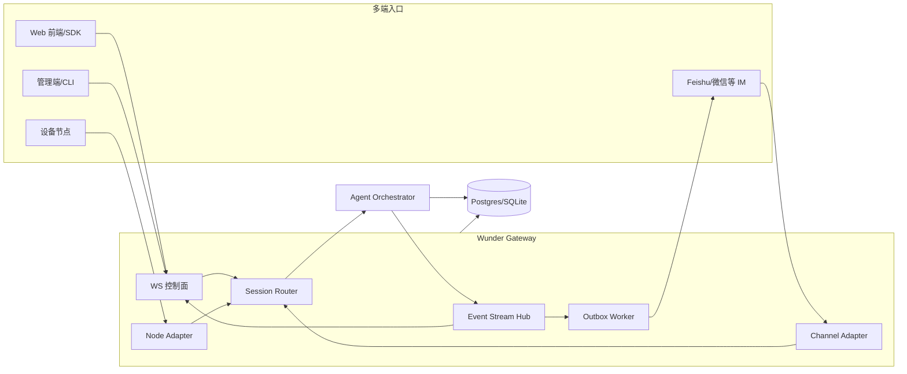

# wunder 网关系统落地方案

> 对照参考项目 **openclaw-2026.2.2** 的网关系统设计，结合 wunder 现状与既有主链路（`user_id → agent_id → session_id → agent_loop → WS/SSE`）提出可落地的目标架构与分阶段实施方案。  
> 目标：在不破坏现有 `/wunder` 主入口与前端体验的前提下，补齐“多设备/多节点/多渠道”的网关能力，并让 Feishu/微信 等通讯软件接入后默认进入“通用智能体应用”的主线程。

---

## 1. 目标与范围

### 1.1 目标
- 形成 **统一网关层**：承担多端接入、鉴权、协议协商、路由、会话映射与事件流转。
- 对外能力 **多入口一致**：Web 前端 / API / IM 渠道 / 节点设备统一走网关路由。
- 支持 **多设备/多节点接入**：能力节点（摄像/屏幕/定位/语音）可挂载为网关可调用的工具。
- 渠道接入后 **默认进入通用应用主线程**：避免渠道侧碎片化会话。
- 兼容现有 **SSE/WS 流式**，不破坏已有客户端。

### 1.2 范围
- 网关协议（WS 控制面 + HTTP 管理面）
- 渠道接入（Feishu/微信/企业 IM）
- 节点接入（设备能力节点）
- 会话映射与主线程策略
- 观测、治理与安全

---

## 2. 对标分析（OpenClaw → wunder）

### 2.1 OpenClaw 网关关键能力（摘要）
- **常驻网关进程**：统一控制面与事件流，WS 为核心通道。
- **严格握手与协议协商**：`connect` + `min/max protocol` + `connect.challenge`。
- **角色/权限/能力声明**：`operator` / `node` 角色 + scopes/caps/commands。
- **设备身份与配对**：设备 token、配对审批、设备签名认证。
- **Presence/状态快照**：连接即返回 snapshot（health/presence/stateVersion）。
- **多端互通**：CLI / UI / Node 均走同一网关协议。
- **运维与诊断**：health、logging、gateway status、service 管理。

### 2.2 wunder 当前实现盘点（已有能力）
- **统一入口**：`/wunder` + SSE/WS（`/wunder/ws`、`/wunder/chat/ws`）。
- **WS 协议协商**：支持 `connect`、`protocol_version/min/max`、`ready/policy`（见 `docs/WebSocket-Transport.md`）。
- **事件流复用**：与 SSE 事件语义一致，支持断线回放（`stream_events`）。
- **多渠道接入基础链路**：
  - 统一 Webhook：`/wunder/channel/{provider}/webhook`
  - 绑定路由：`channel_bindings`
  - 渠道会话映射：`channel_sessions`
  - 出站队列：`channel_outbox` + 重试
  - 多模态预处理：ASR/OCR/TTS 管线
- **管理员配置与管理接口**：`/wunder/admin/channels/*`

### 2.3 核心差距与风险
- **缺少统一网关“控制面协议”**（角色/权限/节点能力未纳入统一协议）。
- **缺少设备/节点接入与配对**（无法注册/管理能力节点）。
- **缺少“用户绑定策略”**（渠道用户无法映射到内部注册用户）。
- **主线程策略未显式可配**（渠道默认会话策略可导致碎片化）。
- **缺少面向多端的 Presence/状态快照**（无法统一展示网关在线状态）。

### 2.4 可复用资产
- 现有 WS 传输协议与 `ready/policy` 机制。
- `channel_*` 数据结构与出站队列机制。
- `agent_threads` 与 `session_locks` 的主线程/互斥能力。
- 现有 `/wunder` orchestrator 与事件流体系。

---

## 3. 主链路对齐与会话映射策略

### 3.1 主链路再确认
```
user_id → agent_id → session_id → agent_loop → WS/SSE events
```

### 3.2 渠道进入的会话策略（满足“默认主线程”诉求）
新增配置：`channels.session_strategy`（建议默认 `main_thread`）。

| 策略 | 说明 | 适用场景 |
| --- | --- | --- |
| `main_thread` | 渠道消息默认进入 `agent_id` 的主线程（`agent_threads`） | 希望渠道与 Web 前端共享主对话 |
| `per_peer` | 每个渠道会话（peer）独立会话（使用 `channel_sessions`） | 渠道侧多群组并行 |
| `hybrid` | DM → 主线程；群组/话题 → 独立会话 | 渠道混合场景 |

### 3.3 渠道用户绑定（打通注册用户）
新增 `channel_user_bindings`（或扩展 `channel_sessions`）：
- 作用：将 `channel/account/peer` 映射为内部 `user_id`。
- 规则：
  - **已绑定** → 使用绑定的 `user_id`
  - **未绑定** → 使用虚拟 `user_id`（如 `chan:{channel}:{account}:{peer}`）
- 价值：让 Feishu/微信 用户可直接进入“通用应用主线程”，与 Web 前端保持一致。

---

## 4. wunder 网关目标架构

### 4.1 组件节点
1. **Gateway Core（Axum）**
   - 负责 WS 协商、鉴权、连接生命周期、请求路由
2. **Session Router**
   - 根据 `channel/peer/user_id/agent_id` 决定 `session_id`（主线程/独立会话）
3. **Channel Adapter Layer**
   - Feishu/微信/其他渠道适配器（入站解析 + 出站投递）
4. **Node Adapter Layer**
   - 设备节点接入与能力管理（caps/commands）
5. **Event Stream Hub**
   - 统一事件分发 + `stream_events` 回放
6. **Outbox Worker**
   - 渠道出站队列投递与重试
7. **Observability**
   - 监控事件、健康探测、指标统计

### 4.2 目标架构图


---

## 5. 网关协议与接口设计

### 5.1 Gateway WS 控制面（新增）
**建议新增独立入口**：`/wunder/gateway/ws`  
（保持 `/wunder/ws` 原有流式协议不变，避免破坏前端）

**推荐协议框架（对齐 OpenClaw 习惯）：**
- 帧类型：`req/res/event`
- 首帧必须 `connect`
- 支持 `minProtocol/maxProtocol` 协商
- `connect.challenge` 支持 nonce 签名（节点/设备）
- 角色与权限：
  - `operator`：管理端/CLI
  - `channel`：渠道适配器
  - `node`：设备节点
- `hello-ok` 返回 snapshot（health/presence/stateVersion/policy）

### 5.2 与现有 `/wunder/ws` 的关系
| 入口 | 目的 | 是否兼容现有 |
| --- | --- | --- |
| `/wunder/ws` | 用户侧流式传输（event envelope） | 保持现状 |
| `/wunder/gateway/ws` | 多端控制面、节点/渠道统一协议 | 新增 |

---

## 6. 渠道接入方案（Feishu/微信）

### 6.1 适配器职责
- 入站：校验签名 → 转换为 `ChannelMessage` → `ChannelHub.handle_inbound`
- 出站：从 `channel_outbox` 拉取 → 调用渠道 API → 更新投递状态

### 6.2 主线程默认策略
配置建议：
```yaml
channels:
  enabled: true
  default_agent_id: common          # 通用应用 agent_id
  session_strategy: main_thread     # 渠道默认走主线程
```

### 6.3 Feishu（Lark）落地要点
- 事件订阅验证（challenge）
- 事件签名校验
- 消息类型映射：text/rich/图片/语音/文件
- 线程/群组信息写入 `ChannelMessage.thread`

### 6.4 微信/企业微信落地要点
- callback 验证 + AES 解密
- 群聊/单聊识别
- 语音/图片/位置映射

### 6.5 WhatsApp（Cloud API / Web）落地要点
- **Cloud API（优先）**：
  - `GET /wunder/channel/whatsapp/webhook` 支持订阅校验（`hub.verify_token`）
  - `POST /wunder/channel/whatsapp/webhook` 解析 Cloud Webhook payload
  - `X-Hub-Signature-256` 在配置 `whatsapp_cloud.app_secret` 后强校验
  - 出站优先直连 Graph API（`whatsapp_cloud.access_token`）
  - 账号维度：`account_id=phone_number_id`，一号一账户
- **WhatsApp Web（可选，后续接入 Baileys）**：
  - 以“渠道适配器”方式运行（独立 Node 进程），通过 `/wunder/channel/whatsapp/webhook` 入站 + `outbound_url` 出站
  - 保持与 Cloud API 一致的 `ChannelMessage`/`ChannelOutboundMessage` 数据结构

---

## 7. 前端设计建议（管理端 + 用户端）

### 7.1 管理端（web/ 管理后台）
- **渠道总览页**：卡片式展示（WhatsApp/Telegram/Feishu/WeChat），显示状态、账号数、最近心跳。
- **WhatsApp 配置页**：
  - 基础信息：`phone_number_id`、`access_token`、`verify_token`、`app_secret`、`api_version`
  - 安全策略：allow/deny 列表、session_strategy、default_agent_id、tool_overrides
  - Webhook URL 一键复制 + 校验提示（验证成功/失败）
  - 出站健康检查按钮（发送测试消息）
- **绑定策略页**：
  - 规则表格：`peer_kind/peer_id` → `agent_id`
  - 一键导入/导出 CSV（便于批量接入）

### 7.2 用户端（frontend）
- **会话视角统一**：WhatsApp 进入“通用智能体应用”主线程（`channels.session_strategy=main_thread`）。
- **会话标签**：在消息气泡或会话标题处标记“来源渠道”（如 WhatsApp）。
- **多渠道通知**：可选开关“仅保留主线程对话/为群聊分叉会话”。

---

## 7. 设备/节点接入方案

### 7.1 节点能力建模
节点 = 可被网关调用的外部能力（如摄像、屏幕录制、定位）。

节点注册字段：
- `node_id`、`device_fingerprint`
- `caps`（能力类型）
- `commands`（具体命令）
- `permissions`（允许开关）

### 7.2 节点调用流程
1. 节点通过 WS 连接并 `connect(role=node)`。
2. 网关校验身份并返回 `hello-ok`。
3. orchestrator 调用 `node.invoke`（工具）。
4. 节点执行并回传结果 → 事件进入 `stream_events`。

---

## 8. 数据模型与配置扩展

### 8.1 建议新增表
- `channel_user_bindings`：`channel/account/peer → user_id`
- `gateway_clients`：连接与 presence
- `gateway_nodes`：节点注册与能力声明
- `gateway_node_tokens`：节点 token（配对/授权）

### 8.2 配置扩展示例
```yaml
gateway:
  enabled: true
  auth_token: ${WUNDER_GATEWAY_TOKEN:-}
  protocol_version: 1
  allow_unpaired_nodes: false
  node_token_required: false
  allow_gateway_token_for_nodes: false
channels:
  session_strategy: main_thread
```

---

## 9. 安全与治理
- 网关 token + 设备 token 双层认证
- 渠道 inbound_token 校验
- per-agent 工具白名单与沙盒策略
- 按 channel/account 限流
- 监控事件：`channel_inbound/channel_outbound/node_invoke/agent_loop`

---

## 10. 里程碑（分阶段）

**阶段 A（基础落地｜已完成）**
- 增加 `channels.session_strategy`
- 增加 `channel_user_bindings`
- 默认通用应用主线程路由

**阶段 B（网关控制面｜已完成）**
- 新增 `/wunder/gateway/ws`
- connect + role/scopes + presence snapshot
- Gateway 连接与在线态通过 `/wunder/admin/gateway/*` 管理

**阶段 C（Feishu/微信接入｜待实施）**
- 适配器实现（入站+出站）
- 绑定路由 + 主线程策略验证

**阶段 D（节点接入｜已完成）**
- 节点注册/配对（node_tokens 管理）
- `node.invoke` 工具接入

**阶段 E（运维与观测｜已完成）**
- gateway health/status（管理端）
- presence/节点在线态

---

## 11. 验收要点
- Feishu 用户首次消息 → 进入 `common` 主线程（`agent_threads`）
- 渠道会话可追踪：`channel_messages` + `channel_outbox` 完整闭环
- 断线恢复：WS/SSE 事件可回放
- 节点可注册并可被工具调用

---

以上方案在 **复用现有 Wunder 调度与事件体系** 的基础上，引入清晰的网关层与协议边界，既兼容当前 `/wunder` 模式，又逐步对齐 OpenClaw 的多设备、多节点与多渠道能力。


