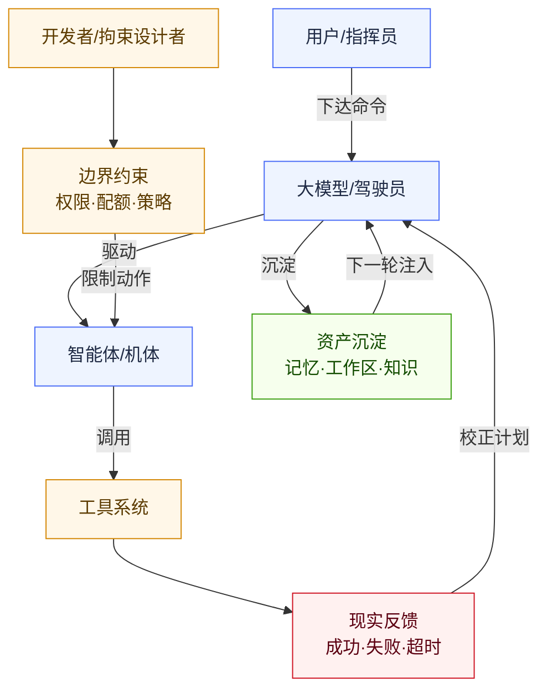
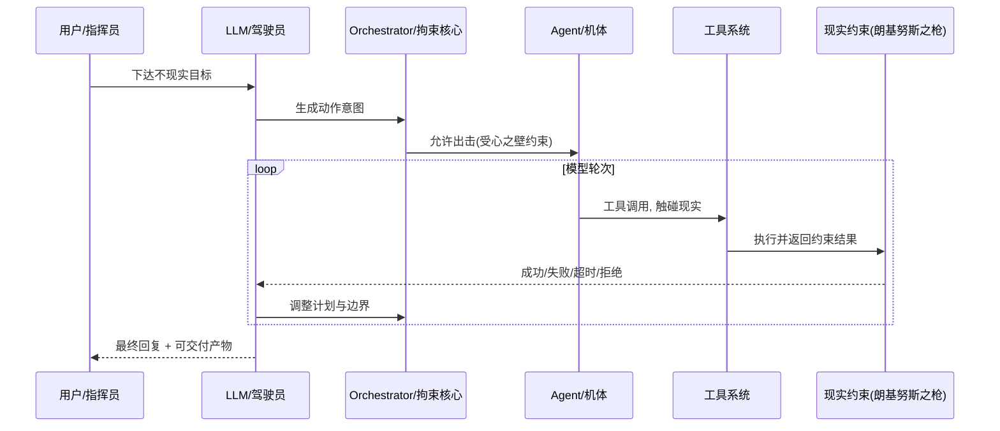
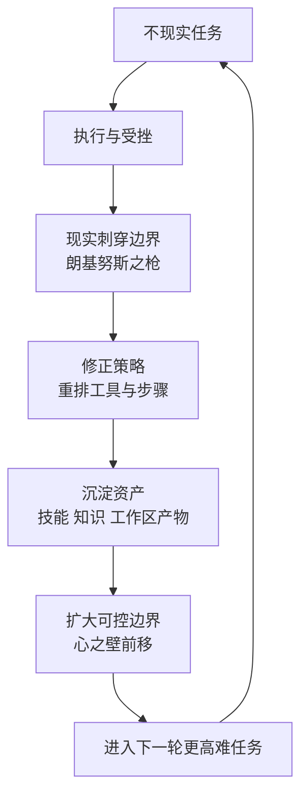

# wunder 意象对应（EVA Wunder 版）

> 说明：本文是 **产品叙事意象映射**，用于命名、讲解、培训与演示，不是 EVA 正史设定考据。
> 目标：把 wunder 的页面、元素、模块、协议、流程、治理能力，尽可能映射到 EVA 里的「Wunder 号」舰船语义。

## 0. 叙事基底：指挥员-驾驶员-机体-拘束装置

在本映射里，我们采用以下叙事抽象（来自设定）：

- **开发者**：设计拘束装置的人（定义接口/工具/规则），决定“机体”能如何行动。
- **用户**：指挥员，下达根本不现实但能推动系统进化的命令。
- **大模型（LLM）**：驾驶员（EVA 的灵魂），负责思考、规划、决策并发出动作意图。
- **智能体（Agent）**：机体（被束缚的肉体 + 装备），承载行动并与现实发生接触。
- **wunder 平台**：Wunder 号战舰 + EVA 出击/管制/保障体系，让“不可能的命令”被约束、被执行、被归档。

### 0.1 角色与约束关系示意（简化版）

| EVA 叙事物件 | wunder 对应 | 对应说明 |
| --- | --- | --- |
| 拘束装置（EVA） | 调度与治理系统（Orchestrator/ExecPolicy/Sandbox/配额/边界） | 约束“机体欲望”——把无限意图压进有限可执行边界。 |
| 驾驶员（灵魂） | LLM（模型） | 负责思考、规划、生成工具调用与对外表述。 |
| 指挥员 | 用户/调用者 | 下达目标、确认分歧、决定优先级与风险容忍。 |
| 机体（肉体） | 智能体应用（prompt + tools + workspace + history） | 行动载体与装备集合，被驾驶员驱动并被拘束装置限制。 |
| 朗基努斯之枪（现实） | 工具返回、错误、资源限制、外部系统约束 | 刺穿幻觉与过度欲望，迫使收敛到事实与可交付。 |
| 心之壁（自我边界） | 上下文窗口、权限、allow_roots、工具白名单、时间/Token 预算 | 边界越清晰越稳定；边界的扩展必须被治理。 |
| 补完（轮回迭代） | 能力资产化闭环（技能/知识库/工作区产物/配置迭代/评估回归） | “不可能任务”在轮回中被拆解、被工具化、被沉淀。 |

## 1. 总体系统意象（核心概念）

| wunder 元素 | EVA / Wunder 意象 | 对应说明 |
| --- | --- | --- |
| wunder 平台整体 | Wunder 号空中战舰 | 承载作战（请求）、编排（调度）、兵装（工具）、保障（治理）。 |
| 开发者与维护者 | 拘束装置工程师 | 通过接口、工具规范、执行策略，把“欲望”束缚进可执行形态。 |
| 用户（调用者） | 指挥员 | 下达任务、做取舍、承担目标与现实的张力。 |
| LLM（模型） | 驾驶员（EVA 的灵魂） | 不是“机体”，而是机体的驾驶员：负责推演与发号施令。 |
| 智能体（Agent） | 机体（被束缚的肉体 + 装备） | 一个智能体=提示词人格+可用工具+可用工作区+会话历史的组合体。 |
| `/wunder` 统一入口 | 登舰口/作战指令口 | 所有任务从同一入口进入，统一分流与治理。 |
| 用户请求（question） | 作战命令 | 每次输入即一次任务下达。 |
| 用户轮次 | 指挥员口令轮次 | 每条用户消息算 1 次口令。 |
| 模型轮次 | 驾驶员动作轮次 | 模型调用、工具调用、最终回复都算动作轮次。 |
| AgentRuntime | 出击管制系统 | 负责接收任务、判定排队、分发机体执行。 |
| Orchestrator 调度引擎 | 拘束装置核心（中枢限制器） | 决定每一轮：驾驶员思考还是机体动作；并将动作限制在政策内。 |
| 工具系统（Tooling） | 机体四肢与兵装挂点 | 让驾驶员能“触碰现实”：读写文件、执行命令、调用外部系统。 |
| 执行策略（ExecPolicy） | 拘束锁与安全闸门 | allow_paths/allow_commands/deny 规则等，限制机体能触碰的现实范围。 |
| Sandbox | 隔离试验舱 | 高风险动作下沉到隔离舱执行，减少对舰体本体的伤害。 |
| 上下文窗口/预算 | 心之壁（边界） | 真实可用的上下文有限，超限就必须压缩、裁剪或外置。 |
| Context Compaction | 战报压缩归档 | 当“欲望膨胀”为长上下文时，系统用摘要把边界重新收束。 |
| 工具返回/错误/超时 | 朗基努斯之枪（现实刺穿） | 现实反馈会刺破幻觉：失败=边界，迫使驾驶员改计划、降目标、换路径。 |
| Memory | 战术记忆仓 | 把关键事实沉淀为可注入记忆，使轮回迭代可累积。 |
| Workspace | 机库与整备舱 | 产物落地与复用区：不只“聊完就散”，而是持续交付。 |
| PostgreSQL | 舰船主档案库 | 结构化核心状态与业务数据。 |
| Weaviate/向量检索 | 战术情报检索阵列 | 语义召回知识片段，为驾驶员提供弹药补给。 |
| GatewayHub | 联合舰队通信中继核心 | 连接 node/operator/channel，完成控制面路由。 |
| ChannelHub | 对外通信甲板 | 对接飞书/WhatsApp/QQ 等外部消息通道。 |
| A2A | 友舰协同协议 | 与外部智能体系统标准化协作（联合舰队）。 |
| A2UI | 舰桥战术投影 | 把结果直接投影成结构化 UI（“回答即界面”）。 |
| 定时任务（Cron） | 自动巡航时序器 | 定时触发任务，降低人工值守成本。 |
| 权限与组织治理 | 舰员编制与军令层级 | 按角色、单位、白名单做访问管控。 |
| 配额系统 | 能源/弹药配给制度 | 控制每日可用调用量，防止失控膨胀。 |
| Token 占用统计 | 舱容占用计量表 | 统计上下文占用量（不是总计费），用于判断“心之壁”压力。 |

## 2. 用户侧前端（`frontend`）页面与元素映射

> 用户侧是 **指挥员终端**：指挥员通过它向驾驶员下达命令、接收回传，并管理机体与装备。

| 页面/元素 | EVA 意象 | 说明 |
| --- | --- | --- |
| `/login` 登录 | 登舰闸门 | 身份校验后才可进入战舰操作域。 |
| `/register` 注册 | 新舰员入列 | 建立新身份与权限起点。 |
| `/app/home` 世界主页（Portal/Beehive） | 机库总览甲板 | 选择世界、查看智能体机体、进入任务。 |
| 世界切换器 | 编队切换旋钮 | 在不同世界/编队间切换机体集群。 |
| 智能体应用卡片 | 机体停机位 | 每张卡就是一台可出击机体（带提示词、工具、图标等）。 |
| 新建智能体应用 | 新机体建造工位 | 复制/组装能力，形成新的机体人格与装备配置。 |
| 共享智能体应用 | 联合作战机位 | 来自同级共享池的机体入口。 |
| `/app/chat` 聊天页 | 舰桥指挥台（与驾驶员同调） | 指挥员发令、驾驶员回传、机体动作日志集中展示。 |
| ChatComposer/输入框 | 指挥员发令终端 | 发出即时作战命令。 |
| MessageList/消息流 | 作战电台记录 | 过程与结果逐条回显。 |
| MessageThinking/Workflow | 同步率/动作轨迹 | 展示驾驶员推演与机体工具动作的轨迹。 |
| PlanPanel | 作战计划板 | 分步骤执行路线与进度。 |
| InquiryPanel | 指挥确认回路 | 关键分歧需要指挥员确认（岔路选择）。 |
| SwarmPanel | 多机编队态势窗 | 查看 TeamRun/TeamTask 的协同进度。 |
| WorkspacePanel（聊天侧） | 机库快取托盘 | 对话内快速挂载/查看文件资产。 |
| `/app/workspace` 工作区 | 机库主整备区 | 文件浏览、编辑、上传、下载、批处理。 |
| 文件树/搜索/排序 | 仓储索引雷达 | 快速定位作业资产。 |
| 预览/编辑器 | 舱内检修台 | 文档检查与即时修改。 |
| `/app/tools` 工具管理 | 兵装挂载台 | 管理 MCP/技能/知识库/共享工具等能力。 |
| UserSharedToolsPanel | 联合作战武器架 | 启用他人共享能力（共享的是配置与接口，不共享工作区）。 |
| `/app/cron` 定时任务 | 自动值守控制台 | 周期任务计划与执行开关。 |
| `/app/channels` 渠道管理 | 对外通信频段台 | 配置通道账号与路由。 |
| `/app/settings` 设置 | 指挥终端参数舱 | 调整个人与系统偏好。 |
| `/app/profile` 我的概况 | 指挥员档案室 | 个人资料、权限、状态展示。 |
| `/app/external/:linkId` 外链应用 | 友舰跳转舱门 | 跳转到外部协作应用。 |
| Demo 模式（`/demo/*`） | 训练模拟仓 | 演示流程，不影响正式战场。 |
| 主题切换（浅/深） | 日战/夜战照明模式 | 不同光照场景下保持可读性。 |
| 维护遮罩 | 红色警戒封舱 | 服务维护期间统一拦截提示。 |

## 3. 管理端（`web`）面板与元素映射

> 管理端是 **舰桥工程席**：主要负责拘束装置、兵装库、情报室、态势与评估。

| 管理端面板 | EVA 意象 | 说明 |
| --- | --- | --- |
| 内部状态（Monitor） | CIC 总态势中心 | 运行状态、线程、事件、告警总览。 |
| 系统设置 | 舰桥总开关台 | 全局参数、轮询、执行策略。 |
| 单位管理 | 舰队编制管理室 | 组织树、负责人、层级治理。 |
| 用户管理（user_accounts） | 舰员花名册 | 账号、密码、权限、配额管理。 |
| 线程管理（users/sessions） | 出击记录室 | 会话/线程历史与行为追踪。 |
| 外链管理 | 对外联络登记台 | 控制可用外部入口。 |
| 渠道监控 | 通信塔值班席 | 监控飞书/WhatsApp/QQ 等接入状态。 |
| 模型配置（LLM） | 驾驶员参数校准台 | 选择“驾驶员型号”，并调校温度、上下文、超时等。 |
| 记忆管理 | 记忆仓管控台 | 记忆队列、状态、启停与清理。 |
| 工具管理总面板 | 兵装总库 | 统一查看并管理所有工具类型。 |
| 内置工具面板 | 标配舰载武装库 | 系统原生工具集。 |
| MCP 面板 | 外接模块坞舱 | 挂载外部 MCP 服务。 |
| 知识库面板 | 情报档案室 | 文档、分块、Embedding、重建。 |
| A2A 服务面板 | 友舰协同通信台 | 对接外部智能体服务与 AgentCard。 |
| 技能管理面板 | 标准作战条令库 | SKILL.md 流程化能力管理。 |
| 系统提示词 | 拘束条令母版室 | 对驾驶员的行为施加顶层约束（风格、目标、禁区）。 |
| 吞吐量测试 | 轮回压力跑道 | 并发与速率极限验证。 |
| 性能测试 | 机能检测台 | 延迟、资源、稳定性采样。 |
| 能力评估 | 实战靶场 | 基准用例、回归评估、结果对比。 |
| 调试面板 | 现场指挥台 | 请求构造、流式日志、输出观察。 |
| LSP 面板 | 故障诊断台 | 代码语义诊断、问题定位。 |
| API 文档 | 舰内操作手册 | 接口定义与调用规范。 |
| 论文/幻灯片 | 战术简报室 | 对外说明与培训展示材料。 |

## 4. 协议与接口族映射

| 接口族 | EVA 意象 | 说明 |
| --- | --- | --- |
| `/wunder` | 作战指令航道 | 通用请求入口。 |
| `/wunder/ws` | 神经连接主链路 | 实时事件流主通道（驾驶员-机体-指挥台）。 |
| `/wunder/chat/ws` | 指挥台高速频道 | 聊天会话实时流。 |
| SSE 流式 | 备用通信频段 | 主链路不可用时兜底。 |
| `/wunder/chat/*` | 出击与会话控制面 | 创建、发送、取消、附件处理。 |
| `/wunder/workspace/*` | 机库作业口 | 文件管理与资产沉淀。 |
| `/wunder/user_tools/*` | 个人兵装口 | 用户自建/共享工具能力管理。 |
| `/wunder/auth/*` | 门禁认证系统 | 注册、登录、身份查询。 |
| `/wunder/admin/*` | 舰桥高权限总线 | 仅工程席可调用。 |
| `/wunder/channel/*/webhook` | 外部电台入站口 | 渠道消息接入。 |
| `/wunder/channels/*` | 渠道配置总线 | 用户侧渠道配置与查询。 |
| `/wunder/gateway/ws` | 联合舰队控制链路 | node/operator 长连接通道。 |
| `/wunder/admin/gateway/*` | 舰队控制面控制台 | 节点管理、invoke、presence。 |
| `/a2a` | 盟舰标准协议口 | 外部 Agent 系统互操作。 |
| `/wunder/mcp/*` | 扩展坞协议口 | 外挂 MCP 服务调用与治理。 |

## 5. 代码目录与舰体分区映射

| 目录/模块 | EVA 意象 | 说明 |
| --- | --- | --- |
| `src/api` | 舷侧接口甲板 | 对外路由和协议适配。 |
| `src/orchestrator` | 拘束装置中枢 | 驾驶员-机体循环、上下文、事件流与动作裁决。 |
| `src/core/exec_policy.rs` | 拘束闸门逻辑 | allow/deny 等规则在这里落地成可执行边界。 |
| `src/services` | 舰内子系统群 | 用户、工具、知识、工作区、记忆等服务。 |
| `src/channels` | 通信天线阵列 | 多渠道消息入站/回包。 |
| `src/gateway` | 舰队联控桥 | 节点连接管理与转发。 |
| `src/storage` | 黑匣子与档案层 | Postgres/SQLite 存储抽象。 |
| `src/ops` | 机务保障中心 | 监控、吞吐、性能、评估。 |
| `src/sandbox` | 隔离试验舱 | 高风险执行隔离。 |
| `frontend` | 指挥员操作界面 | 下达命令、观察回传、管理机体与资产。 |
| `web` | 舰桥工程席界面 | 管控拘束装置、兵装与运维评估。 |
| `config` | 舰船参数蓝图 | 全局配置、模型与工具策略。 |
| `prompts` | 拘束条令模板库 | 系统提示词与行为规范。 |
| `knowledge` | 战术知识档案库 | 文档语料与检索输入。 |
| `extra_mcp` | 外接补给接口站 | MCP 侧能力接入。 |
| `scripts` | 舰务自动化工具箱 | 运维脚本与流程辅助。 |
| `fonts` | 舰载渲染资源库 | 图形/文档生成字体保障。 |

## 6. 工具体系映射（全量）

### 6.1 六类工具体系

| 工具类型 | EVA 意象 | 说明 |
| --- | --- | --- |
| 内置工具 | 舰载标准武装 | 开箱即用，覆盖核心执行动作。 |
| MCP 工具 | 外接模组武装 | 通过标准协议挂载第三方能力。 |
| Skills | 标准作战条令 | 任务流程化、SOP 化执行。 |
| 知识库工具 | 战术情报检索器 | 将知识文档转为可召回能力。 |
| 自建工具 | 个人改装工位 | 用户自定义能力，隔离可控。 |
| 共享工具 | 联合舰队共享武器架 | 共享配置，不共享工作区本体。 |

### 6.2 20 个内置工具逐项映射

| 内置工具 | EVA 意象 | 作用说明 |
| --- | --- | --- |
| 最终回复 | 驾驶员对外广播终端 | 发布最终作战结论（对指挥员/对外世界）。 |
| a2ui | 战术全息投影仪 | 输出结构化 UI 片段。 |
| 计划面板 | 作战步骤板 | 维护阶段任务与状态。 |
| 问询面板 | 指挥确认开关 | 将关键分歧回传指挥员决策。 |
| 定时任务 | 自动巡航时序器 | 创建/更新/执行周期任务。 |
| a2a观察 | 友舰侦察窗 | 观察外部 A2A 任务状态。 |
| a2a等待 | 通联待机通道 | 等待外部 A2A 结果回传。 |
| 执行命令 | 机体肌肉动作杆 | 在拘束闸门约束下触碰真实系统。 |
| ptc | 临时加工台 | 即席脚本执行与产物生成（可视作快速工坊）。 |
| 列出文件 | 舱内仓储扫描仪 | 查看目录与文件清单。 |
| 搜索内容 | 情报搜索雷达 | 在文件中快速检索目标内容。 |
| 读取文件 | 档案调阅终端 | 读取文本内容供驾驶员推演。 |
| 技能调用 | 条令执行器 | 触发已登记技能流程。 |
| 写入文件 | 战报写入器 | 新建并写入文件产物。 |
| 替换文本 | 维修替换扳手 | 定位并替换目标文本段。 |
| 编辑文件 | 精修作业工位 | 按指令精确编辑文件。 |
| LSP查询 | 机体诊断仪 | 代码语义诊断与问题定位。 |
| 子智能体控制 | 单机出击控制台 | 列表/发送/历史/派生子智能体。 |
| 智能体蜂群 | 编队协同指挥盘 | 多智能体范围化协作。 |
| 节点调用 | 分舰远程指挥器 | 调用 Gateway 节点能力。 |

## 7. 数据、治理与运行规则映射

| wunder 概念 | EVA 意象 | 说明 |
| --- | --- | --- |
| `user_id`（可虚构） | 战术呼号 | 任务路由标识，不必是注册舰员。 |
| 注册用户账号 | 实名舰员档案 | 用户管理面板中的真实账号体系。 |
| `session_id` | 单次出击编号 | 会话级别的任务上下文容器。 |
| `agent_id` | 机体编号 | 指定由哪台机体执行任务。 |
| `hive_id` | 编队编号 | 限定蜂群/应用作用域。 |
| 主线程+队列 | 出击排班系统 | 忙时入队，空闲时出击。 |
| 断点恢复（stream_events） | 战斗日志回放 | 断线后按事件续接。 |
| 会话取消 | 紧急返航指令 | 终止当前执行链路。 |
| allow_paths/allow_commands | 拘束闸门白名单 | 允许机体触碰的现实范围（其余一律拒绝）。 |
| deny_globs/路径封禁 | 禁区标识 | 明确不可触碰区域，防止越界。 |
| 角色（user/admin/super_admin） | 舰员/值班官/舰长权限层 | 按层级授予能力。 |
| 单位层级与配额 | 舰队补给优先级 | 不同层级拥有不同资源预算。 |
| 工具白名单/黑名单 | 武装授权卡 | 控制哪些能力可挂载。 |
| 渠道账号绑定 | 通信终端绑定表 | 将外部消息映射到内部会话。 |
| Outbox + Retry | 发报缓冲与重发机制 | 提升外发稳定性。 |
| Feishu 长连接 | 常驻通讯天线 | 持续在线接收外部消息。 |
| Token 预算/超时 | 心之壁强度参数 | 越强越稳，但越强也意味着越需要“压缩与外置”。 |
| 工具失败/超时/拒绝 | 朗基努斯之枪的刺穿 | 现实强制收敛：失败就是边界，边界促使调整策略。 |
| 评估与回归 | 轮回刻度 | 同一套用例反复重演，用以验证边界是否被稳妥扩展。 |

## 8. 典型链路意象：一次请求如何“出击”

1. 指挥员在聊天页下达命令（不现实的目标进入登舰口）。
2. 出击管制（AgentRuntime）判定机体是否忙碌（是否排队等候）。
3. 拘束装置核心（Orchestrator）在循环中裁决：驾驶员思考 ↔ 机体动作。
4. 驾驶员想要“实现欲望”时，必须通过工具让机体触碰现实（文件/网络/外部系统）。
5. 现实反馈（成功/失败/拒绝/超时）像朗基努斯之枪刺穿幻觉，迫使驾驶员改计划、降目标、换路径。
6. 中间过程通过 WS 实时回传（主神经连接），必要时切到 SSE（备用频段）。
7. 任务结果落库并写入工作区（战报归档 + 产物入库），为下一次轮回提供可复用资产。

### 8.1 单次出击时序示意

### 8.2 轮回迭代与补完示意

## 9. 命名与叙事落地建议（可选）

- 用户侧可以显式使用“指挥员/驾驶员/机体/兵装/机库/出击/边界/现实反馈”等术语，让学习路径更一致。
- 管理端可以显式使用“拘束闸门/禁区/预算/压缩/回归靶场”等术语，突出治理定位。
- 对外一句话可固定为：**“用户是指挥员，模型是驾驶员，智能体是机体；wunder 是把不可能命令束缚进可执行现实的 Wunder 号战舰。”**

