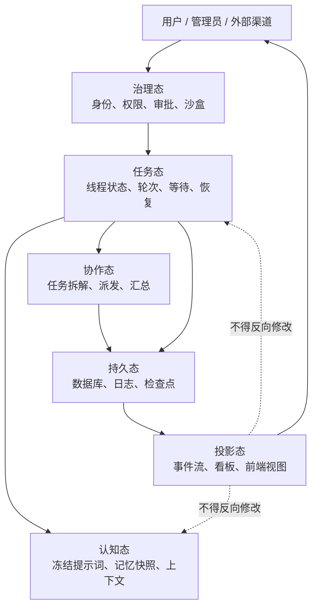
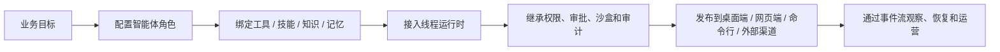
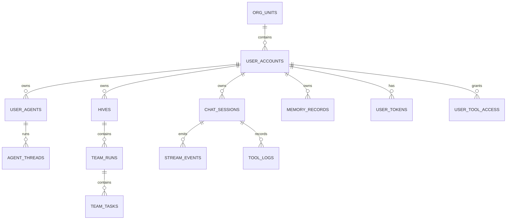
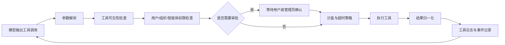
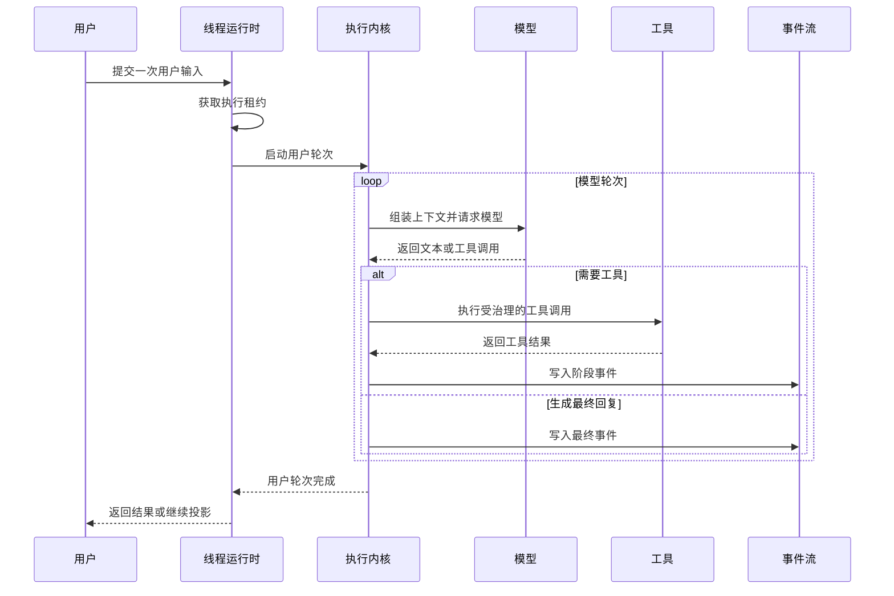
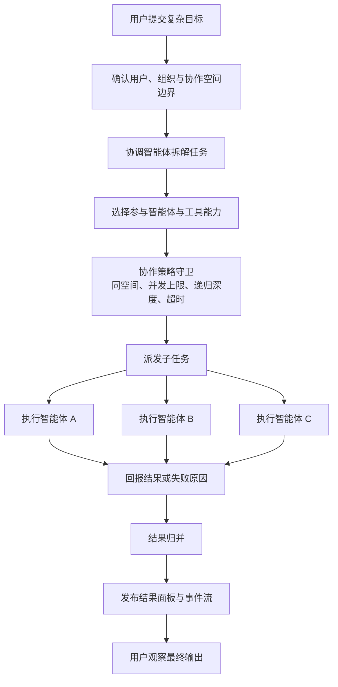
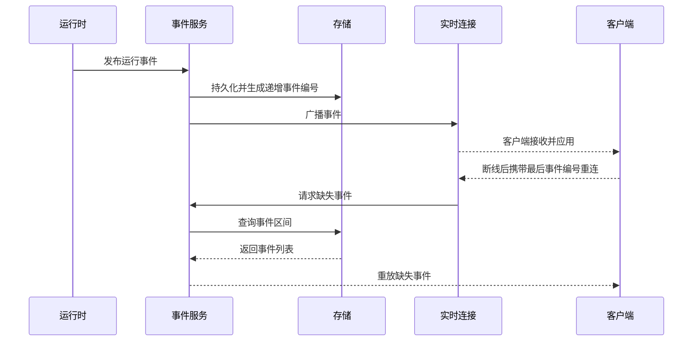

# 面向多用户场景的多智能体调控平台设计与实现

## 摘要

大语言模型应用正在从单轮问答走向持续执行、工具调用和多角色协作。与普通对话系统相比，多智能体平台需要同时处理用户与组织隔离、智能体认知稳定、工具权限治理、协作任务调度、实时状态投影和异常恢复等问题。若缺少统一调控模型，系统容易出现上下文污染、任务归属混乱、前端状态反向影响后端、工具调用越权以及多智能体结果无法归并等问题。

本文以 wunder（心舰）智能体调度系统为工程对象，提出一种面向多用户场景的多智能体调控平台设计。wunder 的定位是智能体应用底座：它不直接限定上层应用形态，而是提供线程运行时、工具治理、技能封装、知识与记忆、协作调度、实时投影、多用户权限和多端接入等基础能力，使开发者和组织能够在统一内核上快速搭建面向不同场景的智能体应用。平台将系统状态划分为认知态、任务态、协作态、投影态、治理态和持久态，并通过执行内核层、实时投影层、治理控制层和存储资源层实现分层约束。单智能体以线程作为连续认知容器，通过系统提示词冻结、长期记忆一次性注入和用户轮次/模型轮次分离保证执行稳定；多智能体协作以协作空间、协作任务和子任务为核心对象，通过任务拆解、角色派发、状态回报和结果归并实现可控调度；多用户体系以用户、组织、智能体、工具权限、工作区和审计记录为治理对象，使服务端、桌面端和命令行端在共享同一运行内核的同时保留不同接入形态。

本文的主要贡献包括：提出状态分离调控模型；设计面向快速搭建的智能体底座能力模型；设计线程级认知稳定机制；设计临时子智能体与正式协作智能体并存的调度机制；设计面向多用户和多组织的资源归属与权限治理体系；实现支持事件持久化、断线重放和多端接入的工程原型。该设计为复杂智能体系统从“能调用模型”走向“可治理、可恢复、可协作、可复用搭建”的工程化落地提供了一种方案。

**关键词**：智能体底座；多智能体系统；智能体调度；状态分离；多用户治理；工具权限；实时投影；任务编排

---

## 1 引言

### 1.1 研究背景

早期大模型应用多以“用户输入、模型回答”为基本形态，系统只需维护短期对话历史和模型调用接口。随着工具调用、文件操作、浏览器控制、知识库检索、长期记忆和外部渠道接入逐步进入智能体应用，模型不再只是文本生成器，而成为能够持续感知、决策和行动的执行主体。平台层也因此从“对话转发器”转变为“智能体运行时”。

当系统进一步支持多个智能体协作时，工程复杂度显著增加。一个复杂任务可能被拆解给多个角色并行执行，不同智能体可能拥有不同工具、记忆、工作区和权限，协作过程还需要实时展示给用户或管理员。此时，平台不仅要让智能体能够完成任务，还要保证任务归属清晰、执行过程可观察、异常状态可恢复、高风险工具可治理。对于开发者和组织而言，更现实的诉求是快速搭建：在不重复实现模型接入、工具权限、任务调度、实时通信和多用户管理的前提下，能够围绕具体业务快速配置智能体、组合工具、接入知识、发布应用并持续运营。

### 1.2 问题提出

多智能体调控平台面临的核心问题可以概括为五类。

第一，认知稳定问题。智能体线程一旦进入长任务执行，后续轮次不能随意改写系统提示词和长期记忆，否则同一线程的行为边界会漂移，模型侧提示词缓存也会失效。

第二，协作边界问题。临时派生的子智能体与平台中长期存在的协作智能体在生命周期、上下文来源、等待方式和结果归并上不同，若混为一类，容易造成任务污染和状态混乱。

第三，多用户治理问题。平台服务于个人、团队和组织时，必须区分用户身份、组织单元、智能体归属、工作区归属、工具权限、令牌额度和管理员操作权限。多智能体协作不能突破用户与组织边界。

第四，实时投影问题。前端、桌面端、命令行端和外部渠道都需要观察任务过程，但观察层不应成为运行时真相源。状态展示必须来自可持久化、可重放、可去重的事件流。

第五，快速搭建问题。不同业务场景需要不同智能体应用，但底层能力高度重复，包括模型调用、工具治理、知识检索、长期记忆、协作调度、实时展示、权限隔离和运行审计。平台需要把这些共性能力沉淀为底座，让上层应用通过配置、技能、工具和接口组合完成快速构建。

第六，工程演进问题。系统同时包含服务端、桌面端和命令行端，若三种形态各自维护运行逻辑，长期会形成三套不一致的智能体语义。平台需要共享核心运行时，只在接入、存储和本地能力上差异化。

### 1.3 本文贡献

本文围绕上述问题提出并实现一套多智能体调控平台，主要贡献如下。

1. 提出状态分离调控模型，将智能体系统中的认知态、任务态、协作态、投影态、治理态和持久态明确分离，避免单一对象承载过多职责。
2. 设计线程级认知稳定机制，以线程作为单智能体连续执行容器，通过系统提示词冻结、长期记忆一次性注入和执行租约保证运行边界。
3. 设计面向快速搭建的智能体底座能力模型，将模型接入、工具、技能、知识、记忆、工作区、渠道和前端投影沉淀为可复用平台能力。
4. 设计多智能体协作调度机制，区分临时子智能体与正式协作智能体，并通过协作任务、子任务、调度策略和结果归并实现可控协作。
5. 设计多用户治理体系，将用户、组织、智能体、工具、工作区、渠道和审计记录纳入统一权限与归属模型。
6. 实现三种运行形态共享同一核心的工程原型，并设计功能闭环、状态一致性、权限隔离和恢复能力的验证口径。

---

## 2 需求分析

### 2.1 平台定位

wunder 的目标不是提供一个带聊天界面的模型调用器，而是提供一个可复用的智能体应用底座。所谓底座，是指平台把智能体应用中高度重复且风险较高的共性部分收敛为基础设施，包括线程运行时、模型调用、工具权限、技能封装、知识与记忆、工作区、协作调度、实时投影、渠道接入和多用户治理。上层应用不需要重新实现这些能力，只需要围绕业务目标配置智能体角色、绑定工具与知识、设计技能流程、选择运行形态，即可快速形成可运行、可观察、可治理的智能体应用。

系统包含三种运行形态：服务端面向组织级部署，桌面端面向个人本地使用，命令行端面向脚本化和自动化场景。三种形态共享线程运行时、工具治理、存储抽象和实时事件契约。

### 2.2 设计目标

表 1 给出了平台需求与设计目标之间的对应关系。

**表 1 平台需求与设计目标**

| 需求类别 | 具体问题 | 设计目标 |
| --- | --- | --- |
| 认知稳定 | 长任务执行中提示词和记忆可能漂移 | 线程首次确定系统提示词后冻结，长期记忆只在初始化时注入 |
| 多智能体协作 | 多角色任务分发、等待、失败和结果归并复杂 | 建立协作空间、任务实例、子任务和结果面板模型 |
| 多用户治理 | 用户、组织、智能体、工具和工作区归属易混淆 | 以用户和组织为资源根，所有执行对象带归属与权限约束 |
| 实时观察 | 前端需要实时展示执行过程和协作状态 | 以持久化事件流作为投影来源，支持断线重放 |
| 工具安全 | 文件、命令、浏览器、外部渠道等能力风险高 | 工具调用经过可见性、权限、审批、沙盒、超时和审计治理 |
| 多端复用 | 服务端、桌面端、命令行端易形成三套系统 | 共享核心运行时，按运行形态启停能力 |
| 快速搭建 | 不同业务重复实现模型、工具、知识、权限和实时通信 | 将共性能力沉淀为底座，上层应用通过配置和接口组合搭建 |
| 工程演进 | 代码规模增长后模块边界易失控 | 按职责分层，新增能力优先落在清晰领域模块 |

### 2.3 多用户体系需求

多用户能力不是平台外层的账户功能，而是调度系统的基础约束。智能体执行的每一次工具调用、文件访问、协作派发和渠道投递，都必须能够回答以下问题：谁发起、属于哪个用户或组织、使用了哪个智能体、访问了哪些资源、是否经过授权、是否需要审计。

因此，平台至少需要维护六类用户治理对象。

**表 2 多用户治理对象**

| 对象 | 作用 | 关键约束 |
| --- | --- | --- |
| 用户账户 | 标识自然用户或系统用户 | 资源归属、登录、令牌额度、审计主体 |
| 组织单元 | 管理团队和租户边界 | 组织内用户、共享智能体、管理员权限 |
| 用户智能体 | 用户可配置和使用的智能体实体 | 角色、模型、工具面、技能、工作区和协作空间归属 |
| 工具权限 | 控制用户和智能体可见工具 | 高风险工具默认不可直接执行 |
| 工作区与知识资源 | 文件、记忆、知识库和产物 | 必须受用户与组织边界约束 |
| 审计与运行记录 | 记录关键动作和状态变化 | 支持排障、追责、恢复和容量分析 |

多用户体系与多智能体体系相互嵌套：多智能体协作必须发生在合法的用户、组织或协作空间范围内；协作任务不能越过资源归属边界调用其他用户的智能体或工具。

---

## 3 状态分离调控模型

### 3.1 模型概述

多智能体平台的复杂性主要来自状态混杂。若将用户会话、智能体上下文、前端展示、协作任务、工具审批和数据库记录都放入同一对象，短期实现看似简单，长期会导致状态互相污染。本文提出状态分离调控模型，将系统状态划分为六类。

**表 3 状态分离模型**

| 状态类型 | 含义 | 权威来源 | 典型对象 |
| --- | --- | --- | --- |
| 认知态 | 智能体如何理解任务和自身边界 | 线程与冻结提示词 | 系统提示词、开发者上下文、记忆快照 |
| 任务态 | 当前执行轮次和等待/恢复状态 | 线程运行时 | 用户轮次、模型轮次、等待审批、恢复计划 |
| 协作态 | 多智能体任务的拆解、派发和汇总 | 协作运行时 | 协作空间、协作任务、子任务、参与智能体 |
| 投影态 | 用户和管理员看到的实时视图 | 事件流与投影服务 | 消息流、任务看板、在线状态、公开摘要 |
| 治理态 | 谁可以做什么、是否需要审批 | 权限与控制服务 | 用户权限、工具权限、沙盒策略、渠道认证 |
| 持久态 | 可恢复、可审计的业务与运行记录 | 存储层 | 用户、智能体、线程、事件、工具日志、任务记录 |

**图 1 状态分离调控模型**

图 1 表明，前端和外部观察者只能通过投影态观察系统，不能直接修改认知态和任务态。协作态也不能改写线程的冻结提示词，只能通过任务输入、工具结果和归并摘要影响后续执行。

### 3.2 状态分离的工程意义

状态分离带来三方面收益。

第一，降低故障传播范围。投影层的重连失败不应破坏正在执行的线程；协作任务的部分失败也不应污染其他用户的智能体配置。

第二，提升恢复能力。线程状态、事件流和协作任务记录进入持久态后，系统可以根据数据库记录和事件序列恢复，而不是依赖在线进程内存。

第三，强化权限治理。治理态独立存在后，工具调用、渠道接入、管理员操作和协作派发都必须经过统一权限判断，而不是散落在页面逻辑或提示词中。

---

## 4 总体架构设计

### 4.1 分层架构

平台采用分层结构。接入层负责 HTTP、WebSocket、桌面桥接、命令行和外部渠道；治理控制层负责身份、权限、审批、沙盒、渠道认证和网关连接；执行内核层负责单智能体线程和多智能体协作任务；实时投影层负责事件发布、状态重放和用户侧视图；存储资源层负责数据库、工作区、记忆、知识库和工具产物。

**图 2 平台总体架构**

```mermaid
flowchart LR
  subgraph Access["接入层"]
    Web["用户侧前端"]
    Admin["管理端"]
    Desktop["桌面端"]
    Cli["命令行端"]
    Channel["外部渠道"]
  end

  subgraph Control["治理控制层"]
    Auth["身份与组织"]
    Permission["工具与资源权限"]
    Approval["审批与沙盒"]
    Gateway["网关与渠道治理"]
  end

  subgraph Runtime["执行内核层"]
    Thread["线程运行时"]
    Orchestrator["智能体执行器"]
    Mission["协作任务运行时"]
    Tools["工具执行治理"]
  end

  subgraph Projection["实时投影层"]
    Events["事件流"]
    Replay["断线重放"]
    Board["任务看板与在线状态"]
  end

  subgraph Data["存储资源层"]
    Storage["统一存储抽象<br/>PostgreSQL / SQLite"]
    Workspace["工作区"]
    Memory["长期记忆"]
    Knowledge["知识库"]
  end

  Access --> Control
  Control --> Runtime
  Runtime --> Data
  Runtime --> Projection
  Projection --> Access
  Control --> Data
```

### 4.2 三种运行形态

服务端、桌面端和命令行端共享核心运行时，但启用能力不同。服务端面向组织部署，强调多用户、多渠道、网关和后台任务；桌面端面向个人本地使用，强调本地文件、轻量数据库和离线可用；命令行端面向脚本化任务，强调快速启动和批处理。

**表 4 运行形态对比**

| 运行形态 | 主要场景 | 默认存储 | 关键能力 |
| --- | --- | --- | --- |
| 服务端 | 组织部署、多用户访问、外部渠道接入 | PostgreSQL | 用户组织管理、网关、渠道、协作任务、实时投影 |
| 桌面端 | 个人本地使用、操作本机资源 | SQLite | 本地工作区、线程运行时、桌面桥接、本地任务 |
| 命令行端 | 自动化、批处理、脚本调用 | 本地存储抽象 | 轻量执行、脚本化调用、复用运行内核 |

这种设计避免了三种形态各自实现智能体循环。所有入口最终进入同一套线程运行时、工具治理、协作调度和事件投影。

### 4.3 智能体底座能力模型

作为智能体应用底座，wunder 的关键设计不是提供单一应用模板，而是把上层智能体应用所需的公共能力拆成可复用平台模块。开发者可以先定义智能体角色，再绑定工具、技能、知识和工作区，随后选择运行形态并接入用户界面或外部渠道。平台负责承接线程运行、权限治理、实时投影、协作调度和持久化记录。

**图 3 智能体应用快速搭建路径**

**表 5 智能体底座能力与快速搭建作用**

| 底座能力 | 解决的问题 | 对快速搭建的作用 |
| --- | --- | --- |
| 线程运行时 | 长任务、工具循环、等待与恢复难以统一 | 上层应用直接获得稳定执行容器 |
| 工具治理 | 文件、命令、浏览器和外部能力存在风险 | 开发者只需声明工具，审批和沙盒由平台承接 |
| 技能封装 | 固定流程难以复用和分发 | 将领域流程沉淀为可调用能力包 |
| 知识与记忆 | 业务资料和长期偏好难以接入 | 应用可按需绑定知识库和记忆策略 |
| 多智能体协作 | 多角色分工和结果归并复杂 | 通过协作空间和任务运行时复用调度能力 |
| 实时投影 | 执行过程不可见、断线后难恢复 | 应用天然具备事件流、看板和重放能力 |
| 多用户治理 | 团队场景需要身份、权限、配额和审计 | 组织级应用可直接复用用户与权限体系 |
| 多端接入 | 同一应用需要桌面、网页、命令行或渠道入口 | 入口差异不改变核心执行语义 |

由此，wunder 的快速搭建不是简单生成一个聊天页面，而是让智能体应用从创建开始就具备可持续执行、可扩展能力、可协作、可观测和可治理的基础。对于个人用户，桌面端提供开箱即用的本地智能体工作台；对于团队和组织，服务端提供多用户、权限、渠道和管理端能力；对于开发者，命令行和开放接口提供自动化嵌入能力。

### 4.4 存储与状态边界

平台存储采用统一抽象、双后端实现。服务端使用 PostgreSQL 支撑多连接、多用户和运维治理；桌面端使用 SQLite 支撑本地轻量分发。业务层面不直接依赖具体数据库，而是依赖统一存储接口。

存储对象按真相层级分为四类：业务持久状态、运行持久状态、派生投影状态和进程临时状态。用户、组织、智能体、协作空间和工具权限属于业务持久状态；线程快照、等待状态、工具日志和事件流属于运行持久状态；任务列表、摘要缓存和前端看板属于派生投影状态；在线连接、热缓存和临时目录属于进程临时状态。

---

## 5 多用户治理体系设计

### 5.1 用户、组织与资源归属

多用户体系以用户账户和组织单元为根对象。用户可以拥有智能体、线程、工作区、记忆、知识库和协作空间；组织可以管理共享智能体、共享工具、渠道配置和管理员权限。所有运行对象都必须能够追溯到用户或组织，否则无法进行权限判断、资源计量和审计。

**图 4 多用户资源归属模型**

该模型强调两点：一是智能体不是游离对象，它必须归属于用户或组织；二是协作任务不是独立于权限体系的运行单元，它必须位于某个协作空间和用户边界内。

### 5.2 权限与工具治理

工具治理采用“可见性、授权、审批、隔离、审计”五步约束。可见性决定模型在当前线程能看到哪些工具；授权判断用户、组织和智能体是否允许调用该工具；审批处理高风险动作；隔离通过沙盒、路径边界、超时和资源限制控制执行范围；审计记录工具调用、结果、错误和用户确认。

**图 5 工具调用治理流程**

该流程将安全约束落实到运行时结构中，而不是依赖模型遵守提示词。即使模型尝试调用不可见工具，或传入越权路径，运行时也会在工具治理链路中拒绝。

### 5.3 多租户隔离

多租户隔离主要体现在四个层面。

第一，数据隔离。用户、组织、智能体、线程、记忆、知识库、工作区和协作空间都带有归属字段。列表查询和详情读取必须使用归属条件过滤。

第二，工具隔离。工具可见性不仅由系统是否安装工具决定，还由用户权限、智能体声明、审批模式和运行形态共同决定。

第三，协作隔离。协作智能体只能在同一协作空间或被明确授权的边界内被调度，防止一个用户任务派发到另一个用户的智能体。

第四，接入隔离。外部渠道、网关节点和管理员控制面具有独立身份，不得与普通用户会话身份混同。

---

## 6 智能体执行内核设计

### 6.1 线程作为认知容器

在平台中，线程是单智能体的连续执行上下文，不等同于一条消息或一个前端会话。线程保存当前执行状态、轮次编号、等待原因、恢复计划、冻结提示词引用、上下文摘要和执行租约。以线程为认知容器，可以让智能体在多轮任务中保持稳定身份、工具面和行为边界。

线程包含四层内容：线程状态、认知上下文、执行治理和现实外壳。线程状态记录当前是否运行、等待、压缩、错误或关闭；认知上下文包含系统提示词、用户上下文、记忆快照和工具观察；执行治理包含工具面、审批策略、沙盒策略、重试策略和模型能力约束；现实外壳包含工作区文件、事件流、数据库记录和运行指标。

### 6.2 提示词冻结与记忆单次注入

系统提示词一旦在线程首次确定后即被冻结，后续用户轮次不得改写。长期记忆只允许在线程初始化时通过快照注入一次，后续轮次如果需要记忆，应通过工具检索，而不是再次改写系统提示词。

这一机制解决三个问题。第一，保证同一线程的认知边界稳定。第二，避免后续记忆变化造成行为漂移。第三，保持模型侧提示词缓存的可复用性，降低长任务执行成本。

### 6.3 用户轮次与模型轮次

平台将用户轮次和模型轮次分开计量。用户轮次指用户一次输入到智能体最终回复之间的全过程；模型轮次指一次模型调用、输出解析和可能的工具执行。一个用户轮次可以包含多个模型轮次。

**图 6 用户轮次与模型轮次关系**

这种拆分有利于观察和恢复。一次用户请求中，模型可能调用多个工具、进入等待审批、触发上下文压缩或发生重试；这些细节都属于模型轮次和任务态，而不应被简化为“一条消息”。

### 6.4 执行租约与等待状态

同一线程在同一时刻只能有一个执行所有者。线程运行时通过执行租约保证互斥，防止多个请求同时推进同一线程。等待审批、等待用户输入、等待子智能体和中断恢复都是显式状态，能够被事件流观察，也能够在服务重启后根据持久状态恢复。

---

## 7 多智能体协作调度设计

### 7.1 协作对象模型

多智能体协作以协作空间为边界。协作空间是一组智能体围绕某类目标形成的稳定协作域；协作任务是一次具体的多智能体任务实例；子任务是协作任务下发给某个智能体或执行单元的工作项；结果面板是对外可观察的协作摘要和任务状态。

**表 6 协作对象及职责**

| 对象 | 职责 | 状态类型 |
| --- | --- | --- |
| 协作空间 | 组织一组可协作智能体，限定协作边界 | 业务持久状态 |
| 协调智能体 | 拆解任务、选择参与者、汇总结果 | 认知态与协作态交界 |
| 协作任务 | 表示一次多智能体任务实例 | 协作态与运行持久状态 |
| 子任务 | 表示派发给某个智能体的工作单元 | 协作态 |
| 执行智能体 | 执行被分配的具体任务 | 线程任务态 |
| 结果面板 | 面向用户展示协作过程和摘要 | 投影态 |

### 7.2 子智能体与协作智能体

平台区分临时子智能体和正式协作智能体。临时子智能体由当前智能体为完成局部任务临时创建，默认不阻塞主线程，完成后通过回报唤醒主线程；正式协作智能体是平台中已存在的智能体，被协作任务调度参与工作，默认需要等待结果并归并摘要。

**表 7 子智能体与协作智能体对比**

| 维度 | 临时子智能体 | 正式协作智能体 |
| --- | --- | --- |
| 目标 | 当前线程临时分叉任务 | 协作空间内多角色任务 |
| 来源 | 主智能体临时创建 | 用户或组织已有智能体 |
| 生命周期 | 任务完成后可结束 | 长期存在，可多次参与协作 |
| 默认等待 | 非阻塞，完成后唤醒主线程 | 阻塞或按策略等待汇总 |
| 上下文 | 从父任务获得最小必要输入 | 使用自身角色、工具和独立线程 |
| 结果处理 | 回到父线程作为观察结果 | 汇总到协作任务和结果面板 |
| 风险 | 容易造成父子等待混乱 | 容易跨用户或跨协作空间越权 |
| 关键约束 | 幂等唤醒和父线程恢复 | 同空间调度、权限检查和结果归并 |

这种区分是协作调度的关键。临时子智能体解决“当前任务需要轻量分叉”的问题，正式协作智能体解决“已有角色需要并行协作”的问题。二者共享工具治理和线程运行时，但不共享生命周期语义。

### 7.3 协作任务调度流程

一次标准协作任务包括目标接收、任务拆解、参与者选择、子任务派发、状态回报、失败重试、结果归并和投影发布。

**图 7 多智能体协作调度流程**

调度流程中，策略守卫承担运行时保护职责，包括协作空间校验、最大并发任务数、最大递归派发深度、任务超时、重试次数和全局活跃任务上限。该设计防止模型因错误规划造成无限嵌套、过量并发或跨边界调用。

### 7.4 结果归并机制

多智能体协作的核心不是并行请求数量，而是结果能否被收束。平台要求所有执行智能体返回结构化摘要、关键产物引用、失败原因和后续建议。协调智能体或协作运行时再根据策略进行归并，形成面向用户的最终结果。

结果归并至少包含四类信息：已完成子任务、失败或超时子任务、可复用产物、需要用户确认的后续动作。这样可以避免协作结果散落在多个线程中，用户无法判断任务是否完成。

---

## 8 实时投影与通信设计

### 8.1 事件流作为投影基础

实时投影层使用事件流作为基础。每个事件带有稳定编号、归属流、事件类型和载荷。后端写入事件后再向前端广播；前端根据最后已见事件编号请求重放，完成断线恢复。

**图 8 事件持久化、广播与重放**

事件流机制使投影态可以被重建。前端可以维护列表、看板、进度和在线状态，但这些状态都来自事件和快照，不是线程运行的真相源。

### 8.2 协作状态投影

协作任务产生的状态包括任务开始、子任务派发、执行中、等待、失败、完成、结果归并和最终摘要。投影层将这些事件转换为任务看板、智能体活动轨迹和公开摘要。管理员也可以通过监控入口观察协作运行时、事件流、工具日志和渠道状态。

### 8.3 外部渠道与网关通信

平台支持外部渠道和网关节点接入。渠道层负责消息入站、绑定用户、会话策略、限流、附件处理和出站投递；网关层负责节点连接、角色识别、调用请求、响应匹配和健康维护。二者都属于治理控制层，不能直接改写智能体认知态。

---

## 9 系统实现

### 9.1 后端实现

后端采用 Rust 工作区组织。核心运行时位于 `crates/wunder-runtime`，服务端入口位于 `crates/wunder-server`，命令行端位于 `crates/wunder-cli`，桌面运行时位于 `crates/wunder-desktop`。这种结构使平台能够在不同运行形态中复用同一套智能体语义。

**表 8 核心模块与代码落点**

| 设计职责 | 主要模块 |
| --- | --- |
| 智能体执行链路 | `crates/wunder-runtime/src/orchestrator/` |
| 线程生命周期与排队 | `crates/wunder-runtime/src/services/runtime/thread/` |
| 多智能体协作任务 | `crates/wunder-runtime/src/services/runtime/mission/`、`services/swarm/` |
| 工具、技能与外部能力 | `crates/wunder-runtime/src/services/tools/`、`services/skills.rs`、`services/mcp.rs` |
| 实时事件与投影 | `crates/wunder-runtime/src/services/stream_events.rs`、`services/beeroom_realtime.rs` |
| 用户、组织与权限 | `crates/wunder-runtime/src/services/user_access.rs`、`api/auth.rs` |
| 网关与渠道 | `crates/wunder-runtime/src/gateway/`、`crates/wunder-runtime/src/channels/` |
| 存储抽象 | `crates/wunder-runtime/src/storage/` |
| 服务端入口 | `crates/wunder-server/src/main.rs` |
| 用户侧前端 | `frontend/` |
| 管理端 | `web/` |

### 9.2 数据模型实现

平台数据库包含用户治理、智能体、线程、协作任务、事件流、工具日志、渠道、网关、记忆和知识库等领域。服务端使用 PostgreSQL，桌面端使用 SQLite。二者共享记录结构和存储抽象，差异被限制在 SQL 实现和初始化策略中。

在多用户治理方面，系统维护用户账户、组织单元、用户令牌、用户工具权限、用户智能体、智能体访问控制和协作空间等表；在协作调度方面，维护协作任务和子任务记录；在实时投影方面，维护事件流和消息记录；在审计方面，维护工具日志、运行记录和监控记录。

### 9.3 前端与管理端实现

用户侧前端是实时投影消费者，负责展示会话、文件、智能体、协作空间和任务状态。它可以进行乐观展示，但最终必须接受后端事件回压并收敛到后端状态。管理端负责系统配置、用户治理、渠道状态、网关状态、监控指标和调试追踪。管理端操作风险更高，因此必须配合后端权限与审计。

### 9.4 桌面端与命令行实现

桌面端复用运行时核心，并通过本地桥接访问文件系统和桌面能力。命令行端复用 AppState、配置、工具和存储语义，用于自动化和批处理。二者不重新定义线程、工具和协作语义。

---

## 10 工程验证方案

由于本文面向工程平台设计，验证重点不应仅是单次回答质量，而应覆盖状态一致性、协作闭环、多用户隔离和恢复能力。表 9 给出验证矩阵。

**表 9 验证矩阵**

| 验证目标 | 验证场景 | 预期结果 |
| --- | --- | --- |
| 单智能体执行闭环 | 用户提交任务，线程完成多轮模型调用和工具执行 | 用户轮次、模型轮次、工具日志和事件记录一致 |
| 认知稳定 | 同一线程多轮执行后检查系统提示词和记忆注入 | 系统提示词保持冻结，记忆不重复注入 |
| 工具治理 | 调用高风险工具、越权工具和正常工具 | 高风险工具进入审批，越权工具被拒绝，正常工具产生审计记录 |
| 多智能体协作 | 一个目标拆分给多个智能体并归并结果 | 形成协作任务、子任务、活动事件和最终摘要 |
| 多用户隔离 | 不同用户访问智能体、工作区、协作空间和工具 | 用户只能访问授权资源，跨用户调度被阻止 |
| 断线恢复 | 前端断开后携带最后事件编号重连 | 缺失事件可重放，投影状态恢复一致 |
| 三形态同核 | 服务端、桌面端、命令行端执行同类线程任务 | 执行语义一致，差异仅体现在存储和接入能力 |
| 异常恢复 | 任务超时、工具失败、协作子任务失败 | 状态进入可观察失败或可恢复等待，不出现无界挂起 |

### 10.1 功能闭环验证

功能闭环验证关注用户目标能否从接入层进入线程或协作任务，并最终产生可观察结果。单智能体场景验证线程创建、轮次推进、工具调用和事件发布；多智能体场景验证任务拆解、子任务派发、参与智能体执行、结果归并和看板更新。

### 10.2 一致性验证

一致性验证关注持久态与投影态是否一致。事件流中的任务状态、数据库中的线程状态和前端展示状态应保持可解释关系。若前端断线或刷新，应能通过事件重放和快照恢复，而不是重新构造一套前端私有状态。

### 10.3 权限隔离验证

权限隔离验证关注用户、组织和智能体之间的边界。测试应覆盖用户访问非本人线程、协作任务跨空间派发、工具权限不足、管理员操作审计、渠道身份绑定和网关节点调用等场景。预期结果是未授权访问被拒绝，已授权操作留下可追踪记录。

### 10.4 性能与稳定性指标

平台后续压测应至少记录以下指标。

**表 10 性能与稳定性指标**

| 指标 | 含义 | 关注原因 |
| --- | --- | --- |
| 线程提交延迟 | 请求进入线程运行时到开始执行的时间 | 反映排队和租约效率 |
| 模型轮次耗时 | 一次模型调用及解析的耗时 | 反映执行内核开销 |
| 工具治理耗时 | 权限、审批、沙盒和执行总耗时 | 反映高风险能力成本 |
| 事件推送延迟 | 事件持久化到客户端可见的时间 | 反映实时投影能力 |
| 事件重放耗时 | 断线恢复时补齐事件的时间 | 反映恢复能力 |
| 协作任务完成时间 | 多智能体任务从创建到归并的时间 | 反映调度效率 |
| 并发任务吞吐 | 单位时间可处理的线程或协作任务数 | 反映服务端容量 |
| 内存峰值 | 长任务和多任务下的内存使用 | 反映资源边界 |

本文不虚构具体压测数值。实际提交或部署前，应使用同环境基线、优化后结果和回退结论记录性能变化。

---

## 11 创新点与讨论

### 11.1 状态分离调控模型

本文将多智能体平台中的状态拆分为六类，并明确每类状态的权威来源。该模型的价值在于把“谁是真相源”从隐含约定变为结构约束。前端、协作任务和外部渠道可以观察或触发运行，但不能直接篡改线程认知态。

### 11.2 线程级认知稳定机制

线程作为认知容器，使智能体不再只是一次模型调用。系统提示词冻结和记忆一次性注入保证了线程的长期一致性；用户轮次和模型轮次分离则让工具循环、等待审批和恢复路径具有可观察结构。

### 11.3 智能体底座与快速搭建机制

wunder 将线程运行时、工具治理、技能封装、知识记忆、工作区、实时投影、多用户治理和多端接入封装为底座能力，使上层应用能够通过配置和组合快速形成可运行系统。与单一应用框架相比，底座化设计更强调公共能力复用和运行语义一致：不同业务应用可以拥有不同智能体角色、工具组合和交互入口，但它们共享相同的线程、权限、事件和协作模型。

### 11.4 双通道多智能体协作机制

平台区分临时子智能体和正式协作智能体，避免把所有协作都抽象成“多开几个模型”。临时子智能体适合轻量分叉，正式协作智能体适合已有角色参与的任务编排。二者在等待方式、生命周期和结果归并上有明确差异。

### 11.5 多用户调控与多智能体调控一体化

多智能体系统若不考虑多用户治理，无法进入组织级使用。本文将用户、组织、工具、工作区、智能体和协作空间统一纳入资源归属模型，使协作调度始终运行在授权边界内。

### 11.6 可恢复实时投影

事件流不仅服务于界面刷新，也服务于恢复、审计和排障。通过持久化事件、递增编号和断线重放，平台能够把实时展示从易丢失的前端状态转化为可重建的工程机制。

### 11.7 局限性

当前设计仍有若干局限。第一，分布式多节点执行租约仍需进一步完善，以支撑更大规模的服务端部署。第二，复杂任务的自动拆解质量依赖协调智能体能力，需要更多任务模板和失败反馈机制。第三，跨组织协作、共享智能体市场和更细粒度资源计费仍需进一步设计。第四，本文给出工程验证矩阵，但实际性能数据需要在固定硬件、固定数据集和固定并发配置下补充。

---

## 12 结论

本文围绕多用户场景下的多智能体调控问题，提出并实现了一种状态分离驱动的智能体调度平台设计。平台首先作为智能体应用底座，将模型接入、线程运行、工具治理、技能封装、知识记忆、工作区、协作调度、实时投影和多用户治理沉淀为可复用基础能力，使开发者和组织能够快速搭建不同场景的智能体应用。在此基础上，平台以线程作为单智能体认知容器，通过系统提示词冻结、记忆一次性注入、执行租约和显式等待状态保证认知稳定；以协作空间、协作任务和子任务作为多智能体调度对象，通过任务拆解、策略守卫、并发派发和结果归并实现可控协作；以用户、组织、智能体、工具、工作区和审计记录作为多用户治理对象，保证协作调度不突破权限边界；以事件流作为实时投影基础，支持断线恢复和外部观察。

该设计的核心观点是：多智能体平台的关键不在于同时运行多少模型，也不在于只提供某个固定应用，而在于能否把可复用底座能力与具体业务应用分离，把认知、任务、协作、投影、治理和持久化状态清晰分离，并在每条状态边界上建立可执行的工程约束。基于这一原则，wunder 将服务端、桌面端和命令行端收束到同一运行内核，为个人本地使用、组织级部署、业务智能体快速搭建和自动化接入提供了统一基础。

未来工作将围绕分布式执行租约、跨组织协作、协作任务质量评估、性能基线和更细粒度的工具风险治理继续推进。

---

## 参考资料

1. `docs/设计文档/01-系统总体设计.md`
2. `docs/设计文档/02-智能体核心设计.md`
3. `docs/设计文档/03-实时投影系统设计.md`
4. `docs/设计文档/04-协作蜂群与任务系统设计.md`
5. `docs/设计文档/08-数据存储与状态模型设计.md`
6. `docs/设计文档/12-安全-权限与隔离设计.md`
7. `docs/技术说明书/01-系统总览与术语.md`
8. `docs/技术说明书/10-运维、排障与验收.md`
