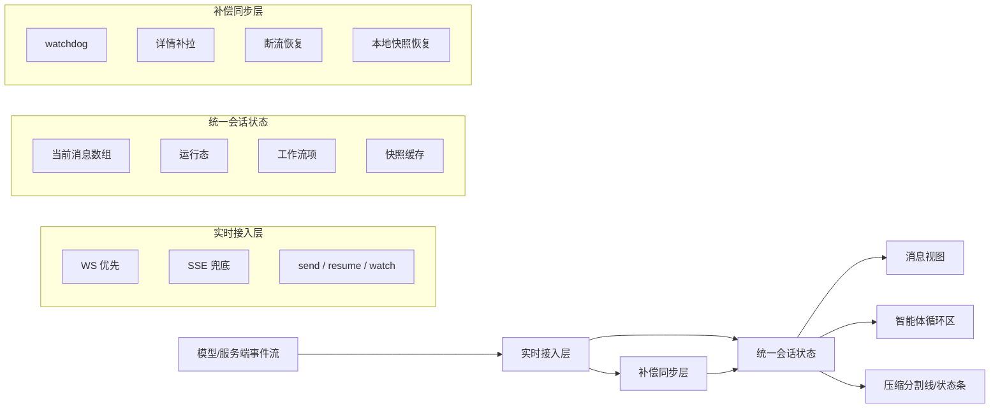
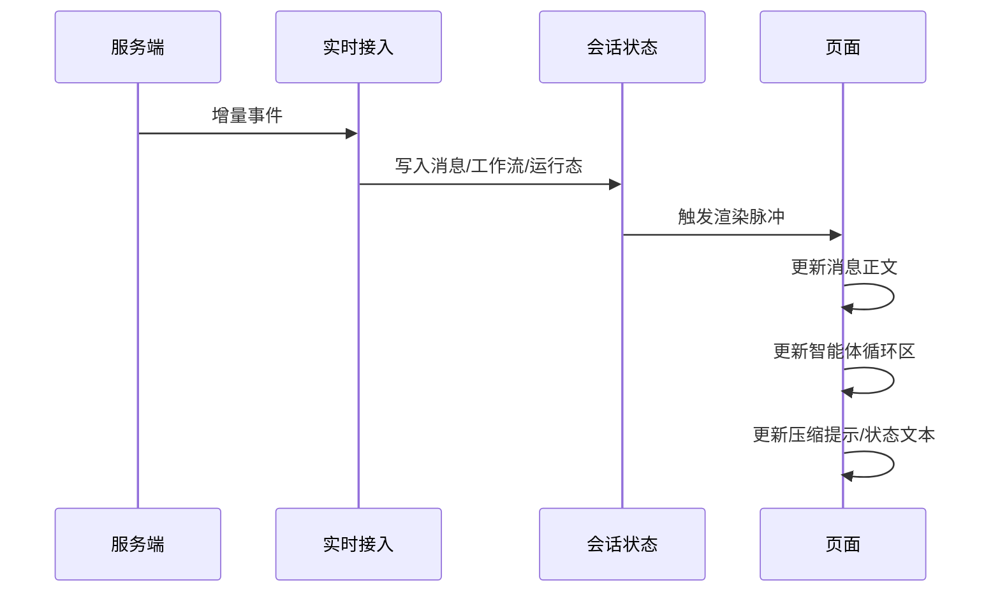
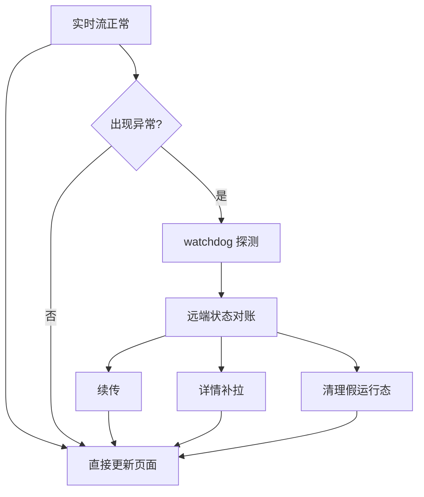

# 实时同步设计

## 目标

用户侧聊天页面要同时保证这几件事“尽快出现、持续更新、断了能补”：

- 消息正文
- 智能体循环区
- 工具调用
- 压缩动作
- 状态文本
- 页面刷新后的现场恢复

---

## 一张总图

核心思想只有三条：

1. 所有实时变化先收敛到一份统一会话状态
2. 消息区、循环区、压缩区都从同一份状态派生
3. 实时流不可信时，靠补偿同步把状态再拉平

---

## 设计原则

| 原则 | 说明 |
|---|---|
| 单一事实源 | 页面不各自维护一套运行态，统一从会话状态派生 |
| 事件先落状态 | 不直接驱动 DOM，先写入消息/工作流/运行态 |
| 同一数据多视图 | 消息、循环区、压缩提示本质上是同一轮状态的不同投影 |
| 实时优先 | 用户先看到“正在发生什么”，再慢慢补齐细节 |
| 补偿必不可少 | 只靠流式事件不稳，必须允许补拉与恢复 |
| 前台不回退 | 新到的实时内容不能被旧快照覆盖掉 |

---

## 分层结构

| 层 | 负责什么 | 不负责什么 |
|---|---|---|
| 接入层 | 接收 WS/SSE 事件 | 不直接决定 UI 长什么样 |
| 归并层 | 把事件归并成消息、工作流、运行态 | 不直接做视觉渲染 |
| 渲染层 | 根据统一状态展示消息、循环区、压缩条、状态条 | 不自行发明状态机 |
| 补偿层 | 断流恢复、补拉、快照恢复、反向对账 | 不替代主实时链路 |

---

## 实时主链路

这个链路的关键不是“事件直接改界面”，而是：

- 事件先进入统一状态
- 页面只订阅统一状态
- 所有区域一起变化，不容易分叉

---

## 为什么消息、循环区、压缩能一起实时

### 1. 同一轮统一挂载

一轮 assistant 运行中的动态信息，不拆成三条独立链路，而是统一挂在这组状态上：

- 文本输出
- thinking
- workflow 项
- streaming 标记
- waiting 标记
- 压缩标记

所以：

- 消息文本出来了，气泡可更新
- 工具调用进来了，循环区可更新
- 压缩事件进来了，压缩提示也可更新

### 2. 循环区不是“另开一套系统”

智能体循环区只是“工作流项”的一种渲染方式，不是第二套数据源。

好处：

- 不会出现“消息更新了但循环区没同步”
- 工具、子智能体、压缩可以并列展示
- 一旦工作流项更新，循环区天然跟着动

### 3. 压缩不是特殊页面事件，而是工作流事件

压缩动作被视为工作流的一种，因此天然能投影到：

- 循环区
- 分割线
- 状态文本

这样压缩不会成为“页面额外拼凑出来的提示”，而是系统运行态的一部分。

---

## 状态文本设计

状态文本不是后端直接给一句话，而是前端根据当前会话态推导。

### 状态优先级

| 优先级 | 状态 |
|---|---|
| 1 | 错误/失败 |
| 2 | 等待用户输入 |
| 3 | 断线重试中 |
| 4 | 排队中 |
| 5 | 压缩中 |
| 6 | 工具执行中 |
| 7 | 模型输出中 |
| 8 | 请求中 |
| 9 | 已完成 |

### 为什么压缩状态要按“会话级”判断

因为自动压缩不一定挂在“当前这条回复消息自己身上”，也可能单独插入成一条压缩标记消息。

所以状态判断不能只问：

- “当前消息自己有没有压缩项？”

还要问：

- “当前会话里是不是已经进入压缩阶段？”

这就是为什么现在状态条要按会话级感知，而不是只按局部消息感知。

---

## 补偿同步设计

实时系统不可能假设“每个事件都稳定到达”，因此需要补偿层。

### 补偿手段表

| 手段 | 解决什么问题 |
|---|---|
| watchdog | 长时间没新事件，但线程可能还在跑 |
| 续传 | 本地有未完成消息，远端事件号更靠后 |
| 详情补拉 | 本地视图落后于服务端完整状态 |
| 本地快照恢复 | 页面刷新后先恢复上次现场 |
| 运行态清理 | 避免前端卡在假的“运行中” |
| 实时内容保护 | 防止刚到的新内容被旧详情覆盖 |

---

## 前台不回退策略

这是聊天页实时体验最关键的一条。

### 问题

会出现这种竞态：

1. 实时流已经把新内容推到页面
2. 旧的详情快照稍后才回来
3. 如果直接覆盖，页面会“倒退”

### 解决方法

| 方法 | 作用 |
|---|---|
| 保留当前前台数组 | 让实时流和补拉尽量操作同一份数据 |
| 只补，不硬覆盖 | 旧详情只补缺失信息，不抹掉新内容 |
| 保护新到的实时消息 | 等历史真正追平后再自然收敛 |
| 保留活跃 watcher | 正在实时运行时，禁止旧详情强行接管前台 |

一句话概括：

- 前台看到的新东西，默认比后台慢到的旧快照更可信

---

## 为什么现在优先稳定而不是过度优化

聊天区曾经最容易出问题的点，就是“为了性能加太多中间层”，例如：

- 过度虚拟化
- 多份并行状态
- 页面自己拼接运行态

现在的取舍更明确：

| 方向 | 当前选择 |
|---|---|
| 消息区性能 | 够用即可 |
| 实时可见性 | 优先级更高 |
| 状态统一性 | 优先级更高 |
| 复杂缓存技巧 | 只保留必要部分 |

因此当前方案更偏向：

- 少分叉
- 少猜测
- 少延迟挂载
- 多补偿修正

---

## 页面看到的三个核心效果

### 1. 用户发出消息后

第一时间能看到：

- assistant 占位
- 当前状态
- 后续如果有工具/压缩，区域立刻接上

### 2. 智能体运行过程中

页面会连续看到：

- 模型输出
- 工具调用
- 工具结果
- 压缩动作
- 等待输入
- 重试信息

而不是等整轮结束后一次性出现。

### 3. 出现异常时

页面不会立刻“失明”，而是进入：

- 暂时保持现场
- 尝试续传
- 必要时补拉详情
- 最后再把状态收敛为终态

---

## 一张方法总结表

| 目标 | 方法 |
|---|---|
| 消息实时 | 流事件先写统一会话状态 |
| 循环区实时 | 工作流项直接驱动循环区 |
| 压缩实时 | 把压缩当成工作流事件处理 |
| 状态可信 | 状态文本按会话整体运行态推导 |
| 刷新可恢复 | 本地快照 + 服务端补拉 |
| 断流可恢复 | watchdog + 续传 + 对账 |
| 避免回退 | 前台新内容优先，旧详情只补不抹 |
| 避免分叉 | 页面不自建状态机，只消费统一状态 |

---

## 最终结论

wunder 用户侧聊天页的实时性，本质上不是靠某一个技巧，而是靠这套组合：

- 单一事实源
- 统一工作流模型
- 状态派生渲染
- 实时优先
- 补偿同步兜底
- 前台不回退

所以它的核心思想可以压缩成一句话：

> 先把所有变化收敛到统一会话状态，再让消息、循环区、压缩和状态条从这份状态同步投影；一旦实时链路不可靠，就用补偿同步把现场重新拉平。
