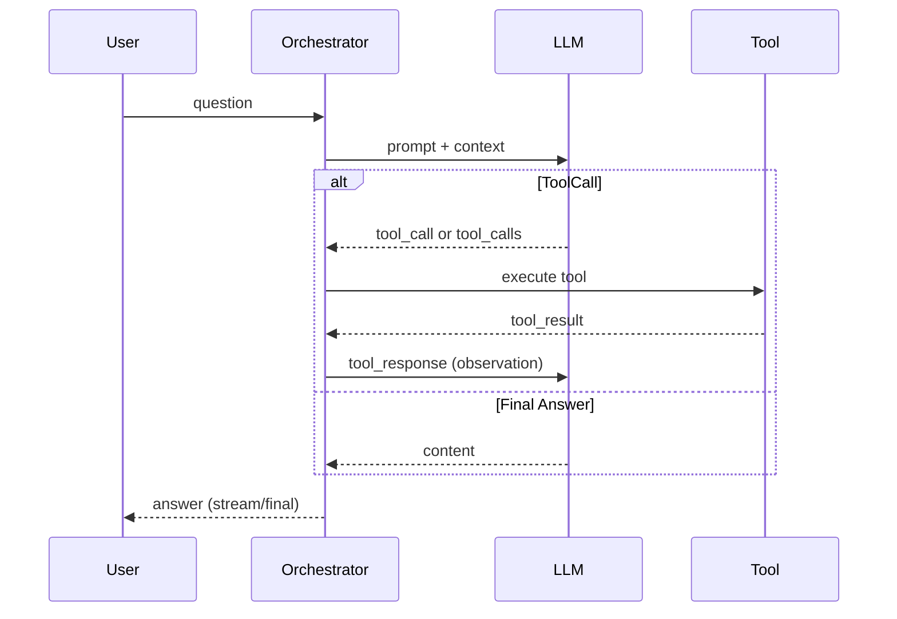
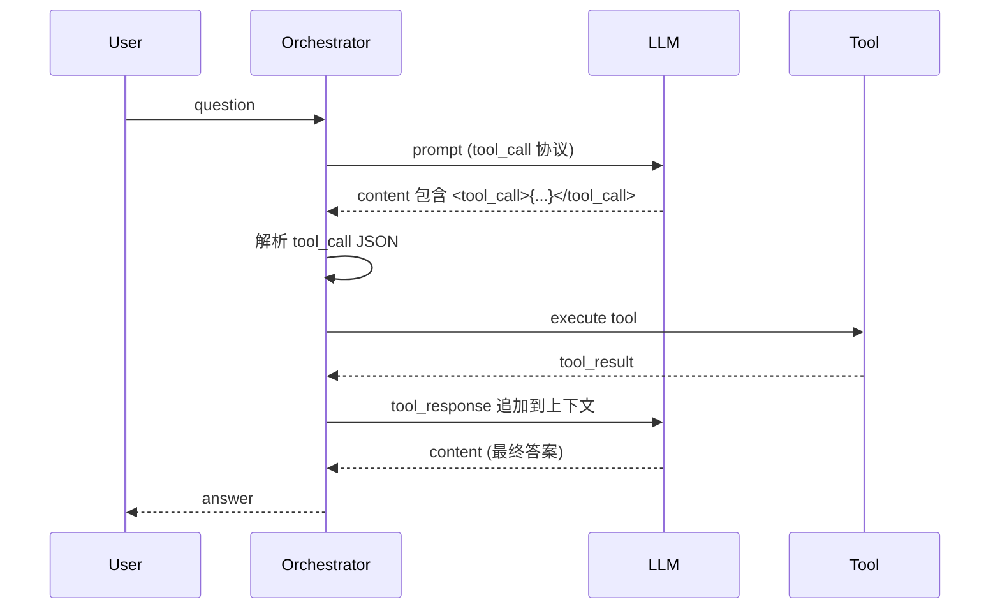
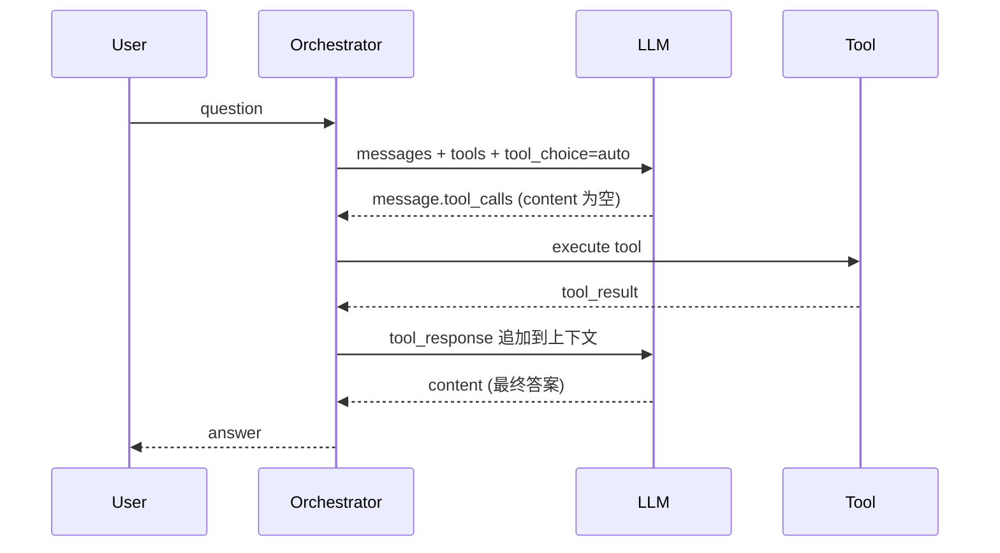

# 工具调用原理与模式

本页总结 wunder 的工具调用原理，说明两种模式：`tool_call` 与 `function_call`。两者的目标一致：让模型在“需要外部能力”时改为输出工具调用，并在工具执行后继续生成最终答案。

## 1. 总体原理（高层视角）

- 模型仍然是逐 token 解码，但在“允许工具调用”的协议下，输出会被提供方/服务端组织为结构化字段（`tool_calls`/`function_call`）或文本标签（`<tool_call>...</tool_call>`）。
- 系统识别到工具调用后执行对应工具，并将结果作为新的上下文消息追加，再进入下一轮模型生成。
- 只要工具调用未结束，系统不会直接把调用内容当作最终回复展示给用户。

**总体示意图**


## 2. tool_call 模式（文本标签）

### 2.1 输出形式
模型在 `content` 中输出 `<tool_call>...</tool_call>`，内部是 JSON，必须包含 `name` 和 `arguments`。

示例（模型输出）：
```text
<tool_call>
{"name":"read_file","arguments":{"path":"a.txt"}}
</tool_call>
```

### 2.2 解析与执行
服务端从 `content`/`reasoning` 中解析 `<tool_call>` 块，抽取 JSON 并执行工具。工具结果作为观察消息追加到上下文（wunder 使用前缀 `tool_response: ` 作为统一标记），随后继续下一轮生成。

示例（追加到下一轮的观察消息）：
```text
tool_response: {"tool":"read_file","ok":true,"data":{"content":"..."}}
```

### 2.3 示意图


## 3. function_call 模式（结构化字段）

### 3.1 输出形式
请求侧提供 `tools` + `tool_choice=auto`，模型如果需要调用工具，会在响应里返回结构化字段 `tool_calls`（或旧式 `function_call`），而不是在 `content` 中输出标签。

示例（请求）：
```json
{
  "model": "gpt-4o-mini",
  "messages": [{"role":"user","content":"读一下 a.txt"}],
  "tools": [
    {
      "type": "function",
      "function": {
        "name": "read_file",
        "description": "read local file",
        "parameters": {
          "type": "object",
          "properties": {"path": {"type": "string"}},
          "required": ["path"]
        }
      }
    }
  ],
  "tool_choice": "auto"
}
```

示例（响应，非流式）：
```json
{
  "choices": [
    {
      "message": {
        "role": "assistant",
        "content": null,
        "tool_calls": [
          {
            "type": "function",
            "function": {
              "name": "read_file",
              "arguments": "{\"path\":\"a.txt\"}"
            }
          }
        ]
      }
    }
  ]
}
```

示例（响应，流式片段）：
```text
data: {"choices":[{"delta":{"tool_calls":[{"index":0,"function":{"name":"read_file","arguments":"{\"path\":\"a.txt\"}"}}]}}]}
data: [DONE]
```

### 3.2 执行与续写
系统读取 `tool_calls`，执行工具后将结果追加为观察消息，再继续请求模型生成最终答案。

### 3.3 示意图


## 4. 对比与选择建议

| 维度 | tool_call | function_call |
| --- | --- | --- |
| 输出形态 | 文本标签 `<tool_call>...</tool_call>` | 结构化字段 `tool_calls`/`function_call` |
| 依赖提供方协议 | 否（纯文本解析） | 是（OpenAI-compatible tools 协议） |
| 可读性/可调试 | 直接可见调用文本 | 结构化更稳定，content 通常为空 |
| 流式处理 | 解析文本片段 | 读取 `delta.tool_calls` 片段 |
| 兼容性 | 高（适配更多模型） | 取决于提供方是否支持工具调用 |

**建议**
- 模型/提供方支持 tools 协议时，优先 `function_call`，稳定性更好。
- 若模型不支持 tools 协议或调试希望直观看到调用文本，可选 `tool_call`。

## 5. 注意事项

- 工具调用只是“阶段性输出”，最终回复需要在工具结果回填后再生成。
- 允许工具调用的前提是请求侧明确传入可用工具定义。
- 工具结果建议结构化，便于模型后续理解与引用。
