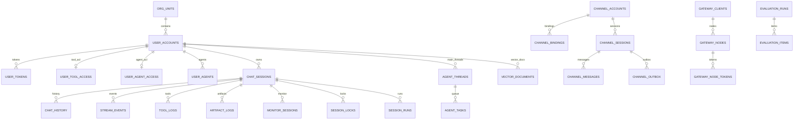
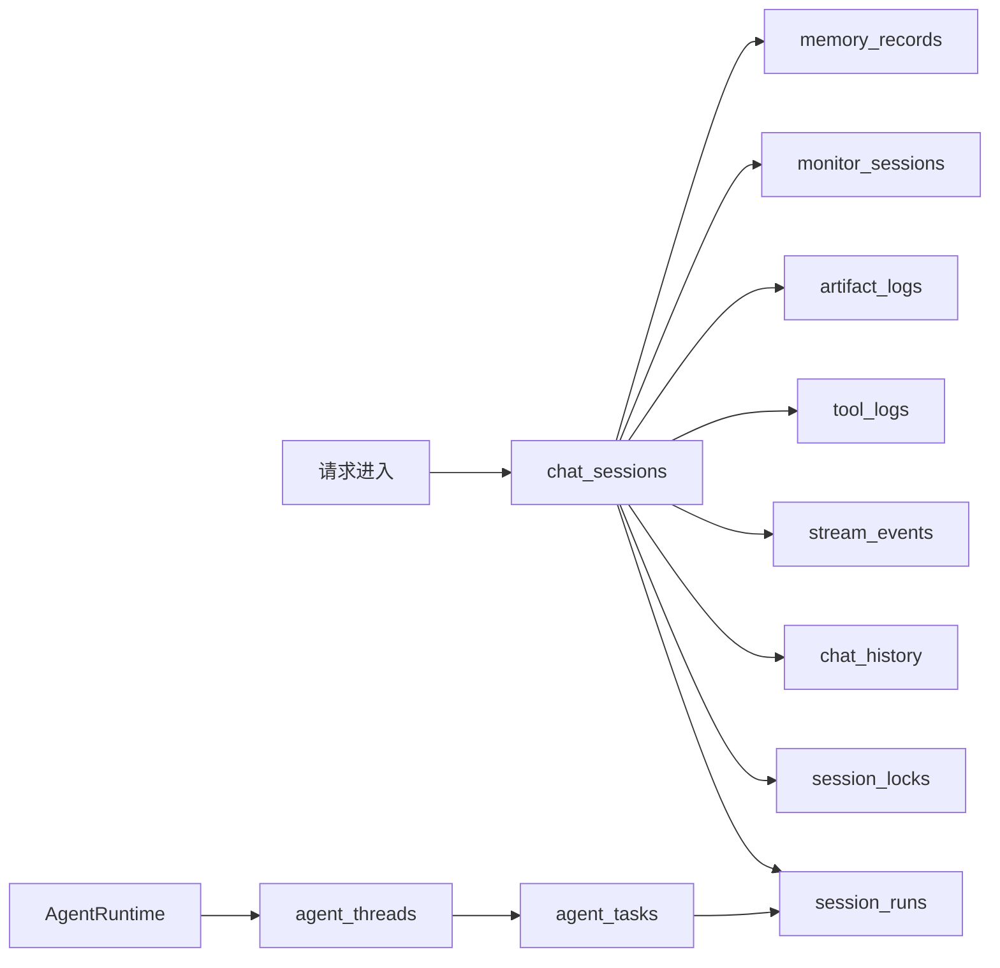
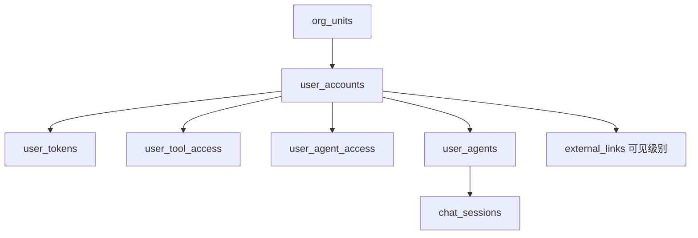
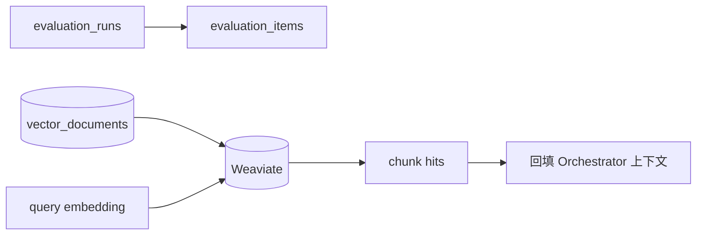
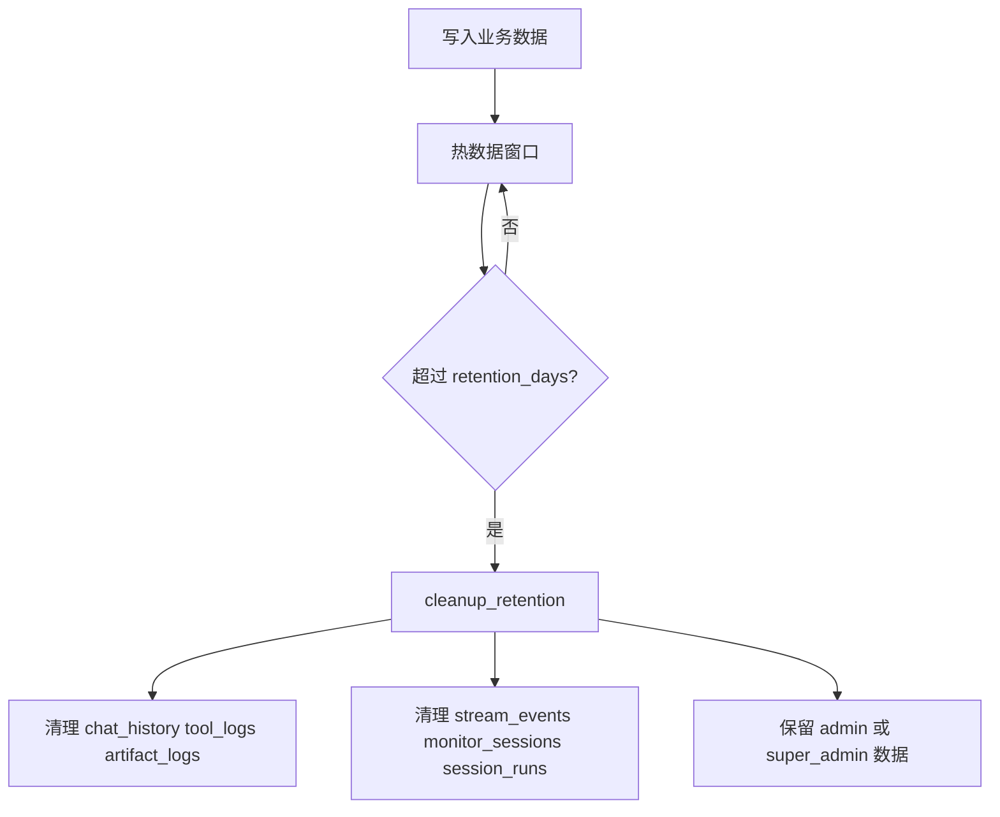

# 数据库设计（代码对齐版）

本文档依据 src/storage/postgres.rs 和 src/storage/sqlite.rs 当前实现整理。重点描述现有表结构、数据约定、索引策略、清理策略和应用层关系约束。

## 1. 范围说明

- 生产推荐后端为 Postgres。
- SQLite 主要用于测试和轻量场景。
- 两个后端使用同构逻辑模型，字段语义保持一致。
- 关系约束以应用层维护为主，不依赖外键。

## 2. 后端与初始化策略

### 2.1 StorageBackend 抽象

统一接口覆盖以下能力：

- 会话和消息持久化
- 工具日志和产物日志
- 监控快照和流式事件
- 用户、组织、权限、智能体
- 渠道接入与网关控制平面
- 定时任务、评估、记忆、向量文档元数据

### 2.2 初始化与补齐

启动时会执行 ensure_initialized。

- 自动建表。
- 自动补缺失列。
- 自动补关键索引。
- Postgres 额外补 BRIN 和性能索引。

这套策略使原型阶段可以快速演进，不依赖重型迁移流程。

## 3. 字段约定

- 时间字段。使用双精度秒时间戳，来源为 now_ts。
- JSON 字段。以文本序列化存储。
- 列表字段。以 JSON 数组文本存储。
- 布尔语义。SQLite 使用整数布尔，Postgres 使用整数语义保持兼容。
- 主键风格。业务 id 多为文本主键，日志类多为自增主键。

## 4. 全量表清单

当前关系库共 37 张核心表。

### 4.1 会话和调度域

- meta
- chat_sessions
- chat_history
- stream_events
- session_locks
- monitor_sessions
- session_runs
- agent_threads
- agent_tasks

### 4.2 工具和记忆域

- tool_logs
- artifact_logs
- memory_settings
- memory_records
- memory_task_logs

### 4.3 定时任务域

- cron_jobs
- cron_runs

### 4.4 渠道与媒体域

- channel_accounts
- channel_bindings
- channel_user_bindings
- channel_sessions
- channel_messages
- channel_outbox
- media_assets
- speech_jobs

### 4.5 网关控制平面域

- gateway_clients
- gateway_nodes
- gateway_node_tokens

### 4.6 用户和权限域

- user_accounts
- org_units
- user_tokens
- user_tool_access
- user_agents
- user_agent_access
- external_links

### 4.7 评估与知识域

- evaluation_runs
- evaluation_items
- vector_documents

## 5. 关系模型说明

### 5.1 关系总览图

系统使用应用层约束而不是外键。

- chat_sessions 是会话主线，关联 chat_history、stream_events、tool_logs、artifact_logs、monitor_sessions、session_locks、session_runs。
- agent_threads 维护 user_id 加 agent_id 主线程映射，agent_tasks 维护排队任务。
- user_accounts 作为注册用户治理源，关联 token、访问控制、智能体配置、组织关系。
- channel 表群维护外部消息接入和回包状态。
- gateway 表群维护控制平面连接和节点令牌。
- vector_documents 保存向量文档元数据和切片结构文本，向量本体在外部向量后端。

## 6. 表结构细节

以下按领域说明用途、关键字段和索引。

### 6.1 会话和调度

#### 会话与调度数据流

meta
- 用途。系统键值元信息。
- 关键字段。key 主键，value，updated_time。

chat_sessions
- 用途。会话元信息。
- 关键字段。session_id、user_id、title、agent_id、tool_overrides、parent_session_id、spawn_label、spawned_by、last_message_at。
- 关键索引。idx_chat_sessions_user，idx_chat_sessions_updated，idx_chat_sessions_parent。

chat_history
- 用途。消息明细。
- 关键字段。id、user_id、session_id、role、content、payload、created_time。
- 关键索引。idx_chat_history_session。
- Postgres 性能索引。idx_chat_history_time，BRIN created_time。

stream_events
- 用途。流式事件回放。
- 主键。session_id 加 event_id。
- 关键字段。user_id、payload、created_time。

session_locks
- 用途。会话互斥与心跳续租。
- 关键字段。session_id、user_id、agent_id、updated_time、expires_at。
- 关键索引。idx_session_locks_user_agent，idx_session_locks_expires。

monitor_sessions
- 用途。会话监控快照。
- 关键字段。session_id、user_id、status、payload、updated_time。
- 关键索引。idx_monitor_sessions_status。
- Postgres 性能索引。idx_monitor_sessions_updated，idx_monitor_sessions_user。

session_runs
- 用途。会话执行记录。
- 关键字段。run_id、session_id、parent_session_id、user_id、agent_id、status、queued_time、started_time、finished_time、elapsed_s。
- 关键索引。idx_session_runs_session，idx_session_runs_user，idx_session_runs_parent。

agent_threads
- 用途。主线程映射。
- 关键字段。thread_id、user_id、agent_id、session_id、status。
- 约束。user_id 加 agent_id 唯一。
- 索引。idx_agent_threads_user。

agent_tasks
- 用途。排队任务。
- 关键字段。task_id、thread_id、user_id、agent_id、session_id、status、retry_count、retry_at、started_at、finished_at。
- 索引。idx_agent_tasks_thread_status，idx_agent_tasks_status，idx_agent_tasks_user。

### 6.2 工具和记忆

tool_logs
- 用途。工具调用日志。
- 关键字段。id、user_id、session_id、tool、ok、error、args、data、payload、created_time。
- 索引。idx_tool_logs_session。
- Postgres 性能索引。idx_tool_logs_tool_time，idx_tool_logs_time。

artifact_logs
- 用途。产物日志。
- 关键字段。id、user_id、session_id、kind、name、payload、created_time。
- 索引。idx_artifact_logs_session。
- Postgres 性能索引。idx_artifact_logs_time。

memory_settings
- 用途。用户记忆开关。
- 关键字段。user_id 主键，enabled，updated_time。

memory_records
- 用途。长期记忆条目。
- 关键字段。id、user_id、session_id、summary、created_time、updated_time。
- 约束。user_id 加 session_id 唯一。
- 索引。idx_memory_records_user_time。

memory_task_logs
- 用途。记忆任务执行日志。
- 关键字段。task_id、user_id、session_id、status、queued_time、started_time、finished_time、elapsed_s、result、error、updated_time。
- 约束。user_id 加 session_id 唯一。
- 索引。idx_memory_task_logs_updated，idx_memory_task_logs_task_id。

### 6.3 定时任务

cron_jobs
- 用途。任务定义和调度状态。
- 关键字段。job_id、user_id、session_id、agent_id、session_target、payload、deliver、enabled、delete_after_run。
- 调度字段。schedule_kind、schedule_at、schedule_every_ms、schedule_cron、schedule_tz、dedupe_key、next_run_at、running_at。
- 索引。idx_cron_jobs_user，idx_cron_jobs_next，idx_cron_jobs_dedupe，idx_cron_jobs_session。

cron_runs
- 用途。任务执行记录。
- 关键字段。run_id、job_id、user_id、session_id、agent_id、trigger、status、summary、error、duration_ms、created_at。
- 索引。idx_cron_runs_job，idx_cron_runs_user。

### 6.4 渠道与媒体

channel_accounts
- 用途。渠道账号配置。
- 主键。channel 加 account_id。
- 关键字段。config、status、created_at、updated_at。
- 索引。idx_channel_accounts_status。

channel_bindings
- 用途。账号与对端路由绑定。
- 关键字段。binding_id、channel、account_id、peer_kind、peer_id、agent_id、tool_overrides、priority、enabled。
- 索引。idx_channel_bindings_match。

channel_user_bindings
- 用途。对端到 user_id 映射。
- 主键。channel 加 account_id 加 peer_kind 加 peer_id。
- 关键字段。user_id、created_at、updated_at。
- 索引。idx_channel_user_bindings_user。

channel_sessions
- 用途。渠道会话映射。
- 主键。channel、account_id、peer_kind、peer_id、thread_id。
- 关键字段。session_id、agent_id、user_id、tts_enabled、tts_voice、metadata、last_message_at。
- 索引。idx_channel_sessions_session，idx_channel_sessions_peer。

channel_messages
- 用途。入站消息存档。
- 关键字段。id、channel、account_id、peer_kind、peer_id、thread_id、session_id、message_id、sender_id、message_type、payload、raw_payload、created_at。
- 索引。idx_channel_messages_session，idx_channel_messages_peer。

channel_outbox
- 用途。出站消息队列。
- 关键字段。outbox_id、channel、account_id、peer_kind、peer_id、thread_id、payload、status、retry_count、retry_at、last_error、delivered_at。
- 索引。idx_channel_outbox_status，idx_channel_outbox_peer。

media_assets
- 用途。媒体资源索引。
- 关键字段。asset_id、kind、url、mime、size、hash、source、created_at。
- 索引。idx_media_assets_hash。

speech_jobs
- 用途。语音任务记录。
- 关键字段。job_id、job_type、status、input_text、input_url、output_text、output_url、model、error、retry_count、next_retry_at、metadata。
- 索引。idx_speech_jobs_status。

### 6.5 网关控制平面

gateway_clients
- 用途。连接状态快照。
- 关键字段。connection_id、role、user_id、node_id、scopes、caps、commands、status、connected_at、last_seen_at、disconnected_at。
- 索引。idx_gateway_clients_status，idx_gateway_clients_node。

gateway_nodes
- 用途。节点注册状态。
- 关键字段。node_id、name、device_fingerprint、status、caps、commands、permissions、metadata、last_seen_at。
- 索引。idx_gateway_nodes_status。

gateway_node_tokens
- 用途。节点令牌。
- 关键字段。token、node_id、status、created_at、updated_at、last_used_at。
- 索引。idx_gateway_node_tokens_node。

### 6.6 用户、组织、权限、智能体

#### 用户与权限关系图

user_accounts
- 用途。注册用户主表。
- 关键字段。user_id、username、email、password_hash、roles、status、access_level、unit_id、daily_quota、daily_quota_used、daily_quota_date、is_demo、last_login_at。
- 索引。idx_user_accounts_unit，idx_user_accounts_created，idx_user_accounts_unit_created。
- 约束。username 唯一。

org_units
- 用途。组织树。
- 关键字段。unit_id、parent_id、name、level、path、path_name、sort_order、leader_ids。
- 索引。idx_org_units_parent，idx_org_units_path。

user_tokens
- 用途。登录 token。
- 关键字段。token、user_id、expires_at、last_used_at。
- 索引。idx_user_tokens_user，idx_user_tokens_expires。

user_tool_access
- 用途。工具访问白名单。
- 关键字段。user_id 主键，allowed_tools，updated_at。

user_agents
- 用途。用户智能体配置。
- 关键字段。agent_id、user_id、name、description、system_prompt、tool_names、access_level、is_shared、status、icon、sandbox_container_id、updated_at。
- 索引。idx_user_agents_user。

user_agent_access
- 用途。智能体访问控制。
- 关键字段。user_id 主键，allowed_agent_ids，blocked_agent_ids，updated_at。

external_links
- 用途。外链应用配置。
- 关键字段。link_id、title、description、url、icon、allowed_levels、sort_order、enabled、updated_at。
- 索引。idx_external_links_order。

### 6.7 评估和知识

#### 评估与知识数据流

evaluation_runs
- 用途。评估任务主表。
- 关键字段。run_id、user_id、model_name、language、status、total_score、started_time、finished_time、payload。
- 索引。idx_evaluation_runs_user，idx_evaluation_runs_status，idx_evaluation_runs_started。

evaluation_items
- 用途。评估项结果。
- 关键字段。id、run_id、case_id、dimension、status、score、max_score、weight、started_time、finished_time、payload。
- 索引。idx_evaluation_items_run。

vector_documents
- 用途。向量文档元数据和切片文本。
- 关键字段。doc_id、owner_id、base_name、doc_name、embedding_model、chunk_size、chunk_overlap、chunk_count、status、content、chunks_json、updated_at。
- 索引。idx_vector_documents_owner_base。

## 7. 清理策略

### 7.1 数据生命周期图

cleanup_retention 会按 retention_days 清理以下表。

- chat_history
- tool_logs
- artifact_logs
- monitor_sessions
- stream_events
- session_runs

清理时会排除角色包含 admin 或 super_admin 的用户数据。

## 8. 一致性策略

- 业务关系由应用层保证一致性。
- 删除会话、用户或评估任务时由服务层执行关联清理。
- 不使用外键以降低原型阶段迁移成本和耦合。

## 9. 运维建议

- 生产环境优先使用 Postgres，并合理配置连接池。
- 定期执行数据备份，特别是会话和监控数据。
- 结合 retention 和索引策略控制历史数据规模。
- 表结构扩展优先保持向后兼容字段补齐策略，避免中断服务启动。
