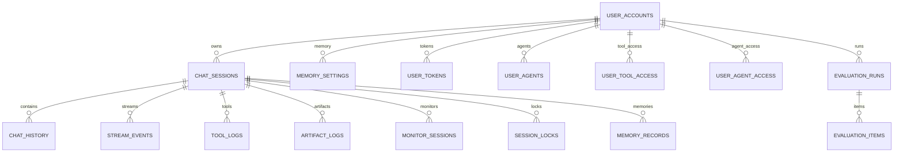
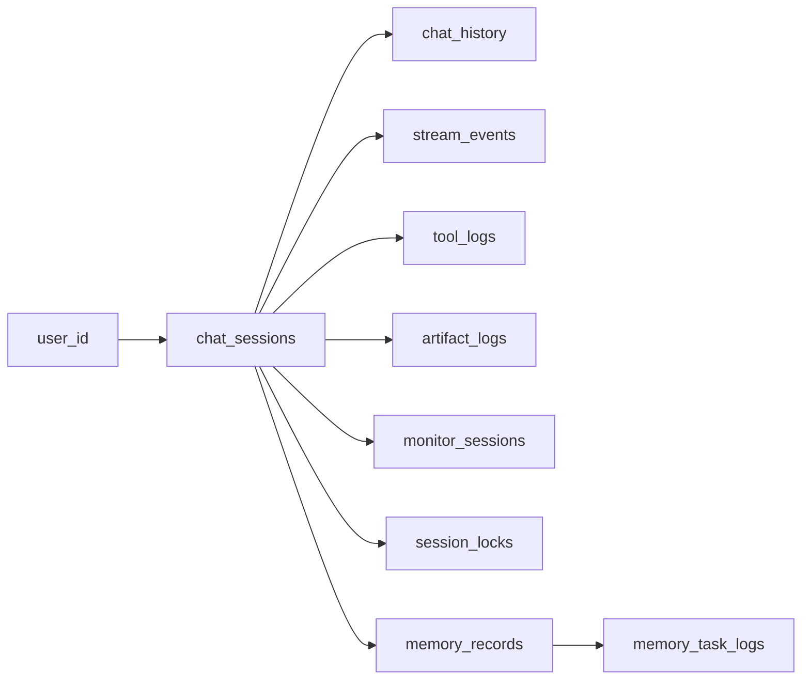
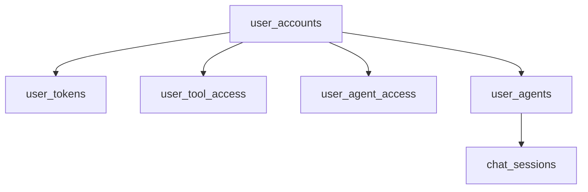
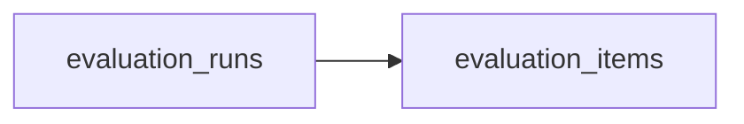
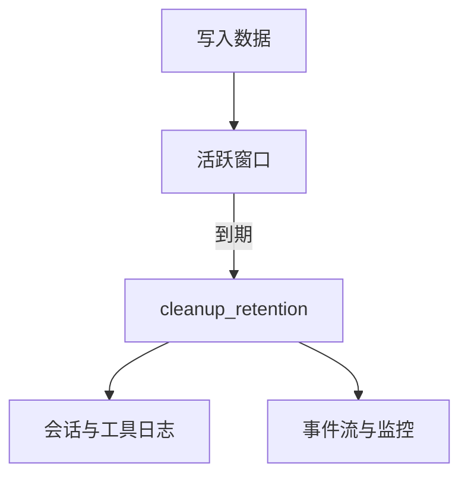
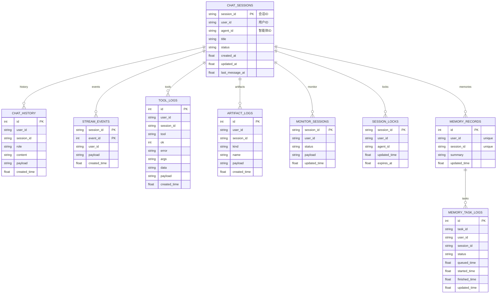
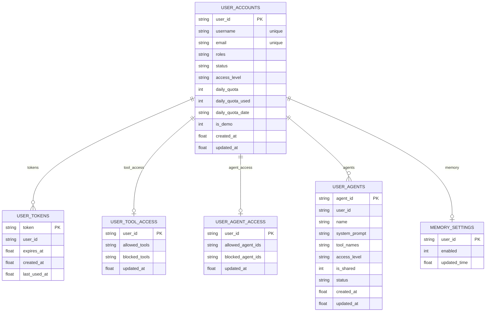
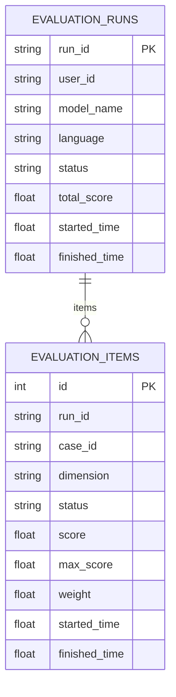

# 数据库设计

本文档基于 `src/storage/postgres.rs` 与 `src/storage/sqlite.rs` 的实现整理，描述 Wunder 的数据库表结构、字段含义与索引设计。生产环境默认使用 PostgreSQL，SQLite 仅用于测试。

## 1. 概述

- 主存储：PostgreSQL（`storage.backend=postgres`）。
- 测试存储：SQLite（结构与 PostgreSQL 保持一致，类型为 SQLite 亲和类型）。
- 数据分层：对话与会话、工具与产物、监控与事件流、记忆与评估、用户与权限。
- 强一致关系不通过外键约束实现，由应用层保证一致性与清理策略。

## 2. 数据类型与约定

| 约定 | 说明 |
| --- | --- |
| 时间字段 | 使用 `DOUBLE PRECISION` 保存 Unix 秒（`now_ts()`）。
| JSON 字段 | 使用 `TEXT` 保存 JSON 字符串（如 `payload`、`args`、`data`、`meta`）。
| 布尔字段 | 使用 `INTEGER` 保存 0/1（如 `is_shared`、`is_demo`、`enabled`）。
| 列表字段 | 使用 `TEXT` 保存 JSON 数组（如 `roles`、`tool_names`、`allowed_tools`）。
| 逻辑关系 | 仅约定 `user_id/session_id/run_id` 等字段，不显式声明外键。 |

## 3. 表结构总览

下图展示核心表的逻辑关系（仅业务约定关系，未强制外键约束）：

| 模块 | 表名 | 说明 |
| --- | --- | --- |
| 元数据 | `meta` | 全局 KV 配置与运行时元信息。 |
| 会话与对话 | `chat_sessions` / `chat_history` | 会话元信息与消息记录。 |
| 事件流 | `stream_events` | SSE 回放事件。 |
| 并发锁 | `session_locks` | 会话互斥锁与过期控制。 |
| 工具日志 | `tool_logs` | 工具调用与结果记录。 |
| 产物日志 | `artifact_logs` | 文件与产物引用记录。 |
| 监控 | `monitor_sessions` | 监控快照与状态。 |
| 记忆 | `memory_settings` / `memory_records` / `memory_task_logs` | 长期记忆与异步任务记录。 |
| 评估 | `evaluation_runs` / `evaluation_items` | 评估运行与用例结果。 |
| 用户 | `user_accounts` / `user_tokens` | 账号、Token 与额度。 |
| 权限 | `user_tool_access` / `user_agent_access` | 工具与智能体访问控制。 |
| 智能体 | `user_agents` | 用户自建智能体配置。 |

### 3.1 会话与对话数据流

### 3.2 用户、权限与智能体

### 3.3 评估数据流

### 3.4 数据生命周期与清理

### 3.5 字段级 ER（会话与日志）

仅展示关键字段（主键、关系字段与主要时间字段），明细字段详见表结构章节。

### 3.6 字段级 ER（用户、权限与智能体）

### 3.7 字段级 ER（评估）

## 4. 表结构详情

### 4.1 `meta`

用途：系统级 KV 元数据（配置缓存、版本标记等）。

| 字段 | 类型 | 必填 | 说明 |
| --- | --- | --- | --- |
| key | TEXT | 是 | 主键。 |
| value | TEXT | 是 | 值内容。 |
| updated_time | DOUBLE PRECISION | 是 | 更新时间（Unix 秒）。 |

索引：主键 `key`。

### 4.2 `chat_sessions`

用途：会话元信息（列表、标题、智能体关联等）。

| 字段 | 类型 | 必填 | 说明 |
| --- | --- | --- | --- |
| session_id | TEXT | 是 | 主键，会话 ID。 |
| user_id | TEXT | 是 | 会话所属用户。 |
| title | TEXT | 否 | 会话标题。 |
| status | TEXT | 否 | 会话状态（业务自定义）。 |
| agent_id | TEXT | 否 | 绑定的智能体 ID。 |
| tool_overrides | TEXT | 否 | 会话级工具覆盖清单（JSON 数组）。 |
| created_at | DOUBLE PRECISION | 是 | 创建时间。 |
| updated_at | DOUBLE PRECISION | 是 | 更新时间。 |
| last_message_at | DOUBLE PRECISION | 是 | 最近消息时间。 |

索引：
- `idx_chat_sessions_user` (`user_id`)
- `idx_chat_sessions_updated` (`user_id`, `updated_at`)

### 4.3 `chat_history`

用途：对话消息明细记录。

| 字段 | 类型 | 必填 | 说明 |
| --- | --- | --- | --- |
| id | BIGSERIAL | 是 | 自增主键。 |
| user_id | TEXT | 是 | 用户 ID。 |
| session_id | TEXT | 是 | 会话 ID。 |
| role | TEXT | 是 | 角色（user/assistant/tool）。 |
| content | TEXT | 否 | 消息文本摘要。 |
| timestamp | TEXT | 否 | 消息时间（原始格式）。 |
| meta | TEXT | 否 | 消息元信息 JSON。 |
| payload | TEXT | 是 | 完整消息 JSON。 |
| created_time | DOUBLE PRECISION | 是 | 写入时间。 |

索引：
- `idx_chat_history_session` (`user_id`, `session_id`, `id`)
- `idx_chat_history_time`（BRIN，`created_time`）

### 4.4 `stream_events`

用途：SSE 事件流回放与续传。

| 字段 | 类型 | 必填 | 说明 |
| --- | --- | --- | --- |
| session_id | TEXT | 是 | 会话 ID。 |
| event_id | BIGINT | 是 | 事件序号。 |
| user_id | TEXT | 是 | 用户 ID。 |
| payload | TEXT | 是 | 事件 JSON。 |
| created_time | DOUBLE PRECISION | 是 | 写入时间。 |

主键：`(session_id, event_id)`。

索引：
- `idx_stream_events_user` (`user_id`)
- `idx_stream_events_time` (`created_time`)

### 4.5 `session_locks`

用途：会话互斥锁，防止同一用户并发冲突。

| 字段 | 类型 | 必填 | 说明 |
| --- | --- | --- | --- |
| session_id | TEXT | 是 | 主键，会话 ID。 |
| user_id | TEXT | 是 | 用户 ID。 |
| agent_id | TEXT | 是 | 智能体 ID（空字符串代表通用会话）。 |
| created_time | DOUBLE PRECISION | 是 | 创建时间。 |
| updated_time | DOUBLE PRECISION | 是 | 最近心跳时间。 |
| expires_at | DOUBLE PRECISION | 是 | 过期时间。 |

索引：
- `idx_session_locks_user_agent`（唯一，`user_id`, `agent_id`）
- `idx_session_locks_expires` (`expires_at`)

### 4.6 `tool_logs`

用途：工具调用日志（包含输入参数与输出摘要）。

| 字段 | 类型 | 必填 | 说明 |
| --- | --- | --- | --- |
| id | BIGSERIAL | 是 | 自增主键。 |
| user_id | TEXT | 是 | 用户 ID。 |
| session_id | TEXT | 是 | 会话 ID。 |
| tool | TEXT | 否 | 工具名。 |
| ok | INTEGER | 否 | 成功标记（0/1）。 |
| error | TEXT | 否 | 错误信息。 |
| args | TEXT | 否 | 输入参数 JSON。 |
| data | TEXT | 否 | 工具结果 JSON。 |
| timestamp | TEXT | 否 | 时间戳文本。 |
| payload | TEXT | 是 | 完整日志 JSON（可被 `__omit_payload` 置空）。 |
| created_time | DOUBLE PRECISION | 是 | 写入时间。 |

索引：
- `idx_tool_logs_session` (`user_id`, `session_id`, `id`)
- `idx_tool_logs_tool_time` (`tool`, `created_time` DESC)
- `idx_tool_logs_time`（BRIN，`created_time`）

### 4.7 `artifact_logs`

用途：产物/资源日志（如文件、A2UI 产物、可下载结果）。

| 字段 | 类型 | 必填 | 说明 |
| --- | --- | --- | --- |
| id | BIGSERIAL | 是 | 自增主键。 |
| user_id | TEXT | 是 | 用户 ID。 |
| session_id | TEXT | 是 | 会话 ID。 |
| kind | TEXT | 是 | 产物类型。 |
| name | TEXT | 否 | 产物名称。 |
| payload | TEXT | 是 | 产物 JSON。 |
| created_time | DOUBLE PRECISION | 是 | 写入时间。 |

索引：
- `idx_artifact_logs_session` (`user_id`, `session_id`, `id`)
- `idx_artifact_logs_time`（BRIN，`created_time`）

### 4.8 `monitor_sessions`

用途：监控快照与会话状态摘要。

| 字段 | 类型 | 必填 | 说明 |
| --- | --- | --- | --- |
| session_id | TEXT | 是 | 主键，会话 ID。 |
| user_id | TEXT | 否 | 用户 ID。 |
| status | TEXT | 否 | 状态字段（running/finished/failed 等）。 |
| updated_time | DOUBLE PRECISION | 是 | 更新时间，默认 0。 |
| payload | TEXT | 是 | 监控 JSON（统计、阶段、用量）。 |

索引：
- `idx_monitor_sessions_status` (`status`)
- `idx_monitor_sessions_updated` (`updated_time`)
- `idx_monitor_sessions_user` (`user_id`)

### 4.9 `memory_settings`

用途：用户级长期记忆开关。

| 字段 | 类型 | 必填 | 说明 |
| --- | --- | --- | --- |
| user_id | TEXT | 是 | 主键，用户 ID。 |
| enabled | INTEGER | 是 | 是否启用长期记忆。 |
| updated_time | DOUBLE PRECISION | 是 | 更新时间。 |

### 4.10 `memory_records`

用途：会话级摘要（长期记忆）。

| 字段 | 类型 | 必填 | 说明 |
| --- | --- | --- | --- |
| id | BIGSERIAL | 是 | 自增主键。 |
| user_id | TEXT | 是 | 用户 ID。 |
| session_id | TEXT | 是 | 会话 ID。 |
| summary | TEXT | 是 | 摘要内容。 |
| created_time | DOUBLE PRECISION | 是 | 创建时间。 |
| updated_time | DOUBLE PRECISION | 是 | 更新时间。 |

约束：`UNIQUE(user_id, session_id)`。

索引：`idx_memory_records_user_time` (`user_id`, `updated_time`)。

### 4.11 `memory_task_logs`

用途：长期记忆异步任务日志。

| 字段 | 类型 | 必填 | 说明 |
| --- | --- | --- | --- |
| id | BIGSERIAL | 是 | 自增主键。 |
| task_id | TEXT | 是 | 任务 ID。 |
| user_id | TEXT | 是 | 用户 ID。 |
| session_id | TEXT | 是 | 会话 ID。 |
| status | TEXT | 否 | 任务状态。 |
| queued_time | DOUBLE PRECISION | 否 | 入队时间。 |
| started_time | DOUBLE PRECISION | 否 | 开始时间。 |
| finished_time | DOUBLE PRECISION | 否 | 结束时间。 |
| elapsed_s | DOUBLE PRECISION | 否 | 耗时秒数。 |
| request_payload | TEXT | 否 | 请求 JSON。 |
| result | TEXT | 否 | 结果文本。 |
| error | TEXT | 否 | 错误信息。 |
| updated_time | DOUBLE PRECISION | 是 | 更新时间。 |

约束：`UNIQUE(user_id, session_id)`。

索引：
- `idx_memory_task_logs_updated` (`updated_time`)
- `idx_memory_task_logs_task_id` (`task_id`)

### 4.12 `evaluation_runs`

用途：评估任务主表。

| 字段 | 类型 | 必填 | 说明 |
| --- | --- | --- | --- |
| run_id | TEXT | 是 | 主键，评估任务 ID。 |
| user_id | TEXT | 否 | 发起用户。 |
| model_name | TEXT | 否 | 模型名称。 |
| language | TEXT | 否 | 语言。 |
| status | TEXT | 否 | 状态。 |
| total_score | DOUBLE PRECISION | 否 | 总分。 |
| started_time | DOUBLE PRECISION | 否 | 开始时间。 |
| finished_time | DOUBLE PRECISION | 否 | 完成时间。 |
| payload | TEXT | 是 | 评估配置 JSON。 |

索引：
- `idx_evaluation_runs_user` (`user_id`)
- `idx_evaluation_runs_status` (`status`)
- `idx_evaluation_runs_started` (`started_time`)

### 4.13 `evaluation_items`

用途：评估用例结果。

| 字段 | 类型 | 必填 | 说明 |
| --- | --- | --- | --- |
| id | BIGSERIAL | 是 | 自增主键。 |
| run_id | TEXT | 是 | 所属评估任务。 |
| case_id | TEXT | 是 | 用例 ID。 |
| dimension | TEXT | 否 | 维度。 |
| status | TEXT | 否 | 状态。 |
| score | DOUBLE PRECISION | 否 | 得分。 |
| max_score | DOUBLE PRECISION | 否 | 满分。 |
| weight | DOUBLE PRECISION | 否 | 权重。 |
| started_time | DOUBLE PRECISION | 否 | 开始时间。 |
| finished_time | DOUBLE PRECISION | 否 | 结束时间。 |
| payload | TEXT | 是 | 用例结果 JSON。 |

索引：`idx_evaluation_items_run` (`run_id`, `id`)。

### 4.14 `user_accounts`

用途：注册用户与额度管理。

| 字段 | 类型 | 必填 | 说明 |
| --- | --- | --- | --- |
| user_id | TEXT | 是 | 主键，用户 ID。 |
| username | TEXT | 是 | 用户名（唯一）。 |
| email | TEXT | 否 | 邮箱。 |
| password_hash | TEXT | 是 | 密码哈希。 |
| roles | TEXT | 是 | 角色列表 JSON。 |
| status | TEXT | 是 | 状态。 |
| access_level | TEXT | 是 | 额度等级（A/B/C）。 |
| daily_quota | BIGINT | 是 | 每日额度。 |
| daily_quota_used | BIGINT | 是 | 当日已用额度。 |
| daily_quota_date | TEXT | 否 | 当日日期。 |
| is_demo | INTEGER | 是 | 是否演示账号。 |
| created_at | DOUBLE PRECISION | 是 | 创建时间。 |
| updated_at | DOUBLE PRECISION | 是 | 更新时间。 |
| last_login_at | DOUBLE PRECISION | 否 | 最近登录时间。 |

索引：
- `idx_user_accounts_email`（唯一，`email`）
- `username` 通过 UNIQUE 约束保证唯一性

### 4.15 `user_tokens`

用途：登录 Token。

| 字段 | 类型 | 必填 | 说明 |
| --- | --- | --- | --- |
| token | TEXT | 是 | 主键，Token 值。 |
| user_id | TEXT | 是 | 用户 ID。 |
| expires_at | DOUBLE PRECISION | 是 | 过期时间。 |
| created_at | DOUBLE PRECISION | 是 | 创建时间。 |
| last_used_at | DOUBLE PRECISION | 是 | 最近使用时间。 |

索引：
- `idx_user_tokens_user` (`user_id`)
- `idx_user_tokens_expires` (`expires_at`)

### 4.16 `user_tool_access`

用途：工具访问控制。

| 字段 | 类型 | 必填 | 说明 |
| --- | --- | --- | --- |
| user_id | TEXT | 是 | 主键，用户 ID。 |
| allowed_tools | TEXT | 否 | 允许工具列表 JSON。 |
| blocked_tools | TEXT | 否 | 禁用工具列表 JSON。 |
| updated_at | DOUBLE PRECISION | 是 | 更新时间。 |

### 4.17 `user_agents`

用途：用户自建智能体配置。

| 字段 | 类型 | 必填 | 说明 |
| --- | --- | --- | --- |
| agent_id | TEXT | 是 | 主键，智能体 ID。 |
| user_id | TEXT | 是 | 所属用户。 |
| name | TEXT | 是 | 名称。 |
| description | TEXT | 否 | 描述。 |
| system_prompt | TEXT | 否 | 系统提示词。 |
| tool_names | TEXT | 否 | 工具清单 JSON。 |
| access_level | TEXT | 是 | 访问等级。 |
| is_shared | INTEGER | 是 | 是否共享。 |
| status | TEXT | 是 | 状态。 |
| icon | TEXT | 否 | 图标资源。 |
| created_at | DOUBLE PRECISION | 是 | 创建时间。 |
| updated_at | DOUBLE PRECISION | 是 | 更新时间。 |

索引：`idx_user_agents_user` (`user_id`, `updated_at`)。

### 4.18 `user_agent_access`

用途：智能体访问控制。

| 字段 | 类型 | 必填 | 说明 |
| --- | --- | --- | --- |
| user_id | TEXT | 是 | 主键，用户 ID。 |
| allowed_agent_ids | TEXT | 否 | 允许智能体列表 JSON。 |
| blocked_agent_ids | TEXT | 否 | 禁用智能体列表 JSON。 |
| updated_at | DOUBLE PRECISION | 是 | 更新时间。 |

## 5. 索引与性能优化

- 时间序列日志采用 BRIN 索引（`chat_history`、`tool_logs`、`artifact_logs`），提升大表范围查询性能。
- 工具统计使用 `tool_logs(tool, created_time)` 复合索引，便于按工具聚合与趋势分析。
- 监控表使用 `status/updated_time/user_id` 索引，支撑监控页快速筛选。
- 会话锁使用 `user_id + agent_id` 唯一索引，确保同一用户同一智能体互斥。

## 6. 数据生命周期与清理

- `cleanup_retention(retention_days)` 会按时间阈值清理以下表：`chat_history`、`tool_logs`、`artifact_logs`、`monitor_sessions`、`stream_events`。
- 清理阈值以 `created_time/updated_time` 为依据，确保事件流与日志在可回放窗口内保留。

## 7. 逻辑关系说明（无外键）

- `user_accounts` 是注册用户来源，但 `user_id` 在业务上允许虚拟用户，因此多张业务表不会强制外键约束。
- `chat_sessions` 通过 `session_id` 关联 `chat_history`、`tool_logs`、`artifact_logs`、`stream_events`、`monitor_sessions`、`session_locks`、`memory_records`。
- `evaluation_runs` 与 `evaluation_items` 通过 `run_id` 关联。
- `user_agents` 与 `chat_sessions/session_locks` 通过 `agent_id` 关联。

## 8. 配置与运维提示

- PostgreSQL 连接由 `storage.postgres.dsn` 与 `storage.postgres.pool_size` 控制。
- 启动时会自动建表与补齐缺失字段，避免手工迁移阻塞原型迭代。
- 生产环境建议开启定期清理与备份策略，确保事件日志与历史数据可控。
