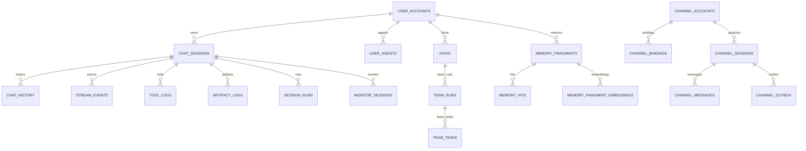

# 数据库设计（代码对齐版，2026-03）

本文档按当前代码实现对齐，依据：

- `src/storage/postgres.rs`
- `src/storage/sqlite.rs`
- `src/storage/mod.rs`

## 1. 范围说明

- 生产环境推荐 PostgreSQL。
- 本地/桌面/轻量场景使用 SQLite。
- 两套后端共享同一逻辑模型与接口（`StorageBackend`）。
- 本文关注当前“已落地”模型，不描述历史已移除表。

## 2. 后端选择与初始化策略

### 2.1 后端选择（`build_storage`）

- `storage.backend` 为空时默认走 `sqlite`。
- `sqlite` / `default` -> `SqliteStorage`。
- `postgres` / `postgresql` / `pg` / `auto` -> `PostgresStorage`。

### 2.2 启动初始化（`ensure_initialized`）

启动阶段会自动执行：

- `CREATE TABLE IF NOT EXISTS`（全量核心表）
- 缺失列补齐（`ensure_*_columns`）
- 缺失索引补齐（含 PostgreSQL 额外性能索引）

这保证原型阶段可平滑升级，不依赖重型迁移框架。

## 3. 字段与约束约定

- 时间字段统一为秒级浮点时间戳（`DOUBLE PRECISION`/`REAL`，来源 `now_ts`）。
- JSON、列表、多值字段统一序列化为文本列存储。
- 布尔语义跨库统一：SQLite 用 `INTEGER(0/1)`，PostgreSQL 以 `INTEGER` 或 `BOOLEAN`（如 `memory_fragments.pinned`）实现。
- 业务主键大多为文本 ID；日志明细常用自增主键。
- 关系约束以应用层为主；数据库层目前仅保留 `team_tasks.team_run_id -> team_runs(team_run_id)` 级联删除外键。

## 4. 全量表清单（51 张）

### 4.1 元数据与会话运行（11）

- `meta`
- `chat_sessions`
- `chat_history`
- `tool_logs`
- `artifact_logs`
- `stream_events`
- `monitor_sessions`
- `session_locks`
- `session_runs`
- `agent_threads`
- `agent_tasks`

### 4.2 记忆域（7）

- `memory_settings`
- `memory_records`
- `memory_task_logs`
- `memory_fragments`
- `memory_fragment_embeddings`
- `memory_hits`
- `memory_jobs`

### 4.3 用户世界与蜂房群聊（6）

- `user_world_conversations`
- `user_world_groups`
- `user_world_members`
- `user_world_messages`
- `user_world_events`
- `beeroom_chat_messages`

### 4.4 定时任务域（2）

- `cron_jobs`
- `cron_runs`

### 4.5 渠道与媒体域（8）

- `channel_accounts`
- `channel_bindings`
- `channel_user_bindings`
- `channel_sessions`
- `channel_messages`
- `channel_outbox`
- `media_assets`
- `speech_jobs`

### 4.6 网关控制平面域（3）

- `gateway_clients`
- `gateway_nodes`
- `gateway_node_tokens`

### 4.7 用户治理与智能体域（8）

- `user_accounts`
- `org_units`
- `user_tokens`
- `user_tool_access`
- `user_agents`
- `user_agent_access`
- `external_links`
- `hives`

### 4.8 蜂群执行域（2）

- `team_runs`
- `team_tasks`

### 4.9 评估与知识域（4）

- `benchmark_runs`
- `benchmark_attempts`
- `benchmark_task_aggregates`
- `vector_documents`

## 5. 关键关系与一致性

### 5.1 关系总览（逻辑层）

```mermaid
erDiagram
  USER_ACCOUNTS ||--o{ CHAT_SESSIONS : owns
  CHAT_SESSIONS ||--o{ CHAT_HISTORY : history
  CHAT_SESSIONS ||--o{ STREAM_EVENTS : events
  CHAT_SESSIONS ||--o{ TOOL_LOGS : tools
  CHAT_SESSIONS ||--o{ ARTIFACT_LOGS : artifacts
  CHAT_SESSIONS ||--o{ SESSION_RUNS : runs
  CHAT_SESSIONS ||--o{ MONITOR_SESSIONS : monitor

  USER_ACCOUNTS ||--o{ USER_AGENTS : agents
  USER_ACCOUNTS ||--o{ HIVES : hives
  HIVES ||--o{ TEAM_RUNS : team_runs
  TEAM_RUNS ||--o{ TEAM_TASKS : team_tasks

  USER_ACCOUNTS ||--o{ MEMORY_FRAGMENTS : memory
  MEMORY_FRAGMENTS ||--o{ MEMORY_HITS : hits
  MEMORY_FRAGMENTS ||--o{ MEMORY_FRAGMENT_EMBEDDINGS : embeddings

  CHANNEL_ACCOUNTS ||--o{ CHANNEL_BINDINGS : bindings
  CHANNEL_ACCOUNTS ||--o{ CHANNEL_SESSIONS : sessions
  CHANNEL_SESSIONS ||--o{ CHANNEL_MESSAGES : messages
  CHANNEL_SESSIONS ||--o{ CHANNEL_OUTBOX : outbox
```

### 5.2 一致性边界

- 会话主线由 `chat_sessions` 驱动，日志与事件表通过 `user_id + session_id` 聚合。
- 线程排队模型由 `agent_threads + agent_tasks` 承载。
- 蜂群运行模型由 `hives + team_runs + team_tasks` 承载。
- 用户世界消息域（`user_world_*`）与 `chat_*` 域隔离。
- 绝大部分级联清理由服务层显式执行；`team_tasks` 的级联删除由数据库外键补强。

## 6. 关键表字段（当前重点）

### 6.1 `user_agents`

当前智能体配置字段已包含：

- `hive_id`
- `declared_tool_names`
- `declared_skill_names`
- `approval_mode`
- `preset_questions`
- `preset_binding`
- `sandbox_container_id`

索引：

- `idx_user_agents_user`
- `idx_user_agents_user_hive`

### 6.2 `memory_fragments` 相关四表

`memory_fragments` 提供结构化长期记忆主表：

- 三层内容：`title_l0` / `summary_l1` / `content_l2`
- 语义字段：`fact_key` / `tags` / `entities`
- 生命周期字段：`tier` / `status` / `pinned` / `confirmed_by_user`
- 统计字段：`access_count` / `hit_count` / `last_accessed_at`

配套表：

- `memory_fragment_embeddings`：每个记忆片段的 embedding 缓存
- `memory_hits`：命中解释与评分轨迹
- `memory_jobs`：记忆任务执行记录

### 6.3 `user_world_*` 与 `beeroom_chat_messages`

- `user_world_conversations`：会话主表（`direct/group`）
- `user_world_groups`：群元数据（含公告）
- `user_world_members`：成员读状态、未读缓存、置顶静音
- `user_world_messages`：消息明细（`client_msg_id` 幂等）
- `user_world_events`：事件流（WS/SSE 续传）
- `beeroom_chat_messages`：蜂房协作聊天持久化

### 6.4 `team_runs` / `team_tasks`

`team_runs` 聚合蜂群执行统计：

- `task_total/task_success/task_failed`
- `context_tokens_total/context_tokens_peak`
- `model_round_total`

`team_tasks` 记录任务粒度执行状态：

- `target_session_id` / `spawned_session_id` / `session_run_id`
- `retry_count` / `priority` / `result_summary` / `error`

### 6.5 `vector_documents`

向量文档元数据与切片文本统一存储在关系库：

- `owner_id` / `base_name` / `doc_name`
- `embedding_model` / `chunk_size` / `chunk_overlap` / `chunk_count`
- `content` / `chunks_json`

索引：

- `idx_vector_documents_owner_base`

## 7. 索引与性能策略

基础索引由建表 SQL 保证；PostgreSQL 额外补齐以下性能索引：

- `idx_tool_logs_tool_time`（工具名 + 时间）
- `idx_tool_logs_time`（BRIN 时间索引）
- `idx_chat_history_time`（BRIN 时间索引）
- `idx_artifact_logs_time`（BRIN 时间索引）
- `idx_monitor_sessions_updated`
- `idx_monitor_sessions_user`

并会清理遗留索引 `idx_user_accounts_username`，避免冗余。

## 8. 清理策略（Retention）

`retention_days > 0` 时清理以下热日志表：

- `chat_history`
- `tool_logs`
- `artifact_logs`
- `monitor_sessions`
- `stream_events`
- `session_runs`

并排除角色含 `admin` / `super_admin` 的用户数据。

## 9. 变更落地约束（文档同步）

后续如新增/修改存储模型，至少同步更新三处：

1. `src/storage/sqlite.rs` 与 `src/storage/postgres.rs` 的建表/补列逻辑
2. 本文档（表清单、关键字段、索引/清理策略）
3. `docs/配置与状态存储梳理.md` 中数据库“配置/状态边界”章节
