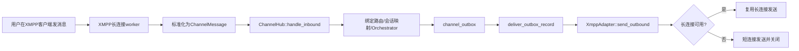

# XMPP渠道接入开发指南

## 1. 目标与适用范围

本文面向 wunder 后端/前端开发者，目标是让你在阅读后可以完成以下工作：

- 理解 wunder 内置 XMPP 渠道的运行原理与数据流。
- 快速完成账号接入与联调。
- 在现有实现上做二次开发（新增消息类型、改发送策略、加监控等）。
- 出现故障时能快速定位问题。

本文覆盖当前内置实现（`tokio-xmpp 4.0.0`，标准客户端模式，长连接优先）。

## 2. 总体架构与原理

### 2.1 设计原则

- 统一主链路：XMPP 入站最终都走 `ChannelHub::handle_inbound`，不绕过渠道主流程。
- 统一出站入口：回复仍走 `channel_outbox` -> `deliver_outbox_record`。
- 长连接优先：有可用长连接时复用同一会话发包；不可用时自动降级短连接直发。
- 渠道抽象一致：XMPP 与其他渠道同样通过 `ChannelAdapter` 注册到 `ChannelAdapterRegistry`。

### 2.2 关键数据流



### 2.3 长连接调度原理

- `ChannelHub` 启动时拉起 XMPP supervisor。
- supervisor 定期扫描 `channel_accounts` 中 `channel=xmpp` 且 `status=active` 的账号。
- 对每个满足条件的账号创建 worker：
  - 条件1：`xmpp.long_connection_enabled=true`（默认 true）
  - 条件2：`xmpp.jid` 与 `xmpp.password` 非空
- worker 进入连接循环：断开后按指数退避重连。

## 3. 代码地图（改造入口）

| 模块 | 作用 | 主要关注点 |
|---|---|---|
| `src/channels/xmpp.rs` | XMPP适配器与长连接核心实现 | 入站解析、出站发送、MUC处理、运行时dispatcher |
| `src/channels/service.rs` | 长连接supervisor/worker调度 | 账号扫描、worker生命周期、入站投递 |
| `src/channels/types.rs` | `XmppConfig` 配置模型 | 字段定义、反序列化兼容规则 |
| `src/channels/registry.rs` | 适配器注册表 | `XmppAdapter` 注册 |
| `src/channels/catalog.rs` | 渠道目录 | 前端可见渠道列表与文档提示 |
| `src/api/user_channels.rs` | 用户侧渠道配置接口 | XMPP配置透传、meta配置预览、默认peer_kind |
| `src/api/admin.rs` | 管理侧渠道运行态 | `runtime.xmpp_long_connection` |
| `frontend/src/components/channels/UserChannelSettingsPanel.vue` | 用户侧配置UI | XMPP字段表单、端口/房间字段格式化 |

## 4. 配置模型与字段语义

`ChannelAccount.config.xmpp`：

- `jid`: 登录 JID，必填。
- `password`: 登录密码，必填。
- `domain`: 可选。用于手动服务器域名/替代 SRV 域。
- `host`: 可选。手动指定服务器地址。
- `port`: 可选。支持 number 或字符串；有效范围 1~65535。
- `direct_tls`: 可选。只影响默认端口选择（5223），未改动底层 StartTLS 连接器行为。
- `resource`: 可选。登录资源，写入后会覆盖 JID 原资源。
- `muc_nick`: 可选。群昵称，用于 MUC 自消息过滤。
- `muc_rooms`: 可选。自动入房列表，支持数组或逗号分隔字符串。
- `long_connection_enabled`: 可选，默认 `true`。
- `send_initial_presence`: 可选，默认 `true`。
- `status_text`: 可选。初始 presence 的状态文本。

### 4.1 连接地址解析优先级

1. 若配置 `host`（或 `domain`）=> 走 `Manual { host, port }`。
2. 若未配 host/domain，但配了 `port` => 使用 `jid.domain + port` 手动连接。
3. 否则 => `UseSrv`。

## 5. 入站处理细节

### 5.1 当前支持范围

- 解析 `<message/>` 文本体。
- 支持 `chat/groupchat/normal`（`error/headline` 忽略）。
- 输出统一 `ChannelMessage`：
  - 私聊：`peer.kind=user`，`peer.id=from bare jid`
  - 群聊：`peer.kind=group`，`peer.id=room bare jid`，`sender.id=资源部分（nick）`

### 5.2 自消息过滤规则

- 私聊：比较 `from bare jid` 与登录 bare jid / 绑定后 bare jid。
- 群聊：优先按 `muc_nick` 过滤；其次按 bound resource / login resource / login node 过滤。

## 6. 出站处理细节

### 6.1 发送策略

- 优先尝试通过运行中 worker 的 dispatcher 发包（低延迟、少握手）。
- dispatcher 不可用或超时时，降级为短连接：连接 -> 等待 Online -> 发送 -> `send_end`。

### 6.2 目标JID规则

- 优先读取 `outbound.meta.xmpp_to`。
- 否则使用 `outbound.peer.id`。
- 若目标仅是短用户名（不含 `@`、`/`、`.`），自动补全为 `<name>@<login_domain>`。

## 7. MUC（群聊）策略

- worker Online 后，若配置 `muc_rooms`，会发送 MUC join presence。
- join 目标格式：`<room_jid>/<nick>`。
- `nick` 解析顺序：`muc_nick` -> bound resource -> login resource -> login node -> `wunder`。

## 8. 心跳兼容机制（新增）

### 8.1 被动心跳（对端发 ping）

- 识别对端 `IQ type='get' + <ping xmlns='urn:xmpp:ping'/>`。
- 当 `respond_ping=true` 时自动回 `IQ result`（带原 id）。
- 默认开启，建议保持开启以兼容要求服务端心跳应答的通信软件。

### 8.2 主动心跳（客户端发 ping）

- 当 `heartbeat_enabled=true` 时，worker 会按 `heartbeat_interval_s` 周期发送 IQ ping。
- 若在 `heartbeat_timeout_s` 内未收到对应 `IQ result/error`，判定连接异常并触发重连。
- 若收到 `IQ error`（对端不支持 XEP-0199），会自动关闭“主动 ping”并继续保持连接，避免反复报错。

### 8.3 相关配置

- `heartbeat_enabled`（默认 `true`）
- `heartbeat_interval_s`（默认 `60`，最小 5）
- `heartbeat_timeout_s`（默认 `20`，最小 5）
- `respond_ping`（默认 `true`）

## 9. 开发改造指南

### 8.1 新增入站消息类型（例如附件/回执）

建议改动：`src/channels/xmpp.rs`

1. 在 `parse_inbound_message` 扩展 stanza payload 解析。
2. 映射到 `ChannelMessage.attachments/meta`。
3. 保持 `channel/account_id/peer/message_id` 字段稳定，避免影响去重与绑定。
4. 增加单元测试覆盖新分支。

### 8.2 调整连接策略

建议改动：

- 连接参数组装：`build_runtime_settings`
- 长连行为：`run_long_connection_session`
- 短连发送：`send_outbound_with_new_connection`

注意事项：

- 不要绕过 `send_outbound` 的“长连优先+短连回退”总策略。
- 改连接参数时同步检查 Windows 可编译性。

### 8.3 调整前端配置项

建议改动：

- UI字段：`frontend/src/components/channels/UserChannelSettingsPanel.vue`
- 多语言：`frontend/src/i18n/messages/zh-CN.ts`、`frontend/src/i18n/messages/en-US.ts`
- 后端模型：`src/channels/types.rs::XmppConfig`
- 用户接口预览：`src/api/user_channels.rs`

## 10. 运行态与排障

### 9.1 管理端运行态字段

`GET /wunder/admin/channels/accounts` 返回：

- `runtime.xmpp_long_connection.status`
  - `running`
  - `missing_credentials`
  - `disabled`
  - `account_inactive`
  - `not_configured`
- `runtime.xmpp_long_connection.binding_count`
- `runtime.xmpp_long_connection.long_connection_enabled`
- `runtime.xmpp_long_connection.has_credentials`

### 9.2 常见问题

1. 状态为 `missing_credentials`
- 检查 `xmpp.jid`、`xmpp.password`。

2. 状态为 `disabled`
- 检查 `xmpp.long_connection_enabled` 是否被设为 `false`。

3. 连接成功但不触发会话
- 检查 `peer_kind/peer_id` 对应绑定是否存在。
- 检查账号 `inbound_token` 与内部注入 header 是否一致（如做过自定义改造）。

4. 群聊回声（机器人回复被自己再次消费）
- 补充或修正 `muc_nick`。
- 检查 server 分配 resource 与 nick 的一致性。

5. 出站偶发失败
- 观察是否落入短连接回退；若频繁回退需检查长连接稳定性与网络抖动。

## 11. 开发与验证清单

最小验证命令：

```bash
cargo fmt
cargo check
cargo clippy -- -D warnings
cargo test xmpp --lib
```

联调建议：

1. 先创建 XMPP 用户渠道账号（`jid/password` 最小集）。
2. 用私聊验证收发。
3. 再加 `muc_rooms/muc_nick` 验证群聊。
4. 断网/重启服务验证自动重连。
5. 验证长连失败时短连回退可发送。

## 12. 安全与稳定性建议

- 账号密码只存渠道配置，不要写日志。
- 连接异常日志保留 account_id，不打印明文凭证。
- 对长连接异常保持退避重连，避免热循环。
- 新增大字段 payload 时评估内存与序列化成本，避免影响高并发稳定性。

## 13. 后续可演进方向

- richer stanza 支持：图片/文件/OOB URL、回执、编辑撤回。
- Presence/订阅事件接入：在线状态驱动路由策略。
- 更细粒度运行态指标：连接时长、重连次数、发送成功率。
- 可选插件化桥接：在保留 `ChannelAdapter` 抽象前提下做外部扩展。

---

如果你要新增一类 XMPP 消息能力，建议从 `src/channels/xmpp.rs` 的入站解析与对应测试入手，不要先动 `ChannelHub` 主链路。
