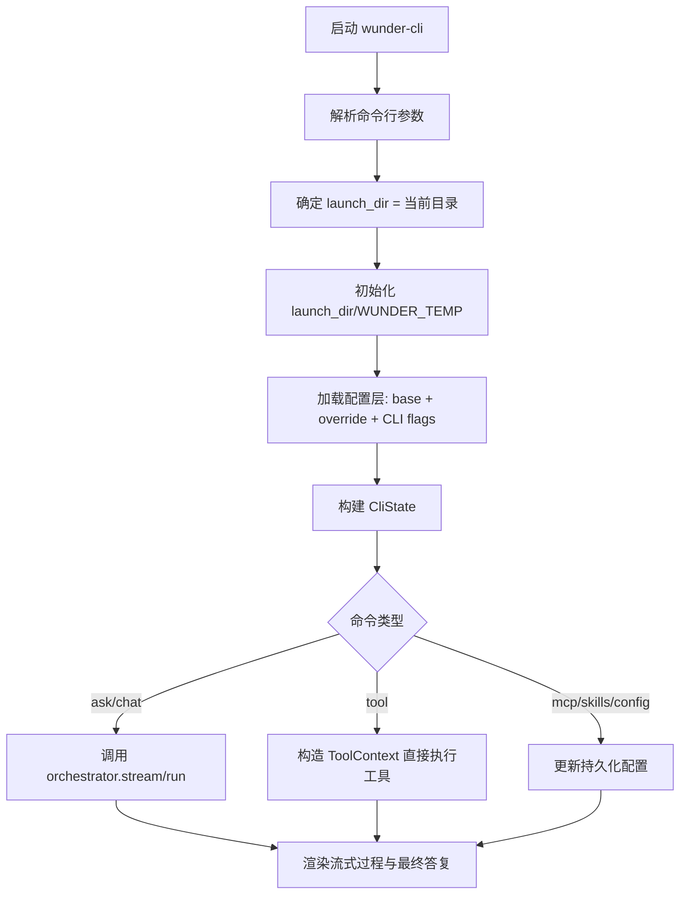

# wunder-cli实现方案

## 1. 背景与目标

## 1.1 目标定位

`wunder-cli` 是面向本地单用户场景的轻量运行形态，目标是：

- 让开发者/普通用户在任意项目目录快速获得类似 `/wunder` 的智能体能力。
- 最大化复用 `src/` 中已验证的编排、工具、MCP、skills、提示词、网关能力。
- 保持本地优先：运行时产物集中在启动目录下的 `WUNDER_TEMP/`，不污染 `data/`。
- 保持 wunder 特色能力：同一条链路可切换 `function_call` 与 `tool_call` 两种工具调用协议。

## 1.2 成功标准

- 只需一个可执行文件：`wunder-cli`。
- 在任意目录执行 `wunder-cli` 时，自动创建并使用 `./WUNDER_TEMP`。
- 智能体工作目录严格等于当前启动目录（即 CLI 启动目录）。
- 支持：
  - 聊天/一次性提问（流式过程 + 最终回复）
  - 内置工具直接调用
  - 本地命令执行
  - MCP 配置管理与调用
  - skills 配置管理与调用
  - `tool_call_mode` 切换与持久化

---

## 2. 现状代码分析与复用结论

## 2.1 可直接复用能力（核心价值）

以下能力可直接沿用，无需重写协议或业务语义：

- 调度主链路：`src/orchestrator/*`
  - 请求准备、会话上下文、LLM 回合、工具调度、流式事件。
- 工具体系：`src/services/tools.rs`
  - 内置工具、MCP 工具、skills 工具、知识库工具、命令执行。
- MCP 接入：`src/services/mcp.rs`
  - MCP 客户端/服务端工具描述与调用模型。
- skills：`src/services/skills.rs`
  - SKILL.md 扫描、前置信息解析、技能执行入口。
- 配置与覆盖：`src/core/config.rs`、`src/core/config_store.rs`
  - 基础配置 + override 差量写回机制。
- 存储：`src/storage/*`
  - SQLite 已具备长期运行必需参数（WAL、busy_timeout）。

## 2.2 现状中不适合直接复用的点（CLI改造重点）

1. `AppState::new` 偏 server 场景：
   - 默认触发 `TeamRunRunner.start()`、`AgentRuntime.start()`、`Cron.start()`。
   - 会进行组织/管理员初始化，非 CLI 必需。

2. 路径硬编码问题：
   - `UserToolStore::new` 当前固定写 `data/user_tools`。
   - `vector_knowledge` 当前根目录固定 `vector_knowledge/`。
   - 提示词读取依赖相对路径 `prompts/...`（CLI 在任意目录运行会失效）。

3. 工作区模型默认多租户：
   - `WorkspaceManager` 以 `workspace.root/<safe_user_id>` 组织目录。
   - 不满足“工作目录就是 CLI 启动目录”的要求。

---

## 3. 总体架构方案

## 3.1 运行模式

新增本地单用户模式：`wunder-cli`。

- 入口：新增 Rust 二进制 `src/bin/wunder_cli.rs`。
- 运行时：不启动 HTTP 服务，不暴露端口。
- 编排链路：直接调用 `Orchestrator::run/stream`。
- 用户模型：固定单用户（如 `cli_user`），不依赖注册用户体系。

## 3.2 模块结构（建议）

```text
src/
  bin/
    wunder_cli.rs                # CLI 入口
  cli/
    mod.rs
    args.rs                      # clap 命令树
    runtime.rs                   # 启动目录、WUNDER_TEMP、配置装载
    state.rs                     # CliState 构建（轻量化）
    session.rs                   # session 选择/恢复
    render.rs                    # 流式事件渲染（text/jsonl）
    commands/
      ask.rs                     # 一次性提问
      chat.rs                    # 交互会话
      tool.rs                    # 直接工具调用
      mcp.rs                     # MCP 管理命令
      skills.rs                  # skills 管理命令
      config.rs                  # 配置查看与设置
      doctor.rs                  # 环境诊断
```

## 3.3 轻量状态构建策略

建议引入 `StateMode`/`CliState`，避免复用 `AppState::new` 的 server 副作用。

- `ServerMode`：保持现状。
- `CliMode`：
  - 不启动 `team_run_runner/agent_runtime/cron`。
  - 不做默认管理员和组织结构 seed。
  - 保留 orchestrator + workspace + monitor + storage + skills + MCP + gateway hub（按需）。

## 3.4 启动流程



---

## 4. WUNDER_TEMP目录与持久化规范

## 4.1 目录结构

以“CLI 启动目录”为根：

```text
./WUNDER_TEMP/
  wunder_cli.sqlite3                    # SQLite 主库
  config/
    wunder.base.yaml                    # CLI 基础配置（首次生成）
    wunder.override.yaml                # 用户持久化覆盖配置
    wunder.runtime.yaml                 # 运行时覆盖（可重建）
  sessions/
    current_session.json                # 当前会话元数据
  user_tools/
    cli_user/
      config.json                       # MCP/skills/知识库配置
      skills/                           # 用户 skills 目录
      knowledge/                        # 用户字面知识库
  vector_knowledge/                     # 向量知识库存储根
  prompts/                              # 可选：提取后的提示词副本
  logs/
    wunder-cli.log
```

## 4.2 关键约束

- CLI 模式禁止写入 `data/` 作为长期状态目录。
- 允许读取仓库配置作为初始模板，但运行时状态统一落在 `WUNDER_TEMP/`。
- `WUNDER_TEMP/` 可整体备份/迁移，便于离线长期使用。

---

## 5. 配置分层与默认值设计

## 5.1 配置优先级（从低到高）

1. 内置默认模板（由 wunder 现有配置裁剪而来）
2. `WUNDER_TEMP/config/wunder.base.yaml`
3. `WUNDER_TEMP/config/wunder.override.yaml`
4. `WUNDER_TEMP/config/wunder.runtime.yaml`
5. CLI flags（当前命令生效）
6. 请求级 `config_overrides`（单次对话生效）

## 5.2 CLI模式默认覆盖项

`runtime` 层默认强制：

- `storage.backend = sqlite`
- `storage.db_path = ./WUNDER_TEMP/wunder_cli.sqlite3`
- `workspace.root = <launch_dir>`
- `sandbox.mode = local`（本地可直接执行命令）
- `server.mode = cli`
- `channels.enabled = false`
- `gateway.enabled = false`（可在 config 显式打开）
- `agent_queue.enabled = false`
- `cron.enabled = false`

## 5.3 tool_call_mode切换（特色能力）

### 设计

- 命令行支持：`--tool-call-mode function_call|tool_call`
- 持久化支持：`wunder-cli config set tool-call-mode ...`
- 实现方式：覆盖当前有效模型 `llm.models.<model>.tool_call_mode`

### 生效范围

- CLI flag：本次会话临时覆盖。
- config set：写入 `wunder.override.yaml`，后续默认生效。

---

## 6. 单用户模型与工作区适配

## 6.1 单用户策略

- 统一使用固定用户ID：`cli_user`（可允许高级参数覆盖）。
- 不要求该用户在注册用户表中存在。
- 用户侧/管理员侧权限区分在 CLI 中简化为“本地当前操作者”。

## 6.2 工作区策略（关键）

为满足“工作目录就是运行目录”，建议新增 workspace 单根模式：

- `workspace_mode = single_root`
- `workspace_root(user_id)` 直接返回 `workspace.root`
- 会话与缓存 key 继续用 `cli_user` 作为逻辑隔离键

这样可同时满足：
- 文件操作相对路径直接映射当前项目目录
- 内部状态仍具备稳定用户维度（便于缓存与统计）

---

## 7. 命令面设计（参考 codex-main，保留 wunder 语义）

## 7.1 全局参数

- `--model <name>`：选择模型
- `--tool-call-mode <mode>`：函数调用协议切换
- `--session <id>`：指定会话
- `--json`：JSONL 事件输出
- `--lang <zh-CN|en-US>`：语言
- `--config <path>`：指定基础配置
- `--temp-root <path>`：覆盖 `WUNDER_TEMP` 目录（默认 `./WUNDER_TEMP`）

## 7.2 子命令建议

- `wunder-cli chat [prompt]`：交互式会话（默认流式）
- `wunder-cli ask <prompt>`：一次性任务
- `wunder-cli tool run <tool_name> --args '{...}'`：直接执行工具
- `wunder-cli exec <command>`：`执行命令` 的便捷别名
- `wunder-cli mcp list|add|remove|enable|disable|test`
- `wunder-cli skills list|enable|disable|import|files`
- `wunder-cli config show|set|edit|reset`
- `wunder-cli doctor`：检查模型、数据库、提示词、MCP、技能环境

## 7.3 输出模式

- 文本模式：可读性优先，显示阶段/工具调用/最终答复。
- JSONL 模式：逐事件输出，便于脚本管道与自动化。

---

## 8. 运行时链路与事件渲染

## 8.1 ask/chat 主链路

1. 构造 `WunderRequest`
2. 调用 `orchestrator.stream`（默认）
3. 消费 `StreamEvent`
4. 将 `final` 事件落地为最终退出结果

## 8.2 关键事件与CLI渲染建议

| 事件 | CLI行为 |
| --- | --- |
| `progress` | 输出阶段性状态 |
| `llm_output` / `llm_output_delta` | 实时增量文本渲染 |
| `tool_call` | 显示将调用的工具与参数摘要 |
| `tool_result` | 显示工具执行结果摘要 |
| `context_usage` / `round_usage` | 输出上下文占用统计（非总消耗） |
| `final` | 输出最终答复并返回 0 |
| `error` | 输出错误并返回非 0 |

## 8.3 轮次与统计

沿用 wunder 语义：

- 用户轮次：每条用户输入 +1
- 模型轮次：每次动作（模型调用/工具调用/最终回复）+1

CLI 不改语义，只做展示增强。

---

## 9. MCP / skills / 工具直调模型

## 9.1 MCP配置管理

- 配置落点：`WUNDER_TEMP/user_tools/cli_user/config.json`
- 重用 `UserToolStore` 的更新能力（`update_mcp_servers` 等）
- 通过 `user_tool_manager.build_bindings` 注入 orchestrator

## 9.2 skills配置管理

- 支持启用/停用/共享/导入本地技能目录。
- 默认扫描路径建议：
  - `<launch_dir>/skills`
  - `<repo>/EVA_SKILLS`（存在时）
  - `WUNDER_TEMP/user_tools/cli_user/skills`

## 9.3 直接调用内置工具

`wunder-cli tool run` 不经过模型推理，直接构造 `ToolContext` 执行 `services::tools::execute_tool`：

- 适用于快速自动化（读写文件、搜索内容、执行命令、ptc 等）。
- 行为与模型链路内调用保持一致，避免双套逻辑。

---

## 10. 安全与执行策略

## 10.1 命令执行策略

- 默认沿用 `security.allow_commands` / `allow_paths` / `deny_globs`。
- 本地 CLI 推荐默认 `sandbox.mode=local`，减少对远程 sandbox 的依赖。
- 保留 `exec_policy_mode`，支持后续接入确认流（warning/enforce）。

## 10.2 路径边界

- 仍由 `WorkspaceManager` + `path_utils` 执行路径归一化与越界拦截。
- 单根工作区模式必须保证：所有文件操作限定在 launch_dir 及显式 allow_paths。

## 10.3 凭据管理

- API key 等敏感项优先走环境变量。
- `wunder.override.yaml` 中出现敏感字段时，`doctor` 提示风险。

---

## 11. 性能与长期稳定性（10年以上运行目标）

## 11.1 轻量启动

- CLI 默认不启动 server 专用后台循环。
- gateway/mcp/lsp 采用懒加载（首次用到再初始化连接）。

## 11.2 状态增长控制

- `WUNDER_TEMP` 下日志与临时缓存定期清理。
- stream_events、monitor 维持 TTL/上限策略。
- 长会话场景启用历史压缩与上下文裁剪（沿用 orchestrator 现有能力）。

## 11.3 SQLite维护建议

- 保持 WAL + busy_timeout（已在 `SqliteStorage` 中具备）。
- 增加 CLI 维护命令：`wunder-cli doctor --vacuum`（后续里程碑）。
- 对异常退出场景增加恢复检查（schema/version）。

---

## 12. 分阶段实施计划（节点明确）

## M0：设计与骨架（文档阶段）

- 完成本方案文档、目录约定、命令树草案。

## M1：最小可运行 CLI

### 目标

- 新增 `wunder-cli` 二进制。
- 支持 `ask/chat`（可流式输出）。
- 使用 `WUNDER_TEMP/wunder_cli.sqlite3`。

### 主要改造点

- `Cargo.toml`：新增 CLI 依赖与 `[[bin]]`。
- `src/bin/wunder_cli.rs`、`src/cli/args.rs`、`src/cli/runtime.rs`。

## M2：单用户+工作区精确适配

### 目标

- 工作区严格绑定 launch_dir。
- 消除 `data/` 路径依赖。

### 主要改造点

- `src/services/workspace.rs`：单根模式支持。
- `src/services/user_tools.rs`：支持自定义根目录（指向 `WUNDER_TEMP/user_tools`）。
- `src/services/vector_knowledge.rs`：支持 CLI 向量根目录。

## M3：MCP/skills/工具直调命令

### 目标

- `mcp`、`skills`、`tool run`、`exec` 命令完善。
- 与 orchestrator 工具注入链路打通。

### 主要改造点

- `src/cli/commands/mcp.rs`
- `src/cli/commands/skills.rs`
- `src/cli/commands/tool.rs`

## M4：tool_call_mode 双协议切换

### 目标

- 命令行与持久化两种切换方式。
- 输出中明确当前模式。

### 主要改造点

- `src/cli/commands/config.rs`
- `src/cli/runtime.rs`（请求级覆盖构造）

## M5：可移植资源与体验完善

### 目标

- 在非仓库目录仍可获得完整提示词体验。
- 完成 `doctor`、会话恢复、JSONL 输出。

### 主要改造点

- `src/services/prompting.rs`（提示词根目录可配置/资源提取）
- `src/cli/render.rs`
- `src/cli/session.rs`

## M6：稳定性与回归

### 目标

- 完成 CLI 集成测试与压力回归。
- 达到发布门槛。

---

## 13. 测试与验收标准

## 13.1 功能验收

- [ ] 在空目录执行 `wunder-cli ask "你好"` 自动创建 `WUNDER_TEMP`。
- [ ] 工具链可正常调用（读取文件/写入文件/执行命令/ptc）。
- [ ] `mcp add/list/remove` 生效并持久化。
- [ ] `skills enable/disable` 生效并持久化。
- [ ] `tool_call_mode` 切换后行为正确（function_call/tool_call）。

## 13.2 兼容与稳定性

- [ ] Windows/Linux/macOS 基本命令可运行。
- [ ] 连续 24h 压测无崩溃、无明显内存泄漏。
- [ ] `cargo check`、`cargo clippy` 无错误与告警。

## 13.3 性能基线（建议）

- 冷启动到可提问：< 1.5s（本地模型除外）。
- 常规流式首 token 延迟：不劣于 server 本地直连基线。
- 空闲内存：显著低于完整 server 进程。

---

## 14. 风险与回滚策略

## 14.1 主要风险

1. 路径适配风险：单根工作区与现有多租户逻辑耦合较深。
2. 资源定位风险：提示词/多语言文件在“单二进制”分发场景下的可用性。
3. 状态初始化风险：若沿用 `AppState::new`，会引入不必要后台负担。

## 14.2 回滚策略

- 每阶段以 feature flag 控制（如 `--experimental-cli`）。
- 保留 server 初始化路径不变，CLI 使用独立状态构建分支。
- 若单根工作区适配出现回归，可临时降级为 `workspace.root/<cli_user>` 方案，保证功能可用优先。

---

## 15. 与现有文档关系

本方案当前属于“实施蓝图”，尚未落地代码。

在进入 M1 开发并提交首批代码后，需同步更新：

- `docs/设计方案.md`：新增 CLI 架构章节。
- `docs/API文档.md`：新增 CLI 命令/配置说明（若保留 API 对照关系）。
- `docs/系统介绍.md`：补充“wunder-server + wunder-cli”双形态描述。
