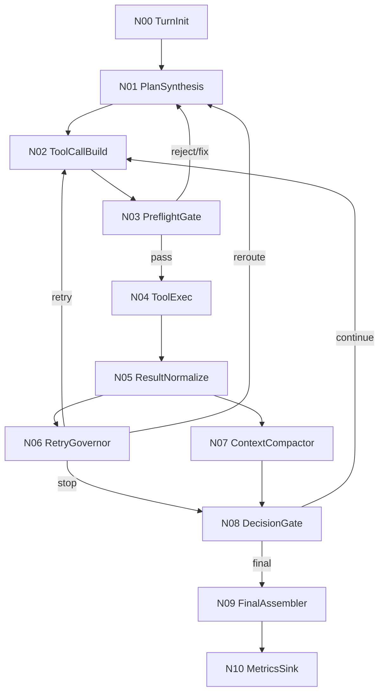

# wunder智能体工作流优化方案1

## 1. 目标与范围

本版方案已按要求移除“原第4点（任务不变量锁）”，仅保留并落地以下 5 项通用优化能力：

1. 统一工具成功语义（避免顶层成功但业务失败）
2. 错误指纹重试治理（按错误类型治理重试，而非按工具名硬重试）
3. 执行前预检（shell/python/sql 的确定性错误前置拦截）
4. 上下文压缩（降低失败循环导致的 token 膨胀）
5. 结果呈现语义统一（采样/截断/覆盖范围显式化）

目标是在不改动 `/wunder` 对外接口的前提下，减少失败循环、降低 token 占用、提升完成率与可解释性。

---

## 2. 工作流总览（节点版）

### 2.1 主流程节点

| 节点ID | 节点名称 | 主要职责 | 对应优化项 |
|---|---|---|---|
| N00 | TurnInit | 初始化本轮上下文与执行状态 | - |
| N01 | PlanSynthesis | 生成最小执行计划（步骤、工具、终止条件） | 2 |
| N02 | ToolCallBuild | 构造工具调用参数与执行请求 | - |
| N03 | PreflightGate | 执行前预检与可修正规则 | 3 |
| N04 | ToolExec | 调用工具并收集原始结果 | - |
| N05 | ResultNormalize | 统一结果语义（transport/business/final） | 1,5 |
| N06 | RetryGovernor | 按错误指纹决策重试/换路/停止 | 2 |
| N07 | ContextCompactor | 压缩失败日志与大输出，沉淀工件引用 | 4 |
| N08 | DecisionGate | 判断继续执行、澄清或收敛 | 2,4 |
| N09 | FinalAssembler | 输出最终答复与质量说明 | 5 |
| N10 | MetricsSink | 上报指标与回放数据 | 1~5 |

### 2.2 状态流转



---

## 3. 节点详细设计

## 3.1 N03 PreflightGate（执行前预检）

### 输入

- N02 生成的工具请求（tool + args）
- 当前环境能力快照（shell、python、数据库方言）

### 输出

- `preflight_status`: `pass | rewrite | reject`
- `diagnostics[]`: 结构化错误与建议
- 可选 `rewritten_args`

### 规则集（首批）

1. shell 规则
- heredoc 必须 `<<EOF`，禁止错误形式 `< 'EOF'`
- 长脚本优先“写文件再执行”，限制超长 `printf` 拼接

2. python 规则
- 执行前做语法检查（如 `py_compile` 等价能力）
- 前置拦截缩进错误、括号不匹配、明显编码错误

3. sql 规则
- 检测全角标点（如 `，`）并阻断或给修正建议
- 聚合/别名/limit 等方言敏感语法前置校验

### 策略

- `reject`：不进入 N04，回到 N01 重新规划
- `rewrite`：使用修正参数继续执行

### 落地建议

- 新增 `src/orchestrator/preflight.rs`
- 子模块 `preflight/shell.rs`、`preflight/python.rs`、`preflight/sql.rs`

---

## 3.2 N05 ResultNormalize（结果归一化）

### 目标

消除“顶层 ok=true 但业务失败”的二义性，统一错误分类与观测字段。

### 统一结构

```json
{
  "transport_ok": true,
  "business_ok": false,
  "final_ok": false,
  "tool": "extra_mcp@db_query",
  "error": {
    "code": "SQL_SYNTAX_ERROR",
    "message": "near '...'",
    "layer": "business",
    "retryable": false,
    "fingerprint": "fp_xxx"
  },
  "observation": {
    "rows": 0,
    "truncated": false,
    "sampled": false,
    "omitted_rows": 0
  }
}
```

### 规则

- `final_ok = transport_ok && business_ok`
- 任一子层失败都必须映射 `error.code`
- 采样/截断/分页必须显式字段返回，不靠模型猜测

### 落地建议

- 新增 `src/orchestrator/types.rs` 的 `NormalizedToolResult`
- 改造 `src/orchestrator/tool_exec.rs` 统一落盘与事件上报

---

## 3.3 N06 RetryGovernor（错误指纹重试治理）

### 输入

- 当前 `NormalizedToolResult`
- 当前用户轮次最近 N 次执行记录

### 错误指纹

`fingerprint = hash(tool + error.code + normalized(stderr/head) + preflight_tag)`

### 决策表（首版）

1. `retryable=false` 且同指纹再次出现：直接停止自动重试，转 N08
2. `retryable=true`
- 同指纹最多 2 次（指数退避 200ms -> 800ms）
- 超阈值改走“换路策略”（换工具或换执行方式）
3. 不同指纹但同工具连续失败 >=3：强制回 N01 重规划

### 落地建议

- 新增 `src/orchestrator/retry_governor.rs`
- 在 `thread_runtime` 记录 `error_fingerprint_ring_buffer`

---

## 3.4 N07 ContextCompactor（上下文压缩）

### 输入

- 大体积工具输出
- 重复失败日志（stderr/stdout）
- 重复脚本文本

### 输出

- `artifact_ref`（工作区或存储路径）
- `compact_summary`（供后续轮次引用）

### 压缩策略

1. 重复失败
- 保存首次完整错误 + 后续出现次数

2. 大输出
- 保留头尾片段 + 统计元信息（总行数、命中数、截断标记）

3. 长脚本
- 使用工件引用替代全文回灌

### 目标

- 高失败场景下 `context_tokens` 增速下降 40%+

### 落地建议

- 新增 `src/orchestrator/context_compactor.rs`
- 与 `src/orchestrator/context.rs` 联动，优先注入摘要

---

## 3.5 N09 FinalAssembler（结果呈现统一）

最终回复必须包含：

1. 完成状态：`done | partial | blocked`
2. 任务目标快照：本轮已执行目标与关键参数
3. 数据质量说明：是否采样、是否截断、覆盖范围
4. 若阻塞：下一步最小操作（最多 2 条）

---

## 4. 编排伪代码（核心控制环）

```rust
loop {
    let plan = synthesize_plan(state.goal, state.history)?;
    let call = build_tool_call(plan.next_step)?;

    let preflight = preflight_check(&call, &state.env);
    if preflight.is_reject() {
        state.push_diag(preflight);
        continue; // re-plan
    }
    let call = preflight.apply_if_needed(call);

    let raw = execute_tool(call).await;
    let norm = normalize_result(raw);
    state.record(norm.clone());

    let retry_decision = retry_governor.decide(&norm, &state);
    state = context_compact(state);

    match retry_decision {
        RetryDecision::Retry => continue,
        RetryDecision::Reroute => continue, // re-plan
        RetryDecision::Stop => break,
    }
}
```

---

## 5. 落地里程碑

## M1（1 周）P0

- 完成 N05 结果归一化
- 完成 N06 错误指纹重试治理

验收：

- “顶层成功/业务失败”错判率为 0
- 同指纹重复失败次数从 5 降到 <=2

## M2（1 周）P0

- 完成 N03 预检规则（shell/python/sql）
- 接入 N08 决策门

验收：

- heredoc/缩进类确定性错误拦截率 >=95%
- 执行命令类非 0 退出率下降 50%+

## M3（1 周）P1

- 完成 N07 上下文压缩
- 完成 N09 最终呈现统一

验收：

- 高失败轮次下 token 占用下降 40%+
- 最终回复可解释字段覆盖率 100%

---

## 6. 监控与告警

新增指标（建议接入 `src/ops/`）：

- `workflow_round_count_per_user_turn`
- `tool_final_ok_rate{tool}`
- `tool_failure_fingerprint_repeat_count`
- `preflight_reject_rate{tool,rule}`
- `context_tokens_growth_per_round`
- `stop_reason_count{reason}`

告警阈值（初版）：

- 单用户轮次模型动作 > 15 次
- 同指纹错误重复 > 2 次
- `context_tokens_growth_per_round` 连续 5 轮 > 1200

---

## 7. 风险与回滚

### 风险

- 预检过严导致误拦截
- 归一化改造影响历史工具适配
- 压缩策略影响模型可用上下文

### 回滚策略

- 全部新逻辑置于 feature flag：
- `workflow_preflight_v1`
- `workflow_result_normalize_v1`
- `workflow_retry_governor_v1`
- `workflow_context_compactor_v1`

任一子模块可独立关闭，保留旧路径兜底。

---

## 8. 预期收益

- 模型动作轮次：29 -> 8~12
- 同类确定性错误重试：5 -> <=2
- token 占用：下降 35%~50%
- 平均完成时长：下降 30%+

该方案采用“先止损（防失败循环）再提速（压缩上下文与精简动作）”路线，适合原型阶段快速迭代。
