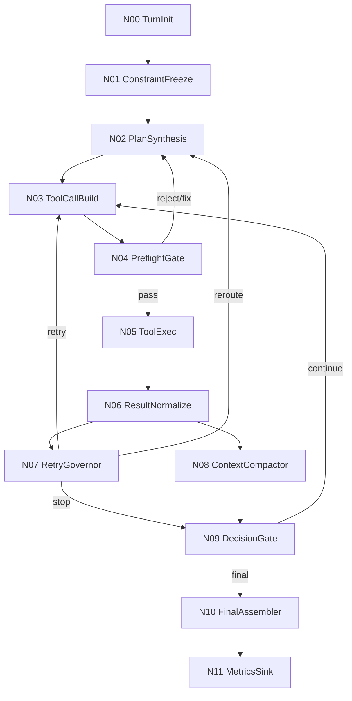

# wunder智能体工作流优化方案1

## 1. 目标与范围

本方案聚焦“系统与模型协同”链路，覆盖一次用户轮次内从请求进入到最终回复的完整工作流，优先落地以下 6 项优化：

1. 统一工具成功语义（避免顶层成功但业务失败）
2. 升级重试治理（按错误指纹，而非仅按工具名）
3. 增加执行前预检（shell/python/sql 语法与能力检查）
4. 引入任务不变量锁（目标人数、比例等关键约束冻结）
5. 增加上下文压缩（降低失败循环导致的 token 膨胀）
6. 统一结果呈现语义（分页/采样/截断显式标注）

目标是在不改变现有产品接口（`/wunder`）的前提下，减少错误循环、降低 token 占用、提升成功率和可解释性。

---

## 2. 工作流总览（节点版）

### 2.1 主流程节点

| 节点ID | 节点名称 | 主要职责 | 对应优化项 |
|---|---|---|---|
| N00 | TurnInit | 初始化本轮上下文、读入线程冻结提示词 | - |
| N01 | ConstraintFreeze | 提取并冻结任务不变量 | 4 |
| N02 | PlanSynthesis | 生成最小执行计划（工具顺序+终止条件） | 2,4 |
| N03 | ToolCallBuild | 组装工具参数与执行请求 | - |
| N04 | PreflightGate | 执行前预检与参数修正建议 | 3 |
| N05 | ToolExec | 实际调用工具并收集原始结果 | - |
| N06 | ResultNormalize | 归一化结果语义（transport/business） | 1,6 |
| N07 | RetryGovernor | 按错误指纹决策重试/换路/停止 | 2 |
| N08 | ContextCompactor | 失败与大输出压缩为摘要工件 | 5 |
| N09 | DecisionGate | 判断继续执行、请求澄清或直接收敛 | 2,4,5 |
| N10 | FinalAssembler | 生成最终答案与可追踪元信息 | 6 |
| N11 | MetricsSink | 上报指标与回放数据 | 1~6 |

### 2.2 状态流转（简图）



---

## 3. 节点详细设计

## 3.1 N01 ConstraintFreeze（任务不变量锁）

### 输入

- 用户请求文本
- 当前线程已冻结 system prompt
- 历史轮次中的已确认约束（若存在）

### 输出（写入 `turn_state.invariants`）

- `target_count`（示例：500）
- `ratio_rules`（示例：male=0.6）
- `priority_rules`（示例：age_asc）
- `scope_rules`（示例：在职人员）
- `tolerance`（示例：比例误差 ±1 人）

### 判定与约束

- 一旦本轮确认，后续模型动作必须引用同一组不变量。
- 若工具输入与不变量冲突（如 `target_count` 从 500 漂移到 50），直接拒绝执行并回到 N02 重规划。

### 落地建议

- 新增：`src/orchestrator/turn_state.rs` 内 `TurnInvariants`
- 校验入口：`src/orchestrator/tool_calls.rs` 下发前

---

## 3.2 N04 PreflightGate（执行前预检）

### 输入

- N03 生成的工具请求（tool + args）
- 当前执行环境能力快照（可执行命令、python 版本、数据库方言）

### 输出

- `preflight_status`: `pass | rewrite | reject`
- `diagnostics[]`: 结构化告警/错误
- 可选 `rewritten_args`（安全可自动修正时）

### 规则集（首批）

1. shell 规则：
   - heredoc 必须 `<<EOF`，禁止错误形式 `< 'EOF'`
   - 多行脚本优先写文件后执行，禁止极长单行 `printf` 拼接
2. python 规则：
   - 对脚本内容先做 `python -m py_compile` 级别语法检查
   - 捕获缩进错误、括号不匹配等确定性失败
3. sql 规则：
   - 检测全角标点（如 `，`）并阻断或修正建议
   - 方言敏感语法提前校验（聚合、别名、limit）

### 策略

- `reject`：不进入 N05，直接返回 N02 改计划。
- `rewrite`：写入修正后的参数并继续执行。

### 落地建议

- 新增模块：`src/orchestrator/preflight.rs`
- 子模块：`preflight/shell.rs`、`preflight/python.rs`、`preflight/sql.rs`

---

## 3.3 N06 ResultNormalize（结果归一化）

### 目标

彻底消除“顶层 ok=true 但业务失败”的二义性。

### 统一返回结构

```json
{
  "transport_ok": true,
  "business_ok": false,
  "final_ok": false,
  "tool": "extra_mcp@db_query",
  "error": {
    "code": "SQL_SYNTAX_ERROR",
    "message": "near '...'",
    "layer": "business",
    "retryable": false,
    "fingerprint": "fp_xxx"
  },
  "observation": {
    "rows": 0,
    "truncated": false,
    "sampled": false,
    "omitted_rows": 0
  }
}
```

### 归一化规则

- `final_ok = transport_ok && business_ok`
- 任何子层失败都要映射 `error.code`，禁止“隐形失败”。
- 结果中的采样/截断必须显式字段返回（不靠模型推断）。

### 落地建议

- 新增：`src/orchestrator/types.rs` 定义 `NormalizedToolResult`
- 改造：`src/orchestrator/tool_exec.rs` 统一落盘与事件上报

---

## 3.4 N07 RetryGovernor（错误指纹重试治理）

### 输入

- 当前 `NormalizedToolResult`
- 最近 N 次同轮执行记录

### 错误指纹

`fingerprint = hash(tool + error.code + normalized(stderr/head) + preflight_tag + invariant_snapshot)`

### 决策表（首版）

1. `retryable=false` 且相同指纹再次出现：立即停止自动重试，转 N09。
2. `retryable=true`：
   - 同指纹最多 2 次（指数退避 200ms -> 800ms）
   - 超过阈值改走“换路策略”（例如改工具、改执行方式）
3. 不同指纹但同工具连续失败 >=3：触发“计划重构”，强制回 N02。

### 结果

- 避免“同错多次”消耗 token
- 将失败分为“可修复重试”和“必须改计划”两类

### 落地建议

- 新增：`src/orchestrator/retry_governor.rs`
- 持久字段：`thread_runtime` 中记录 `error_fingerprint_ring_buffer`

---

## 3.5 N08 ContextCompactor（上下文压缩）

### 输入

- 大工具输出
- 多次失败的 stderr/stdout
- 重复脚本内容

### 输出

- `artifact_ref`（落到工作区或存储）
- `compact_summary`（供后续轮次使用）

### 压缩策略

1. 重复失败信息：
   - 仅保留“首次完整 + 后续计数”
2. 大文本输出：
   - 保留头尾片段 + 统计元信息（总行数、命中数、截断标记）
3. 长脚本：
   - 以工件引用替代全文回灌（避免每轮重新注入）

### 目标

- 单轮高失败场景下，context_tokens 增速降低 40%+

### 落地建议

- 新增：`src/orchestrator/context_compactor.rs`
- 结合：`src/orchestrator/context.rs` 注入压缩摘要而非原文

---

## 3.6 N10 FinalAssembler（结果呈现统一）

### 输出要求

最终回复必须包含：

1. 是否完成目标（`done | partial | blocked`）
2. 当前不变量快照（目标人数、比例、优先规则）
3. 数据质量说明（是否采样、是否截断、覆盖范围）
4. 若阻塞：明确下一步最小操作（最多 2 条）

### 样例结构

- `完成状态`：blocked（执行命令语法错误，已停止自动重试）
- `已锁定约束`：target_count=500, male_ratio=0.6, age_priority=asc
- `建议动作`：
  - 使用 `write_file + python file.py` 执行路径
  - 保持 target_count 不变后重试

---

## 4. 编排伪代码（核心控制环）

```rust
loop {
    let plan = synthesize_plan(state.invariants, state.history)?;
    let call = build_tool_call(plan.next_step)?;

    let preflight = preflight_check(&call, &state.env);
    if preflight.is_reject() {
        state.push_diag(preflight);
        continue; // re-plan
    }
    let call = preflight.apply_if_needed(call);

    let raw = execute_tool(call).await;
    let norm = normalize_result(raw);
    state.record(norm.clone());

    let retry_decision = retry_governor.decide(&norm, &state);
    state = context_compact(state);

    match retry_decision {
        RetryDecision::Retry => continue,
        RetryDecision::Reroute => continue, // re-plan
        RetryDecision::Stop => break,
    }
}
```

---

## 5. 落地里程碑

## M1（1 周）P0

- 完成 N06 结果归一化
- 完成 N07 错误指纹重试治理
- 完成 N01 不变量锁最小版本

验收：

- “顶层成功/业务失败”错判率降为 0
- 同指纹重复失败次数从 5 降到 <=2

## M2（1 周）P0

- 完成 N04 预检规则（shell/python/sql）
- 接入 N09 决策门

验收：

- heredoc/缩进类确定性错误拦截率 >=95%
- 执行命令类非 0 退出率下降 50%+

## M3（1 周）P1

- 完成 N08 上下文压缩
- 完成 N10 统一最终呈现

验收：

- 高失败轮次下 token 占用下降 40%+
- 最终回复可解释字段覆盖率 100%

---

## 6. 监控与告警

新增指标（建议挂到 `src/ops/`）：

- `workflow_round_count_per_user_turn`
- `tool_final_ok_rate{tool}`
- `tool_failure_fingerprint_repeat_count`
- `preflight_reject_rate{tool,rule}`
- `context_tokens_growth_per_round`
- `stop_reason_count{reason}`

告警阈值（初版）：

- 单用户轮次模型动作 > 15 次
- 同指纹错误重复 > 2 次
- `context_tokens_growth_per_round` 连续 5 轮 > 1200

---

## 7. 风险与回滚

### 风险

- 预检过严导致误拦截
- 归一化改造影响历史工具适配
- 压缩策略影响模型可用上下文

### 回滚策略

- 全部新逻辑置于 feature flag：
  - `workflow_invariant_lock_v1`
  - `workflow_preflight_v1`
  - `workflow_result_normalize_v1`
  - `workflow_retry_governor_v1`
  - `workflow_context_compactor_v1`
- 任一子模块可独立关闭，保留旧路径兜底。

---

## 8. 预期收益（以单轮复杂任务为例）

- 模型动作轮次：29 -> 8~12
- 同类确定性错误重试：5 次 -> <=2 次
- token 占用：下降 35%~50%
- 平均完成时长：下降 30%+

该方案优先保证“先止损（防失败循环）再提速（压缩上下文与精简动作）”，适合原型阶段快速迭代与灰度上线。
