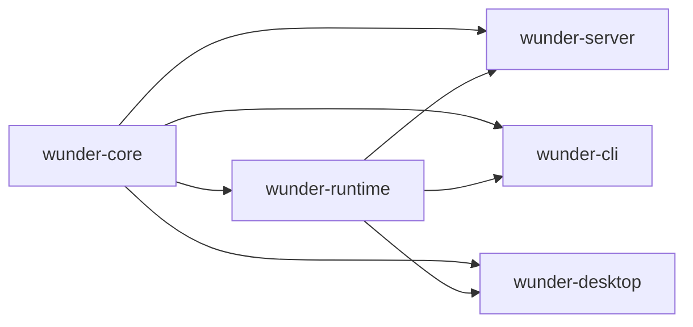

# 后端轻量化重构

## 1. 目标

这份方案不是把后端推倒重写，也不是把系统拆成很多互相等待的微服务，而是把当前的大单包整理成少数几个边界清晰、编译更轻、运行更稳的层。

核心目标只有四个：

- 稳定性更高
- 拓展性更好
- 运行速度更快
- 并发承载更强

## 2. 现状判断

当前后端的主要问题不是单点算法慢，而是结构本身太重，导致编译、联调和运行时都被放大。

### 2.1 编译面

- 根包同时承载 `wunder-server`、`wunder-cli`、`wunder-desktop`、`wunder-desktop-bridge`，还有多个模拟和测试目标。
- 根 `Cargo.toml` 的依赖面很宽，涵盖 HTTP/WS、数据库、图像、文档解析、桌面壳、加密、可观测性和运行时工具。
- 根包还挂着桌面相关 build script，哪怕是服务端构建，也会先经过这层包装。
- 大文件太多，最明显的是：
  - `src/services/tools.rs` 约 1.3 万行
  - `src/storage/sqlite.rs` 约 1.0 万行
  - `src/storage/postgres.rs` 约 1.0 万行
  - `src/api/admin.rs` 约 1.0 万行

### 2.2 运行面

- 大量阻塞 IO 通过 `spawn_blocking` 零散分布在 API、服务、编排、通道和工具层。
- 状态容器较多，既有全局缓存，也有会话级锁、任务队列、租约和心跳。
- 存储层是同步 trait，调用方再包一层异步桥接，容易把阻塞和回压治理拆散。
- 长链路任务很多，外部请求、文件处理、模型调用、队列持久化都需要统一的超时和取消策略。

### 2.3 扩展面

- `api`、`services`、`storage`、`orchestrator`、`channels` 都已经很大，但边界还不够硬。
- 很多新功能是沿着“调用方便”往现有大文件里塞，短期省事，长期会把重构成本继续放大。
- 当前结构适合把功能做出来，不适合把功能持续做快、做稳、做小。

## 3. 重构原则

1. 先按职责切边界，再按调用关系拆文件。
2. 核心语义要稳定，适配器可以快变。
3. 运行时路径要短，阻塞点要集中管理。
4. 并发控制要显式，不靠运气。
5. 只做少量高价值抽象，不堆新框架。
6. 大文件优先拆，超过 2000 行的文件只允许维护，不允许继续膨胀。

## 4. 推荐目标形态

### 4.1 `wunder-core`

放最稳定、最少依赖、最少变动的内容：

- 配置模型
- schema 与公共 DTO
- 鉴权、路径、token、i18n、校验、限制
- 存储抽象接口与基础记录类型
- 纯工具函数

这一层尽量不依赖 axum、tauri、数据库客户端和重型解析库。

### 4.2 `wunder-runtime`

放真正的后端执行能力：

- orchestrator
- services
- channels
- storage 实现
- background job
- tool 执行链
- 线程运行态、租约、回压、事件流

这一层可以重，但必须边界稳定。

### 4.3 `wunder-server`

只保留入口和协议层：

- axum router
- middleware
- bootstrap
- 静态资源挂载
- CORS、认证、语言、panic 保护

服务端不再直接背负整个桌面壳和 CLI 的编译成本。

### 4.4 `wunder-cli` / `wunder-desktop`

都只做薄适配层：

- CLI 负责命令解析和交互
- Desktop 负责窗口、更新、桥接
- 两者都依赖 runtime，而不是反向绑死 server

## 5. 分阶段路线

### 阶段 0：先量化，再动刀

先固定基线数据，避免重构变成主观感觉：

- `cargo check` / `cargo test` 的总耗时
- 首次启动耗时
- 典型接口 p95/p99 延迟
- 并发会话下的队列深度
- 存储写入等待时间
- `spawn_blocking` 的累计耗时

交付标准：

- 有一份可复用的基线记录
- 有一组不回退的回归指标

### 阶段 1：先拆包，再拆逻辑

这是最值得先做的一步，因为它直接影响编译速度。

建议动作：

- 把桌面 build script 和桌面专属依赖从根包移走
- 建立 workspace
- 把 `core`、`runtime`、`server`、`cli`、`desktop` 分成独立 crate
- 缩小各 crate 的依赖面
- 把 Tokio、Reqwest、图像和解析库按形态分配到真正需要它们的 crate

预期收益：

- 改 CLI 不再拖累桌面壳
- 改桌面壳不再拖累纯服务端
- 改协议层时不会反复刷新整个重依赖图

### 阶段 2：按领域拆大文件

优先拆这些大块：

- `src/services/tools.rs`
- `src/storage/mod.rs` 及 `sqlite.rs` / `postgres.rs`
- `src/api/admin.rs`
- `src/api/chat.rs`
- `src/api/user_tools.rs`
- `src/api/user_channels.rs`
- `src/orchestrator/memory.rs`
- `src/orchestrator/execute.rs`
- `src/services/llm.rs`
- `src/services/workspace.rs`
- `src/channels/service.rs`

拆分规则：

- 一个文件只保留一个主职责
- 共享类型抽到更稳定的层
- 新功能优先落新文件，不往旧巨文件里堆

### 阶段 3：把阻塞点收口

目标不是“把同步改成异步”这么粗糙，而是把阻塞行为集中在少数可控边界里。

建议动作：

- 建立统一的 blocking 执行入口
- 给文件 IO、DB IO、外部命令、文档解析、图片处理设定明确超时
- 对耗时任务加取消令牌
- 对外部调用加重试预算和失败退避
- 对高频读写路径加背压和限流

### 阶段 4：并发治理

重点不是多开线程，而是让高并发下的状态更可控。

建议动作：

- 会话、工具、通道、cron、outbox 都用有界队列
- 单资源写入路径尽量单写者化
- 全局缓存改为分域、分片或按 key 隔离
- 会话锁、租约、心跳、重放都做成显式状态机
- 长任务必须可恢复、可取消、可重试

### 阶段 5：回归与验收

每次切边界后都要补验收，不然只是把复杂度换个位置。

建议验收项：

- 单域改动不应触发全量重编
- 服务端改动不应拉起桌面打包链路
- 关键并发路径无未限制增长的队列
- 失败恢复后能回到一致状态
- 高并发下 p95 延迟和错误率可控

## 6. 关键设计点

### 6.1 存储层

存储层是最值得先收口的地方。

建议把当前巨大 trait 拆成按领域组合的接口，例如：

- user
- session
- chat
- cron
- channel
- gateway
- bridge
- world

这样做的好处是：

- 新领域只加一个子 trait，不污染整个存储面
- SQLite 和 Postgres 实现可以按领域并行演进
- 调用方更容易看清自己依赖了什么

### 6.2 工具与编排

工具和编排是后端最重的热路径之一，必须限制它们继续膨胀。

建议动作：

- 工具目录和执行目录分离
- 工具结果裁剪统一收口
- 模型调用、并行工具、子智能体、MCP 都走同一套超时与失败模型
- 工具执行不要直接在 API 层拼装大逻辑

### 6.3 实时链路

实时链路要优先保证“不断”和“可恢复”，不是追求最短代码。

建议动作：

- 事件队列有界
- 持久化与推送解耦
- 重放有水位
- WS 连接状态和业务状态分离
- 断线恢复时不要依赖一次性内存态

### 6.4 启动与恢复

启动阶段要少做事，恢复阶段要可重试。

建议动作：

- 把外部探测、工具 hydration、索引预热改成后台任务
- 启动路径只做最小必要初始化
- 失败时能降级，不要把整个进程拉死

## 7. 不建议做的事

- 不要把所有模块再包一层“公共工具层”
- 不要为了拆分而拆成几十个小 crate
- 不要把同步存储强行改成无边界的异步散弹
- 不要把网络、文件、数据库逻辑继续堆在 API 层
- 不要用新抽象掩盖旧耦合

## 8. 结论

后端轻量化的核心，不是把功能砍掉，而是把“谁负责什么”说清楚，把“谁能阻塞谁”限制住，把“哪个改动会影响谁”缩到最小。

如果按这个路线走，后端会逐步变成：

- 编译更快
- 修改更稳
- 并发更可控
- 新功能更容易插入

而且不会牺牲现有的 server 核心能力。
