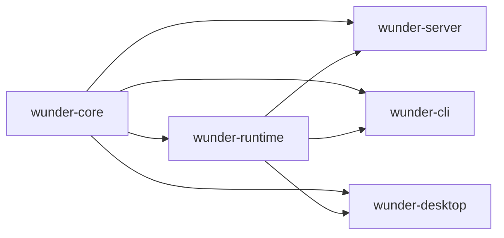

# 后端轻量化重构

## 1. 目标

这份方案不是把后端推倒重写，也不是把系统拆成很多互相等待的微服务，而是把当前的大单包整理成少数几个边界清晰、编译更轻、运行更稳的层。

核心目标只有四个：

- 稳定性更高
- 拓展性更好
- 运行速度更快
- 并发承载更强

## 2. 现状判断

当前后端的主要问题不是单点算法慢，而是结构本身太重，导致编译、联调和运行时都被放大。

### 2.1 编译面

- 根包同时承载 `wunder-server`、`wunder-cli`、`wunder-desktop`、`wunder-desktop-bridge`，还有多个模拟和测试目标。
- 根 `Cargo.toml` 的依赖面很宽，涵盖 HTTP/WS、数据库、图像、文档解析、桌面壳、加密、可观测性和运行时工具。
- 根包还挂着桌面相关 build script，哪怕是服务端构建，也会先经过这层包装。
- 大文件太多，最明显的是：
  - `src/services/tools.rs` 约 1.3 万行
  - `src/storage/sqlite.rs` 约 1.0 万行
  - `src/storage/postgres.rs` 约 1.0 万行
  - `src/api/admin.rs` 约 1.0 万行

### 2.2 运行面

- 大量阻塞 IO 通过 `spawn_blocking` 零散分布在 API、服务、编排、通道和工具层。
- 状态容器较多，既有全局缓存，也有会话级锁、任务队列、租约和心跳。
- 存储层是同步 trait，调用方再包一层异步桥接，容易把阻塞和回压治理拆散。
- 长链路任务很多，外部请求、文件处理、模型调用、队列持久化都需要统一的超时和取消策略。

### 2.3 扩展面

- `api`、`services`、`storage`、`orchestrator`、`channels` 都已经很大，但边界还不够硬。
- 很多新功能是沿着“调用方便”往现有大文件里塞，短期省事，长期会把重构成本继续放大。
- 当前结构适合把功能做出来，不适合把功能持续做快、做稳、做小。

## 3. 重构原则

1. 先按职责切边界，再按调用关系拆文件。
2. 核心语义要稳定，适配器可以快变。
3. 运行时路径要短，阻塞点要集中管理。
4. 并发控制要显式，不靠运气。
5. 只做少量高价值抽象，不堆新框架。
6. 大文件优先拆，超过 2000 行的文件只允许维护，不允许继续膨胀。

## 4. 推荐目标形态

### 4.1 `wunder-core`

放最稳定、最少依赖、最少变动的内容：

- 配置模型
- schema 与公共 DTO
- 鉴权、路径、token、i18n、校验、限制
- 存储抽象接口与基础记录类型
- 纯工具函数

这一层尽量不依赖 axum、tauri、数据库客户端和重型解析库。

### 4.2 `wunder-runtime`

放真正的后端执行能力：

- orchestrator
- services
- channels
- storage 实现
- background job
- tool 执行链
- 线程运行态、租约、回压、事件流

这一层可以重，但必须边界稳定。

### 4.3 `wunder-server`

只保留入口和协议层：

- axum router
- middleware
- bootstrap
- 静态资源挂载
- CORS、认证、语言、panic 保护

服务端不再直接背负整个桌面壳和 CLI 的编译成本。

### 4.4 `wunder-cli` / `wunder-desktop`

都只做薄适配层：

- CLI 负责命令解析和交互
- Desktop 负责窗口、更新、桥接
- 两者都依赖 runtime，而不是反向绑死 server

## 5. 分阶段路线

### 阶段 0：先量化，再动刀

先固定基线数据，避免重构变成主观感觉：

- `cargo check` / `cargo test` 的总耗时
- 首次启动耗时
- 典型接口 p95/p99 延迟
- 并发会话下的队列深度
- 存储写入等待时间
- `spawn_blocking` 的累计耗时

交付标准：

- 有一份可复用的基线记录
- 有一组不回退的回归指标

### 阶段 1：先拆包，再拆逻辑

这是最值得先做的一步，因为它直接影响编译速度。

建议动作：

- 把桌面 build script 和桌面专属依赖从根包移走
- 建立 workspace
- 把 `core`、`runtime`、`server`、`cli`、`desktop` 分成独立 crate
- 缩小各 crate 的依赖面
- 把 Tokio、Reqwest、图像和解析库按形态分配到真正需要它们的 crate

预期收益：

- 改 CLI 不再拖累桌面壳
- 改桌面壳不再拖累纯服务端
- 改协议层时不会反复刷新整个重依赖图

### 阶段 2：按领域拆大文件

优先拆这些大块：

- `src/services/tools.rs`
- `src/storage/mod.rs` 及 `sqlite.rs` / `postgres.rs`
- `src/api/admin.rs`
- `src/api/chat.rs`
- `src/api/user_tools.rs`
- `src/api/user_channels.rs`
- `src/orchestrator/memory.rs`
- `src/orchestrator/execute.rs`
- `src/services/llm.rs`
- `src/services/workspace.rs`
- `src/channels/service.rs`

拆分规则：

- 一个文件只保留一个主职责
- 共享类型抽到更稳定的层
- 新功能优先落新文件，不往旧巨文件里堆

### 阶段 3：把阻塞点收口

目标不是“把同步改成异步”这么粗糙，而是把阻塞行为集中在少数可控边界里。

建议动作：

- 建立统一的 blocking 执行入口
- 给文件 IO、DB IO、外部命令、文档解析、图片处理设定明确超时
- 对耗时任务加取消令牌
- 对外部调用加重试预算和失败退避
- 对高频读写路径加背压和限流

### 阶段 4：并发治理

重点不是多开线程，而是让高并发下的状态更可控。

建议动作：

- 会话、工具、通道、cron、outbox 都用有界队列
- 单资源写入路径尽量单写者化
- 全局缓存改为分域、分片或按 key 隔离
- 会话锁、租约、心跳、重放都做成显式状态机
- 长任务必须可恢复、可取消、可重试

### 阶段 5：回归与验收

每次切边界后都要补验收，不然只是把复杂度换个位置。

建议验收项：

- 单域改动不应触发全量重编
- 服务端改动不应拉起桌面打包链路
- 关键并发路径无未限制增长的队列
- 失败恢复后能回到一致状态
- 高并发下 p95 延迟和错误率可控

## 6. 关键设计点

### 6.1 存储层

存储层是最值得先收口的地方。

建议把当前巨大 trait 拆成按领域组合的接口，例如：

- user
- session
- chat
- cron
- channel
- gateway
- bridge
- world

这样做的好处是：

- 新领域只加一个子 trait，不污染整个存储面
- SQLite 和 Postgres 实现可以按领域并行演进
- 调用方更容易看清自己依赖了什么

### 6.2 工具与编排

工具和编排是后端最重的热路径之一，必须限制它们继续膨胀。

建议动作：

- 工具目录和执行目录分离
- 工具结果裁剪统一收口
- 模型调用、并行工具、子智能体、MCP 都走同一套超时与失败模型
- 工具执行不要直接在 API 层拼装大逻辑

### 6.3 实时链路

实时链路要优先保证“不断”和“可恢复”，不是追求最短代码。

建议动作：

- 事件队列有界
- 持久化与推送解耦
- 重放有水位
- WS 连接状态和业务状态分离
- 断线恢复时不要依赖一次性内存态

### 6.4 启动与恢复

启动阶段要少做事，恢复阶段要可重试。

建议动作：

- 把外部探测、工具 hydration、索引预热改成后台任务
- 启动路径只做最小必要初始化
- 失败时能降级，不要把整个进程拉死

## 7. 不建议做的事

- 不要把所有模块再包一层“公共工具层”
- 不要为了拆分而拆成几十个小 crate
- 不要把同步存储强行改成无边界的异步散弹
- 不要把网络、文件、数据库逻辑继续堆在 API 层
- 不要用新抽象掩盖旧耦合

## 8. 已落地

- 已建立 Cargo workspace，并将后端运行形态拆为 `wunder-core`、`wunder-runtime`、`wunder-server`、`wunder-cli`、`wunder-desktop` 五个独立 crate；根包改名为 `wunder-runtime`，库 crate 名保留 `wunder_server` 以降低迁移期 import 改动成本。
- 服务端入口已从根包迁移到 `crates/wunder-server/src/main.rs`，默认 `cargo check` 收敛为检查 `wunder-server` 及其 runtime/core 依赖，不再默认挂载 CLI 与 Tauri 桌面入口。
- CLI 与桌面端已分别拥有独立 manifest，桌面 build script 和 Tauri 依赖移动到 `desktop/tauri` 包内，服务端编译链路不再经过桌面打包层。
- 桌面 Tauri 资源已从整包 `config` 收窄为显式静态资源白名单，避免 build script 递归扫描 `config/data`、工作区运行数据和数据库文件导致编译变慢或本地权限错误。
- `wunder-core` 已作为轻量稳定边界建立，并由 `wunder-runtime` 显式依赖与导出；现阶段只承载低依赖公共类型，遗留 `src/core` 内反向依赖较重的模块继续留在 runtime，后续在依赖清理后逐步迁移。
- 已将低依赖的仓库资源路径解析逻辑迁入 `wunder-core::repo_assets`，runtime 保留同名 re-export 兼容旧调用点，使 core 开始承载真实稳定基础能力。
- 已将 `src/storage/mod.rs` 拆成 `constants.rs`、`factory.rs`、`records.rs`、`backend.rs` 和薄门面，公共入口从约 1.8 千行收敛到 20 行；记录类型和 `StorageBackend` trait 分离后，后续 SQLite/Postgres 可按领域继续拆实现体。
- 已将定时任务工具从 `src/services/tools.rs` 和 `src/services/tools/dispatch.rs` 中抽离到 `src/services/tools/schedule_task_tool.rs`。
- 调度总表只保留工具分发职责，定时任务的参数归一、cron 调用和模型侧结果压缩收口到独立模块。
- 定时任务参数归一测试已随模块迁移，后续新增 cron 工具逻辑应继续落在该模块内。
- 已将计划面板与问询面板工具从 `src/services/tools.rs` 中抽离到 `src/services/tools/panel_tools.rs`。
- 面板类工具的状态归一、参数收敛与事件发射逻辑已经独立，调度总表只保留最薄的一层路由分派。
- 面板工具单测已随模块迁移，后续新增面板类交互应优先扩展该模块。
- 已将用户世界工具从 `src/services/tools.rs` 抽离到 `src/services/tools/user_world_tool.rs`，文件引用解析、暂存拷贝与消息发送逻辑不再堆在总入口。
- 已将网关节点调用工具从 `src/services/tools.rs` 抽离到 `src/services/tools/node_invoke_tool.rs`，节点列表、调用参数解析与错误收口由独立模块维护。
- `src/services/tools.rs` 已进一步从约 1.25 万行降至约 1.18 万行，调度入口继续保持薄分派，后续工具新增应优先落到独立模块。
- 已将 A2A 服务调用、观察、等待、任务快照与响应解析逻辑从 `src/services/tools.rs` 抽离到 `src/services/tools/a2a_tool.rs`。
- A2A 与 MCP 的工具名分流继续保留在调度前置路径，A2A 协议细节由独立模块维护，降低总入口对外部协议的耦合。
- `src/services/tools.rs` 已进一步降至约 1.10 万行，后续可继续拆分会话/蜂群、文件读写与命令执行等剩余大块。
- 已将技能调用工具执行逻辑从 `src/services/tools.rs` 收口到既有 `src/services/tools/skill_call.rs` 模块。
- 技能调用的用户根目录 fallback、owner alias 解析、SKILL.md 渲染与技能树构建已随模块迁移，调度入口只保留工具分派。
- 已将 LSP 查询、文件触碰、诊断汇总与操作名规范化逻辑从 `src/services/tools.rs` 抽离到 `src/services/tools/lsp_tool.rs`。
- `touch_lsp_file` 作为工具层公共辅助继续由根模块转导，保证写文件、文本编辑与补丁工具无需耦合 LSP 实现细节。
- `src/services/tools.rs` 已进一步降至约 1.04 万行，工具总入口继续向薄调度和公共辅助收敛。
- 已将知识库工具检索从 `src/services/tools.rs` 抽离到 `src/services/tools/knowledge_tool.rs`，普通知识库、RagFlow、vector 检索、fallback 检索与模型侧结果压缩由独立模块维护。
- 已将命令执行与 PTC Python 脚本运行链路抽离到 `src/services/tools/command_tool.rs`，流式输出、超时、输出裁剪、命令会话事件与错误收口不再堆在工具总入口。
- 已将文件列表、读取与写入链路抽离到 `src/services/tools/file_tool.rs`，分页、读取预算、二进制保护、LSP 触碰与原子写入由文件工具模块统一维护。
- `src/services/tools.rs` 已进一步降至约 7.6 千行，剩余重块主要集中在会话/蜂群调度，下一阶段应优先拆分该热路径并收口并发状态治理。
- 已将用户自定义工具、技能别名与 MCP 工具执行分发从 `src/services/tools.rs` 抽离到 `src/services/tools/user_tool_dispatch.rs`，总入口仅保留运行时名称识别和调度转发。
- 已将会话工具白名单、工具覆写、默认智能体别名解析、子会话工具继承策略与智能体访问判断抽离到 `src/services/tools/session_tool_access.rs`，并让 `swarm_tool_hint` 复用同一套访问控制逻辑，避免蜂群提示与会话执行策略漂移。
- 本批完成后 `src/services/tools.rs` 进一步收敛至约 7.1 千行；`cargo check -j 8 --lib`、`cargo check -j 8` 以及工具权限相关单测已通过，后续可继续拆分会话/蜂群调度主链路。
- 已将会话/蜂群工具参数结构抽离到 `src/services/tools/session_tool_args.rs`，`tools.rs` 不再直接承载大量 `serde` 入参定义和别名兼容规则。
- 已将会话/蜂群工具共用的状态归一化、线程策略解析、等待模式解析、时间/文本辅助与结果包装抽离到 `src/services/tools/session_tool_support.rs`，`subagent_control` 继续通过父模块 re-export 复用同一套辅助逻辑。
- 修复蜂群批量发送在 dispatch 失败项中丢失 `agent_name/session_id` 兼容字段的问题；失败项现在也保留目标元数据，便于前端和模型侧恢复上下文。
- 修复仿真实验中 compacted swarm wait preview 仅带 `run_ids` 与 `state=completed` 时无法推导 `all_finished` 的问题，并将依赖 LSP runtime 的蜂群模型继承单测改为 Tokio 测试。
- 本批完成后 `src/services/tools.rs` 收敛至约 6.3 千行；已通过 `cargo test -j 8 --lib session_spawn_args`、`cargo test -j 8 --lib agent_swarm`、`cargo test -j 8 --lib swarm` 与 `cargo check -j 8`。
- 已将蜂群母体认领、team run/task 记录构建、worker run 等待与快照收集抽离到 `src/services/tools/swarm_run_support.rs`，`tools.rs` 只保留蜂群主流程编排调用。
- `wait_for_swarm_runs` 迁移时移除了旧的注释型返回体构造分支，保留当前模型侧 `ok/action/state/data` 响应协议，减少维护噪音。
- 本批完成后 `src/services/tools.rs` 收敛至约 6.0 千行；已通过 `cargo test -j 8 --lib swarm` 与 `cargo check -j 8`。
- 已将子会话准备、会话 run 记录、专用运行 runtime、完成回写、父会话 announce 与会话清理抽离到 `src/services/tools/session_run_lifecycle.rs`，`tools.rs` 不再直接维护高并发子会话生命周期细节。
- 已将 `sessions_list/history/send/spawn` 四个会话工具入口抽离到 `src/services/tools/session_tool.rs`，入口层只负责参数解析、等待心跳和模型侧结果包装，运行细节继续复用 lifecycle 模块。
- 迁移过程中清理了旧的蜂群 send 注释返回体分支，并将测试样例中的业务化文本替换为通用占位，降低回归用例泄露场景意图的风险。
- 本批完成后 `src/services/tools.rs` 收敛至约 4.7 千行；已通过 `cargo check -j 8 --lib`、`cargo test -j 8 --lib session_spawn_args`、`cargo test -j 8 --lib agent_swarm`、`cargo test -j 8 --lib swarm`、`cargo test -j 8 --lib auto_wake`、`cargo test -j 8 --lib subagent_control` 与 `cargo check -j 8`。
- 已将 `agent_swarm` 的 list/status/send/batch_send/wait/history/spawn 主流程抽离到 `src/services/tools/agent_swarm_tool.rs`，蜂群工具入口不再占用总入口文件。
- 已将原 `tools.rs` 内联单元测试迁移到 `src/services/tools/tests.rs`，生产入口文件只保留模块 wiring、公共结果包装、沙盒入口与子智能体 legacy 兼容分发。
- 本批完成后 `src/services/tools.rs` 收敛至约 300 行，低于 2000 行维护阈值；已通过 `cargo check -j 8 --lib`、`cargo test -j 8 --lib agent_swarm`、`cargo test -j 8 --lib swarm`、`cargo test -j 8 --lib auto_wake`、`cargo test -j 8 --lib subagent_control`、`cargo test -j 8 --lib session_spawn_args` 与 `cargo check -j 8`。
- 已将编排层工具结果载荷、模型观测压缩、截断、续读提示与对应单测从 `src/orchestrator/tool_exec.rs` 抽离到 `src/orchestrator/tool_result_payload.rs` 和 `src/orchestrator/tool_result_payload/tests.rs`。
- `src/orchestrator/tool_exec.rs` 收敛至约 1.4 千行，工具执行文件只保留执行编排、日志、路径修复和最终响应处理；工具观测压缩模块主体约 1.6 千行，测试约 1.2 千行，均低于 2000 行维护阈值。
- 迁移过程中补强 read_file 观测的二次预算收口，避免文件内容在数组 JSONL 化后被通用大对象包装降级为 preview，保持模型侧可继续基于内容与 `content_head` 续写。
- 本批已通过 `cargo test -j 8 --lib tool_result_payload`、`cargo test -j 8 --lib compact_observation_payload`、`cargo test -j 8 --lib truncate_tool_result` 与 `cargo check -j 8`。
- 已将用户工具 API 的知识库路由、RAGFlow/向量文档操作、上传转换、知识库 payload 与相关单测从 `src/api/user_tools.rs` 拆到 `src/api/user_tools/knowledge*.rs`，并将下载流与 MCP payload 辅助拆入独立小模块。
- `src/api/user_tools.rs` 收敛至约 1.9 千行，知识库主体约 1.9 千行，新增模块均低于 2000 行维护阈值；API 层不再把 MCP、技能、知识库、下载响应和 payload 转换全部堆在一个文件。
- 修复用户 MCP 运行配置仍继承旧 `allow_tools` 过滤的问题；普通用户 MCP 配置不再使用旧 allow list，packaged MCP 仍由当前工具规格显式设置可用工具集合。
- 本批已通过 `cargo test -j 8 --lib user_tools`、`cargo test -j 8 --lib user_knowledge_payload` 与 `cargo check -j 8`。
- 已将 `src/orchestrator/execute.rs` 的工具规划、预算、上下文恢复、终端事件与审批摘要等纯辅助逻辑拆入 `src/orchestrator/execute_support.rs`，并将对应单测迁到 `src/orchestrator/execute_support/tests.rs`。
- 已将工具并发执行、审批等待/恢复、active turn 清理、请求成功/失败收尾与 round usage 事件持久化拆入 `src/orchestrator/execute_tools.rs`，`execute.rs` 只保留主执行循环和模型轮次编排。
- `src/orchestrator/execute.rs` 收敛至 2000 行，`execute_support.rs` 约 1.4 千行，`execute_tools.rs` 约 0.7 千行，辅助测试约 0.8 千行，新增模块均不超过 2000 行维护阈值。
- 本批已通过 `cargo check -j 8 --lib`、`cargo test -j 8 --lib build_planned_tool_calls`、`cargo test -j 8 --lib tool_failure`、`cargo test -j 8 --lib workspace_changed_paths`、`cargo test -j 8 --lib uses_native_tool_api` 与 `cargo check -j 8`。

- 已将 SQLite/Postgres 的 cron 存储实现分别拆入 `src/storage/sqlite/cron.rs` 与 `src/storage/postgres/cron.rs`，父实现文件只保留 `StorageBackend` 薄转发，定时任务领取、续租、运行记录与 mapper 由独立领域模块维护。
- 本批保持 Postgres `FOR UPDATE SKIP LOCKED` 并发领取语义和 SQLite immediate transaction 领取语义不变；`src/storage/sqlite.rs` 与 `src/storage/postgres.rs` 各减少约 250 行以上，为后续继续按 session、channel、gateway、bridge 等领域拆分存储实现铺平边界。
- 本批已通过 `cargo check -j 8` 与 `cargo check -j 8 --workspace --exclude wunder-desktop`。
- 已将 SQLite/Postgres 的 `session_run` 与 `session_goal` 存储实现分别拆入 `src/storage/sqlite/session_run.rs`、`src/storage/sqlite/session_goal.rs`、`src/storage/postgres/session_run.rs`、`src/storage/postgres/session_goal.rs`，父实现文件继续收敛为 `StorageBackend` 薄转发。
- 本批保留会话运行记录 upsert/list 查询语义，以及目标 token/time 用量非负累计、批量目标查询和删除语义；`src/storage/sqlite.rs` 降至约 1.0 万行以下，`src/storage/postgres.rs` 降至约 9.8 千行，为后续继续拆 chat/world/channel 等领域降低单文件编译和协同维护压力。
- 本批已通过 `cargo check -j 8`、`cargo check -j 8 --workspace --exclude wunder-desktop`、`cargo test -j 8 -p wunder-runtime --lib session_run` 与 `cargo test -j 8 -p wunder-runtime --lib session_goal`；其中 `session_goal` 当前无匹配用例，仅验证库测试入口可运行。
- 已将 SQLite/Postgres 的 `chat_session` 存储实现分别拆入 `src/storage/sqlite/chat_session.rs` 与 `src/storage/postgres/chat_session.rs`，并将会话行映射、状态归一、筛选条件拼接、标题/触达/删除等细节收口到领域模块。
- 本批保持空 `tool_overrides` 存储为 NULL、会话状态转小写并默认 active、删除会话时同步清理 session goal 的既有语义不变；父存储文件继续下降到 SQLite 约 9.7 千行、Postgres 约 9.6 千行。
- 本批已通过 `cargo check -j 8`、`cargo check -j 8 --workspace --exclude wunder-desktop` 与 `cargo test -j 8 -p wunder-runtime --lib chat_session`；其中 `chat_session` 当前无匹配用例，仅验证库测试入口可运行。
- 已将 SQLite/Postgres 的 channel directory 存储实现拆入 `src/storage/sqlite/channel_directory.rs` 与 `src/storage/postgres/channel_directory.rs`，覆盖渠道账号、渠道绑定、渠道用户绑定三组低风险目录型接口，父实现继续只保留 `StorageBackend` 转发。
- 本批保持 channel account config JSON 解析、binding `tool_overrides` 空值存储、用户绑定分页/总数统计和 Postgres 参数顺序语义不变；消息、会话、outbox 等热路径留到后续独立拆分。
- 本批已通过 `cargo check -j 8`、`cargo check -j 8 --workspace --exclude wunder-desktop` 与 `cargo test -j 8 -p wunder-runtime --lib channel`，其中 channel 过滤测试通过 147 个用例。
- 已将 SQLite/Postgres 的 channel runtime 存储实现拆入 `src/storage/sqlite/channel_runtime.rs` 与 `src/storage/postgres/channel_runtime.rs`，覆盖渠道会话、消息、统计、清理和 outbox 投递热路径，父实现继续保持 `StorageBackend` 薄转发。
- 本批保持 SQLite `thread_id IS ? OR thread_id = ?` 空值匹配、Postgres `IS NOT DISTINCT FROM` 语义、pending/retry outbox 查询水位、统计 SQL 与 limit clamp 不变；渠道目录与运行时读写边界已经分离，后续可继续拆 bridge/gateway 等存储域。
- 本批已通过 `cargo check -j 8`、`cargo check -j 8 --workspace --exclude wunder-desktop` 与 `cargo test -j 8 -p wunder-runtime --lib channel`，其中 channel 过滤测试通过 147 个用例；测试阶段仅保留既有 `memory_auto_extract` 未使用 import 警告。
- 已将 SQLite/Postgres 的 bridge 存储实现拆入 `src/storage/sqlite/bridge_store.rs` 与 `src/storage/postgres/bridge_store.rs`，覆盖桥接中心、中心账号、用户路由、投递日志与路由审计日志，父实现继续保持 `StorageBackend` 薄转发。
- 本批保持 SQLite `LIKE` 与 Postgres `ILIKE` 的既有搜索差异、分页上限、空参数短路、JSON fallback 和按中心账号清理审计日志的子查询语义不变；同时把重复行映射收口到模块内 mapper，降低后续字段调整的同步成本。
- 本批已通过 `cargo check -j 8`、`cargo check -j 8 --workspace --exclude wunder-desktop` 与 `cargo test -j 8 -p wunder-runtime --lib bridge`，其中 bridge 过滤测试通过 7 个用例；测试阶段仅保留既有 `memory_auto_extract` 未使用 import 警告。
- 已将 SQLite/Postgres 的 gateway 存储实现拆入 `src/storage/sqlite/gateway_store.rs` 与 `src/storage/postgres/gateway_store.rs`，覆盖网关客户端、节点与节点 token 读写，父实现继续保持 `StorageBackend` 薄转发。
- 本批保持 scopes/caps/commands 空数组存 NULL、JSON 字段解析 fallback、状态筛选、节点 token 双条件筛选与排序语义不变；网关行映射收口到模块内 mapper，后续 gateway 维护不再触碰存储父实现大文件。
- 本批已通过 `cargo check -j 8`、`cargo check -j 8 --workspace --exclude wunder-desktop` 与 `cargo test -j 8 -p wunder-runtime --lib gateway`；测试阶段仅保留既有 `memory_auto_extract` 未使用 import 警告。
- 已将 SQLite/Postgres 的 media/speech 存储实现拆入 `src/storage/sqlite/media_store.rs` 与 `src/storage/postgres/media_store.rs`，覆盖媒体资产 upsert/query 与语音任务 upsert/pending 领取查询，父实现继续保持 `StorageBackend` 薄转发。
- 本批保持媒体资产更新不覆盖 `created_at`、空 asset/hash 查询短路、语音任务 queued/retry 与 `next_retry_at <= now` 筛选、limit 默认 50/上限 200 和 metadata JSON fallback 语义不变；同时补齐聊天媒体上传文件名归一化，确保空白折叠为 `_` 并保留扩展名小写。
- 本批已通过 `cargo check -j 8`、`cargo check -j 8 --workspace --exclude wunder-desktop`、`cargo test -j 8 -p wunder-runtime --lib media` 与 `cargo test -j 8 -p wunder-runtime --lib speech`；其中 media 过滤测试通过 16 个用例，speech 当前无匹配用例，仅验证库测试入口可运行；测试阶段仅保留既有 `memory_auto_extract` 未使用 import 警告。
- 已将 SQLite/Postgres 的 user_world/beeroom 存储实现拆入 `src/storage/sqlite/user_world_store.rs` 与 `src/storage/postgres/user_world_store.rs`，覆盖用户世界会话、成员、消息、事件、群组公告与蜂房聊天消息读写，父实现继续保持 `StorageBackend` 薄转发。
- 本批同步把 user_world/beeroom 的成员去重、直聊参与者排序、JSON 事件解析与行映射 helper 下沉到领域模块；父存储文件不再承载用户世界字段映射细节，后续会话/群组字段调整只需触碰对应存储子模块。
- 本批已通过 `cargo check -j 8`、`cargo check -j 8 --workspace --exclude wunder-desktop`、`cargo test -j 8 -p wunder-runtime --lib user_world` 与 `cargo test -j 8 -p wunder-runtime --lib beeroom`；其中 user_world 过滤测试通过 4 个用例，beeroom 过滤测试通过 29 个用例；测试阶段仅保留既有 `memory_auto_extract` 未使用 import 警告。
- 已将 SQLite/Postgres 的 memory 存储实现拆入 `src/storage/sqlite/memory_store.rs` 与 `src/storage/postgres/memory_store.rs`，覆盖记忆开关、历史摘要记录、任务日志、长期记忆 fragment、embedding、hit 去重和 memory job 读写，父实现继续保持 `StorageBackend` 薄转发。
- 本批保持记忆记录容量裁剪、任务日志按用户/会话覆盖、fragment upsert、embedding 缓存替换、命中去重统计和 Postgres/SQLite 各自 JSON fallback 语义不变；memory 相关读写集中到领域模块后，编排与记忆服务后续字段演进无需继续修改存储父文件。
- 本批已通过 `cargo check -j 8`、`cargo check -j 8 --workspace --exclude wunder-desktop` 与 `cargo test -j 8 -p wunder-runtime --lib memory`；其中 memory 过滤测试通过 96 个用例、1 个 legacy 用例保持忽略；测试阶段仅保留既有 `memory_auto_extract` 未使用 import 警告。

## 9. 结论

后端轻量化的核心，不是把功能砍掉，而是把“谁负责什么”说清楚，把“谁能阻塞谁”限制住，把“哪个改动会影响谁”缩到最小。

如果按这个路线走，后端会逐步变成：

- 编译更快
- 修改更稳
- 并发更可控
- 新功能更容易插入

而且不会牺牲现有的 server 核心能力。
