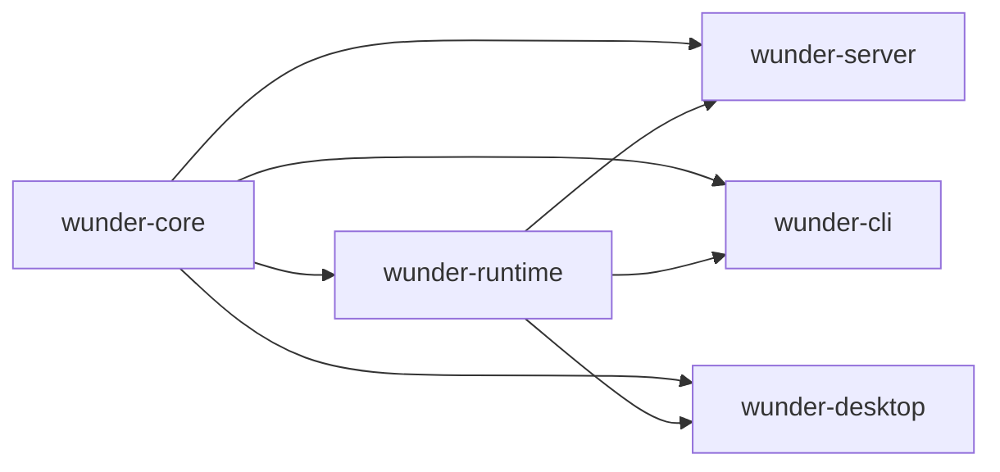

# 后端轻量化重构

## 1. 目标

这份方案不是把后端推倒重写，也不是把系统拆成很多互相等待的微服务，而是把当前的大单包整理成少数几个边界清晰、编译更轻、运行更稳的层。

核心目标只有四个：

- 稳定性更高
- 拓展性更好
- 运行速度更快
- 并发承载更强

## 2. 现状判断

当前后端的主要问题不是单点算法慢，而是结构本身太重，导致编译、联调和运行时都被放大。

### 2.1 编译面

- 根包同时承载 `wunder-server`、`wunder-cli`、`wunder-desktop`、`wunder-desktop-bridge`，还有多个模拟和测试目标。
- 根 `Cargo.toml` 的依赖面很宽，涵盖 HTTP/WS、数据库、图像、文档解析、桌面壳、加密、可观测性和运行时工具。
- 根包还挂着桌面相关 build script，哪怕是服务端构建，也会先经过这层包装。
- 大文件太多，最明显的是：
  - `crates/wunder-runtime/src/services/tools.rs` 约 1.3 万行
  - `crates/wunder-runtime/src/storage/sqlite.rs` 约 1.0 万行
  - `crates/wunder-runtime/src/storage/postgres.rs` 约 1.0 万行
  - `crates/wunder-runtime/src/api/admin.rs` 约 1.0 万行

### 2.2 运行面

- 大量阻塞 IO 通过 `spawn_blocking` 零散分布在 API、服务、编排、通道和工具层。
- 状态容器较多，既有全局缓存，也有会话级锁、任务队列、租约和心跳。
- 存储层是同步 trait，调用方再包一层异步桥接，容易把阻塞和回压治理拆散。
- 长链路任务很多，外部请求、文件处理、模型调用、队列持久化都需要统一的超时和取消策略。

### 2.3 扩展面

- `api`、`services`、`storage`、`orchestrator`、`channels` 都已经很大，但边界还不够硬。
- 很多新功能是沿着“调用方便”往现有大文件里塞，短期省事，长期会把重构成本继续放大。
- 当前结构适合把功能做出来，不适合把功能持续做快、做稳、做小。

## 3. 重构原则

1. 先按职责切边界，再按调用关系拆文件。
2. 核心语义要稳定，适配器可以快变。
3. 运行时路径要短，阻塞点要集中管理。
4. 并发控制要显式，不靠运气。
5. 只做少量高价值抽象，不堆新框架。
6. 大文件优先拆，超过 2000 行的文件只允许维护，不允许继续膨胀。

## 4. 推荐目标形态

### 4.1 `wunder-core`

放最稳定、最少依赖、最少变动的内容：

- 配置模型
- schema 与公共 DTO
- 鉴权、路径、token、i18n、校验、限制
- 存储抽象接口与基础记录类型
- 纯工具函数

这一层尽量不依赖 axum、tauri、数据库客户端和重型解析库。

### 4.2 `wunder-runtime`

放真正的后端执行能力：

- orchestrator
- services
- channels
- storage 实现
- background job
- tool 执行链
- 线程运行态、租约、回压、事件流

这一层可以重，但必须边界稳定。

### 4.3 `wunder-server`

只保留入口和协议层：

- axum router
- middleware
- bootstrap
- 静态资源挂载
- CORS、认证、语言、panic 保护

服务端不再直接背负整个桌面壳和 CLI 的编译成本。

### 4.4 `wunder-cli` / `wunder-desktop`

都只做薄适配层：

- CLI 负责命令解析和交互
- Desktop 负责窗口、更新、桥接
- 两者都依赖 runtime，而不是反向绑死 server

## 5. 分阶段路线

### 阶段 0：先量化，再动刀

先固定基线数据，避免重构变成主观感觉：

- `cargo check` / `cargo test` 的总耗时
- 首次启动耗时
- 典型接口 p95/p99 延迟
- 并发会话下的队列深度
- 存储写入等待时间
- `spawn_blocking` 的累计耗时

交付标准：

- 有一份可复用的基线记录
- 有一组不回退的回归指标

### 阶段 1：先拆包，再拆逻辑

这是最值得先做的一步，因为它直接影响编译速度。

建议动作：

- 把桌面 build script 和桌面专属依赖从根包移走
- 建立 workspace
- 把 `core`、`runtime`、`server`、`cli`、`desktop` 分成独立 crate
- 缩小各 crate 的依赖面
- 把 Tokio、Reqwest、图像和解析库按形态分配到真正需要它们的 crate

预期收益：

- 改 CLI 不再拖累桌面壳
- 改桌面壳不再拖累纯服务端
- 改协议层时不会反复刷新整个重依赖图

### 阶段 2：按领域拆大文件

优先拆这些大块：

- `src/services/tools.rs`
- `src/storage/mod.rs` 及 `sqlite.rs` / `postgres.rs`
- `src/api/admin.rs`
- `src/api/chat.rs`
- `src/api/user_tools.rs`
- `src/api/user_channels.rs`
- `src/orchestrator/memory.rs`
- `src/orchestrator/execute.rs`
- `src/services/llm.rs`
- `src/services/workspace.rs`
- `src/channels/service.rs`

拆分规则：

- 一个文件只保留一个主职责
- 共享类型抽到更稳定的层
- 新功能优先落新文件，不往旧巨文件里堆

### 阶段 3：把阻塞点收口

目标不是“把同步改成异步”这么粗糙，而是把阻塞行为集中在少数可控边界里。

建议动作：

- 建立统一的 blocking 执行入口
- 给文件 IO、DB IO、外部命令、文档解析、图片处理设定明确超时
- 对耗时任务加取消令牌
- 对外部调用加重试预算和失败退避
- 对高频读写路径加背压和限流

### 阶段 4：并发治理

重点不是多开线程，而是让高并发下的状态更可控。

建议动作：

- 会话、工具、通道、cron、outbox 都用有界队列
- 单资源写入路径尽量单写者化
- 全局缓存改为分域、分片或按 key 隔离
- 会话锁、租约、心跳、重放都做成显式状态机
- 长任务必须可恢复、可取消、可重试

### 阶段 5：回归与验收

每次切边界后都要补验收，不然只是把复杂度换个位置。

建议验收项：

- 单域改动不应触发全量重编
- 服务端改动不应拉起桌面打包链路
- 关键并发路径无未限制增长的队列
- 失败恢复后能回到一致状态
- 高并发下 p95 延迟和错误率可控

## 6. 关键设计点

### 6.1 存储层

存储层是最值得先收口的地方。

建议把当前巨大 trait 拆成按领域组合的接口，例如：

- user
- session
- chat
- cron
- channel
- gateway
- bridge
- world

这样做的好处是：

- 新领域只加一个子 trait，不污染整个存储面
- SQLite 和 Postgres 实现可以按领域并行演进
- 调用方更容易看清自己依赖了什么

### 6.2 工具与编排

工具和编排是后端最重的热路径之一，必须限制它们继续膨胀。

建议动作：

- 工具目录和执行目录分离
- 工具结果裁剪统一收口
- 模型调用、并行工具、子智能体、MCP 都走同一套超时与失败模型
- 工具执行不要直接在 API 层拼装大逻辑

### 6.3 实时链路

实时链路要优先保证“不断”和“可恢复”，不是追求最短代码。

建议动作：

- 事件队列有界
- 持久化与推送解耦
- 重放有水位
- WS 连接状态和业务状态分离
- 断线恢复时不要依赖一次性内存态

### 6.4 启动与恢复

启动阶段要少做事，恢复阶段要可重试。

建议动作：

- 把外部探测、工具 hydration、索引预热改成后台任务
- 启动路径只做最小必要初始化
- 失败时能降级，不要把整个进程拉死

## 7. 不建议做的事

- 不要把所有模块再包一层“公共工具层”
- 不要为了拆分而拆成几十个小 crate
- 不要把同步存储强行改成无边界的异步散弹
- 不要把网络、文件、数据库逻辑继续堆在 API 层
- 不要用新抽象掩盖旧耦合

## 8. 已落地

- 已建立 Cargo workspace，并将后端运行形态拆为 `wunder-core`、`wunder-runtime`、`wunder-server`、`wunder-cli`、`wunder-desktop` 五个独立 crate；根 `Cargo.toml` 已收敛为纯 workspace manifest，运行时源码迁入 `crates/wunder-runtime/src/`，库 crate 名保留 `wunder_server` 以降低迁移期 import 改动成本。
- 服务端入口已从根包迁移到 `crates/wunder-server/src/main.rs`，默认 `cargo check` 收敛为检查 `wunder-server` 及其 runtime/core 依赖，不再默认挂载 CLI 与 Tauri 桌面入口。
- CLI 与 Tauri 桌面端已迁入 `crates/wunder-cli` 与 `crates/wunder-desktop` 独立 crate，旧 `wunder-cli/` 与 `desktop/tauri/` 源码目录已移除；服务端、CLI、桌面入口都通过 `-p <crate>` 精确构建，服务端编译链路不再经过 CLI/Tauri 打包层。
- 根 `tests/*.rs` 集成测试已随 runtime 迁入 `crates/wunder-runtime/tests/`，仓库根 `tests/` 仅保留非 Rust 测试夹具与脚本；Docker 启动脚本、乱码扫描和 CLI e2e 构建脚本已同步新 crate 路径。
- 桌面 Tauri 资源已从整包 `config` 收窄为显式静态资源白名单，避免 build script 递归扫描 `config/data`、工作区运行数据和数据库文件导致编译变慢或本地权限错误。
- 已同步 Electron、Tauri、Win7、Docker、Nightly 与版本同步脚本中的新 crate 路径；Tauri 图标同步目标改为 `crates/wunder-desktop/icons/icon.ico`，CLI/Tauri 运行时仓库根解析改为从 `CARGO_MANIFEST_DIR` 向上查找真实 repo root，避免迁移后找不到 `config/`、`images/`、`scripts/` 等内置资源。
- 已将 CLI line-chat 冒烟测试迁入 `crates/wunder-cli/tests/line_chat_smoke.rs`，并将 CLI 命令分发改为 boxed future，降低 Windows debug 下交互/补全路径的大 future 栈压力；测试子进程增加超时保护，避免回归时挂死整轮验证。
- 本批已通过 `cargo metadata --no-deps --format-version 1`、`cargo check -j 8`、`cargo check -j 8 --workspace`、`cargo check -j 8 -p wunder-desktop --bin wunder-desktop-bridge`、`cargo check -j 8 -p wunder-runtime --tests`、`cargo test -j 8 -p wunder-cli --test line_chat_smoke` 与 `cargo test -j 8 -p wunder-runtime --lib apply_patch_tool`。
- `wunder-core` 已作为轻量稳定边界建立，并由 `wunder-runtime` 显式依赖与导出；现阶段只承载低依赖公共类型，遗留 `src/core` 内反向依赖较重的模块继续留在 runtime，后续在依赖清理后逐步迁移。
- 已将低依赖的仓库资源路径解析逻辑迁入 `wunder-core::repo_assets`，runtime 保留同名 re-export 兼容旧调用点，使 core 开始承载真实稳定基础能力。
- 已将 `src/storage/mod.rs` 拆成 `constants.rs`、`factory.rs`、`records.rs`、`backend.rs` 和薄门面，公共入口从约 1.8 千行收敛到 20 行；记录类型和 `StorageBackend` trait 分离后，后续 SQLite/Postgres 可按领域继续拆实现体。
- 已将定时任务工具从 `src/services/tools.rs` 和 `src/services/tools/dispatch.rs` 中抽离到 `src/services/tools/schedule_task_tool.rs`。
- 调度总表只保留工具分发职责，定时任务的参数归一、cron 调用和模型侧结果压缩收口到独立模块。
- 定时任务参数归一测试已随模块迁移，后续新增 cron 工具逻辑应继续落在该模块内。
- 已将计划面板与问询面板工具从 `src/services/tools.rs` 中抽离到 `src/services/tools/panel_tools.rs`。
- 面板类工具的状态归一、参数收敛与事件发射逻辑已经独立，调度总表只保留最薄的一层路由分派。
- 面板工具单测已随模块迁移，后续新增面板类交互应优先扩展该模块。
- 已将用户世界工具从 `src/services/tools.rs` 抽离到 `src/services/tools/user_world_tool.rs`，文件引用解析、暂存拷贝与消息发送逻辑不再堆在总入口。
- 已将网关节点调用工具从 `src/services/tools.rs` 抽离到 `src/services/tools/node_invoke_tool.rs`，节点列表、调用参数解析与错误收口由独立模块维护。
- `src/services/tools.rs` 已进一步从约 1.25 万行降至约 1.18 万行，调度入口继续保持薄分派，后续工具新增应优先落到独立模块。
- 已将 A2A 服务调用、观察、等待、任务快照与响应解析逻辑从 `src/services/tools.rs` 抽离到 `src/services/tools/a2a_tool.rs`。
- A2A 与 MCP 的工具名分流继续保留在调度前置路径，A2A 协议细节由独立模块维护，降低总入口对外部协议的耦合。
- `src/services/tools.rs` 已进一步降至约 1.10 万行，后续可继续拆分会话/蜂群、文件读写与命令执行等剩余大块。
- 已将技能调用工具执行逻辑从 `src/services/tools.rs` 收口到既有 `src/services/tools/skill_call.rs` 模块。
- 技能调用的用户根目录 fallback、owner alias 解析、SKILL.md 渲染与技能树构建已随模块迁移，调度入口只保留工具分派。
- 已将 LSP 查询、文件触碰、诊断汇总与操作名规范化逻辑从 `src/services/tools.rs` 抽离到 `src/services/tools/lsp_tool.rs`。
- `touch_lsp_file` 作为工具层公共辅助继续由根模块转导，保证写文件、文本编辑与补丁工具无需耦合 LSP 实现细节。
- `src/services/tools.rs` 已进一步降至约 1.04 万行，工具总入口继续向薄调度和公共辅助收敛。
- 已将知识库工具检索从 `src/services/tools.rs` 抽离到 `src/services/tools/knowledge_tool.rs`，普通知识库、RagFlow、vector 检索、fallback 检索与模型侧结果压缩由独立模块维护。
- 已将命令执行与 PTC Python 脚本运行链路抽离到 `src/services/tools/command_tool.rs`，流式输出、超时、输出裁剪、命令会话事件与错误收口不再堆在工具总入口。
- 已将文件列表、读取与写入链路抽离到 `src/services/tools/file_tool.rs`，分页、读取预算、二进制保护、LSP 触碰与原子写入由文件工具模块统一维护。
- `src/services/tools.rs` 已进一步降至约 7.6 千行，剩余重块主要集中在会话/蜂群调度，下一阶段应优先拆分该热路径并收口并发状态治理。
- 已将用户自定义工具、技能别名与 MCP 工具执行分发从 `src/services/tools.rs` 抽离到 `src/services/tools/user_tool_dispatch.rs`，总入口仅保留运行时名称识别和调度转发。
- 已将会话工具白名单、工具覆写、默认智能体别名解析、子会话工具继承策略与智能体访问判断抽离到 `src/services/tools/session_tool_access.rs`，并让 `swarm_tool_hint` 复用同一套访问控制逻辑，避免蜂群提示与会话执行策略漂移。
- 本批完成后 `src/services/tools.rs` 进一步收敛至约 7.1 千行；`cargo check -j 8 --lib`、`cargo check -j 8` 以及工具权限相关单测已通过，后续可继续拆分会话/蜂群调度主链路。
- 已将会话/蜂群工具参数结构抽离到 `src/services/tools/session_tool_args.rs`，`tools.rs` 不再直接承载大量 `serde` 入参定义和别名兼容规则。
- 已将会话/蜂群工具共用的状态归一化、线程策略解析、等待模式解析、时间/文本辅助与结果包装抽离到 `src/services/tools/session_tool_support.rs`，`subagent_control` 继续通过父模块 re-export 复用同一套辅助逻辑。
- 修复蜂群批量发送在 dispatch 失败项中丢失 `agent_name/session_id` 兼容字段的问题；失败项现在也保留目标元数据，便于前端和模型侧恢复上下文。
- 修复仿真实验中 compacted swarm wait preview 仅带 `run_ids` 与 `state=completed` 时无法推导 `all_finished` 的问题，并将依赖 LSP runtime 的蜂群模型继承单测改为 Tokio 测试。
- 本批完成后 `src/services/tools.rs` 收敛至约 6.3 千行；已通过 `cargo test -j 8 --lib session_spawn_args`、`cargo test -j 8 --lib agent_swarm`、`cargo test -j 8 --lib swarm` 与 `cargo check -j 8`。
- 已将蜂群母体认领、team run/task 记录构建、worker run 等待与快照收集抽离到 `src/services/tools/swarm_run_support.rs`，`tools.rs` 只保留蜂群主流程编排调用。
- `wait_for_swarm_runs` 迁移时移除了旧的注释型返回体构造分支，保留当前模型侧 `ok/action/state/data` 响应协议，减少维护噪音。
- 本批完成后 `src/services/tools.rs` 收敛至约 6.0 千行；已通过 `cargo test -j 8 --lib swarm` 与 `cargo check -j 8`。
- 已将子会话准备、会话 run 记录、专用运行 runtime、完成回写、父会话 announce 与会话清理抽离到 `src/services/tools/session_run_lifecycle.rs`，`tools.rs` 不再直接维护高并发子会话生命周期细节。
- 已将 `sessions_list/history/send/spawn` 四个会话工具入口抽离到 `src/services/tools/session_tool.rs`，入口层只负责参数解析、等待心跳和模型侧结果包装，运行细节继续复用 lifecycle 模块。
- 迁移过程中清理了旧的蜂群 send 注释返回体分支，并将测试样例中的业务化文本替换为通用占位，降低回归用例泄露场景意图的风险。
- 本批完成后 `src/services/tools.rs` 收敛至约 4.7 千行；已通过 `cargo check -j 8 --lib`、`cargo test -j 8 --lib session_spawn_args`、`cargo test -j 8 --lib agent_swarm`、`cargo test -j 8 --lib swarm`、`cargo test -j 8 --lib auto_wake`、`cargo test -j 8 --lib subagent_control` 与 `cargo check -j 8`。
- 已将 `agent_swarm` 的 list/status/send/batch_send/wait/history/spawn 主流程抽离到 `src/services/tools/agent_swarm_tool.rs`，蜂群工具入口不再占用总入口文件。
- 已将原 `tools.rs` 内联单元测试迁移到 `src/services/tools/tests.rs`，生产入口文件只保留模块 wiring、公共结果包装、沙盒入口与子智能体 legacy 兼容分发。
- 本批完成后 `src/services/tools.rs` 收敛至约 300 行，低于 2000 行维护阈值；已通过 `cargo check -j 8 --lib`、`cargo test -j 8 --lib agent_swarm`、`cargo test -j 8 --lib swarm`、`cargo test -j 8 --lib auto_wake`、`cargo test -j 8 --lib subagent_control`、`cargo test -j 8 --lib session_spawn_args` 与 `cargo check -j 8`。
- 已将 `subagent_control` 的目标解析、直接子会话/子 run 校验、相似 ID 修正、run/session 快照构造、级联目标收集与状态归一拆入 `src/services/tools/subagent_control/targeting.rs`，并将等待模式、批量调度结果合并、remaining 分支处理、进度事件和 dispatch summary 拆入 `src/services/tools/subagent_control/flow.rs`。
- 本批保留 `subagent_control` 的 list/history/send/batch_spawn/status/wait/interrupt/close/resume 外部行为、目标自动纠错、父线程 auto-wake 抑制、first_success 默认中断剩余分支、dispatch 事件与模型侧 `ok/action/state/summary/data` 回包语义不变；父 `subagent_control.rs` 降至约 1.6 千行，targeting 模块约 1.0 千行，flow 模块约 0.7 千行。
- 本批已通过 `cargo check -j 8`、`cargo test -j 8 -p wunder-runtime --lib subagent_control` 与 `cargo check -j 8 --workspace --exclude wunder-desktop`；测试阶段仅保留既有 `memory_auto_extract` 未使用 import 警告。
- 已将编排层工具结果载荷、模型观测压缩、截断、续读提示与对应单测从 `src/orchestrator/tool_exec.rs` 抽离到 `src/orchestrator/tool_result_payload.rs` 和 `src/orchestrator/tool_result_payload/tests.rs`。
- `src/orchestrator/tool_exec.rs` 收敛至约 1.4 千行，工具执行文件只保留执行编排、日志、路径修复和最终响应处理；工具观测压缩模块主体约 1.6 千行，测试约 1.2 千行，均低于 2000 行维护阈值。
- 迁移过程中补强 read_file 观测的二次预算收口，避免文件内容在数组 JSONL 化后被通用大对象包装降级为 preview，保持模型侧可继续基于内容与 `content_head` 续写。
- 本批已通过 `cargo test -j 8 --lib tool_result_payload`、`cargo test -j 8 --lib compact_observation_payload`、`cargo test -j 8 --lib truncate_tool_result` 与 `cargo check -j 8`。
- 已将用户工具 API 的知识库路由、RAGFlow/向量文档操作、上传转换、知识库 payload 与相关单测从 `src/api/user_tools.rs` 拆到 `src/api/user_tools/knowledge*.rs`，并将下载流与 MCP payload 辅助拆入独立小模块。
- `src/api/user_tools.rs` 收敛至约 1.9 千行，知识库主体约 1.9 千行，新增模块均低于 2000 行维护阈值；API 层不再把 MCP、技能、知识库、下载响应和 payload 转换全部堆在一个文件。
- 修复用户 MCP 运行配置仍继承旧 `allow_tools` 过滤的问题；普通用户 MCP 配置不再使用旧 allow list，packaged MCP 仍由当前工具规格显式设置可用工具集合。
- 本批已通过 `cargo test -j 8 --lib user_tools`、`cargo test -j 8 --lib user_knowledge_payload` 与 `cargo check -j 8`。
- 已将 `src/orchestrator/execute.rs` 的工具规划、预算、上下文恢复、终端事件与审批摘要等纯辅助逻辑拆入 `src/orchestrator/execute_support.rs`，并将对应单测迁到 `src/orchestrator/execute_support/tests.rs`。
- 已将工具并发执行、审批等待/恢复、active turn 清理、请求成功/失败收尾与 round usage 事件持久化拆入 `src/orchestrator/execute_tools.rs`，`execute.rs` 只保留主执行循环和模型轮次编排。
- `src/orchestrator/execute.rs` 收敛至 2000 行，`execute_support.rs` 约 1.4 千行，`execute_tools.rs` 约 0.7 千行，辅助测试约 0.8 千行，新增模块均不超过 2000 行维护阈值。
- 本批已通过 `cargo check -j 8 --lib`、`cargo test -j 8 --lib build_planned_tool_calls`、`cargo test -j 8 --lib tool_failure`、`cargo test -j 8 --lib workspace_changed_paths`、`cargo test -j 8 --lib uses_native_tool_api` 与 `cargo check -j 8`。

- 已将 SQLite/Postgres 的 cron 存储实现分别拆入 `src/storage/sqlite/cron.rs` 与 `src/storage/postgres/cron.rs`，父实现文件只保留 `StorageBackend` 薄转发，定时任务领取、续租、运行记录与 mapper 由独立领域模块维护。
- 本批保持 Postgres `FOR UPDATE SKIP LOCKED` 并发领取语义和 SQLite immediate transaction 领取语义不变；`src/storage/sqlite.rs` 与 `src/storage/postgres.rs` 各减少约 250 行以上，为后续继续按 session、channel、gateway、bridge 等领域拆分存储实现铺平边界。
- 本批已通过 `cargo check -j 8` 与 `cargo check -j 8 --workspace --exclude wunder-desktop`。
- 已将 SQLite/Postgres 的 `session_run` 与 `session_goal` 存储实现分别拆入 `src/storage/sqlite/session_run.rs`、`src/storage/sqlite/session_goal.rs`、`src/storage/postgres/session_run.rs`、`src/storage/postgres/session_goal.rs`，父实现文件继续收敛为 `StorageBackend` 薄转发。
- 本批保留会话运行记录 upsert/list 查询语义，以及目标 token/time 用量非负累计、批量目标查询和删除语义；`src/storage/sqlite.rs` 降至约 1.0 万行以下，`src/storage/postgres.rs` 降至约 9.8 千行，为后续继续拆 chat/world/channel 等领域降低单文件编译和协同维护压力。
- 本批已通过 `cargo check -j 8`、`cargo check -j 8 --workspace --exclude wunder-desktop`、`cargo test -j 8 -p wunder-runtime --lib session_run` 与 `cargo test -j 8 -p wunder-runtime --lib session_goal`；其中 `session_goal` 当前无匹配用例，仅验证库测试入口可运行。
- 已将 SQLite/Postgres 的 `chat_session` 存储实现分别拆入 `src/storage/sqlite/chat_session.rs` 与 `src/storage/postgres/chat_session.rs`，并将会话行映射、状态归一、筛选条件拼接、标题/触达/删除等细节收口到领域模块。
- 本批保持空 `tool_overrides` 存储为 NULL、会话状态转小写并默认 active、删除会话时同步清理 session goal 的既有语义不变；父存储文件继续下降到 SQLite 约 9.7 千行、Postgres 约 9.6 千行。
- 本批已通过 `cargo check -j 8`、`cargo check -j 8 --workspace --exclude wunder-desktop` 与 `cargo test -j 8 -p wunder-runtime --lib chat_session`；其中 `chat_session` 当前无匹配用例，仅验证库测试入口可运行。
- 已将 SQLite/Postgres 的 channel directory 存储实现拆入 `src/storage/sqlite/channel_directory.rs` 与 `src/storage/postgres/channel_directory.rs`，覆盖渠道账号、渠道绑定、渠道用户绑定三组低风险目录型接口，父实现继续只保留 `StorageBackend` 转发。
- 本批保持 channel account config JSON 解析、binding `tool_overrides` 空值存储、用户绑定分页/总数统计和 Postgres 参数顺序语义不变；消息、会话、outbox 等热路径留到后续独立拆分。
- 本批已通过 `cargo check -j 8`、`cargo check -j 8 --workspace --exclude wunder-desktop` 与 `cargo test -j 8 -p wunder-runtime --lib channel`，其中 channel 过滤测试通过 147 个用例。
- 已将 SQLite/Postgres 的 channel runtime 存储实现拆入 `src/storage/sqlite/channel_runtime.rs` 与 `src/storage/postgres/channel_runtime.rs`，覆盖渠道会话、消息、统计、清理和 outbox 投递热路径，父实现继续保持 `StorageBackend` 薄转发。
- 本批保持 SQLite `thread_id IS ? OR thread_id = ?` 空值匹配、Postgres `IS NOT DISTINCT FROM` 语义、pending/retry outbox 查询水位、统计 SQL 与 limit clamp 不变；渠道目录与运行时读写边界已经分离，后续可继续拆 bridge/gateway 等存储域。
- 本批已通过 `cargo check -j 8`、`cargo check -j 8 --workspace --exclude wunder-desktop` 与 `cargo test -j 8 -p wunder-runtime --lib channel`，其中 channel 过滤测试通过 147 个用例；测试阶段仅保留既有 `memory_auto_extract` 未使用 import 警告。
- 已将 SQLite/Postgres 的 bridge 存储实现拆入 `src/storage/sqlite/bridge_store.rs` 与 `src/storage/postgres/bridge_store.rs`，覆盖桥接中心、中心账号、用户路由、投递日志与路由审计日志，父实现继续保持 `StorageBackend` 薄转发。
- 本批保持 SQLite `LIKE` 与 Postgres `ILIKE` 的既有搜索差异、分页上限、空参数短路、JSON fallback 和按中心账号清理审计日志的子查询语义不变；同时把重复行映射收口到模块内 mapper，降低后续字段调整的同步成本。
- 本批已通过 `cargo check -j 8`、`cargo check -j 8 --workspace --exclude wunder-desktop` 与 `cargo test -j 8 -p wunder-runtime --lib bridge`，其中 bridge 过滤测试通过 7 个用例；测试阶段仅保留既有 `memory_auto_extract` 未使用 import 警告。
- 已将 SQLite/Postgres 的 gateway 存储实现拆入 `src/storage/sqlite/gateway_store.rs` 与 `src/storage/postgres/gateway_store.rs`，覆盖网关客户端、节点与节点 token 读写，父实现继续保持 `StorageBackend` 薄转发。
- 本批保持 scopes/caps/commands 空数组存 NULL、JSON 字段解析 fallback、状态筛选、节点 token 双条件筛选与排序语义不变；网关行映射收口到模块内 mapper，后续 gateway 维护不再触碰存储父实现大文件。
- 本批已通过 `cargo check -j 8`、`cargo check -j 8 --workspace --exclude wunder-desktop` 与 `cargo test -j 8 -p wunder-runtime --lib gateway`；测试阶段仅保留既有 `memory_auto_extract` 未使用 import 警告。
- 已将 SQLite/Postgres 的 media/speech 存储实现拆入 `src/storage/sqlite/media_store.rs` 与 `src/storage/postgres/media_store.rs`，覆盖媒体资产 upsert/query 与语音任务 upsert/pending 领取查询，父实现继续保持 `StorageBackend` 薄转发。
- 本批保持媒体资产更新不覆盖 `created_at`、空 asset/hash 查询短路、语音任务 queued/retry 与 `next_retry_at <= now` 筛选、limit 默认 50/上限 200 和 metadata JSON fallback 语义不变；同时补齐聊天媒体上传文件名归一化，确保空白折叠为 `_` 并保留扩展名小写。
- 本批已通过 `cargo check -j 8`、`cargo check -j 8 --workspace --exclude wunder-desktop`、`cargo test -j 8 -p wunder-runtime --lib media` 与 `cargo test -j 8 -p wunder-runtime --lib speech`；其中 media 过滤测试通过 16 个用例，speech 当前无匹配用例，仅验证库测试入口可运行；测试阶段仅保留既有 `memory_auto_extract` 未使用 import 警告。
- 已将 SQLite/Postgres 的 user_world/beeroom 存储实现拆入 `src/storage/sqlite/user_world_store.rs` 与 `src/storage/postgres/user_world_store.rs`，覆盖用户世界会话、成员、消息、事件、群组公告与蜂房聊天消息读写，父实现继续保持 `StorageBackend` 薄转发。
- 本批同步把 user_world/beeroom 的成员去重、直聊参与者排序、JSON 事件解析与行映射 helper 下沉到领域模块；父存储文件不再承载用户世界字段映射细节，后续会话/群组字段调整只需触碰对应存储子模块。
- 本批已通过 `cargo check -j 8`、`cargo check -j 8 --workspace --exclude wunder-desktop`、`cargo test -j 8 -p wunder-runtime --lib user_world` 与 `cargo test -j 8 -p wunder-runtime --lib beeroom`；其中 user_world 过滤测试通过 4 个用例，beeroom 过滤测试通过 29 个用例；测试阶段仅保留既有 `memory_auto_extract` 未使用 import 警告。
- 已将 SQLite/Postgres 的 memory 存储实现拆入 `src/storage/sqlite/memory_store.rs` 与 `src/storage/postgres/memory_store.rs`，覆盖记忆开关、历史摘要记录、任务日志、长期记忆 fragment、embedding、hit 去重和 memory job 读写，父实现继续保持 `StorageBackend` 薄转发。
- 本批保持记忆记录容量裁剪、任务日志按用户/会话覆盖、fragment upsert、embedding 缓存替换、命中去重统计和 Postgres/SQLite 各自 JSON fallback 语义不变；memory 相关读写集中到领域模块后，编排与记忆服务后续字段演进无需继续修改存储父文件。
- 本批已通过 `cargo check -j 8`、`cargo check -j 8 --workspace --exclude wunder-desktop` 与 `cargo test -j 8 -p wunder-runtime --lib memory`；其中 memory 过滤测试通过 96 个用例、1 个 legacy 用例保持忽略；测试阶段仅保留既有 `memory_auto_extract` 未使用 import 警告。
- 已将 SQLite/Postgres 的 benchmark 存储实现拆入 `src/storage/sqlite/benchmark_store.rs` 与 `src/storage/postgres/benchmark_store.rs`，覆盖能力评估 run、attempt 与任务聚合读写，父实现继续保持 `StorageBackend` 薄转发。
- 本批保持 benchmark run upsert、attempt upsert、任务聚合 upsert、分页加载、详情加载与级联删除语义不变；全局 `cleanup_retention` 仍保留在父实现，避免把跨领域保留策略误塞进 benchmark 模块。
- 同步收紧 `WorkspaceManager::resolve_path` 对 `/workspaces/<scope>/...` 公共路径的边界校验，跨 scope 路径现在会返回路径越界，benchmark 工作区测试改为使用规范化路径比较以兼容 Windows verbatim 路径。
- 本批已通过 `cargo test -j 8 -p wunder-runtime --lib benchmark`、`cargo check -j 8` 与 `cargo check -j 8 --workspace --exclude wunder-desktop`；测试阶段仅保留既有 `memory_auto_extract` 未使用 import 警告。
- 已将 SQLite/Postgres 的 agent runtime 存储实现拆入 `src/storage/sqlite/agent_runtime_store.rs` 与 `src/storage/postgres/agent_runtime_store.rs`，覆盖 agent thread、agent task 队列和 session stream event 读写，父实现继续保持 `StorageBackend` 薄转发。
- 本批保持任务 pending/retry 查询水位、队列前置计数、按线程状态筛选、状态更新时间字段、stream event 单 session 递增读取、recent 倒序后恢复正序和按用户/session 清理语义不变；运行态任务与事件流的存储细节不再占用父文件。
- 本批补充 SQLite agent runtime 存储回归测试，覆盖线程 upsert/get、任务排队排序、ahead 计数、状态更新与按线程状态查询；父存储文件继续下降到 SQLite 约 5.9 千行、Postgres 约 6.1 千行。
- 本批已通过 `cargo check -j 8`、`cargo test -j 8 -p wunder-runtime --lib stream_event`、`cargo test -j 8 -p wunder-runtime --lib agent_runtime_task_queue_roundtrip_preserves_order_and_status` 与 `cargo check -j 8 --workspace --exclude wunder-desktop`；测试阶段仅保留既有 `memory_auto_extract` 未使用 import 警告。
- 已将 SQLite/Postgres 的 user account 存储实现拆入 `src/storage/sqlite/user_account_store.rs` 与 `src/storage/postgres/user_account_store.rs`，覆盖用户账号、组织单位、外部链接、用户 token 与 session scope 读写，父实现继续保持 `StorageBackend` 薄转发。
- 本批保持账号角色/单位/额度字段映射、批量账号 upsert、用户名/邮箱查询、账号列表 keyword+unit 过滤、经验值非负累计、外链 enabled 过滤、token 触达时间更新与 session scope upsert 语义不变。
- 本批补充 SQLite user account 存储回归测试，覆盖组织单位、账号批量 upsert、用户名/邮箱查询、单位过滤、外链启停、token touch 与 session scope roundtrip；父存储文件继续下降到 SQLite 约 5.4 千行、Postgres 约 5.5 千行。
- 本批已通过 `cargo test -j 8 -p wunder-runtime --lib token_balance`、`cargo test -j 8 -p wunder-runtime --lib user_account_directory_token_and_scope_roundtrip`、`cargo check -j 8` 与 `cargo check -j 8 --workspace --exclude wunder-desktop`；测试阶段仅保留既有 `memory_auto_extract` 未使用 import 警告。
- 已将 SQLite/Postgres 的 agent directory 存储实现拆入 `src/storage/sqlite/agent_directory_store.rs` 与 `src/storage/postgres/agent_directory_store.rs`，覆盖用户工具/智能体访问控制、用户智能体目录、蜂巢、team run 与 team task 读写，父实现继续保持 `StorageBackend` 薄转发。
- 本批保持访问控制空值删除、智能体列表排序、共享智能体过滤、默认蜂巢删除保护、团队运行状态筛选和任务读写语义不变；同时修正 SQLite `list_team_runs` 的 LIMIT/OFFSET 参数顺序，避免分页查询返回空页。
- 本批补充 SQLite agent directory 存储回归测试，覆盖工具/智能体访问控制、智能体 upsert/list/shared、蜂巢迁移/默认保护、team run/task upsert/list/status/delete；父存储文件继续下降到 SQLite 约 4.5 千行、Postgres 约 4.6 千行。
- 本批已通过 `cargo check -j 8`、`cargo test -j 8 -p wunder-runtime --lib agent_directory_hive_and_team_roundtrip`、`cargo test -j 8 -p wunder-runtime --lib user_agent`、`cargo test -j 8 -p wunder-runtime --lib hive`、`cargo test -j 8 -p wunder-runtime --lib team_run` 与 `cargo check -j 8 --workspace --exclude wunder-desktop`；测试阶段仅保留既有 `memory_auto_extract` 未使用 import 警告。
- 已将 SQLite/Postgres 的 vector document 存储实现拆入 `src/storage/sqlite/vector_document_store.rs` 与 `src/storage/postgres/vector_document_store.rs`，覆盖向量文档 upsert、详情读取、摘要列表和删除逻辑，父实现继续保持 `StorageBackend` 薄转发。
- 本批保持文档 upsert 覆盖字段、按 owner/base/doc 三元组读取与删除、摘要按更新时间倒序和按知识库清理语义不变；向量知识库服务后续字段调整不再需要触碰存储父文件。
- 本批补充 SQLite vector document 存储回归测试，覆盖 upsert 更新、摘要倒序、单条删除与按 base 清理；父存储文件继续下降到 SQLite 约 4.4 千行、Postgres 约 4.6 千行。
- 本批已通过 `cargo check -j 8`、`cargo test -j 8 -p wunder-runtime --lib vector_document_roundtrip_orders_and_deletes`、`cargo test -j 8 -p wunder-runtime --lib vector` 与 `cargo check -j 8 --workspace --exclude wunder-desktop`；测试阶段仅保留既有 `memory_auto_extract` 未使用 import 警告。
- 已将 SQLite/Postgres 的 token balance 存储实现拆入 `src/storage/sqlite/token_balance_store.rs` 与 `src/storage/postgres/token_balance_store.rs`，覆盖用户 token 每日准备、消费扣减与后台赠送事务，父实现继续保持 `StorageBackend` 薄转发。
- 本批保持 SQLite immediate transaction 与 Postgres `FOR UPDATE` 行锁语义、每日赠送只入账一次、消费超额统计、赠送额度累计和空用户/日期短路语义不变；额度并发敏感逻辑不再占用存储父文件。
- 本批沿用并验证 SQLite token balance 回归测试，覆盖每日准备、消费超额与赠送累计；父存储文件继续下降到 SQLite 约 4.2 千行、Postgres 约 4.4 千行。
- 本批已通过 `cargo check -j 8`、`cargo test -j 8 -p wunder-runtime --lib token_balance`、`cargo test -j 8 -p wunder-runtime --lib consume_user_tokens_deducts_usage_and_reports_overspend`、`cargo test -j 8 -p wunder-runtime --lib grant_user_tokens_updates_balance_and_granted_total` 与 `cargo check -j 8 --workspace --exclude wunder-desktop`；测试阶段仅保留既有 `memory_auto_extract` 未使用 import 警告。
- 已将 SQLite/Postgres 的 session lock 存储实现拆入 `src/storage/sqlite/session_lock_store.rs` 与 `src/storage/postgres/session_lock_store.rs`，覆盖会话锁获取、续约、释放、按用户清理、计数和列表读取，父实现继续保持 `StorageBackend` 薄转发。
- 本批保持 SQLite immediate transaction 加 busy/locked 降级、Postgres `ON CONFLICT DO NOTHING`、过期锁清理、全局 max sessions 上限和重复 session 返回 `UserBusy` 的既有语义不变；会话并发承载治理逻辑从父文件中独立出来。
- 本批补充 SQLite session lock 回归测试，覆盖首次获取、重复获取、续约、按用户列出、max sessions 上限、释放与按用户清理；父存储文件继续下降到 SQLite 约 4.0 千行、Postgres 约 4.3 千行。
- 本批已通过 `cargo check -j 8`、`cargo test -j 8 -p wunder-runtime --lib session_lock_roundtrip_enforces_duplicate_and_limit`、`cargo test -j 8 -p wunder-runtime --lib session_lock`、`cargo test -j 8 -p wunder-runtime --lib limiter` 与 `cargo check -j 8 --workspace --exclude wunder-desktop`；测试阶段仅保留既有 `memory_auto_extract` 未使用 import 警告。
- 已将 SQLite/Postgres 的 conversation log 存储实现拆入 `src/storage/sqlite/conversation_log_store.rs` 与 `src/storage/postgres/conversation_log_store.rs`，覆盖聊天写入、模型上下文追加/替换/加载、工具日志、artifact 日志、聊天历史分页和线程 system prompt 读取，父实现继续保持 `StorageBackend` 薄转发。
- 本批保持聊天 payload 质量标注、模型上下文 limit 倒序后恢复正序、历史分页 `_history_id` 注入、artifact id 注入和多语言 system prompt 选择语义不变；统计、monitor 与 retention 继续保留父文件，避免跨域混入热路径模块。
- 本批复用 SQLite 模型上下文回归测试，覆盖 append/replace 顺序；父存储文件继续下降到 SQLite 约 3.7 千行、Postgres 约 4.0 千行。
- 本批已通过 `cargo check -j 8`、`cargo test -j 8 -p wunder-runtime --lib model_context_entries_append_and_replace_in_order`、`cargo test -j 8 -p wunder-runtime --lib system_prompt`、`cargo test -j 8 -p wunder-runtime --lib memory_auto_extract` 与 `cargo check -j 8 --workspace --exclude wunder-desktop`；测试阶段仅保留既有 `memory_auto_extract` 未使用 import 警告。
- 已将 SQLite/Postgres 的 monitor 存储实现拆入 `src/storage/sqlite/monitor_store.rs` 与 `src/storage/postgres/monitor_store.rs`，覆盖运行监控记录 upsert、详情读取、全量/最近加载、按用户状态与时间筛选、单条删除和按用户清理，父实现继续保持 `StorageBackend` 薄转发。
- 本批保持 monitor payload 原样持久化、`updated_time` 倒序、用户/status/since SQL 筛选和空参数短路语义不变；运行状态恢复与监控查询后续可以在独立模块内优化。
- 本批补充 SQLite monitor 存储回归测试，覆盖 upsert/get、recent 排序、按用户状态/since 过滤、单条删除与按用户清理；父存储文件继续下降到 SQLite 约 3.6 千行、Postgres 约 3.8 千行。
- 本批已通过 `cargo check -j 8`、`cargo test -j 8 -p wunder-runtime --lib monitor_store_filters_orders_and_deletes`、`cargo test -j 8 -p wunder-runtime --lib monitor` 与 `cargo check -j 8 --workspace --exclude wunder-desktop`；测试阶段仅保留既有 `memory_auto_extract` 未使用 import 警告。
- 已将 SQLite/Postgres 的 log stats 存储实现拆入 `src/storage/sqlite/log_stats_store.rs` 与 `src/storage/postgres/log_stats_store.rs`，覆盖用户聊天统计、用户工具统计、工具调用聚合、工具会话用量、日志占用估算以及聊天/工具/artifact 日志清理，父实现继续保持 `StorageBackend` 薄转发。
- 本批保持内部工具与 skill read 日志过滤、空工具/空 session 短路、删除聊天历史时同步清理 `model_context_entries`、SQLite `dbstat` 优先估算与 Postgres relation size 估算语义不变；统计与清理不再占用父存储文件。
- 本批补充 SQLite log stats 存储回归测试，覆盖聊天/工具统计、内部工具过滤、skill read 过滤、工具会话聚合、日志占用非零和按用户/session 删除；父存储文件继续下降到 SQLite 约 3.3 千行、Postgres 约 3.6 千行。
- 已将 SQLite/Postgres 的 meta 与 retention 存储实现拆入 `src/storage/sqlite/meta_store.rs`、`src/storage/postgres/meta_store.rs`、`src/storage/sqlite/retention_store.rs` 与 `src/storage/postgres/retention_store.rs`，覆盖 meta 键值读写/前缀列表/前缀删除和跨表保留策略清理，父实现继续保持 `StorageBackend` 薄转发。
- 本批保持 meta 前缀空值短路、按 `updated_time DESC, key ASC` 列表排序、retention 管理员账号豁免、monitor 空用户兼容和跨表删除结果统计语义不变；跨域保留策略作为独立模块维护，不再混入任一业务存储域。
- 本批补充 SQLite meta 与 retention 回归测试；父存储文件继续下降到 SQLite 约 3.2 千行、Postgres 约 3.5 千行。
- 本批已通过 `cargo check -j 8`、`cargo test -j 8 -p wunder-runtime --lib log_stats_store_counts_filters_usage_and_deletes`、`cargo test -j 8 -p wunder-runtime --lib meta_store_lists_updates_and_deletes_by_prefix`、`cargo test -j 8 -p wunder-runtime --lib cleanup_retention_removes_expired_model_context_entries` 与 `cargo check -j 8 --workspace --exclude wunder-desktop`；测试阶段仅保留既有 `memory_auto_extract` 未使用 import 警告。
- 已将 SQLite/Postgres 的 schema 初始化与迁移 helper 拆入 `src/storage/sqlite/schema.rs` 与 `src/storage/postgres/schema.rs`，覆盖建表、补列、索引、monitor 默认值、Postgres 性能索引和初始化重试流程，父实现只保留 `ensure_initialized` 薄转发。
- 本批保持 SQLite WAL/busy timeout 打开方式、legacy daily quota 到 token 字段迁移、Postgres 初始化 5 次重试、`CREATE INDEX CONCURRENTLY` fallback 与各表补列语义不变；初始化/迁移和业务读写彻底分离。
- 本批完成后 `src/storage/sqlite.rs` 降至约 1.8 千行，`src/storage/postgres.rs` 降至约 1.7 千行，两个父存储文件均低于 2000 行维护阈值；后续新增存储能力应继续落在对应领域子模块或 schema 模块。
- 本批已通过 `cargo check -j 8`、`cargo test -j 8 -p wunder-runtime --lib legacy_daily_quota_rows_migrate_to_token_account_fields`、`cargo test -j 8 -p wunder-runtime --lib meta_store_lists_updates_and_deletes_by_prefix`、`cargo test -j 8 -p wunder-runtime --lib cleanup_retention_removes_expired_model_context_entries` 与 `cargo check -j 8 --workspace --exclude wunder-desktop`；测试阶段仅保留既有 `memory_auto_extract` 未使用 import 警告。
- 已将 SQLite/Postgres 的 `StorageBackend` 薄转发实现分别拆入 `src/storage/sqlite/backend_impl.rs` 与 `src/storage/postgres/backend_impl.rs`，父 `sqlite.rs`/`postgres.rs` 只保留连接、初始化状态、公共解析 helper、模块声明和本地测试。
- 本批不改变任何 SQL、事务、并发领取或返回结构，只移动 trait impl 转发位置；`src/storage/sqlite.rs` 降至约 0.55 千行，`src/storage/postgres.rs` 降至约 0.46 千行，存储父文件不再因为新增接口持续膨胀。
- 本批已通过 `cargo check -j 8` 与 `cargo check -j 8 --workspace --exclude wunder-desktop`，未留下新增 warning。
- 已将管理端 gateway 路由和 handler 从 `src/api/admin.rs` 拆入 `src/api/admin/gateway_admin.rs`，覆盖 gateway status、presence、clients、nodes、node_tokens 和 invoke 接口；主 `admin.rs` 通过 `gateway_admin::router()` merge 子路由，外部路径保持不变。
- 本批保持 gateway 节点自动创建、token 生成、状态筛选、节点调用超时参数和 payload 输出结构不变；API 主文件减少约 350 行，后续可继续按 channel、monitor、knowledge、user account 等领域拆分。
- 本批已通过 `cargo check -j 8` 与 `cargo check -j 8 --workspace --exclude wunder-desktop`。
- 已将管理端 channel 路由和 handler 从 `src/api/admin.rs` 拆入 `src/api/admin/channel_admin.rs`，覆盖渠道账号、批量账号、账号删除影响、渠道绑定、用户绑定、会话、消息、运行日志和探测接口；主 `admin.rs` 通过 `channel_admin::router()` merge 子路由，外部路径保持不变。
- 本批保持渠道账号配置解析、默认智能体解析、绑定 tool overrides、用户绑定分页、会话监控补全、消息查询和通道探测返回结构不变；API 主文件继续减少约 1300 行，后续优先拆 monitor/throughput 与知识库等剩余大块。
- 本批已通过 `cargo check -j 8` 与 `cargo check -j 8 --workspace --exclude wunder-desktop`。
- 已将管理端 monitor、throughput 与 performance sample 路由和 handler 从 `src/api/admin.rs` 拆入 `src/api/admin/monitor_admin.rs`，覆盖监控总览、工具会话用量、会话详情、取消、强制压缩、删除、吞吐压测启动/停止/状态/报告和性能采样接口；主 `admin.rs` 通过 `monitor_admin::router()` merge 子路由，外部路径保持不变。
- 本批保持监控历史 warm、时间范围交换、工具名归一化、内置工具 alias 合并、会话 agent 名称补全、压测冲突处理和性能采样错误映射语义不变；`admin.rs` 继续减少约 800 行，监控与压测相关改动后续不再触碰管理端主文件。
- 本批已通过 `cargo check -j 8` 与 `cargo check -j 8 --workspace --exclude wunder-desktop`，未留下新增 warning。
- 已将管理端 knowledge 路由、handler、上传转换、向量/RAGFlow 文档管理、检索测试 SSE 流和知识库配置清理 helper 从 `src/api/admin.rs` 拆入 `src/api/admin/knowledge_admin.rs`；主 `admin.rs` 通过 `knowledge_admin::router()` merge 子路由，外部路径保持不变。
- 本批保持知识库类型归一化、RAGFlow 托管数据集清理、literal 根目录安全删除、向量文档锁、chunk 更新/嵌入/删除、上传临时目录清理、Markdown 转换大小限制和测试流事件结构不变；`admin.rs` 降至约 5.8 千行，知识库重依赖编译脏区已经从管理端主文件剥离。
- 本批已通过 `cargo check -j 8` 与 `cargo check -j 8 --workspace --exclude wunder-desktop`，未留下新增 warning。
- 已将管理端 identity 路由和 handler 从 `src/api/admin.rs` 拆入 `src/api/admin/identity_admin.rs`，覆盖组织单元、外部链接、用户账号、测试用户种子/清理、用户访问授权、用户会话查询、用户删除与吞吐测试用户清理接口；主 `admin.rs` 通过 `identity_admin::router()` merge 子路由，外部路径保持不变。
- 本批保持管理员/单位负责人权限范围、组织树迁移与循环校验、外链图标归一化、用户 token 调整、强制登出、登录 token 签发、工具/智能体访问控制、测试用户清理和吞吐用户清理语义不变；`admin.rs` 降至约 3.7 千行，管理端用户/组织重变更区已经独立。
- 本批已通过 `cargo check -j 8` 与 `cargo check -j 8 --workspace --exclude wunder-desktop`，未留下新增 warning。
- 已将管理端 preset agent、agent avatar 与 companion 路由和 handler 从 `src/api/admin.rs` 拆入 `src/api/admin/resource_admin.rs`，覆盖预设智能体列表/保存/worker card/同步、头像资源扫描、全局伴侣导入/更新/导出/删除和 spritesheet 响应接口；主 `admin.rs` 通过 `resource_admin::router()` merge 子路由，外部路径保持不变。
- 本批保持预设 worker card 持久化策略、默认智能体模板同步、单位范围同步约束、头像排序、伴侣包 hash、zip 导出响应头和上传大小限制语义不变；`admin.rs` 降至约 3.0 千行，资源型管理接口已经独立。
- 本批已通过 `cargo check -j 8` 与 `cargo check -j 8 --workspace --exclude wunder-desktop`，未留下新增 warning。
- 已将管理端 MCP、LSP、A2A、skills 与 tools 路由和 handler 从 `src/api/admin.rs` 拆入 `src/api/admin/integration_admin.rs`，覆盖外部工具接入、LSP 测试、技能扫描/编辑/导入导出和内置工具开关配置；主 `admin.rs` 通过 `integration_admin::router()` merge 子路由，外部路径保持不变。
- 本批将技能文件系统仍需复用的技能解析 helper 通过父 `admin.rs` 轻量 re-export，错误响应、测试用户常量和权限 helper 保留在父模块作为跨 admin 子模块公共面；`admin.rs` 降至约 1.1 千行，低于 2000 行维护阈值。
- 本批已通过 `cargo check -j 8` 与 `cargo check -j 8 --workspace --exclude wunder-desktop`，未留下新增 warning。
- 已将管理端文件型知识库路由、Markdown 文件读写、上传转换、literal 刷新和向量/RAGFlow 上传入口从 `src/api/admin/knowledge_admin.rs` 拆入 `src/api/admin/knowledge_admin/file_admin.rs`；父 `knowledge_admin.rs` 通过 `file_admin::router()` merge 子路由，外部路径保持不变。
- 本批保留知识库根路径越界校验、Markdown-only 限制、上传大小限制、转换结果非空校验、literal cache refresh、向量文档覆盖重建和 RagFlow 上传响应结构不变；`knowledge_admin.rs` 降至约 1.6 千行，`file_admin.rs` 约 0.6 千行，均低于 2000 行维护阈值。
- 本批已通过 `cargo check -j 8` 与 `cargo check -j 8 --workspace --exclude wunder-desktop`，未留下新增 warning。
- 已将管理端测试账号 seed/cleanup 与吞吐测试用户清理从 `src/api/admin/identity_admin.rs` 拆入 `src/api/admin/identity_admin/test_accounts.rs`；父 `identity_admin.rs` 通过 `test_accounts::router()` merge 子路由，外部路径保持不变。
- 本批保留单位负责人 scope 过滤、测试账号序号续增、默认密码、批量删除会话/工作区/工具目录清理和吞吐用户前缀识别语义不变；`identity_admin.rs` 降至约 1.7 千行，`test_accounts.rs` 约 0.4 千行，均低于 2000 行维护阈值。
- 本批已通过 `cargo check -j 8` 与 `cargo check -j 8 --workspace --exclude wunder-desktop`，未留下新增 warning。
- 已将聊天 API 的会话事件查询、命令会话查询和 workflow round 聚合 helper 从 `src/api/chat.rs` 拆入 `src/api/chat/events.rs`；父 `chat.rs` 通过 `events::router()` merge 子路由，外部路径保持不变。
- 本批保留 stream event 分批读取、monitor fallback、running 状态合并、goal/runtime payload、错误事件去重和 stream wrapper 展开语义不变；`chat.rs` 从约 4.3 千行降至约 3.6 千行。同步将图片附件有效 PNG 测试夹具改为运行时生成，避免硬编码 base64 与当前解码器不兼容导致误报。
- 本批已通过 `cargo check -j 8`、`cargo test -j 8 -p wunder-runtime --lib chat` 与 `cargo check -j 8 --workspace --exclude wunder-desktop`；测试阶段仅保留既有 `memory_auto_extract` 未使用 import 警告。
- 已将聊天 API 的附件转换、媒体重处理 multipart 解析和 TTS 响应从 `src/api/chat.rs` 拆入 `src/api/chat/media.rs`；父 `chat.rs` 通过 `media::router()` merge 子路由，外部路径保持不变。
- 本批保留附件上传大小限制、媒体上传/源路径二次处理、帧率/帧步长字段兼容、TTS 输入长度限制和 no-store 响应头语义不变；多媒体依赖不再挂在聊天主路由文件，`chat.rs` 进一步降至约 3.4 千行。
- 本批已通过 `cargo check -j 8`、`cargo test -j 8 -p wunder-runtime --lib chat` 与 `cargo check -j 8 --workspace --exclude wunder-desktop`；测试阶段仅保留既有 `memory_auto_extract` 未使用 import 警告。
- 已将聊天 API 的系统提示词预览、会话冻结提示词预览、工具预览 payload 与记忆预览解析 helper 从 `src/api/chat.rs` 拆入 `src/api/chat/prompt.rs`；父 `chat.rs` 通过 `prompt::router()` merge 子路由，外部路径保持不变。
- 本批保留待注入/已冻结提示词预览、显式工具覆盖优先级、workdir 快照校验、LLM 实际请求 payload 构造和记忆计数语义不变；`chat.rs` 降至约 2.9 千行，提示词预览依赖不再挂在聊天主路由文件。
- 本批已通过 `cargo check -j 8`、`cargo test -j 8 -p wunder-runtime --lib chat` 与 `cargo check -j 8 --workspace --exclude wunder-desktop`；测试阶段仅保留既有 `memory_auto_extract` 未使用 import 警告。
- 已将聊天 API 的会话创建/列表/详情、历史分页、消息反馈、标题更新、归档/恢复/删除、会话 payload/runtime 字段和队列投影 helper 从 `src/api/chat.rs` 拆入 `src/api/chat/sessions.rs`；父 `chat.rs` 通过 `sessions::router()` merge 子路由，外部路径保持不变。
- 本批保留会话主线程标记、归档 fallback 主线程重绑、历史分页 `_history_id`、反馈锁定、编排锁保护、队列中消息投影、运行态补齐和上下文 token/runtime 字段语义不变；`chat.rs` 降至约 1.2 千行，`sessions.rs` 约 1.7 千行，均低于 2000 行维护阈值。
- 本批已通过 `cargo check -j 8`、`cargo test -j 8 -p wunder-runtime --lib chat` 与 `cargo check -j 8 --workspace --exclude wunder-desktop`；测试阶段仅保留既有 `memory_auto_extract` 未使用 import 警告。
- 已将 LLM provider 归一化、默认 base URL、OpenAI/Anthropic endpoint 归一化、OpenAI API mode 解析和多模态模型复用的鉴权/endpoint helper 从 `src/services/llm.rs` 拆入 `src/services/llm/provider.rs`；父 `llm.rs` 继续 re-export 公共 API，外部调用路径保持不变。
- 本批保留 provider alias、OpenAI 兼容资源后缀裁剪、Anthropic `/messages` 后缀裁剪、GPT-5/OpenAI Responses 默认模式和 context window 探测 URL 归一语义不变；同时补强 Responses/custom tool 与 Anthropic tool_use 流式参数合并，避免 freeform/custom 输入被错误包装为 `raw` JSON 或被空 `{}` seed 覆盖。
- 本批已通过 `cargo check -j 8`、`cargo test -j 8 -p wunder-runtime --lib llm` 与 `cargo check -j 8 --workspace --exclude wunder-desktop`；测试阶段仅保留既有 `memory_auto_extract` 未使用 import 警告。

- 已将 LLM Chat/Responses 工具定义归一、Responses input 构造、消息内容清洗、工具参数 JSON 归一和相关单测从 `src/services/llm.rs` 拆入 `src/services/llm/payload.rs`；父 `llm.rs` 继续聚焦请求执行、响应解析与流式状态机。
- 本批保留 Chat Completions 工具 schema 包装、Responses function/custom tool 结构、custom tool output 回放、历史图片 data URL 清洗和 freeform/custom 输入透传语义不变；`llm.rs` 降至约 4.8 千行，payload 规则可在独立模块内继续演进。
- 本批已通过 `cargo check -j 8`、`cargo test -j 8 -p wunder-runtime --lib llm` 与 `cargo check -j 8 --workspace --exclude wunder-desktop`；测试阶段仅保留既有 `memory_auto_extract` 未使用 import 警告。
- 已将渠道服务的桥接 metadata、消息/出站预览、入站 token 校验、allowlist、工具覆盖归一、审批回复解析、会话标题和错误文案 helper 及其单测从 `src/channels/service.rs` 拆入 `src/channels/service/support.rs`；父文件保留 `ChannelHub` 主流程、长连接 supervisor、outbox 和存储转发。
- 本批不改变入站去重、会话解析、桥接路由、审批、长连接和 outbox 语义；`service.rs` 从约 5.2 千行降至约 4.2 千行，support 模块约 1.0 千行，为后续拆分长连接 supervisor 与 outbox 铺平边界。
- 本批已通过 `cargo check -j 8`、`cargo test -j 8 -p wunder-runtime --lib channels::service` 与 `cargo check -j 8 --workspace --exclude wunder-desktop`；测试阶段仅保留既有 `memory_auto_extract` 未使用 import 警告。
- 已将渠道 outbox 入队、worker-disabled 直发、出站投递、状态更新、微信工作区路径重写和 runtime bootstrap 日志从 `src/channels/service.rs` 拆入 `src/channels/service/outbox.rs`；父文件继续保留入站主处理、长连接 supervisor 和存储转发。
- 本批保持 adapter 发送、HTTP outbound fallback、失败重试、最大重试转 failed、monitor 事件、桥接 outbound sent/failed 日志与微信本地路径重写语义不变；`service.rs` 进一步降至约 3.8 千行，outbox 模块约 0.4 千行。
- 本批已通过 `cargo test -j 8 -p wunder-runtime --lib channels::service` 与 `cargo check -j 8 --workspace --exclude wunder-desktop`；测试阶段仅保留既有 `memory_auto_extract` 未使用 import 警告。
- 已将渠道服务的飞书、QQBot、XMPP 与微信长连接 target 列表、supervisor、worker loop、重连退避和入站事件适配从 `src/channels/service.rs` 拆入 `src/channels/service/long_connection.rs`；父文件只保留启动调度、入站主处理和存储转发。
- 本批保持渠道运行开关停用时 abort worker、账号配置更新时间驱动 worker key、飞书重连间隔 clamp、QQBot intents 降级、XMPP 消息入队和微信 getupdates 失败阈值/退避语义不变；`service.rs` 降至约 2.9 千行，long_connection 模块约 1.0 千行。
- 本批已通过 `cargo test -j 8 -p wunder-runtime --lib channels::service`、`cargo check -j 8` 与 `cargo check -j 8 --workspace --exclude wunder-desktop`；测试阶段仅保留既有 `memory_auto_extract` 未使用 import 警告。
- 已将渠道服务的账号/绑定/会话/消息/媒体/outbox 存储转发、聊天历史追加、pending files 读写与 agent 查询拆入 `src/channels/service/persistence.rs`，并将桥接 metadata 读取、outbox 桥接解析、出站 sent/failed 日志和入站路由持久化拆入 `src/channels/service/bridge_flow.rs`。
- 本批保持 unknown account fallback、peer kind 等价匹配、主线程聊天 activity touch、channel stream event 附加、pending files metadata、outbox 状态更新和 bridge delivery 日志语义不变；`service.rs` 降至约 2.1 千行，persistence 模块约 0.5 千行，bridge_flow 模块约 0.2 千行。
- 本批已通过 `cargo check -j 8`、`cargo test -j 8 -p wunder-runtime --lib channels::service` 与 `cargo check -j 8 --workspace --exclude wunder-desktop`；测试阶段仅保留既有 `memory_auto_extract` 未使用 import 警告。
- 已将渠道服务 busy 回复、processing ack、微信/XMPP ack 和 `/new`、`/stop`、`/help` 命令响应从 `src/channels/service.rs` 拆入 `src/channels/service/response_flow.rs`；父文件保留入站主流程、会话解析、审批与模型请求编排。
- 本批保持忙碌回复引用最近用户消息、渠道消息追加、processing ack bridge metadata、微信 context token、停止会话审批清理和命令回复入库语义不变；`service.rs` 降至约 1.8 千行，response_flow 模块约 0.3 千行，渠道服务父文件已低于 2000 行维护阈值。
- 本批已通过 `cargo check -j 8`、`cargo test -j 8 -p wunder-runtime --lib channels::service` 与 `cargo check -j 8 --workspace --exclude wunder-desktop`；测试阶段仅保留既有 `memory_auto_extract` 未使用 import 警告。
- 已将 LLM 流式工具调用聚合状态机从 `src/services/llm.rs` 拆入 `src/services/llm/stream_tool.rs`，覆盖 OpenAI delta/snapshot、Responses function/custom tool、Anthropic tool_use 空输入 seed、freeform/custom 原文透传和参数 JSON 候选合并。
- 本批保持 SSE/Responses/Anthropic 流事件编排仍在父 `llm.rs`，仅把工具调用增量合并、快照覆盖、参数修复和最终 tool_calls 输出收口到独立模块；`llm.rs` 降至约 4.2 千行，stream_tool 模块约 0.6 千行。
- 本批已通过 `cargo test -j 8 -p wunder-runtime --lib llm` 与 `cargo check -j 8 --workspace --exclude wunder-desktop`；测试阶段仅保留既有 `memory_auto_extract` 未使用 import 警告。
- 已将 LLM 上下文窗口探测、模型配置探测 URL 归一、API key token 清洗与通用鉴权 header 构造从 `src/services/llm.rs` 拆入 `src/services/llm/context_probe.rs`；父 `llm.rs` 继续 re-export `probe_openai_context_window`，外部调用路径保持不变。
- 本批保持 `/models/{model}`、`/models`、llama.cpp `/props`、Triton `/v2/models/{model}/config` 和 `/config` 的探测顺序与字段回退语义不变，同时让 embedding、provider helper 与 context probe 复用同一套 Bearer 归一逻辑；`llm.rs` 降至约 4.0 千行，context_probe 模块约 0.2 千行。
- 本批已通过 `cargo check -j 8`、`cargo test -j 8 -p wunder-runtime --lib llm` 与 `cargo check -j 8 --workspace --exclude wunder-desktop`；测试阶段仅保留既有 `memory_auto_extract` 未使用 import 警告。
- 已将 LLM 非流式响应解析、Anthropic/OpenAI/Responses 工具调用格式转换、usage token 归一、tool_calls 提取和流错误文案格式化从 `src/services/llm.rs` 拆入 `src/services/llm/response.rs`；父 `llm.rs` 保留请求执行、payload 选择、embedding 和 SSE 流处理主链路。
- 本批保持 Chat Completions、Responses 与 Anthropic 响应内容/推理内容/工具调用抽取语义不变，继续在 usage 中剔除 reasoning tokens 对输出 token 的重复计数，并保留 Responses `response.failed` 和 top-level error payload 的错误冒泡；`llm.rs` 降至约 3.3 千行，response 模块约 0.6 千行。
- 本批已通过 `cargo check -j 8`、`cargo test -j 8 -p wunder-runtime --lib llm` 与 `cargo check -j 8 --workspace --exclude wunder-desktop`；测试阶段仅保留既有 `memory_auto_extract` 未使用 import 警告。
- 已将 apply_patch 工具的补丁输入解包、语法解析、格式修复和 numbered context 去重拆入 `src/services/tools/apply_patch_tool/parser.rs`，并将 chunk 匹配、上下文未命中提示与 no-effect 提示拆入 `src/services/tools/apply_patch_tool/matching.rs`。
- 本批保持 Add/Delete/Update/Move、dry-run 摘要、取消检查、结构化错误码和上下文提示语义不变；父 `apply_patch_tool.rs` 降至约 2 千行维护阈值以内，后续 patch 语法兼容与匹配策略可在独立模块内演进。
- 本批已通过 `cargo check -j 8`、`cargo test -j 8 -p wunder-runtime --lib apply_patch_tool` 与 `cargo check -j 8 --workspace`；测试阶段仅保留既有 `memory_auto_extract` 未使用 import 警告。
- 已将 `backend_sim`、`swarm_sim`、`swarm_flow_sim` 三个本地仿真/压测二进制收口到 `wunder-runtime` 的 `sim-bins` feature 下，默认 `cargo check --workspace` 不再检查这些本地目标；`scripts/run_backend_sim_workflow.py` 和 `backend_sim --help` 已改为显式使用 `cargo run -p wunder-runtime --features sim-bins --bin backend_sim`。
- 已将 `wunder-desktop` 的 Tauri 主窗口目标改为显式 `desktop` feature，并将 `tauri`、`tauri-build`、`tauri-plugin-updater` 改回可选依赖；`wunder-desktop-bridge` 默认检查不再拉起 Tauri 主窗口依赖，服务端/CLI/bridge 日常检查目标更轻。
- 已优化 `crates/wunder-desktop/build.rs` 的 dev/check 路径：debug/dev profile 自动注入轻量 Tauri 配置，清空 `build.frontendDist` 与 `bundle.resources`，避免 `cargo check` 阶段递归追踪和复制 `frontend/dist`、字体、技能与脚本目录；完整打包仍走 release profile 或显式 `WUNDER_TAURI_FULL_RESOURCES=1` 的完整资源配置。
- 本批已通过 `cargo metadata --no-deps --format-version 1`、`cargo check -j 8 --workspace`、`cargo check -j 8 -p wunder-runtime --features sim-bins --bins`、`cargo check -j 8 -p wunder-desktop --bin wunder-desktop-bridge`、`cargo check -j 8 -p wunder-desktop --features desktop --bin wunder-desktop`、`cargo test -j 8 -p wunder-runtime --lib apply_patch_tool` 与 `cargo test -j 8 -p wunder-cli --test line_chat_smoke`。其中 Tauri 主窗口 dev check 已从资源扫描失败收敛为约 4 秒通过，默认 workspace 增量检查约 2 秒通过。
- 已将 `wunder-runtime` 的 doc2md 重解析依赖从默认编译链路拆出：`calamine`、`cfb`、`pdf-extract`、`rlsx` 改为 `doc2md` feature 下的可选依赖，默认 runtime 仍保留文本、HTML、代码、DOCX/PPTX/ODT/ODP 等轻量 zip/xml 转换能力。
- 默认 `supported_extensions()` 不再向上传链路暴露 PDF、XLSX、ODS、DOC/WPS/DPS/ET 等需要重解析依赖的格式，避免运行期宣称支持但默认构建实际缺依赖；server、cli、desktop 三种形态均透传 `doc2md` feature，需要完整文档解析时可显式开启。
- 本批已通过 `cargo test -j 8 -p wunder-runtime --lib doc2md::tests`、`cargo check -j 8 -p wunder-runtime --no-default-features`、`cargo check -j 8 -p wunder-runtime --features doc2md`、`cargo check -j 8 --workspace`、`cargo check -j 8 -p wunder-server --features doc2md`、`cargo check -j 8 -p wunder-cli --features doc2md`、`cargo check -j 8 -p wunder-desktop --features doc2md --bin wunder-desktop-bridge` 与 `cargo test -j 8 -p wunder-runtime --lib apply_patch_tool`；默认 runtime 依赖树已确认不再包含 `calamine`、`cfb`、`pdf-extract`、`rlsx`。
- 已将 XMPP 协议栈拆为显式 `xmpp` feature：默认 `xmpp.rs` 保留同名轻量 stub、配置检查、健康检查和清晰错误，完整实现迁入 `xmpp_impl.rs` 并仅在 feature-on 时编译；`xmpp_custom_format` 与 `xmpp_tls_connector` 同步挂到该 feature 下。
- 本批将 XMPP 独占依赖 `tokio-xmpp`、`sasl`、`scraper` 改为 optional，默认 runtime 不再编译 XMPP 协议解析、SASL、HTML 摘取和长连接实现；`hickory-resolver` 与 `idna` 仍因 web_fetch 共用保留在默认依赖面。
- server、cli、desktop 三种形态均透传 `xmpp` feature；本批已通过 `cargo check -j 8 -p wunder-runtime --no-default-features`、`cargo check -j 8 -p wunder-runtime --features xmpp`、`cargo check -j 8 --workspace`、`cargo check -j 8 -p wunder-server --features xmpp`、`cargo check -j 8 -p wunder-cli --features xmpp`、`cargo check -j 8 -p wunder-desktop --features xmpp --bin wunder-desktop-bridge`、`cargo test -j 8 -p wunder-runtime --lib channels::xmpp::tests`、`cargo test -j 8 -p wunder-runtime --features xmpp --lib channels::xmpp_impl::tests`、`cargo test -j 8 -p wunder-runtime --lib apply_patch_tool`、`cargo check -j 8 -p wunder-runtime --features "doc2md xmpp"` 与 `cargo check -j 8 -p wunder-server --features "doc2md xmpp"`；默认 runtime 依赖树已确认不再包含 `tokio-xmpp`、`sasl`、`scraper`。
- 已将外部 MCP 端点依赖拆为显式 `mcp` feature：默认 `mcp.rs` 保留轻量路由、静态 `tool_specs` 退路、transport 归一化和清晰错误，完整实现迁入 `mcp_impl.rs` 并仅在 feature-on 时编译。
- 本批将 MCP 独占依赖 `rmcp`、`sse-stream` 改为 optional，默认 runtime 不再编译 MCP client/server transport、schema 宏和 SSE 流解析；静态工具声明仍可用于工具目录展示和配置校验，避免默认构建下外部工具列表直接失效。
- server、cli、desktop 三种形态均透传 `mcp` feature；本批已通过 `cargo check -j 8 -p wunder-runtime --no-default-features`、`cargo check -j 8 -p wunder-runtime --features mcp`、`cargo test -j 8 -p wunder-runtime --lib services::mcp::tests`、`cargo check -j 8 --workspace`、`cargo check -j 8 -p wunder-server --features mcp`、`cargo check -j 8 -p wunder-cli --features mcp`、`cargo check -j 8 -p wunder-desktop --features mcp --bin wunder-desktop-bridge`、`cargo check -j 8 -p wunder-runtime --features "doc2md xmpp mcp"` 与 `cargo check -j 8 -p wunder-server --features "doc2md xmpp mcp"`；默认 runtime 依赖树已确认不再包含 `rmcp`、`sse-stream`。
- 已将网页抓取工具拆为显式 `web-fetch` feature：默认 `web_fetch_tool.rs` 保留工具名、别名识别、运行时隐藏判断和结构化失败响应，完整 HTTP 抓取、DNS 私网拦截、HTML 主体提取、Firecrawl provider 与缓存实现迁入 `web_fetch_tool_impl.rs` / `web_fetch_provider_impl.rs` 并仅在 feature-on 时编译。
- 本批将 `hickory-resolver`、`kuchiki` 改为 optional，并把 XMPP TLS 与 web_fetch 共用的 DNS/IDNA 能力分别挂到 `xmpp` / `web-fetch` feature；默认 runtime 不再编译 hickory DNS resolver 与 kuchiki/html5ever DOM 提取链路。`idna` 因 `reqwest/url` 间接依赖仍会存在，但已不再作为 runtime 默认直接依赖暴露。
- server、cli、desktop 三种形态均透传 `web-fetch` feature；本批已通过 `cargo check -j 8 -p wunder-runtime --no-default-features`、`cargo test -j 8 -p wunder-runtime --lib web_fetch`、`cargo check -j 8 -p wunder-runtime --features web-fetch`、`cargo test -j 8 -p wunder-runtime --features web-fetch --lib web_fetch`、`cargo check -j 8 -p wunder-server --features web-fetch`、`cargo check -j 8 -p wunder-cli --features web-fetch`、`cargo check -j 8 -p wunder-desktop --features web-fetch --bin wunder-desktop-bridge`、`cargo check -j 8 --workspace`、`cargo check -j 8 -p wunder-runtime --features xmpp` 与 `cargo check -j 8 -p wunder-runtime --features "doc2md xmpp mcp web-fetch"`；默认 runtime 依赖树已确认不再包含 `hickory-resolver` 与 `kuchiki`。
- 已将桌面控制工具拆为显式 `desktop-control` feature：默认 `desktop_control.rs` 保留桌面控制器/监视器工具名、别名识别、运行时隐藏判断和结构化失败响应，完整截图、DPI、鼠标键盘注入、followup 图片读取与会话帧缓存实现迁入 `desktop_control_impl.rs` 并仅在 feature-on 时编译。
- 本批将 Windows 桌面 API 依赖 `windows-sys` 改为 optional，并将 `core::dpi` 的 Windows 实现同步挂到 `desktop-control` feature；默认 server/cli/workspace 检查不再编译 Win32 GDI、输入注入和 DPI API，desktop 主窗口或需要本地桌面控制的运行形态显式开启即可恢复完整能力。
- server、cli、desktop 三种形态均透传 `desktop-control` feature；本批已通过 `cargo check -j 8 -p wunder-runtime --no-default-features`、`cargo test -j 8 -p wunder-runtime --lib desktop_control`、`cargo check -j 8 -p wunder-runtime --features desktop-control`、`cargo test -j 8 -p wunder-runtime --features desktop-control --lib desktop_control`、`cargo check -j 8 -p wunder-server --features desktop-control`、`cargo check -j 8 -p wunder-cli --features desktop-control`、`cargo check -j 8 -p wunder-desktop --features desktop-control --bin wunder-desktop-bridge`、`cargo check -j 8 -p wunder-desktop --features "desktop desktop-control" --bin wunder-desktop`、`cargo check -j 8 --workspace` 与 `cargo check -j 8 -p wunder-runtime --features "desktop-control doc2md xmpp mcp web-fetch"`；默认 runtime 依赖树已确认不再包含 `windows-sys v0.52` 这条桌面控制直接依赖。
- 已将主机 CPU/内存/磁盘采样拆为显式 `host-metrics` feature：默认 `ops::sysinfo_compat` 保留同名轻量抽象并返回 0 值主机指标，`MonitorState` 的会话监控、事件记录、日志用量、工作区用量、运行统计和持久化恢复继续保持可用；开启 feature 后恢复完整 sysinfo 采样。
- 本批将 `sysinfo` 改为 optional，并移除系统提示词构建中对 sysinfo 的系统名称探测，避免 prompt 构建为了展示 OS 名称拉起主机指标依赖；默认 server/cli/workspace 检查不再编译 sysinfo，管理员主机资源面板在未开启 feature 时以 0 值表示未启用采样。
- server、cli、desktop 三种形态均透传 `host-metrics` feature；本批已通过 `cargo check -j 8 -p wunder-runtime --no-default-features`、`cargo check -j 8 -p wunder-runtime --features host-metrics`、`cargo test -j 8 -p wunder-runtime --lib monitor`、`cargo test -j 8 -p wunder-runtime --features host-metrics --lib monitor`、`cargo check -j 8 -p wunder-server --features host-metrics`、`cargo check -j 8 -p wunder-cli --features host-metrics`、`cargo check -j 8 -p wunder-desktop --features host-metrics --bin wunder-desktop-bridge`、`cargo check -j 8 --workspace` 与 `cargo check -j 8 -p wunder-runtime --features "host-metrics desktop-control doc2md xmpp mcp web-fetch"`；默认 runtime 依赖树已确认不再包含 `sysinfo`。
- 已将存储后端拆为显式 `sqlite-storage` 与 `postgres-storage` feature：`wunder-runtime --no-default-features` 的普通依赖树不再包含 `rusqlite`、`deadpool-postgres`、`tokio-postgres`；`wunder-server` 默认启用 Postgres 链路，`wunder-cli` 与 `wunder-desktop` 默认启用 SQLite 链路，三种运行形态按职责选择数据库客户端。
- `storage::build_storage` 在对应后端 feature 未启用时返回明确错误；`storage.backend=auto` 仅在 SQLite feature 可用时保留 Postgres 失败回退 SQLite，否则提示缺少 `sqlite-storage`，避免生产 server 因隐式 SQLite 回退掩盖数据库配置错误。
- runtime 集成测试目标已标注 `required-features = ["sqlite-storage"]`，默认 `cargo test -p wunder-runtime --no-run` 只编译轻量库测试；完整 SQLite 回归通过 `cargo test -p wunder-runtime --features sqlite-storage --no-run` 显式覆盖全部集成测试目标，并通过 `session_goal_storage` 存储回归执行验证。

## 9. 结论

后端轻量化的核心，不是把功能砍掉，而是把“谁负责什么”说清楚，把“谁能阻塞谁”限制住，把“哪个改动会影响谁”缩到最小。

如果按这个路线走，后端会逐步变成：

- 编译更快
- 修改更稳
- 并发更可控
- 新功能更容易插入

而且不会牺牲现有的 server 核心能力。
