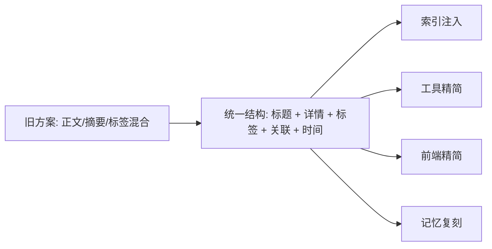
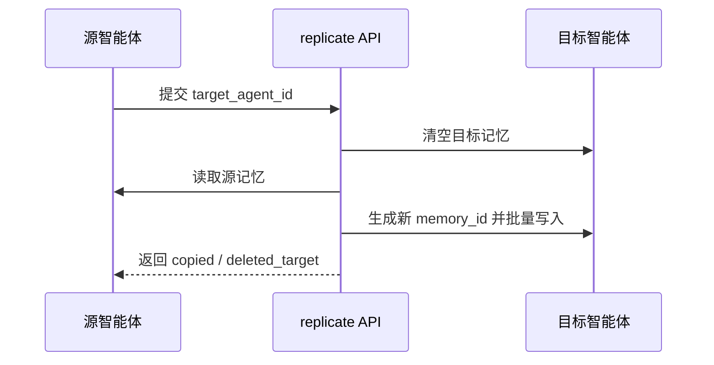

# 记忆系统重构方案

## 1. 重构目标

本轮重构要解决四类问题：

1. 模型侧记忆注入过重，长期会拖垮上下文。
2. 工具和前端仍暴露旧字段，调用成本高且容易误用。
3. 用户侧记忆面板混入置顶、作废、召回说明、提炼任务等噪声能力。
4. 多智能体之间缺少可操作的记忆复刻能力。

## 2. 目标状态

## 3. 重构范围

### 3.1 提示词层

- 自动注入改为索引标题模式
- 注入内容只保留 `memory_id + title`
- `memory_id` 压缩到 8 字符以内
- 完整内容通过 `memory_manager.get(memory_id)` 获取

### 3.2 工具层

- `memory_manager` 收敛为 `add/list/update/remove/get/search/clear`
- `list` 成为默认浏览入口
- `search` 成为默认确认入口
- `get` 成为全文读取入口
- `add/update` 只接受精简字段
- 对外协议统一使用 `tag`
- 旧 `category` 只保留兼容解析，不再作为主 schema 暴露

### 3.3 用户 API 层

- 列表/详情/创建/更新返回值收敛为当前前端实际需要字段
- 去除用户侧记忆 API 对旧字段的对外暴露
- 下线 `/pin`、`/invalidate` 等旧动作入口
- 列表返回中不再附带 `recent_hits`、`recent_jobs`

### 3.4 前端层

- 新建/编辑弹窗只保留五个主字段
- 删除卡片下方直接删除入口
- 删除置顶/作废/已失效选项
- 删除召回说明/最近提炼任务按钮与逻辑
- 新增“记忆复刻”按钮与复刻弹窗

## 4. 分阶段节点

### 阶段 A：结构统一

目标：

- 建立唯一主结构
- 明确模型、前端、后端共用字段

交付：

- 记忆碎片结构定稿
- 工具参数与 API 参数统一
- 设计文档重写

### 阶段 B：模型友好化

目标：

- 降低 system prompt 注入成本
- 降低模型检索成本

交付：

- 索引注入落地
- 短 `memory_id` 落地
- `list/search/get` 路径固化

### 阶段 C：用户体验清理

目标：

- 删除旧交互噪声
- 让面板只承担记忆维护本身

交付：

- 编辑弹窗字段收敛
- 卡片操作收敛
- 附属召回/任务 UI 移除

### 阶段 D：记忆复刻

目标：

- 支持跨智能体快速复制长期记忆

交付：

- 复刻接口
- 前端复刻弹窗
- 覆盖式复制逻辑

### 阶段 E：验证与回归

目标：

- 防止旧字段回流
- 防止短 ID / 复刻 / 列表检索退化

交付：

- 工具测试
- 路由测试
- 前端类型检查
- Rust 编译检查

## 5. 关键实现点

### 5.1 短 ID 方案

规则：

- 优先保留原始 ID 的可读部分
- 模型侧展示不超过 8 字符
- 若原始值无法稳定压缩，则回退哈希短值

收益：

- 模型更容易在上下文中定位 ID
- `get/remove/update` 调用更稳定

### 5.2 列表策略

`list` 默认返回最近 30 条，只带索引信息：

- `memory_id`
- `title`
- `tag`
- `updated_at`

`search` 默认返回 10 条，额外提供：

- `snippet`
- `matched_in`

### 5.3 详情策略

`get` 才返回完整正文：

- `content`
- `related_memory_id`
- `memory_time`

### 5.4 记忆复刻策略

关键约束：

- 目标必须是其他智能体，不能复刻到自身
- 源智能体记忆不会被清空
- 目标侧必须重建 `memory_id`
- 关联字段要随新 ID 重映射

## 6. 已落地项

- 系统提示词自动注入改为索引标题模式
- `memory_id` 压缩到 8 字符以内
- `memory_manager` 新动作与返回结构落地
- 用户侧记忆面板新字段落地
- 记忆复刻按钮与复刻接口落地
- 用户侧 API 输出结构收敛
- 旧 `/pin`、`/invalidate` 入口下线

## 7. 风险与治理

### 风险 1：历史数据仍含旧字段

处理：

- 存储层先兼容
- 对外接口不再暴露旧字段
- 后续单独做库表清理迁移

### 风险 2：模型仍沿用旧调用习惯

处理：

- 工具描述里明确 `list/search/get` 路径
- 使用说明书同步示例
- 对外 schema 不再暴露 `category/summary/tags/entities`

### 风险 3：复刻误覆盖

处理：

- 复刻弹窗要求显式选择目标智能体
- 复刻前二次确认
- 接口只允许覆盖其他智能体，不允许复刻到自身

## 8. 验收标准

- 模型侧注入只出现短 `memory_id + title`
- `memory_manager add/update` 不再要求 `summary/tags/entities`
- 前端记忆编辑弹窗不再出现摘要/实体/标签数组
- 前端记忆卡片不再出现置顶/作废/直接删除
- 召回说明/最近提炼任务入口完全移除
- 能成功把 A 智能体记忆复刻并覆盖到 B 智能体
- Rust 编译、关键路由测试、前端类型检查通过

## 9. 后续可选迭代

- 存储层彻底移除旧字段并做数据库迁移
- 继续优化 `search` 的相关性排序
- 增加批量导入/导出记忆能力
- 增加记忆冲突检测与合并建议
