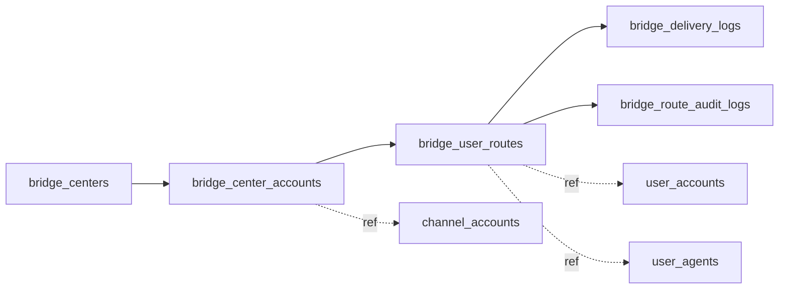

# 舰桥中心后端表结构

## 1. 设计目标

这份文档定义 `舰桥中心` 的后端持久化模型。

目标不是再造一套桥接用户体系，而是把现有：

- `channel_accounts`
- `user_accounts`
- `user_agents`
- `channel_sessions`
- `channel_messages`
- `channel_outbox`

串起来，在中间补一层“共享渠道账号 -> 外部身份 -> wunder 真实用户 -> 默认预设智能体”的桥接路由模型。

模型必须满足：

- 支持 `ChannelCatalog` 中所有 provider；
- 不复制物理渠道凭证；
- 不把 bridge 用户建成第二套账号系统；
- 同时兼容 Postgres 与 SQLite；
- 幂等处理首包并发；
- 支持后续管理端只读治理。

---

## 2. 复用现有表

| 现有表 | 作用 | 舰桥中心中的角色 |
|---|---|---|
| `channel_accounts` | 保存物理渠道账号凭证与配置 | 仍作为共享账号真实存储，不新增重复凭证 |
| `user_accounts` | wunder 真实用户 | bridge 外部用户最终落到这里 |
| `user_agents` | 用户智能体 | 默认预设智能体最终落到这里 |
| `channel_sessions` | 渠道会话映射 | 继续保存实际会话与 session 绑定 |
| `channel_messages` | 渠道消息落库 | 继续保存入站/出站消息明细 |
| `channel_outbox` | 出站投递队列 | 继续负责异步投递与重试 |
| `channel_user_bindings` / `channel_bindings` | 手工路由与默认绑定 | 仍保留优先级最高的手工绑定层 |

结论：

- 共享物理渠道账号继续只存一份，放在 `channel_accounts`；
- 舰桥中心只新增逻辑桥接表，不复制凭证；
- 路由优先级仍然是：手工绑定 > 舰桥中心 > owner fallback。

---

## 3. 新增表总览

推荐新增四张主表、一张可选审计表：

| 新表 | 必选 | 作用 |
|---|---|---|
| `bridge_centers` | 是 | 舰桥中心主表 |
| `bridge_center_accounts` | 是 | 把共享渠道账号挂到舰桥中心 |
| `bridge_user_routes` | 是 | 外部身份到 wunder 用户/agent 的稳定映射 |
| `bridge_delivery_logs` | 是 | 入站/出站投递日志 |
| `bridge_route_audit_logs` | 建议 | 管理员操作与系统自动动作审计 |

推荐关系：



---

## 4. 主表定义

## 4.1 `bridge_centers`

中心主表，表达一个管理维度上的“桥接域”。

建议字段：

| 字段 | 类型 | 说明 |
|---|---|---|
| `center_id` | `TEXT` | 主键，建议 `bc_<short_id>` |
| `name` | `TEXT` | 中心名称，管理端展示 |
| `code` | `TEXT` | 稳定短码，参与用户名生成与日志检索 |
| `description` | `TEXT NULL` | 说明 |
| `owner_user_id` | `TEXT` | 管理归属人，可选为管理员账号 |
| `status` | `TEXT` | `active / paused / disabled` |
| `default_preset_agent_name` | `TEXT` | 默认对外预设智能体名称 |
| `target_unit_id` | `TEXT NULL` | 自动开户默认单位 |
| `default_identity_strategy` | `TEXT` | 共享账号未单独覆盖时使用 |
| `username_policy` | `TEXT` | `namespaced_generated / prefer_raw_username` |
| `password_policy` | `TEXT` | 一期固定为 `fixed_123456` |
| `settings_json` | `TEXT / JSONB` | 承载扩展配置 |
| `created_at` | `REAL` | unix_ts，沿用现有记录风格 |
| `updated_at` | `REAL` | unix_ts |

约束建议：

- `center_id` 主键
- `name` 唯一
- `code` 唯一
- `status` 仅允许 `active / paused / disabled`

说明：

- `default_preset_agent_name` 是中心默认值；具体共享账号可有覆盖值；
- `password_policy` 一期虽然只有 `fixed_123456`，但建议显式落字段，方便二期切换策略；
- `settings_json` 可预留 `reply_policy`、`safety_policy`、`provider_overrides` 等扩展。

## 4.2 `bridge_center_accounts`

这张表是“共享渠道账号挂接表”，目的是把 `channel_accounts` 中的真实账号绑定到某个舰桥中心。

建议字段：

| 字段 | 类型 | 说明 |
|---|---|---|
| `center_account_id` | `TEXT` | 主键 |
| `center_id` | `TEXT` | 关联 `bridge_centers.center_id` |
| `channel` | `TEXT` | 渠道 provider，取值来自 `ChannelCatalog` |
| `account_id` | `TEXT` | 共享渠道账号 ID，关联 `channel_accounts` |
| `enabled` | `INTEGER/BOOLEAN` | 是否启用该共享账号 |
| `default_preset_agent_name_override` | `TEXT NULL` | 覆盖中心默认预设 |
| `identity_strategy` | `TEXT NULL` | 覆盖中心默认身份提取策略 |
| `thread_strategy` | `TEXT NULL` | `main_thread / per_peer / hybrid` |
| `reply_strategy` | `TEXT NULL` | `reply_only / proactive / provider_bound` |
| `fallback_policy` | `TEXT` | 推荐固定 `forbid_owner_fallback` |
| `provider_caps_json` | `TEXT / JSONB` | provider 能力快照 |
| `status_reason` | `TEXT NULL` | 例如 `adapter_unavailable / credentials_missing / running` |
| `created_at` | `REAL` | unix_ts |
| `updated_at` | `REAL` | unix_ts |

约束建议：

- `center_account_id` 主键
- `(channel, account_id)` 唯一
- `(center_id, channel, account_id)` 唯一
- `channel` 必须能在 `src/channels/catalog.rs` 中找到

关键说明：

- 这张表只保存“挂接关系”，不保存凭证明文；
- 凭证仍然以原格式保存在 `channel_accounts.config`；
- 一个共享账号在任一时刻只能挂到一个舰桥中心，避免串号；
- `provider_caps_json` 用于快照 provider 能力，不替代真实运行态。

推荐 `provider_caps_json` 结构：

```json
{
  "supports_thread": false,
  "supports_proactive": false,
  "requires_context_token": true,
  "supports_group_identity": true,
  "runtime_mode": "webhook|long_connection|long_poll|generic"
}
```

## 4.3 `bridge_user_routes`

这是整个模型最关键的表。

它表达的是：

- 某个外部身份；
- 在某个共享渠道账号下；
- 已经稳定映射到 wunder 的哪个用户、哪个智能体。

建议字段：

| 字段 | 类型 | 说明 |
|---|---|---|
| `route_id` | `TEXT` | 主键 |
| `center_id` | `TEXT` | 冗余存储，便于按中心检索 |
| `center_account_id` | `TEXT` | 关联共享账号 |
| `channel` | `TEXT` | provider 冗余字段 |
| `account_id` | `TEXT` | 共享账号冗余字段 |
| `external_identity_key` | `TEXT` | 稳定外部身份键 |
| `external_user_key` | `TEXT NULL` | 外部平台用户主键，如 sender_id/platform_user_id |
| `external_display_name` | `TEXT NULL` | 外部展示名，例如“张三” |
| `external_peer_id` | `TEXT NULL` | 会话/群/私聊对象 ID |
| `external_sender_id` | `TEXT NULL` | 群场景下的发送者 ID |
| `external_thread_id` | `TEXT NULL` | 线程/话题 ID |
| `external_profile_json` | `TEXT / JSONB` | 外部身份快照 |
| `wunder_user_id` | `TEXT` | 真实 wunder 用户 |
| `agent_id` | `TEXT` | 目标用户智能体 |
| `agent_name` | `TEXT` | 冗余名称，便于读模型 |
| `user_created` | `INTEGER/BOOLEAN` | 是否由舰桥自动开户创建 |
| `agent_created` | `INTEGER/BOOLEAN` | 是否由舰桥自动确保时创建 |
| `status` | `TEXT` | `active / paused / blocked / error` |
| `last_session_id` | `TEXT NULL` | 最近关联渠道会话 |
| `last_error` | `TEXT NULL` | 最近错误摘要 |
| `first_seen_at` | `REAL` | 首次看到该身份 |
| `last_seen_at` | `REAL` | 最近看到该身份 |
| `last_inbound_at` | `REAL NULL` | 最近入站 |
| `last_outbound_at` | `REAL NULL` | 最近出站 |
| `created_at` | `REAL` | unix_ts |
| `updated_at` | `REAL` | unix_ts |

约束建议：

- `route_id` 主键
- `(center_account_id, external_identity_key)` 唯一
- `status` 仅允许 `active / paused / blocked / error`

核心索引建议：

- `idx_bridge_routes_center_status_last_seen(center_id, status, last_seen_at desc)`
- `idx_bridge_routes_user(wunder_user_id)`
- `idx_bridge_routes_agent(agent_id)`
- `idx_bridge_routes_external(center_account_id, external_user_key)`

关键说明：

- 外部身份一旦写入这张表，后续优先按这张表复用，不再重新按展示名猜测；
- `external_display_name` 可以变化，但 `external_identity_key` 必须稳定；
- `wunder_user_id` 必须指向真实 `user_accounts`，不能写 bridge runtime 假用户。

## 4.4 `bridge_delivery_logs`

用于管理端观测与排障。

建议字段：

| 字段 | 类型 | 说明 |
|---|---|---|
| `delivery_id` | `TEXT` | 主键 |
| `center_id` | `TEXT` | 中心 |
| `center_account_id` | `TEXT` | 共享账号 |
| `route_id` | `TEXT NULL` | 若已解析到 route，则回填 |
| `direction` | `TEXT` | `inbound / outbound` |
| `stage` | `TEXT` | `resolved / dispatched / outbox / delivered / failed` |
| `provider_message_id` | `TEXT NULL` | provider 侧消息 ID |
| `session_id` | `TEXT NULL` | 会话 |
| `status` | `TEXT` | `ok / failed / skipped` |
| `summary` | `TEXT` | 摘要 |
| `payload_json` | `TEXT / JSONB` | 调试快照 |
| `created_at` | `REAL` | unix_ts |

索引建议：

- `idx_bridge_delivery_center_created(center_id, created_at desc)`
- `idx_bridge_delivery_route_created(route_id, created_at desc)`
- `idx_bridge_delivery_status(status, created_at desc)`

## 4.5 `bridge_route_audit_logs`（建议）

这张表不影响 P1 路由闭环，但建议尽早补上。

建议字段：

| 字段 | 类型 | 说明 |
|---|---|---|
| `audit_id` | `TEXT` | 主键 |
| `center_id` | `TEXT` | 中心 |
| `route_id` | `TEXT NULL` | 路由 |
| `actor_type` | `TEXT` | `system / admin` |
| `actor_id` | `TEXT` | 操作者 |
| `action` | `TEXT` | `auto_provision_user / auto_bind_agent / pause_route / block_route` |
| `detail_json` | `TEXT / JSONB` | 详情 |
| `created_at` | `REAL` | unix_ts |

---

## 5. 外部身份模型

舰桥中心支持所有渠道，所以身份提取策略必须是 provider-agnostic 的。

推荐支持以下策略：

| 策略 | identity_key 组成 | 适用场景 |
|---|---|---|
| `peer` | `channel + account_id + peer_kind + peer_id` | 纯私聊渠道 |
| `sender` | `channel + account_id + sender_id` | 发送者全局稳定，且无需区分群上下文 |
| `sender_in_peer` | `channel + account_id + peer_id + sender_id` | 群聊最常用 |
| `peer_thread` | `channel + account_id + peer_id + thread_id + sender_id?` | 支持线程或 topic 的 provider |
| `platform_user` | `channel + account_id + platform_user_id` | 平台直接给出稳定 user key |
| `platform_conversation` | `channel + account_id + conversation_id` | 只要求按会话隔离 |

推荐默认值：

- 私聊型 provider：`platform_user` 或 `peer`
- 群聊型 provider：`sender_in_peer`
- 强线程型 provider：`peer_thread`

身份提取结果应最终写成：

- `external_identity_key`
- `external_user_key`
- `external_display_name`
- `external_peer_id`
- `external_sender_id`
- `external_thread_id`

而不是只保留一个展示名。

---

## 6. 用户名策略

当前代码中 `UserStore::normalize_user_id(...)` 只接受：

- `A-Z`
- `a-z`
- `0-9`
- `_`
- `-`

因此外部显示名如“张三”不能直接作为 wunder 登录名落库。

推荐保留两种策略：

### 6.1 `namespaced_generated`，推荐默认

生成规则示例：

- `bridge_<center_code>_<short_hash>`

优点：

- 不和人工用户冲突；
- 不怕 provider 特殊字符；
- 多中心之间不串号。

### 6.2 `prefer_raw_username`

逻辑：

- 若原始外部用户名本身满足 wunder 规则，则直接使用；
- 否则回退 `namespaced_generated`。

适用：

- 外部系统用户名本来就已规范化；
- 业务上希望内部用户名尽量可读。

无论哪种策略，管理端主要展示的都应是：

- 外部显示名
- 外部身份键
- 对应 wunder 用户名

而不是只展示内部生成用户名。

---

## 7. 状态机

## 7.1 中心状态

| 状态 | 含义 |
|---|---|
| `active` | 中心运行中，允许新路由创建与消息投递 |
| `paused` | 暂停接收新桥接路由，已有路由默认不再继续处理 |
| `disabled` | 停用，管理端保留记录但不参与运行 |

## 7.2 共享账号挂接状态

`bridge_center_accounts.enabled + status_reason` 组合表达真实运行态。

常见 `status_reason`：

- `running`
- `credentials_missing`
- `adapter_unavailable`
- `runtime_not_started`
- `paused`

## 7.3 路由状态

| 状态 | 含义 |
|---|---|
| `active` | 正常桥接 |
| `paused` | 临时暂停该外部身份接入 |
| `blocked` | 封禁该外部身份 |
| `error` | 最近一次自动开户或回复失败，需要排查 |

注意：

- `paused / blocked` 是桥接路由状态，不是智能体状态；
- 不应把它写回 `user_agents.status`，避免污染用户侧语义。

---

## 8. 一期写入路径

推荐写入顺序：

1. `ChannelHub` 完成入站标准化
2. 先查 `channel_user_bindings / channel_bindings`
3. 若未命中，再查 `bridge_center_accounts`
4. 根据 provider 策略生成 `external_identity_key`
5. 查 `bridge_user_routes`
6. 若未命中，则：
   - 自动创建/复用 `user_accounts`
   - 自动确保默认预设智能体存在
   - 写入 `bridge_user_routes`
   - 写 `bridge_route_audit_logs`
7. 继续进入现有 `channel_sessions` / `chat_sessions` / orchestrator
8. 回复通过 `channel_outbox` 出站
9. 结果写 `bridge_delivery_logs`

一期必须保证：

- `(center_account_id, external_identity_key)` 唯一；
- 自动开户、自动确保智能体、路由写入具备事务幂等；
- 已挂舰桥中心的共享账号，失败不能回退 owner。

---

## 9. 存储实现建议

由于 wunder 同时支持：

- server 使用 Postgres
- desktop 使用 SQLite

所以字段设计建议如下：

| 逻辑类型 | Postgres | SQLite |
|---|---|---|
| 字符串 ID | `TEXT` | `TEXT` |
| 状态枚举 | `TEXT + CHECK` | `TEXT` |
| 时间戳 | `DOUBLE PRECISION` 或 `TIMESTAMPTZ` | `REAL` |
| JSON 扩展字段 | `JSONB` | `TEXT(JSON)` |
| 布尔 | `BOOLEAN` | `INTEGER` |

推荐做法：

- 逻辑层统一仍使用现有 `f64 unix_ts` 风格，减少与仓库现有 record 结构冲突；
- Postgres 下可进一步映射为更强的约束与索引；
- SQLite 下保证字段语义一致即可。

---

## 10. 分期落表建议

### P1 必做

- `bridge_centers`
- `bridge_center_accounts`
- `bridge_user_routes`
- `bridge_delivery_logs`

### P2 建议

- `bridge_route_audit_logs`
- 汇总视图或统计 read model

### P3 可选

- provider 级能力快照缓存表
- route 冷热分层或归档表
- 按日汇总统计表

---

## 11. 最终建议

最重要的不是字段多少，而是守住下面三条：

1. 共享渠道账号的物理凭证只存一份，仍在 `channel_accounts`。
2. bridge 外部用户最终必须落到真实 `user_accounts`，不能重新发明 runtime 用户。
3. 所有 provider 都用同一张 `bridge_user_routes` 做稳定映射，不能因渠道不同而分裂模型。

只要这三条守住，舰桥中心就能稳定扩到所有渠道。
