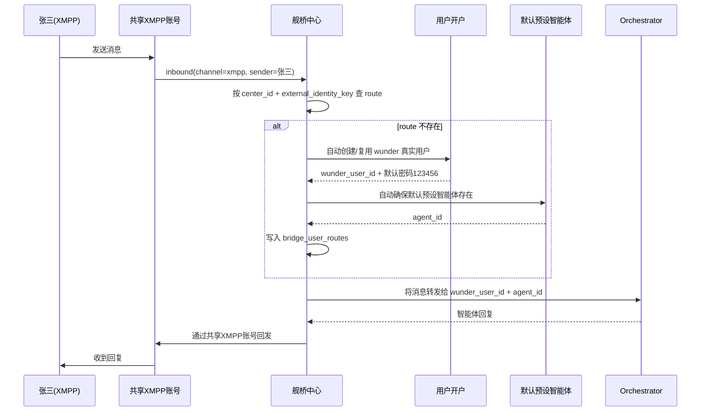

# 舰桥中心落地方案

## 1. 目标定位

`舰桥中心` 的目标，不是给 wunder 再造一套用户体系，也不是给管理员再造一套“代管用户智能体”的复杂控制台。

它应该被定义为：

- 一个挂在共享渠道账号之上的统一入口；
- 一个复用现有 `external launch / external embed` 能力的自动开户与自动挂接层；
- 一个负责“识别外部发送者 -> 创建/复用 wunder 真实用户 -> 确保默认预设智能体 -> 消息转发回原渠道”的桥接调度面。

这意味着：

- 外部用户最终仍然落到 wunder 现有的 `user_accounts`；
- 智能体仍然落到 wunder 现有的 `user_agents`；
- 线程、工作区、长期记忆、定时任务仍然走现有链路；
- `舰桥中心页面` 只负责共享渠道配置、默认预设选择、路由观测和异常排查；
- `舰桥中心页面不提供这些用户智能体的设置操作功能`。

一句话概括：

> 舰桥中心不是第二套运行时，而是“渠道版 external launch”。

---

## 2. 你这次明确后的目标流程

以 `XMPP` 为例，目标流程应当是：

1. 管理员在 `舰桥中心` 配置一个 `xmpp` 渠道账号。
2. 管理员为该舰桥中心选择一个默认对外预设智能体。
3. 张三通过 XMPP 向这个共享账号发送消息。
4. 系统发现张三尚未在该舰桥中心下建立映射。
5. 系统自动创建张三在 wunder 中对应的真实用户账号，默认密码为 `123456`。
6. 系统自动确保张三名下存在“默认预设智能体”对应的用户智能体。
7. 系统自动建立“张三 <-> wunder 用户 <-> 默认预设智能体 <-> 舰桥中心共享渠道”的桥接路由。
8. 舰桥把消息转发给张三在 wunder 中对应的那个智能体。
9. 智能体执行完成后，回复沿舰桥链路投递回张三的 XMPP 会话。

这里的关键变化是：

- 外部用户不是临时访客，也不是独立的 bridge member runtime；
- 外部用户会变成 wunder 里的真实账号；
- 这个真实账号不是管理员手工预建，而是由共享渠道首包触发自动创建；
- 默认预设智能体不是在舰桥中心页面里单独编辑，而是自动确保存在并自动挂到桥接路由上。

---

## 3. 为什么这条路是对的

### 3.1 与当前仓库现状一致

当前仓库已经有两块非常接近目标能力的现成实现：

- `src/api/auth.rs`
  - `provision_external_launch_session(...)`
  - `DEFAULT_EXTERNAL_LAUNCH_PASSWORD: "123456"`
  - 这条链路已经支持“用户不存在则自动创建真实 wunder 用户，不传密码时默认密码固定为 `123456`”。
- `src/api/auth.rs`
  - `resolve_or_create_external_embed_agent(...)`
  - 这条链路已经支持“为用户自动确保目标预设智能体存在；若用户名下已有同名用户智能体，则优先复用用户自己的同名智能体”。

也就是说，舰桥中心真正缺的不是“创建用户”和“创建默认智能体”的能力，而是：

- 共享渠道入口上的外部身份识别；
- 外部身份到 wunder 用户/智能体的稳定映射；
- 入站与出站消息的桥接调度；
- 管理员侧的只读治理视图。

### 3.2 不再引入第二套运行身份

旧思路里如果引入 `bridge_member / runtime_user_id`，会造成三个问题：

- 需要再解释一遍“桥接成员”和“真实用户”的关系，心智成本高；
- 工作区、线程、智能体、账号管理会出现双轨语义；
- 后续你想把桥接用户转成普通 wunder 用户时，迁移反而更重。

现在改成“真实用户账号”后，这些问题会直接消失：

- 用户身份统一；
- 智能体生命周期统一；
- 用户侧与管理员侧复用现有能力；
- 后续 bridge 用户想直接登录 wunder，也没有身份迁移成本。

### 3.3 与“wunder 作为外链”是一致模型

你明确要求参考 wunder 作为外链的做法，这一点完全正确。

舰桥中心应该被理解为：

- `external launch` 是“其他系统后端主动调用 wunder，为某个外部用户开通入口”；
- `舰桥中心` 是“共享渠道上的外部用户发来第一条消息时，系统自动替他完成同样的开通动作”。

本质上只是把 `external launch` 的触发源，从“外部业务系统后端”换成了“共享渠道入站消息”。

---

## 4. 设计结论

本方案的核心结论如下：

1. `舰桥中心` 下的外部用户，落库到真实的 `user_accounts`，不再设计独立 `bridge_member runtime`。
2. 自动创建用户时，沿用现有外链语义，默认密码固定为 `123456`。
3. `舰桥中心` 必须选择一个默认预设智能体；新用户进入时，自动确保该用户拥有对应用户智能体。
4. 共享物理渠道账号只在舰桥中心侧配置一次，不为每个用户复制一份 XMPP 账号配置。
5. 每个桥接用户与目标智能体的“渠道接入关系”通过桥接路由表维护，而不是直接写成用户侧可编辑的真实渠道账号。
6. `舰桥中心页面` 不提供每个桥接用户的智能体配置、线程管理、定时任务管理、工作区管理入口。
7. 若管理员需要深入排查，应跳转或联动现有用户页、线程详情页、渠道监控页，而不是在舰桥中心重复造一套编辑台。

---

## 5. 当前代码可直接复用的能力

## 5.1 用户自动开户

`src/api/auth.rs` 中已经存在：

- `provision_external_launch_session(...)`
- `DEFAULT_EXTERNAL_LAUNCH_PASSWORD`

它当前的关键语义是：

- 传入外部用户名；
- 若 wunder 中不存在该用户，则创建真实用户；
- 若未显式提供密码，则默认密码为 `123456`；
- 若用户已存在，则复用该用户；
- 最终签发 wunder 会话 token。

舰桥中心应复用这一逻辑，而不是重新实现一套“用户自动创建”。

## 5.2 默认预设智能体自动确保

`src/api/auth.rs` 中已经存在：

- `resolve_or_create_external_embed_agent(...)`

它当前的关键语义是：

- 根据智能体名称找到目标预设；
- 若用户名下已有同名用户智能体，则优先复用；
- 否则按预设内容为用户创建一个新的用户智能体。

舰桥中心应直接复用这套语义：

- 默认预设由舰桥中心选择；
- 新用户第一次进来时，自动确保该智能体存在；
- 后续同一用户继续复用同一个目标智能体。

## 5.3 渠道会话与出站链路

当前渠道系统已经有：

- 入站解析；
- `channel_sessions`；
- 消息落库；
- outbox 出站投递；
- 账号运行态与日志能力。

所以舰桥中心不应该重写渠道层，而应该只新增一个“共享账号 -> 外部发送者 -> wunder 用户/智能体”的桥接解析器。

## 5.4 为什么现有 `user_channels` 不能直接顶上

`src/api/user_channels.rs` 的 `upsert_channel_account(...)` 与 `sync_user_default_binding(...)`，适合：

- 一个用户拥有自己的渠道账号；
- 一个账号默认归一个 `owner_user_id`；
- 一个账号默认路由到一个 `agent_id`；
- 用 wildcard binding 做用户级默认接收。

但舰桥中心的共享 XMPP 账号是：

- 一个物理账号；
- 对外面对多个外部发送者；
- 每个外部发送者需要落到不同 wunder 用户；
- 每个 wunder 用户再落到自己的目标智能体。

这和用户侧 `channel_account -> owner_user_id -> agent_id` 的模型不是一回事。

所以这里不能简单地把共享 XMPP 凭证复制到每个用户的渠道配置里。

---

## 6. 共享渠道与用户智能体的正确关系

这里必须把一个很容易做错的点讲清楚：

### 6.1 不要给每个用户复制一份真实 XMPP 账号配置

如果把同一个 XMPP 物理账号复制进每个桥接用户的 `user_channels`：

- 凭证会重复存储；
- 配置归属会混乱；
- 账号 owner 概念会失真；
- 用户侧可能误以为自己“拥有”这个渠道账号；
- 后续一旦修改账号配置，会引发多处同步问题。

这是错误模型。

### 6.2 正确做法是“逻辑挂接，不是物理复制”

正确做法应是：

- 共享 XMPP 账号只在舰桥中心侧配置一次；
- 某个外部用户第一次接入时，系统建立一条桥接路由记录：
  - 这条记录说明“这个外部身份的消息，转发给 wunder 中哪个用户、哪个智能体”；
  - 同时也说明“这个智能体接受来自哪个舰桥中心、哪个共享渠道账号的消息”。

这条“挂接关系”是逻辑路由关系，不是用户侧真实渠道账号配置。

换句话说：

> 预设智能体“自动配置好渠道”，在实现上不应该是复制渠道凭证，而应该是自动生成一条只读的桥接路由挂接关系。

用户侧如果需要展示，也应展示为：

- `来源渠道：wunder舰桥中心 / xmpp / <center_name>`

而不是展示为一个可编辑的个人 XMPP 账号。

---

## 7. 推荐的核心模型

## 7.1 `bridge_centers`

表示一个舰桥中心。

建议字段：

- `center_id`
- `name`
- `status`：`active | paused | disabled`
- `channel`
- `account_id`
- `default_agent_name`
- `target_unit_id`：可选，桥接用户默认归属单位
- `identity_strategy`
- `username_policy`
- `created_at`
- `updated_at`

说明：

- 一个舰桥中心一期只绑定一个共享渠道账号即可，先把模型做稳；
- 后续若要一个中心挂多个账号，再拆 `bridge_center_accounts`。

## 7.2 `bridge_user_routes`

这是整个方案的核心表。

它不是 bridge 用户表，也不是第二套账号表，而是“外部身份到 wunder 用户/智能体”的桥接路由表。

建议字段：

- `route_id`
- `center_id`
- `channel`
- `account_id`
- `external_identity_key`
- `external_username`
- `external_display_name`
- `external_peer_id`
- `external_sender_id`
- `external_profile_json`
- `wunder_user_id`
- `agent_id`
- `agent_name`
- `status`：`active | paused | blocked | error`
- `first_seen_at`
- `last_seen_at`
- `last_session_id`
- `last_inbound_at`
- `last_outbound_at`
- `last_error`
- `created_at`
- `updated_at`

唯一约束建议：

- `(center_id, external_identity_key)` 唯一

这张表解决的就是：

- 首包时怎么落人；
- 后续怎么稳定复用；
- 管理端怎么观测；
- 用户侧怎么知道这个智能体是从舰桥中心接入的。

## 7.3 `bridge_delivery_logs`

用于查看与排查桥接投递。

建议字段：

- `log_id`
- `center_id`
- `route_id`
- `direction`：`inbound | outbound`
- `message_id`
- `session_id`
- `status`
- `summary`
- `payload_json`
- `created_at`

---

## 8. 外部身份与内部账号的映射规则

这是落地时必须讲透的部分。

## 8.1 外部身份键不等于 wunder 登录名

你举例里说“张三发消息进来，自动创建张三账号”，这个业务语义是对的。

但从当前代码看，`UserStore::normalize_user_id(...)` 只接受：

- `A-Z`
- `a-z`
- `0-9`
- `_`
- `-`

所以：

- 外部显示名可以是 `张三`；
- 但 wunder 内部真正落库的 `user_id / username` 不能简单直接用汉字。

因此文档里必须拆开两个概念：

- `external_display_name`：外部渠道展示名，例如“张三”
- `wunder_user_id`：wunder 内部真实账号名，必须满足现有规范

### 8.2 推荐用户名策略

建议舰桥中心支持两种策略，但默认使用更稳妥的方案：

1. `prefer_raw_username`
   - 若外部用户名本身符合 wunder 用户名规则，则直接使用；
   - 否则回退到系统生成名。
2. `namespaced_generated`，推荐默认
   - 使用确定性安全用户名，例如：
   - `bridge_<center_code>_<short_hash>`

推荐默认第二种，原因是：

- 避免与人工注册用户重名；
- 避免外部用户名非法字符导致首包失败；
- 避免多个舰桥中心之间同名发送者冲突。

管理端与用户视图应主要展示：

- 外部显示名；
- 外部身份；
- 对应 wunder 用户名。

不要把内部生成用户名直接当成主要展示名。

## 8.3 首次路由创建规则

首次接入时，按下面顺序处理：

1. 根据渠道原始消息提取稳定外部身份；
2. 构造 `external_identity_key`；
3. 用 `(center_id, external_identity_key)` 查 `bridge_user_routes`；
4. 若已存在，则直接复用 `wunder_user_id + agent_id`；
5. 若不存在，则进入自动开户与自动挂接流程。

## 8.4 复用规则

后续同一个外部身份继续发消息时，不再重新按用户名找人，而是优先按桥接路由复用。

这样可以避免：

- 外部昵称修改后误认成新用户；
- 与已有同名 wunder 用户误绑；
- 同一发送者在多次会话里落到不同工作区。

---

## 9. 张三 / XMPP 完整时序

这条时序里，真正要稳定下来的只有两件事：

- `张三 -> wunder_user_id`
- `张三 -> agent_id`

一旦稳定，线程、工作区、长期记忆、上下文冻结就都能沿用现有模型。

---

## 10. 自动开户与自动挂接流程

## 10.1 路由优先级

推荐顺序：

1. 显式手工绑定 `channel_user_bindings / channel_bindings`
2. `舰桥中心 bridge_user_routes`
3. 账号 owner fallback

原因：

- 保留现有手工精确绑定能力；
- 舰桥中心只在共享入口上生效；
- 不破坏现有普通渠道账号用法。

## 10.2 当共享账号挂到舰桥中心后，失败不能悄悄回退

如果这个共享 XMPP 账号已经声明属于某个舰桥中心，那么：

- 若桥接路由解析失败；
- 或自动开户失败；
- 或默认预设智能体缺失；

都不应该再静默回退到 `owner_user_id`。

否则会发生严重问题：

- 张三的消息可能被错误投递给渠道账号 owner；
- 多个外部用户会被误汇聚到同一 wunder 用户；
- 会话与工作区数据会串。

因此规则必须是：

- 已挂舰桥中心的共享账号：
  - 成功则桥接投递；
  - 失败则明确返回舰桥错误并记日志；
  - 不允许 silent fallback。

## 10.3 自动开户流程

建议把 `auth.rs` 里的能力提取成可复用 service，然后舰桥中心调用：

1. 生成候选 `wunder_user_id`
2. 调用共享的 `provision_external_launch_session(...)`
3. 若用户不存在，则创建真实用户
4. 默认密码固定为 `123456`
5. 单位默认使用舰桥中心配置的 `target_unit_id`，若未配置则沿用现有默认逻辑

## 10.4 自动确保默认预设智能体

自动开户完成后，立刻调用共享的：

- `resolve_or_create_external_embed_agent(...)`

目标智能体名称来自：

- `bridge_centers.default_agent_name`

语义保持与外链一致：

- 若用户名下已存在同名用户智能体，则优先复用；
- 否则按预设创建用户智能体；
- 后续桥接消息都打到这个 `agent_id` 上。

## 10.5 自动建立桥接路由

开户与智能体确保完成后，写入：

- `bridge_user_routes`

写入内容至少包括：

- `center_id`
- `external_identity_key`
- `wunder_user_id`
- `agent_id`
- `agent_name`
- 外部身份快照

这一步就等价于：

- “该用户的默认预设智能体已经自动配置好来自 `wunder舰桥中心` 的渠道接入”

实现上它不是 `user_channels` 真实账号，而是一条桥接路由记录。

---

## 11. 页面职责边界

## 11.1 页面要做什么

`舰桥中心页面` 应只做这几类能力：

### A. 中心配置

- 选择/编辑共享渠道账号，例如 `xmpp`
- 选择默认预设智能体
- 设置启停状态
- 配置单位归属、用户名策略、身份提取策略

### B. 只读观测

- 最近发现的外部用户
- 当前桥接路由数量
- 最近入站/出站消息
- 最近错误
- 每个外部身份对应的 wunder 用户与 agent

### C. 排查入口

- 点击查看对应 wunder 用户详情
- 点击查看对应线程详情
- 点击查看渠道运行日志

## 11.2 页面不要做什么

这里要严格收口。

`舰桥中心页面不要提供`：

- 手工修改某个桥接用户的智能体提示词
- 手工切换某个桥接用户的预设
- 手工管理某个桥接用户的线程
- 手工管理某个桥接用户的定时任务
- 手工浏览/编辑某个桥接用户的工作区
- 手工维护每个桥接用户的渠道账号

这些能力如果未来确实需要，应该：

- 继续走现有用户页、线程页、工作区页；
- 或从舰桥中心只做跳转，不在这里复制一套操作面板。

这样做的好处是：

- 页面职责清晰；
- 不和用户侧、管理员现有页面重叠；
- 不会在 `web` 侧再堆出一个难维护的“伪 Messenger”。

---

## 12. 推荐页面结构

建议管理员侧新增：

- 导航：`舰桥中心`

页面结构建议：

### 左侧：中心列表

- 中心名称
- 渠道类型
- 默认预设
- 状态
- 最近活动时间

### 右侧：中心详情

可分四个 tab：

1. `配置`
   - 共享渠道账号
   - 默认预设智能体
   - 启停状态
   - 用户名策略
   - 单位归属

2. `用户发现`
   - 外部显示名
   - 外部身份键
   - wunder 用户
   - 目标智能体
   - 首次接入时间
   - 最近消息时间
   - 当前状态

3. `消息路由`
   - 最近入站消息
   - 最近出站消息
   - session_id
   - route_id
   - route_source=bridge_center
   - 失败原因

4. `运行日志`
   - 渠道账号运行日志
   - 自动开户日志
   - 自动挂接日志
   - 出站失败日志

操作按钮建议只保留：

- 新建中心
- 编辑中心配置
- 启用/暂停中心
- 查看对应用户
- 查看对应线程

不加“编辑用户智能体”“切换线程”“管理定时任务”等按钮。

---

## 13. 后端模块落点建议

为了避免继续把逻辑堆进大文件，建议按下面方式落模块。

## 13.1 提取共享外链开户能力

把 `src/api/auth.rs` 中与舰桥中心直接相关的能力下沉到 service 层，例如：

- `src/services/external/provision.rs`
  - `provision_external_launch_session(...)`
  - `resolve_or_create_external_embed_agent(...)`

这样：

- `auth.rs` 仍然可以继续使用；
- `bridge` 服务也可以直接复用；
- 不会让舰桥中心依赖 API 层内部函数。

## 13.2 新增桥接服务模块

建议新增：

- `src/services/bridge/mod.rs`
- `src/services/bridge/identity.rs`
- `src/services/bridge/provision.rs`
- `src/services/bridge/router.rs`
- `src/services/bridge/read_model.rs`
- `src/services/bridge/logs.rs`

职责划分：

- `identity.rs`
  - 从渠道入站消息提取外部身份
- `provision.rs`
  - 自动开户与自动确保默认预设智能体
- `router.rs`
  - 读写 `bridge_user_routes`
- `read_model.rs`
  - 供管理端查询中心、用户发现、消息路由
- `logs.rs`
  - 审计与投递日志

## 13.3 渠道接入点

建议在渠道消息进入主流程后，增加一层桥接解析：

- 先查手工绑定
- 再查舰桥中心桥接路由
- 最后才是 owner fallback

可新增：

- `src/channels/bridge_router.rs`

避免继续把桥接逻辑堆进已较重的 `src/channels/service.rs`。

## 13.4 管理端接口

建议新增：

- `src/api/admin_bridge.rs`

接口建议控制在只读/轻编辑范围：

- `GET /wunder/admin/bridge_centers`
- `POST /wunder/admin/bridge_centers`
- `PUT /wunder/admin/bridge_centers/{center_id}`
- `POST /wunder/admin/bridge_centers/{center_id}/status`
- `GET /wunder/admin/bridge_centers/{center_id}/routes`
- `GET /wunder/admin/bridge_centers/{center_id}/logs`

不建议一期就做：

- `.../routes/{route_id}/change_agent`
- `.../routes/{route_id}/rotate_thread`
- `.../routes/{route_id}/workspace/*`

---

## 14. 前端落点建议

管理端前端按仓库约束，应放在：

- `web/modules/bridge-center.js`
- `web/styles/bridge-center.css`

仅在以下位置做最小接线：

- `web/app.js`
- `web/index.html`

不要把大段桥接逻辑继续堆进：

- `web/app.js`

页面重点是：

- 信息结构清楚；
- 读日志快；
- 查路由快；
- 明确知道一个外部人最终落到了哪个 wunder 用户与哪个 agent。

它不是聊天页，也不是智能体编辑页。

---

## 15. 关键边界与异常处理

## 15.1 首包并发

同一个外部发送者首包可能并发进入。

必须保证：

- `bridge_user_routes(center_id, external_identity_key)` 唯一；
- 自动开户与写路由具备事务幂等；
- 不会为同一个发送者创建多个 wunder 用户或多个默认智能体。

## 15.2 默认预设被删除或改名

若舰桥中心配置的默认预设不存在：

- 新用户接入必须失败；
- 明确记录错误；
- 不允许自动回退到任意其他智能体。

否则行为会不可预测。

## 15.3 已有同名真实用户的冲突

如果外部身份推导出的候选用户名，已经被现有真实 wunder 用户占用：

- 不应直接抢占；
- 应按用户名策略生成带命名空间的安全用户名；
- 再写入桥接路由。

这也是为什么推荐默认不用“直接拿外部用户名落库”。

## 15.4 共享账号桥接失败禁止 silent fallback

这一点再次强调：

- 共享账号一旦挂到舰桥中心；
- 桥接失败就应报错；
- 绝不能静默回退到 owner。

这是防止消息串号的底线。

## 15.5 默认密码 `123456` 的安全边界

当前需求与现有外链能力都明确要求默认密码 `123456`，所以一期方案按这个规则执行。

但要在文档里明确：

- 这是“桥接自动开户”的兼容策略；
- 不是推荐的长期安全策略。

后续可选增强项：

- 标记桥接用户 `bridge_managed`
- 首次登录强制改密
- 禁止密码登录，仅允许桥接/外链进入

这些不影响一期落地，但应该在设计上预留。

---

## 16. 分期建议

## P1：最小可用闭环

目标：

- 可创建舰桥中心
- 可绑定一个共享 XMPP 账号
- 可选择默认预设智能体
- 外部用户首包可自动创建 wunder 真实用户
- 默认密码固定 `123456`
- 可自动确保默认预设智能体
- 可自动建立桥接路由
- 可把回复投递回原 XMPP 发送者

本期不做：

- 每桥接用户的复杂操作面板
- 线程/定时任务/工作区编辑

## P2：管理端观测完善

目标：

- 用户发现列表
- 路由状态列表
- 投递日志
- 与用户详情、线程详情的跳转联动

## P3：安全与策略增强

目标：

- 用户名策略可配置
- bridge 用户登录策略增强
- 多渠道支持
- 更细粒度的外部身份提取策略

---

## 17. 验收标准

满足下面这些条件，才算舰桥中心真正落地：

1. 管理员可在管理端配置共享 `xmpp` 渠道与默认预设智能体。
2. 张三第一次从该 XMPP 账号发送消息时，系统会自动创建张三在 wunder 中对应的真实用户账号。
3. 新创建用户默认密码固定为 `123456`。
4. 系统会自动确保该用户名下存在默认预设智能体对应的用户智能体。
5. 系统会自动建立只读桥接路由，表明该智能体接受来自该舰桥中心共享渠道的消息。
6. 张三后续继续发消息时，会稳定复用同一个 wunder 用户、同一个目标智能体，以及该用户下已有线程与工作区链路。
7. 智能体回复会沿共享 XMPP 账号正确发回张三。
8. 管理端可以看到张三这条桥接路由、最近消息、最近异常。
9. 管理端不能在舰桥中心页面里直接改张三的智能体配置、线程、定时任务、工作区。
10. 共享账号桥接失败时不会静默回退到 owner 用户。

---

## 18. 最终建议

这次需求澄清后，舰桥中心最优雅、也最稳的落地方式已经很明确：

- 不做第二套 bridge 用户体系；
- 不做 bridge member runtime；
- 不给每个用户复制共享渠道凭证；
- 不在舰桥中心页面里造一套用户智能体编辑台；
- 直接复用现有 `external launch + external embed` 能力；
- 用一张桥接路由表把“外部发送者 -> wunder 用户 -> 默认预设智能体”稳定下来。

最终得到的系统形态是：

- 管理员只维护一个共享渠道账号；
- 外部用户通过这个账号进入；
- wunder 自动为他们生成/复用真实用户与默认智能体；
- 舰桥中心只负责渠道入口、自动挂接、路由分发、日志观测。

这条路线和当前仓库能力最一致，改造面最小，后续也最好维护。
