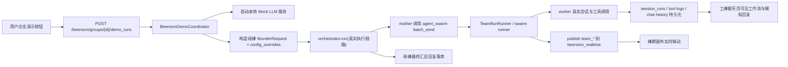

# 蜂群演示落地方案（高一致度版）

## 1. 背景与目标

目标是在用户侧蜂群页面（`frontend/src/components/beeroom/BeeroomMissionCanvas.vue`）右侧聊天输入区发送按钮旁新增“演示”按钮，用于一键触发**不依赖外部大模型**的蜂群演示流程。

本版方案以“高一致度”作为默认目标，要求尽量贴近真实调用链路：

1. 母蜂与工蜂通过真实编排器执行，不走前端假动画。
2. 工蜂在其**自身聊天页面**可看到和真实任务相同形态的工作流轨迹与回复沉淀。
3. 蜂群画布仍通过既有 `team_*` 实时事件更新。
4. 演示稳定可重复，可作为领导演示与链路检查入口。

## 2. 现状代码锚点

## 2.1 用户侧蜂群页与发送链路

- 页面组件：`frontend/src/components/beeroom/BeeroomMissionCanvas.vue`
- 当前发送链路：`handleComposerSend` -> `sendMessageStream/resumeMessageStream` -> `persistDispatchReply`
- 结论：当前路径强依赖真实模型；演示按钮需新增独立 API 入口。

## 2.2 画布/任务状态联动

- `frontend/src/stores/beeroom.ts` 的 `applyRealtimeEvent` 已消费：
  - `team_start`
  - `team_task_dispatch`
  - `team_task_update`
  - `team_task_result`
  - `team_merge`
  - `team_finish`
  - `team_error`
- 结论：后端只要按既有 `team_*` 协议发事件，画布联动无需重写。

## 2.3 Beeroom 实时传输

- WS：`GET /wunder/beeroom/ws`
- SSE：`GET /wunder/beeroom/groups/{group_id}/chat/stream`
- 服务：`src/services/beeroom_realtime.rs`
- 结论：演示链路可复用现有实时通道，无需新建通讯机制。

## 2.4 管理员“蜂群测试”可复用能力

- 参考实现：`src/services/sim_lab.rs`
- 可借鉴点：
  - 本地 mock LLM 服务（进程内 HTTP）。
  - 预制母蜂/工蜂响应脚本。
  - 多轮 worker 工具调用回路。
- 注意：不能直接复用 admin sim-lab 的用户清理与权限模型（它有测试用户重置逻辑，不适合用户侧线上演示）。

## 3. 方案决策（高一致度优先）

## 3.1 方案对比

| 方案 | 一致度 | 优点 | 问题 |
|---|---|---|---|
| 纯前端假动画 | 低 | 快速 | 无真实链路，不可用于链路检查 |
| 后端脚本直接推 `team_*` | 中 | 画布可动、实现快 | 工蜂聊天页难做到真实工作流体验 |
| 真实编排器 + 本地 mock 模型（推荐） | 高 | 与真实调用链路最接近，工蜂页可见性最好 | 实现复杂度更高 |

## 3.2 本次选择

采用“**真实编排器 + 本地 mock 模型 + 用户侧演示 API**”：

1. 演示请求由后端启动真实母蜂会话执行（`orchestrator.run`）。
2. 模型层改为本地 mock 服务，不访问外部 LLM。
3. 母蜂按预制策略调用 `agent_swarm batch_send`，工蜂在真实会话中完成多步骤工具调用并回复。
4. 蜂群画布通过现有 `team_*` 事件更新；工蜂聊天页通过既有会话/运行记录展示工作流与回复。

## 3.3 高一致度定义

满足以下 4 条即判定“高一致度”：

1. 工蜂任务执行产生真实 `session_runs` 与工具日志。
2. 工蜂回复落入其真实会话历史（不是仅 beeroom 假消息）。
3. 母蜂汇总通过真实会话产出最终答案。
4. 蜂群页与工蜂聊天页看到的运行状态一致（允许毫秒级时序差）。

## 4. 目标架构



## 5. 后端落地设计

## 5.1 模块拆分建议

建议新增目录，避免把逻辑继续堆到大文件：

1. `src/services/beeroom_demo/coordinator.rs`：演示运行协调。
2. `src/services/beeroom_demo/mock_llm.rs`：本地 mock 模型服务（可从 `sim_lab` 抽取共用逻辑）。
3. `src/services/beeroom_demo/script.rs`：母蜂/工蜂预制脚本与随机策略。
4. `src/services/beeroom_demo/registry.rs`：run registry、取消与回收。
5. `src/services/beeroom_demo/mod.rs`：对外服务入口。
6. `src/api/beeroom_demo.rs`：用户侧演示 API。

并在：

- `src/services/mod.rs`
- `src/api/mod.rs`

完成注册。

## 5.2 API 草案

### 5.2.1 启动演示

- `POST /wunder/beeroom/groups/{group_id}/demo_runs`

请求体建议：

```json
{
  "seed": 12345,
  "worker_count_mode": "random",
  "worker_count": 0,
  "speed": "normal",
  "scenario": "standard",
  "tool_profile": "safe"
}
```

说明：

- `tool_profile=safe` 默认仅使用低风险工具组合（优先读操作；写操作限制在演示目录）。

响应建议：

```json
{
  "data": {
    "run_id": "br_demo_xxx",
    "team_run_id": "team_xxx",
    "mother_session_id": "sess_xxx",
    "status": "running",
    "group_id": "xxx"
  }
}
```

### 5.2.2 查询状态

- `GET /wunder/beeroom/groups/{group_id}/demo_runs/{run_id}`

### 5.2.3 取消演示

- `POST /wunder/beeroom/groups/{group_id}/demo_runs/{run_id}/cancel`

## 5.3 运行流程（关键步骤）

1. 校验用户与 group，读取母蜂与工蜂池。
2. 随机抽取工蜂数量（例如 `2..=min(6, worker_pool_len)`）。
3. 为母蜂与入选工蜂确保主会话存在（复用 `resolve_or_create_agent_main_session` 逻辑）。
4. 启动本地 mock LLM 服务（仅本次 run 生命周期）。
5. 组装母蜂 `WunderRequest`：
   - 模型与 provider 指向本地 mock LLM。
   - 工具中保留 `agent_swarm`。
   - 问题内容带演示 marker 与脚本上下文。
6. 调用 `orchestrator.run` 触发真实链路。
7. 演示结束后回收 mock 服务与 registry 状态。

## 5.4 工蜂聊天页可见性保证

为确保工蜂页面看到“和真实任务一致”的效果，必须保证：

1. 工蜂任务落在其真实会话（非临时前端态）。
2. 工具调用走真实工具执行链，产出真实工具日志与运行记录。
3. 工蜂最终回复写入真实聊天记录。
4. `team_task_update/team_task_result` 与会话运行状态在同一次执行中产生。

这样用户切到工蜂聊天页时，可看到：

1. 运行状态变化（queued/running/completed/failed）。
2. 工具调用轨迹。
3. 工蜂模拟回复内容。

## 5.5 事件与数据策略

### 5.5.1 主事件（必须）

继续复用现有 `team_*`：

- `team_start`
- `team_task_dispatch`
- `team_task_update`
- `team_task_result`
- `team_merge`
- `team_finish`
- `team_error`

### 5.5.2 文本流策略（高一致度推荐）

优先依赖真实会话链路本身的流与落库，不把 `demo_chat_delta` 作为主路径。

可选增强：

- 增加 `beeroom_demo_status`（仅 run 状态提示，如 starting/running/cancelling/finished）。

## 5.6 取消、并发与回收

1. 限制 `user_id + group_id` 维度单活演示 run。
2. 取消时触发母蜂会话中断，并尽量取消关联 worker 活跃会话。
3. run 结束后释放 mock 服务与内存 registry，防止泄漏。
4. 设置软超时（例如 90 秒）与兜底终态，避免僵死 run。

## 5.7 安全与副作用控制

1. 默认 `safe` 工具画像，避免真实业务目录被误写。
2. 如需写文件，限定在 `workspace/<user>/beeroom_demo/<run_id>/`。
3. 演示任务 `strategy` 标记 `demo`，便于筛选和审计。

## 6. 前端落地设计

## 6.1 UI 变更

在 `BeeroomMissionCanvas.vue` 发送按钮旁增加：

1. `演示`（空闲态）
2. `演示中…` 或 `停止演示`（运行态）

并保持：

- 演示中禁用重复触发。
- 常规发送能力不受破坏（可按产品策略选择是否互斥）。

## 6.2 逻辑拆分建议

新增：

- `frontend/src/components/beeroom/useBeeroomDemo.ts`

职责：

1. 封装 start/status/cancel API。
2. 管理演示运行态。
3. 接收可选 `beeroom_demo_status` 实时事件。
4. 将状态反馈给按钮与提示区。

## 6.3 API 客户端扩展

`frontend/src/api/beeroom.ts` 增加：

1. `startBeeroomDemoRun(groupId, payload)`
2. `getBeeroomDemoRun(groupId, runId)`
3. `cancelBeeroomDemoRun(groupId, runId)`

## 6.4 i18n 文案

在：

1. `frontend/src/i18n/messages/zh-CN.ts`
2. `frontend/src/i18n/messages/en-US.ts`

新增：

- `beeroom.canvas.demoStart`
- `beeroom.canvas.demoRunning`
- `beeroom.canvas.demoStop`
- `beeroom.canvas.demoFailed`
- `beeroom.canvas.demoCompleted`

## 7. 演示脚本建议（高一致度）

## 7.1 母蜂脚本

1. 首轮：分析任务并调用 `agent_swarm.batch_send`。
2. 中间轮：根据 wait 结果继续派发补充任务或请求二次校验。
3. 收尾轮：汇总 worker 结果并给出最终答复。

## 7.2 工蜂脚本

每个工蜂执行 2~4 步：

1. 第 1 步：检索/读取。
2. 第 2 步：整理/校验。
3. 最终：输出结构化回报给母蜂。

脚本与 `sim_lab` 的 worker profile 机制对齐，但去掉 admin-only 依赖。

## 8. 测试方案

## 8.1 后端测试

1. 单元测试：工蜂抽样、脚本轮次、状态迁移、取消幂等。
2. 集成测试：`start -> team_* 事件 -> finish` 全链路。
3. 一致性测试：校验 worker 会话中存在运行记录、工具日志与最终回复。

## 8.2 前端测试

1. 演示按钮状态机正确（空闲/运行/取消中/失败）。
2. 画布收到 `team_*` 后持续联动更新。
3. 演示期间切到工蜂聊天页，能看到与真实调用一致形态的工作流与回复。
4. WS 断开回退 SSE 后流程仍可完成。

## 8.3 人工验收清单（领导演示）

1. 点击演示后 1 秒内有可见反馈。
2. 工蜂数量随机变化，且每个工蜂有多步骤执行痕迹。
3. 画布、中栏、右侧日志、工蜂聊天页状态一致。
4. 全程不依赖外部大模型服务。
5. 同一流程重复执行稳定，不出现卡死 run。

## 9. 风险与边界

1. “一致”不等于“完全同分布”：  
输出内容是预制脚本，不具备真实模型的不确定性。
2. 若启用写工具存在副作用：  
默认 `safe` 配置约束目录与工具范围。
3. 并发演示可能挤占资源：  
需加 group 级单活与超时回收。

## 10. 分阶段实施计划

1. 第 1 阶段（后端基础）：新增 `beeroom_demo` API、run registry、mock LLM 生命周期管理。
2. 第 2 阶段（高一致度核心）：接入真实编排器执行母蜂/工蜂脚本，打通会话与工具日志沉淀。
3. 第 3 阶段（前端）：新增演示按钮与状态交互，接入 API 与运行反馈。
4. 第 4 阶段（联调验收）：验证蜂群页与工蜂聊天页一致性，完成演示脚本稳定化。

---

本方案将“演示可看”升级为“演示可验”：  
**视觉上像真实模型，链路上也尽量走真实路径，仅把外部模型替换为本地 mock。**
