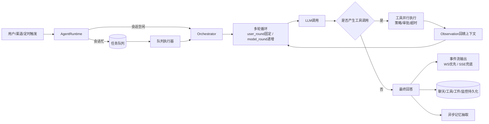
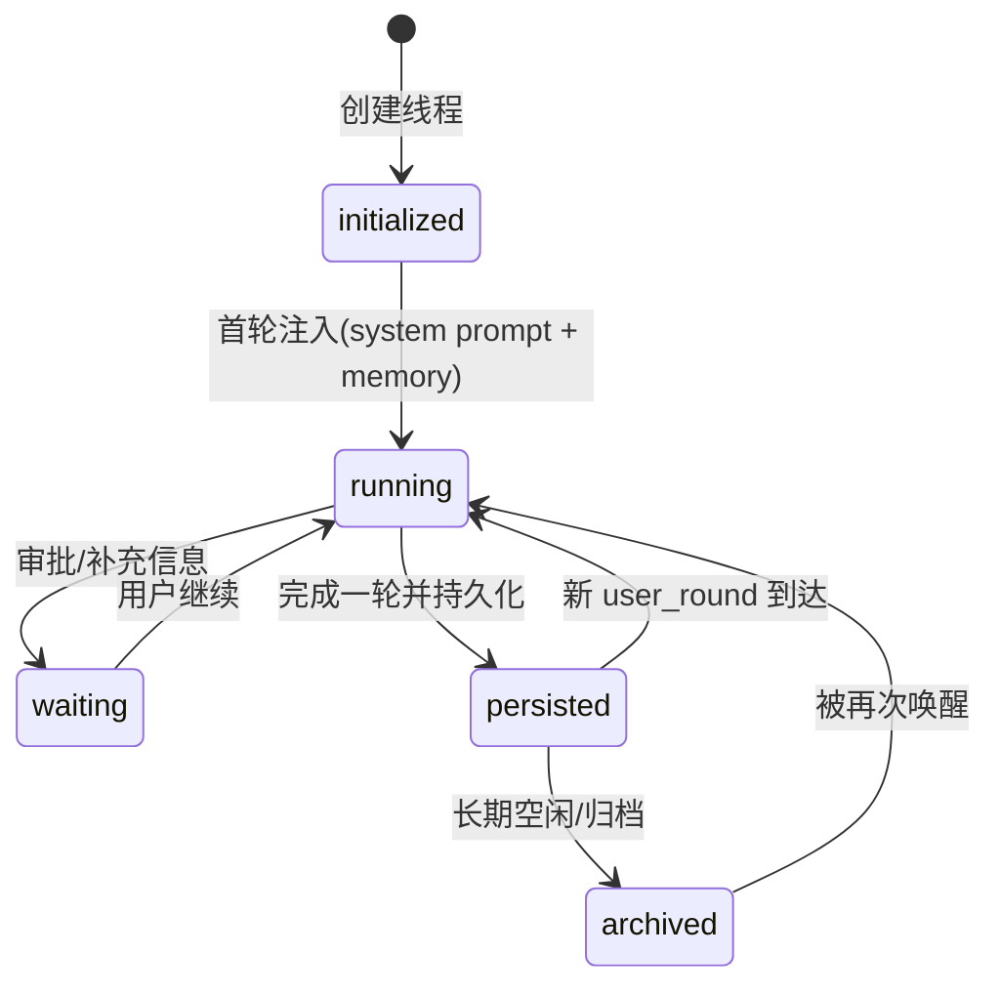
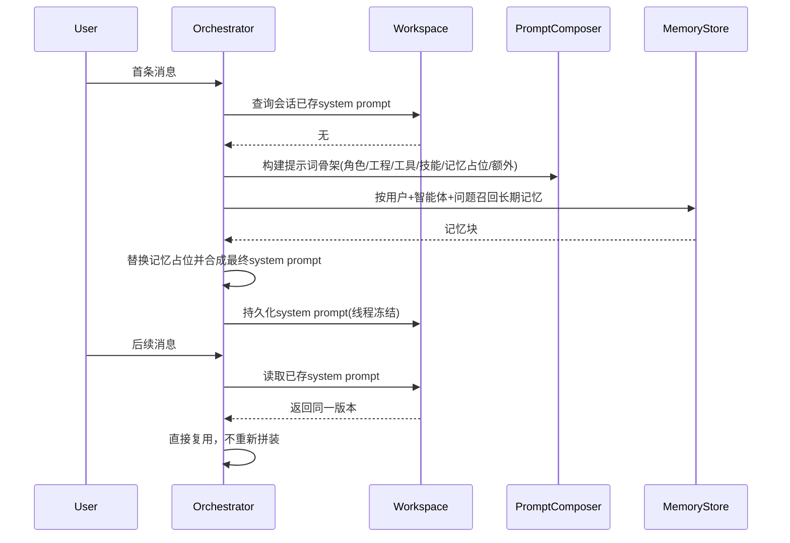
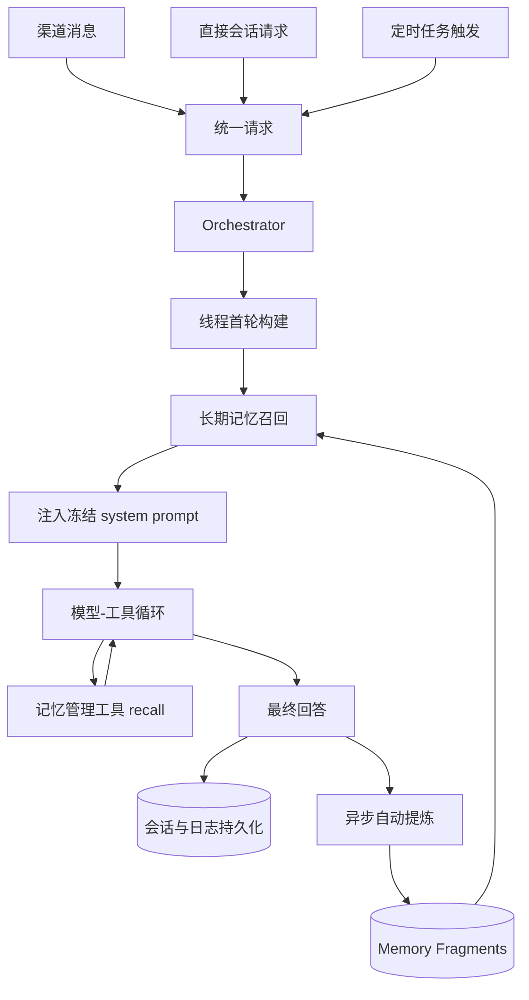
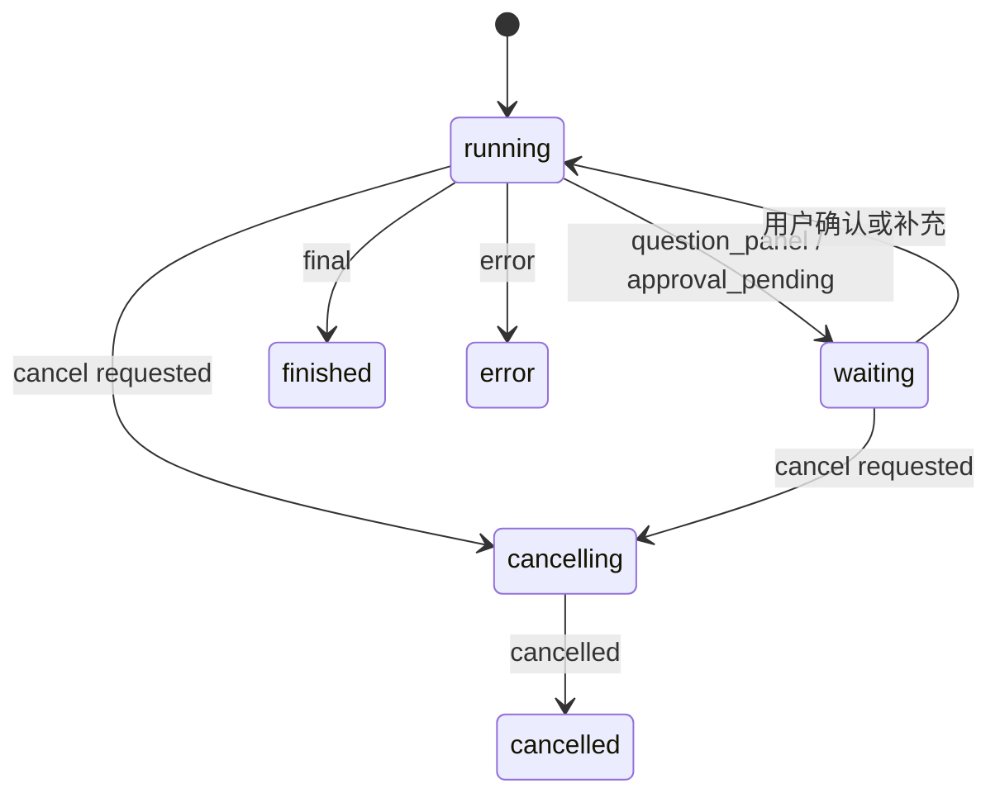

# wunder 单智能体设计与实现

## 1. 文档范围与目标

本文聚焦 **wunder 对“单个智能体”** 的完整运行闭环，覆盖以下设计面：

- 系统提示词（构建、冻结、复用）
- 工具系统（可用集计算、执行控制、失败保护）
- 运行环境与工作目录（隔离、映射、沙盒）
- 定时任务（调度、租约、回投）
- 渠道接入（绑定、会话策略、审批回路）
- 记忆系统（短期上下文、长期片段、异步抽取）
- 日志与可观测性（事件流、状态机、持久化）

目标不是罗列接口，而是解释“为什么这样设计”和“系统如何长期稳定运行”。

---

## 2. 单智能体执行主链路

### 2.1 核心职责分层

| 层 | 主要职责 | 关键设计点 |
|---|---|---|
| AgentRuntime | 入口接收、主会话解析、忙闲判断、排队与重试 | 把“会话并发控制”从推理流程中解耦 |
| Orchestrator | 多轮模型-工具编排、上下文管理、最终回复生成 | 以 `user_round + model_round` 驱动可观测循环 |
| Workspace 管理 | 工作区隔离、路径映射、会话提示词/上下文占用持久化 | 兼顾多租户隔离与跨端一致体验 |
| Monitor | 会话状态机、事件时间线、运行统计 | 支持审计、回放、取消与恢复 |

### 2.2 请求到回复流程图

### 2.3 并发与排队控制

| 机制 | 作用 | 结果 |
|---|---|---|
| 会话锁（含心跳） | 防止同一会话并发执行导致上下文竞态 | 同会话串行、跨会话并行 |
| 主会话忙时分叉 | 隐式主会话拥塞时自动创建隔离会话 | 保证前台交互不被阻塞 |
| Agent 队列任务状态 | `pending/running/retry/success/failed/dead` | 可恢复、可追踪、可清理 |
| 线程级运行集合 | 防止同线程重复拉起执行 | 避免重复消费和放大故障 |

### 2.4 生命周期与现实边界

#### 2.4.1 用户与智能体交互的三层单位

wunder 将“用户与智能体交互”严格拆分为三层计量单位：

| 单位 | 定义 | 计数规则 | 作用 |
|---|---|---|---|
| 会话线程（session thread） | 单智能体的主运行容器 | 一个会话 ID 对应一个线程上下文 | 负责承载完整对话现实与执行状态 |
| 用户轮次（user_round） | 用户发来的一条消息 | 每条用户消息 +1 | 固定一次请求的业务输入边界 |
| 模型轮次（model_round） | 模型的一次动作 | 模型调用、工具调用、最终回复各 +1 | 细粒度描述智能体执行过程 |

因此一次用户提问通常是：`1 次 user_round + N 次 model_round (N >= 1)`。  
线程是“会话级现实”的最小完整边界，轮次是线程内的时间刻度。

#### 2.4.2 智能体现实的三部分载体

单智能体的现实并非只在上下文窗口中，而是由三部分共同组成：

| 现实载体 | 存储位置 | 典型内容 | 生命周期 |
|---|---|---|---|
| 线程现实（上下文） | 会话线程记录（chat/tool/event） | 当前对话历史、Observation、线程冻结 system prompt | 与线程同生共存，是实时推理主现场 |
| 工作目录现实（文件） | 用户/智能体工作区目录 | 代码、文档、图表、命令输出、补丁产物 | 跨轮持久沉淀，可被后续工具继续消费 |
| 记忆现实（数据库） | 记忆与业务存储（Postgres/SQLite） | 长期记忆片段、标签、命中统计、配置快照 | 跨会话持久，可召回回灌到新轮次 |

可操作层面可理解为：

- **线程内现实**：承载“当下正在发生什么”，决定本轮推理行为。
- **工作目录现实**：承载“做过什么产物”，决定可复用的外部事实。
- **数据库记忆现实**：承载“长期知道什么”，决定跨会话延续能力。

#### 2.4.3 生命周期阶段（线程视角）

生命周期关键约束：

- 线程首次确定后，system prompt 与首轮记忆注入保持冻结，不在后续轮次漂移。
- 每个 user_round 内允许多次 model_round，直到产生 final 或进入 waiting。
- 每轮结束必须把“线程现实 + 文件产物索引 + 记忆写回任务”落盘，确保可恢复与可追踪。

---

## 3. 系统提示词设计（System Prompt）

### 3.1 组装模型

系统提示词并非单段文本，而是可组合骨架：

| 片段 | 职责 |
|---|---|
| 角色片段 | 定义智能体身份、行为边界 |
| 工程约束片段 | 注入日期、运行模式、工作目录、工程规则 |
| 工具协议片段 | 约束工具调用格式与行为 |
| 技能协议片段 | 暴露技能可用能力与使用方式 |
| 记忆片段占位符 | 预留长期记忆注入位 |
| 额外片段 | 注入 agent 的个性化补充提示 |

同时存在多级缓存（模板修订、配置版本、工具集合、工作区版本等维度），目的是把高频拼装开销压到最低。

### 3.2 “线程级冻结”机制

单智能体线程的核心原则：**首轮确定后不再漂移**。

- 会话首次请求时，生成系统提示词并持久化。
- 后续轮次优先复用已存提示词，不再重建。
- 工作区中的 `AGENTS.md` 仅在线程首轮快照注入；后续即使文件变化，也不改线程 System Prompt。
- 长期记忆同样在首轮完成注入并冻结，避免提示词缓存失效和行为抖动。

### 3.3 冻结时序图

---

## 4. 工具系统设计

### 4.1 工具类型分层（内置 / 技能 / MCP / 知识库）

单智能体的工具系统采用“统一协议 + 分类型执行器”架构：模型看到的是统一工具接口，运行时按工具类型路由到不同执行链路。

| 类型 | 来源 | 典型能力 | 执行位置 | 主要风险 |
|---|---|---|---|---|
| 内置工具（Built-in） | wunder 运行时内建 | 读写编辑文件、搜索内容、列目录、执行命令、ptc 等 | 本地进程/沙盒 | 写入与命令风险、资源占用 |
| 技能工具（Skill） | `SKILL.md` + 技能脚本/模板 | 面向特定任务的复合能力与工作流 | 本地进程（受策略约束） | 技能脚本质量与边界控制 |
| MCP 工具 | 外部 MCP Server 动态发现 | 第三方系统能力、资源读取、模板化能力 | 远端服务（协议调用） | 网络抖动、服务可用性、权限漂移 |
| 知识库工具 | 内置检索与知识索引 | 检索、召回、引用片段、证据回填 | 本地检索引擎/向量索引 | 召回噪声、上下文膨胀 |

### 4.2 四类工具运行契约

#### 4.2.1 内置工具

- 作为基础能力集合，默认可用，强调低延迟与高确定性。
- 统一走执行策略评估（allow/audit/deny）与审批机制（高风险命令/写入）。
- 返回结果必须结构化（stdout/stderr/exit_code/artifact），便于回放与审计。

#### 4.2.2 技能工具

- 技能是“工具打包层”，可把多个底层工具封装为可复用流程。
- 线程首轮确定技能清单后，后续轮次只做可用性裁剪，不漂移技能描述，保证提示词缓存稳定。
- 技能失败时返回可恢复建议（缺少依赖、参数不合法、前置步骤未完成），避免模型盲重试。

#### 4.2.3 MCP 工具

- 通过 MCP 协议进行服务发现与调用，工具描述来自服务端注册信息。
- 每个 MCP Server 维护健康状态（online/degraded/offline），参与可用工具集合计算。
- 调用结果统一转换为 Observation；当远端不可用时降级为“可解释错误 + 重试窗口”。

#### 4.2.4 知识库工具

- 知识库以工具形式参与编排（检索、片段读取、引用注入），而不是绕过工具系统的隐式逻辑。
- 采用“词法 + 向量”混合召回与去重重排，先控噪再注入上下文。
- 对注入内容按 `context_tokens` 预算裁剪，优先保留高相关证据与引用元数据。

### 4.3 可用工具集合的计算

单智能体在某次请求中的工具集合由多层约束交集决定：

`可用工具 = (内置工具 ∪ 技能工具 ∪ MCP工具 ∪ 知识库工具) ∩ 访问控制 ∩ 线程工具快照 ∩ 会话/智能体覆盖 ∩ 运行时健康状态 ∩ 模型能力约束`

其中关键策略：

- 若用户未显式点名工具，使用默认可用集合。
- 若显式请求工具，只在“请求集合 ∩ 可用全集”中启用。
- 工具名使用命名空间隔离（如 `builtin.*` / `skill.*` / `mcp.<server>.*` / `kb.*`），避免冲突。
- 视觉能力不足的模型会自动剔除视觉相关工具。
- 终结类工具（如最终回复工具）与 UI 工具存在互斥策略，防止冲突终态。

### 4.4 执行管线

1. 模型输出工具调用计划（支持原生函数调用与文本协议两种模式），并标注目标工具类型。
2. 路由层按类型分发到执行器（内置执行器 / 技能执行器 / MCP 执行器 / 知识库执行器）。
3. 执行器按并行度执行并统一收集结果，结果都转换为 Observation 回填上下文。
4. 同步写入工具日志、工件日志与流式事件，记录 `tool_type/source/latency/error_code`。

### 4.5 稳定性保护

| 保护机制 | 设计目的 | 类型化补充 |
|---|---|---|
| 工具超时 | 防止单工具拖垮整轮 | MCP/知识库用更短首超时 + 有限重试窗口 |
| 审批机制 | 高风险命令/写入/控制操作可人工确认 | 主要作用于内置/技能工具 |
| 执行策略评估 | 按模式允许、审计或强制拦截 | 可按类型与命名空间配置策略 |
| 结果裁剪 | 控制上下文膨胀，避免 token 爆炸 | 知识库结果按相关度与片段预算裁剪 |
| 重复失败保护 | 相同工具错误达到阈值后停止重试，给出可恢复引导 | MCP 增加服务级熔断，技能增加步骤级短路 |

---

## 5. 运行环境与工作目录

### 5.1 工作区隔离模型

工作区标识不是裸 `user_id`，而是带作用域的逻辑标识：

- 用户基础作用域
- 智能体作用域（同用户多智能体隔离）
- 容器作用域（按 sandbox container 切分）

这保证“同用户不同智能体”与“同智能体不同容器”可以并行且互不污染。

### 5.2 路径双向映射

系统同时维护两类路径：

- **公开路径**：对模型与前端友好（如统一工作区前缀）
- **本地真实路径**：用于落盘与执行

工具执行时会做公开路径与本地路径互映射；在沙盒模式下还会做“宿主路径 ↔ 容器路径”重写，保证返回结果对上层透明。

### 5.3 运行模式差异

| 模式 | 主要特点 |
|---|---|
| Server | 多租户集中运行，强调隔离与并发 |
| CLI/Desktop 本地模式 | 更接近用户本机文件系统，强调操作便捷 |
| Sandbox 模式 | 工具执行通过沙盒服务代理，带资源与命令边界 |

### 5.4 上下文占用持久化

每轮会记录会话级 `context_tokens`（上下文占用），并在监控中维护峰值。  
这是一种“上下文容量治理”指标，不等于整次请求的总计费消耗。

---

## 6. 定时任务（Cron）设计

### 6.1 能力面

单智能体定时任务支持：`add / update / remove / enable / disable / get / list / run / status`。

### 6.2 调度与租约

调度器循环执行：

1. 统计当前运行数与并发容量。
2. 认领到期任务（claim due jobs）。
3. 为每个任务分配租约并启动心跳续租。
4. 执行完成后写入 run 记录并更新任务状态。

租约 + 心跳机制保证多实例下不会重复执行同一任务。

### 6.3 会话目标策略

任务可投递到：

- `main`：直接在主会话执行；
- `isolated`：先在隔离会话执行，再把结果回投主会话。

这让“后台计划任务”与“前台会话上下文”既能解耦，又能在需要时回归主线程。

### 6.4 失败治理

| 机制 | 行为 |
|---|---|
| 忙时等待 | 会话繁忙时按窗口重试，避免与前台抢占 |
| 错误退避 | 按失败次数增加下次触发延迟 |
| 连续失败熔断 | 达到阈值自动禁用任务并记录原因 |
| 一次性任务 | 成功后删除或自动停用，避免重复触发 |

---

## 7. 渠道（Channels）设计

### 7.1 统一适配器层

渠道通过统一适配器注册与分发，当前覆盖主流 IM/消息渠道（如 WhatsApp Cloud、飞书、QQ、企业微信、公众号、XMPP）。

### 7.2 入站处理链

入站消息标准化后，依次经过：

1. 渠道账号校验与白名单控制；
2. 绑定解析（按 channel/account/peer/thread 匹配最优绑定）；
3. 会话策略选择（`main_thread / per_peer / hybrid`）；
4. 解析出 `user_id + session_id + agent_id + tool_overrides`；
5. 转换为统一请求进入编排器。

未绑定用户时可回退到虚拟用户标识，因此渠道入口不要求先有注册账号。

### 7.3 会话策略差异

| 策略 | 场景 | 特点 |
|---|---|---|
| main_thread | 强连续对话 | 所有消息进入主线程 |
| per_peer | 多对端隔离 | 每个 peer 独立会话 |
| hybrid | 兼顾私聊与群聊 | 私聊走主线程，群聊按 peer/thread 隔离 |

### 7.4 审批回路与 Outbox

当工具触发审批时，渠道会通过 outbox 向用户发送“同意一次/会话同意/拒绝”提示；用户回复后再回填审批结果，恢复执行。  
outbox 具备轮询投递、指数退避与失败封顶，确保消息发送链路可恢复。

---

## 8. 记忆系统设计

### 8.1 短期记忆（会话上下文）

- 以会话历史为主，带上下文压缩（compaction）。
- 当上下文超限或历史占比过高时触发摘要压缩。
- 若仍超限，启用上下文保护裁剪，优先保留关键当前输入。

### 8.2 长期记忆（Memory Fragments）

长期记忆以片段实体存储，当前采用 **结构化记忆碎片** 设计，核心字段包括：

- 三层内容：`title_l0 / summary_l1 / content_l2`
- 结构标签：`category / tags / entities / fact_key`
- 生命周期：`tier(core/working/peripheral)`、`status(active/superseded/invalidated)`
- 保护属性：`pinned / confirmed_by_user`
- 统计属性：`access_count / hit_count / last_accessed_at / updated_at`
- 版本关系：`supersedes_memory_id / superseded_by_memory_id`

其中 `fact_key` 是长期记忆的主语义锚点，用来描述“这条记忆在说哪一个事实”，例如：

- `profile::name`
- `constraint::reply_language`
- `preference::response_format`

系统不把长期记忆理解为“纯文本笔记列表”，而是理解为“可演化的事实片段集合”。这使得后续的去重、替代、召回排序都可以围绕 `fact_key` 和生命周期来稳定展开。

### 8.3 冗余控制与版本演化

当前实现的冗余控制分为两层：**写入期版本管理** 与 **召回期结果去重**。

#### 8.3.1 写入期：同一事实的版本替代

当新记忆写入时，系统会优先检查同一 `user + agent` 范围内是否已经存在相同 `fact_key` 的有效记忆：

- 仅考虑 `active` 且未失效的记忆；
- 已被 `superseded` 或 `invalidated` 的旧条目不参与当前版本判断；
- 若 `fact_key` 相同，但内容材料签名不同，则新记忆视为“该事实的新版本”；
- 旧记忆不会被物理删除，而是标记为 `superseded`，并建立前后版本关系。

材料签名不是只比较一句文本，而是综合：

- `category`
- `title_l0`
- `summary_l1`
- `content_l2`
- `tags`
- `entities`

这样做的结果是：

- **同一事实的新说法**：进入版本链，旧版本让位；
- **完全相同的事实内容**：尽量跳过重复写入；
- **不同事实**：即使文本相似，也不会强行合并。

#### 8.3.2 自动提炼的保护规则

自动提炼在真正落库前，还会做一次更严格的候选判断：

- 若已有自动记忆与候选的 `summary + content + category` 完全一致，则直接跳过；
- 若已有记忆被用户手动确认、置顶、失效，或其来源不是自动提炼，则自动提炼不会覆盖它；
- 只有“自动来源、未受保护、同 fact_key 的现有记忆”才允许被自动更新。

因此系统的原则是：

- **人工记忆优先级高于自动记忆**；
- **自动提炼可以演化自动记忆，但不应篡改用户已整理的记忆**。

#### 8.3.3 召回期：结果去重

即便存储层里因为不同来源留下了多条相近记录，召回结果仍会再做一次去重：

- 优先按 `fact_key` 去重；
- 若缺少 `fact_key`，退化为 `title + summary` 的文本指纹；
- 同一去重键只保留当前排序分数最高的一条。

这意味着系统允许“保留历史版本”，但不会让模型在一次召回中看到一堆重复表达。

### 8.4 召回策略

当前实现以 **词法召回 + 生命周期排序** 为主，语义向量召回能力保留在架构中，但默认关闭，以优先保证低开销、可解释性与稳定性。

#### 8.4.1 召回输入与过滤

召回发生在当前 `user + agent` 范围内，并先做静态过滤：

- 仅保留 `active` 记忆；
- 排除 `invalidated`；
- 排除已有后继版本的 `superseded` 记忆；
- 对每条命中记忆先刷新生命周期状态，再参与排序。

#### 8.4.2 词法匹配维度

当前关键词/短语匹配会综合以下字段：

- `title_l0`
- `summary_l1`
- `content_l2`
- `fact_key`
- `category`
- `tags`
- `entities`

排序时不仅看“是否命中”，还会考虑：

- 标题命中
- 摘要命中
- 正文命中
- 整句短语命中
- 分类精确命中
- `fact_key` 命中
- `pinned` 轻微加权

#### 8.4.3 最终排序信号

当前召回排序由四类信号组合：

- `lexical_score`：关键词/短语/字段匹配强度
- `freshness_score`：最近更新时间与最近访问时间
- `importance_score`：importance/confidence/tier/访问频率综合值
- `semantic_score`：语义分（当前默认关闭）

在默认配置下：

- **有 query 时**，以词法相关性为主，辅以新鲜度和重要性；
- **无 query 时**，更偏向返回“最近且重要”的长期记忆；
- `pinned` 记忆天然更容易进入前列。

命中后系统会写回：

- `access_count`
- `hit_count`
- `last_accessed_at`

这样长期记忆会随着真实使用逐步从 `peripheral` 向 `working/core` 演化，而长期不用的记忆则可能自然衰减。

### 8.5 注入策略与线程冻结原则

wunder 对长期记忆注入采用严格的线程冻结原则：

- 一个线程只在**创建后的首轮**构建系统提示词时注入长期记忆；
- 注入后的系统提示词在该线程生命周期内保持冻结，不因后续记忆变化而改写；
- 后续轮次若需要新的长期记忆，依赖智能体主动调用记忆管理工具执行 `recall`；
- 自动提炼只写入长期记忆存储，不回写当前线程已冻结的 system prompt。

这样设计的主要目的有三点：

- 保持线程内 system prompt 稳定，避免行为抖动；
- 保护 KV Cache 和提示词缓存收益，不因每轮改写系统提示词而失效；
- 把“线程内现实”和“跨线程长期现实”明确分离，便于调试与解释。

### 8.6 异步自动提炼

自动提炼当前为 **可选能力**，按 `用户 + 智能体` 维度开关控制，默认关闭。

开启后，触发方式为：

- 每个用户轮次结束；
- 主回复链路完成最终回答之后；
- 后台异步发起一次长期记忆提炼任务。

自动提炼的设计要求是：

- 不阻塞主回复；
- 不改写当前线程已冻结的系统提示词；
- 只负责把候选事实整理并写入长期记忆；
- 仍然经过去重、保护、版本替代等统一写入逻辑。

因此自动提炼只是“长期记忆增量维护器”，不是会话现场的提示词改写器。

### 8.7 统一闭环图（请求-记忆-回灌）

---

## 9. 日志与可观测性

### 9.1 会话状态机

### 9.2 事件流与恢复

- 每条流事件带 `event_id`，形成严格递增时间线。
- 关键事件持久化，支持断线后按 `after_event_id` 增量补拉。
- 对高频 delta 事件采用缓冲聚合与分段落盘，降低 IO 压力。
- 当在线队列溢出时自动走“持久化补偿”，保证事件不丢。

### 9.3 日志资产分层

| 日志类型 | 内容 | 价值 |
|---|---|---|
| 聊天日志 | user/assistant/tool 消息与元数据 | 对话回放、审计 |
| 工具日志 | 调用参数、执行结果、耗时、错误 | 故障定位、工具治理 |
| 工件日志 | 文件读写/补丁/命令产物等结构化记录 | 追踪变更影响 |
| 监控记录 | 状态、阶段、摘要、事件时间线 | 运维与可视化 |
| 流事件 | 增量输出与过程事件 | 前端实时体验与恢复 |

---

## 10. 设计总结（单智能体视角）

单智能体在 wunder 中不是“单次模型调用”，而是一个可长期运行的执行体，具备以下关键特征：

- **线程一致性**：系统提示词与长期记忆注入首轮冻结，行为稳定。
- **工具化闭环**：模型推理与工具执行可迭代，且有并行、超时、审批、失败保护。
- **环境隔离**：工作目录、容器、用户作用域可组合，支持多租户并发。
- **任务协同**：用户消息、渠道入站、定时任务统一进入同一编排内核。
- **记忆增强**：短期上下文治理 + 长期片段召回 + 异步自动抽取形成反馈回路。
- **可观测可恢复**：事件流可回放、状态机可审计、日志分层可追责。

这套设计保证了单智能体既能“即时响应”，也能“长期稳定演进”。

