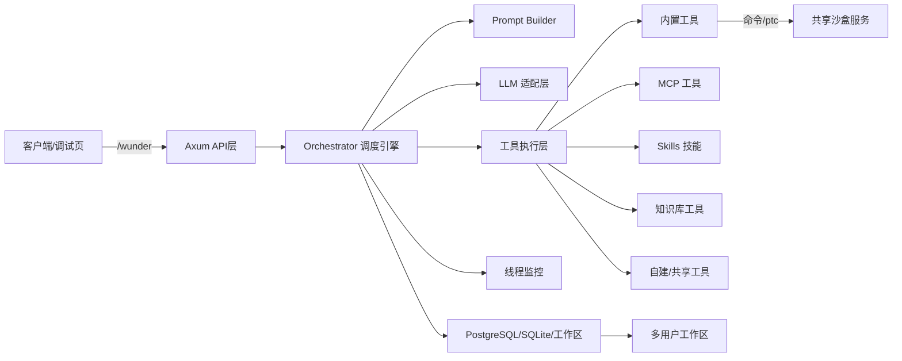
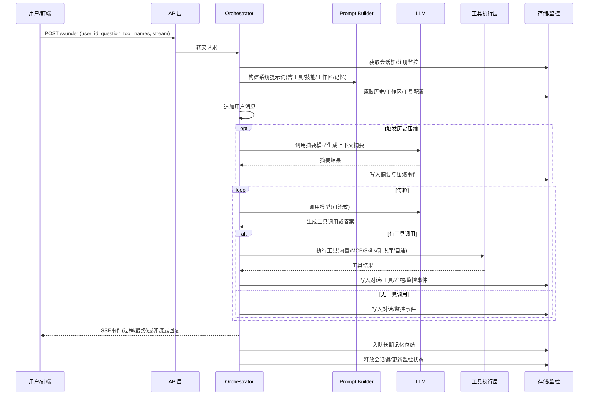
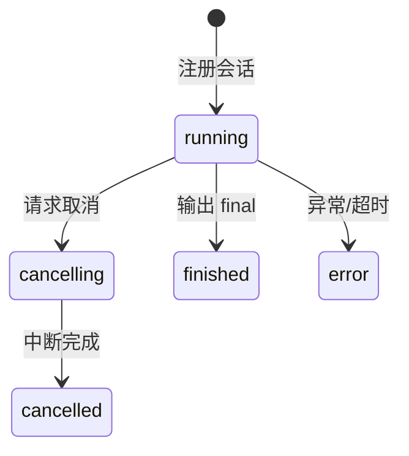
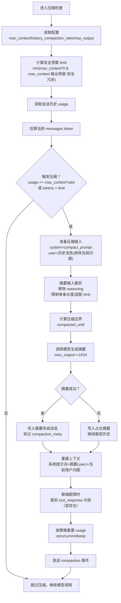

# 智能体调度平台的设计与实现——以 Wunder 为例

## 摘要
随着大模型逐步成为通用智能底座，面向复杂任务的“智能体 + 工具编排”正成为生产系统的主流形态。但在真实场景中，模型能力、工具协议、并发访问、上下文膨胀、安全隔离与可观测性之间存在显著矛盾。本文以 Wunder 智能体调度平台为对象，系统性阐述其设计与实现过程。平台基于 Rust/Axum 构建统一入口 `/wunder`，支持 SSE 流式与非流式交互，提供 MCP、Skills、知识库、自建/共享工具的统一编排；通过 Orchestrator 实现多轮工具调用与任务调度；结合多用户工作区、上下文压缩、长期记忆、监控与性能评估等能力形成完整工程化闭环。本文从需求分析、总体架构、核心流程、关键算法、数据与安全、性能评估与运维实践等方面进行深入分析，聚焦系统方法与实现机理，为同类智能体平台的工程落地提供可复用思路。

## 关键词
智能体调度；工具编排；多模型适配；MCP；SSE；上下文压缩；多用户工作区；A2A

## 1 引言
大模型在对话生成、规划推理与代码生成方面已具备强大能力，但单纯的模型生成难以覆盖真实业务中“需要外部能力、可验证结果、长链路协作”的需求。智能体系统通过工具调用将模型能力与外部世界连接，逐步形成“模型推理—工具执行—结果回填—再次推理”的闭环。然而，当工具来源多样（内置工具、MCP、技能包、知识库、自建工具等）且运行环境面向多用户并发时，传统“单一入口 + 简易工具表”的方案很难满足工程化要求。

Wunder 的设计目标是构建一个“智能体调度平台”：对开发者而言一切是接口（API/配置/工具），对模型而言一切皆工具（可调用、可组合、可治理）。平台需要在多模型、工具治理、并发隔离、上下文压缩、监控评估与安全策略之间取得平衡，并能够长期稳定运行。本文将展示 Wunder 在这些维度的系统设计思路与具体实现。

## 2 背景与挑战
### 2.1 多工具异构与协议割裂
现代智能体系统往往同时依赖本地工具、外部服务、技能流程和知识库。工具接口协议（文本标签、函数调用、JSON-RPC 等）差异明显，若缺乏统一抽象，将造成“模型无法稳定调用”“工具不可治理”的问题。

### 2.2 上下文膨胀与成本压力
随着多轮对话与工具调用积累，上下文 token 数持续增长，导致推理成本上升与响应延迟增大。既要保证对话连续性，又要控制上下文预算，是核心难题。

### 2.3 并发与隔离需求
智能体平台通常服务多个用户与多个会话，若缺乏并发控制与隔离机制，会导致资源争用、误用他人工作区或跨用户数据泄露。

### 2.4 可观测性与可运维性
生产系统需要定位错误、回放过程、测量性能与质量；同时应具备可取消任务、可追踪工具调用与资源占用的能力。

## 3 需求分析与设计目标
### 3.1 功能需求
1. 统一入口与流式交互：提供 `/wunder` 入口，支持 SSE 流式输出与非流式响应，能够输出中间过程与最终回复。
2. 多工具统一编排：集成内置工具、MCP 工具、Skills、知识库、自建/共享工具，并允许按 `tool_names` 选择性启用。
3. 多用户隔离与工作区持久化：每个 `user_id` 拥有独立工作区与历史记录，支持并发访问与长期资产沉淀。
4. A2A 标准接口：提供 `/a2a` JSON-RPC + SSE 入口，并通过 AgentCard 实现跨系统能力发现。
5. 监控与评估：支持线程监控、工具调用统计、吞吐量测试、性能采样与能力评估。
6. 长期记忆与上下文压缩：提供自动摘要与记忆注入能力，缓解上下文窗口限制。

### 3.2 非功能需求
- 高并发与高可用：同一 `user_id` 互斥执行，全局并发受控，断开 SSE 不影响任务继续执行。
- 可观测性：精细事件流记录、工具调用热力图、系统快照与历史回放。
- 安全性：工具权限白名单、路径隔离、沙盒执行与用户权限管理。
- 可维护性：模块边界清晰、配置可覆盖、日志易定位。
- 性能与长期运行：缓存优化、资源使用可控、能稳定运行多年。

### 3.3 设计原则
- 接口统一：对开发者暴露标准化 API，对模型统一抽象为工具。
- 可组合性：工具、技能、知识库可自由组合，便于形成可复用流程。
- 可治理性：工具启用、共享与权限策略可配置可审计。
- 高效与稳健：尽量减少上下文膨胀，优化 IO 与并发控制，保证长期运行稳定。

## 4 总体架构设计
### 4.1 架构概览
系统总体架构如下图所示，核心分为 API 层、调度引擎、Prompt Builder、LLM 适配、工具执行层、监控与存储等组件。



### 4.2 模块职责划分（概念层）
- API 层：统一入口、鉴权、SSE 推送与管理接口聚合。
- 调度引擎：会话生命周期管理、工具调用解析、上下文压缩与事件分发。
- 工具执行层：内置工具与外部工具的统一执行与权限约束。
- Prompt Builder：提示词模板加载、工具注入策略与缓存。
- 监控层：会话状态、事件流、系统快照与统计。
- 存储层：对话/工具/监控/记忆/评估等持久化。
- 工作区层：用户文件管理与隔离、搜索索引与树缓存。

### 4.3 运行时边界与依赖
平台依赖 LLM 服务端、MCP 服务端、共享沙盒服务与数据库。配置采取“基础配置 + 覆盖配置”分层，环境变量用于覆盖关键参数（如服务地址、端口、API key、数据库连接串）。在容器化部署中建议使用独立数据库与共享沙盒服务，以降低主服务负担并提升安全性。

## 5 核心流程与接口设计
### 5.1 请求-响应主流程
平台主流程体现“对话输入 → 调度 → 工具 → 回答”的多轮迭代机制，支持流式中间过程：



### 5.2 工具管理与注入流程
工具管理流程将“配置入口—工具清单—提示词注入—执行”形成闭环，确保工具治理与模型可用性一致。


### 5.3 会话状态机
会话状态由监控模块记录并可通过管理接口查询：



### 5.4 主要接口族设计
Wunder 以“统一入口 + 管理接口 + 标准协议”三类接口构成完整 API 体系：
- `/wunder`：统一入口，支持 SSE 与非流式响应。
- `/wunder/system_prompt`：系统提示词预览，便于调试与审计。
- `/wunder/tools`：工具清单（内置/MCP/技能/知识库/自建/共享）。
- `/a2a`：A2A JSON-RPC 标准接口，支持流式事件。
- `/.well-known/agent-card.json`：AgentCard 能力发现。
- `/wunder/admin/*`：模型、MCP、技能、工具、用户管理与监控。
- `/wunder/workspace/*`：工作区文件管理。
- `/wunder/doc2md/convert`、`/wunder/attachments/convert`：文档转 Markdown 与附件解析。

## 6 工具体系设计与实现
### 6.1 工具类型与命名空间
工具来源与命名策略统一为“命名空间 + 工具名”，确保可组合与可治理：

| 工具类型 | 命名形式 | 主要来源 | 典型用途 |
| --- | --- | --- | --- |
| 内置工具 | `工具名` / 英文别名 | 平台内置 | 文件/命令/计划面板 |
| MCP 工具 | `server@tool` | MCP 服务 | 外部服务能力 |
| A2A 服务工具 | `a2a@service` | A2A 配置 | 跨智能体协作 |
| Skills | `skill_name` | 技能包 | 固化流程 |
| 知识库 | `knowledge_base` | 知识库 | 本地检索 |
| 用户自建 | `user_id@tool` | 用户配置 | 个性化扩展 |
| 共享工具 | `owner_id@tool` | 共享配置 | 跨用户复用 |

### 6.2 工具调用协议与模式
平台支持 `tool_call` 与 `function_call` 两种模式：
- `tool_call` 通过文本标签 `<tool_call>...</tool_call>` 解析，适配更多模型。
- `function_call` 通过结构化 `tool_calls` 协议，稳定性更高。

两者均遵循“调用工具—结果回填—继续生成”的闭环。区别在于工具描述的注入方式：
- `tool_call` 模式在系统提示词中注入工具清单与调用协议。
- `function_call` 模式仅通过请求 `tools` 字段传入工具结构，提示词保持简洁。

### 6.3 内置工具执行与安全策略
内置工具包含“最终回复、a2ui、计划面板、a2a观察/等待、执行命令、ptc、列出文件、搜索内容、读取文件、写入文件、替换文本、编辑文件”等能力，并提供英文别名以提升模型兼容性。安全层面通过“命令白名单 + 路径白名单 + 路径黑名单”建立约束；命令执行与脚本运行可切换到共享沙盒服务，配合只读根文件系统与资源限制，从系统层减少破坏面。

### 6.4 MCP 工具协作
MCP 工具由外部服务提供，平台通过缓存的工具规格进行注入，避免提示词构建时触发远端发现。自托管 MCP 服务可将平台自身能力以工具形式对外暴露，实现双向互通。MCP 调用统一受超时控制，避免外部阻塞拖慢会话。

### 6.5 Skills 与知识库
Skills 以“规范描述 + 脚本入口”的形式固定流程，系统提示词引导模型先读取描述再执行。知识库以 Markdown 结构化为知识点，输入 `query/limit` 返回结构化片段，并支持候选筛选与重排序，同时缓存解析结果以降低重复 IO。

### 6.6 用户自建与共享工具
用户自建工具采用“配置即工具包”的思想，将 MCP 服务、技能、知识库与附加提示词统一写入配置，系统加载时完成清洗与规范化，确保共享工具是允许工具的子集。共享机制不是复制实现，而是共享配置与可用清单；其他用户需显式勾选后才可调用，保证隔离与可控复用。

### 6.7 A2A 服务工具
A2A 服务工具以 `a2a@service` 形式注入模型，用于跨智能体协作。平台内置“a2a观察/等待”工具用于状态追踪与结果等待，结合 A2A 协议可实现多智能体并行协作与任务分解。

## 7 调度引擎设计与实现
### 7.1 资源与并发控制
调度引擎负责会话生命周期控制。平台使用“同一用户互斥 + 全局并发上限”的双重策略：
- 同一 `user_id` 同时只能有一个运行中的会话，请求冲突时返回 429。
- 全局并发上限通过配置控制，超过上限的请求排队等待。
- 互斥锁采用 TTL 心跳机制，支持跨进程互斥，避免重复执行。

### 7.2 轮次驱动与工具回填
每轮调度包含：构建消息 → 调用模型 → 解析工具 → 执行工具 → 回填结果。调度引擎支持两种回填策略：
- `tool_call` 模式：将工具结果包装为“观察消息”，前缀标记用于下轮推理。
- `function_call` 模式：严格遵循工具调用协议，使用 tool_call_id 关联工具结果。

此外，调度支持 `skip_tool_calls` 快速终止，以及 `max_rounds` 防止无限循环；最终输出携带 `stop_reason` 说明终止原因。

### 7.3 SSE 事件流与持久化
调度过程中的事件（如 `llm_output_delta`、`tool_call`、`tool_result`、`final`）会持续写入监控系统；若 SSE 队列溢出，事件落库并支持断线续传。为控制事件量，系统合并连续的输出片段，以“流式可见 + 存储可控”的方式平衡实时性与成本。

### 7.4 异常处理与取消机制
模型调用与工具执行均具备超时控制与错误捕获。取消请求会标记会话为 `cancelling` 并轮询中断，通常在 200ms 内生效。异常路径通过统一错误码与结构化错误体返回，保证前端可解析并准确呈现。

### 7.5 调度流程伪代码
```text
function handle_request(request):
  acquire_session_lock(user_id)
  register_monitor(session_id)
  messages = load_history + build_prompt + user_question
  messages = maybe_compact(messages)
  loop until final or max_rounds:
    llm_output = call_llm(messages)
    if contains_tool_call(llm_output):
      tool_result = execute_tool(tool_call)
      append_tool_result(messages, tool_result)
      persist_tool_log()
    else:
      final_answer = llm_output
      break
  emit_final()
  enqueue_memory_summary()
  release_session_lock()
```

## 8 提示词构建与上下文管理
### 8.1 Prompt Builder 与缓存策略
提示词构建负责系统模板、工具清单、技能说明、工作区摘要与附加提示词的合成。为降低重复构建开销，系统采用多层缓存：
- 模板缓存：按模板更新时间缓存解析结果。
- 提示词缓存：按用户、工具清单、工作区树版本、语言等维度构建缓存 Key。
- 并发去重：同一 Key 下请求等待首个构建完成，避免并发重复计算。

### 8.2 工具注入与技能提示
- `tool_call` 模式下注入工具清单与调用协议，保障模型正确输出工具调用。
- `function_call` 模式保持提示词简洁，仅在请求中传入工具结构。
- Skills 元信息在两种模式下均注入，确保模型了解技能执行规则。
- 当启用 `a2ui` 输出工具时，系统自动移除“最终回复”工具，避免输出冲突。

### 8.3 Token 统计与上下文预算
平台强调“上下文占用量”而非计费消耗。token 估算采用近似策略（默认 4 bytes/token），对图片等多模态内容采用固定 token 估计，并在压缩前移除 reasoning 内容以保证预算精度。该策略在速度与精度之间取得平衡，为实时调度提供可操作的预算模型。

## 9 历史压缩与长期记忆
### 9.1 历史压缩算法
上下文压缩采用“双阈值触发 + 摘要生成 + 结果回填”的策略，核心流程如下：



压缩后上下文仅保留摘要与当前问题，摘要以“上下文摘要”前缀标记并写入历史。若生成失败，则使用兜底摘要文本确保流程继续。

### 9.2 长期记忆生成与队列
在最终回复完成后，系统会将会话加入长期记忆队列。记忆总结使用独立系统提示词，合并历史消息为单条用户内容，并写入持久化存储；同时记录任务日志用于追踪成功/失败状态与耗时。

### 9.3 记忆注入策略
长期记忆以“标签 + 时间前缀”的方式追加到系统提示词末尾，兼顾可读性与可控性。单用户记忆条数限制可避免提示词无限增长，确保模型输入的稳定性。

## 10 工作区与数据持久化
### 10.1 工作区管理
工作区是用户隔离与工具操作的基础。系统为每个 `user_id` 创建独立工作区，支持读取、搜索、批量移动/复制与压缩下载。工作区树与搜索索引均采用 TTL 缓存，降低频繁目录遍历的 IO 成本。

### 10.2 存储抽象与数据模型
平台将对话历史、工具日志、监控事件、会话锁、记忆记录与评估结果统一落入存储层，并通过抽象接口屏蔽不同数据库实现差异。这种设计使得运行环境可在不同数据库间切换，同时保持业务逻辑一致。

### 10.3 数据保留与清理
系统支持按保留期定期清理历史记录，并对流式事件设置 TTL 删除策略。日志占用统计与工作区占用统计采用缓存方式，避免频繁查询与磁盘扫描。

## 11 LLM 适配与周边能力
### 11.1 LLM 适配层
LLM 适配层基于 OpenAI-compatible API，支持多 provider 预设、超时与重试、流式与非流式调用，并对流式 usage 进行自动降级兼容。模型输出中的 `reasoning_content` 会被透传并可用于调试或上下文补充。

### 11.2 MCP 双向互通
平台既可作为 MCP 客户端调用外部服务，也可作为 MCP 服务端将自身能力对外暴露，形成双向互通能力。在管理端配置工具清单并缓存，可避免提示词构建时触发外部发现，提升稳定性与响应速度。

### 11.3 LSP 语义增强
LSP 管理器按“用户 + 项目根目录”维度启动语言服务器进程，支持定义/引用/符号/诊断等语义能力，并在文件写入后补充诊断摘要，提升模型对工程代码的理解能力。

### 11.4 文档解析与附件处理
文档解析能力支持多种格式并输出 Markdown，为知识库上传与附件解析提供统一能力。管理端与用户端均可调用该能力，保证文档处理流程一致。

## 12 可观测性与性能评估
### 12.1 监控事件模型与系统快照
监控系统记录会话状态与事件流，支持事件过滤、字段裁剪与批量写入。系统快照包含 CPU/内存/负载/磁盘/日志占用等指标，支持工具热力图与线程详情查询。

### 12.2 吞吐量测试
吞吐量测试按并发列表逐档执行，随机抽取题库问题，采样吞吐、延迟分桶与 token 使用情况，并将报告持久化以便历史对比与回放。

### 12.3 性能采样
性能采样支持并发条件下的提示词构建、文件操作、命令执行与日志写入耗时统计，为性能基线与瓶颈定位提供量化依据。

### 12.4 能力评估
能力评估支持用例集与维度组合，执行过程中提供 SSE 进度与单用例状态，结果落库并支持历史回溯与删除。该机制为模型质量回归提供工程化支撑。

## 13 安全与可靠性设计
### 13.1 鉴权与角色
管理员接口使用 API key 或管理员 Token，用户侧接口使用 Bearer Token。系统支持默认管理员账号与重置机制，`user_id` 可为虚拟标识，用于对话隔离而非注册身份。

### 13.2 工具权限与沙盒
文件访问默认限制在工作区，允许通过白名单放行技能/知识库目录；命令执行工具受命令白名单控制。沙盒模式下命令执行与脚本运行通过共享沙盒服务完成，支持只读根文件系统与资源限制，从系统层减少破坏面。

### 13.3 错误处理与恢复
模型调用与外部工具调用均具备超时控制与重试策略，异常路径通过统一错误码反馈；SSE 断开不会终止任务，事件可回放；监控与存储写入采用异步队列，避免阻塞主调度链路。

### 13.4 长期运行策略
通过缓存 TTL、日志裁剪、监控批量写入、工作区清理与存储保留策略，平台可在资源受限环境中保持长期稳定运行，为“10 年级别稳定性”提供工程保障。

## 14 运维实践与可扩展性
### 14.1 管理与用户前端实践
管理端提供调试与运维面板，支持模型配置、工具管理、监控、评估与性能测试；用户侧前端支持注册登录与工作区操作，语言切换与主题切换保持一致体验。

### 14.2 部署与配置策略
推荐采用容器化部署，主服务与数据库、沙盒服务隔离运行。配置采用“基础配置 + 覆盖配置”的分层策略，支持管理端动态调整并即时生效。为保证中文字体可用性，可挂载字体目录并通过字体配置与绘图配置文件完成补齐。

### 14.3 扩展方向
平台在现有结构下具备良好的扩展空间：可引入分布式调度器、向量检索引擎、细粒度 RBAC、审计与计量计费体系等，进一步提升企业级能力。

## 15 结论与展望
本文围绕 Wunder 智能体调度平台，从架构设计到关键实现进行了系统论述。平台通过统一入口、工具编排、上下文压缩、长期记忆与监控评估形成完整工程闭环，能够满足多用户、多工具、多模型的复杂需求，并具备良好的可维护性与可扩展性。未来工作可进一步增强知识库检索质量、完善技能执行与知识库持久化、引入更细粒度的权限控制与审计机制，并探索面向多集群的弹性调度与成本优化策略。