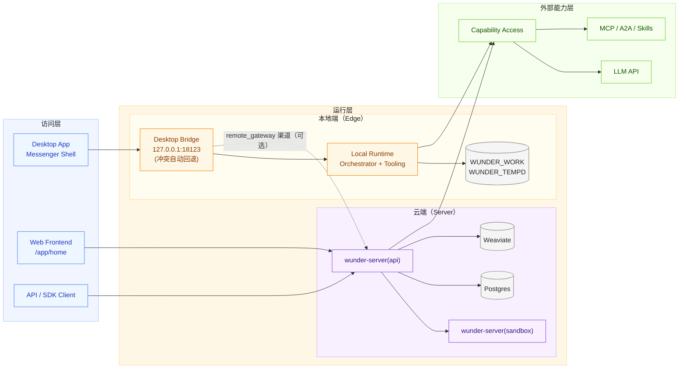
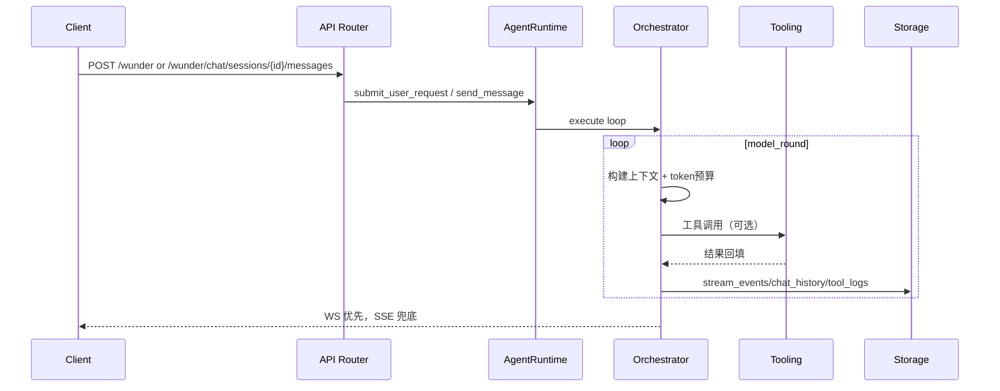
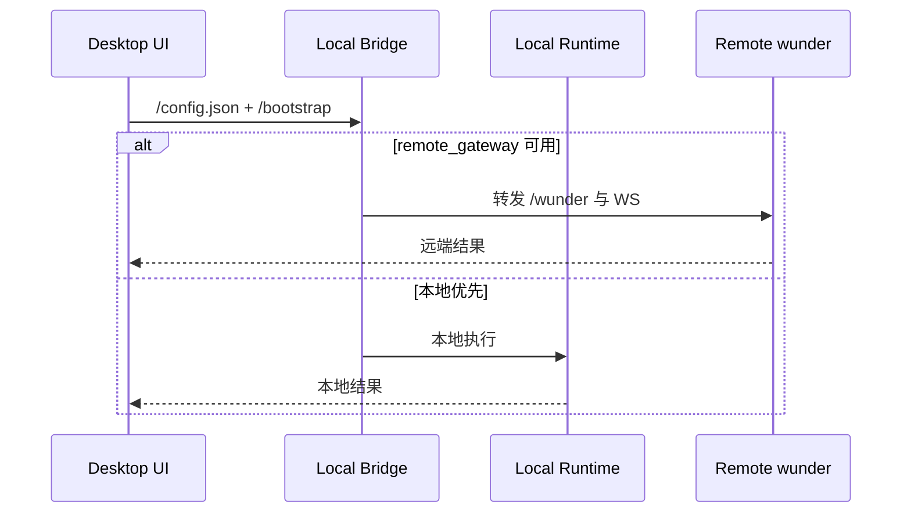

# wunder 架构设计（桌面重心版）

本文档基于当前仓库实现（`src/`、`wunder-desktop/`、`frontend/`）整理，面向研发与运维说明 wunder 在“通信/办公化”阶段的架构边界、核心链路和部署路径。

## 1. 产品定位与设计目标

当前 wunder 已从“单入口问答系统”演进为“通信/办公化智能体工作台”，重点是把用户体系聊天、智能体协作与工具编排放在统一架构内。

- 产品主线：用户↔智能体 + 用户↔用户（User World）双聊天域并存。
- 核心特色：**形态协同 / 租户治理 / 智能体协作 / 工具生态 / 接口开放**。
- 交互策略：WebSocket 优先，SSE 兜底。
- 运行策略：Desktop 优先交付，Server/CLI 协同复用同一调度内核。
- 部署策略：以“端云协同”作为后续主路径（本地体验 + 远端治理）。

一句话原则：对开发者一切是接口，对模型一切皆工具。

## 2. 多形态部署与端云协同

### 2.1 三种运行形态

| 形态 | 核心职责 | 默认存储 | 典型场景 |
| --- | --- | --- | --- |
| `wunder-server` | 多租户服务中枢，承载管理/渠道/网关/调度 | Postgres（主）+ Weaviate + 工作区卷 | 组织级部署、统一治理 |
| `wunder-cli` | 本地开发与自动化入口 | `WUNDER_TEMP/`（本地） | 调试、脚本化运行 |
| `wunder-desktop` | 用户侧主交付形态，通信/办公化 GUI | `WUNDER_TEMPD/` + `WUNDER_WORK/` | 日常聊天协作、端云协同 |

### 2.2 server 双模式二进制

同一 `wunder-server` 二进制支持两类模式：

- `api`：完整路由面（chat/core/admin/channel/gateway/a2a/mcp/user_world 等）。
- `sandbox`：沙盒执行面（命令与工具隔离执行）。

### 2.3 desktop 本地 bridge 运行面

`wunder-desktop` 通过本地 bridge 暴露用户前端与 API：

- 默认监听 `127.0.0.1:18123`（可通过参数覆盖）。
- 端口占用时自动降级到随机空闲端口，避免启动失败。
- 提供 `GET /config.json` 与 `GET /wunder/desktop/bootstrap` 作为前端引导入口。
- 提供 `GET/PUT /wunder/desktop/settings` 与 seed 同步接口（`/wunder/desktop/sync/seed/*`）。
- 本地 API 统一经过 desktop token 守卫，支持 header/query/ws 协议携带令牌。

### 2.4 desktop 端云协同路径

Desktop 默认本地优先，但可通过 `remote_gateway` 切到远端协同：

1. 本地启动后先构建本地 Orchestrator 与工具环境。
2. 开启 `remote_gateway` 且远端可用时，前端 API/WS 基址切到远端 `/wunder` 与 `/wunder/chat/ws`。
3. 远端不可用或地址非法时自动回退本地，不阻塞桌面使用。
4. 本地模式可自动使用本地 token；远端鉴权模式走正常登录/注册流程。

> 该策略保证“本地可用性优先 + 云端治理可接入”，是后续上线部署的基础。

### 2.5 部署拓扑（逻辑）



## 3. Rust 代码层架构

### 3.1 路由与模块边界

- `src/api/core.rs`：`/wunder` 统一入口、工具清单、系统提示词与附件转换。
- `src/api/chat*.rs`：智能体会话（会话管理、消息发送、恢复、取消、WS）。
- `src/api/user_world*.rs`：用户体系通信（联系人、群组、会话、消息、已读、事件流）。
- `src/api/user_agents.rs`：用户侧智能体应用管理。
- `src/api/user_tools.rs`：用户自建工具与共享工具。
- `src/api/desktop.rs`：桌面专属设置、文件区浏览与 seed 同步控制。
- `src/orchestrator/*`：调度核心（上下文、模型轮次、工具回填、事件落盘）。
- `src/services/*`：运行时服务（AgentRuntime、Workspace、Memory、Knowledge 等）。

### 3.2 全量路由与 desktop 精简路由

`src/api/mod.rs` 提供两套路由组合：

- `build_router`：完整服务面，包含 admin/channel/gateway/cron/a2a 等。
- `build_desktop_router`：桌面本地精简面，保留 chat/core/user_world/user_tools/workspace 等必要能力，显式收敛治理面与外部渠道面。

这使 Desktop 能共享同一编排能力，同时避免本地运行承担不必要服务面复杂度。

### 3.3 AppState 关键组件

启动时统一装配：

- 配置与存储：`ConfigStore`、`StorageBackend`。
- 调度与会话：`Orchestrator`、`AgentRuntime`、`MemoryStore`。
- 用户与权限：`UserStore`、用户工具管理、配额/访问控制。
- 可观测：`MonitorState`、吞吐/评估管理。
- 扩展能力：`WorkspaceManager`、`LspManager`、MCP 与知识库相关服务。

## 4. 核心业务链路

### 4.1 智能体聊天主链路（`/wunder` + `/wunder/chat/*`）



### 4.2 用户体系通信链路（`/wunder/user_world/*`）

```mermaid
flowchart LR
  U[用户] --> C1[contacts/groups]
  U --> C2[conversations]
  U --> C3[messages/read]
  C3 --> WS[user_world/ws or events]
  C3 --> FS[容器文件区附件]
  FS --> DL[/wunder/user_world/files/download]
```

该链路把“通信软件能力”纳入同一后端域：联系人、群聊、会话、消息、已读、流式事件与文件下载统一治理。

### 4.3 Desktop 端云协同链路



## 5. 用户侧前端重构（frontend）

用户侧前端已重构为统一 Messenger 壳，架构上体现“通信软件化”：

- 默认入口为 `/app/home`；Desktop 默认入口为 `/desktop/home`。
- `/app/*` 与 `/desktop/*` 复用同一 `MessengerView` 主壳，按模式切换能力与鉴权。
- 同壳承载：消息、用户世界、群聊、智能体、工具、文件、设置等业务面。
- Desktop 本地模式优先平滑启动；远端鉴权模式下走登录态并与本地 token 分离。

## 6. 工具体系与接口体系

### 6.1 多工具

调度层统一编排以下来源：

- 内置工具
- MCP 工具
- A2A 服务工具
- Skills 工具
- 知识库工具（字面/向量）
- 用户自建与共享工具

### 6.2 多接口

对外接口分层：

- 主入口：`/wunder`
- 会话域：`/wunder/chat/*`
- 用户通信域：`/wunder/user_world/*` + WS
- 工具与工作区域：`/wunder/tools`、`/wunder/workspace/*`
- 桌面域：`/wunder/desktop/*`
- 互操作域：`/a2a` 与 `/.well-known/agent-card.json`

## 7. 并发、隔离与轮次模型

- 会话互斥：`session_id` 粒度锁，避免同会话并发污染。
- 主线程粒度：`user_id + agent_id` 维护主线程与排队策略。
- 工作区隔离：用户作用域 + 容器作用域目录隔离。
- 轮次语义：用户轮次按消息计数；模型轮次按“模型动作（模型调用/工具调用/最终回复）”计数。

## 8. 存储与状态边界

- `StorageBackend` 屏蔽 Postgres/SQLite 差异。
- Server 以 Postgres 为主，SQLite 主要用于本地/测试场景。
- Desktop 默认本地 SQLite + 本地工作区，必要时与云端协同。
- 启动阶段自动建表与补齐索引，降低原型迭代迁移成本。

## 9. 安全与治理

- 鉴权：管理员 token/API key、用户 token、desktop token 分层治理。
- 工具安全：`allow_commands`、`allow_paths`、`deny_globs` 与 sandbox 联动。
- 配额治理：注册用户按等级配额，虚拟 user_id 可用于线程调用场景。
- 通信治理：WebSocket 为主链路，SSE 为降级兜底，事件可回放。

## 10. 可观测与性能要点

- 事件落盘：`stream_events` 作为展示、回放、排障统一事实源。
- 监控能力：会话状态机、吞吐压测、性能采样、能力评估。
- 运行策略：缓存 + worker + 异步写入，控制延迟与内存抖动。

## 11. 演进建议

- 新业务优先接入现有 Messenger 壳与 user_world 域，避免新增平行入口。
- 端云协同优先保证“本地可用性 + 云端治理一致性”，再扩展多集群调度。
- 新能力优先工具化接入 Orchestrator，保持主链路稳定与可回放。
