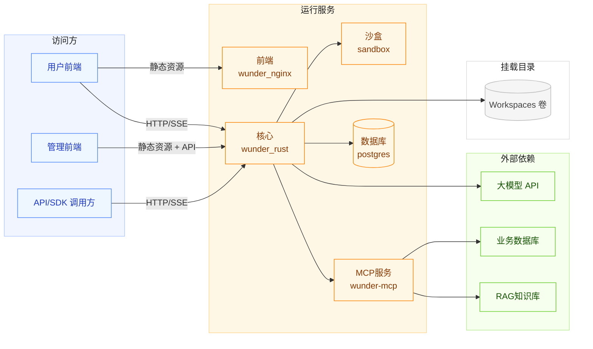
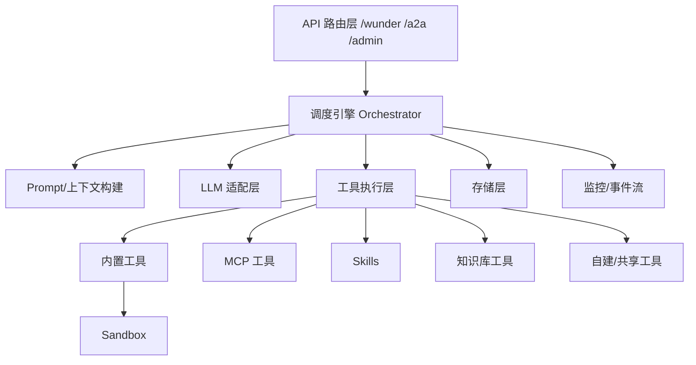
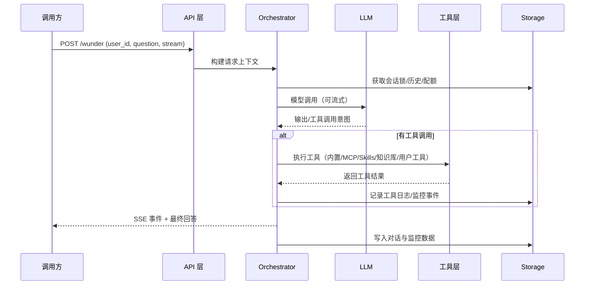

# wunder 架构设计

本文档基于当前仓库实现对 wunder 的部署形态、核心组件与关键流程进行架构说明，方便理解整体运行方式与后续扩展方向。

## 1. 设计目标

- 统一对外入口：通过 `/wunder` 承载多模型、多工具、多流程的统一调度。
- 多用户隔离：以 `user_id` 划分工作区与会话状态，支持虚拟用户与注册用户并存。
- 可观测与可治理：流式事件、监控、评估与额度治理形成闭环。
- 长期稳定：Rust + Axum 高性能服务、沙盒隔离与存储持久化满足长期运行。

## 2. 部署拓扑

### 2.1 Docker Compose 服务说明

> compose 中包含 6 个 service，其中 `wunder_frontend` 仅用于构建前端静态资源并退出，常驻运行服务为 5 个。

| 服务 | 角色 | 说明 |
| --- | --- | --- |
| wunder_rust | 核心 API 服务 | Rust + Axum，对外暴露 `/wunder`、`/a2a` 与管理端接口；同时挂载管理端静态页面。 |
| sandbox | 沙盒执行服务 | 同一 `wunder-server` 二进制以 `sandbox` 模式启动，提供工具执行隔离与资源限制。 |
| wunder-mcp | MCP 服务 | Python FastMCP 进程，提供数据库/知识库等 MCP 工具。 |
| postgres | 主存储 | 生产默认使用 PostgreSQL，SQLite 仅用于测试。 |
| wunder_nginx | 用户前端 | 仅提供 `frontend/dist` 静态资源的访问入口。 |
| wunder_frontend | 构建任务 | 只负责 `npm install && npm run build`，构建后退出。 |

## 3. 逻辑架构（Rust 内部）

### 3.1 核心模块划分

- API 层：`src/api/`，聚合 `/wunder`、`/a2a`、`/wunder/admin/*`、`/wunder/chat/*` 等接口路由。
- 调度层：`src/orchestrator/`，负责会话锁、上下文压缩、工具编排、SSE 事件流。
- 服务层：`src/services/`，包含 LLM/MCP/知识库/Skills/工具/历史/工作区等能力封装。
- 沙盒层：`src/sandbox/`，包含沙盒 client 与 server，负责命令/ptc 工具的隔离执行。
- 存储层：`src/storage/`，统一封装 PostgreSQL/SQLite 的历史、监控、额度、会话等持久化。
- 运维层：`src/ops/`，包含评估、吞吐压测、性能采样、监控等能力。
- 基础层：`src/core/`，提供配置、鉴权、i18n、token 统计、路径与安全策略等基础设施。
- 语言服务：`src/lsp/`，为工作区提供 LSP 诊断与索引能力，服务前端编辑与工具调用。

## 4. 请求与事件流程

- 事件流会记录 `tool_call`、`tool_result`、`final`、`token_usage`、`context_usage` 等事件。
- `context_usage` 统计的是上下文占用量，而非计费 token 消耗。

## 5. 功能组件说明

### 5.1 调度与上下文管理

- Orchestrator 统一处理对话轮次、工具选择、结果合并与异常控制。
- 上下文压缩：基于 token 预算触发摘要生成，保证长对话稳定。
- 长期记忆：会话结束后写入 MemoryStore，供后续检索与召回。

### 5.2 工具体系

- 内置工具：文件读写、目录列出、搜索与替换、命令执行、ptc、LSP 诊断等。
- MCP 工具：来自配置的外部工具清单，以 `server@tool` 方式调用。
- Skills：以 `SKILL.md` 描述输入输出与脚本入口，作为结构化流程工具。
- 知识库工具：基于本地 `knowledge/` 或外部检索服务，作为检索型工具调用。
- 自建/共享工具：用户级工具绑定与共享策略，按 `user_id@tool` 进行隔离。

### 5.3 沙盒执行

- 高风险工具（命令、ptc）在 `sandbox` 服务内执行，避免污染主服务进程。
- 沙盒支持 allow/deny 路径与命令策略，映射用户工作区到容器内目录。
- 可配置资源限制、超时、网络策略与只读根文件系统。

### 5.4 存储与状态

- PostgreSQL 为默认存储，SQLite 仅用于测试或轻量场景。
- 存储内容包括：会话与消息记录、工具/产物日志、监控事件、额度与用户数据。
- 会话锁用于限制同一 `user_id` 的并发冲突，保证一致性。

### 5.5 MCP 服务

- `mcp_server/` 为独立 FastMCP 服务，读取 `mcp_config.json` 生成工具清单。
- 当前内置数据库查询与知识库检索能力，可扩展更多工具。

### 5.6 前端与管理端

- 用户侧前端：`frontend/` Vue3，支持浅色/深色主题与功能广场。
- 管理端：`web/` 静态页面，集成监控、配置、评估等入口。
- Rust 服务挂载管理端静态资源；用户侧前端由 nginx 提供。

## 6. 关键目录与配置

| 目录/文件 | 作用 |
| --- | --- |
| `src/` | Rust 核心服务代码（API/调度/存储/工具/运维） |
| `config/wunder.yaml` | 主配置文件（模型、工具、策略、存储等） |
| `data/config/wunder.override.yaml` | 管理端写入的运行时覆盖配置 |
| `prompts/` | 系统/工具/记忆提示词模板 |
| `skills/` `EVA_SKILLS/` | Skills 目录（可扩展流程能力） |
| `knowledge/` | 本地知识库目录 |
| `mcp_server/` | MCP 服务与工具定义 |
| `frontend/` | 用户侧前端（Vue3） |
| `web/` | 管理端前端（HTML） |
| `workspaces/` | 用户工作区（docker 中映射到卷） |

## 7. 扩展与演进方向

- 新模型：配置 OpenAI 兼容的 LLM endpoint 与模型参数即可接入。
- 新工具：扩展内置工具、接入 MCP 服务或新增 Skill 目录。
- 新知识库：通过 MCP 或本地 `knowledge/` 扩展检索能力。
- 运维体系：扩展评估用例、吞吐压测与性能采样维度。
