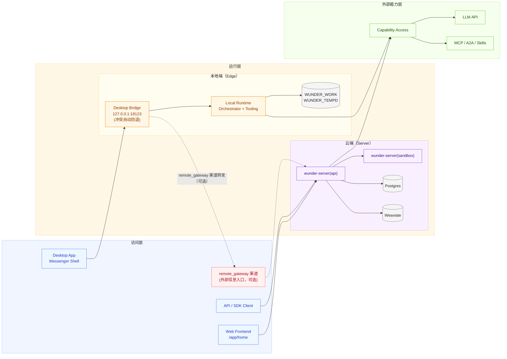
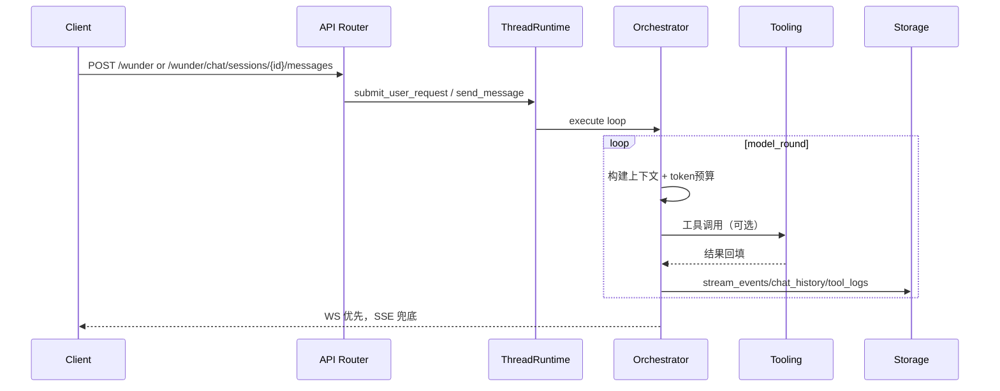
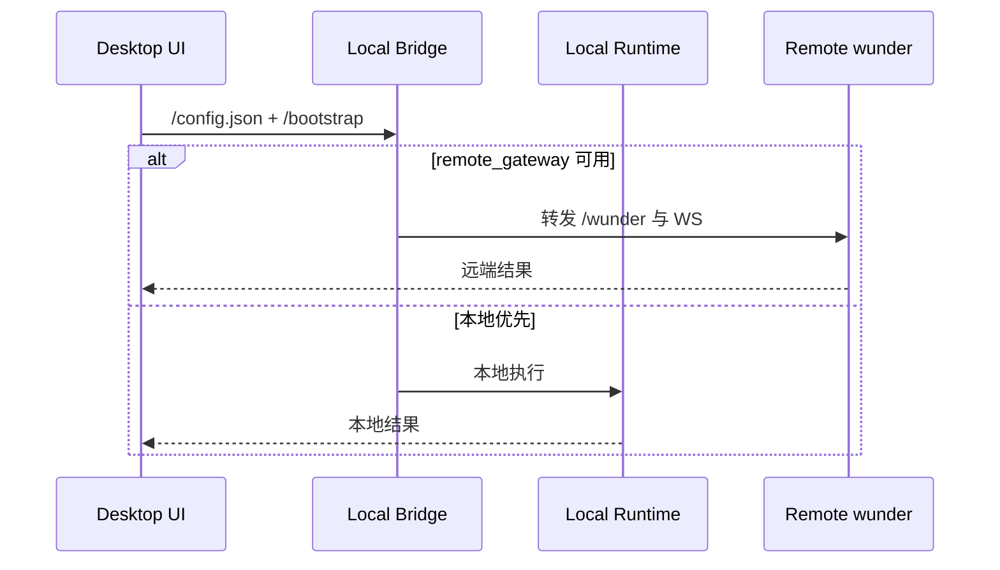

# wunder 架构设计（桌面重心版）

本文档基于当前仓库实现（`src/`、`desktop/tauri/`、`frontend/`）整理，面向研发与运维说明 wunder 在“通信/办公化”阶段的架构边界、核心链路和部署路径。

## 1. 产品定位与设计目标

当前 wunder 已从“单入口问答系统”演进为“通信/办公化智能体工作台”，重点是把用户体系聊天、智能体协作与工具编排放在统一架构内。

- 产品主线：用户↔智能体 + 用户↔用户（User World）双聊天域并存。
- 核心特色：**形态协同 / 租户治理 / 智能体协作 / 工具生态 / 接口开放**。
- 交互策略：WebSocket 优先，SSE 兜底。
- 运行策略：Desktop 优先交付，Server/CLI 协同复用同一调度内核。
- 部署策略：以“端云协同”作为后续主路径（本地体验 + 远端治理）。

一句话原则：对开发者一切是接口，对模型一切皆工具。

## 2. 多形态部署与端云协同

### 2.1 三种运行形态

| 形态 | 核心职责 | 默认存储 | 典型场景 |
| --- | --- | --- | --- |
| `wunder-server` | 多租户服务中枢，承载管理/渠道/网关/调度 | Postgres（主）+ Weaviate + 工作区卷 | 组织级部署、统一治理 |
| `wunder-cli` | 本地开发与自动化入口 | `WUNDER_TEMP/`（本地） | 调试、脚本化运行 |
| `wunder-desktop` | 用户侧主交付形态，通信/办公化 GUI | `WUNDER_TEMPD/` + `WUNDER_WORK/` | 日常聊天协作、端云协同 |

### 2.2 server 双模式二进制

同一 `wunder-server` 二进制支持两类模式：

- `api`：完整路由面（chat/core/admin/channel/gateway/a2a/mcp/user_world 等）。
- `sandbox`：沙盒执行面（命令与工具隔离执行）。

### 2.3 desktop 本地 bridge 运行面

`wunder-desktop` 通过本地 bridge 暴露用户前端与 API：

- 默认监听 `127.0.0.1:18123`（可通过参数覆盖）。
- 端口占用时自动降级到随机空闲端口，避免启动失败。
- 提供 `GET /config.json` 与 `GET /wunder/desktop/bootstrap` 作为前端引导入口；引导数据显式包含 `runtime_profile` 与 `runtime_capabilities`，用于标识当前 desktop 是否处于 `desktop_embedded` 模式以及 thread runtime / cron / channels / LAN overlay 等能力。
- 提供 `GET/PUT /wunder/desktop/settings` 与 seed 同步接口（`/wunder/desktop/sync/seed/*`）。
- 本地 API 统一经过 desktop token 守卫，支持 header/query/ws 协议携带令牌。

### 2.4 desktop 端云协同路径

Desktop 默认本地优先，但可通过 `remote_gateway` 切到远端协同：

1. 本地启动后先构建本地 Orchestrator 与工具环境。
2. 开启 `remote_gateway` 且远端可用时，前端 API/WS 基址切到远端 `/wunder` 与 `/wunder/chat/ws`。
3. 远端不可用或地址非法时自动回退本地，不阻塞桌面使用。
4. 本地模式可自动使用本地 token；远端鉴权模式走正常登录/注册流程。

> 该策略保证“本地可用性优先 + 云端治理可接入”，是后续上线部署的基础。

### 2.5 部署拓扑（逻辑）


```mermaid
flowchart LR
  subgraph Access["访问层"]
    direction TB
    ALock[" "]
    DesktopUI["Desktop App<br/>Messenger Shell"]
    WebUI["Web Frontend<br/>/app/home"]
    SDK["API / SDK Client"]
    RG["remote_gateway 渠道<br/>(外部信息入口，可选)"]

    ALock --> DesktopUI
    ALock --> WebUI
    ALock --> SDK
    ALock --> RG
  end

  subgraph Runtime["运行层"]
    direction TB
    RLock[" "]

    subgraph Edge["本地端（Edge）"]
      direction TB
      Bridge["Desktop Bridge<br/>127.0.0.1:18123<br/>(冲突自动回退)"]
      LocalRuntime["Local Runtime<br/>Orchestrator + Tooling"]
      LocalState[("WUNDER_WORK<br/>WUNDER_TEMPD")]
      Bridge --> LocalRuntime --> LocalState
    end

    subgraph Cloud["云端（Server）"]
      direction TB
      API["wunder-server(api)"]
      SBX["wunder-server(sandbox)"]
      PG[(Postgres)]
      VDB[(Weaviate)]
      API --> SBX
      API --> PG
      API --> VDB
    end

    RLock --> Edge
    RLock --> Cloud
  end

  subgraph External["外部能力层"]
    direction TB
    ELock[" "]
    ExtHub["Capability Access"]
    LLM["LLM API"]
    MCP["MCP / A2A / Skills"]
    ELock --> ExtHub
    ExtHub --> LLM
    ExtHub --> MCP
  end

  ALock --- RLock
  RLock --- ELock

  DesktopUI --> Bridge
  WebUI --> API
  SDK --> API
  Bridge -. remote_gateway 渠道转发（可选） .-> RG
  RG -.-> API
  LocalRuntime --> ExtHub
  API --> ExtHub

  linkStyle 0,1,2,3,9,10,11,14,15 stroke:transparent,fill:none;

  classDef hidden fill:transparent,stroke:transparent,color:transparent;
  classDef client fill:#eef6ff,stroke:#5b8ff9,stroke-width:1.2px,color:#1d39c4;
  classDef channel fill:#fff1f0,stroke:#ff7875,stroke-width:1.2px,color:#a8071a;
  classDef edge fill:#fff7e6,stroke:#fa8c16,stroke-width:1.2px,color:#873800;
  classDef cloud fill:#f9f0ff,stroke:#9254de,stroke-width:1.2px,color:#391085;
  classDef external fill:#f6ffed,stroke:#73d13d,stroke-width:1.2px,color:#135200;
  classDef storage fill:#f5f5f5,stroke:#8c8c8c,stroke-width:1.2px,color:#262626;

  class ALock,RLock,ELock hidden;
  class DesktopUI,WebUI,SDK client;
  class RG channel;
  class Bridge,LocalRuntime edge;
  class API,SBX cloud;
  class ExtHub,LLM,MCP external;
  class PG,VDB,LocalState storage;

  style Access fill:#f0f5ff,stroke:#adc6ff,stroke-width:1px,color:#1f1f1f;
  style Runtime fill:#fff7e6,stroke:#ffd591,stroke-width:1px,color:#1f1f1f;
  style Edge fill:#fffdf0,stroke:#ffd591,stroke-width:1px,color:#1f1f1f;
  style Cloud fill:#f9f0ff,stroke:#d3adf7,stroke-width:1px,color:#1f1f1f;
  style External fill:#f6ffed,stroke:#b7eb8f,stroke-width:1px,color:#1f1f1f;
```

## 3. Rust 代码层架构

### 3.1 路由与模块边界

- `src/api/core.rs`：`/wunder` 统一入口、工具清单、系统提示词与附件转换。
- `src/api/chat*.rs`：智能体会话（会话管理、消息发送、恢复、取消、WS）。
- `src/api/user_world*.rs`：用户体系通信（联系人、群组、会话、消息、已读、事件流）。
- `src/api/user_agents.rs`：用户侧智能体应用管理。
- `src/api/user_tools.rs`：用户自建工具与共享工具。
- `src/api/desktop.rs`：桌面专属设置、文件区浏览与 seed 同步控制。
- `src/orchestrator/*`：调度核心（上下文、模型轮次、工具回填、事件落盘）。
- `src/services/*`：运行时服务（ThreadRuntime、Workspace、Memory、Knowledge 等）。

### 3.2 全量路由与 desktop 精简路由

`src/api/mod.rs` 提供两套路由组合：

- `build_router`：完整服务面，包含 admin/channel/gateway/cron/a2a 等。
- `build_desktop_router`：桌面本地精简面，保留 chat/core/user_world/user_tools/workspace 等必要能力，显式收敛治理面与外部渠道面。

这使 Desktop 能共享同一编排能力，同时避免本地运行承担不必要服务面复杂度。

### 3.3 AppState 关键组件

启动时统一装配：

- 配置与存储：`ConfigStore`、`StorageBackend`。
- 调度与会话：`Orchestrator`、`ThreadRuntime`、`MemoryStore`。
- 用户与权限：`UserStore`、用户工具管理、配额/访问控制。
- 可观测：`MonitorState`、吞吐/评估管理。
- 扩展能力：`WorkspaceManager`、`LspManager`、MCP 与知识库相关服务。

## 4. 核心业务链路

### 4.1 智能体聊天主链路（`/wunder` + `/wunder/chat/*`）


```mermaid
sequenceDiagram
  participant C as Client
  participant API as API Router
  participant TR as ThreadRuntime
  participant O as Orchestrator
  participant T as Tooling
  participant S as Storage

  C->>API: POST /wunder or /wunder/chat/sessions/{id}/messages
  API->>TR: submit_user_request / send_message
  TR->>O: execute loop
  loop model_round
    O->>O: 构建上下文 + token预算
    O->>T: 工具调用（可选）
    T-->>O: 结果回填
    O->>S: stream_events/chat_history/tool_logs
  end
  O-->>C: WS 优先，SSE 兜底
```

### 4.2 用户体系通信链路（`/wunder/user_world/*`）

```mermaid
flowchart LR
  U[用户] --> C1[contacts/groups]
  U --> C2[conversations]
  U --> C3[messages/read]
  C3 --> WS[user_world/ws or events]
  C3 --> FS[容器文件区附件]
  FS --> DL[/wunder/user_world/files/download]
```

该链路把“通信软件能力”纳入同一后端域：联系人、群聊、会话、消息、已读、流式事件与文件下载统一治理。

### 4.3 Desktop 端云协同链路


```mermaid
sequenceDiagram
  participant UI as Desktop UI
  participant BR as Local Bridge
  participant RT as Local Runtime
  participant REM as Remote wunder

  UI->>BR: /config.json + /bootstrap
  alt remote_gateway 可用
    BR->>REM: 转发 /wunder 与 WS
    REM-->>UI: 远端结果
  else 本地优先
    BR->>RT: 本地执行
    RT-->>UI: 本地结果
  end
```

## 5. 用户侧前端重构（frontend）

用户侧前端已重构为统一 Messenger 壳，架构上体现“通信软件化”：

- 默认入口为 `/app/home`；Desktop 默认入口为 `/desktop/home`。
- `/app/*` 与 `/desktop/*` 复用同一 `MessengerView` 主壳，按模式切换能力与鉴权。
- 同壳承载：消息、用户世界、群聊、智能体、工具、文件、设置等业务面。
- Desktop 本地模式优先平滑启动；远端鉴权模式下走登录态并与本地 token 分离。

## 6. 工具体系与接口体系

### 6.1 多工具

调度层统一编排以下来源：

- 内置工具
- MCP 工具
- A2A 服务工具
- Skills 工具
- 知识库工具（字面/向量）
- 用户自建与共享工具

### 6.2 多接口

对外接口分层：

- 主入口：`/wunder`
- 会话域：`/wunder/chat/*`
- 用户通信域：`/wunder/user_world/*` + WS
- 工具与工作区域：`/wunder/tools`、`/wunder/workspace/*`
- 桌面域：`/wunder/desktop/*`
- 互操作域：`/a2a` 与 `/.well-known/agent-card.json`

### 6.3 蜂群协作协议（HPP）

蜂群协议将多智能体能力从“运行时临时编排”升级为“可分发、可移植、可治理”的资产：

- `HivePack`：蜂群组织层，包含蜂群元信息、协作规则与工蜂集合。
- `WorkerCard`：角色身份层，使用单文件描述角色定位、提示词、工具/技能依赖、预设问题与运行策略。
- `SkillPack`：能力沉淀层，包含流程化知识与可复用操作步骤。

在运行时，wunder 通过内置的**蜂群工具**组织协作，遵循统一四阶段闭环：

1. `discover`：识别任务子目标与角色能力。
2. `dispatch`：将子任务分派到工蜂并并行执行。
3. `wait`：等待依赖完成、处理阻塞与重试。
4. `merge`：汇总结果、消解冲突并输出统一交付。


```mermaid
flowchart LR
  Goal["用户目标"] --> Discover["discover: 任务识别与拆解"]
  Discover --> Dispatch["dispatch: 分派到工蜂A/B/C"]
  Dispatch --> Execute["并行执行: 技能/工具/MCP"]
  Execute --> Wait["wait: 同步与依赖等待"]
  Wait --> Merge["merge: 结果汇总与冲突消解"]
  Merge --> Deliver["最终交付"]
```

导入蜂群包时冲突策略遵循协议约定：

- `auto_rename_only`（默认）：重名资产自动改名并保留本地原资产。
- `update_replace`：同名蜂群/工蜂/技能按新包替换更新，适合升级发布。

## 7. 并发、隔离与轮次模型

- 会话互斥：`session_id` 粒度锁，避免同会话并发污染。
- 主线程粒度：`user_id + agent_id` 维护主线程与排队策略。
- 工作区隔离：用户作用域 + 容器作用域目录隔离。
- 轮次语义：用户轮次按消息计数；模型轮次按“模型动作（模型调用/工具调用/最终回复）”计数。

## 8. 存储与状态边界

- `StorageBackend` 屏蔽 Postgres/SQLite 差异。
- Server 以 Postgres 为主，SQLite 主要用于本地/测试场景。
- Desktop 默认本地 SQLite + 本地工作区，必要时与云端协同。
- 启动阶段自动建表与补齐索引，降低原型迭代迁移成本。

## 9. 安全与治理

- 鉴权：管理员 token/API key、用户 token、desktop token 分层治理。
- 工具安全：`allow_commands`、`allow_paths`、`deny_globs` 与 sandbox 联动。
- 配额治理：注册用户按等级配额，虚拟 user_id 可用于线程调用场景。
- 通信治理：WebSocket 为主链路，SSE 为降级兜底，事件可回放。

## 10. 可观测与性能要点

- 事件落盘：`stream_events` 作为展示、回放、排障统一事实源。
- 监控能力：会话状态机、吞吐压测、性能采样、能力评估。
- 运行策略：缓存 + worker + 异步写入，控制延迟与内存抖动。

## 11. 边界处理与稳定性保证

### 11.1 边界处理设计原则

wunder 的核心设计目标之一是在各种边界和异常情况下保持系统稳定运行，而非简单崩溃。系统遵循以下原则：
- **渐进式降级**：从完整功能逐步降级到最小可用功能，而非直接失败
- **可观测性优先**：所有异常和边界情况都要记录可追踪的事件
- **自动化恢复**：尽可能自动恢复，减少人工干预
- **用户友好**：向用户提供清晰的状态和恢复建议

### 11.2 上下文超限处理

采用渐进式上下文压缩策略而非简单截断：

| 压缩层级 | 策略 | 损失程度 | 适用场景 |
|---------|------|---------|---------|
| **Level 0** | 保留完整上下文 | 无 | 上下文充足时 |
| **Level 1** | 移除工具中间结果摘要 | 低 | 工具结果可以重新获取 |
| **Level 2** | 摘要化历史消息 | 中 | 保留语义，损失细节 |
| **Level 3** | 移除早期轮次 | 高 | 仅保留最近 N 轮 |
| **Level 4** | 仅保留 system prompt + 当前请求 | 极高 | 紧急降级 |

关键设计约束：
- **线程冻结原则**：即使上下文压缩，system prompt 也保持不变（首次确定后冻结）
- **记忆隔离**：长期记忆只在线程初始化时注入一次，不参与动态压缩
- **可观测性**：每次压缩都会记录 `context_compaction` 事件，包含压缩策略和损失评估

### 11.3 网络中断处理

#### WebSocket 连接中断
- **客户端侧**：立即显示"连接断开"提示，启动指数退避重连（1s, 2s, 4s, 8s, 16s, 最大 32s）；重连成功后发送 `resume` 请求获取错过的事件
- **服务端侧**：保持会话状态 300s，缓存未推送的事件，客户端重连时补发

#### SSE 连接中断
作为 WebSocket 的兜底方案，处理逻辑类似：
- 自动重连（浏览器原生支持）
- 通过 `Last-Event-ID` 恢复事件流
- 服务端保留最近 1000 条事件用于恢复

#### 模型 API 调用失败
| 失败类型 | 重试策略 | 降级方案 |
|---------|---------|---------|
| **网络超时** | 重试 3 次，指数退避 | 提示用户稍后重试 |
| **速率限制** | 等待 `retry-after` 头，最长等待 60s | 进入队列排队 |
| **认证失败** | 立即失败，不重试 | 提示管理员检查配置 |
| **模型错误** | 重试 1 次（如果是临时错误） | 切换到备用模型（如果配置） |
| **上下文超限** | 不重试，触发压缩逻辑 | 自动压缩后重试 |

### 11.4 工具执行失败处理

#### 工具失败分类
| 失败类别 | 说明 | 可重试 |
|---------|------|--------|
| **参数错误** | 工具参数验证失败 | ❌ 需要模型修正参数 |
| **权限拒绝** | 工具不在白名单或审批被拒 | ❌ 需要用户授权 |
| **临时错误** | 文件锁、网络波动等 | ✅ 自动重试 |
| **系统错误** | 工具执行引擎异常 | ✅ 有限重试 |

#### 工具结果防爆机制
为了防止工具输出过大导致上下文超限，wunder 实现了三层防护：
```
工具执行 → Layer 1: 执行层预算裁剪 → Layer 2: MCP 二次压缩 → Layer 3: 入模前最终检查
```

- **Layer 1: 执行层预算**：time_budget_ms（最大执行时间）、output_budget_bytes（最大输出字节）、max_commands（最大命令数）
- **Layer 2: 输出裁剪策略**：≤预算完整返回；预算 < 大小 ≤ 2×预算保留头部 50% + 尾部 50%；> 2×预算保留头部 25% + 尾部 25% + 省略中间
- **Layer 3: 信号反馈**：裁剪后的结果会附带元数据，模型可以根据这些信号决定是否缩小查询范围、分页获取结果或接受当前信息继续

#### 原子写入策略
涉及文件写入的工具（写入文件、应用补丁）采用临时文件 + 原子替换策略：
1. 写入临时文件：file.tmp
2. fsync 确保数据落盘
3. 原子重命名：file.tmp → file
4. 如果失败，删除临时文件，保留原文件

这确保了：不会出现半写入的文件、并发写入不会互相破坏、失败时可以回滚

### 11.5 会话与线程异常处理

#### 会话状态机
wunder 的会话有明确的状态转换：
```
idle → running → waiting_approval/waiting_user_input → idle
  ↓        ↓
error  cancelled
```

#### 异常状态恢复
| 异常状态 | 触发条件 | 恢复策略 |
|---------|---------|---------|
| **`system_error`** | 未捕获的系统异常 | 记录错误日志，会话重置为 idle |
| **`cancelled`** | 用户主动取消 | 立即停止执行，清理资源 |
| **`timeout`** | 执行超过配置时间 | 停止执行，返回部分结果（如果有） |
| **`approval_pending`** | 等待用户审批 | 暂停执行，等待用户决定 |

#### 线程状态同步
通过 `thread_status` 事件实时同步线程状态：running/waiting_approval/waiting_user_input/idle/not_loaded/system_error

### 11.6 并发与排队处理

#### 主线程排队
每个 `user_id + agent_id` 只有一条主线程，忙时新请求进入队列：
```
新请求 → 主线程空闲？→ 是 → 立即执行
              ↓ 否
         进入 agent_tasks 队列
              ↓
         主线程空闲后依次执行
```

#### 队列配置
| 配置项 | 说明 | 默认值 |
|-------|------|--------|
| `max_queue_size` | 最大队列长度 | 100 |
| `queue_timeout_s` | 排队超时时间 | 3600 |
| `max_concurrent_sessions` | 最大并发会话数 | 10 |

#### 优先级策略
队列中的任务按以下优先级排序：
1. 管理员请求（最高）
2. 带 `priority: high` 的请求
3. 普通请求
4. 带 `priority: low` 的请求

### 11.7 数据一致性保证

#### 数据库事务
所有涉及多个表的操作都使用数据库事务

#### 幂等性设计
| 接口 | 幂等键 | 说明 |
|------|--------|------|
| `/wunder/chat/messages` | `client_msg_id` | 重复消息不会重复处理 |
| 渠道 Webhook | `message_id` | 重复推送不会重复处理 |
| 工具调用 | `tool_call_id` | 重复调用不会重复执行 |

#### 最终一致性
对于异步操作（如渠道消息投递），采用 outbox 模式保证最终一致性：
1. 业务操作 + outbox 记录写入（同一事务）
2. 后台 worker 从 outbox 读取
3. 执行外部操作
4. 成功后标记 outbox 为完成
5. 失败则重试（带指数退避）

### 11.8 资源泄漏防护

#### 超时机制
| 资源类型 | 超时配置 | 清理行为 |
|---------|---------|---------|
| 工具执行 | `tool_timeout_s` | 终止进程，释放资源 |
| 模型调用 | `llm_timeout_s` | 取消请求，释放连接 |
| WebSocket 连接 | `ws_idle_timeout_s` | 关闭空闲连接 |
| 临时文件 | `temp_dir_ttl_h` | 定期清理过期文件 |

#### 连接池管理
- 数据库连接：使用连接池，自动回收空闲连接
- HTTP 客户端：连接复用，限制最大并发数
- WebSocket：限制单用户最大连接数

#### 内存保护
- 工具输出限制：防止单个工具返回过大结果
- 上下文压缩：自动控制内存占用
- 会话历史裁剪：数据库层面限制历史消息数

## 12. 演进建议

- 新业务优先接入现有 Messenger 壳与 user_world 域，避免新增平行入口。
- 端云协同优先保证“本地可用性 + 云端治理一致性”，再扩展多集群调度。
- 新能力优先工具化接入 Orchestrator，保持主链路稳定与可回放。

