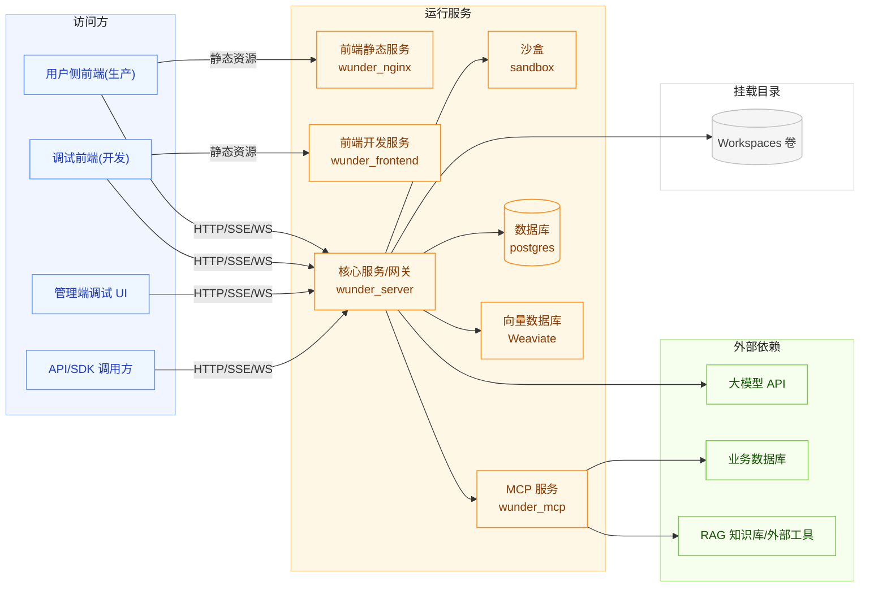
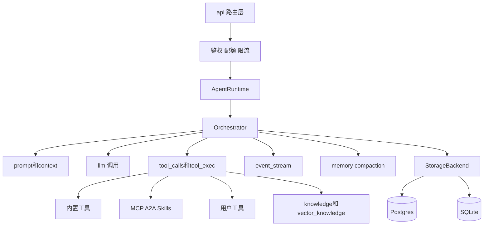
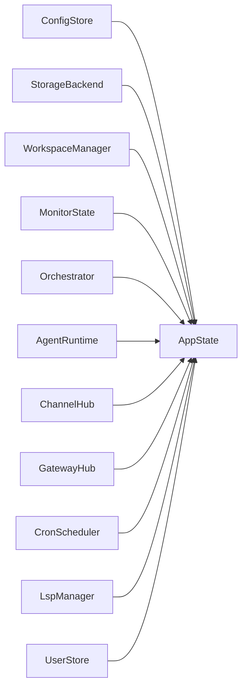
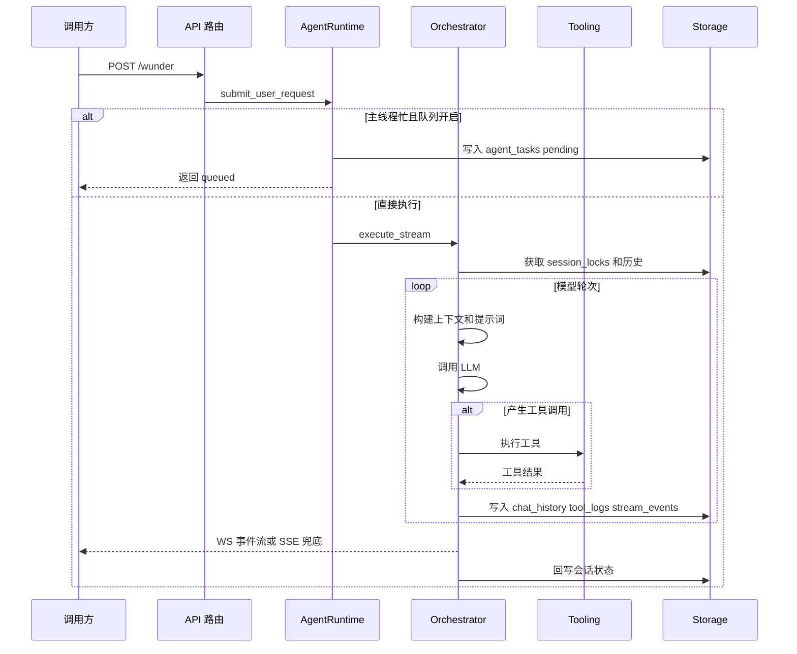
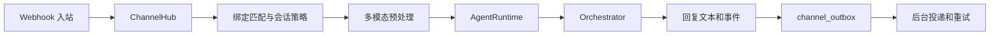
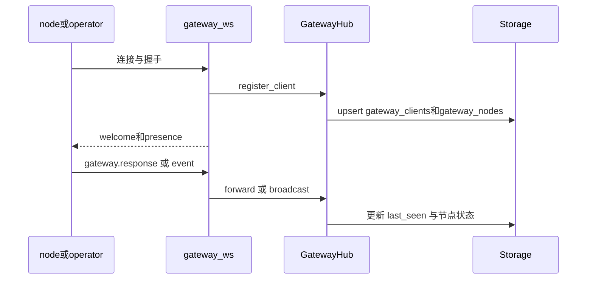
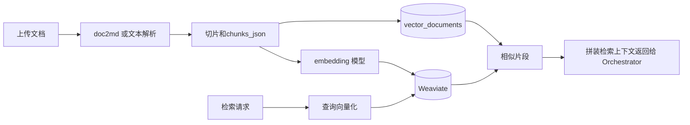
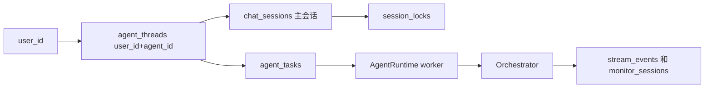

# wunder 架构设计（代码对齐版）

本文档根据当前 src 目录实现整理，面向研发和运维说明系统的部署形态、模块职责、核心链路、并发隔离和治理机制。

## 1. 设计目标

- 统一入口。通过 wunder 系列接口统一承接模型、工具、知识库、技能与工作区能力。
- 接口抽象。对开发者来说能力是接口，对模型来说能力是工具。
- 多用户并发。支持虚拟用户和注册用户并存，保证高并发下的稳定执行。
- 可观测可治理。请求、工具、模型和事件可追踪可回放。
- 长期可维护。模块清晰，配置可更新，存储后端可切换。

## 2. 部署拓扑和运行模式

### 2.1 双模式二进制

同一个 wunder-server 二进制支持两种运行模式。

- api 模式。对外提供聊天、管理、渠道、网关、A2A 和 MCP 路由。
- sandbox 模式。提供独立沙盒接口，用于命令执行和 ptc 隔离。

### 2.2 典型服务组件

#### 部署拓扑图

- wunder_server。Rust Axum 主服务。
- sandbox。沙盒执行服务，运行相同二进制的 sandbox 模式。
- postgres。主数据库。
- weaviate。向量检索后端。
- frontend。用户侧前端。
- web。管理端静态页面。
- wunder_mcp。可选外部 MCP 服务。系统内部同时也提供 wunder mcp 路由。

## 3. Rust 内部逻辑架构

### 3.1 模块边界

#### 逻辑架构图

- api。HTTP 和 WebSocket 路由层，按 chat、admin、channel、cron、evaluation、gateway、a2a 等领域拆分。
- orchestrator。调度核心，负责上下文、模型轮次、工具编排、事件流和会话锁。
- services。业务服务层，包括 AgentRuntime、Workspace、Memory、Tools、MCP、Cron、UserStore、Knowledge。
- channels。外部渠道接入和回包，包括 WhatsApp、Feishu、QQ 及出站队列。
- gateway。控制平面，维护节点连接状态并支持 node invoke。
- storage。StorageBackend 抽象以及 Postgres 和 SQLite 实现。
- ops。监控、压测、性能采样、评估运行器。
- lsp。按用户和项目根动态维护 LSP 客户端。
- sandbox。沙盒服务端逻辑。

### 3.2 AppState 组装

#### AppState 依赖关系

AppState 在启动时统一组装以下核心组件。

- ConfigStore
- StorageBackend
- WorkspaceManager
- MonitorState
- Orchestrator
- AgentRuntime
- UserStore
- UserToolStore
- UserToolManager
- ChannelHub
- GatewayHub
- CronScheduler
- ThroughputManager
- EvaluationManager
- LspManager
- MemoryStore

## 4. 三条关键运行链路

### 4.1 聊天主链路

#### 对话链路时序图

1. 请求进入 wunder 或 chat 路由。
2. resolve_user 完成身份解析，支持 token、api key 和虚拟 user_id。
3. AgentRuntime 解析主会话和排队策略。
4. Orchestrator 获取会话锁并构建上下文，执行模型和工具循环。
5. 事件流写入监控和 stream_events，最终回答落库并返回。

### 4.2 渠道接入链路

#### 渠道链路图

1. 渠道 webhook 进入 channel 路由。
2. ChannelHub 完成账号校验、绑定匹配、会话策略选择。
3. 多模态前处理执行 asr、ocr、地理描述和附件桥接。
4. 调用 Orchestrator 生成回复。
5. 回复写入 channel_outbox 并由后台 worker 重试投递。

### 4.3 网关控制平面链路

#### 网关控制平面图

1. 客户端连接 gateway ws 路由并完成握手。
2. GatewayHub 注册连接并维护 role、caps、commands、node 索引。
3. 管理端可拉取 presence，执行 node invoke。
4. 网关事件广播和慢客户端驱逐由 Hub 统一处理。

## 5. 工具体系和知识体系

### 5.1 工具池构成

系统在请求时按权限和配置动态汇总工具池，来源包括：

- 内置工具
- MCP 工具
- A2A 服务工具
- Skills 工具
- 字面知识库工具
- 向量知识库工具
- 用户自建工具和共享工具

### 5.2 知识库双轨模型

#### 向量知识库流程图

- 字面知识库。按文档章节解析和候选召回，可结合 LLM 重排。
- 向量知识库。文档切片后写入向量后端，关系库存储元数据和切片结构。

## 6. 并发和隔离模型

### 6.1 隔离维度

- 会话执行隔离。粒度为 session_id。
- 主线程隔离。粒度为 user_id 加 agent_id。
- 工作区隔离。粒度为 user 作用域和容器作用域。
- 身份隔离。虚拟用户可调用调度链路，注册用户参与账号治理和配额治理。

### 6.2 锁和队列

#### 会话锁与排队关系图

- session_locks 负责会话互斥和心跳续租。
- 开启 agent_queue 时，忙请求进入 agent_tasks，由后台循环消费。

### 6.3 轮次模型

- 用户轮次。用户每次发送消息增加一轮。
- 模型轮次。模型每次动作增加一轮，动作包含模型调用、工具调用或最终回复。

## 7. 存储与状态设计

- 通过 StorageBackend 屏蔽后端差异，支持 postgres、sqlite、auto。
- 启动阶段自动建表、补列和补索引，减少迁移阻塞。
- 写入采用异步队列降低主链路阻塞。
- cleanup_retention 按天清理核心日志表，并保护管理员数据。

## 8. 安全与治理

- 管理接口采用 api key 和管理员 token 双通道鉴权。
- 执行安全由 allow_commands、allow_paths、deny_globs 和 sandbox 共同约束。
- 渠道接入支持 token 或签名校验。
- 网关支持 origin 限制、trusted proxy 和节点 token 策略。
- 配额和访问控制由用户、组织、工具和智能体访问策略共同完成。

## 9. 可观测性与性能要点

- MonitorState 维护会话状态机和事件回放。
- 流式默认使用 WebSocket，SSE 作为兜底。
- 断线后可基于事件 id 恢复。
- 内置吞吐压测、性能采样和评估体系。
- 多处采用缓存和后台 worker 控制延迟与内存抖动。

## 10. 后续扩展建议

- 新能力优先按工具方式接入，避免破坏调度主链路。
- 新通信能力优先接入 WebSocket，SSE 仅保底。
- 数据层扩展优先新增表和索引，保持原型阶段迭代速度。
