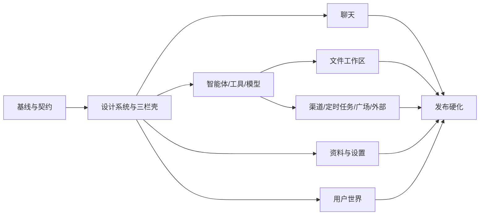

# 桌面版本实现方案

> 版本：0.1
>
> 编制日期：2026-09-29
>
> 适用范围：`frontend-slint/` 原生桌面前端、`crates/wunder-desktop` 原生 façade，以及为桌面能力补齐的 runtime 服务接口。

## 1. 目标与边界

桌面端的目标是成为与服务器网页端同一套用户工作台的原生实现。用户在网页端能完成的普通用户工作，应在桌面端使用相同的导航概念、字段含义、状态反馈、错误处理和数据结果完成；桌面端可以使用更强的本机文件和本地运行时能力，但不能因为换成 Slint 就退化成演示页。

本方案只覆盖普通用户侧。管理后台仍由 `web/` 维护，不移植到桌面端。

桌面端明确不提供以下页面和写操作：

- 蜂群、Beeroom、群体协作任务、团队运行、蜂群资产编排页面。
- 编排、工作流编排、编排态专用画布及其创建、编辑、发布入口。
- 为了兼容旧路由而在桌面端显示空白页面或伪造数据。

聊天中如果后端历史包含协作或编排事件，只以折叠的只读事件或文本状态展示，不显示创建、调度、拖拽和发布控件。桌面端访问这些深链路时统一回到聊天首页，并显示“该功能仅在服务器网页端提供”的明确提示。

桌面端仍保留普通用户相关页面：聊天、智能体、工具、文件工作区、用户与群组消息、蜂巢广场中的普通资产浏览、渠道、定时任务、个人资料、通用设置、提示词设置、桌面运行时设置、帮助、外部应用和嵌入式聊天。

## 2. 现状基线与差距

### 2.1 代码现状

当前桌面入口是 `frontend-slint/src/main.rs`，无参数启动使用 `wunder_desktop::NativeDesktop` 同进程调用 runtime；不经过本机 HTTP/WebSocket，也不拉起 bridge 子进程。界面主要由以下 Slint 文件组成：

- `ui/main.slint`：三栏壳、聊天、导航和弹层。
- `ui/entity_pages.slint`：智能体、工具、系统设置。
- `ui/dock.slint`：聊天右侧线程与工作目录 dock。
- `ui/message.slint`、`ui/composer.slint`：消息和输入区。
- `src/native_chat.rs`、`src/native_pages.rs`、`src/workspace_ui.rs`：事件投影和 façade 调用。

现有 `NativeDesktop` 已具备会话、消息流、停止、排队、智能体基础 CRUD、工具目录、模型基础配置、运行时设置、LAN 基础设置、个人统计/头像和工作区列表/预览/新建文件能力。现有冒烟脚本已经覆盖这些能力的部分持久化和安全边界。

### 2.2 页面差距矩阵

| 用户能力 | 网页端现状 | 桌面端现状 | 目标 |
| --- | --- | --- | --- |
| 三栏工作台 | `MessengerView`、`MessengerMiddlePane`、右侧 dock，含折叠、覆盖层和响应式布局 | 有基础三栏和聊天 dock，页面切换只有少量 section | 导航、列表、中间内容、右侧上下文面板的结构和状态与网页端一致 |
| 聊天 | 长历史虚拟窗口、Markdown、工具/资源卡片、提示词预览、反馈、复制、附件、语音、截图、重试、日志 | 纯文本块、基础流式、停止、截图/录音、复制，富文本和多数面板缺失 | 先保证真实流式和原文完整，再补齐网页端可见交互和可降级富文本 |
| 智能体 | 默认/自有/共享列表、分组、搜索、创建、编辑、删除、导入导出、头像、工具、问题、沙箱、审批和运行信息 | 列表、创建、编辑部分字段和工具勾选 | 对齐普通用户可用字段；不引入蜂群发布和编排入口 |
| 工具 | 内置、MCP、技能、知识库、共享工具的目录、详情和管理面板 | 只读工具目录和分类搜索 | 目录、详情、权限和本地资源管理分层实现 |
| 文件工作区 | 独立工作区页面，目录树、列表、上传、下载、创建目录、删除、预览、编辑 | 仅聊天右侧目录、预览和有限创建 | 独立文件页与聊天右 dock 共用同一安全 façade |
| 用户世界 | 联系人、单聊、群组、公告、未读、实时消息和文件 | 未接入 | 移植文本消息、联系人、群组和实时恢复；不做蜂群群组 |
| 渠道 | 渠道账号、动态配置、二维码登录、绑定、运行日志、重连 | 未接入 | 完成账号和绑定管理，密钥始终掩码 |
| 定时任务 | 列表、创建、编辑、启停、立即运行、删除、运行记录 | 未接入 | 完整 CRUD 和运行详情，分页/限量显示 |
| 个人资料 | 资料编辑、邮箱、单位、密码、头像、等级、额度、统计图 | 统计和头像选择，缺少编辑和图表 | 对齐字段和确认边界；本地模式按可用能力降级 |
| 设置 | 通用偏好、语言、主题、发送键、字体、提示词包、帮助、模型高级字段 | 基础模型、语言、工作目录、LAN | 分为通用、提示词、模型、运行时、系统、帮助六个设置面板 |
| 广场/普通资产 | 普通资产浏览、详情、导入/发布能力由网页端控制 | 未接入 | 仅移植不涉及蜂群编排的浏览和明确授权操作 |
| 外部应用/嵌入聊天 | 外部链接鉴权和嵌入聊天入口 | 未接入 | 支持安全深链和最小权限嵌入 |
| 管理端 | `web/` 独立维护 | 不属于桌面目标 | 保持不移植 |

### 2.3 当前设计问题

1. `ui/main.slint` 用数字 `section` 驱动页面，页面增加后会继续形成条件分支堆积，无法表达深链、权限和页面状态。
2. 原生 façade 只覆盖少量页面，缺少与网页 API 对应的 typed request/response、分页游标、错误码和能力声明。
3. Slint 页面中存在直接写死的中文文案，无法与网页端中英文文案、字段校验和错误反馈保持一致。
4. 工具、文件、设置和聊天各自拥有局部状态，没有统一的 loading/empty/error/saving/permission-denied 状态模型。
5. 现有工作区能力只能服务聊天右栏，不能复用到独立文件页；文件写操作、上传下载、移动复制和删除也没有完整 façade。
6. 网页端的实时 replay、补水、未读和恢复语义没有形成桌面各页面可复用的控制器。

## 3. 对齐原则

### 3.1 四级对齐定义

每个页面按四级验收，不能只完成视觉截图：

| 级别 | 含义 | 验收内容 |
| --- | --- | --- |
| L0 路由对齐 | 能从桌面导航和深链进入对应页面 | 路由、返回、刷新恢复、非法入口处理 |
| L1 视觉对齐 | 信息层级和布局与网页端一致 | 标题、列表、卡片、按钮位置、间距、颜色状态、空态和错误态 |
| L2 交互对齐 | 相同操作产生相同用户可见结果 | 表单校验、确认、取消、禁用、分页、搜索、键盘和焦点 |
| L3 数据对齐 | 相同账号和数据得到相同业务结果 | 后端权限、持久化、实时事件、重启恢复、错误码和审计 |

生产验收要求所有普通用户页面达到 L2；涉及保存、删除、运行、渠道登录和文件操作的页面必须达到 L3。仅有截图或本地演示数据不得标记为完成。

### 3.2 桌面特有约束

- 使用 `frontend-slint/` 和 `crates/wunder-desktop`，不新增 WebView、Electron 或 Tauri 用户界面壳。
- 新能力通过强类型 Rust façade 进入 Slint；业务规则继续放在 runtime 服务，不在 UI 回写数据库或复制一套调度链路。
- 网络读取、文件扫描、事件解码和模型请求全部在后台执行；UI 线程只应用增量投影。
- 使用有界事件通道。默认容量 128，按 16–33 ms 合并 token 增量；不得为了补齐视觉效果改成整段消息重建或无界缓存。
- 长列表必须分页、限量或虚拟化；默认一次最多 100 条，目录、日志、运行记录和工具目录都必须有上限。
- 原始消息、附件和复制内容必须完整保留；富文本只影响展示，解析失败必须降级为可读纯文本。
- 破坏性操作必须有明确对象、后端权限检查和二次确认；前端确认不能替代鉴权。

## 4. 目标信息架构

### 4.1 统一页面模型

将 `section: int` 收敛为可序列化的页面状态：

```text
messages       聊天与会话
agents         智能体目录与编辑
tools          工具、技能、MCP、知识库
files          文件工作区
users          联系人与单聊
groups         普通用户群组
plaza          普通资产浏览
channels       渠道账号与绑定
cron           定时任务
settings       设置壳
profile        个人资料
workspace      独立工作区（可作为 files 的深链别名）
external       外部应用
embed-chat     嵌入聊天
```

桌面导航不注册 `swarms`、`orchestrations`。网页端对应深链在桌面端由路由守卫拦截，并返回 `messages` 页面和提示状态。

### 4.2 三栏壳

桌面壳保持网页端的空间关系：

1. 左侧 rail：头像、主要导航、更多菜单、当前页高亮和键盘焦点。
2. 中栏：当前 section 的搜索、筛选、列表、分页和新增入口。
3. 主栏：聊天、表单、详情、编辑器或消息内容。
4. 右 dock：只在有上下文时出现，例如聊天线程/工作区、智能体运行信息、文件预览或日志。

宽度不足时，中栏和右 dock 变成带遮罩的覆盖层；收起/展开不改变当前选中对象。所有页面都必须支持 760×580 的最小窗口，不允许内容被按钮或弹层裁切。

### 4.3 页面状态机

每个页面实现同一套状态字段：

```text
idle -> loading -> ready
                  ├─ empty
                  ├─ error (可重试)
                  └─ permission-denied
ready -> saving -> ready | error
ready -> refreshing -> ready | error
```

状态消息必须同时体现：正在做什么、是否可以继续操作、失败后怎么重试。切页或对象切换后，旧请求不得覆盖新页面；卸载时取消订阅、请求和计时器。

## 5. 目标模块结构

### 5.1 Slint UI

建议按下列结构拆分，`main.slint` 只保留窗口装配、页面路由和全局弹层：

```text
frontend-slint/ui/
  app_shell.slint              三栏壳、rail、响应式覆盖层
  design_tokens.slint          颜色、间距、字号、状态色、圆角
  primitives.slint              Button、IconButton、Field、Tabs、Toast、Dialog
  page_chat.slint               会话、消息、输入、线程日志
  page_agents.slint             目录、详情、编辑和权限字段
  page_tools.slint              工具分类、详情、MCP/技能/知识库
  page_files.slint              树、列表、编辑器、预览和传输进度
  page_world.slint              联系人、单聊、群组
  page_channels.slint           渠道账号、动态表单、绑定和日志
  page_cron.slint               任务列表、编辑器、运行记录
  page_plaza.slint              普通资产浏览
  page_settings.slint           通用、提示词、模型、运行时、系统、帮助
  page_profile.slint            资料、统计、额度和编辑弹层
  page_external.slint           外部应用和嵌入聊天
  message_blocks.slint          纯文本、段落、列表、代码块的最小渲染
```

所有控件必须优先使用 Slint 标准控件；自定义控件只解决网页端确实存在的交互。每次 UI 修改都必须用 `slint-viewer --check` 编译检查并用 `slint-viewer --screenshot` 查看渲染结果，不能只依赖 `cargo check`。

### 5.2 Rust UI 控制器

在 `frontend-slint/src/` 建立页面控制器和投影模型：

```text
page_state.rs          页面枚举、加载状态、错误和导航
shell_controller.rs    rail、中栏、覆盖层、快捷键、深链
chat_controller.rs     会话、流式事件、补水、滚动、输入
agent_controller.rs    智能体列表和编辑状态
tool_controller.rs     工具目录及管理子面板
file_controller.rs     目录、分页、传输、预览和编辑
world_controller.rs    联系人、群组、消息实时订阅
channel_controller.rs  渠道账号、绑定、日志和 QR 状态
cron_controller.rs     任务、运行记录和定时刷新
settings_controller.rs 设置面板和模型表单
profile_controller.rs  资料与统计
projection.rs          通用 bounded queue、版本和请求作用域
```

控制器只负责把 typed façade 结果投影到 Slint model，不直接拼接 SQL、HTTP URL 或权限判断。

### 5.3 NativeDesktop façade

按领域扩展 `crates/wunder-desktop`：

```text
native_chat.rs
native_agents.rs
native_tools.rs
native_files.rs
native_world.rs
native_channels.rs
native_cron.rs
native_settings.rs
native_profile.rs
native_external.rs
```

每个领域提供：

- secret-free 的列表/详情 DTO；密钥只接受写入，不回传明文。
- 明确的输入校验、权限检查、错误码和分页参数。
- 与 server API 相同的服务层语义；需要新增能力时先补 runtime service，再由 façade 调用。
- 可在无 UI 的 Rust 测试中验证的契约方法。

## 6. 页面实现要求

### 6.1 聊天页

必须保留当前已经验证的原生流式链路，同时补齐网页端的可见交互：

- 最近会话搜索、新建、选择、重命名、归档、排序、当前智能体标识和运行状态。
- 消息按用户轮次和模型轮次投影；助手消息显示状态、耗时、速度、Token、工具调用和上下文占用摘要。
- 支持纯文本、段落、换行、无序/有序列表和代码块；表格、图片、复杂 HTML、公式和语法高亮可以降级，但复制必须使用原文。
- 工具调用、文件、资源、提示词预览、线程日志、错误和重试均有稳定卡片或折叠块。
- 输入支持发送键设置、停止、重试、复制、附件、截图、录音转写、思考等级和上下文用量提示。
- 流式输出期间可以输入、复制、滚动和切换右 dock；用户离开底部时不得强制滚回最新消息。
- 断线、刷新和进程重启后按 snapshot/replay/持久化历史恢复，不能用收到完整回复后再播放打字动画代替真实流式。游标与 durable/ephemeral 语义按第 13 节对齐《聊天流式管线根治方案》。

验收重点：连续 50,000 字节以上输出不丢字；事件通道满载时不丢正文；停止只停止目标线程；同线程排队顺序正确；切换线程不会串写消息。

### 6.2 智能体页

- 中栏提供默认、自有、共享分组、搜索和空态；共享项为只读时必须明确原因。
- 详情编辑包括名称、描述、系统提示词、模型、头像、工具、预设问题、沙箱容器、审批模式、技能预览、静默和偏好设置。
- 支持创建、保存、删除、导入/导出普通智能体配置；删除和导入覆盖必须二次确认。
- 已开始线程的系统提示词遵循后端冻结规则；编辑新模板不得改写历史线程的 system prompt。
- 进入聊天使用当前智能体时，创建的会话必须绑定正确 `agent_id`。

不实现蜂群成员管理、团队运行、编排节点、发布到蜂群等操作。

### 6.3 工具页

分成四个递进能力层，避免先做一个不可用的大表单：

1. 目录层：内置、MCP、技能、知识库、共享工具分类、搜索、描述和能力状态。
2. 详情层：输入 schema、权限来源、依赖、最近错误和调用限制。
3. 管理层：MCP 服务增删改、技能文件浏览/编辑/上传/导出、知识库配置/文档/分块/重建索引/测试。
4. 智能体绑定层：在智能体编辑器中选择工具，显示来源和不可选原因。

所有目录和历史记录分页或限量；MCP 密钥、共享工具凭据和连接信息不得进入 Slint model 日志或错误弹窗。

### 6.4 文件工作区

独立 `files/workspace` 页面与聊天右 dock 使用同一 façade 和权限边界：

- 左侧目录树，主区文件列表，右侧预览/编辑；目录和文件均支持搜索、刷新和分页。
- 支持创建目录、创建文本文件、上传、下载、重命名、移动、复制、删除和文本编辑保存。
- 文本预览至少支持 32 KiB 上限、二进制提示、截断标志和复制；大文件不整体读入 UI。
- 所有路径以当前用户/智能体容器为根，拒绝绝对路径、父目录、路径前缀、符号链接越界和外部打开越界。
- 上传、下载、保存显示进度和失败原因；破坏性操作显示对象名称和恢复建议。

### 6.5 用户与群组页

这是普通用户消息，不是蜂群：

- 联系人按单位/搜索/在线状态分页；支持打开单聊、未读数和最近消息。
- 群组支持创建、成员摘要、公告、退出/删除边界和群聊消息。
- 使用 user world 的统一实时事件、游标、重连和 replay；切换页面只释放本页订阅，不关闭共享连接。现有 `event_id` 游标按第 13 节迁移为 `change_seq` durable 游标。
- 文件只显示安全下载或工作区引用，不在 UI 中暴露服务器绝对路径。

### 6.6 渠道页

- 渠道账号列表、启用状态、配置状态和最后错误。
- 按渠道 schema 动态生成字段；密码、令牌、共享密钥始终掩码，留空表示保留原值。
- 支持新增、编辑、删除、绑定智能体/用户/群组、运行日志、重连和二维码登录流程。
- QR 会话必须有超时、取消、刷新和已过期状态；轮询在离开页面时停止。
- 后端必须再次执行权限和租户边界检查，不能仅依赖桌面端隐藏按钮。

### 6.7 定时任务页

- 任务列表分页、搜索和启用状态；创建/编辑支持一次性和重复计划、时区、目标智能体、消息和删除后策略。
- 支持启用、停用、立即运行、删除；所有操作显示进行中、成功、失败和冲突状态。
- 运行记录分页显示状态、触发来源、耗时、摘要、错误和运行 ID。
- 离开页面停止刷新计时器；恢复页面时以服务端状态为准，不使用旧的运行标记覆盖终态。

### 6.8 个人资料页

- 复刻网页端身份卡、统计卡、额度/等级摘要和指标区域；图表在原生端使用轻量绘制或表格降级。
- 支持用户名、邮箱、单位、头像编辑；密码字段只在后端允许时出现。
- 本地模式没有服务器单位或密码能力时显示只读/不可用原因，不能伪造保存成功。
- 头像选择、统计刷新和资料保存均需要错误反馈；退出登录必须确认并清理本地会话令牌。

### 6.9 设置页

设置壳固定包含以下面板：

| 面板 | 必须能力 |
| --- | --- |
| 通用 | 语言、主题、发送键、字号、通知/开发者开关（按能力显示） |
| 提示词 | 语言包/提示词包选择、创建、删除、分段编辑、预览、保存和只读系统包提示 |
| 模型 | LLM、Embedding、ASR、TTS、图片、视频的类型字段；提供方、模型、地址、密钥留空保留原值；默认项；上下文探测和语音列表探测 |
| 运行时 | 工作目录、Python/Git/rg 路径状态、容器根、重置工作状态 |
| 系统 | LAN 开关、节点名称、监听/发现端口、允许/拒绝网段、黑名单、共享密钥、节点列表和刷新 |
| 帮助 | 本地版本、数据目录说明、快捷键、诊断导出和安全边界 |

模型编辑字段必须根据模型类型显示，保存前做类型和范围校验；UI 永远不回显已有密钥。重置工作状态只清理运行状态、队列和临时投影，保留资产、配置、文件和历史，并要求明确确认。

### 6.10 广场、外部应用和嵌入聊天

- 广场只实现普通资产浏览、详情、导入或明确授权的发布动作；任何蜂群、编排、团队运行入口不进入桌面。
- 外部应用使用已有深链鉴权语义，token 不出现在普通日志；无效 token、无权限和已过期链接都有可读错误页。
- 嵌入聊天复用聊天投影和停止/恢复语义，隐藏不必要的导航，但保留复制、错误和退出入口。

## 7. 分阶段节点与交付门

每个节点完成后必须通过本节点的退出条件，未通过不得并入下一节点的生产分支。时间为工作量估算，不是承诺日期。

### N0：基线、契约和视觉冻结

**前置**：无。

**交付**：

- 网页端页面/section/状态/操作矩阵，明确排除蜂群和编排。
- 1280×800、1024×768、760×580 三种尺寸的网页参考截图和桌面空态/加载态/错误态截图目录。
- 页面路由枚举、能力矩阵、DTO 草案、错误码映射、i18n 文案键清单。
- `slint-viewer --check`、截图检查、原生冒烟和 façade 契约测试的统一命令说明。

**退出条件**：产品/开发共同确认页面清单；所有“待移植”项都有对应 runtime service 或明确依赖；排除项在导航、路由和测试清单中均有断言。

### N1：设计系统与三栏壳

**前置**：N0。

**交付**：

- `design_tokens.slint`、通用控件、Toast/Dialog/Confirm、表单校验和页面状态组件。
- 类型化页面导航、深链解析、返回和无效 section 回退。
- 左 rail、中栏、主栏、右 dock 的响应式覆盖层、键盘焦点和最小窗口布局。
- 中英文文案键和统一错误呈现。

**退出条件**：所有目标页面可以进入空态；三种窗口尺寸不溢出；关闭/重开侧栏后选中对象不变；截图与网页参考的结构差异通过评审；不存在数字 section 的新增业务分支。

### N2：聊天生产化

**前置**：N1；复用现有原生流式链路。

**交付**：

- 会话管理、长历史窗口、最小 Markdown、工具/资源/错误/日志卡片、附件和输入设置。
- bounded event projection、snapshot/replay/补水、停止和队列状态统一控制器。
- 线程搜索、重命名、归档、复制原文和恢复测试。

**退出条件**：连续流式、停止、排队、刷新恢复、切换线程、滚动和复制用例全部通过；50,000 字节以上正文无丢失；UI 单次投影应用 p95 ≤ 5 ms；事件队列不超过容量的 75% 且无丢字；已有原生 smoke 指标不出现超过 10% 的内存或延迟回退。

### N3：智能体、工具和模型配置

**前置**：N1；N0 中的 runtime contract 已确认。

**交付**：

- 智能体目录/编辑/删除/导入导出/普通权限字段。
- 工具目录、详情、MCP/技能/知识库管理的第一批可用子面板。
- 模型类型化编辑、默认项、密钥保留、上下文和语音探测。

**退出条件**：创建、保存、删除、权限拒绝、冻结 prompt、密钥不回显和重启恢复全部有自动化测试；工具和模型列表分页/限量；无蜂群或编排控件。

### N4：文件工作区

**前置**：N1；N3 提供智能体/容器选择。

**交付**：独立 files 页面、聊天 dock 复用、目录树、上传下载、编辑保存、移动复制删除、预览和进度。

**退出条件**：工作区全操作在容器根内闭合；越界、符号链接和外部打开拒绝；32 KiB 预览和大文件限制有效；刷新/重启后数据一致；1000 项目录不会一次性生成无限 UI 节点。

### N5：个人资料与设置完整化

**前置**：N1、N3。

**交付**：资料编辑、统计/额度降级、通用设置、提示词设置、运行时设置、LAN、帮助和重置工作状态。

**退出条件**：每个面板有 loading/empty/error/saving；敏感字段不回显；重置范围符合定义；本地能力不可用时显示原因；中英文文案完整；设置跨进程重启回读。

### N6：用户世界

**前置**：N1；runtime user world 服务契约和实时协议已确认。

**交付**：联系人、单聊、群组、公告、未读、实时连接、断线重连和历史分页。

**退出条件**：普通用户单聊/群聊可完整收发；重复事件去重；断线后按游标恢复；离开页面不会写入已卸载状态；无蜂群命名或团队调度语义。

### N7：渠道、定时任务、广场和外部入口

**前置**：N1、N3、N5；后端接口和权限审计通过。

**交付**：渠道动态表单/QR/绑定/日志、定时任务及运行记录、普通广场资产、外部应用和嵌入聊天。

**退出条件**：每个破坏性动作有确认和后端鉴权；QR/轮询可取消；定时任务和日志分页；深链鉴权失败不泄露 token；蜂群/编排路由断言通过。

### N8：稳定性、兼容性和发布

**前置**：N2–N7 全部退出。

**交付**：Win7 x86、Ubuntu 18.04 x86_64/ARM64 的构建、截图回归、原生 smoke 扩展、诊断导出、升级和配置迁移说明。

**退出条件**：x64 开发回归、Win7 真机和两种 Linux 目标至少各完成一次；无 bridge 子进程和本机监听；启动、首帧、会话可用和内存建立同口径基线；发布包可离线启动并完成首次配置；所有 P0/P1 缺陷关闭。

依赖关系如下：



## 8. Runtime 与接口实施规则

### 8.1 先补深层能力

如果网页端已有 API 而桌面 façade 没有，按以下顺序实现：

1. 在 runtime service 中复用或抽出业务规则、权限和存储操作。
2. 为 server API 和 NativeDesktop 共用 request/response 结构或字段映射。
3. 在 `crates/wunder-desktop` 增加 secret-free typed façade。
4. 在 `frontend-slint/src` 增加后台控制器和投影。
5. 最后接 Slint 页面和交互。

不得在 UI 中直接拼接数据库字段、复制 server handler 或通过页面特判绕过权限。

### 8.2 分页、缓存和并发

- 列表接口必须接收 `limit`、游标或 offset，并返回 `total/next_cursor/has_more` 中至少一种可判断继续加载的信号。
- 默认上限：会话/消息/目录 100，工具目录 200，日志/运行记录 200；更大数据通过继续加载。
- 只缓存当前页面和最近对象；缓存有容量和版本，切换用户或工作目录立即失效。
- 保存操作串行化，同一对象的旧响应不得覆盖新响应；失败时恢复 durable 状态并显示错误。
- 事件订阅使用页面作用域和订阅 ID；释放订阅不取消后端下一轮任务，显式停止才取消目标执行。

### 8.3 安全边界

- NativeDesktop DTO 默认不包含 API key、密码、共享密钥、Authorization、真实本机绝对路径或远端内部地址。
- 文件 façade 统一做容器根约束、规范化和符号链接检查；“打开本机应用”只接受已校验的工作区文件。
- 桌面控制、录音、屏幕截图、LAN 发现等系统能力必须有显式能力开关和可观测错误。
- 所有保存、删除、运行、绑定和重置操作由 runtime 再次鉴权，并记录可诊断的操作结果。

## 9. 测试与验收清单

### 9.1 UI 编译和视觉

- 每次 Slint 修改运行 `slint-viewer --check`，检查导入、属性、焦点和标准控件签名。
- 每个页面在 1280×800、1024×768、760×580 生成浅色截图并人工检查；截图需覆盖 ready、loading、empty、error、saving、permission-denied、弹层和窄窗口。
- 检查文本溢出、中文字体回退、键盘焦点、Tab 顺序、Enter/Escape 行为、禁用态和高对比状态。
- UI 线程不执行文件 IO、网络、模型请求、完整 Markdown 解析或大列表排序。

### 9.2 原生功能

- `cargo check --release -p wunder-frontend-slint` 和必要的目标架构构建。
- 扩展 `frontend-slint/scripts/check-native.py`：页面导航、表单校验、CRUD、重启回读、流式、停止、队列、文件越界、密钥保留、无监听、无 bridge 子进程。
- 为每个 façade 添加 Rust 契约测试：未知对象拒绝、权限拒绝、分页边界、幂等保存、并发旧响应、敏感字段投影。
- 对用户世界、渠道和 cron 增加固定事件夹具，验证 replay、去重、重连和终态。

### 9.3 网页对照

每个完成节点都使用同一账号、同一数据快照分别操作网页和桌面，记录：

1. 入口和标题是否对应。
2. 相同字段是否以相同含义和单位显示。
3. 相同操作后的服务端数据是否一致。
4. 刷新、重启、断线和权限变化后的结果是否一致。
5. 桌面降级是否只影响展示，不影响原文、保存结果和安全边界。

### 9.4 性能门槛

- 以现有原生 smoke 指标建立新基线，所有高频链路同环境重复至少 3 次取中位数。
- 聊天 token 应用按帧合并；UI 投影 p95 ≤ 5 ms，事件队列必须有界且不得丢正文。
- 长历史和大目录使用虚拟/分页窗口；单次页面更新不得复制全部历史消息。
- 稳态内存相对基线增加不得超过 10%，除非新增能力有明确容量说明。
- 首帧、可交互、会话可用、滚动和文件刷新都要单独计时，不能只报告构建成功。
- Win7 x86 以软件渲染实机结果为准；当前 Windows 主机的模拟运行不能替代真机验收。

## 10. 发布前总验收

以下条件全部满足才可将桌面版本标记为生产候选：

- 普通用户目标页面达到 L2；涉及数据写入的页面达到 L3。
- 左 rail、中栏、主栏、右 dock 在三种窗口尺寸下与网页信息架构一致；蜂群和编排不出现在桌面导航、路由、空态或测试夹具中。
- 聊天真实流式、停止、排队、恢复、复制和长消息通过；没有用完整回复后的动画替代流式。
- 智能体、工具、模型、文件、资料、设置、用户世界、渠道和 cron 的成功/失败/权限/空态均可操作且有反馈。
- 所有敏感字段不回显，文件路径不越界，破坏性操作有确认，后端鉴权和审计通过。
- 中英文文案、键盘焦点、最小窗口、字体、截图和高频渲染通过检查。
- x64、Win7 x86、Ubuntu 18.04 x86_64/ARM64 构建和运行回归通过；无 bridge 子进程、无意外监听端口。
- `docs/功能迭代.md`、用户说明书和诊断/发布说明已更新，测试命令和结果可复查。

## 11. 后续开发顺序

第一轮只做 N0–N2，先把壳和聊天变成可靠生产底座；第二轮做 N3–N5，补齐个人用户最常用的智能体、工具、文件、资料和设置；第三轮做 N6–N7，补齐普通用户世界、渠道、定时任务和外部入口；最后执行 N8 的跨平台和发布验收。任何页面如果只能展示静态样例，应留在对应节点的“进行中”状态，不得用“页面已完成”描述。

## 12. 当前实施状态（持续更新）

| 节点 | 当前状态 | 已有证据 | 剩余关键项 |
| --- | --- | --- | --- |
| N1 | 进行中 | 类型化 Slint 页面枚举、聊天三栏壳、文件及用户世界导航已接入 | 统一设计 tokens、i18n 和完整窄窗口视觉回归 |
| N3 | 进行中 | 智能体编辑、工具绑定、保存与删除确认、工蜂卡导出/导入（web 同构 wunder/worker-card@2、依赖缺失提示、覆盖同名需显式确认）、模型上下文/语音列表探测（草稿可探测、密钥不回显）、删除收敛为共享服务并修复 single-root 下误清会话与定时任务的缺陷；独立契约测试覆盖往返/拒绝/依赖提示/探测 | 工具管理第一批子面板（MCP/技能/知识库） |
| N4 | 进行中 | 独立文件页、分页、预览、文本保存、目录创建、重命名、复制、移动、删除和路径约束已接入 | 系统文件选择上传/下载界面、目录树和传输进度 |
| N5 | 进行中 | 头像、个人资料编辑、基础模型/运行时/LAN 设置之外，提示词包管理（内置只读/自定义包增删/分段编辑与系统回退链/激活切换）、通用偏好（主题持久化、发送键 Enter/Ctrl+Enter 接入 composer）、诊断导出（密钥无关 JSON 落盘）、重置工作状态（共享 runtime 服务+二次确认）均已接入 | 各面板三尺寸截图回归与偏好跨进程重启回读验证 |
| N6 | 进行中 | 联系人/普通群组列表、刷新、空态、创建/解析单聊、群组创建（成员勾选面板）、消息收发、实时事件 feed（有界 128、溢出快照恢复）、事件游标 replay、打开会话即标记已读、未读徽标、群公告查看/编辑、"加载更早"历史分页均已接入；原生冒烟覆盖上述契约与重启恢复 | 群成员列表展示、公告多行编辑、rail 全局未读角标 |
| N7 | 进行中 | 定时任务限量列表、搜索、刷新、启停、删除之外，创建/编辑表单（一次性/固定间隔/Cron 三种调度、目标智能体、执行消息、运行后删除）、会话自动解析（复用智能体最近会话否则新建，与网页端一致）、立即运行、运行记录抽屉（状态/触发来源/耗时/摘要、上限 200）、删除二次确认均已接入；独立契约测试与原生冒烟覆盖 CRUD 校验拒绝、立即运行落记录与重启恢复 | 渠道、普通广场、外部应用与嵌入聊天；后端操作审计核对 |
| N8 | 未开始 | 当前 x64 Release 编译和局部 Slint 截图检查 | Win7 真机、Linux 构建、性能与发布验收 |

## 13. 聊天与消息流式游标对齐：《聊天流式管线根治方案》带来的新要求（待独立迁移）

`docs/聊天流式管线根治方案.md` 把“一会话、一份线程日志、一个 durable 游标 `change_seq`、一条确定性渲染路径”确立为用户聊天流式的唯一正确性基线，并明确桌面 Slint façade 在**单独审计与迁移前保持原行为**。本方案在聊天页与用户世界页落地时，应把以下作为后续独立迁移的硬要求记录，不因本地直调（NativeDesktop 同进程）而豁免：

- **durable 游标**：会话/消息的恢复、去重与排序唯一基线为 `thread_log_changes.change_seq`。聊天已使用 `queue_change_seq`/`queue_after_change_seq`，但用户世界实时 feed（`native_world.rs`）仍以事件 `event_id` 做重放游标，属 v1 兼容游标。迁移后全部统一为 `change_seq`，`event_id` 不承担重连、去重或排序的最终正确性。
- **durable / ephemeral 分工**：token delta 是可按 `(item_id, field, offset, base_seq)` 门控丢弃的 ephemeral tail，最终正确性由 durable 块重放保证；“不丢字 / 不串线程”必须以 durable 重放为验收真相，tail 未达其 `base_seq` 前不得应用，切换 item 前提交旧 tail。
- **单一 reducer**：`chat_controller`（及 world 消息投影）只从 durable 帧做幂等折叠 + 按 offset 校验的 tail，不重建整体历史；身份与顺序由服务端定义（稳定 `item_id` 身份、`created_seq`/`item_index` 排序），不用到达顺序或打分推测关系。
- **原子快照 + cursor 守卫**：断线/重启恢复使用与服务端同一读事务的原子快照（含 cursor），只接受 `snapshot_cursor >= 本地 lastSeq` 的快照，快照后从该 cursor 续看。
- **复用 runtime 的 session commit API（根治方案 M1-A / M1-C / M2-C）**：本地直调直接从 `thread_log_changes` durable change 投影，不另起一条实时事件写入/读取链路。

该要求并入桌面聊天页（6.1）与用户世界页（6.5）的验收：桌面/世界的恢复结果须与该会话按 `change_seq` 重放的 durable 帧逐文本一致。
