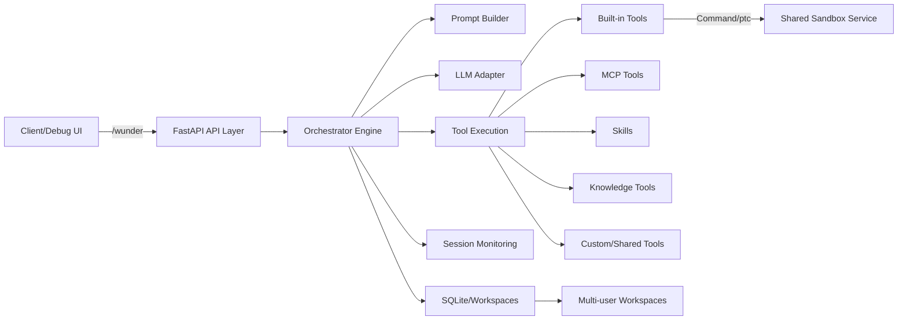
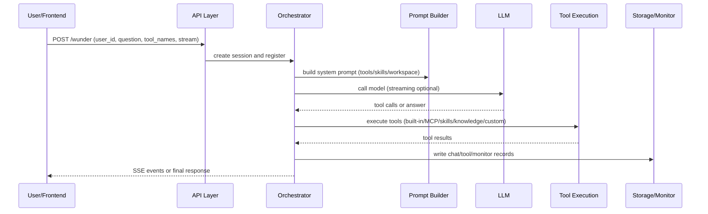
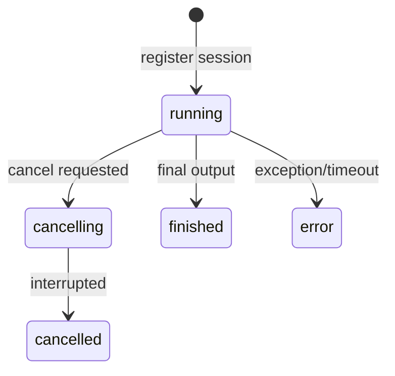

# wunder System Overview

## 1. One-page summary
wunder is an “agent router”: for developers, everything is an interface (API/config/tools); for LLMs, everything is a tool (callable, composable, governable). The system exposes a unified `/wunder` entry via FastAPI, supports both streaming SSE and non-streaming calls, and orchestrates LLMs, MCP, Skills, knowledge bases, and custom/shared tools into a reusable execution chain.
The system also includes a self-hosted MCP service at `/wunder/mcp`, which external callers can use to submit tasks and receive final answers. The admin MCP list shows it as disabled by default.

Its core value:
- Unified entry + strong tool orchestration: integrate multi-model, multi-tool, multi-skill into one control plane.
- Multi-user isolation + persistent workspaces: support concurrency and long-lived assets.
- Observable + controllable: session monitoring, tool heatmap, cancellation.
- Long-term memory: opt-in per user, auto-summarize and append as `[Long-term Memory]` with timestamp prefixes.
- Language switching: front-end language selection syncs system prompts and API messages, controlled by `i18n.supported_languages`.

## 2. Architecture overview
### 2.1 Component diagram


### 2.2 Module responsibilities
- API layer (`app/api`): unified `/wunder` entry; tool/skill/knowledge management; workspace and monitor APIs.
- Service layer (`app/services`): reusable config updates, MCP probing, tool catalog assembly.
- Orchestrator (`app/orchestrator`): task planning, tool selection/execution, context compaction, SSE events.
- MCP service (`app/mcp`): self-hosted MCP endpoint for wunder.
- Prompt Builder (`app/prompts` + `app/orchestrator/prompt_builder.py`): build system prompts with tool protocol/env/skills.
- Tool layer (`app/tools` + `app/skills` + `app/knowledge`): built-ins, MCP tools, skills, knowledge retrieval.
- Monitoring (`app/monitor`): session lifecycle, status events, system metrics.
- Storage (`app/storage/sqlite.py` + `app/memory`): SQLite persistence for history/tool logs/monitor/long-term memory, workspace storage.
- Infra (`app/core/http_client.py`): shared HTTP pools to reduce LLM/sandbox overhead.

## 3. Execution flow (request to answer)


Note: after the final answer, the session is enqueued into long-term memory summarization. The summarization uses `app/prompts/memory_summary.txt` as system prompt, merges history into a single user content, and writes memory/task logs for tracking.

## 4. Tool system (key points)
wunder abstracts all capabilities as “tools” and uses prompt injection + tool protocol to drive execution.

### 4.1 Tool types and sources
| Tool type | Source | Invocation | Sharing/Governance | Use case |
| --- | --- | --- | --- | --- |
| Built-in | `app/tools/catalog.py` + `app/tools/builtin.py` | Direct tool name | Admin enable list | File ops, commands, ptc |
| MCP | `config/wunder.yaml` + overrides + `/wunder/admin/mcp` | `server@tool` | Admin enable + allow_tools | External services (incl. `wunder@run`) |
| Skills | `skills/`, `EVA_SKILLS/`, user skills | Skill name | Admin/user enable | Codified workflows |
| Knowledge | `knowledge/` or user knowledge | Knowledge base tool | Admin/user config | Local knowledge retrieval |
| Custom tools | `data/user_tools/<user_id>` | `user_id@tool` | User config | Personal capabilities |
| Shared tools | Shared user config | `owner_id@tool` | Shared flag | Cross-user reuse |

### 4.2 Tool invocation mechanism
- EVA-style protocol: `<tool_call>{"name":"tool","arguments":{...}}</tool_call>`.
- Tool injection: only tools in `tool_names` are injected into the prompt.
- Allow list:
  - Built-in tools are controlled by `config.tools.builtin.enabled`.
- MCP tool specs are cached; prompt build does not trigger remote discovery.
- MCP calls are governed by `config.mcp.timeout_s`.
- Skills inject only enabled metadata.
- Knowledge bases generate tools per config; disabled bases are excluded.
- Self-hosted `wunder@run` filters itself and uses fixed `user_id = wunder` to avoid recursion.

### 4.3 Knowledge base mechanics
- Markdown documents are split by top-level headings into “knowledge points”.
- Each knowledge base is a separate tool with `query/limit` inputs.
- Retrieval uses lexical filtering + rerank; failures fall back to lexical match.
- Parsed results are cached to reduce IO/parse overhead.

### 4.4 Skills mechanics
- Each skill includes `SKILL.md` (YAML frontmatter for name/inputs).
- Entry scripts supported: `run.py/skill.py/main.py`, unified `run(payload)`.
- Prompt instructs the model to read SKILL.md before execution.

### 4.5 Custom/Shared tools (core idea)
Custom/shared tools are “config-as-toolset + alias routing.” Sharing shares config, not implementation.

**Custom tools**
- Config lives in `data/user_tools/<user_id>/config.json` (MCP servers, skill enable/share, knowledge bases, extra prompts).
- Sanitization enforces constraints and prevents path traversal.
- Aliases use `user_id@tool` (MCP as `user_id@server@tool`).
- Execution respects allow_paths/deny_globs and other policies.

**Shared tools**
- MCP uses `shared_tools`; skills use `shared` list; knowledge bases use `shared` boolean.
- Shared configs are aggregated with a short TTL cache.
- `/wunder/tools` lists shared tools with `owner_id`.
- Execution loads the owner’s config but does not share their workspace or extra prompt.

### 4.6 System tool flow (incl. custom/shared)
```mermaid
flowchart LR
  Config[Config entry (config/wunder.yaml + data/config/wunder.override.yaml + app/user_tools/store.py)] --> Catalog[Tool catalog (/wunder/tools, app/services/tool_service.py)]
  Catalog --> Orchestrator[Orchestration & injection (app/orchestrator/engine.py + prompting.py)]
  Orchestrator --> Exec[Executor (app/orchestrator/tool_executor.py)]
  Exec --> Pool[Tool pool (app/tools + app/skills + app/knowledge + MCP/user tools)]
```

## 5. Agent session management
### 5.1 Concurrency rules
- One running session per user_id; conflicts return 429.
- SQLite `session_locks` enforces cross-process mutual exclusion with TTL heartbeats.
- Session status is recorded by `SessionMonitor`.

### 5.2 Session state machine


### 5.3 Events and monitoring
- Event types: `progress/llm_request/knowledge_request/llm_output_delta/llm_stream_retry/llm_output/tool_call/tool_result/token_usage/final/error` (filtered by `observability.monitor_drop_event_types`).
- Events are stored in SQLite and visible via `/wunder/admin/monitor`.
- Events are truncated by `observability.monitor_event_limit` and `monitor_payload_max_chars`.
- SSE disconnect does not stop tasks; events continue to be recorded.
- Overflowed SSE events are stored in `stream_events` and replayed.

## 6. Workspace and persistence
- Workspace: `data/workspaces/<user_id>/files`, isolated and persistent.
- Workspace APIs support read/search/batch ops; UI uses tree view.
- Chat history/tool logs/artifacts/monitor/locks/overflow events are stored in SQLite (`data/wunder.db`).
- Long-term memory in `memory_records` with `[Long-term Memory]` prefix, per-user max 30.
- Memory task logs in `memory_task_logs` for latest summary per session.
- Context compaction reduces long-history usage, see 6.1.

### 6.1 Context compaction
Goal: keep “latest working info + handoff summary + strict budget” without breaking sessions.

**Triggers**
- History usage >= `max_context * history_compaction_ratio`.
- Current messages exceed safe budget `max_context * 0.9` minus reserved output.

**Flow**
- Replace the last user message with `compact_prompt.txt`.
- Remove reasoning content and cap message length.
- Compute `compacted_until` boundary.
- Generate a structured summary and insert it as a system message.
- Reset usage based on `history_compaction_reset`.
- Emit compaction events.

**Fallbacks**
- If summary fails, inject a fallback and trim history.
- Tool responses are trimmed first under extreme pressure.

## 7. Security and efficiency
- API auth: `/wunder` and `/wunder/mcp` require API key (`security.api_key`).
- Tool access control: `security.allow_commands/allow_paths/deny_globs`.
- Sandbox execution: commands/ptc can run in shared sandbox with network/readonly constraints.
- Prompt caching: keyed by user/workspace/tool list/tool versions.
- Workspace tree caching reduces directory scans.
- Tool/skill injection only when needed to reduce prompt length.
- HTTP connection pooling for LLM/MCP/sandbox.
- Lazy warmup to minimize startup cost (`WUNDER_LAZY_WARMUP_S`).

## 8. Ops & entrypoints
- `/wunder`: unified call entry (stream/non-stream).
- `/wunder/tools`: tool catalog (built-in/MCP/knowledge/skills/custom/shared).
- `/wunder/i18n`: language config (default, supported, aliases).
- `/wunder/admin/*`: model/MCP/skills/tools/monitor/users management.
- `/wunder/admin/memory/*`: long-term memory management.
- `/wunder/workspace/*`: temp workspace operations.
- `/wunder/web`: debug frontend (includes system intro panel).
- `/wunder/ppt`: system intro PPT.
- `/wunder/ppt-en`: system intro PPT (EN).

## 9. Key paths
```
app/                 # API & core logic
  asgi.py             # lightweight ASGI entry
  api/               # entry and admin APIs
  services/          # config/tool/MCP services
  orchestrator/      # orchestration and prompt build
  tools/             # built-in tools + MCP adapter
  skills/            # Skills loading/execution
  knowledge/         # knowledge parsing/retrieval
  memory/            # workspace & history
  monitor/           # session monitoring
  storage/           # SQLite persistence
config/              # base config (wunder.yaml)
data/config/         # admin overrides (wunder.override.yaml)
knowledge/           # shared knowledge base
EVA_SKILLS/          # skills directory
skills/              # built-in skills
web/                 # debug frontend
docs/ppt/            # system intro PPT (index.html)
docs/ppt/slides/     # slide modules
```

---
For deeper technical details, see: `docs/设计方案.en.md` and `docs/API文档.en.md`.
