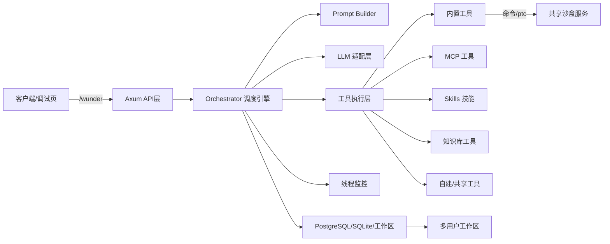
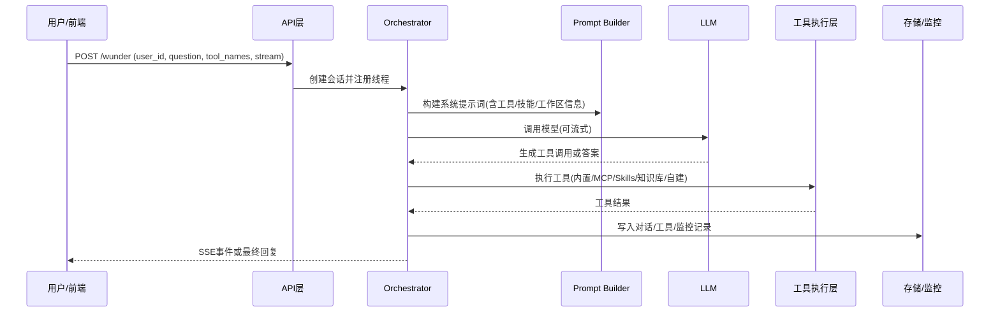
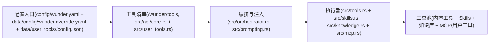
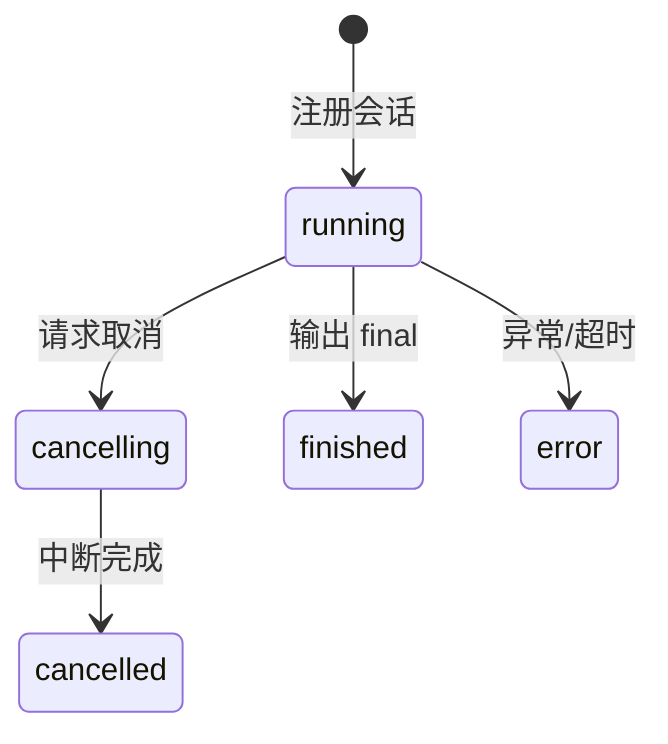
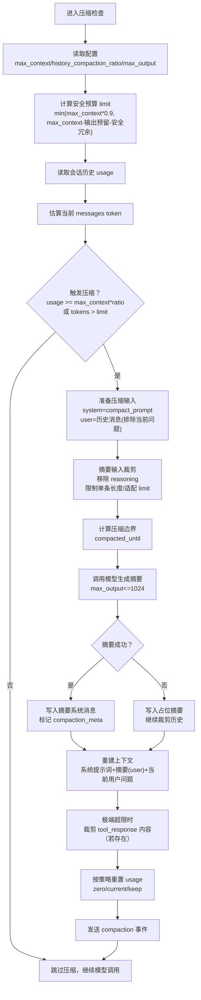

# wunder 系统介绍

## 1. 一页概览
wunder 是一个“智能体路由器”，对开发者而言一切是接口（API/配置/工具）；对大模型而言一切皆工具（可调用、可组合、可治理）。系统以 Rust (Axum) 暴露统一入口 `/wunder`，同时支持流式 SSE 与非流式调用，能够将 LLM、MCP、Skills、知识库与自建/共享工具编排为可复用的智能体执行链路。
系统同时提供 A2A 标准接口 `/a2a`（JSON-RPC + SSE），并通过 `/.well-known/agent-card.json` 输出 AgentCard 用于跨系统能力发现。
自托管 MCP 服务 `/wunder/mcp` 已由 Rust 版实现，基于 streamable-http 提供工具入口（wunder@run）。
当前默认实现为 Rust，Python FastAPI 代码仅保留历史参考；`Dockerfile.rust` + `docker-compose.rust.x86.yml`/`docker-compose.rust.arm.yml` 用于运行与热重载。
运行时环境变量建议统一放在仓库根目录 `.env`（docker compose 默认读取），常用项包括 `WUNDER_HOST`、`WUNDER_PORT`、`WUNDER_API_KEY`、`WUNDER_POSTGRES_DSN`、`WUNDER_SANDBOX_ENDPOINT`；本地直接运行时需自行导出这些环境变量。
当 `sandbox.mode=sandbox` 时，内置工具中的“执行命令/ptc”会通过共享沙盒服务执行（`WUNDER_SANDBOX_ENDPOINT`），需要确保沙盒服务已启动并可访问；docker compose 部署建议使用容器内部 DNS（默认 `http://sandbox:9001`）直连沙盒且无需对外暴露 9001 端口。

它的核心价值是：
- 统一入口 + 强工具编排：把多模型、多工具、多技能整合到一个调度面。
- 多用户隔离 + 持久化工作区：支持多人并发与长期对话资产沉淀。
- 可观测 + 可管控：线程级监控、工具调用热力图、可取消任务。
- 吞吐量测试 + 性能采样 + 能力评估：并发步增压测量化预填充/解码速度与首包时延，性能采样观察系统能力基线，用例集评分支持回归对比。
- 长期记忆：按用户开启自动总结并注入系统提示词，以 `[长期记忆]` 标签+纯文本段落强化长期上下文，每条记忆附带“年月日时分”时间前缀。
- 语言可切换：前端设置语言后，系统提示词与接口返回消息同步切换中英文，翻译默认来自 `config/i18n.messages.json`（缺失回退 `app/core/i18n.py`），支持语言以 `i18n.supported_languages` 配置为准。

## 2. 架构总览
### 2.1 系统组件关系图


### 2.2 核心模块职责
- API 层（`src/api`）：统一入口 `/wunder`、A2A 标准接口 `/a2a`、工具/工作区/监控管理接口。
- Orchestrator（`src/orchestrator.rs`）：任务编排、工具选择与 SSE 事件流输出。
- 工具层（`src/tools.rs`）：内置工具规格与执行入口。
- 工作区层（`src/workspace.rs`）：用户工作区文件管理与压缩下载。
- 监控层（`src/monitor.rs`）：线程状态与系统资源快照，按配置持久化到存储后端。
- 吞吐量压测（`src/throughput.rs`）：服务端从并发 1 按步增压测到最大并发，采样预填充/解码速度与首包时延等指标，支持多问题随机发送，结果可保存/导出并支持历史回放。
- 性能测试（`src/performance.rs`）：按并发采样系统提示词构建、文件操作、命令执行与日志写入耗时。
- 能力评估（`src/evaluation_runner.rs` + `src/api/evaluation.rs`）：按用例集跑评估，启动时清理该用户 eval 临时目录并预生成明细为 `active`，提供评分与历史回溯/删除；用例文件存放在 `config/evaluation/cases`。
- 配置层（`src/config.rs` + `src/config_store.rs`）：基础配置与管理端覆盖写入，支持通过管理端调整 `server.max_active_sessions` 与 `sandbox.mode` 并持久化。
- Python 旧代码位于 `app/`，当前保留提示词模板与 i18n 回退，逻辑以 Rust 实现为准。

## 3. 运行流程（从请求到回复）


补充：当最终回复完成后，系统会将该会话加入长期记忆总结队列，按完成时间顺序逐条生成记忆摘要并落库；总结请求使用 `app/prompts/memory_summary.txt` 作为系统提示词，并将历史消息融合为单条用户内容，同时写入任务日志供历史队列追踪。

## 4. 工具体系（重点）
wunder 把所有能力统一抽象为“工具”，并通过提示词注入与工具协议驱动大模型调用。
Rust 版当前以 `src/` 模块为准，部分 Skills/知识库流程仍在迁移，以下内容偏向目标设计说明。

### 4.1 工具类型与来源
| 工具类型 | 来源/存放 | 触发方式 | 共享/管控 | 适用场景 |
| --- | --- | --- | --- | --- |
| 内置工具 | `src/tools.rs` | 直接调用工具名 | 管理员配置启用 | 文件操作、命令执行、ptc 脚本 |
| MCP 工具 | `config/wunder.yaml` 基础配置 + `data/config/wunder.override.yaml` 覆盖 + `/wunder/admin/mcp` | 形如 `server@tool` | 管理员启用 + allow_tools | 连接外部服务/平台能力（含自托管 `wunder@run`） |
| A2A 服务工具 | `config/wunder.yaml` + `data/config/wunder.override.yaml` 覆盖 + `/wunder/admin/a2a` | 形如 `a2a@service` | 管理员启用 | 跨智能体委派/协作 |
| Skills | `skills/`、`EVA_SKILLS/`、用户技能包 | 技能名 | 管理员/用户启用 | 固化流程/最佳实践 |
| 知识库 | `knowledge/` 或用户知识库 | 知识库名作为工具 | 管理员/用户配置 | 本地知识检索 |
| 自建工具 | `data/user_tools/<user_id>` | 形如 `user_id@tool` | 用户配置 | 个性化能力扩展 |
| 共享工具 | 来自其他用户的共享配置 | 形如 `owner_id@tool` | 共享标记 | 跨用户能力复用 |

### 4.2 工具调用机制
- 统一工具协议：EVA 风格 `<tool_call>{"name":"工具名","arguments":{...}}</tool_call>`。
- 工具调用轮次会将上一轮 assistant 原始输出（含 tool_call）与 reasoning 追加进下一轮模型请求，保证上下文可追溯。
- 工具注入策略：只有 `tool_names` 中显式选择的工具才会注入系统提示词，减少提示词膨胀。
- 内置工具支持英文别名（如 `read_file`、`write_file`），模型与接口可使用英文名触发调用。
- `a2ui` 为可选输出工具，显式勾选后会替换“最终回复”工具，用于输出 A2UI 消息并在调试面板渲染 UI。
- A2A 服务工具由 `/wunder/admin/a2a` 配置并缓存 AgentCard，启用后以 `a2a@service` 形式注入提示词；支持 `internal/external` 区分，其中 `internal` 表示 Wunder 内部 A2A 服务并需预置 `user_id` 以自动填充。
- 内置 `a2a观察`/`a2a等待` 用于观察任务状态与等待结果，`user_id` 默认沿用当前用户。
- 允许列表：
  - 内置工具受 `config.tools.builtin.enabled` 管控。
- MCP 工具使用预先缓存的 `tool_specs`，不会在提示词构建时触发远端发现。
- MCP 工具调用超时由 `config.mcp.timeout_s` 统一控制，避免外部服务阻塞线程。
- Skills 仅注入已启用的技能元信息。
- 知识库按配置生成独立工具，未启用项不会注入工具清单。
- 自托管 MCP 工具 `wunder@run` 在内部执行时会剔除自身工具，并固定 `user_id = wunder`，避免递归调用。

### 4.3 知识库机制
- 知识库以 Markdown 文档为输入，按一级标题切分为“知识点”。
- 每个知识库是一把独立“工具”，输入 `query/limit` 返回结构化知识点列表。
- 先做文本候选筛选，再用检索专用模型重排序；解析失败时回退到词面匹配，保证可用性。
- 缓存知识库解析结果，减少重复 IO 与解析成本。

### 4.4 Skills 机制
- 每个技能包含 `SKILL.md`（YAML frontmatter 描述名称、输入结构等）。
- 技能执行入口支持 `run.py/skill.py/main.py`，统一 `run(payload)` 调用。
- 系统提示词会引导模型“先读 SKILL.md 再执行”，把技能当作“流程手册”。

### 4.5 自建/共享工具机制
自建/共享工具的核心是“配置即工具包 + 统一别名路由”，共享并不是复制工具实现，而是共享配置与可用清单。

**自建工具原理**
- 配置即工具包：每个用户在 `data/user_tools/<user_id>/config.json` 维护独立配置，包含 MCP 服务（含 cached `tool_specs`、`allow_tools`、`shared_tools`）、技能启用/共享、知识库列表（enabled/shared 标记）、`extra_prompt`。
- 读取与规范化：系统加载配置时会做清洗与约束（例如 `shared_tools` 必须是 `allow_tools` 子集、`skills.shared` 必须是 `skills.enabled` 子集），并对知识库目录做安全解析，避免路径越界。
- 别名注册：自建工具统一命名为 `user_id@tool`（MCP 为 `user_id@server@tool`），避免与内置/MCP/技能/知识库冲突。
- 注入与执行：`/wunder/tools` 会把自建工具合入工具清单，只有被选择的 `tool_names` 才注入提示词；执行阶段通过别名映射找到具体资源，仍受 allow_paths/deny_globs 的安全策略约束。

**共享工具原理（共享配置 + 别名路由）**
- 共享标记即白名单：MCP 通过 `shared_tools` 控制对外共享的工具；Skills 通过 `shared` 列表；知识库通过 `shared` 布尔值。
- 共享发现与缓存：系统扫描 `data/user_tools/*/config.json` 汇总共享载荷（带短 TTL 缓存），配置变更会刷新共享版本号以触发提示词缓存失效。
- 共享呈现方式：`/wunder/tools` 将共享工具单独列出并附带 `owner_id`，名称仍为 `owner_id@tool`；默认不注入提示词，需由用户显式勾选。
- 共享执行方式：编排时为共享工具建立 `alias -> (kind, owner_id, target)` 映射；执行时根据 `owner_id` 加载对方的 MCP 配置/技能目录/知识库目录完成调用，但不会共享对方的额外提示词或工作区。

### 4.6 系统管理工具核心流程（含自建/共享）
系统管理工具的核心目标是：统一配置入口、统一工具清单、统一提示词注入，并在执行阶段严格隔离与可控复用。



核心机制说明：
- 管理员通过 `/wunder/admin/*` 完成内置工具/MCP/技能/知识库的启用与配置，形成全局基线能力。
- 用户通过“自建工具”入口配置个人 MCP、上传技能包、维护个人知识库，并决定是否共享。
- 系统统一汇总工具清单到 `/wunder/tools`，再根据 `tool_names` 选择性注入提示词，避免不必要的上下文膨胀。
- 共享工具以 `owner_id@tool` 形式暴露，其他用户仅在选择后才可调用，确保隔离与可管控。

## 5. 智能体管理测试功能
### 5.1 总览
- 覆盖线程管理、吞吐量测试、性能采样与能力评估，用于保障并发稳定并持续量化性能与质量。
- 管理端通过 `/wunder/admin/throughput/*`、`/wunder/admin/performance/sample` 与 `/wunder/admin/evaluation/*` 提供压测/采样/评估入口，配合监控面板统一观察。

### 5.2 线程管理
#### 5.2.1 线程并发规则
- 同一 `user_id` 同时只能有一个运行中的会话，请求冲突时返回 429。
- 并发互斥由存储层 `session_locks` + TTL 心跳实现，支持跨进程互斥。
- 线程由 `SessionMonitor` 统一记录：状态、阶段、事件与资源统计。

#### 5.2.2 线程状态机


#### 5.2.3 事件与监控
- 事件类型：`progress/llm_request/knowledge_request/llm_output_delta/llm_stream_retry/llm_output/tool_call/tool_result/a2ui/token_usage/final/error`（持久化可按 `observability.monitor_drop_event_types` 过滤）。
- `final` 事件携带 `stop_reason`（`model_response/final_tool/a2ui/max_rounds/unknown`），用于说明停止原因。
- 监控数据落库存储后端，可在 `/wunder/admin/monitor` 查询实时/历史线程。
- 系统状态快照覆盖 CPU/内存/负载/磁盘/日志目录占用/工作区占用/进程资源与运行时长。
- 工具调用统计接口会返回真实工具名，便于前端在详情事件中定位调用位置。
- 监控事件会按 `observability.monitor_event_limit` 保留最近 N 条，<= 0 表示不限制，并按 `monitor_payload_max_chars` 裁剪超长字段（<= 0 表示不截断）。
- 断开 SSE 不会强制终止任务，任务继续执行并写入监控与历史。
- 取消请求会中断正在进行的 LLM/工具调用，内部轮询取消标记，通常 200ms 内生效。
- SSE 队列满时事件会落库到 `stream_events`，流式通道会回放补齐以避免丢失。

### 5.3 吞吐量测试
- 管理端可触发并发步增压测，从并发 1 逐步提升到最大并发，支持多问题随机发送。
- 每个并发档位采样请求统计与预填充/解码速度、首包时延等指标，前端以性能曲线展示相对增量。
- 压测报告持久化到 `data/throughput`，支持历史回放与导出。

### 5.4 性能测试
- 支持按并发步增采样系统提示词构建、文件操作、命令执行与日志写入耗时。
- 前端以曲线与表格对比不同并发下的耗时变化，便于定位瓶颈。
- 性能测试历史可查看并还原，便于对比不同时间的采样结果。

### 5.5 能力评估
- 用例集位于 `config/evaluation/cases`，支持按维度组合运行。
- 执行过程中提供 SSE 进度与单用例状态，启动时清理 eval 临时目录并预创建 `active` 明细。
- 评估结果写入 `evaluation_runs` / `evaluation_items`，支持历史回溯与删除。

## 6. 工作区与数据持久化
- 工作区：`data/workspaces/<user_id>/files`，用户隔离且持久化。
- 若用户 24 小时内无会话，系统会自动清空该用户的临时文件区内容。
- 工作区管理接口支持内容读取、搜索、批量移动/复制与分页排序，前端以树形视图交互。
- 对话历史、工具日志、产物索引、监控、会话锁与溢出事件统一写入数据库（默认 PostgreSQL，可选 SQLite）。
- 吞吐量压测报告写入 `data/throughput`，支持历史回放与导出。
- 能力评估结果写入 `evaluation_runs` / `evaluation_items`，用于历史回溯。
- 长期记忆记录写入 `memory_records`，按用户开关注入系统提示词（带 `[长期记忆]` 标签与时间前缀），单用户最多保留 30 条。
- 记忆任务日志写入 `memory_task_logs`，按会话覆盖保留最新一次总结结果与请求详情。
- 历史压缩：接近上下文上限时自动压缩历史，生成摘要并保留关键消息，详见 6.1。

### 6.1 模型上下文压缩原理
上下文压缩的目标是“保留最新可工作信息 + 提供可交接摘要 + 严格控制上下文预算”，在不中断会话的前提下降低长对话的 token 压力。

**触发条件（双阈值）**
- 历史 usage 触发：会话累计历史 token 达到 `max_context * history_compaction_ratio`（默认 0.8）。
- 上下文溢出触发：当前消息总 token 超过安全预算 `max_context * 0.9`，并扣除输出预留与安全冗余。

**压缩输入如何构建**
- 使用独立的压缩 system 提示词（`compact_prompt.txt`）。
- 将历史消息（包含产物索引/工具观察，排除当前用户问题）合并为单条 user 内容。
- 摘要输入会进行裁剪：单条消息最大 token 限制，思考链（reasoning）会被移除。
- 多模态图片按固定 token 估算，base64 会被占位符替换，避免误触发压缩。

**上下文压缩流程图**


**压缩后续对话**
- 压缩后仅保留摘要与当前用户问题，摘要以 user 消息注入。
- 不再保留上一轮 user/assistant 交互，也不再单独注入产物索引，关键信息由摘要覆盖。

**摘要生成与落库**
- 由同一模型生成“交接摘要”，落库为系统消息并带 `[上下文摘要]` 前缀，后续对话以 user 消息注入摘要。
- 摘要条目会记录覆盖时间边界，便于后续过滤早期历史。
- 生成摘要的请求与结果会写入调试请求日志，便于回溯。
- 摘要采用结构化模板输出，压缩输入会合并产物索引与工具观察信息，压缩后上下文仅保留摘要。

**兜底与恢复**
- 若摘要生成失败，会写入占位摘要并继续裁剪历史，确保请求可继续完成。
- 极端超限时会优先裁剪工具观察结果（tool_response），每条保留最少 token，保证主对话不被挤占。

**历史 usage 重置**
- 压缩后按策略重置累计历史 token（`zero/current/keep`），避免重复触发。

## 7. 安全与效率设计
- 接口鉴权：`/wunder`、`/a2a` 与 `/wunder/mcp` 需携带 API Key，请在 `config/wunder.yaml` 的 `security.api_key` 配置。
- 工具权限控制：`security.allow_commands/allow_paths/deny_globs` 白名单策略。
- 沙盒执行：`执行命令` 与 `ptc` 可走共享沙盒服务，限制网络/只读根文件系统。
- Prompt 缓存：根据用户、工作区树版本、工具列表、用户工具版本进行缓存。
- 工作区树缓存：减少重复目录遍历。
- 模型请求降载：工具与技能仅在需要时注入，降低提示词长度与调用成本。
- HTTP 连接池复用：统一 LLM/MCP/沙盒请求客户端，减少连接建立开销。
- 并发控制：同一 user_id 互斥 + `server.max_active_sessions` 全局上限，session_locks 心跳保障跨进程互斥。
- 监控与资源指标缓存：系统快照/日志占用/工作区占用按 TTL 缓存，减少频繁磁盘扫描。
- 监控落库异步化：监控记录写入使用有界队列与批量写入线程，减少高并发下的阻塞。
- 存储访问隔离：调度链路上的存储读取通过 blocking 线程执行，避免阻塞 Tokio 运行时。
- 启动优化：MCP 服务、监控与调度器采用惰性初始化，降低进程启动耗时，首次触达相关能力可能有冷启动延迟。
- 轻量入口：Rust 服务由 `src/main.rs` 启动，日志级别通过 `RUST_LOG` 调整。

## 8. 运维与管理入口
- `/`：简易聊天测试页（`web/simple-chat/index.html`），直接调用模型端点（OpenAI 兼容 `chat/completions`），用于填写模型端点/API Key/模型名，支持图片与文本附件上传与思考折叠显示，并在浏览器本地保存设置与对话历史。
- `/wunder`：统一调用入口（流式/非流式）。
- `/a2a`：A2A JSON-RPC 标准接口（支持 SSE 流式）。
- `/.well-known/agent-card.json`：A2A AgentCard 发现入口，包含技能与内置/MCP/知识库工具清单（轻量展示，不包含参数 schema）。
- `/wunder/tools`：工具清单（内置/MCP/知识库/技能/自建/共享）。
- `/wunder/admin/a2a`：A2A 服务配置与 AgentCard 缓存（管理端）。
- `/wunder/i18n`：语言配置（默认语言、支持语言、别名映射）。
- `/wunder/admin/*`：模型/MCP/技能/工具/监控/用户管理（内置工具接口返回启用状态与输入结构）。
- `/wunder/admin/throughput/*`：吞吐量压测管理（启动/停止/状态/报告）。
- `/wunder/admin/performance/sample`：性能测试采样接口（按并发获取系统能力耗时）。
- `/wunder/admin/evaluation/*`：能力评估管理（启动/取消/进度/历史/用例集）。
- `/wunder/admin/memory/*`：长期记忆管理（用户开关、记录列表、清空/删除、队列状态与详情）。
- `/wunder/workspace/*`：临时工作区文件管理（内容读取、搜索、批量操作）。
- `/wunder/web`：调试前端，包含幻灯片（系统介绍）与 A2A 服务管理面板；幻灯片入口位于侧边栏「文档 / 幻灯片」，侧边栏支持滚动、分组收起与父级展开/收起。
- `/wunder/ppt`：系统介绍 PPT 静态资源（`docs/ppt`，每页拆分为 `slides/*.js`，顺序由 `slides/manifest.js` 维护），供嵌入与全屏展示。
- `/wunder/ppt-en`：系统介绍 PPT 英文版静态资源（`docs/ppt-en`，每页拆分为 `slides/*.js`，顺序由 `slides/manifest.js` 维护）。

## 9. 关键目录结构（便于定位）
```
src/                 # Rust 服务入口与模块
  api/               # 入口与管理接口
  orchestrator.rs    # 调度引擎
  tools.rs           # 内置工具
  workspace.rs       # 工作区管理
  monitor.rs         # 线程监控与状态
config/              # 基础配置（wunder.yaml）
data/config/         # 管理端持久化覆盖（wunder.override.yaml）
knowledge/           # 公共知识库
EVA_SKILLS/          # 技能包目录
skills/              # 内置技能目录
web/                 # 调试前端
web/simple-chat/     # 简易聊天测试页
docs/ppt/            # 系统介绍 PPT（入口 index.html）
docs/ppt-en/         # 系统介绍 PPT 英文版（入口 index.html）
app/                 # 旧版 Python 代码（历史参考）
```

---
如需更深层的技术细节，可参见：`docs/设计方案.md` 与 `docs/API文档.md`。
