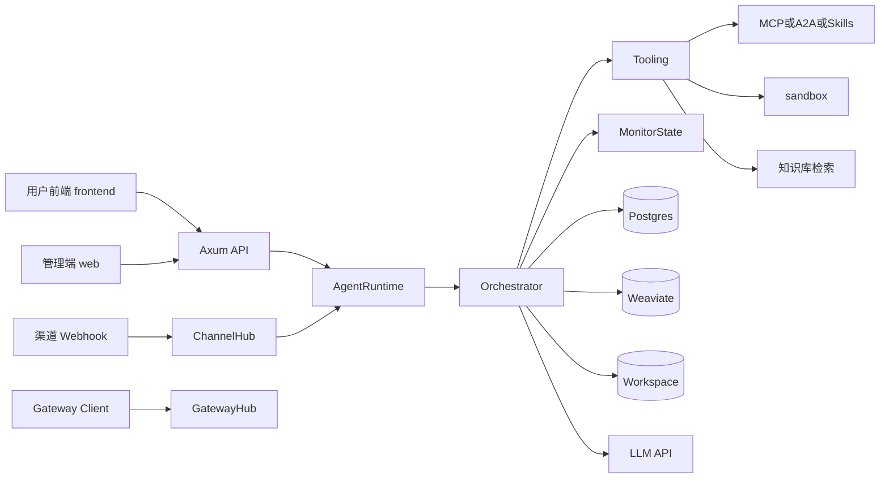
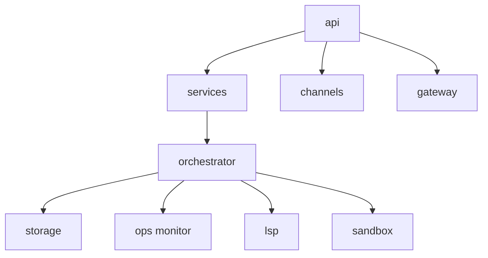
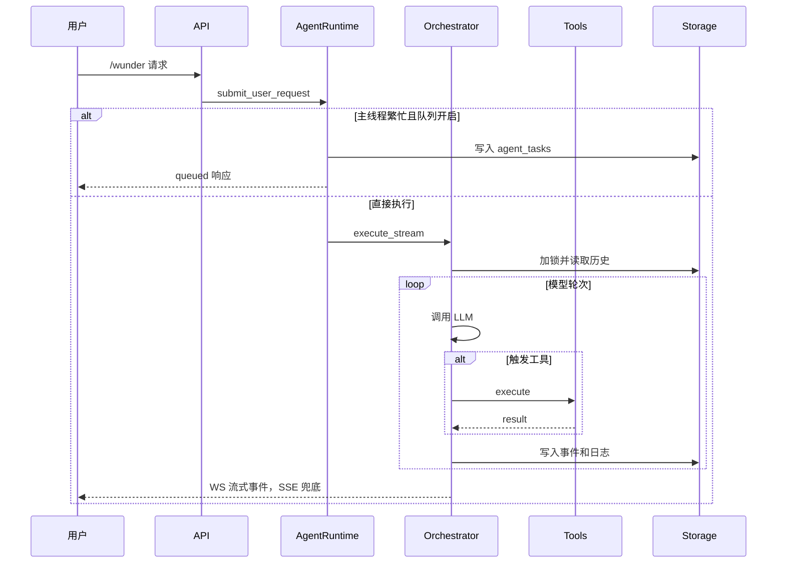
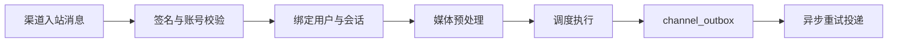
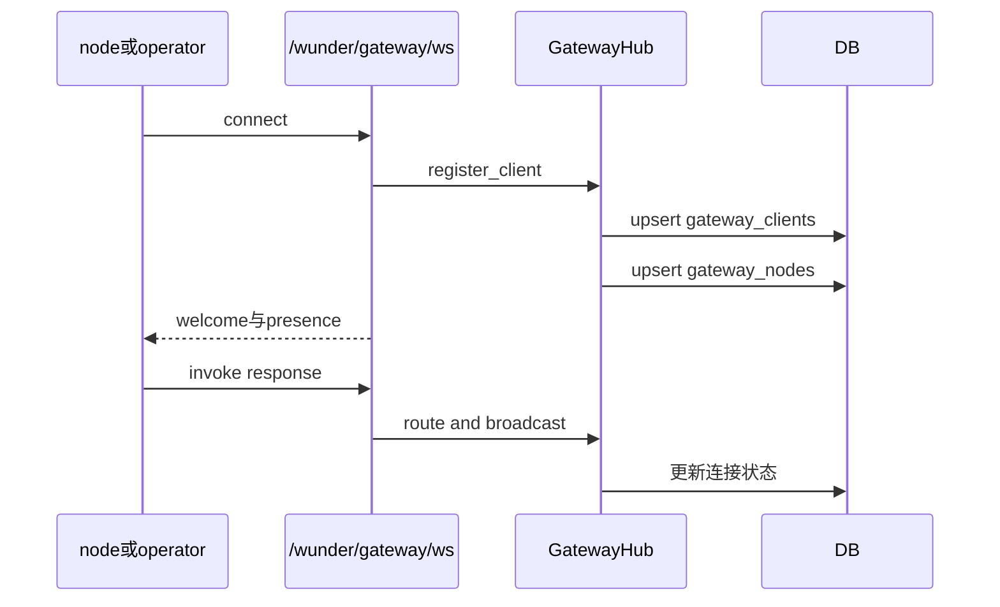
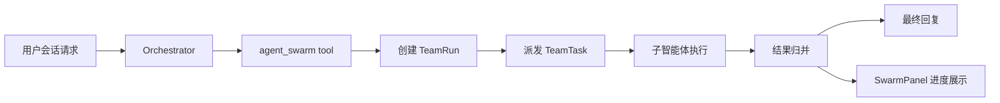
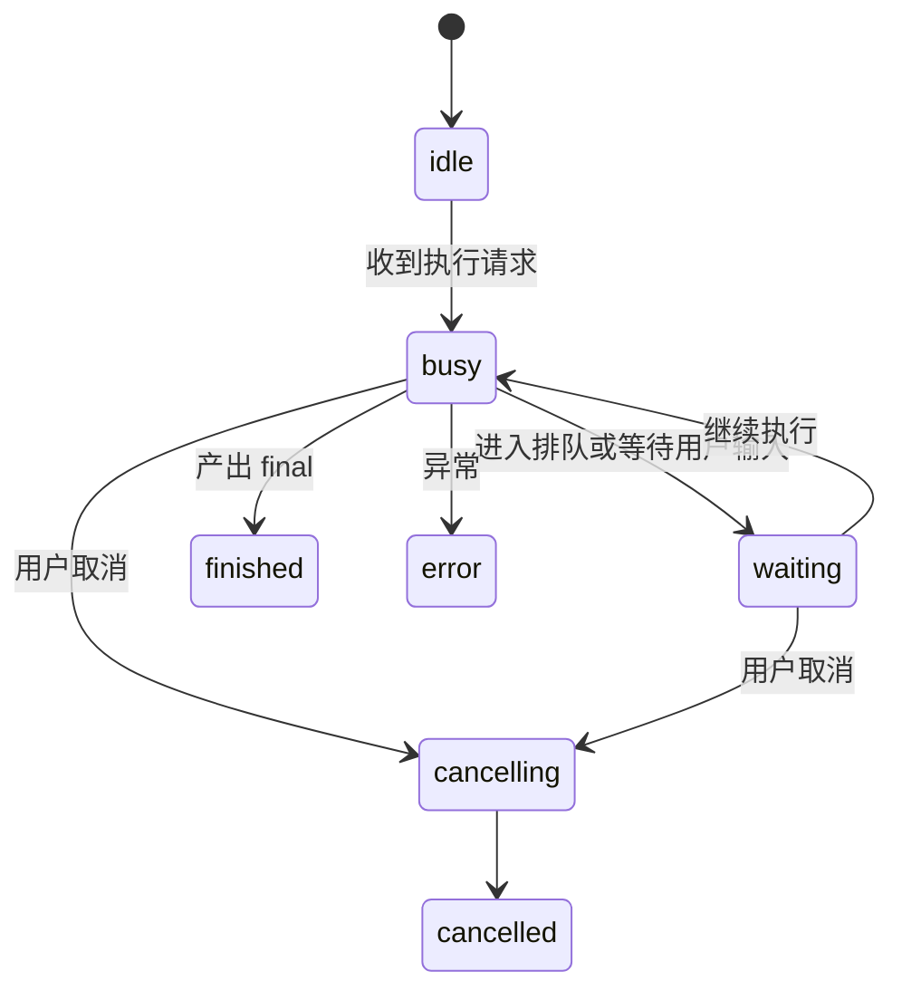
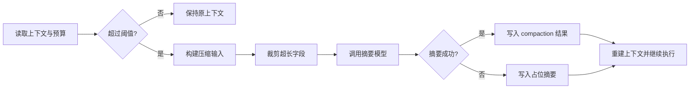

# wunder 系统介绍（代码对齐版）

本文档面向管理者和系统负责人，基于当前代码说明 wunder 的定位、能力边界、运行机制和治理方式。

## 1. 一页概览

wunder 是一个智能体调度平台。它把模型调用、工具调用、知识检索、会话管理和治理能力放到同一平台中，形成可扩展、可观测、可管控的统一执行底座。

一句话概括：

- 对开发者，能力统一为接口。
- 对模型，能力统一为工具。
- 对组织，能力统一为可治理资产。

## 2. 当前版本核心能力

- 统一入口。wunder 系列接口承接普通调用、聊天会话、管理操作、渠道接入、网关控制面。
- 双流式通道。默认 WebSocket，SSE 兜底，并支持事件断点恢复。
- 主线程和队列。按 user_id 和 agent_id 维护主会话，忙时进入任务队列。
- 多通信入口。支持用户侧请求、外部 webhook 渠道、网关节点接入三类入口。
- 多工具编排。内置工具、MCP、A2A、Skills、知识库、用户自建和共享工具统一编排。
- 多运行形态统一。`wunder-server`、`wunder-cli`、`wunder-desktop` 共用同一套 Rust 核心编排与工具系统。
- 蜂群协作能力。保留 `hive_id` 作用域模型，当前产品收敛为单蜂巢（`default`）稳定运行。
- 飞书长连接。对 active 且凭证完整的飞书账号自动维持 WebSocket 长连接，收到消息后进入 ChannelHub 主链路。
- 管理端运行态可视化。渠道监控页可查看 `runtime.feishu_long_connection` 状态和绑定数，便于排查接入问题。
- 多模态渠道。支持语音转写、图片识别、地理描述、语音回包。
- 前端工程化。用户侧前端已升级为 TypeScript 实现，当前交付门槛为 `npm run typecheck` 与 `npm run build:check`。
- 组织治理。支持组织树、角色权限、配额和访问控制。
- 评估运维。内置监控、吞吐压测、性能采样、能力评估。

## 3. 系统结构

### 3.1 服务层结构

#### 系统组件关系图

- wunder_engine。主服务，承接 API 路由和调度执行。
- sandbox。沙盒服务，承接高风险执行任务。
- postgres。关系数据主库。
- weaviate。向量检索后端。
- frontend。用户侧前端（Vue3 + TypeScript）。
- web。管理端前端（治理与调试视角）。

### 3.2 代码层结构

#### 代码层协作图

- api 层。路由和协议适配。
- orchestrator 层。模型和工具调度核心。
- services 层。用户、会话、工具、知识、定时任务、工作区等服务。
- channels 层。外部消息渠道接入和回包。
- gateway 层。控制平面连接管理。
- storage 层。数据库读写抽象。
- ops 层。观测和评估能力。

## 4. 三条主业务链路

### 4.1 用户对话链路

#### 用户对话时序图

1. 客户端发起请求。
2. 系统解析用户身份并绑定会话。
3. AgentRuntime 判断是否需要排队。
4. Orchestrator 执行模型和工具循环。
5. 事件流实时输出并持久化。
6. 最终结果和会话状态回写数据库。

### 4.2 渠道消息链路

#### 渠道处理流程图

1. 外部渠道 webhook 接入。
2. 系统校验账号和签名。
3. 根据绑定策略映射用户和会话。
4. 多模态消息预处理。
5. 调度引擎生成回复。
6. 出站消息进入 outbox 并异步投递。

### 4.3 网关控制面链路

#### 网关控制流程图

1. operator、node 或 channel 建立网关连接。
2. 网关完成握手并登记连接状态。
3. 管理端可查询 presence 并下发 node invoke。
4. 响应和状态事件回写控制平面表。

### 4.4 蜂群协作链路（单蜂巢模式）

#### 蜂群协作流程图

1. 会话内触发蜂群能力后，系统在当前会话上下文中创建 TeamRun。
2. TeamRun 拆解为多个 TeamTask 由子智能体并行执行，再由母任务归并结果。
3. 聊天页通过标题栏图标打开 `SwarmPanel`，实时展示 TeamRun/TeamTask 进度。
4. `agent_swarm` 与 TeamRun 接口保留 `hive_id` 作用域参数，默认取当前会话蜂巢。
5. 当前版本固定单蜂巢（`default`）：用户侧不再提供蜂巢切换/新增入口，应用协作统一在同一蜂巢内完成。

## 5. 并发与隔离策略

### 5.1 隔离

- 会话级隔离。session_id 维度互斥。
- 主线程隔离。user_id 加 agent_id 维度维护主会话。
- 工作区隔离。用户和容器作用域共同隔离文件空间。
- 身份隔离。虚拟用户与注册用户均可调用调度链路，治理策略不同。

### 5.2 排队与恢复

#### 排队与会话状态图

- 忙会话请求可进入 agent_tasks，由后台消费。
- 流式事件写入 stream_events，断线可恢复。

### 5.3 轮次统计

- 用户轮次按输入消息计数。
- 模型轮次按模型动作计数。
- token 相关统计用于上下文占用评估，不等同计费总消耗。

## 6. 数据资产

系统将会话过程资产化，主要沉淀内容包括：

- 会话元数据和消息历史
- 工具调用和产物日志
- 监控快照和流式事件
- 主线程和排队任务状态
- 定时任务定义与运行记录
- 渠道接入、回包和媒体索引
- 网关连接和节点令牌
- 用户、组织、权限、智能体配置
- 评估记录和向量文档元数据

## 7. 治理机制

### 7.1 权限治理

- 管理接口支持 api key 和管理员 token。
- 用户接口通过 token 鉴权。
- 工具和智能体访问可按用户维度配置白名单和屏蔽列表。

### 7.2 安全治理

- 命令和路径执行受白名单与 deny 规则约束。
- 高风险执行可下沉到 sandbox。
- 渠道接入支持 token 或签名校验。
- 网关支持 origin 约束和受信代理策略。

### 7.3 成本治理

- 支持用户配额和组织层级治理。
- 管理员可在管理端查看用量并调优策略。

## 8. 可观测性与运维能力

### 8.1 上下文压缩流程图

- MonitorState 维护会话状态机和事件日志。
- 支持会话级取消、上下文压缩、异常追踪。
- 内置吞吐压测、性能采样、能力评估模块。
- 支持流式协议握手信息和慢客户端告警。

## 9. 运行入口与运行形态

### 9.1 用户侧入口

- 用户前端负责聊天、会话、工作区、应用广场、渠道账号配置（新增/编辑/删除）等能力。
- 桌面端与用户前端保持同构页面结构，复用 `UserLayout`、聊天与设置体系。

### 9.2 管理端入口

- 管理端负责模型配置、工具管理、监控、评估、组织用户治理、渠道运行监控、网关治理。

### 9.3 对外接口族

- wunder 核心接口
- wunder chat 会话接口
- wunder admin 管理接口
- wunder ws 和 wunder chat ws
- wunder gateway ws
- a2a 标准接口
- wunder mcp 接口

### 9.4 运行形态（server / cli / desktop）

- `wunder-server`：面向多租户和前后端协同，提供 `/wunder`、WebSocket、SSE、管理接口与治理能力。
- `wunder-cli`：面向单用户本地使用，持久化目录为 `WUNDER_TEMP/`，工作目录为启动目录。
- CLI 默认优先读取 `config/wunder.yaml`；若仓库外运行配置缺失，会自动生成 `WUNDER_TEMP/config/wunder.base.yaml` 兜底。
- CLI 支持 `resume` 会话恢复、JSONL 事件输出与 codex 风格 TUI，交互命令覆盖 `/help`、`/status`、`/model`、`/tool-call-mode`（`/mode`）、`/session`、`/system`、`/config`。
- `wunder-desktop`：采用“**Tauri 桌面窗口 + 内置本地桥接服务**”模式，默认 `127.0.0.1:18000`（支持 `--port 0`）。
- Desktop 启动时提供 `GET /config.json` 与 `GET /wunder/desktop/bootstrap` 引导接口，Tauri 同时暴露 `desktop_runtime_info` command。
- Desktop 持久化目录固定为程序同级 `WUNDER_TEMPD/`，默认工作目录为 `WUNDER_WORK/`，并支持容器工作目录映射。
- Desktop 设置页支持 `tool_call/function_call` 切换与 MCP/Skills 管理；默认轻量运行（关闭 channels/gateway/agent_queue/cron）。
- 启用 `remote_gateway` 后，desktop 会将业务请求切到远端 `/wunder`；用户按常规流程注册/登录，远端不可用时自动回退本地并保留 `remote_error` 诊断信息。

### 9.5 渠道隔离补充

- 用户侧渠道账号在默认绑定时可写入 agent_id，用于将渠道路由到指定智能体，避免跨应用共享。

## 10. 结论

wunder 已从单一对话服务演进为多入口、多工具、多治理能力的智能体调度底座。当前架构重点在于三件事：

- 保持主链路稳定。
- 保持扩展方式统一。
- 保持治理能力可落地。

后续演进应继续坚持接口化扩展、可观测优先和运行安全优先。
