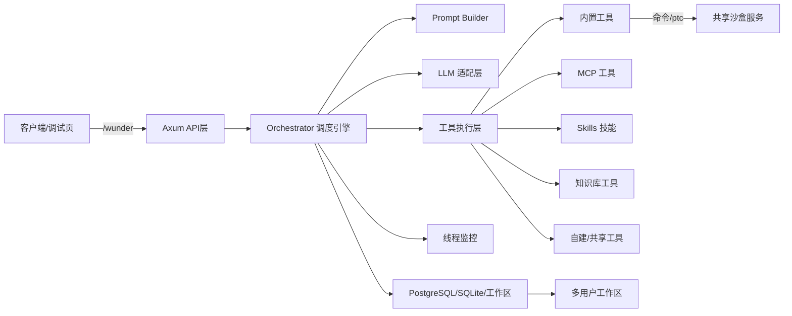
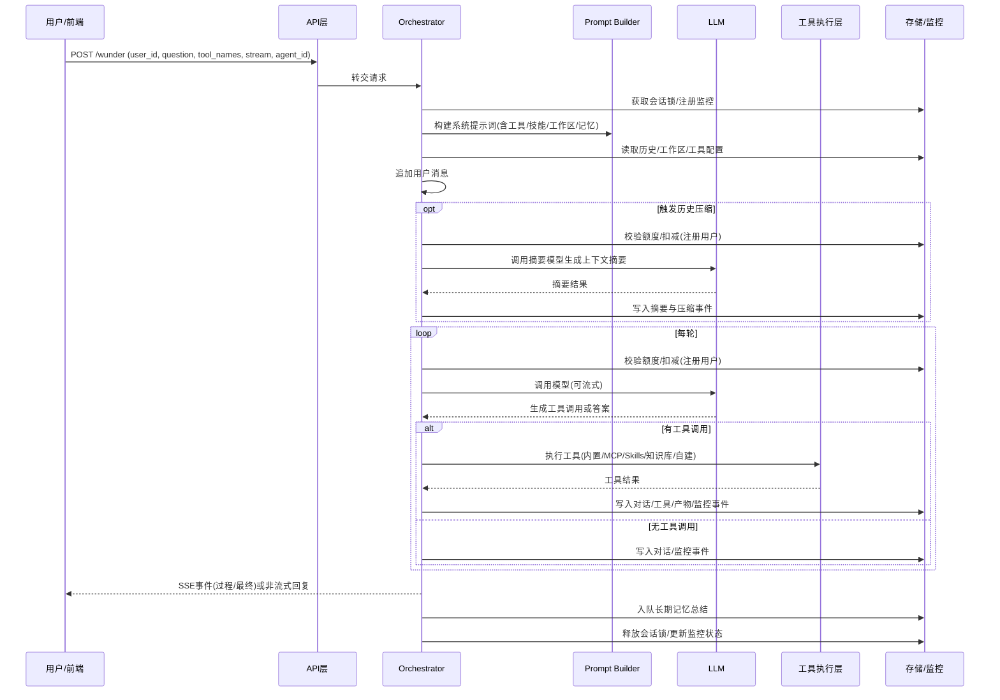
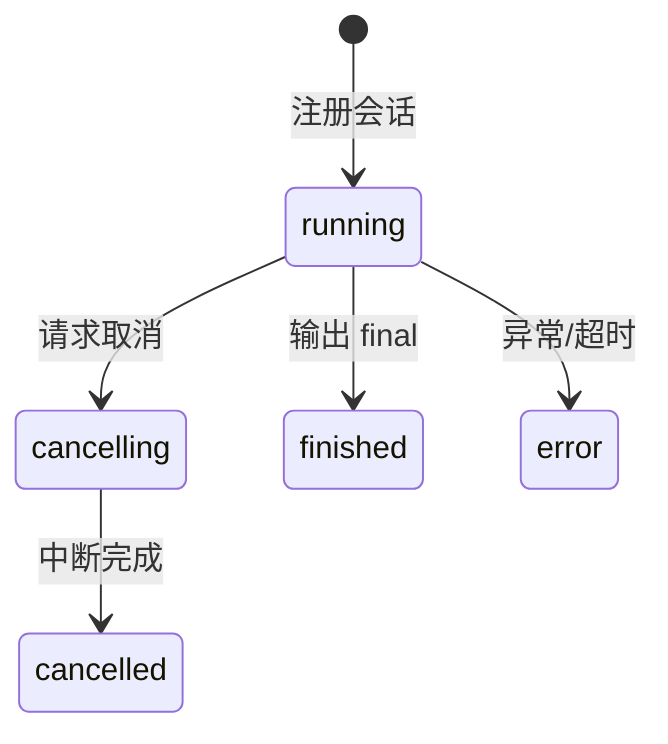
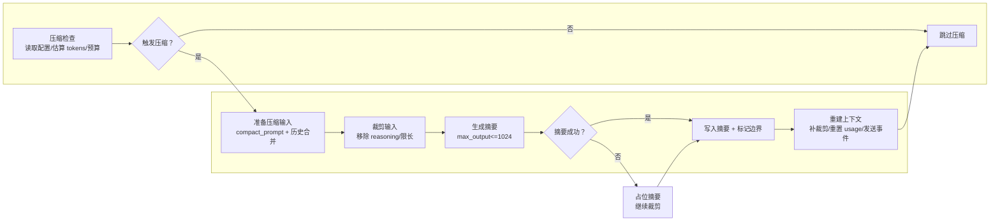

# wunder 系统介绍（管理层版·完整版）

## 1. 一页概览
wunder 是一个“智能体调度平台”，面向企业提供统一的大模型入口与工具编排能力。它把模型能力、工具能力和业务流程统一起来，形成可管理、可复用、可治理的智能体能力中心。
对于管理层而言，wunder 的价值不只是“能回答问题”，而是让智能体能力可以规模化落地、可持续运行、可量化评估，并在安全、成本、性能和合规之间实现平衡。

一句话理解：**一个入口对接多模型、多工具、多流程，让智能体真正成为企业生产力。**

主要特性概览：
- **统一入口**：通过 `/wunder` 提供统一服务入口，支持流式与非流式输出。
- **跨系统协作**：提供 A2A 标准接口 `/a2a` 与 AgentCard 能力发现。
- **工具体系化**：内置工具、MCP、Skills、知识库、自建/共享工具统一管理。
- **智能体管理**：用户可创建智能体并挂载工具，支持共享给其他用户，提示词追加到基础系统提示词后生效。
- **多用户隔离**：以 `user_id + agent_id` 作为线程与工作区隔离维度（默认无智能体时仍按 `user_id`），支持虚拟用户与注册用户并存。
- **单位层级管理**：支持四级单位结构与负责人配置，上级单位可管理下级单位用户与组织结构。
- **成本治理**：注册用户按单位层级配额，调用可计量、可提示、可追踪。

## 2. 核心理念与定位
**对开发者：一切皆接口。** 业务能力被抽象为接口和配置，便于快速集成与迭代。  
**对模型：一切皆工具。** 模型通过工具调用完成复杂任务，减少“不可控生成”。  
**对企业：一切可治理。** 过程透明、成本可算、风险可控，确保智能体可规模化落地。

## 3. 架构总览（系统级视角）
wunder 采用“统一入口 + 调度引擎 + 工具体系 + 存储与监控”的架构。核心由 Rust 实现，强调高性能与长期稳定运行（面向 10 年级别生命周期）。

### 3.1 系统组件关系图（保留原流程图）


### 3.2 管理层可理解的模块职责
- **统一入口层**：外部系统只需对接 `/wunder`，即获得智能体服务。
- **调度引擎**：负责模型选择、任务拆解、工具调用与流程控制。
- **工具执行层**：将各种能力统一为“工具”，实现安全、可控的调用。
- **存储与监控层**：对过程数据、事件与产物统一留存，便于审计与复盘。
- **并发与工作区策略**：会话锁与工作区按 `user_id + agent_id` 维度隔离，同一用户可并行多个智能体应用。

## 4. 运行流程（从请求到回复）
智能体响应不是一次“问答”，而是一个“规划 → 执行 → 汇总”的完整过程。系统支持实时流式返回，便于展示过程与进度。

### 4.1 运行流程图（保留原流程图）


### 4.2 管理层视角的流程解读
- **统一入口**：业务只关心“问题是什么”，系统负责调度与执行。
- **过程可追踪**：关键步骤都有事件记录，便于复盘与优化。
- **成本可控**：每次模型调用按额度计费并实时反馈。
- **安全可控**：调用工具前会根据白名单/黑名单策略做校验。

## 5. 工具体系（系统核心创新之一）
wunder 将所有能力统一抽象为“工具”，让模型像调用 API 一样调用企业能力，从而把“生成式回答”变成“可执行结果”。

### 5.1 工具类型与来源
| 工具类型 | 来源/存放 | 触发方式 | 共享/管控 | 适用场景 |
| --- | --- | --- | --- | --- |
| 内置工具 | `src/services/tools.rs` | 直接调用工具名 | 管理员配置启用 | 文件操作、命令执行、ptc、技能调用、计划面板、问询面板 |
| MCP 工具 | 配置文件 + 管理端维护 | 形如 `server@tool` | 管理员启用 + allow_tools | 连接外部服务/平台能力 |
| A2A 服务工具 | 配置文件 + 管理端维护 | 形如 `a2a@service` | 管理员启用 | 跨智能体委派/协作 |
| Skills | `skills/` 与用户技能包 | 技能名 | 管理员/用户启用 | 固化流程/最佳实践 |
| 知识库 | `knowledge/` 或用户知识库 | 知识库名 | 管理员/用户配置 | 本地知识检索 |
| 自建工具 | `data/user_tools/<user_id>` | 形如 `user_id@tool` | 用户配置 | 个性化能力扩展 |
| 共享工具 | 来自其他用户共享配置 | 形如 `owner_id@tool` | 共享标记 | 跨用户能力复用 |

### 5.2 工具调用模式（可控与兼容）
系统支持两种主流模式：
- **tool_call 模式**：模型输出工具调用标签，系统解析后执行工具。
- **function_call 模式**：基于 OpenAI 标准工具协议，结果以 tool 角色回传。

管理层价值：
- **兼容多模型**：不同模型调用方式可统一管理。
- **可控注入**：仅注入勾选工具，降低上下文成本与风险。

### 5.3 模型执行与工具编排策略
系统在工具层支持“计划面板、问询面板、A2UI 输出”等可视化与可交互机制，使模型输出更可控、更可用：
- **计划面板**：输出任务计划并在前端展示。
- **问询面板**：模型给出多条路线，用户可选择。
- **A2UI 输出**：将模型输出转为结构化 UI 组件，便于业务端直接呈现。

## 6. 知识库与 Skills（企业资产化）
企业知识沉淀是智能体长期价值的关键。wunder 支持知识库检索与 Skills 固化流程。

### 6.1 知识库机制
- **知识点切分**：Markdown 文档按一级标题切分为知识单元。
- **检索与排序**：先做候选筛选，再做重排序；异常时回退到词面匹配。
- **缓存优化**：解析结果缓存，减少重复 IO 与解析成本。

### 6.2 Skills 机制
- **标准化流程**：每个 Skill 用 `SKILL.md` 规范输入与输出。
- **可复用执行**：技能脚本支持统一入口，便于部署与复用。
- **风险可控**：管理员可控制技能启用与共享范围。

## 7. 自建/共享工具机制（组织协作能力）
自建与共享工具是组织内协作效率的关键，它把“个人能力”变成“组织能力”。

### 7.1 自建工具原理（简化理解）
- 配置即工具包：每个用户通过配置定义自己的 MCP、Skills、知识库。
- 统一命名规则：工具统一为 `user_id@tool`，避免冲突。
- 受控执行：执行阶段仍受全局安全策略限制。

### 7.2 共享工具原理（共享配置 + 别名路由）
- 共享标记即白名单，只有允许项可被其他用户使用。
- 系统自动汇总共享配置并形成工具清单。
- 执行时仅共享能力，不共享工作区或私密提示词。
- 用户需在工具管理中勾选共享工具后才会进入工具池并可挂载给智能体/会话。

## 8. 线程与监控（保证并发稳定）
为保障多人并发，系统采用线程级互斥与监控机制，确保同一用户不会引发资源冲突。

### 8.1 线程状态机（保留原流程图）


### 8.2 监控与事件体系（管理层重点）
- **过程可见**：关键事件如 `tool_call`、`tool_result`、`final` 等均可回放。
- **成本可算**：`context_usage` 记录真实上下文占用，区别于模型计费消耗。
- **配额可见**：`quota_usage` 实时回传本次消耗与剩余额度。
- **异常可追踪**：超时、错误与取消事件都会记录。

## 9. 长期记忆与上下文压缩（稳定与成本兼顾）
在长期对话场景中，系统通过“长期记忆 + 上下文压缩”保证体验与成本平衡。

### 9.1 长期记忆
- 会话完成后自动生成“长期记忆”，带时间戳与主题摘要。
- 可配置开启与上限数量，避免长期膨胀。
- 记忆内容可回注系统提示词，保证连续对话一致性。

### 9.2 上下文压缩流程图（保留原流程图）


### 9.3 触发与兜底机制（管理层可理解的价值）
- 双阈值触发：历史占用比例 + 当前消息超限双判断。
- 摘要失败有兜底：确保请求可继续完成，不中断业务。
- 压缩后重置历史占用，避免频繁重复压缩。

## 10. 安全与治理
安全与合规是企业级系统的底线要求，wunder 以“可控”为设计核心。

### 10.1 权限与审计
- 管理接口使用 `api_key` 鉴权，用户接口使用 Bearer Token。
- 工具调用受 `allow_paths/deny_globs` 白名单控制。
- 高风险命令支持审计与拦截（allow/audit/enforce）。

### 10.2 沙盒隔离
- 命令与 ptc 可走共享沙盒执行，限制网络与文件系统。
- 与主服务隔离，降低潜在风险。
- 沙盒镜像由沙盒服务自身镜像决定，系统配置不再下发 image 参数。

### 10.3 成本与配额治理
- 配额按“模型调用次数”计数，直观可控。
- 超额立即返回并提示，前端同步展示消耗。
- 支持管理端动态调整用户与团队配额。

## 11. 性能、压测与评估体系
wunder 内置性能与能力评估机制，保证系统长期稳定运行。

### 11.1 吞吐量测试
- 按并发档位压测，形成性能基线与趋势对比。
- 支持报告持久化与历史回放。

### 11.2 性能采样
- 采样提示词构建、工具调用、日志写入等关键路径耗时。
- 辅助定位性能瓶颈，指导优化投入。

### 11.3 能力评估
- 内置用例集评估，防止模型或工具升级导致质量退化。
- 评估过程与结果可追溯、可对比。

## 12. 数据与工作区资产沉淀
- 每个用户有独立工作区，支持文件与产物长期沉淀。
- 历史对话、工具日志、产物索引统一入库。
- PostgreSQL 为主存储，SQLite 仅用于测试。
- PostgreSQL 连接池可配置（`storage.postgres.pool_size`），适配高并发请求。
- 日志表按时间/工具维度补充索引，支持长期保留下的统计与清理效率。
- 过期临时文件可自动清理，避免资源膨胀。

## 13. 运维与管理入口（面向治理）
系统提供用户侧前端与管理端前端两套入口，分别服务业务使用与系统治理。

### 13.1 用户侧入口
- Vue3 前端，服务业务用户进行智能体交互。
- 支持工作区文件、历史会话与资源预览。
- 用户侧功能广场入口（`/home`）作为智能体应用入口，首卡为“新建智能体应用”，新增共享智能体区域，默认仍进入聊天页。

### 13.2 管理端入口
- 管理端前端用于配置与监控。
- 覆盖模型配置、工具管理、监控与评估等核心能力。

### 13.3 典型接口示意
- 统一入口：`/wunder`
- 跨系统协作：`/a2a`
- 工具清单：`/wunder/tools`
- 管理入口：`/wunder/admin/*`
- 文档转换：`/wunder/doc2md/convert`

## 14. 关键目录结构（便于管理与运维理解）
```
src/                 # Rust 服务入口与模块
  api/               # 入口与管理接口
  core/              # 基础配置与通用工具
  services/          # 内置工具/LLM/MCP/工作区等
  ops/               # 监控/性能/评估/压测
  sandbox/           # 沙盒 client/server
  orchestrator/      # 调度引擎
config/              # 基础配置
data/config/         # 管理端持久化覆盖
knowledge/           # 公共知识库
mcp_server/          # MCP 服务脚本
mcp_server/mcp_config.json # MCP 服务数据库/知识库配置文件
mcp_server/tools/    # MCP 工具包目录
temp_dir/            # 临时文件目录
EVA_SKILLS/          # 技能包目录
skills/              # 内置技能目录
web/                 # 管理端调试前端
frontend/            # 用户侧前端
docs/ppt/            # 系统介绍 PPT
docs/ppt-en/         # 系统介绍 PPT 英文版
prompts/             # 系统/工具/记忆提示词模板
fonts/               # 可选字体目录
```

## 15. 结语（管理层总结）
wunder 的定位不是“聊天机器人”，而是“企业级智能体调度平台”。它提供统一入口、流程编排、成本治理与安全合规，帮助企业把智能体能力从“试验”推进到“规模化运营”。
在持续演进方向上，wunder 将进一步强化行业化模板、质量回归体系与企业级合规能力，确保长期稳定与可持续投入产出。

如需更深层技术细节与接口说明，可另行提供技术方案与 API 文档。
