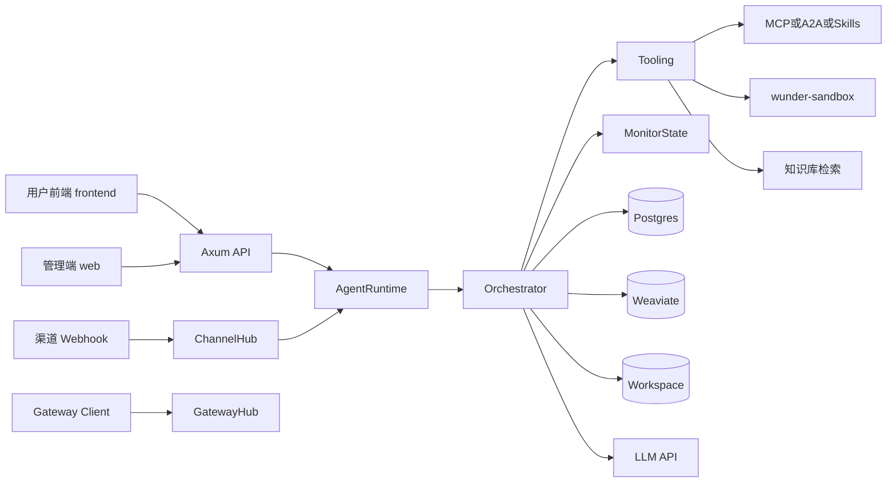
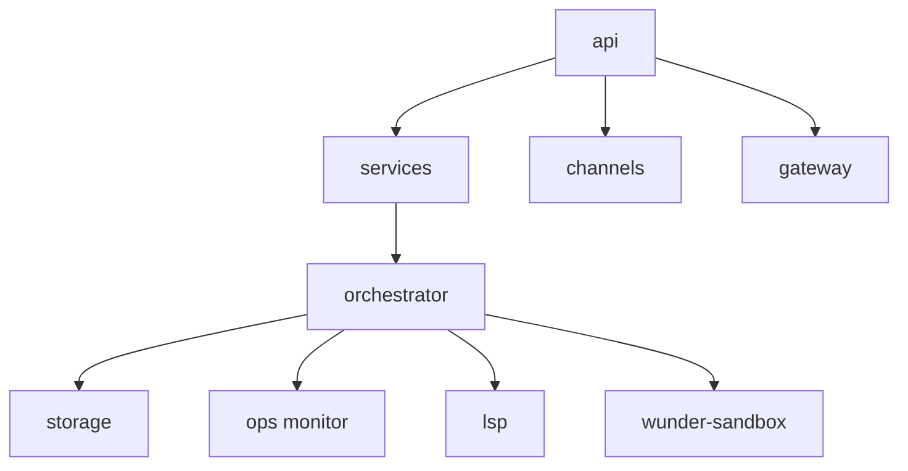
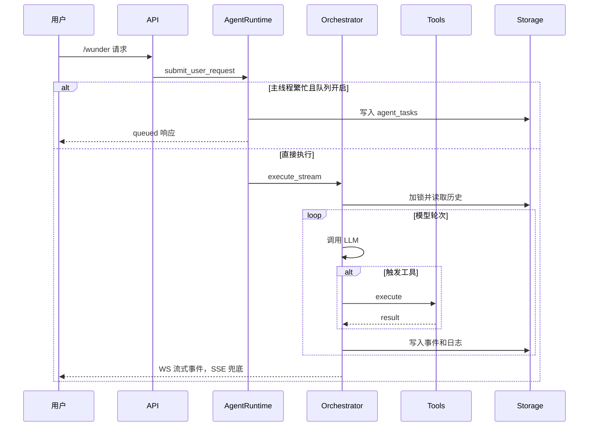
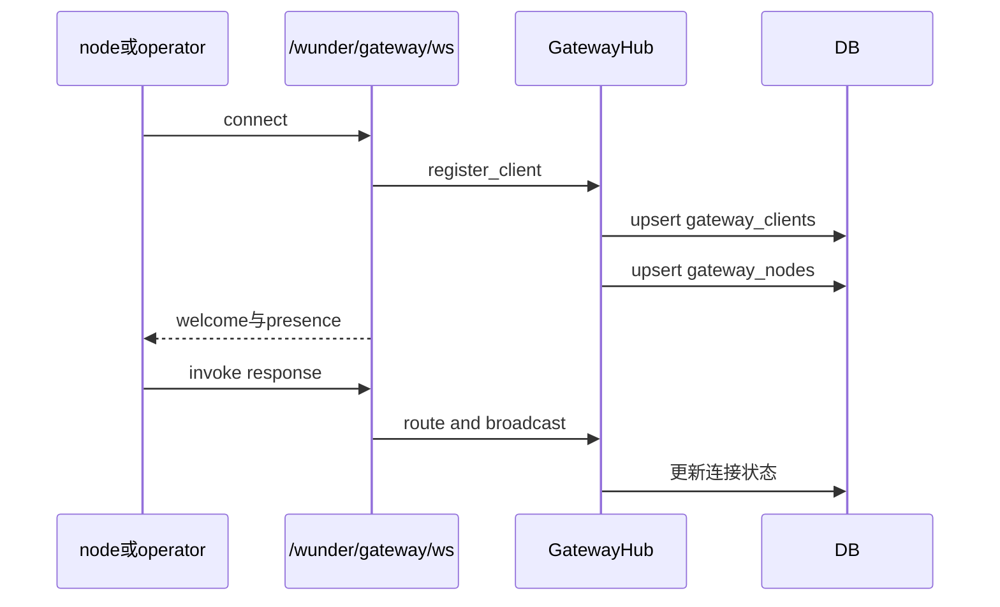
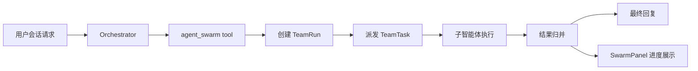
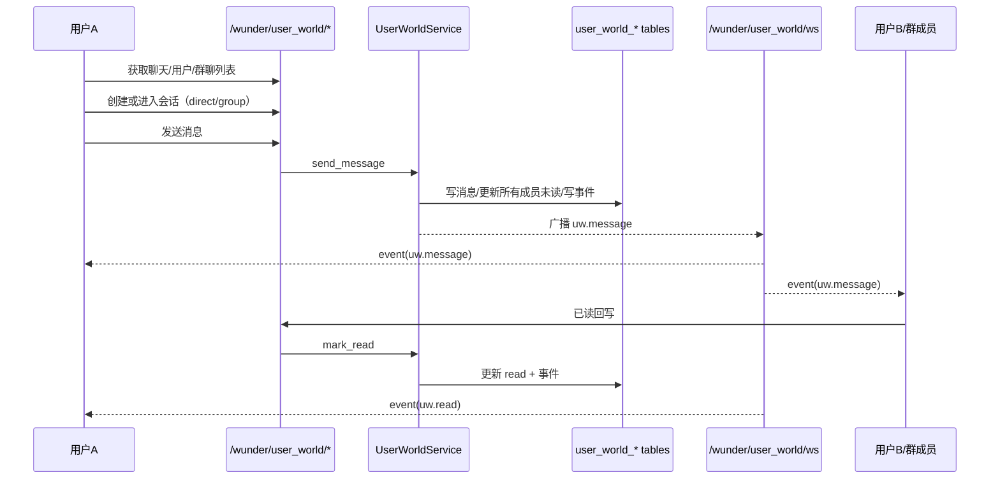
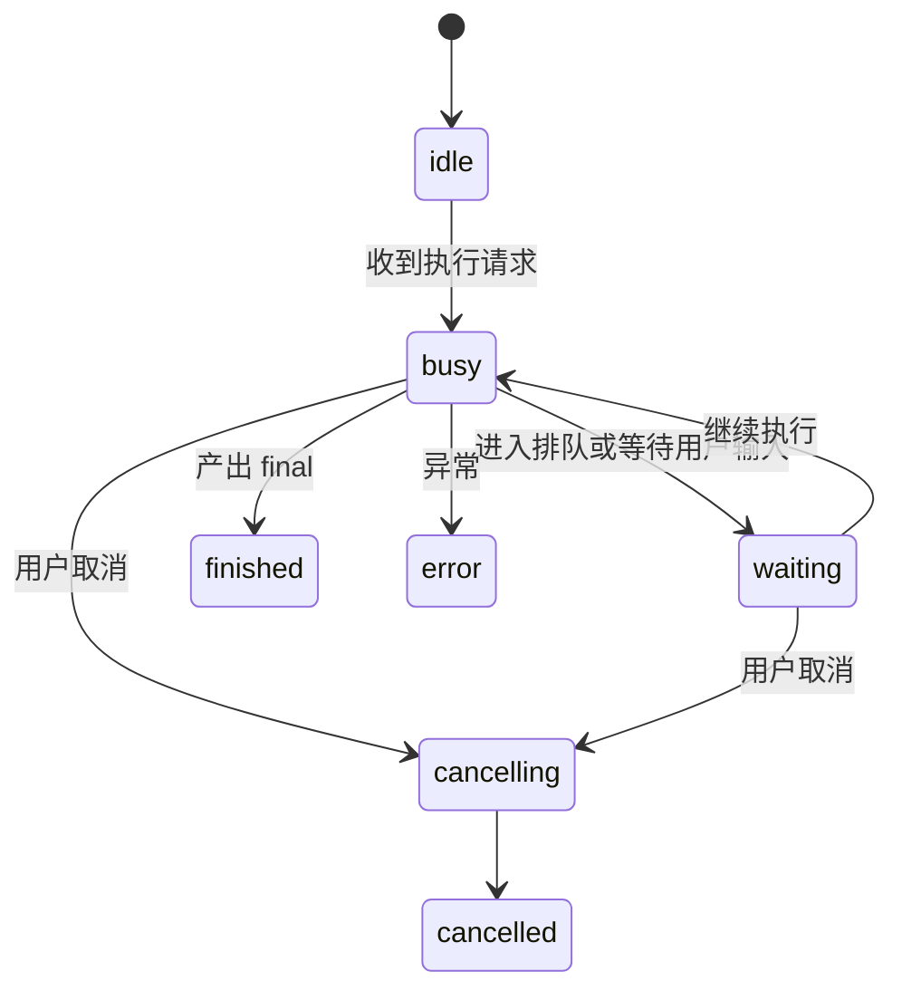
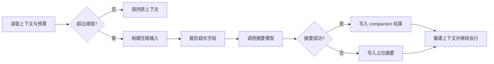

# wunder 系统介绍（代码对齐版）

本文档面向管理者和系统负责人，基于当前代码说明 wunder 的定位、能力边界、运行机制和治理方式。

## 1. 一页概览

wunder 是一个智能体调度平台。它把模型调用、工具调用、知识检索、会话管理和治理能力放到同一平台中，形成可扩展、可观测、可管控的统一执行底座。

当前产品定位已经从“单一问答入口”转向“通信/办公化智能体工作台”：

- 用户侧以消息与协作为主线，体验向飞书类通信软件靠齐。
- 运行形态以 desktop 为重心，server/cli 作为平台化与开发协同形态。
- 核心特色明确为“五维能力框架”：**形态协同 / 租户治理 / 智能体协作 / 工具生态 / 接口开放**。

一句话概括：

- 对开发者，能力统一为接口。
- 对模型，能力统一为工具。
- 对组织，能力统一为可治理资产。

## 2. 当前版本核心能力

- 五维能力框架是当前核心特色：形态协同 / 租户治理 / 智能体协作 / 工具生态 / 接口开放。
- 统一入口。wunder 系列接口承接普通调用、聊天会话、管理操作、渠道接入、网关控制面。
- Single-port access is supported in docker compose: expose only `18001` publicly and forward `/wunder`, `/a2a`, and `/.well-known/agent-card.json` to the internal backend.
- 双流式通道。默认 WebSocket，SSE 兜底，并支持事件断点恢复。
- 用户世界通信。新增用户↔用户实时通信域（联系人/会话/消息/已读），并支持在线状态（`online/last_seen_at`）、用户容器文件区、@路径附件发送与下载、语音消息（WAV）收发与播放。
- 用户侧交互壳重构。用户前端改为 HuLa 风格三栏聊天布局，统一承载消息/用户/群聊/智能体/工具/文件/更多设置，并在右侧提供沙盒、时间线、设置扩展区。
- desktop 重心与端云协同。桌面端提供本地优先运行、远端网关接入、容器目录映射与初始化同步（seed）能力，后续以端云协同模式作为主部署路径。
- 容器工作区分层：用户私有文件固定走 `container_id=0`，智能体运行容器使用 `1~10`，支持按容器分别映射本地目录并独立管理。
- 智能体内见系统：用户私有工作区同时承载智能体可见配置面，`global/tooling.json`、`skills/`、`agents/<agent_id>/worker-card.json` 与 `system_prompt.md` 可直接被聊天中的智能体读写；运行时会在请求前做轻量同步，并把有效快照/诊断写入 `.wunder/`。
- Desktop 本地模式与 CLI 单根工作区均视为用户持久工作目录，不再按 24 小时空闲策略自动清理容器文件；同时桌面本地模式的内置文件工具已放开本机绝对路径访问，不再因为超出工作区而默认拒绝。
- 主线程和队列。按 user_id 和 agent_id 维护主会话，忙时进入任务队列。
- 会话线程显式控制。新增内置工具 `会话线程控制`，模型可主动创建/切换/返回/归档线程，并把线程切换意图通过 `thread_control` 事件同步给用户前端。
- 多通信入口。支持用户侧请求、外部 webhook 渠道、网关节点接入三类入口。
- 多工具编排。内置工具、MCP、A2A、Skills、知识库与用户自建工具统一编排；共享工具字段兼容保留但运行时已停用。
- 工具结果防爆机制。工具执行结果先按预算裁剪，MCP observation 入模前再做二次压缩，并向模型返回 `truncated/observation_truncated/continuation_required` 等信号，驱动自动分页或缩小查询范围，避免基于片段误判。
- 产物型数据库任务支持直出文件。绑定表 `db_query*` 工具会返回 `query_handle`，配对的 `db_export*` 工具可直接把查询结果导出为 `xlsx/csv`；当导出路径使用当前工作区 `/workspaces/{user_id}/...` 时，生成文件会返回精简后的 `path` 与 `workspace_relative_path` 供后续文件工具继续处理。为避免把样本查询误导出成正式文件，`db_export*` 默认拒绝仍含 `LIMIT/OFFSET` 的 SQL/query_handle，除非显式声明 `allow_limited_export=true`。
- `搜索内容` 工具升级为双引擎：`engine=auto|rg|rust`（`auto` 优先 `rg` 快速候选并自动回退 `rust`），新增 `timeout_ms/max_matches/max_candidates` 入参，返回兼容 `matches`、结构化 `hits` 与 `meta.search`（引擎回退、超时、耗时等可观测字段）。
- `执行命令` 工具在 `allow_commands=*` 场景按整段脚本执行，保留多行控制流语义；收敛白名单场景继续逐行前缀校验。输出护栏已在本机与 sandbox 路径对齐：stdout/stderr 均采用字节上限与头尾保留策略，结果统一携带 `output_meta` 与 `meta.output_guard`。
- `执行命令` 入口会拦截“纯补丁正文”（`*** Begin Patch ... *** End Patch`）并自动路由到 `应用补丁`，避免命令路径与补丁路径并行改写同一文件导致语义分叉。
- `读取文件` 新增 `mode=slice|indentation`。`indentation` 模式支持 `anchor_line/max_levels/include_siblings/include_header/max_lines`，用于低 token 成本读取函数/类等结构化代码块。
- `执行命令/写入文件/应用补丁` 新增 `dry_run` 预演：先返回命令计划或补丁/写入摘要，再决定是否实际执行，降低误操作风险。
- `执行命令` 新增预算参数（`time_budget_ms/output_budget_bytes/max_commands`，支持 `budget` 对象），并将最终预算回传到结果中，避免单轮工具调用占用过量时间与上下文。
- `搜索内容` 与 `读取文件` 同步支持预算与 `dry_run`：可限制时长、返回体积与文件数量，并在 `meta.search` / `meta.read` 标记预算触发信息（如 `output_budget_hit`、`timeout_hit`）。
- 基础工具失败结果补充 `error_meta`（`code/hint/retryable/retry_after_ms`），提升前端与模型的自动恢复能力。
- 调度层异常现在统一输出运行时 `error_meta`（`category/severity/retryable/retry_after_ms/source_stage/recovery_action`），并在 WS/SSE/HTTP 错误出口保持一致。
- 会话流新增 `turn_terminal` 作为每轮唯一终结事件，新增 `approval_resolved` 作为审批请求闭环事件，降低前端与调用方在异常路径上的状态猜测成本。
- 会话线程运行态显式化。loaded runtime 会通过 `thread_status` 持续同步 `running/waiting_approval/waiting_user_input/idle/not_loaded/system_error`，在线程卸载时额外发送 `thread_closed`，降低断线恢复和多端订阅时的状态漂移。
- 待审批请求现在由共享审批注册表统一托管，网页/桌面 WebSocket 与渠道会话各自按 `source` 隔离清理与消费，避免一个入口的取消或审批操作误伤另一个入口的待审批状态。
- 写入链路（`写入文件` 与 `应用补丁` 落盘）切换为原子写替换策略（同目录临时文件 + rename + 回滚保护），降低异常中断与并发覆盖导致的半写入风险。
- 技能分层治理。技能按 `builtin/custom/external` 分层：内置技能默认只读，用户与管理员上传仅写入 custom 目录；desktop 启动会覆盖同步内置技能，重装后自动使用最新内置版本。
- 技能路径占位符标准化。技能文档内统一使用 `{{SKILL_ROOT}}` 引用本技能资源；`skill_call` 返回时自动替换为模型可见绝对路径，减少跨运行目录的路径失配。
- 多运行形态统一。`wunder-server`、`wunder-cli`、`wunder-desktop` 共用同一套 Rust 核心编排与工具系统。
- Desktop 本地模式内置浏览器自动化工具（浏览器，action=navigate|click|type|screenshot|read_page|close），仅 desktop 模式启用。
- 新增内置网页抓取工具（`网页抓取` / `web_fetch`）。该工具直接通过 HTTP 抓取页面，并在返回前做正文抽取、导航/页脚/相关推荐等噪声剔除、重复块去重与字符预算裁剪，适合“读网页正文”而不是“操控网页”。
- Desktop 本地模式新增桌面控制器/桌面监视器工具（bbox+action 或 wait_ms），执行后自动附加桌面截图；同会话会按“上一帧→当前帧”双帧回灌强化校验；仅视觉模型可见。
- 新增内置主动休眠工具（`sleep`）。可在工具链中等待指定秒数（如 300 秒），避免通过命令行绕行 sleep。
- 新增内置读图工具（`read_image`/`view_image`）。仅视觉模型（`support_vision=true`）可见，调用后会把本地图像自动附加到下一轮模型上下文用于视觉分析。
- 提示词治理模块化。系统提示词按分段文件组织（role/engineering/tools_protocol/skills_protocol/历史记忆/extra），支持多套模板包（`prompt_templates.active`，默认包只读，建议新建包后编辑）；运行环境段按 `server.mode` 区分 server 与 cli/desktop。
- 长期记忆升级为结构化记忆碎片系统。线程系统提示词首次物化时会注入一份记忆快照并随线程冻结；记忆块除最多注入 30 条命中项外，还会附带当前可用记忆总数与继续检索提示，帮助模型在当前注入不足时主动调用内置工具 `记忆管理` 的 `recall/list` 动作扩展检索；同一线程后续轮次不再自动改写 system prompt。当前记忆 recall 已关闭 embedding/语义 rerank，仅保留轻量关键词召回与命中解释。
- 当前长期记忆采用“手动写入优先 + 按智能体可选自动提炼”模式：默认不会自动提炼；用户可在对应智能体的“记忆碎片 -> 最近提炼任务”弹窗中单独开启自动提炼。开启后，系统会在每个用户轮次结束且产出最终回复后，异步复用大模型调用链路，基于“当前用户问题 + 近期用户消息窗口”提炼稳定记忆；服务端继续负责去重、版本替代与手工/置顶碎片保护。自动提炼提示词模板位于 `prompts/{zh|en}/memory_auto_extract.txt`，并跟随当前激活的提示词模板包读取。长期记忆仍可由用户在记忆碎片页维护，或由智能体显式调用 `memory_manager` 写入。对于同 `fact_key` 的新版本事实，系统会自动形成 `supersede` 版本链，保留旧记录但默认不再参与 recall。
- 生命周期内核第一版已启用：系统会在记忆创建、编辑、命中与列表读取时惰性重算 `tier(core/working/peripheral)`，并根据访问频次、时间衰减、重要度、确认/置顶状态做升降级。
- 用户侧智能体页面在“设置”旁新增“记忆碎片”入口，可按卡片查看当前智能体记忆全貌，并对单条碎片执行编辑、删除、确认、置顶、作废/恢复；卡片与弹窗会展示当前状态、层级与“替代了谁 / 被谁替代”。
- 用户侧提示词可自主管理。用户在系统设置中可维护个人提示词模板包（`/wunder/prompt_templates/*`）；`default` 包与系统当前启用模板同步，自建包仅作用于新线程。
- 双语提示词目录。提示词维护在 `prompts/zh` 与 `prompts/en`；英文模式强制优先英文工具别名，降低跨语言调用歧义。
- 蜂群协作能力。基于 `hive_id` / 蜂群分组隔离智能体，任意带 `agent_swarm` 工具的智能体会话都可触发组内协作；desktop 产品名为“蜂巢 / beeroom”，但用户侧功能区名称统一为“蜂群”，并通过纯画布蜂群工作台统一观测任务闭环。
- 飞书长连接。对 active 且凭证完整的飞书账号自动维持 WebSocket 长连接，收到消息后进入 ChannelHub 主链路。
- XMPP 长连接。对 active 且凭证完整的 XMPP 账号自动维持标准客户端长连接，支持 MUC 自动入房、群消息自回声过滤、IQ ping 被动应答与主动心跳重连、会话内出站复用；兼容 openfang 字段别名 `password_env/server/rooms`。
- 渠道即时回执。飞书/XMPP 入站会先回发“已收到，正在处理”提示，再异步完成模型推理与最终回包。
- XMPP 附件入站。支持解析 `jabber:x:oob` 与 `urn:xmpp:reference:0` URL 附件，符合下载条件的文件会落盘到会话作用域工作区（按 agent 容器隔离）。
- 渠道下载链接改写。出站文本中的 `/workspaces/...`（含 ``）会自动改写为 `/wunder/temp_dir/download` 链接，便于飞书/XMPP等客户端直接访问。
- 渠道下载链接改写增强（2026-03-18）。出站 `attachments[].url` 中的 `/workspaces/...` 也会自动改写为 `/wunder/temp_dir/download`，不再仅限文本正文。
- 飞书附件出站增强（2026-03-18）。`channel_outbox` 出站支持附件上传并发送原生 `image/file` 消息，无法原生发送的类型会回退为文本链接，避免丢失。
- XMPP 附件出站增强（2026-03-18）。出站消息会附带 `jabber:x:oob` 与 `urn:xmpp:reference:0` 附件节点，并保留文本兜底，提高跨客户端可达性。
- XMPP 自定义消息格式（2026-03-23）。新增账号级开关 `xmpp.custom_message_format_enabled`；开启后纯文本出站优先发送三层 Base64 + HTML 自定义格式，发送失败自动回退标准 XMPP stanza，入站则先尝试自定义格式解析再回退标准解析。
- XMPP 明文连接模式（2026-03-23）。新增 `xmpp.tls_enabled=false` 支持内网/遗留服务端 plaintext 连接；默认仍使用 TLS（`trust_self_signed` 与严格校验策略保持不变）。
- QQBot 附件链路增强（2026-03-18）。群聊/私聊出站支持通过 `/v2/*/files` 发送富媒体 URL（image/video/audio）；QQBot 入站 URL 附件会下载落盘到会话作用域工作区。
- 新增内置 `渠道工具`（`channel_tool`）。支持 `list_contacts`（融合会话历史与 XMPP roster，带短 TTL 缓存并支持 `refresh=true` 强刷）与 `send_message`（指定渠道对象发送）；发送链路复用 outbox 与下载链接改写，支持模型把处理后的文件链接转发给其他渠道用户。
- 渠道工具最小调用优化：`send_message` 可仅传消息体，`channel/account_id/to` 支持从会话上下文与账号默认配置自动补全；`list_contacts` 会返回可直接回传的 `contact` 对象。
- Desktop 本地模式默认开启渠道 outbox worker（`channels.outbox.worker_enabled=true`），保证 `channel_tool.send_message` 在无管理员侧前端时也可自动投递。
- 测试开放态（2026-03-11）。为便于内部联调，`channel_tool` 默认放开账号归属限制；渠道请求默认使用 `approval_mode=full_auto` 与 `exec_policy_mode=allow`，不进入渠道审批提示闭环。
- 微信渠道回调与直连出站。支持企业微信 `/wunder/channel/wechat/webhook` 与微信公众号 `/wunder/channel/wechat_mp/webhook`（GET URL 验证 + POST 消息回调），并可用官方 API 直接回包。
- 渠道注册表架构。`ChannelAdapterRegistry` 统一装配渠道适配器，`/wunder/channel/{provider}/webhook` 与 outbox 出站均按注册表分发，新增渠道仅需实现适配器并注册。
- 管理端运行态可视化。渠道监控页可查看 `runtime.feishu_long_connection`、`runtime.qqbot_long_connection` 与 `runtime.xmpp_long_connection` 状态、持有者用户名以及入站/出站分维通信统计（成功/失败/重试/成功率），支持按关键字/状态/活跃时间/异常态筛选，并提供批量启停、批量删除、删除前影响预估与 CSV 导出，便于排查与治理接入问题。
- 舰桥中心。管理员可将飞书、QQBot、WhatsApp、微信、XMPP 等渠道账号统一接入舰桥中心；配置方式收敛为“新建舰桥节点 + 配置默认预设 + 通过渠道设置绑定单个渠道账号”。常规渠道直接绑定现有账号，`Weixin iLink (New)` 额外支持在管理员侧弹窗中扫码建号并自动绑定。外部用户名首次发消息时系统会自动开户、默认密码 `123456`、自动配置指定预设智能体，并持续维护“外部身份 -> wunder 用户/智能体/线程”的桥接路由与投递日志。
- 用户侧渠道日志面板。新增 `/wunder/channels/runtime_logs` 查询接口，飞书/XMPP/QQBot 长连接状态（worker 启动、连接、失败、QQ intents 自动降级）优先写入渠道运行日志缓冲，并在用户渠道设置页底部展示；同类日志在时间窗口内聚合计数（`repeat_count`）以降低刷屏。
- 管理端预设智能体治理。新增“预设智能体”面板（左侧预设列表，右侧“预设与智能体设置 / 定时任务 / 渠道配置”分栏），使用固定模板用户维护同名智能体设置、定时任务与渠道配置；同名智能体优先复用，不存在则自动创建。列表会额外补充模板用户的默认智能体，支持管理员直接编辑并对存量用户执行 safe/force 同步。预设智能体固定使用默认蜂群分组，渠道配置采用单账号默认绑定模式。
- 智能体模型粒度下沉。用户侧智能体设置支持按智能体选择 `model_name`（空值回退默认模型），并在工蜂卡导入导出时保留该字段；管理端预设智能体同步支持配置并下发 `model_name`。
- 预设继承与存量同步。预设智能体采用稳定 `preset_id + revision` 管理，注册用户拿到的智能体会保存模板绑定快照；管理员修改预设后，可先查看安全同步预演，再执行“同步未自定义项”或“强制覆盖同步”，既能统一下发，又能尽量保留用户已手动调整的字段。该 `preset_id` 只用于后端绑定与版本管理；工蜂卡协议里改用 `metadata.agent_id` 承载同一份内部稳定标识，值继续统一采用 `preset_<stable-hash>` 形态。界面和预设工蜂卡文件名继续只呈现名称；预设附加元信息统一收口到顶层 `preset` 段，不再使用 `extensions`。
- 多模态渠道。支持语音转写、图片识别、地理描述、语音回包。
- 前端工程化。用户侧前端已升级为 TypeScript 实现，当前交付门槛为 `npm run typecheck` 与 `npm run build:check`。
- 组织治理。支持组织树、角色权限、配额和访问控制。
- 评估运维。内置监控、吞吐压测、性能采样、能力评估。

## 3. 系统结构

### 3.1 服务层结构

#### 系统组件关系图

```mermaid
flowchart LR
  USER[用户前端 frontend] --> API[Axum API]
  ADMIN[管理端 web] --> API
  CH[渠道 Webhook] --> HUB[ChannelHub]
  GW[Gateway Client] --> GWHUB[GatewayHub]

  API --> AR[AgentRuntime]
  HUB --> AR
  AR --> ORCH[Orchestrator]
  ORCH --> TOOL[Tooling]
  ORCH --> MON[MonitorState]
  ORCH --> DB[(Postgres)]
  ORCH --> WV[(Weaviate)]
  ORCH --> WS[(Workspace)]

  TOOL --> MCP[MCP或A2A或Skills]
  TOOL --> SBX[wunder-sandbox]
  TOOL --> KB[知识库检索]
  ORCH --> LLM[LLM API]
```

- wunder-server。主服务，承接 API 路由和调度执行。
- sandbox。沙盒服务，承接高风险执行任务。
- postgres。关系数据主库。
- weaviate。向量检索后端。
- frontend。用户侧前端（Vue3 + TypeScript）。
- web。管理端前端（治理与调试视角）。

### 3.2 代码层结构

#### 代码层协作图

```mermaid
flowchart TB
  API[api] --> SRV[services]
  API --> CHN[channels]
  API --> GATE[gateway]
  SRV --> ORC[orchestrator]
  ORC --> STG[storage]
  ORC --> OPS[ops monitor]
  ORC --> LSP[lsp]
  ORC --> SBOX[wunder-sandbox]
```

- api 层。路由和协议适配。
- orchestrator 层。模型和工具调度核心。
- services 层。用户、会话、工具、知识、定时任务、工作区等服务。
- channels 层。外部消息渠道接入和回包。
- gateway 层。控制平面连接管理。
- storage 层。数据库读写抽象。
- ops 层。观测和评估能力。

## 4. 三条主业务链路

### 4.1 用户对话链路

#### 用户对话时序图

```mermaid
sequenceDiagram
  participant U as 用户
  participant API as API
  participant AR as AgentRuntime
  participant O as Orchestrator
  participant T as Tools
  participant S as Storage

  U->>API: /wunder 请求
  API->>AR: submit_user_request
  alt 主线程繁忙且队列开启
    AR->>S: 写入 agent_tasks
    AR-->>U: queued 响应
  else 直接执行
    AR->>O: execute_stream
    O->>S: 加锁并读取历史
    loop 模型轮次
      O->>O: 调用 LLM
      alt 触发工具
        O->>T: execute
        T-->>O: result
      end
      O->>S: 写入事件和日志
    end
    O-->>U: WS 流式事件，SSE 兜底
  end
```

1. 客户端发起请求。
2. 系统解析用户身份并绑定会话。
3. AgentRuntime 判断是否需要排队。
4. Orchestrator 执行模型和工具循环。
5. 事件流实时输出并持久化。
6. 最终结果和会话状态回写数据库。

### 4.2 渠道消息链路

#### 渠道处理流程图

```mermaid
flowchart LR
  IN[渠道入站消息] --> VERIFY[签名与账号校验]
  VERIFY --> QUEUE[入站队列]
  QUEUE --> MAP[绑定用户与会话]
  MAP --> MM[媒体预处理]
  MM --> RUN[调度执行]
  RUN --> OUT[channel_outbox]
  OUT --> RETRY[异步重试投递]
```

1. 外部渠道 webhook 接入。
2. 系统按 provider 查询 `ChannelAdapterRegistry`，执行适配器验签/解析（未命中时回退通用 JSON 解析）。
3. 通过有界入站队列快速接收并回执，后台并发消费消息，避免渠道回调被长推理阻塞。
4. 根据绑定策略映射用户和会话。
5. 多模态消息预处理。
6. 调度引擎生成回复。
7. 默认策略下，若触发工具审批，系统会在渠道内下发审批提示，用户回复 `1/2/3` 完成审批决策；测试开放态（2026-03-11）默认关闭该步骤。
8. 出站消息进入 outbox 并异步投递（注册表优先走渠道适配器，未命中回退 `outbound_url`）。

### 4.3 网关控制面链路

#### 网关控制流程图

```mermaid
sequenceDiagram
  participant C as node或operator
  participant WS as /wunder/gateway/ws
  participant H as GatewayHub
  participant D as DB

  C->>WS: connect
  WS->>H: register_client
  H->>D: upsert gateway_clients
  H->>D: upsert gateway_nodes
  WS-->>C: welcome与presence
  C->>WS: invoke response
  WS->>H: route and broadcast
  H->>D: 更新连接状态
```

1. operator、node 或 channel 建立网关连接。
2. 网关完成握手并登记连接状态。
3. 管理端可查询 presence 并下发 node invoke。
4. 响应和状态事件回写控制平面表。

### 4.4 蜂群协作链路（蜂巢 / beeroom 模式）

#### 蜂群协作流程图

```mermaid
flowchart LR
  U[用户会话请求] --> O[Orchestrator]
  O --> S[agent_swarm tool]
  S --> R[创建 TeamRun]
  R --> T[派发 TeamTask]
  T --> A[子智能体执行]
  A --> M[结果归并]
  M --> F[最终回复]
  M --> P[SwarmPanel 进度展示]
```

1. 会话内触发蜂群能力后，系统在当前会话上下文中创建 TeamRun。
2. TeamRun 拆解为多个 TeamTask 由子智能体并行执行，再由母任务归并结果。
3. 聊天页通过 `SwarmPanel` 回放当前会话的蜂群执行链路；用户也可进入蜂群工作台（路由仍为 `/beeroom`）从组维度观察成员、任务和闭环状态。工作台主视图为 G6 画布，右侧为可折叠协作对话栏，母蜂派发与工蜂反馈以 `@智能体` 群聊样式呈现。
4. `agent_swarm`、TeamRun 与蜂群接口统一保留 `hive_id` 作用域参数；若当前会话绑定了蜂群成员，则默认取该成员所属蜂群。
5. 首个实际触发蜂群工具的组内智能体会被认领为母蜂；后续任务拆分、子任务派发、结果汇总都以该母蜂为协同锚点。
6. 蜂群画布右侧协作对话栏由服务端持久化，按蜂群维度独立存储；页面刷新、多端切换后仍可回放历史，且支持手动清空。
7. 协作对话实时通道采用 `WebSocket (/wunder/beeroom/ws)` 优先，`SSE (/wunder/beeroom/groups/{group_id}/chat/stream)` 兜底；前端在 WS 失败时自动切 SSE，WS 恢复后自动回切。
8. 轮询仍保留为最终兜底，但仅在 WS/SSE 都不可用时短周期启用，实时链路恢复后自动停轮询，降低页面抖动与重复请求。
9. 实时事件包含 `chat_message/chat_cleared/team_start/team_task_dispatch/team_task_update/team_task_result/team_merge/team_finish/team_error/sync_required`；当出现 lag（`reason=lagged`）或断线重连发现续传缺口（`reason=resume_gap`）时，前端会回源 `GET /wunder/beeroom/groups/{group_id}/chat/messages` 与 `GET /wunder/beeroom/groups/{group_id}` 做一致性补齐。
10. 蜂群内用户派发与 `agent_swarm` 工具派发在未显式指定 `session_id` 时，统一优先复用目标智能体主线程；仅当该智能体从未建立线程时才自动补建。
11. 任务在“所有子任务进入终态 + 所有涉及组员恢复空闲”后视为闭环完成，蜂群页会将状态标记为 `completed`，否则可能停留在 `running/awaiting_idle/failed/cancelled`。
12. 蜂群页演示模式通过 `/wunder/beeroom/groups/{group_id}/demo_runs*` 提供启动/查询/取消能力：流程保持真实编排器与工具链，仅模型响应改为本地 mock，便于稳定演示全链路并支持链路健康检查。

### 4.5 用户世界链路（用户↔用户）

#### 用户世界通信流程图

```mermaid
sequenceDiagram
  participant A as 用户A
  participant API as /wunder/user_world/*
  participant UW as UserWorldService
  participant DB as user_world_* tables
  participant WS as /wunder/user_world/ws
  participant B as 用户B/群成员

  A->>API: 获取聊天/用户/群聊列表
  A->>API: 创建或进入会话（direct/group）
  A->>API: 发送消息
  API->>UW: send_message
  UW->>DB: 写消息/更新所有成员未读/写事件
  UW-->>WS: 广播 uw.message
  WS-->>A: event(uw.message)
  WS-->>B: event(uw.message)
  B->>API: 已读回写
  API->>UW: mark_read
  UW->>DB: 更新 read + 事件
  WS-->>A: event(uw.read)
```

1. 用户侧通过 `/wunder/user_world/contacts`、`/groups` 与 `/conversations` 拉取“用户/群聊/最近聊天”数据。
2. 发送消息落库到 `user_world_messages`，并更新会话摘要、所有成员未读计数与 `user_world_events`。
3. WebSocket 通道实时推送 `uw.message/uw.read`；断线时可通过 SSE `events` 以 `after_event_id` 续传补偿。
4. 用户容器文件落在用户工作区 `user-world/` 目录，@路径会渲染为文件卡片并支持下载，删除后前端标记为已移除。

### 4.6 蜂群资产导入导出链路（HivePack）

1. 蜂群可作为“蜂群包（HivePack）”导出；协议设计上单个工蜂已升级为“工蜂卡（WorkerCard）”，使用单文件描述名称、附加提示、工具、技能、预设问题与运行策略。
2. 用户在蜂群页中栏点击 `+` 可直接导入 `.hivepack`，系统会自动创建工蜂智能体并归属目标蜂群。
3. 用户将鼠标移到蜂群列表条目上会浮出导出按钮，点击后触发 `full` 导出并自动下载包文件。
4. 导入后默认挂载目标系统当前可用的内置工具/MCP 工具/知识库工具，并自动安装与启用包内技能，实现快速本地化适配。
5. 当导入资产与现有蜂群/智能体/技能重名时，默认策略为自动追加后缀后新建（不复用）；同时支持 `update_replace` 原位替换模式以直接替换目标蜂群。
6. 工蜂导入已收敛为纯 `WorkerCard`：每个工蜂目录需要提供 `worker-card.json`；旧版 `WORKER_ROLE.md / skills.yaml / worker.yaml` 不再作为兼容输入保留。
7. 导入前会对工蜂卡声明的工具、技能做预检；若当前环境缺失，只提示不阻断，并把缺失项保留为声明信息，后续在智能体设置页持续提醒。当前工蜂卡以 `prompt.extra_prompt` 作为标准提示词字段；导出版本为 `wunder/worker-card@2`，结构化依赖落在 `abilities.items[]`，同时保留 `abilities.tool_names/abilities.skills` 兼容旧调用方，旧版 `prompt.system_prompt` 仅做兼容读取。
8. 工具目录接口已补齐统一能力视图：`/wunder/tools` 与 `/wunder/user_tools/catalog` 在保留旧分组字段的同时新增 `items[]`，用 `group` 描述展示分区、用 `kind` 区分工具/技能，便于聊天页、工具管理页、依赖检查和 worker-card 共享同一套能力模型。
9. 当前已落地接口：`POST /wunder/beeroom/packs/import`、`GET /wunder/beeroom/packs/import/{job_id}`、`POST /wunder/beeroom/packs/export`、`GET /wunder/beeroom/packs/export/{job_id}`、`GET /wunder/beeroom/packs/export/{job_id}/download`。
10. 导入/导出为任务化流程，状态机为 `uploaded→validating→planning→installing→creating_agents→activating→completed|failed`；当前前端通过结果消息反馈状态，不展示独立任务面板。
11. 导入完成后任务报告会返回 `report.conflicts`，包含自动改名总数及蜂群/工蜂/技能的改名前后明细；前端会在成功提示中显示“自动改名 N 项”，并弹窗展示首批改名映射。
12. 详细协议定义、目录规范和冲突策略见 `docs/蜂巢协议设计.md`。

## 5. 并发与隔离策略

### 5.1 隔离

- 会话级隔离。session_id 维度互斥。
- 主线程隔离。user_id 加 agent_id 维度维护主会话。
- 工作区隔离。用户和容器作用域共同隔离文件空间。
- 身份隔离。虚拟用户与注册用户均可调用调度链路，治理策略不同。

### 5.2 排队与恢复

#### 排队与会话状态图

```mermaid
stateDiagram-v2
  [*] --> idle
  idle --> busy: 收到执行请求
  busy --> waiting: 进入排队或等待用户输入
  waiting --> busy: 继续执行
  busy --> cancelling: 用户取消
  waiting --> cancelling: 用户取消
  cancelling --> cancelled
  busy --> finished: 产出 final
  busy --> error: 异常
```

- 忙会话请求可进入 agent_tasks，由后台消费。
- 流式事件写入 stream_events，断线可恢复。
- 线程运行态由调度层内存状态机维护：active turn 结束后会切回 `idle` 或 `waiting_user_input`，若此时无订阅者则进一步卸载为 `not_loaded` 并发出 `thread_closed`。

### 5.3 轮次统计

- 用户轮次按输入消息计数。
- 模型轮次按模型动作计数。
- token 相关统计用于上下文占用评估，不等同计费总消耗。

## 6. 数据资产

系统将会话过程资产化，主要沉淀内容包括：

- 会话元数据和消息历史
- 工具调用和产物日志
- 监控快照和流式事件
- 主线程和排队任务状态
- 定时任务定义与运行记录
- 渠道接入、回包和媒体索引
- 网关连接和节点令牌
- 用户、组织、权限、智能体配置
- 评估记录和向量文档元数据

## 7. 治理机制

### 7.1 权限治理

- 管理接口支持 api key 和管理员 token。
- 用户接口通过 token 鉴权。
- 外部系统嵌入支持两种免登录接入：一是通过 `security.external_auth_key` 调用 `/wunder/auth/external/*`；二是使用 `/login?token=<team_jwt>&user_id=<id>` 直换 wunder `access_token`。当前 JWT 校验失败不阻断该直换流程，后端同时返回 `agent_id`，前端直接进入 `/app/embed/chat`（或 `/desktop/embed/chat`）嵌入页，保留左/中栏隐藏形态，不再依赖 launch 跳转接口。
- 工具和智能体访问可按用户维度配置白名单和屏蔽列表。

### 7.2 安全治理

- 命令和路径执行受白名单与 deny 规则约束。
- 高风险执行可下沉到 sandbox。
- 渠道接入支持 token 或签名校验。
- 网关支持 origin 约束和受信代理策略。

### 7.3 成本治理

- 支持用户配额和组织层级治理。
- 管理员可在管理端查看用量并调优策略。

## 8. 可观测性与运维能力

### 8.1 上下文压缩流程图

```mermaid
flowchart LR
  A[读取上下文与预算] --> B{超过阈值?}
  B -- 否 --> K[保持原上下文]
  B -- 是 --> C[构建压缩输入]
  C --> D[裁剪超长字段]
  D --> E[调用摘要模型]
  E --> F{摘要成功?}
  F -- 是 --> G[写入 compaction 结果]
  F -- 否 --> H[写入占位摘要]
  G --> I[重建上下文并继续执行]
  H --> I
```

- MonitorState 维护会话状态机和事件日志。
- 会话在工具审批阶段会进入 `waiting`，审批完成后回到 `running`，便于前端统一展示“审批中”状态。
- 支持会话级取消、上下文压缩、异常追踪。
- 上下文压缩后的重建阶段会执行 `context_guard` 二次裁剪（优先当前问题、再摘要），并把裁剪结果写入线程事件日志，便于定位“为何本轮可恢复”。
- 上下文压缩重建默认保留最近用户消息窗口（最多 20k token，按 token 窗口而非固定轮次），再拼接压缩摘要与当前用户问题，兼顾连贯性与上下文预算稳定。
- 上下文压缩完成后，系统会基于“用户 + 智能体 + 当前问题”执行一次 fresh recall，并把带有“总条数 / 已注入条数 / 上限提示”的记忆块拼接进压缩摘要用户消息继续执行；该过程不改写线程已冻结的 system prompt。
- 当上下文占用持续膨胀时，调度器会启用上下文 `hard_guard` 阈值（覆盖未配置或配置过高的 `max_context` 场景）并提前触发压缩，避免上下文无限膨胀。
- 当首轮超长输入且缺少可摘要历史时，系统会进入 `guard_only` 压缩状态，直接裁剪当前用户消息后继续执行，避免线程首轮即溢出中断。
- 若同一轮连续出现同类工具失败，调度器会触发 `tool_failure_guard` 止损并返回可恢复提示，确保线程可继续使用；阈值由 `server.tool_failure_guard_threshold` 控制（默认 5）。
- 命中 `tool_failure_guard` 时，流式 `final` 事件会附带 `stop_meta`（tool/repeat_count/threshold/tool_error），用户侧前端会显示“失败保护已触发，已停止自动重试”提示，便于定位失败原因。
- 监控面板展示的会话上下文占用优先基于 `token_usage.input_tokens`（实际入模上下文）汇总，`context_usage` 估算值保留用于过程诊断。
- 内置吞吐压测、性能采样、能力评估模块。
- 支持流式协议握手信息和慢客户端告警。

## 8.5 边界处理与稳定性保证

wunder 的核心设计目标之一是在各种边界和异常情况下保持系统稳定运行，而非简单崩溃。系统实现了多层次的容错机制：

### 上下文超限处理
采用渐进式上下文压缩策略而非简单截断：
- **Level 0**: 保留完整上下文（无损失）
- **Level 1**: 移除工具中间结果摘要（低损失）
- **Level 2**: 摘要化历史消息（中损失）
- **Level 3**: 移除早期轮次（高损失）
- **Level 4**: 仅保留 system prompt + 当前请求（极高损失）

关键设计约束：
- 线程冻结原则：即使上下文压缩，system prompt 也保持不变（首次确定后冻结）
- 记忆隔离：长期记忆只在线程初始化时注入一次，不参与动态压缩
- 可观测性：每次压缩都会记录 context_compaction 事件

### 网络中断处理
- **WebSocket 连接中断**：客户端立即显示连接断开并启动指数退避重连（1s, 2s, 4s, 8s, 16s, 最大 32s）；服务端保持会话状态 300s 并缓存未推送事件，重连时补发
- **SSE 连接中断**：作为 WebSocket 兜底，通过 Last-Event-ID 恢复事件流
- **模型 API 调用失败**：网络超时重试 3 次、速率限制等待 retry-after、认证失败立即提示、模型错误有限重试、上下文超限触发压缩逻辑

### 工具执行失败处理
- **失败分类**：参数错误（需模型修正）、权限拒绝（需用户授权）、临时错误（自动重试）、系统错误（有限重试）
- **工具结果防爆机制**：三层防护防止工具输出过大导致上下文超限
  - Layer 1: 执行层预算裁剪（time_budget_ms/output_budget_bytes/max_commands）
  - Layer 2: MCP 二次压缩（保留头部+尾部策略）
  - Layer 3: 入模前最终检查，附带 truncated/continuation_required 信号
- **原子写入策略**：写入文件（写入文件、应用补丁）采用临时文件 + 原子替换策略，确保不会出现半写入文件、并发写入不互相破坏、失败时可回滚

### 会话与线程异常处理
- 会话状态机：idle → running → waiting_approval/waiting_user_input → idle，异常状态包括 error、cancelled
- 线程状态同步：通过 thread_status 事件实时同步 running/waiting_approval/waiting_user_input/idle/not_loaded/system_error 状态
- 工具失败止损：同一轮中若连续出现同类工具失败达到阈值（默认 5），触发 tool_failure_guard 停止重复重试并返回可恢复提示

### 并发与排队处理
- 主线程排队：每个 user_id + agent_id 只有一条主线程，忙时新请求进入 agent_tasks 队列
- 队列配置：max_queue_size（默认 100）、queue_timeout_s（默认 3600）、max_concurrent_sessions（默认 10）
- 优先级策略：管理员请求 > priority:high > 普通请求 > priority:low

### 数据一致性保证
- 数据库事务：所有涉及多个表的操作都使用事务
- 幂等性设计：聊天消息使用 client_msg_id、渠道 Webhook 使用 message_id、工具调用使用 tool_call_id
- 最终一致性：异步操作（如渠道消息投递）采用 outbox 模式

### 资源泄漏防护
- 超时机制：工具执行（tool_timeout_s）、模型调用（llm_timeout_s）、WebSocket 连接（ws_idle_timeout_s）、临时文件（temp_dir_ttl_h）
- 连接池管理：数据库连接、HTTP 客户端、WebSocket 均采用连接复用和并发限制
- 内存保护：工具输出限制、上下文压缩、会话历史裁剪

## 9. 运行入口与运行形态

### 9.1 用户侧入口

- 用户前端已重构为 Messenger 单壳：左侧导航、中栏列表、右侧会话与扩展面板；`/app/home|chat|user-world|workspace|tools|settings|profile|channels|cron` 统一复用同一交互壳。
- 智能体应用设置页支持权限级别（`approval_mode`）下拉管理，并支持维护多个预设问题、导出工蜂卡以及提示缺失工具/技能；新建智能体入口可直接导入工蜂卡。系统设置页不再提供全局权限级别覆盖，避免与智能体级配置冲突；当命令执行/PTC 触发审批时，前端会将输入区切换为审批区并通过 WebSocket 回传决策。
- 当智能体配置了 `preset_questions` 时，用户输入区的快捷命令会直接展示这些问题，点击后仅写入输入框，不自动发送。
- 桌面端与用户前端保持同构页面结构，复用 `UserLayout` 与消息工作台；系统设置（模型/容器/远端接入）由 `/desktop/system` 独立承载。

### 9.2 管理端入口

- 管理端负责模型配置、工具管理、监控、评估、组织用户治理、渠道运行监控、网关治理。

### 9.3 对外接口族

- wunder 核心接口
- wunder chat 会话接口
- wunder admin 管理接口
- wunder ws 和 wunder chat ws
- wunder gateway ws
- a2a 标准接口
- wunder mcp 接口

### 9.4 运行形态（server / cli / desktop）

- `wunder-server`：面向多租户和前后端协同，提供 `/wunder`、WebSocket、SSE、管理接口与治理能力。
- docker compose（x86/arm）默认可直接 `up`：`wunder-server`、`wunder-sandbox`、`extra-mcp` 复用同名本地镜像（已存在则优先复用，不存在再自动构建），并避免远端拉取同名镜像。
- docker compose 默认使用两个命名卷：`wunder_workspaces`（`/workspaces`，用户工作区）与 `wunder_logs`（PostgreSQL/Weaviate 数据目录）；`/wunder/temp_dir/*` 默认落在本地 `./temp_dir`（容器内 `/app/temp_dir`，可用 `WUNDER_TEMP_DIR_ROOT` 覆盖）；其余运行态可写配置保留在仓库本地 `data/`。构建/依赖缓存（`target/`、`.cargo/`、根 `node_modules/`）保持写入仓库目录便于管理；Ubuntu20 Desktop 打包进一步把 npm / Electron / electron-builder 缓存固定到 `target/x86-20/.cache` 与 `target/arm64-20/.cache`，便于首次在线预热后整体迁入内网复构。
- docker compose 冷启动时，`wunder-frontend` 会先把静态资源构建到 `frontend/dist.__docker_tmp`，成功后再同步到 `frontend/dist` 并最后切换 `index.html`；构建直接调用 `vite/bin/vite.js` 并按真实文件标记校验 Linux `rollup`/`esbuild` 平台包，减少跨平台迁移后因宿主机 `node_modules` 架构不匹配或目录空壳导致的前端启动失败；ARM compose 默认要求真实 ARM 依赖与真实构建结果，只有显式开启 `FRONTEND_ALLOW_PREBUILT_DIST=1` 时才回退复用现有静态产物；frontend 健康检查仅以静态入口是否生成作为就绪条件，避免用户在后端仍在编译时把前端误判为失败；`wunder-nginx` 启动前会等待 `frontend/dist/index.html`，避免用户在前端首轮构建尚未完成时命中 403/404。
- ARM docker compose 默认关闭 `WUNDER_PREFER_PREBUILT_BIN`：服务与沙盒按常规 freshness 规则决定是否重编译；仅在明确需要直接复用既有 ARM release 二进制时才显式打开该开关。
- 仓库前端工程采用根级 `npm workspace`：`frontend/`（用户侧 Vue）与 `desktop/electron/`（Electron 壳）共享同一套根 `node_modules/`，减少重复安装与锁文件分叉。
- 桌面构建产物统一落在仓库根 `target/`，并按用途划分：根 Cargo 使用 `target/release|debug`，本地 Electron 使用 `target/desktop-electron/dist`，Ubuntu20 打包使用 `target/x86-20` / `target/arm64-20`，CI 使用 `target/nightly/*` 与 `target/*-20-ci`。
- server 基础配置优先读取 `config/wunder.yaml`，缺失时自动回退 `config/wunder-example.yaml`；`.env` 为可选，仅在需要覆盖默认参数时使用。
- `wunder-cli`：面向单用户本地使用，持久化目录为 `WUNDER_TEMP/`，工作目录为启动目录；支持审批模式（`approval_mode`）与 codex 风格 TUI（`/approvals`、`/diff`、`/review`、`/mention`、`/mcp`、`/skills`、`/apps`、`/ps`、`/clean`、`/fork`、`/rename`、`/compact`、`/debug-config`、`/statusline`）。
- CLI 默认优先读取 `config/wunder.yaml`；若仓库外运行配置缺失，会自动生成 `WUNDER_TEMP/config/wunder.base.yaml` 兜底。
- CLI 支持 `resume` 会话恢复、JSONL 事件输出与 codex 风格 TUI，交互命令覆盖会话管理、配置调试、连接器治理与后台控制。
- CLI 具备会话分叉/压缩能力（`/fork`、`/rename`、`/compact`），并提供 `/debug-config` 输出配置来源层级；TUI 底部状态栏可通过 `/statusline` 自定义与持久化。
- 输入区支持 Windows 粘贴 burst 防误提交与右键粘贴；流式输出支持自适应背压，长输出场景下保持界面响应。
- CLI 输出支持中/英双语（由 `--lang`/`--language` 与 i18n 解析器统一决策），覆盖操作指引、Slash 命令提示、审批提示、常用日志与 TUI 状态文本。
- `wunder-desktop`：默认采用“**Tauri 桌面窗口 + 内置本地桥接服务**”，并提供可选 Electron 壳（AppImage 友好）；`wunder-desktop` 默认桥接端口为 `127.0.0.1:18123`（端口占用自动回退随机端口，`--port 0` 强制随机）；Electron 壳启动时默认分配随机可用端口。
- Desktop 启动时提供 `GET /config.json` 与 `GET /wunder/desktop/bootstrap` 引导接口，Tauri 同时暴露 `desktop_runtime_info` command。
- Desktop 主窗口支持无边框模式（`decorations=false`），并注入 `window.wunderDesktop` 窗口桥接（最小化/最大化切换/关闭/拖拽/最大化状态查询/调试工具），前端可统一实现自定义标题栏与窗口按钮样式。
- 桌面图标链路改为单源：优先使用 `images/eva01-head.svg`（缺失时回退 `images/eva01-head.ico`），通过 `desktop/electron/scripts/sync-icons.js` 自动生成并分发到 Electron/Tauri 打包目录；`ico` 会自动生成多尺寸并加透明边距，降低 Windows 快捷方式边缘细框问题。
- Tauri 已接入在线更新链路：前端可通过 `window.wunderDesktop.checkForUpdates/getUpdateState/installUpdate` 走统一检测更新流程；更新源由 `WUNDER_TAURI_UPDATE_ENDPOINTS` 与 `WUNDER_TAURI_UPDATE_PUBKEY` 注入。
- Tauri 打包配置开启 `bundle.createUpdaterArtifacts=true`，用于生成 updater 所需签名产物；Electron 仍使用 `latest.yml` 机制。
- Desktop 持久化目录默认程序同级 `WUNDER_TEMPD/`；Electron 版本改为 `userData/WUNDER_TEMPD` 并通过 `--temp-root` 注入；工作目录默认 `WUNDER_WORK/`，Electron 版本通过 `--workspace` 指向 `userData/WUNDER_WORK`，并支持容器工作目录映射。
- Desktop 本地模式下，`WUNDER_WORK/` 及各容器映射目录都按永久工作区对待；前端不再提示“24 小时自动清理”，运行时也不会主动清空这些目录。
- Tauri 安装包会携带 `config/prompts/skills/scripts/frontend/dist` 资源；启动时优先解析可执行文件同级 `resources`，并将内置 `skills/` 覆盖同步到本地 `WUNDER_WORK/skills` 与 `WUNDER_TEMPD/user_tools/<user>/skills`（同名内置技能始终以最新包为准），自定义上传技能与内置技能通过 `source=builtin/custom` 区分，内置技能只读。
- Desktop 设置页支持 `tool_call/function_call/freeform_call` 切换、`reasoning_effort(none/minimal/low/medium/high/xhigh)` 选择与 MCP/Skills 管理；默认 `function_call`（provider=openai 且未显式设置时默认 `freeform_call`）；模型配置会持久化到 `desktop.settings.json` 并即时生效；本地模式固定优先使用安装包附带的 Python 运行时，不再自动探测系统 Python，也不再提供自定义解释器路径配置；默认轻量运行（关闭 channels/gateway/agent_queue，保留 cron 调度）。
- Desktop 首次启动若缺少 `WUNDER_TEMPD/config/wunder.override.yaml`，会尝试从 AppImage/程序同目录预配置文件或打包内置模板自动播种；若后续在设置页保存过 `llm`，则 `desktop.settings.json` 中的模型配置会继续优先生效。
- 编程编辑基元统一为 `apply_patch（应用补丁）`；失败结果返回结构化 `error_code/hint/retryable`，便于模型基于错误码自恢复（补上下文、拆分补丁、切换操作策略）。
- `apply_patch` 的 `input` 支持多层 JSON 包裹自动解包（含双层 `input` 套娃），并在 `PATCH_CONTEXT_NOT_FOUND` 的 `hint` 中返回邻近上下文差异（期望旧片段、邻近源码、最相似窗口），提升自动修复稳定性。
- `freeform_call` 在 GPT-5 / OpenAI Responses 模型上会优先使用原生 `custom` grammar 工具下发 `apply_patch`，并与普通 `function` 工具混用；这样长任务里可直接用原生 grammar 传补丁正文，减少 XML 兜底路径导致的工具失败率。
- Desktop/用户侧开放 `GET /wunder/cron/status` 与 `action=status`：可直接查看调度器是否启动、最近 tick、下一次触发时间与错误状态，降低定时任务排障成本。
- cron 执行链路加入两道保护：`USER_BUSY` 重试上限（`cron.max_busy_wait_ms`）与连续失败自动停用（`cron.max_consecutive_failures` + `auto_disabled_reason`），避免任务长期卡死或无限失败重试。
- cron 调度策略继续增强：新增 `cron.max_idle_sleep_ms` 以降低空闲轮询开销，并为周期任务加入错误退避；同时落地 lease 化执行（`lease_ttl_ms/lease_heartbeat_ms`、`runner_id/run_token`、心跳续租、过期回收），优先保护高错误率和多实例场景下的吞吐与一致性。
- cron 新增主动唤醒机制：任务在新增、更新、删除、启停以及运行完成后会通知调度器立即复查，减少“任务已写入但需要等待下一轮轮询”的感知延迟。
- Desktop 模型上下文探测新增本地专用入口 `POST /wunder/desktop/llm/context_window`，并保留 `POST /wunder/admin/llm/context_window` 兼容旧版前端调用。
- 启用 `remote_gateway` 后，desktop 仅需配置服务端地址即可切换远端 `/wunder`；点击接入后跳转常规注册/登录流程，远端不可用时自动回退本地并保留 `remote_error` 诊断信息。
- Desktop 新增 `LAN Mesh` 内网互联：可在系统设置配置网段/黑名单/共享密钥；启用后节点通过 UDP 在局域网发现彼此，并通过 `WS + HTTP envelope` 互通消息与群同步，无需中心 server。
- Desktop 本地模式下，用户可在“我的概况”直接填写单位；单位仅作为通讯录分组标签（扁平结构），不再维护层级组织树。
- 在本地模式（未启用 remote auth）下，系统设置“退出”按钮禁用，避免误导为可登出远端账号。

### 9.5 渠道隔离补充

- 用户侧渠道账号在默认绑定时可写入 agent_id，用于将渠道路由到指定智能体，避免跨应用共享。

## 10. 结论

wunder 已从单一对话服务演进为通信/办公化的智能体调度底座。当前架构重点在于三件事：

- 以 desktop 为主战场，打磨消息工作台体验与端云协同链路。
- 持续强化“五维能力框架”（形态协同/租户治理/智能体协作/工具生态/接口开放）的统一抽象。
- 保持主链路稳定、扩展方式统一、治理能力可落地。

后续演进应继续坚持接口化扩展、可观测优先和运行安全优先。

## PinchBench 对齐能力评估

- wunder 管理端内置 PinchBench 风格 benchmark 体系，用于稳定评估智能体在文件操作、代码修复、知识综合、办公流程等任务上的真实完成能力。
- benchmark 支持任务套件、多轮重复运行、自动评分、LLM 裁判评分与混合评分，并记录上下文占用、总耗时、任务通过率等效率指标。
- 每次运行都会在独立工作区中执行，保证任务输入、输出、评分与产物可回放、可追溯。
- 当前首批内置套件覆盖 `workspace-core`、`coding-agent`、`knowledge-memory`、`office-workflow`，可继续通过 `config/benchmark/tasks/` 直接扩展。

## 2026-03-22 增补：微信渠道分层

当前微信相关渠道分为三类：

- `weixin`：微信 iLink（新），长轮询运行时。
- `wechat`：企业微信（旧），Webhook 回调。
- `wechat_mp`：公众号（旧），Webhook 回调。

其中 `weixin` 的回复依赖上下文令牌 `context_token`，系统已在渠道出站链路中透传该字段。
