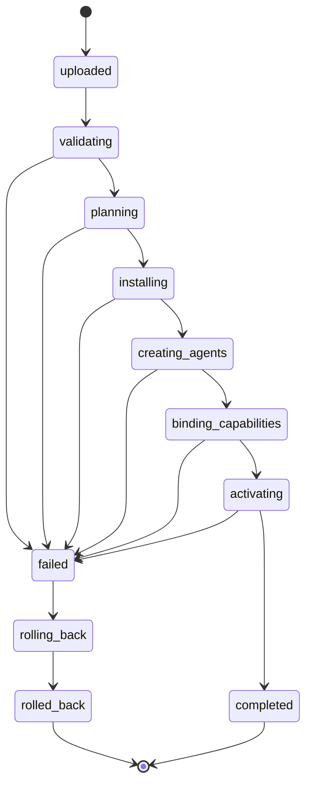
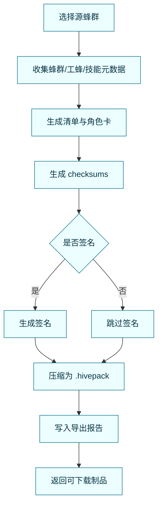
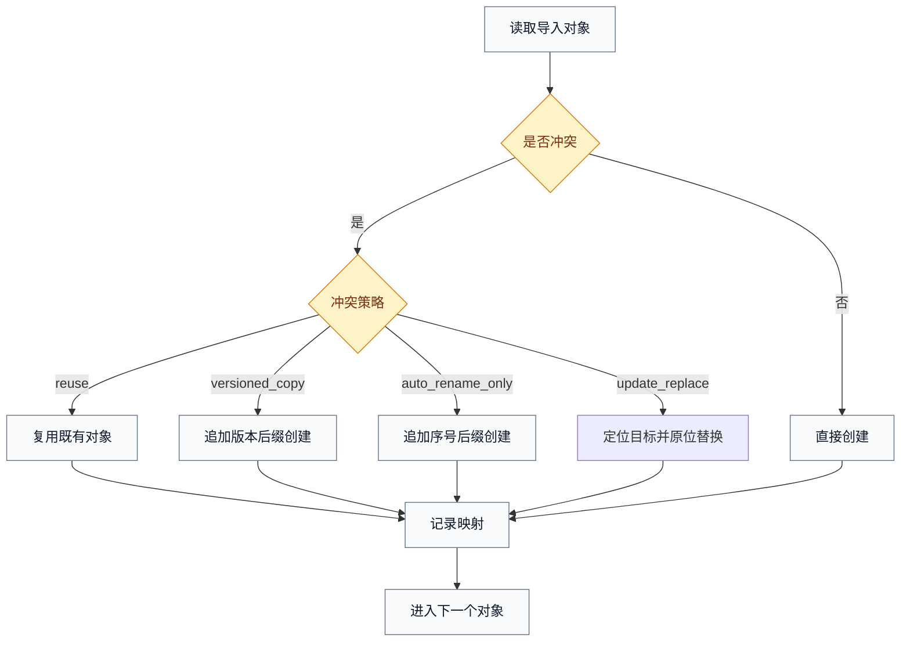
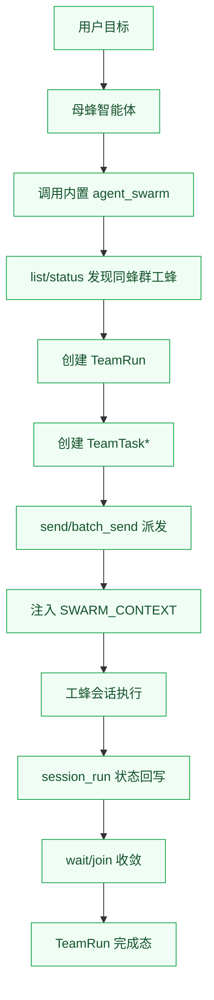

# 蜂巢协议设计（Hive Packaging Protocol, HPP）

> 本文是一套**平台无关**的多智能体资产协议设计，适用于任意智能体系统（云端、本地、私有化、SaaS）。  
> 目标是把“蜂群协作能力”从一次性交付，升级为可打包、可验证、可迁移、可分发、可回滚的标准资产。

---

## 0. 汇报摘要（可直接用于会议开场）

- 协议对象：蜂群包（HivePack）/工蜂包（WorkerPack）/技能包（SkillPack）
- 协议价值：标准化资产沉淀、跨系统复用、导入即用、治理可审计
- 核心机制：清单化 + 校验签名 + 任务化导入导出 + 冲突策略 + 回滚机制
- 关键原则：逻辑与运行时解耦、默认可用优先、最小信任、版本可演进

---

## 1. 问题定义与设计目标

### 1.1 典型痛点

1. 多智能体能力沉淀在某个系统内部，迁移成本高。  
2. 不同系统工具与知识连接方式差异大，复用困难。  
3. 导入导出缺乏标准协议，版本与冲突处理不可控。  
4. 缺少完整审计与回滚链路，生产环境风险高。

### 1.2 设计目标

- **G1 可移植**：同一资产包可导入到不同智能体平台。
- **G2 可复用**：蜂群组织结构、角色分工、技能集合可重复分发。
- **G3 可治理**：具备校验、签名、审计、回滚、权限边界。
- **G4 可演进**：协议版本化，支持扩展字段与跨版本迁移。
- **G5 可实施**：提供清晰目录规范、状态机、冲突算法和接口模型。

### 1.3 非目标（边界）

- 不强制绑定任何模型厂商、数据库、UI 框架。  
- 不约束业务提示词内容风格。  
- 不内置特定工具实现，仅定义挂载与映射规则。

---

## 2. 核心概念与抽象模型

### 2.1 概念定义

- **蜂群包（HivePack）**：业务协作资产单元。  
  组成：`组员构成说明 + 蜂群角色定位说明 + N个工蜂包`
- **工蜂包（WorkerPack）**：执行角色资产单元。  
  组成：`工蜂角色定位说明 + N个技能包`
- **技能包（SkillPack）**：能力实现单元。  
  组成：`技能说明 + 可执行脚本/资源 + 元数据`

### 2.2 形式化表达

- `HivePack = HiveMeta + HiveRoleCard + WorkerPack[]`
- `WorkerPack = WorkerMeta + WorkerRoleCard + SkillPack[]`
- `SkillPack = SkillMeta + SkillEntry + SkillAssets[]`

### 2.3 角色分层

- **资产生产方**：设计蜂群与工蜂能力并打包。  
- **资产消费方**：导入包并物化为本地智能体能力。  
- **协议运行时**：执行校验、冲突处理、回滚、审计。  
- **治理平面**：签名信任链、版本管理、合规策略。

---

## 3. 协议分层架构


---

## 4. 包格式与目录规范（v1）

### 4.1 制品格式

- 文件扩展名：`.hivepack`（本质为 zip）
- MIME（建议）：`application/vnd.hivepack+zip`
- 推荐上限：`<= 200MB`（按平台策略可调）

### 4.2 标准目录

```text
example-hive-1.0.0.hivepack
├─ hive.yaml                      # 蜂群清单（必需）
├─ HIVE_ROLE.md                   # 蜂群角色说明（必需）
├─ checksums.sha256               # 完整性校验（必需）
├─ signatures/
│  └─ package.sig                 # 可选：签名
├─ workers/
│  ├─ planner/
│  │  ├─ worker.yaml              # 工蜂清单（必需）
│  │  ├─ WORKER_ROLE.md           # 工蜂角色说明（必需）
│  │  └─ skills/
│  │     ├─ requirement_analyzer/
│  │     │  ├─ skill.yaml         # 技能元数据（建议）
│  │     │  ├─ SKILL.md           # 技能说明（必需）
│  │     │  ├─ scripts/
│  │     │  └─ assets/
│  │     └─ ...
│  └─ executor/
├─ fixtures/                      # 可选：样例输入/输出
└─ README.md                      # 可选：导入说明
```

### 4.3 路径与编码安全约束

- 所有清单与说明文件必须为 UTF-8。  
- 包内路径必须是相对路径，禁止绝对路径、`..`、软链逃逸。  
- 技能执行入口只能落在本技能目录内部。

---

## 5. 清单设计（Manifest）

> 规范语义采用 RFC 风格：`MUST / SHOULD / MAY`

### 5.1 `hive.yaml`（蜂群清单）

```yaml
protocol: hpp/1.0
kind: hive_pack
pack:
  id: hivepack_customer_success
  name: 客户成功蜂群
  version: 1.0.0
  description: 覆盖接入、续约、升级协同流程
  author: org-cs-team
  created_at: 2026-03-10T09:00:00+08:00
  tags: [cs, onboarding, renewal]
compatibility:
  platform_version: ">=1.0.0"
  runtime_modes: [server, desktop, cli]
mount_policy:
  core_tools: system_all
  extension_tools: system_all
  knowledge_connectors: system_all
  imported_skills: package_only
import_policy:
  default_conflict: auto_rename_only
  create_hive_if_missing: true
  # 可选：update_replace（用于原位更新/替换目标蜂群）
workers:
  - worker_id: planner
    path: workers/planner
    role: coordinator
  - worker_id: specialist
    path: workers/specialist
    role: specialist
integrity:
  checksum_file: checksums.sha256
  signature_file: signatures/package.sig
```

### 5.2 `worker.yaml`（工蜂清单）

```yaml
protocol: hpp/1.0
kind: worker_pack
worker:
  id: planner
  display_name: 方案规划工蜂
  description: 负责策略拆解与任务编排
  duty: planning_specialist
agent_profile:
  system_prompt_file: WORKER_ROLE.md
  model_hint: inherit
  approval_mode: suggest
  icon: icon-planner
skills:
  - skill_id: requirement_analyzer
    path: skills/requirement_analyzer
    required: true
  - skill_id: risk_assessor
    path: skills/risk_assessor
    required: false
dependencies:
  optional_services: [crm_api, billing_api]
  optional_knowledge_sets: [policy_kb]
```

### 5.3 `skill.yaml`（技能元数据，建议）

```yaml
protocol: hpp/1.0
kind: skill_pack
skill:
  id: requirement_analyzer
  name: 需求分析技能
  version: 1.0.0
  entry: SKILL.md
  language: zh-CN
  tags: [analysis, planning]
```

---

## 6. 导入协议（Import Protocol）

### 6.1 导入状态机



### 6.2 导入流程（规范）

1. **上传与解包（uploaded）**  
   - MUST 验证扩展名与基础大小策略。  
2. **结构与安全校验（validating）**  
   - MUST 校验目录结构、路径安全、必需文件存在。  
   - SHOULD 校验 `checksums.sha256`。  
   - MAY 校验签名。  
3. **预检与规划（planning）**  
   - 生成导入计划：待创建蜂群、待创建工蜂、待安装技能、冲突项。  
4. **技能安装（installing）**  
   - 将技能包注册为目标系统可识别技能资产。  
5. **智能体物化（creating_agents）**  
   - 按 `workers[]` 创建工蜂实体并归属目标蜂群。  
6. **能力绑定（binding_capabilities）**  
   - 按 `mount_policy` 绑定系统能力与导入技能。  
7. **激活与验收（activating/completed）**  
   - 执行最小连通性验证，写入导入报告。  
8. **失败回滚（failed/rolling_back/rolled_back）**  
   - 删除本次新建实体、回滚本次新增技能、保留审计记录。

### 6.3 蜂群协作编排模型（协议层）

> 核心思想：蜂群协作不是“群聊广播”，而是“工具驱动的任务编排”。  
> 协议层推荐把协作拆分为：**发现（discover）→派发（dispatch）→收敛（wait/merge）→闭环（finish）**。

#### 6.3.1 协作四阶段

1. **发现（discover）**：根据蜂群作用域筛选可协作工蜂。  
2. **派发（dispatch）**：以任务为单位把指令发到目标工蜂会话。  
3. **收敛（wait/merge）**：等待子任务完成并做结果聚合。  
4. **闭环（finish）**：写入任务总结、状态、审计信息并结束协作。

#### 6.3.2 推荐协作流程图


#### 6.3.3 协议建议

- SHOULD 在派发消息中附带结构化协作上下文（例如 `group/sender/mission/active_members`）。  
- SHOULD 把“协作运行实例（TeamRun）”与“子任务实例（TeamTask）”分开建模。  
- SHOULD 支持单任务派发与批量并发派发两种模式。  
- SHOULD 支持显式 `wait/join`，避免母蜂用轮询文本推理来判断是否完成。  
- SHOULD 把“任务终态”与“成员是否空闲”一起作为闭环判定条件。  

---

## 7. 导出协议（Export Protocol）

### 7.1 导出模式

- `full`：导出完整技能内容（离线迁移优先）
- `reference_only`：仅导出技能引用与依赖声明（同源环境复刻优先）

### 7.2 导出流程图



---

## 8. 冲突处理模型（Conflict Policy）

### 8.1 策略类型

- `reuse`：复用同名/同标识资产（风险高，不推荐默认）
- `versioned_copy`：复制并按版本后缀新建
- `auto_rename_only`：自动改名新建且不复用（推荐默认）
- `update_replace`：定位目标蜂群后做原位替换（保留蜂群 ID，替换成员与包内技能内容）

### 8.2 推荐默认

- 默认使用 `auto_rename_only`，避免隐式覆盖与意外复用。  
- 冲突对象包括：蜂群 ID/名称、工蜂显示名、技能 ID/目录名。
- 对于“导入新版本并直接覆盖原蜂群”的场景，可使用 `update_replace`。

### 8.3 冲突决策流程图



### 8.4 命名算法建议

- 若目标名存在，则依次尝试：`name-2`、`name-3`、`name-4`...  
- MUST 保证同一次导入中的保留集合一致（避免并发重名）。  
- SHOULD 在导入报告输出 `from -> to` 映射明细。

---

## 9. 能力挂载抽象（Capability Mounting）

> 为保证跨平台可移植性，协议只定义“能力类别”，不绑定具体工具名。

### 9.1 标准能力类别

- `core_tools`：平台内置基础能力（文件、命令、网络等）
- `extension_tools`：外部扩展能力（插件/MCP/连接器）
- `knowledge_connectors`：知识源能力（知识库、检索、语义索引）
- `imported_skills`：本包导入技能

### 9.2 挂载流水线


---

## 10. 导入/导出任务接口（平台无关抽象）

### 10.1 导入

- `create_import_job(file, options) -> job_id`
- `get_import_job(job_id) -> job_snapshot`
- `job_snapshot` MUST 包含：  
  `job_id/status/phase/progress/summary/detail?/report?`

### 10.2 导出

- `create_export_job(hive_id, mode) -> job_id`
- `get_export_job(job_id) -> job_snapshot`
- `download_export_artifact(job_id) -> binary`

### 10.3 事件（建议）

- `hivepack.import.progress|completed|failed`
- `hivepack.export.progress|completed|failed`

---

## 11. 安全与治理

### 11.1 完整性与信任

- MUST 支持摘要校验（`checksums.sha256`）  
- SHOULD 支持签名与发布者信任链  
- MAY 支持离线验签与证书轮换

### 11.2 沙盒与权限

- 导入资产不应绕过平台既有审批与权限机制。  
- 技能执行应受平台沙盒和策略控制。

### 11.3 审计

- MUST 记录：导入人、时间、包摘要、冲突映射、回滚结果、失败原因。  
- SHOULD 记录：签名校验状态、能力挂载差异、验收结果。

---

## 12. 兼容性与版本演进

### 12.1 版本规范

- 协议版本：`protocol: hpp/<major>.<minor>`
- 包版本：`pack.version`（语义化版本）

### 12.2 兼容规则

- 同 `major`：向后兼容，未知字段 SHOULD 忽略  
- 跨 `major`：需迁移器转换后导入  
- 建议提供 `hpp migrate` 离线工具

---

## 13. 实施路线图（分阶段）

### Phase 1（最小可用）

- 标准打包/解包
- 清单解析与基础校验
- 工蜂与技能自动物化
- 任务化导入导出与回滚

### Phase 2（增强治理）

- 签名验签与信任链
- 预检 dry-run 与差异报告
- 冲突策略可配置化

### Phase 3（生态化）

- 资产仓库与版本市场
- 依赖解析与升级建议
- 标准测试样例与质量评分

---

## 14. 报告页可视化建议（会议展示）

建议会议中按以下 5 张图汇报：

1. **协议分层架构图**（第 3 节）  
2. **导入状态机图**（第 6 节）  
3. **协作编排流程图**（第 6.3 节）  
4. **冲突决策图**（第 8 节）  
5. **能力挂载流水线图**（第 9 节）

配套一句话口径：

- “我们定义的不是某个平台功能，而是一套可迁移的资产协议。”
- “任何智能体系统都可以按同一协议实现导入、导出、治理与审计。”

---

## 15. 结论

蜂巢协议的本质是：  
**把多智能体协作能力标准化为可分发资产，并将导入风险收敛在可验证、可回滚、可审计的协议流程里。**

它不依赖具体产品名称与实现框架，因此能够跨系统复用，长期支撑组织级能力沉淀与规模化分发。

---

## 16. 参考实现：Wunder 内置蜂群工具（非规范性附录）

> 本节用于说明“协议如何落地为可运行协作机制”。  
> 该实现细节**不属于协议强制要求**，但可作为工程参考。

### 16.1 协作入口

Wunder 将蜂群协作收敛为一个内置工具：`agent_swarm`，通过动作路由组织协作：

- `list` / `status`：发现与查看蜂群成员状态  
- `send`：单目标派发  
- `batch_send`：多目标并发派发（fanout）  
- `wait`：等待子运行收敛  
- `history` / `spawn`：读取历史与会话生成

### 16.2 组织方式（与协议抽象的映射）

1. **蜂群作用域约束**  
   - 基于当前智能体所属蜂群解析协作范围，禁止跨蜂群派发。  
2. **母蜂认领（Mother）**  
   - 在蜂群维度维护母蜂元信息；首次派发会自动认领。  
3. **运行与任务双层建模**  
   - 每次协作创建 `TeamRun`；每个目标工蜂创建 `TeamTask`。  
4. **主线程优先派发**  
   - 优先复用目标工蜂主会话，不存在时按策略创建。  
5. **结构化上下文注入**  
   - 派发前拼装 `[SWARM_CONTEXT]...[/SWARM_CONTEXT]`，携带 group/sender/mission/active_members。  
6. **并发与收敛**  
   - `batch_send` 按并发上限执行，`wait` 基于子运行状态统一收敛。  
7. **闭环判定**  
   - 任务快照综合“任务终态 + 成员空闲”计算 `running/awaiting_idle/completed/failed/cancelled`。

### 16.3 Wunder 协作机制图


