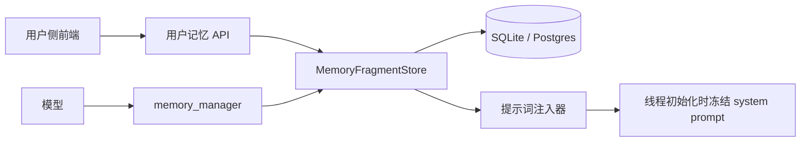
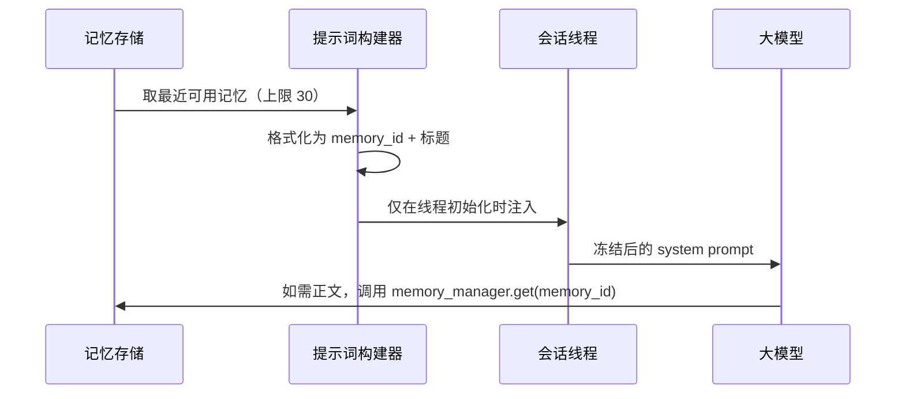
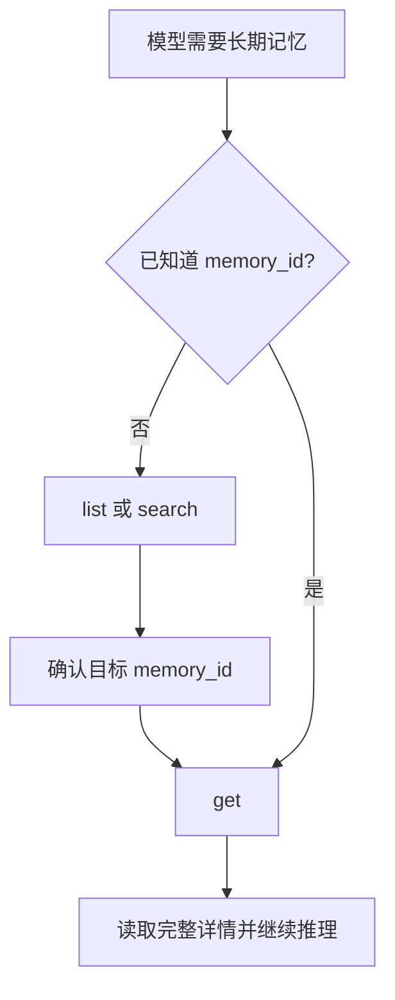
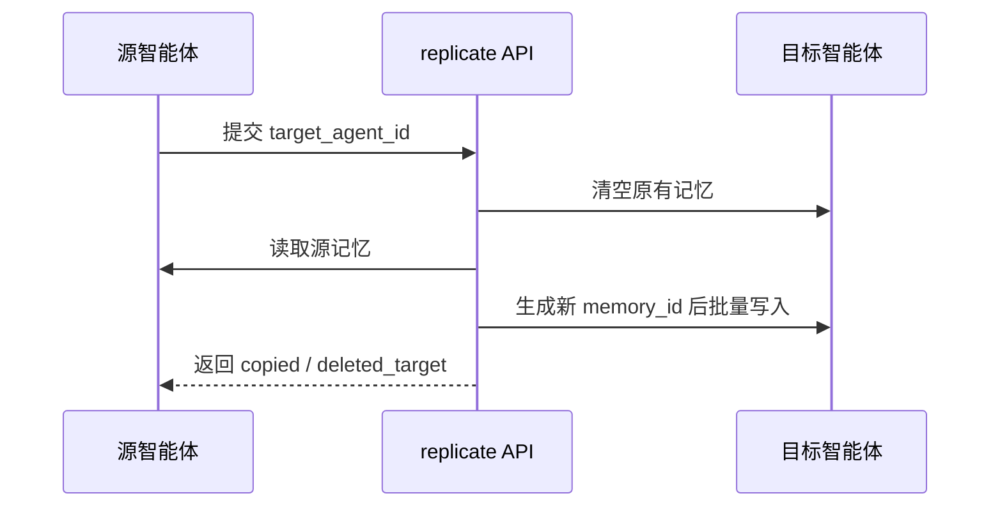

# 记忆系统设计

## 1. 目标

长期记忆需要同时满足两件事：

1. 对模型友好：系统提示词只注入轻量索引，不灌入大段正文。
2. 对工程友好：前端、后端、工具、提示词统一使用同一套结构和动作。

当前设计以“索引标题 + 完整详情”为核心抽象，彻底收敛旧方案里的摘要、实体、标签数组、置顶、作废等噪声字段。

## 2. 设计原则

- 一条记忆只保留一个主标题，作为索引入口。
- 详情正文只在真正需要时按 `memory_id` 拉取。
- 系统提示词中注入的是索引，不是完整内容。
- 模型侧 `memory_id` 保持 8 个字符以内，便于搜索、比对和二次调用。
- 检索以 `list` 和 `search` 为主，`get` 只在确认目标后使用。
- 用户侧编辑结构与模型侧写入结构保持一致。
- 外显协议统一使用 `tag`，旧 `category` 仅保留兼容解析。

## 3. 核心结构

### 3.1 记忆碎片结构

| 字段 | 含义 | 是否必填 | 说明 |
| --- | --- | --- | --- |
| `memory_id` | 记忆索引 ID | 系统生成/可传入 | 对模型展示时压缩到 8 字符以内 |
| `title_l0` | 索引标题 | 建议填写 | 例如“用户姓名”“回复语言” |
| `content_l2` | 内容详情 | 必填 | 完整事实、约束、上下文 |
| `tag` | 记忆标签 | 建议填写 | 例如 `profile`、`response_preference` |
| `supersedes_memory_id` | 关联记忆 | 选填 | 表示当前记忆替代/承接哪条旧记忆 |
| `valid_from` | 记忆时间 | 选填 | 事实生效时间或事件时间 |
| `source_type` | 来源类型 | 系统维护 | 例如 `manual`、`auto_extract` |
| `updated_at` | 最后更新时间 | 系统维护 | 前端排序与展示使用 |

### 3.2 不再作为对外主结构的字段

以下字段可能因兼容历史数据仍存在于存储层，但不再作为用户侧/模型侧主协议的一部分：

- `summary_l1`
- `tags`
- `entities`
- `pinned`
- `invalidated_at`

## 4. 系统总览



## 5. 提示词注入策略

### 5.1 注入内容

线程初始化时，只注入最近可用的长期记忆索引：

```text
[长期记忆]
- 当前可用长期记忆总条数：3。本次注入：3 条（上限 30 条）。
- 下方注入的是记忆索引（memory_id + 标题），不是完整内容。需要完整细节时，请使用 memory_manager get 并指定 memory_id。
- [2026-04-12 08:37] 0695f345 | 用户姓名
- [2026-04-12 08:38] preftone | 回复风格
- [2026-04-12 08:40] replyzh | 回复语言
```

### 5.2 注入流程



### 5.3 关键约束

- 线程第一次确定 system prompt 后保持冻结。
- 长期记忆只允许在线程初始化时注入一次。
- 后续轮次不得再次改写线程 system prompt。

## 6. 记忆管理工具

### 6.1 动作集合

| 动作 | 用途 | 返回特点 |
| --- | --- | --- |
| `list` | 浏览最近记忆索引 | 默认 30 条，只返回索引信息 |
| `search` | 按标题/详情搜索 | 默认 10 条，返回标题与片段摘要 |
| `get` | 读取完整详情 | 返回单条完整内容 |
| `add` | 新增记忆 | 使用当前精简结构 |
| `update` | 更新记忆 | 按 `memory_id` 修改 |
| `remove` | 删除记忆 | 返回删除结果 |
| `clear` | 清空当前作用域记忆 | 返回删除数量 |

### 6.2 推荐调用路径



### 6.3 写入结构

```json
{
  "action": "add",
  "title": "用户姓名",
  "content": "用户的名字是周华健。这是用户在对话开始时自我介绍提供的信息。",
  "tag": "profile",
  "related_memory_id": null,
  "memory_time": "2026-04-12T08:37:00+08:00"
}
```

### 6.4 返回结构

`list` 示例：

```json
{
  "action": "list",
  "data": {
    "count": 2,
    "items": [
      {
        "memory_id": "0695f345",
        "title": "用户姓名",
        "tag": "profile",
        "updated_at": 1775954220
      },
      {
        "memory_id": "replyzh",
        "title": "回复语言",
        "tag": "response_preference",
        "updated_at": 1775954280
      }
    ]
  }
}
```

`search` 示例：

```json
{
  "action": "search",
  "data": {
    "count": 1,
    "items": [
      {
        "memory_id": "replyzh",
        "title": "回复语言",
        "tag": "response_preference",
        "snippet": "默认使用中文回复，除非用户明确要求其他语言...",
        "matched_in": ["content"],
        "updated_at": 1775954280
      }
    ]
  }
}
```

`get` 示例：

```json
{
  "action": "get",
  "data": {
    "item": {
      "memory_id": "replyzh",
      "title": "回复语言",
      "content": "默认使用中文回复，除非用户明确要求其他语言。",
      "tag": "response_preference",
      "related_memory_id": null,
      "memory_time": 1775954280,
      "updated_at": 1775954280
    }
  }
}
```

## 7. 用户侧前端设计

### 7.1 记忆卡片

卡片只展示当前版本需要的核心信息：

- 记忆标签
- 索引标题
- 内容预览
- 来源类型
- 关联关系
- 更新时间

### 7.2 编辑页

编辑页只保留：

- 索引标题
- 内容详情
- 记忆标签
- 关联记忆 ID
- 记忆时间

### 7.3 已移除项

以下旧元素已经从当前设计中移除：

- 摘要
- 实体
- 标签数组
- 置顶
- 作废
- 已失效
- 卡片区直接删除按钮
- 召回说明入口
- 最近提炼任务入口

### 7.4 新增记忆复刻

用户可以在记忆面板点击“记忆复刻”，将当前智能体的记忆复制并覆盖到另一个已存在智能体。

复刻规则：

- 只能选择其他已存在智能体
- 目标智能体原有记忆先清空
- 然后复制源智能体全部记忆
- 源智能体记忆不会被清空
- 目标侧会重新生成 `memory_id`，避免把“复制”误写成“移动”



## 8. 用户 API 设计

| 接口 | 说明 |
| --- | --- |
| `GET /wunder/agents/{agent_id}/memories` | 记忆列表 |
| `POST /wunder/agents/{agent_id}/memories` | 新增记忆 |
| `GET /wunder/agents/{agent_id}/memories/{memory_id}` | 记忆详情 |
| `PATCH /wunder/agents/{agent_id}/memories/{memory_id}` | 更新记忆 |
| `DELETE /wunder/agents/{agent_id}/memories/{memory_id}` | 删除记忆 |
| `POST /wunder/agents/{agent_id}/memories/replicate` | 记忆复刻到其他智能体 |
| `GET /wunder/agents/{agent_id}/memory-settings` | 读取记忆设置 |
| `POST /wunder/agents/{agent_id}/memory-settings` | 更新记忆设置 |

## 9. 落地要点

- 模型与前端统一使用 `tag`
- 系统提示词只注入 `memory_id + title`
- 完整内容必须通过 `get` 获取
- 记忆复刻按 agent scope 批量复制，避免前端循环搬运
- 旧字段继续只留在存储兼容层，不再向模型和用户侧扩散
