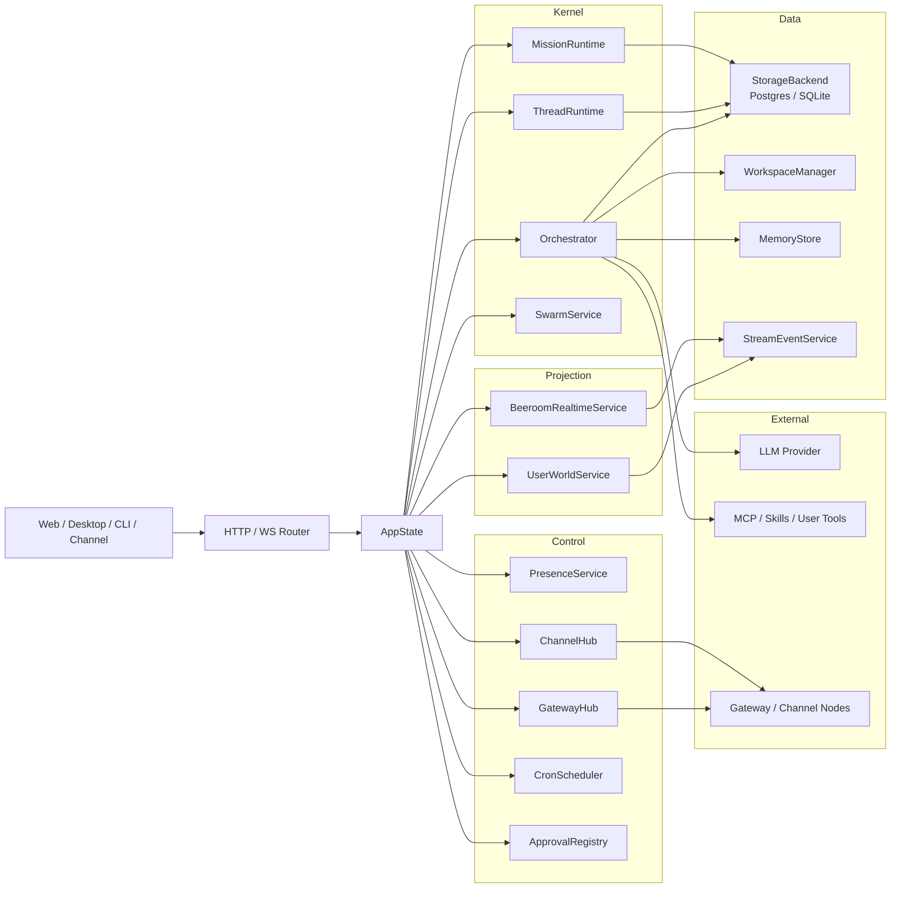
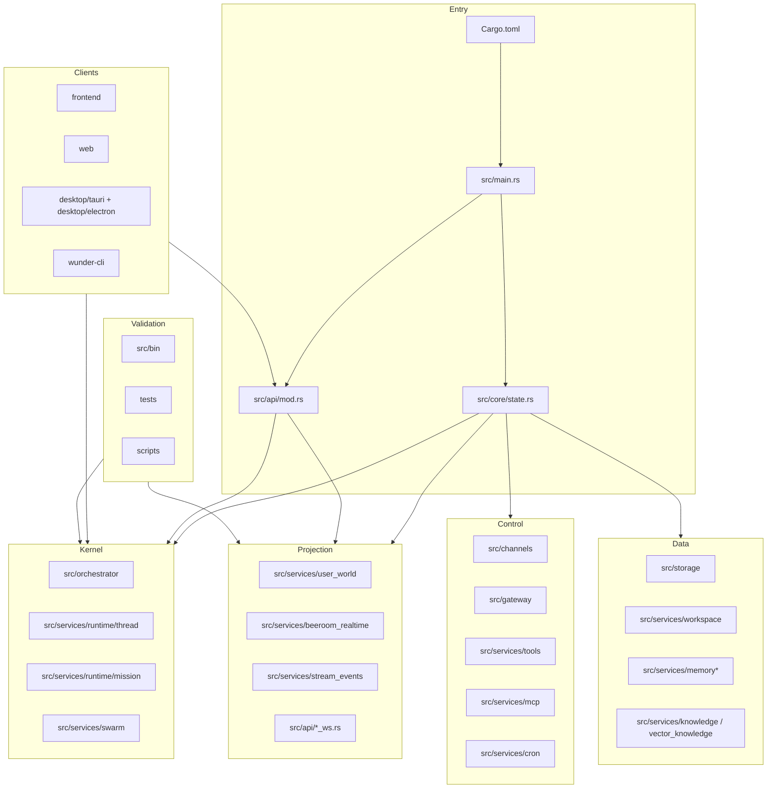
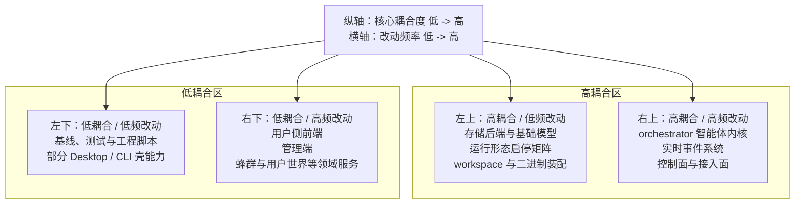

# 系统总体设计

## 1. 设计目标

本册是 wunder 的系统骨架母本，用于回答四个核心问题：

- wunder 到底是一个什么系统，而不是什么。
- 三种运行形态如何共享同一个核心，而不是各自长成一套系统。
- 核心模块如何分层、装配、协作、演进。
- 后续改动应该落在哪里，哪些改动必须优先收口边界。

目标状态是：无论入口来自网页、桌面、CLI、网关还是外部渠道，最终都落到同一套线程运行时、工具治理、存储抽象和实时事件契约上。

## 2. 架构基线

wunder 当前不是"一个带聊天界面的模型调用器"，而是一个以 **orchestrator 为核心** 的智能体运行时系统。

当前架构必须同时满足以下 5 条基线：

1. **智能体优先**
   线程、turn、工具治理、恢复链是主系统；页面、房间、群聊、公开摘要都是事件流的消费视图。
2. **认知态隔离**
   线程首次确定后的 `system prompt` 必须冻结；长期记忆只允许在线程初始化时注入一次。
3. **单写者收敛**
   线程 lease、mission lease 是当前单服务器阶段的权威边界。
4. **实时系统服务运行时**
   WebSocket / SSE、watch、stream events、lag recovery 围绕运行时复制与恢复，而不是反向支配运行时。
5. **执行调度集中**
   orchestrator 负责智能体执行的完整链路（prompt / context / tool / recovery），不分散到多个独立状态机。

一句话概括当前主架构：

`Request → Orchestrator (turn) → ThreadRuntime → Stream Events → Frontend`

### 2.1 当前发布边界

当前系统设计除了讲长期架构，也要明确当前可交付边界：

- 实时系统的发布口径固定为"一人一会话、各自分散聊天"。
- 在这一边界下，`chat session`、`user world`、渠道消息实时投影都已进入可发布区间。
- shared hotspot 仍是容量扩展项，不阻塞当前发布。

## 3. 系统特色

wunder 的总体特色需要在架构层被明确表达，而不是散落在产品说明里：

| 特色 | 设计含义 | 核心落点 |
| --- | --- | --- |
| 智能体内核先行 | 线程是认知单元，页面只是事件消费层 | `src/orchestrator` |
| 实时事件优先 | 面向前端与外部系统的状态同步通过 stream events 完成 | `src/services/stream_events.rs` `src/services/beeroom_realtime.rs` `src/services/presence` |
| 三形态同核 | `server / desktop / cli` 共用同一 `AppState` 核心装配 | `src/core/state.rs` `desktop/tauri` `wunder-cli` |
| 工具化世界观 | 模型通过工具触达文件、浏览器、MCP、技能、子智能体和外部渠道 | `src/services/tools` `src/services/skills.rs` `src/services/mcp.rs` |
| 蜂群资产化 | Hive 不只是运行时协作域，也是可封装、可导入、可导出的资产单元 | `src/services/swarm` `src/services/hive_pack` |
| 双数据库策略 | 服务端用 PostgreSQL，桌面端用 SQLite，但共享统一状态模型 | `src/storage` |

## 4. 仓库与运行形态

### 4.1 工作区结构

| 位置 | 作用 | 当前状态 |
| --- | --- | --- |
| `src/` | Wunder 主后端工程（orchestrator + services + api + storage） | 对外主入口 |
| `frontend/` | 用户侧 Vue3 前端 | 实时消费下沉到 stores 和 realtime |
| `web/` | 管理端原生 HTML/JS | 维持治理、调试与运营面 |
| `desktop/tauri/` | Desktop 本地 bridge 与桌面壳 | 主交付形态 |
| `desktop/electron/` | Electron 打包壳 | 分发包装 |
| `wunder-cli/` | CLI/TUI | 本地嵌入式运行形态 |
| `config/` | 配置、i18n、技能、提示词模板、MCP 配置 | 运行时只读加载 |

### 4.2 三种运行形态

`src/core/state.rs` 通过 `AppRuntimeProfile` 明确区分三种运行形态：

| Profile | 入口 | 典型场景 | 默认激活能力 |
| --- | --- | --- | --- |
| `ServerDistributed` | `src/main.rs` | 组织级服务部署 | `thread_runtime`、`mission_runtime`、`cron`、`gateway maintenance` |
| `DesktopEmbedded` | `desktop/tauri/main.rs`、`desktop/tauri/bridge_main.rs` | 本地桌面主应用 | `thread_runtime`、`cron`、本地 bridge、LAN overlay |
| `CliEmbedded` | `wunder-cli/main.rs` | 本地命令行/TUI | 嵌入式 `AppState`，默认不启动后台 `thread_runtime/mission_runtime` |

## 5. 总体分层与装配

### 5.1 三层主骨架

当前后端最重要的装配锚点是 `src/core/state.rs`。`AppState` 已明确收口为 `kernel / projection / control` 三层。

| Plane | 代表字段 | 主要职责 | 关键模块 |
| --- | --- | --- | --- |
| `kernel` | `AppKernelServices` | 智能体执行、线程推进、任务编排 | `orchestrator`、`runtime/thread`、`runtime/mission`、`swarm_service` |
| `projection` | `AppProjectionServices` | 用户世界、beeroom 的实时视图 | `services/user_world`、`services/beeroom_realtime` |
| `control` | `AppControlServices` | presence、gateway、channels、cron、审批、命令会话 | `services/presence`、`gateway`、`channels`、`cron`、`approval_registry` |

### 5.2 当前主骨架图

### 5.3 为什么必须分成三层

- `kernel` 必须可以在没有前端页面、没有房间订阅的情况下继续运行。
- `projection` 必须可以从 stream events 重新构建，不应成为线程认知态来源。
- `control` 负责"谁有权推进""谁在观看""谁能接入"，不直接承担模型推理语义。
- `frontend` 负责消费、恢复和补偿，不应重新定义后端真相。

## 6. 模块维护地图

### 6.1 一张图理解模块关系

### 6.2 四象限维护图

这个图按"改动频率"和"核心耦合度"分，方便判断某类改动应当谨慎收口还是可以快速迭代。

### 6.3 速查表

| 模块 | 主入口 | 什么时候改这里 |
| --- | --- | --- |
| 工作区与二进制装配 | `Cargo.toml`、`src/main.rs`、`src/core/state.rs` | 新能力要在哪种运行形态启用 |
| 智能体内核 | `src/orchestrator/` | prompt / tool / turn / recovery / 线程执行 |
| 线程调度 | `src/services/runtime/thread/` | 线程生命周期、lease、排队 |
| 实时事件系统 | `src/services/stream_events.rs`、`src/services/beeroom_realtime.rs`、`src/services/presence/` | watch、replay、事件持久化 |
| 控制面与接入面 | `src/channels/`、`src/gateway/`、`src/services/tools/`、`src/services/mcp.rs` | 外部接入、命令与工具治理 |
| 存储与现实 | `src/storage/`、`src/services/workspace.rs`、`src/services/memory.rs` | 表结构、文件现实、记忆 |
| 领域服务 | `src/services/swarm/`、`src/services/user_world.rs` | 多智能体协作、用户通信 |
| 用户侧前端 | `frontend/src/views/messenger/`、`frontend/src/stores/`、`frontend/src/realtime/` | 页面、实时消费、状态 |
| 管理端 | `web/app.js`、`web/modules/` | 配置、治理、监控面板 |
| Desktop / CLI | `desktop/tauri/`、`wunder-cli/` | 本地桥接、嵌入式运行 |
| 基线与脚本 | `src/bin/`、`scripts/`、`tests/` | 回归、压测、验收工作流 |

## 7. 主链路与对象边界

系统总体主链路应长期保持一致：

1. 用户、脚本、渠道或节点从接入层发起请求。
2. 接入层将请求映射为线程请求、mission 请求或系统控制请求。
3. ThreadRuntime 管理 lease、排队和 dispatch。
4. Orchestrator 完成 prompt 冻结、context 装配、工具面构建和模型执行。
5. 工具调用写入工作区、访问知识、操作浏览器、触发子智能体或外部系统。
6. 运行时把结果落为 durable state，并生成 stream events。
7. 前端、桌面端、CLI 或渠道侧消费事件流并呈现给用户。

核心对象层级应长期稳定：

| 对象 | 说明 | 设计重点 |
| --- | --- | --- |
| 组织 / 用户 | 资源归属、隔离、配额与治理主体 | 多租户、多用户、权限与审计 |
| Hive | 围绕业务目标组织的一组协作单元 | 任务域与协作域的稳定容器 |
| Agent | 可持续执行的角色实体 | 角色设定、工具面、模型与权限 |
| Thread | Agent 内部连续执行上下文 | 冻结 prompt、context、recovery |
| Mission / Team Run | 一次多智能体协作任务实例 | 任务编排、分工、汇总 |
| Stream Events | 对外可观察的事件流 | Snapshot、Delta、Replay |
| Workspace / Memory / Knowledge | 智能体面向真实世界的资料现实层 | 文件、长期记忆、知识检索 |

## 8. 当前演进重点

系统有两条最重要的演进主线：

- 持续稳定 orchestrator 的 turn / prompt / context / tool / recovery 主链。
- 实时系统持续从 beeroom 过载实现收口到明确的 stream events 契约。

后续任何结构性改动，都应先判断它属于：

- 智能体内核问题。
- 事件与协作问题。
- 工具与现实层问题。
- 接入与控制面问题。

不要把不同层的债务混在同一模块里修补。

## 9. 验收标准

系统总体设计的验收关注以下结果：

- 任一入口都能映射到统一线程或 mission 主链，而不是自带独立状态机。
- 前端、桌面、CLI、渠道消费的是统一实时事件协议。
- `server / desktop / cli` 使用统一核心语义，只保留接入面差异。
- 数据层明确区分 durable state、事件缓存、临时目录和运行时内存态。
- 所有重要高风险能力都能找到明确治理落点，而不是散落在 prompt 或页面逻辑里。

## 10. 相关文档

- `docs/设计文档/02-智能体核心设计.md`
- `docs/设计文档/03-实时投影系统设计.md`
- `docs/设计文档/04-协作蜂群与任务系统设计.md`
- `docs/设计文档/08-数据存储与状态模型设计.md`
- `docs/API文档.md`
