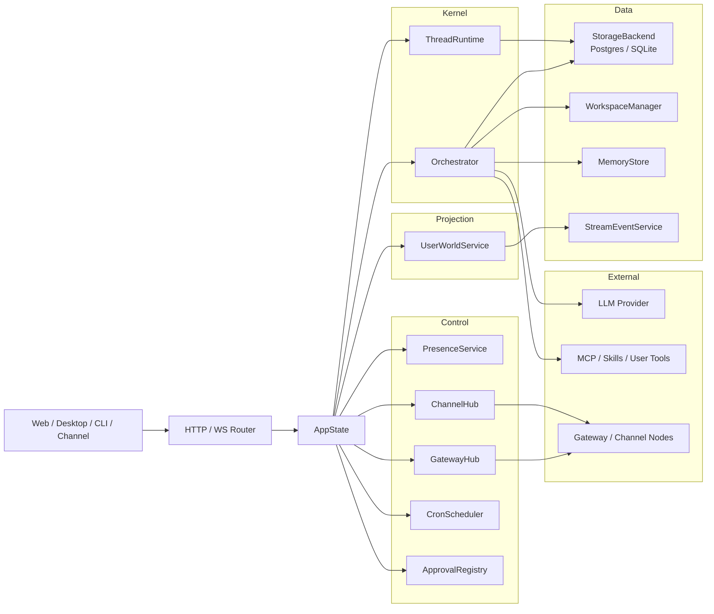
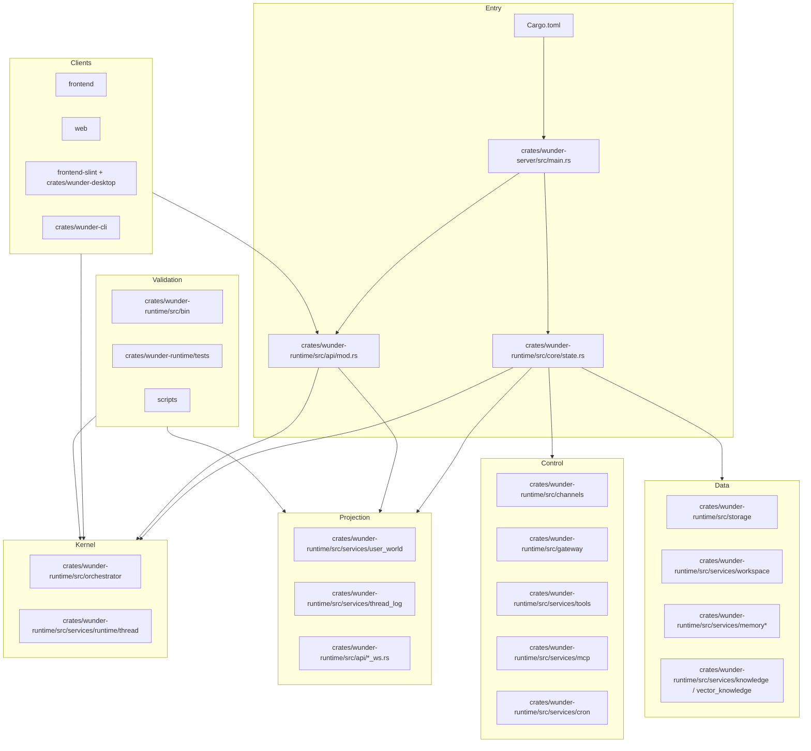
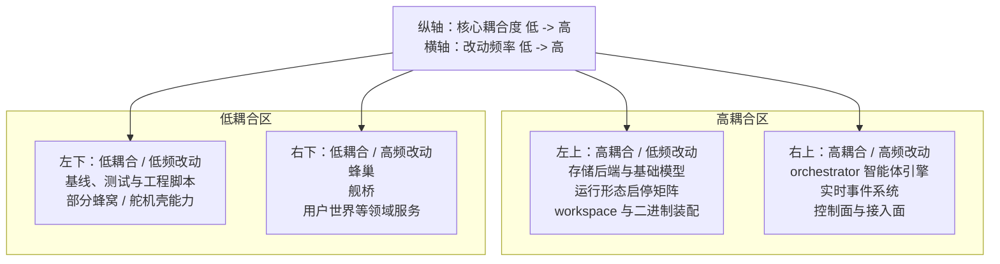

# 系统总体设计

## 1. 设计目标

本册是 wunder 的系统骨架母本，用于回答四个核心问题：

- wunder 到底是一个什么系统，而不是什么。
- 三种运行形态如何共享同一个引擎，而不是各自长成一套系统。
- 核心模块如何分层、装配、协作、演进。
- 后续改动应该落在哪里，哪些改动必须优先收口边界。

目标状态是：无论入口来自蜂巢、蜂窝、舵机、网关还是外部渠道，最终都落到同一套线程运行时、工具治理、存储抽象和实时事件契约上。

## 2. 架构基线

wunder 当前不是"一个带聊天界面的模型调用器"，而是一个以 **orchestrator 为核心** 的智能体运行时系统。

当前架构必须同时满足以下 5 条基线：

1. **智能体优先**
   线程、turn、工具治理、恢复链是主系统；页面、房间、群聊、公开摘要都是事件流的消费视图。
2. **认知态隔离**
   线程首次确定后的 `system prompt` 必须冻结；长期记忆只允许在线程初始化时注入一次。
3. **单写者收敛**
   线程 lease 是当前单服务器阶段的权威边界。
4. **实时系统服务运行时**
   WebSocket / SSE、watch、stream events、lag recovery 围绕运行时复制与恢复，而不是反向支配运行时。
5. **执行调度集中**
   orchestrator 负责智能体执行的完整链路（prompt / context / tool / recovery），不分散到多个独立状态机。

一句话概括当前主架构：

`Request → Orchestrator (turn) → ThreadRuntime → Stream Events → Frontend`

### 2.1 当前发布边界

当前系统设计除了讲长期架构，也要明确当前可交付边界：

- 实时系统的发布口径固定为"一人一会话、各自分散聊天"。
- 在这一边界下，`chat session`、`user world`、渠道消息实时投影都已进入可发布区间。
- shared hotspot 仍是容量扩展项，不阻塞当前发布。

## 3. 系统特色

wunder 的总体特色需要在架构层被明确表达，而不是散落在产品说明里：

| 特色 | 设计含义 | 核心落点 |
| --- | --- | --- |
| 智能体引擎先行 | 线程是认知单元，页面只是事件消费层 | `crates/wunder-runtime/src/orchestrator` |
| 实时事件优先 | 面向前端与外部系统的状态同步通过 durable change 游标与帧完成 | `crates/wunder-runtime/src/services/thread_log.rs` `crates/wunder-runtime/src/services/presence` |
| 三形态同引擎 | `server / desktop / cli` 共用同一 `AppState` 引擎装配 | `crates/wunder-runtime/src/core/state.rs` `crates/wunder-desktop` `crates/wunder-cli` |
| 工具化世界观 | 模型通过工具触达文件、浏览器、MCP、技能、子智能体和外部渠道 | `crates/wunder-runtime/src/services/tools` `crates/wunder-runtime/src/services/skills.rs` `crates/wunder-runtime/src/services/mcp.rs` |
| 单智能体 + 子智能体 | 每个用户只有一个智能体实例；复杂任务由它临时派生子智能体完成，工作区为唯一云端目录 | `crates/wunder-runtime/src/services/subagents` `crates/wunder-runtime/src/services/workspace.rs` |
| 双数据库策略 | 舰体用 PostgreSQL，蜂窝用 SQLite，但共享统一状态模型 | `crates/wunder-runtime/src/storage` |

## 4. 仓库与运行形态

### 4.1 工作区结构

| 位置 | 作用 | 当前状态 |
| --- | --- | --- |
| 根 `Cargo.toml` | 纯 workspace manifest，默认成员为 `crates/wunder-server` | 只做工作区编排 |
| `crates/wunder-runtime/` | Wunder 后端运行时（orchestrator + services + api + storage） | 三种形态共享引擎 |
| `crates/wunder-server/` | Server 入口与协议壳 | 对外服务入口 |
| `frontend/` | 用户侧 Vue3 前端 | 实时消费下沉到 stores 和 realtime |
| `web/` | 舰桥原生 HTML/JS | 维持治理、调试与运营面 |
| `crates/wunder-desktop/` | Desktop 本地运行时、bridge 与系统能力 | 供 Slint 前端复用 |
| `frontend-slint/` | Slint 原生桌面前端 | Desktop 主交付形态 |
| `crates/wunder-cli/` | 舵机/TUI | 本地嵌入式运行形态 |
| `config/` | 配置、i18n、技能、提示词模板、MCP 配置 | 运行时只读加载 |

### 4.2 三种运行形态

`crates/wunder-runtime/src/core/state.rs` 通过 `AppRuntimeProfile` 明确区分三种运行形态：

| Profile | 入口 | 典型场景 | 默认激活能力 |
| --- | --- | --- | --- |
| `ServerDistributed` | `crates/wunder-server/src/main.rs` | 组织级服务部署 | `thread_runtime`、`cron`、`gateway maintenance` |
| `DesktopEmbedded` | `crates/wunder-desktop/main.rs`、`crates/wunder-desktop/bridge_main.rs` | 本地桌面主应用 | `thread_runtime`、`cron`、本地 bridge、LAN overlay |
| `CliEmbedded` | `crates/wunder-cli/main.rs` | 本地舵机/TUI | 嵌入式 `AppState`，默认不启动后台 `thread_runtime` |

Desktop GUI 由 Slint 在同一进程内启动 `NativeDesktop`，不经过本机 HTTP/WebSocket，也不拉起 bridge 子进程。该调整不改变线程、存储、权限与实时投影真相来源；独立 bridge 仅保留给已有兼容客户端。详见技术说明书的 Desktop 启动章节。

## 5. 总体分层与装配

### 5.1 三层主骨架

当前后端最重要的装配锚点是 `crates/wunder-runtime/src/core/state.rs`。`AppState` 已明确收口为 `kernel / projection / control` 三层。

| Plane | 代表字段 | 主要职责 | 关键模块 |
| --- | --- | --- | --- |
| `kernel` | `AppKernelServices` | 智能体执行、线程推进、任务编排 | `orchestrator`、`runtime/thread` |
| `projection` | `AppProjectionServices` | 用户世界与前端实时视图 | `services/user_world` |
| `control` | `AppControlServices` | presence、gateway、channels、cron、审批、命令会话 | `services/presence`、`gateway`、`channels`、`cron`、`approval_registry` |

### 5.2 当前主骨架图

```mermaid
flowchart LR
  Client["Web / Desktop / CLI / Channel"] --> Router["HTTP / WS Router"]
  Router --> State["AppState"]

  subgraph Kernel["Kernel"]
    Orch["Orchestrator"]
    ThreadRt["ThreadRuntime"]
  end

  subgraph Projection["Projection"]
    UserWorld["UserWorldService"]
  end

  subgraph Control["Control"]
    Presence["PresenceService"]
    Gateway["GatewayHub"]
    Channels["ChannelHub"]
    Cron["CronScheduler"]
    Approval["ApprovalRegistry"]
  end

  subgraph Data["Data"]
    Storage["StorageBackend<br/>Postgres / SQLite"]
    Workspace["WorkspaceManager"]
    Memory["MemoryStore"]
    Events["StreamEventService"]
  end

  subgraph External["External"]
    Model["LLM Provider"]
    Mcp["MCP / Skills / User Tools"]
    Remote["Gateway / Channel Nodes"]
  end

  State --> Orch
  State --> ThreadRt
  State --> UserWorld
  State --> Presence
  State --> Gateway
  State --> Channels
  State --> Cron
  State --> Approval

  Orch --> Storage
  ThreadRt --> Storage
  UserWorld --> Events

  Orch --> Workspace
  Orch --> Memory
  Orch --> Model
  Orch --> Mcp
  Gateway --> Remote
  Channels --> Remote
```

### 5.3 为什么必须分成三层

- `kernel` 必须可以在没有前端页面、没有房间订阅的情况下继续运行。
- `projection` 必须可以从 stream events 重新构建，不应成为线程认知态来源。
- `control` 负责"谁有权推进""谁在观看""谁能接入"，不直接承担模型推理语义。
- `frontend` 负责消费、恢复和补偿，不应重新定义后端真相。

## 6. 模块维护地图

### 6.1 一张图理解模块关系

```mermaid
flowchart TB
  subgraph Entry["Entry"]
    Cargo["Cargo.toml"]
    Main["crates/wunder-server/src/main.rs"]
    State["crates/wunder-runtime/src/core/state.rs"]
    Api["crates/wunder-runtime/src/api/mod.rs"]
  end

  subgraph Kernel["Kernel"]
    Orch["crates/wunder-runtime/src/orchestrator"]
    ThreadRt["crates/wunder-runtime/src/services/runtime/thread"]
  end

  subgraph Projection["Projection"]
    UserWorld["crates/wunder-runtime/src/services/user_world"]
    Events["crates/wunder-runtime/src/services/thread_log"]
    WsApi["crates/wunder-runtime/src/api/*_ws.rs"]
  end

  subgraph Control["Control"]
    Channels["crates/wunder-runtime/src/channels"]
    Gateway["crates/wunder-runtime/src/gateway"]
    Tools["crates/wunder-runtime/src/services/tools"]
    Mcp["crates/wunder-runtime/src/services/mcp"]
    Cron["crates/wunder-runtime/src/services/cron"]
  end

  subgraph Data["Data"]
    Storage["crates/wunder-runtime/src/storage"]
    Workspace["crates/wunder-runtime/src/services/workspace"]
    Memory["crates/wunder-runtime/src/services/memory*"]
    Knowledge["crates/wunder-runtime/src/services/knowledge / vector_knowledge"]
  end

  subgraph Clients["Clients"]
    Frontend["frontend"]
    Web["web"]
    Desktop["frontend-slint + crates/wunder-desktop"]
    Cli["crates/wunder-cli"]
  end

  subgraph Validation["Validation"]
    Bin["crates/wunder-runtime/src/bin"]
    Tests["crates/wunder-runtime/tests"]
    Scripts["scripts"]
  end

  Cargo --> Main
  Main --> State
  Main --> Api
  State --> Kernel
  State --> Projection
  State --> Control
  State --> Data
  Api --> Kernel
  Api --> Projection
  Clients --> Api
  Clients --> Kernel
  Validation --> Kernel
  Validation --> Projection
```

### 6.2 四象限维护图

这个图按"改动频率"和"核心耦合度"分，方便判断某类改动应当谨慎收口还是可以快速迭代。

```mermaid
flowchart TB
  Axis["纵轴：核心耦合度 低 -> 高<br/>横轴：改动频率 低 -> 高"]

  subgraph RowTop["高耦合区"]
    direction LR
    Q1["左上：高耦合 / 低频改动<br/>存储后端与基础模型<br/>运行形态启停矩阵<br/>workspace 与二进制装配"]
    Q2["右上：高耦合 / 高频改动<br/>orchestrator 智能体引擎<br/>实时事件系统<br/>控制面与接入面"]
  end

  subgraph RowBottom["低耦合区"]
    direction LR
    Q3["左下：低耦合 / 低频改动<br/>基线、测试与工程脚本<br/>部分蜂窝 / 舵机壳能力"]
    Q4["右下：低耦合 / 高频改动<br/>蜂巢<br/>舰桥<br/>用户世界等领域服务"]
  end

  Axis --> Q1
  Axis --> Q2
  Axis --> Q3
  Axis --> Q4
```

### 6.3 速查表

| 模块 | 主入口 | 什么时候改这里 |
| --- | --- | --- |
| 工作区与二进制装配 | `Cargo.toml`、`crates/wunder-server/src/main.rs`、`crates/wunder-runtime/src/core/state.rs` | 新能力要在哪种运行形态启用 |
| 智能体引擎 | `crates/wunder-runtime/src/orchestrator/` | prompt / tool / turn / recovery / 线程执行 |
| 线程调度 | `crates/wunder-runtime/src/services/runtime/thread/` | 线程生命周期、lease、排队 |
| 实时事件系统 | `crates/wunder-runtime/src/services/thread_log.rs`、`crates/wunder-runtime/src/services/presence/` | watch、replay、durable change 持久化 |
| 控制面与接入面 | `crates/wunder-runtime/src/channels/`、`crates/wunder-runtime/src/gateway/`、`crates/wunder-runtime/src/services/tools/`、`crates/wunder-runtime/src/services/mcp.rs` | 外部接入、命令与工具治理 |
| 存储与现实 | `crates/wunder-runtime/src/storage/`、`crates/wunder-runtime/src/services/workspace.rs`、`crates/wunder-runtime/src/services/memory.rs` | 表结构、文件现实、记忆 |
| 领域服务 | `crates/wunder-runtime/src/services/subagents/`、`crates/wunder-runtime/src/services/user_world.rs` | 子智能体调度、用户通信 |
| 蜂巢 | `frontend/src/views/messenger/`、`frontend/src/stores/`、`frontend/src/realtime/` | 页面、实时消费、状态 |
| 舰桥 | `web/app.js`、`web/modules/` | 配置、治理、监控面板 |
| 蜂窝 / 舵机 | `crates/wunder-desktop/`、`crates/wunder-cli/` | 本地桥接、嵌入式运行 |
| 基线与脚本 | `crates/wunder-runtime/src/bin/`、`crates/wunder-runtime/tests/`、`scripts/` | 回归、压测、验收工作流 |

## 7. 主链路与对象边界

系统总体主链路应长期保持一致：

1. 用户、脚本、渠道或节点从接入层发起请求。
2. 接入层将请求映射为线程请求或系统控制请求。
3. ThreadRuntime 管理 lease、排队和 dispatch。
4. Orchestrator 完成 prompt 冻结、context 装配、工具面构建和模型执行。
5. 工具调用写入工作区、访问知识、操作浏览器、触发子智能体或外部系统。
6. 运行时把结果落为 durable state，并生成 stream events。
7. 蜂巢、蜂窝、舵机或渠道侧消费事件流并呈现给用户。

核心对象层级应长期稳定：

| 对象 | 说明 | 设计重点 |
| --- | --- | --- |
| 组织 / 用户 | 资源归属、隔离、额度账户与治理主体 | 多租户、多用户、权限与审计 |
| Agent | 可持续执行的角色实体；每个用户只有一个实例 | 角色设定、工具面、模型与权限 |
| Thread | Agent 内部连续执行上下文 | 冻结 prompt、context、recovery |
| Subagent | 主智能体在任务中临时创建的工作单元 | 派生、隔离、结果回传与回收 |
| Stream Events | 对外可观察的事件流 | Snapshot、Delta、Replay |
| Workspace / Memory / Knowledge | 智能体面向真实世界的资料现实层；云端工作区为用户唯一目录 | 文件、长期记忆、知识检索 |

## 8. 当前演进重点

系统有两条最重要的演进主线：

- 持续稳定 orchestrator 的 turn / prompt / context / tool / recovery 主链。
- 实时系统持续把平台内的实时链路收口到明确的 stream events 契约。

后续任何结构性改动，都应先判断它属于：

- 智能体引擎问题。
- 事件与协作问题。
- 工具与现实层问题。
- 接入与控制面问题。

不要把不同层的债务混在同一模块里修补。

## 9. 验收标准

系统总体设计的验收关注以下结果：

- 任一入口都能映射到统一线程主链，而不是自带独立状态机。
- 蜂巢、蜂窝、舵机、渠道消费的是统一实时事件协议。
- `server / desktop / cli` 使用统一核心语义，只保留接入面差异。
- 数据层明确区分 durable state、事件缓存、临时目录和运行时内存态。
- 所有重要高风险能力都能找到明确治理落点，而不是散落在 prompt 或页面逻辑里。

## 10. 相关文档

- `docs/设计文档/02-智能体核心设计.md`
- `docs/设计文档/03-实时投影系统设计.md`
- `docs/方案/归档/04-协作蜂群与任务系统设计.md`（已归档历史设计记录，蜂群编排已全链路移除，不再支持与维护）
- `docs/设计文档/08-数据存储与状态模型设计.md`
- `docs/API文档.md`
