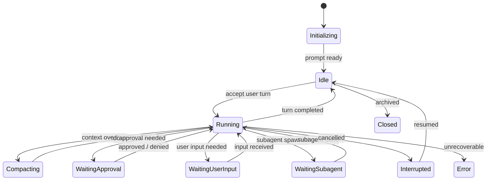
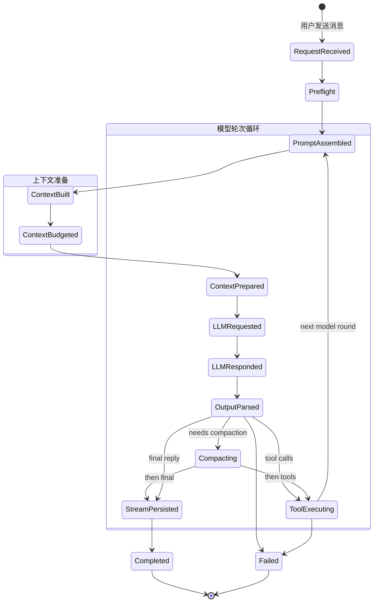
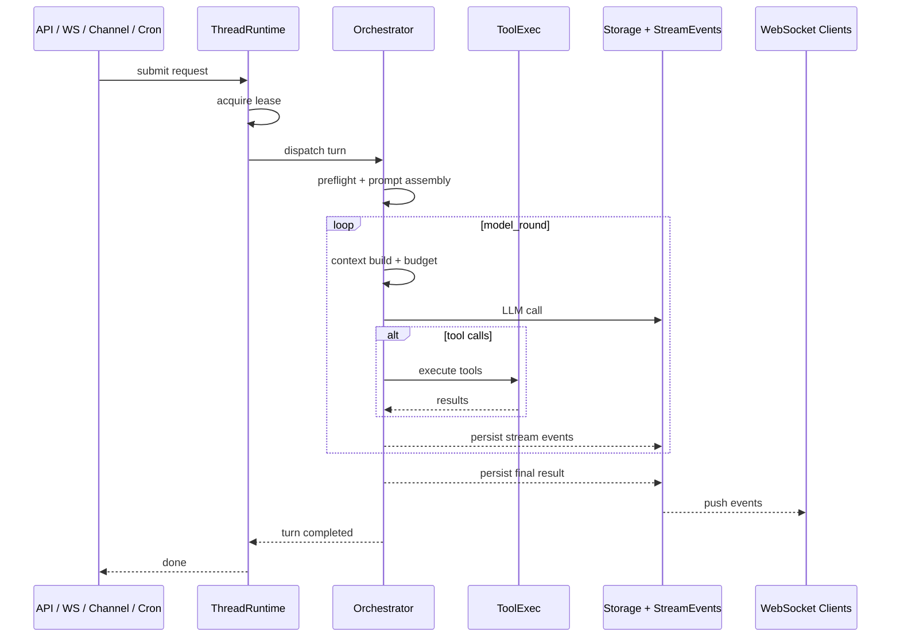

# 智能体核心设计

## 1. 设计目标

本文档定义"单个智能体线程"在 wunder 中的真实运行方式：线程是什么、它经历哪些状态、prompt/记忆/工具/恢复为什么必须作为结构化语义存在，以及 orchestrator 如何承担完整执行链路。

## 2. 不可破坏的约束

- 线程首次确定后的 `system prompt` 必须冻结，后续用户轮次不得改写。
- 长期记忆只允许在线程初始化阶段通过 snapshot 注入一次。
- 协作态、事件态、前端态不得反向污染线程认知态。
- 工具治理必须由运行时结构保证，不能退化为 prompt 约定。
- 用户轮次与模型轮次必须独立计量，不能混为一次"消息交互"。
- waiting、resume、crash recovery 必须是显式状态，而不是隐式约定。

## 3. 核心定义：四层运行时单元

**单智能体**不是一个页面对象，也不是一个聊天室对象，而是一个带严格边界的**线程运行时单元**。这个单元同时包含 4 个层面：

1. **线程状态** — `thread_id`、当前 turn、waiting state、resume plan、frozen prompt 引用、execution lease。
2. **认知上下文** — system prompt、developer/user context、memory snapshot、工具 observation、上下文压缩状态。
3. **执行治理** — tool surface、审批策略、沙箱策略、重试治理、动态工具挂载、模型能力约束。
4. **现实外壳** — 工作区文件、流式事件、公开投影、数据库记忆、运行指标。

## 4. 三层时间尺度

线程内的交互被拆为三个时间层级：

```
线程 (Thread)
 └─ 用户轮次 1 (User Round)
 │   ├─ 模型轮次 1 (Model Round): 模型调用 + 工具执行
 │   ├─ 模型轮次 2 (Model Round): 模型再次调用
 │   └─ ...
 ├─ 用户轮次 2 (User Round)
 │   └─ ...
 └─ ...
```

- **线程**：单智能体的完整认知容器，贯穿一次会话的整个生命周期。
- **用户轮次**：用户发来一次输入，到智能体产出最终回复之间的全过程。一轮用户轮次可包含多轮模型轮次（工具循环）。
- **模型轮次**：模型一次 API 调用 + 输出解析。如果模型返回了工具调用，则执行工具后进入下一轮模型轮次。

## 5. 线程生命周期

### 5.1 线程状态

线程运行时（`src/services/runtime/thread/runtime.rs`）管理线程的完整生命周期状态：

| 状态 | 含义 | 是否活跃 |
| --- | --- | --- |
| `Initializing` | 线程正在初始化 | 否 |
| `Idle` | 空闲，等待用户输入 | 否 |
| `Running` | 正在执行模型推理或工具调用 | 是 |
| `Compacting` | 正在压缩历史上下文 | 是 |
| `WaitingApproval` | 等待用户/管理员审批 | 是 |
| `WaitingUserInput` | 等待用户补充输入 | 是 |
| `WaitingSubagent` | 等待子智能体完成 | 是 |
| `Interrupted` | 线程被中断，可恢复 | 否 |
| `Error` | 遇到不可恢复错误 | 否 |
| `Closed` | 线程已关闭 | 否 |

### 5.2 线程状态图



### 5.3 Turn 状态

orchestrator 内的 `TurnState`（`src/orchestrator/turn_state.rs`）追踪一轮用户轮次的执行细节：

| 字段 | 作用 |
| --- | --- |
| turn_id | 当前用户轮次 ID |
| status | 当前轮次状态 |
| model_round_index | 当前第几轮模型轮次 |
| tool_calls_in_batch | 当前工具批次的调用数量 |
| retry_count | 重试计数 |

## 6. 用户轮次流水线

一轮用户轮次在 orchestrator 中经历以下阶段：

### 6.1 阶段一览

| 阶段 | 含义 | 所属阶段组 |
| --- | --- | --- |
| `RequestReceived` | 用户输入已被接受 | 接入 |
| `Preflight` | 执行前预处理 | 接入 |
| `PromptAssembled` | prompt 组装完成 | 上下文准备 |
| `ContextBuilt` | 上下文构建完成 | 上下文准备 |
| `ContextBudgeted` | token 预算分配完成 | 上下文准备 |
| `ContextPrepared` | 上下文预处理完成 | 上下文准备 |
| `LLMRequested` | 模型 API 请求已发出 | 模型轮次 |
| `LLMResponded` | 模型返回响应 | 模型轮次 |
| `OutputParsed` | 模型输出已解析 | 模型轮次 |
| `ToolExecuting` | 工具正在执行 | 工具执行 |
| `Compacting` | 正在压缩历史对话 | 后处理 |
| `StreamPersisted` | 流式结果已持久化 | 终态 |
| `Completed` | 用户轮次正常结束 | 终态 |
| `Failed` | 用户轮次异常终止 | 终态 |

### 6.2 流水线状态图



### 6.3 设计要点

- **模型轮次循环**：`PromptAssembled → LLMRequested → LLMResponded → OutputParsed → ToolExecuting → PromptAssembled` 构成循环。每次循环即一轮模型轮次。
- **可观测性**：每次阶段切换产生事件，封装在 stream events 中，是管理侧状态页的核心数据源。
- **失败安全**：流水线中任何阶段都可能转入 `Failed`，终止当前用户轮次并记录错误上下文。

## 7. 执行主链

### 7.1 请求入口

单智能体请求可从以下入口进入：

- `/wunder` 与 `/wunder/ws`（标准 API 与 WebSocket）
- `/wunder/chat/*` 与 `/wunder/chat/ws`（聊天入口）
- 外部渠道接入 `ChannelHub`
- cron 调度
- MCP 执行入口

这些入口最终都交给 ThreadRuntime，再 dispatch 到 orchestrator。

### 7.2 执行主链时序



## 8. Prompt、Context 与记忆冻结

### 8.1 Prompt 组装结构

Prompt 由 orchestrator 的 `prompt.rs` 模块组装，包含：

| 组成部分 | 含义 |
| --- | --- |
| 基础指令 | 身份、行为约束、格式要求 |
| 开发者上下文 | 开发者注入的额外信息 |
| 用户上下文 | 用户级上下文 |
| 可用智能体列表 | 可调用的子智能体 |
| 记忆快照 | 长期记忆一次性注入 |

### 8.2 Prompt 冻结规则

1. 首轮线程初始化时确定 system prompt
2. 之后轮次直接复用已冻结的 prompt
3. 任何情况下不允许后续轮次改写已冻结的 prompt

### 8.3 记忆注入为什么只能一次

- 线程进入 steady state 后，不应因记忆库变化而漂移 system prompt。
- 再次注入会破坏模型侧提示词缓存。
- 记忆后续可通过工具检索，但不应回写线程 system prompt。

### 8.4 Context 设计

- context 预算显式预留给 system prompt 和必要观察项。
- 长对话依赖 compaction（`context_compactor.rs`）、truncation 和 history normalization。
- overflow recovery 必须走明确恢复链，不静默丢上下文。

## 9. 工具面与执行治理

### 9.1 三层工具体系

1. **Tool surface** — 哪些工具可见、可调用。
2. **Tool execution** — orchestrator 的 tool_exec / tool_parallel 模块负责调度。
3. **Tool implementation** — `src/services/tools/` 中的具体实现。

### 9.2 工具治理链

orchestrator 提供完整的治理链路：

```
工具调用解析 → 并行打包 → 权限检查 → 审批判定 → 沙盒策略 → 执行 → 重试 → 结果归一化 → 日志
```

## 10. Waiting 与 Recovery

### 10.1 Waiting 类型

| 类型 | 触发条件 |
| --- | --- |
| 审批等待 | 工具调用需要用户/管理员确认 |
| 用户输入 | 智能体请求用户补充信息 |
| 子智能体 | 等待子智能体完成 |

### 10.2 恢复场景

| 场景 | 设计要求 |
| --- | --- |
| 中断恢复 | 保留 waiting 状态，不降级为重新开始 |
| 崩溃恢复 | 从 session 状态和 stream events 恢复 |
| 上下文溢出 | 先压缩 → 再恢复 → 必要时回退安全历史 |
| 子智能体等待 | 必须是显式运行态，可继续 watch 和 resume |

### 10.3 Execution Lease

线程通过 ThreadRuntime 的 lease 保证执行互斥：同一时刻只有一个 owner 可以执行线程。超时自动释放，防止崩溃后死锁。

## 11. 模块边界

### 11.1 整体分层

```
src/
├── orchestrator/           ← 智能体执行调度引擎
│   ├── execute.rs          ← Turn 执行主流程
│   ├── turn_state.rs       ← Turn 状态机
│   ├── preflight.rs        ← 执行前预处理
│   ├── prompt.rs           ← Prompt 组装与冻结
│   ├── context.rs          ← 上下文管理
│   ├── context_compactor.rs← 上下文压缩
│   ├── llm.rs              ← 模型调用
│   ├── tool_exec.rs        ← 工具执行调度
│   ├── tool_parallel.rs    ← 工具并行执行
│   ├── retry_governor.rs   ← 重试治理
│   ├── result_normalizer.rs← 结果归一化
│   ├── event_stream.rs     ← 事件流产出
│   ├── stream_persist.rs   ← 流式持久化
│   ├── memory.rs           ← 记忆注入
│   └── ...                 ← 其他支撑模块
├── services/runtime/       ← 运行时调度层
│   ├── thread/             ← 线程运行时（lease、queue、dispatch）
│   └── mission/            ← Mission 运行时（多智能体协作调度）
├── services/tools/         ← 工具实现层
├── services/swarm/         ← 蜂群协作服务
├── services/memory*        ← 记忆管理
├── api/                    ← HTTP/WS 路由
├── storage/                ← 存储后端
└── core/                   ← 配置、鉴权、审批、state
```

### 11.2 边界原则

- orchestrator 负责完整的 turn 执行链路，不依赖外部模块完成核心执行语义。
- ThreadRuntime 负责线程调度（lease、排队、dispatch），不重复 orchestrator 的执行逻辑。
- 工具实现放在 `src/services/tools/`，不在 orchestrator 中堆叠业务逻辑。
- API 层只做鉴权、校验和接线，不承担执行逻辑。

## 12. 与 mission / projection 的边界

- 单智能体线程负责认知推进；`MissionRuntime` 负责多智能体协作实例。
- beeroom、user world 都属于 projection plane。
- projection 只应消费公开事件和 stream events。
- projection 不应直接篡改 thread prompt、memory snapshot 或 turn state。

**一句话总结**：单智能体负责"一个 agent 怎样思考与执行"，mission 负责"多个 agent 怎样协同"，projection 负责"外部如何看到这次协同"。

## 13. 验收标准

- 新线程、续跑线程、恢复线程都能走统一 orchestrator 主链。
- `system prompt` 冻结与一次性记忆注入在结构上得到保证。
- tool surface、approval、sandbox、retry 都有明确运行时落点。
- waiting、resume、crash recovery 可被明确观测和回放。
- 新增执行语义优先放到 orchestrator，不会分散到其他层。

## 14. 相关文档

- `docs/设计文档/01-系统总体设计.md`
- `docs/设计文档/03-实时投影系统设计.md`
- `docs/API文档.md`
