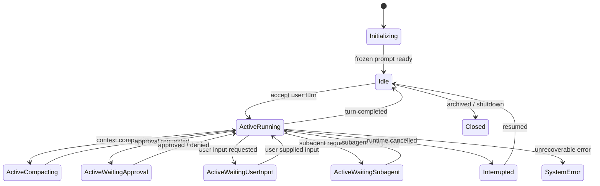
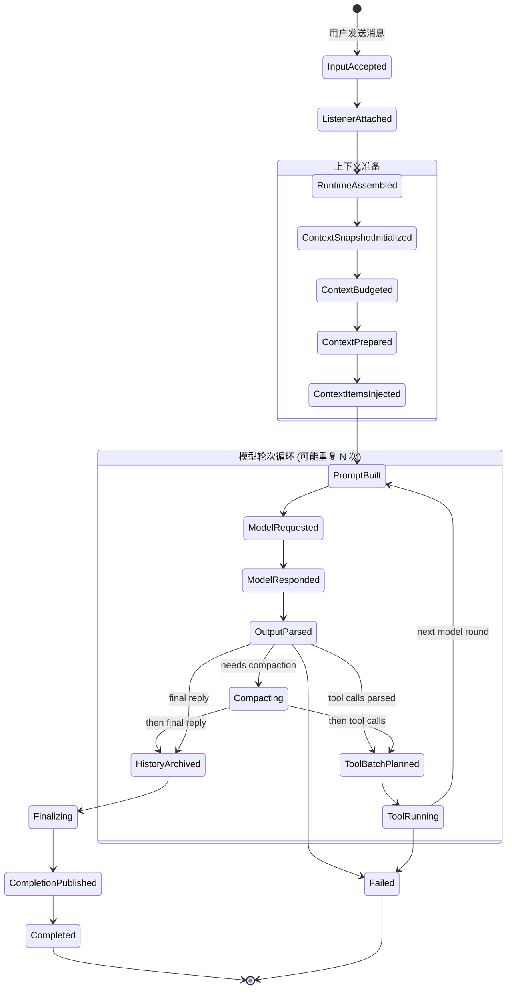
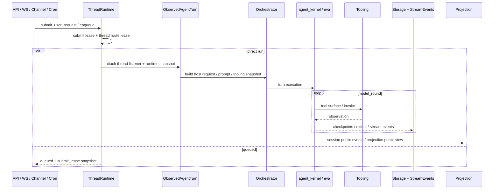

# 智能体核心设计

## 1. 设计目标

本文档定义"单个智能体线程"在 wunder 中的真实运行方式：线程是什么、它经历哪些状态、prompt/记忆/工具/恢复为什么必须作为结构化语义存在，以及 `eva / agent_kernel / orchestrator` 在迁移期如何共存。

当前系统正在从旧 `orchestrator` 过渡到 `eva`，因此本设计的目标不是再造第四套内核，而是稳定主骨架并明确迁移终点。

## 2. 不可破坏的约束

- 线程首次确定后的 `system prompt` 必须冻结，后续用户轮次不得改写。
- 长期记忆只允许在线程初始化阶段通过 snapshot 注入一次。
- 协作态、投影态、前端态不得反向污染线程认知态。
- 工具治理必须由运行时结构保证，不能退化为 prompt 约定。
- 用户轮次与模型轮次必须独立计量，不能混为一次"消息交互"。
- waiting、resume、checkpoint、crash recovery 必须是显式状态，而不是隐式约定。

## 3. 核心定义：四层运行时单元

**单智能体**不是一个页面对象，也不是一个聊天室对象，而是一个带严格边界的**线程运行时单元**。这个单元同时包含 4 个层面：

1. **线程状态** — `thread_id`、当前 turn、checkpoint、waiting state、resume plan、frozen prompt 引用、execution lease。
2. **认知上下文** — system prompt、developer/user context、memory snapshot、工具 observation、上下文压缩状态。
3. **执行治理** — tool surface、审批策略、沙箱策略、重试治理、动态工具挂载、模型能力约束。
4. **现实外壳** — 工作区文件、流式事件、公开投影、数据库记忆、运行指标。

## 4. 三层时间尺度

线程内的交互被拆为三个时间层级：

```
线程 (Thread)
 └─ 用户轮次 1 (User Round)
 │   ├─ 模型轮次 1 (Model Round): 模型调用 + 工具执行
 │   ├─ 模型轮次 2 (Model Round): 模型再次调用
 │   └─ ...
 ├─ 用户轮次 2 (User Round)
 │   └─ ...
 └─ ...
```

- **线程**：单智能体的完整认知容器，贯穿一次会话的整个生命周期。
- **用户轮次**：用户发来一次输入，到智能体产出最终回复之间的全过程。一轮用户轮次可包含多轮模型轮次（工具循环）。
- **模型轮次**：模型一次 API 调用 + 输出解析。如果模型返回了工具调用，则执行工具后进入下一轮模型轮次。

用户每发送一条消息 = 1 轮用户轮次；模型每执行一次 API 调用 = 1 轮模型轮次。

## 5. 线程生命周期

### 5.1 线程状态

`EvaThreadStatus`（定义在 `crates/eva/src/thread/snapshot.rs`）枚举了线程的 10 种生命周期状态：

| 状态 | 含义 | 是否活跃 |
| --- | --- | --- |
| `Initializing` | 线程正在初始化，尚未就绪 | 否 |
| `Idle` | 空闲，等待用户输入 | 否 |
| `ActiveRunning` | 正在执行模型推理或工具调用 | 是 |
| `ActiveCompacting` | 正在压缩历史上下文 | 是 |
| `ActiveWaitingApproval` | 等待用户/管理员审批 | 是 |
| `ActiveWaitingUserInput` | 等待用户补充输入 | 是 |
| `ActiveWaitingSubagent` | 等待子智能体完成 | 是 |
| `Interrupted` | 线程被中断，可恢复 | 否 |
| `SystemError` | 遇到不可恢复错误 | 否 |
| `Closed` | 线程已关闭/归档 | 否 |

### 5.2 线程状态图



### 5.3 线程快照

`EvaThreadSnapshot` 是线程的权威运行时快照，包含了观测、恢复和治理所需的全部状态：

| 字段 | 类型 | 作用 |
| --- | --- | --- |
| `thread_id` | String | 线程唯一标识 |
| `status` | EvaThreadStatus | 当前生命周期状态 |
| `active_turn_id` | Option\<String\> | 当前活跃的用户轮次 ID |
| `current_cursor` | Option\<EvaTurnCursor\> | 当前执行位置（用户轮次/模型轮次/工具调用） |
| `resume_mode` | Option\<EvaTurnResumeMode\> | 恢复方式 |
| `lifecycle_stage` | Option\<EvaTurnLifecycleStage\> | 当前用户轮次所处的流水线阶段 |
| `waiting_state` | Option\<EvaWaitingState\> | 当前等待状态（审批/用户输入/子智能体） |
| `execution_lease` | Option\<EvaExecutionLease\> | 执行租约，防止并发冲突 |
| `recovery_state` | EvaRecoveryState | 恢复尝试计数与等级 |
| `last_checkpoint` | Option\<EvaTurnCheckpoint\> | 最近一次检查点 |
| `mounted_dynamic_tools` | Vec\<String\> | 当前挂载的动态工具列表 |
| `policy_snapshot` | Option\<ToolRuntimeProfile\> | 当前轮次的工具治理策略快照 |
| `frozen_prompt` | EvaFrozenPromptRef | 冻结 prompt 引用 |
| `resumable` | bool | 是否可恢复 |
| `system_error` | Option\<String\> | 错误信息 |
| `trace_ids` | — | 派生的全链路追踪 ID |

`EvaTurnCursor` 精确定位执行位置：

```
EvaTurnCursor {
    user_turn_id: "user-turn-1",    // 哪一轮用户轮次
    model_round_index: 2,           // 第几轮模型轮次
    tool_call_index: 1,             // 当前工具批次中的第几个调用
    attempt_index: 0,               // 重试序号
}
```

## 6. 用户轮次流水线

一轮用户轮次的执行被拆分为 19 个显式阶段（`EvaTurnLifecycleStage`，定义在 `crates/eva/src/turn/stage.rs`），构成一条严格的流水线。流水线的完整生命周期 = 一轮用户轮次；其中 `PromptBuilt → … → ToolRunning → PromptBuilt` 的循环代表该用户轮次内的多次模型轮次。

### 6.1 阶段一览

| 阶段 | 含义 | 所属阶段组 |
| --- | --- | --- |
| `InputAccepted` | 用户输入已被接受 | 接入 |
| `ListenerAttached` | 线程监听器已挂载 | 接入 |
| `RuntimeAssembled` | 运行时上下文已组装 | 接入 |
| `ContextSnapshotInitialized` | 上下文快照初始化完成 | 上下文准备 |
| `ContextBudgeted` | token 预算分配完成 | 上下文准备 |
| `ContextPrepared` | 上下文预处理（压缩/截断/归一化）完成 | 上下文准备 |
| `ContextItemsInjected` | 额外上下文条目（记忆/工具观察等）注入完成 | 上下文准备 |
| `PromptBuilt` | 冻结 prompt 组装完成 | 模型轮次 |
| `ModelRequested` | 模型 API 请求已发出 | 模型轮次 |
| `ModelResponded` | 模型返回响应 | 模型轮次 |
| `OutputParsed` | 模型输出已解析（工具调用 / 文本回复分流） | 模型轮次 |
| `Compacting` | 正在压缩历史对话 | 后处理 |
| `ToolBatchPlanned` | 工具调用批次已规划 | 工具执行 |
| `ToolRunning` | 工具正在执行 | 工具执行 |
| `HistoryArchived` | 历史记录已归档 | 终态 |
| `Finalizing` | 最终结果收尾中 | 终态 |
| `CompletionPublished` | 完成事件已发布到投影层 | 终态 |
| `Completed` | 用户轮次正常结束 | 终态 |
| `Failed` | 用户轮次异常终止 | 终态 |

### 6.2 流水线状态图



### 6.3 设计要点

- **模型轮次循环**：`PromptBuilt → ModelRequested → ModelResponded → OutputParsed → ToolRunning → PromptBuilt` 构成循环。每次循环即一轮模型轮次，循环次数 = 该用户轮次包含的模型轮次数。`EvaTurnCursor.model_round_index` 随每次循环递增。
- **可观测性**：每次阶段切换产生 `LifecycleStageChanged` 事件，封装在 `EvaTurnEventEnvelope`（含 thread_id / turn_id / sequence / cursor / timestamp），是管理侧状态页的核心数据源。
- **失败安全**：流水线中任何阶段都可能转入 `Failed`，终止当前用户轮次并记录错误上下文。

## 7. 执行主链

### 7.1 请求入口

单智能体请求可从以下入口进入：

- `/wunder` 与 `/wunder/ws`（标准 API 与 WebSocket）
- `/wunder/chat/*` 与 `/wunder/chat/ws`（聊天入口）
- 外部渠道接入 `ChannelHub`（微信等）
- cron 调度
- MCP 执行入口

这些入口最终都落到 `WunderRequest`，再交给线程执行链。

### 7.2 执行主链时序



这张图刻意保留了 `ObservedAgentTurn` 与 `Orchestrator`，因为当前仓库仍处在 `eva` 收口过程里，它描述的是"现阶段真实主链"，而不是完全迁移后的理想终态。

### 7.3 恢复模式

`EvaTurnResumeMode` 定义了用户轮次如何开始：

| 模式 | 含义 |
| --- | --- |
| `FreshUserTurn` | 全新的用户输入，从头开始 |
| `AttachActiveTurn` | 附加到已有的活跃轮次 |
| `RestoreFromCheckpoint` | 从检查点恢复 |
| `ContinueAfterCompaction` | 上下文压缩后继续 |
| `ContinueAfterRecovery` | 故障恢复后继续 |

## 8. Prompt、Context 与记忆冻结

### 8.1 Prompt 组装结构

Prompt 拆分为以下组成部分：

| 组成部分 | 含义 |
| --- | --- |
| `BaseInstructions` | 基础指令（身份、行为约束、格式要求） |
| `DeveloperContext` | 开发者注入的上下文 |
| `UserContext` | 用户级上下文 |
| `AgentsSnapshot` | 可用智能体列表快照 |
| `MemorySnapshot` | 长期记忆一次性注入 |

通过 `PromptAssemblyInput` 输入，`PromptAssemblyResult` 输出。

### 8.2 Prompt 来源优先级

1. 现有 `FrozenPromptSnapshot`（已冻结则直接复用）
2. 已存 `session prompt`
3. 新生成的 system prompt

只有当前两者都不存在时，才会生成新的 system prompt。

### 8.3 记忆注入为什么只能一次

长期记忆通过 `WunderMemorySnapshotProvider` 构造成 `MemorySnapshot`，再进入冻结 prompt。原因：

- 线程进入 steady state 后，不应因记忆库变化而漂移 system prompt。
- 再次注入会破坏模型侧提示词缓存。
- 记忆后续可通过工具检索，但不应回写线程 system prompt 根部。

### 8.4 Context 设计

- context 预算显式预留给 system prompt、恢复说明和必要观察项。
- 长对话依赖 compaction、truncation、history normalization，而不是简单截断。
- overflow recovery 与 mid-turn compaction 必须走明确恢复链，而不是静默丢上下文。

## 9. 工具面与执行治理

### 9.1 三层工具体系

1. **Tool surface** — 哪些工具可见、可搜索、可挂载、可发现。
2. **Tool execution context** — 当前线程/turn/user/workspace/agent/model capability/approval/sandbox 的执行上下文。
3. **Tool executor** — 真正执行内置工具、技能、MCP、用户工具或动态工具。

### 9.2 工具面摘要

`ToolSurfaceRuntimeSummary` 提供当前轮次的工具面概览：

| 字段 | 含义 |
| --- | --- |
| `model_visible_tool_names` | 模型可见的工具列表 |
| `searchable_tool_count` | 可搜索工具数量 |
| `discoverable_tool_count` | 可发现工具数量 |
| `mounted_dynamic_tool_names` | 动态挂载的工具 |
| `direct_tool_names` | 直接暴露的工具 |
| `overflowed` | 工具数是否超过直接暴露阈值 |
| `tool_search_enabled` / `tool_suggest_enabled` | 搜索/推荐是否启用 |

### 9.3 工具治理链

`eva::tools` 提供完整的治理链路：

```
spec → registry → router → batch planner → preflight → permissions
  → approvals → sandbox → retry governor → executor → ledger
```

## 10. waiting、checkpoint 与恢复链

### 10.1 Waiting 类型

| waiting kind | 含义 |
| --- | --- |
| `Approval` | 等待审批（工具调用需要用户确认） |
| `UserInput` | 等待用户补充输入 |
| `Subagent` | 等待子智能体完成 |

每种等待态都记录在 `EvaWaitingState` 中，包含 request_id、关联的工具名和调用 ID、状态（Pending / Answered / Expired / Superseded / Cancelled / Orphaned）和时间戳。

### 10.2 恢复场景

| 场景 | 设计要求 |
| --- | --- |
| 中断恢复 | 保留当前 waiting / continuation 语义，避免降级为重新开始 |
| 崩溃恢复 | 能从 checkpoint 或 thread snapshot 重新装回运行时 |
| 工具结果缺失 | 明确识别 missing / discarded results，并给出后续策略 |
| 上下文溢出 | 先压缩、再恢复、最后必要时回退到安全历史 |
| 子智能体等待 | waiting_subagent 必须是显式运行态，可继续 watch 和 resume |

### 10.3 Execution Lease

线程通过 `EvaExecutionLease` 保证执行互斥：同一时刻只有一个 runtime owner 可以执行线程。Lease 支持 acquire / heartbeat / release，超时自动失效，防止崩溃后死锁。

### 10.4 恢复等级

`EvaRecoveryState` 跟踪恢复尝试次数和等级：

| 等级 | 含义 |
| --- | --- |
| `Automatic` | 可自动恢复 |
| `ManualIntervention` | 恢复次数耗尽，需要人工介入 |

## 11. 模块边界

### 11.1 整体分层

```
crates/eva/                          ← 宿主无关的运行时 crate
  ├── core/                          ← 内核 schema 与公共契约
  ├── engine/                        ← EvaEngine 入口与 runtime wiring
  ├── host/                          ← 宿主端口（model / tooling / approval / store 等）
  ├── thread/                        ← 线程快照、注册表、watch、resume、execution lease
  ├── session/                       ← 会话运行时、checkpoint、waiting state
  ├── turn/                          ← 用户轮次执行器、生命周期阶段、事件、cursor
  ├── prompt/                        ← prompt 组装、冻结、context injection
  ├── context/                       ← 上下文历史、压缩、截断、预算
  ├── tools/                         ← 工具 spec / registry / router / batch / approvals / sandbox / retry / ledger
  ├── recovery/                      ← 崩溃恢复、中断恢复、溢出恢复、工具结果缺失
  ├── model/                         ← 模型网关抽象
  ├── protocol/                      ← 通用协议定义
  ├── store/                         ← 持久化抽象
  └── wunder/                        ← Wunder 宿主适配层
       ├── adapter/                  ← prompt / tooling / turn 适配器
       ├── prompt/                   ← Wunder prompt 组装、记忆提供者、模板
       ├── tooling/                  ← Wunder 工具目录、动态工具、桥接
       ├── runtime_api/              ← Wunder 运行时 API 入口
       └── store/                    ← Wunder 存储适配

src/                                 ← Server 主 crate
  ├── core/                          ← Observed runtime 桥接层
  │   ├── observed_runtime.rs        ← ObservedRuntimeHost（双运行时管理）
  │   ├── observed_runtime_mirror.rs ← EVA → legacy 状态同步
  │   ├── observed_runtime_snapshot.rs ← 统一快照与恢复计划
  │   ├── observed_agent_turn.rs     ← Agent turn 桥接
  │   └── observed_turn_executor.rs  ← Turn 执行器桥接
  ├── agent_kernel/                  ← 旧内核（类型与 agent_kernel 对齐）
  ├── orchestrator/                  ← 旧主链（兼容逻辑，不再扩大职责）
  ├── api/                           ← HTTP/WS 路由
  └── services/                      ← 业务服务
```

### 11.2 边界原则

- 凡是任何宿主都需要稳定复用的线程语义，沉淀到 `eva::core` / `eva::thread` / `eva::turn` 等。
- 凡是依赖 Wunder 配置、工作区、工具产品、知识、用户数据的能力，停留在 `eva::wunder` 或更外层的 `src/services/*`。
- `src/core/observed_*` 承担 observed runtime 宿主接线。
- `src/agent_kernel/` 是旧内核，仅维护兼容；新增宿主无关语义优先放 `crates/eva/src/*`。
- `src/orchestrator/` 是旧调度，只维护尚未迁移的逻辑。

### 11.3 Host 端口（依赖反转）

`EvaEngine` 通过 `EvaEnginePorts` 注入宿主能力，不直接依赖任何 Wunder 类型：

| 端口 | 作用 |
| --- | --- |
| `EvaModelGateway` | 模型 API 调用 |
| `EvaToolCatalogProvider` | 工具目录查询 |
| `EvaToolExecutor` | 工具执行 |
| `EvaApprovalPort` | 审批流 |
| `EvaUserInputPort` | 用户输入 |
| `EvaLocalizer` | 国际化 |
| `EvaClock` / `EvaIdGenerator` | 时钟与 ID 生成 |
| `EvaThreadStore` / `EvaRolloutStore` / `EvaCheckpointStore` | 持久化 |

## 12. 与 mission / projection 的边界

- 单智能体线程负责认知推进；`MissionRuntime` 负责多智能体协作实例。
- beeroom、session room、user_world room 都属于 projection plane。
- projection 只应消费公开事件、projection snapshot、realtime target、public summary。
- projection 不应直接篡改 thread prompt、memory snapshot、tool execution context、turn cursor。

**一句话总结**：单智能体负责"一个 agent 怎样思考与执行"，mission 负责"多个 agent 怎样协同"，projection 负责"外部如何看到这次协同"。

## 13. 当前迁移策略

当前最重要的策略：

- 用 `eva` 固化宿主无关语义（thread / turn / session / prompt / context / tools / recovery）。
- 用 `eva::wunder` 固化 Wunder 宿主适配。
- 现阶段由 `src/core/observed_*` 承担 observed runtime 宿主接线，由 `src/core/legacy_agent_kernel.rs` 承担切换期兼容 seam。
- 逐步删除旧 `orchestrator` 中已被新主链承接的逻辑。

验收重点：

- 新线程、续跑线程、恢复线程都能走统一内核主链。
- `system prompt` 冻结与一次性记忆注入在结构上得到保证。
- tool surface、approval、sandbox、retry、ledger 都有明确运行时落点。
- waiting、checkpoint、resume、crash recovery 可被明确观测和回放。
- `eva` 内核与 `eva::wunder` 宿主适配的职责边界清楚，新能力新增时不会反复回流旧 `orchestrator`。

## 14. 相关文档

- `docs/设计文档/01-系统总体设计.md`
- `docs/设计文档/03-实时投影系统设计.md`
- `docs/方案/eva运行时设计.md`
- `docs/方案/智能体核心解耦方案.md`
- `docs/API/00-runtime-architecture-and-decoupling.md`
