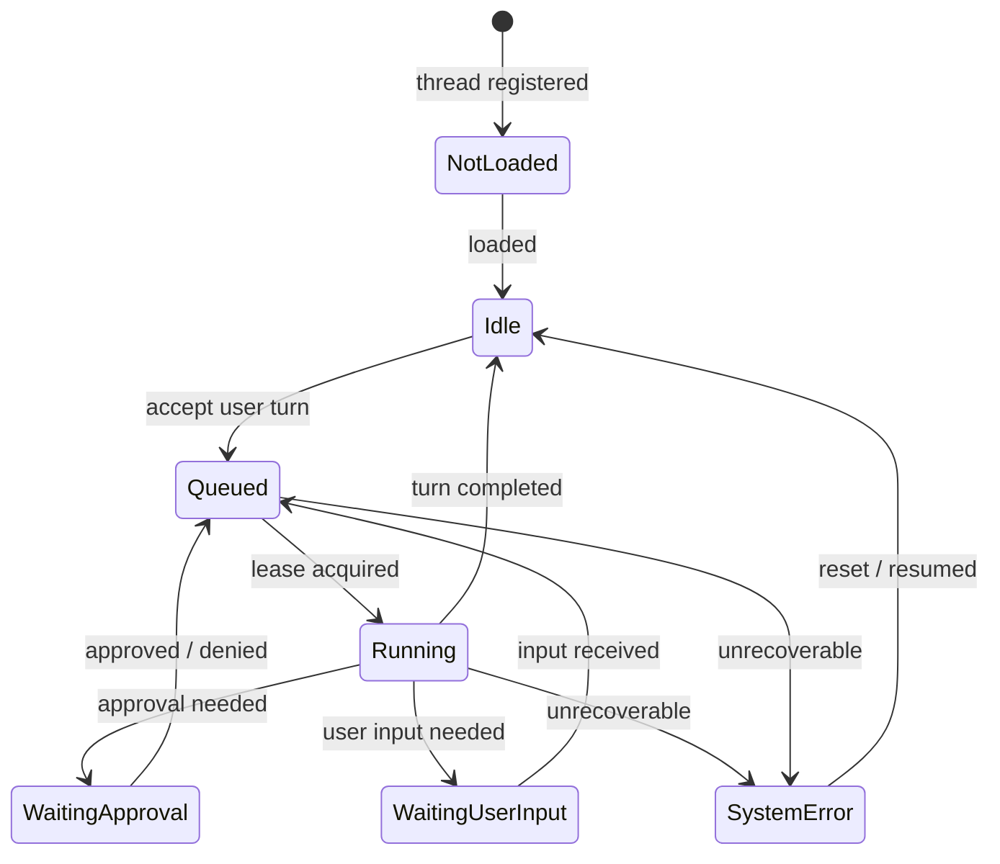
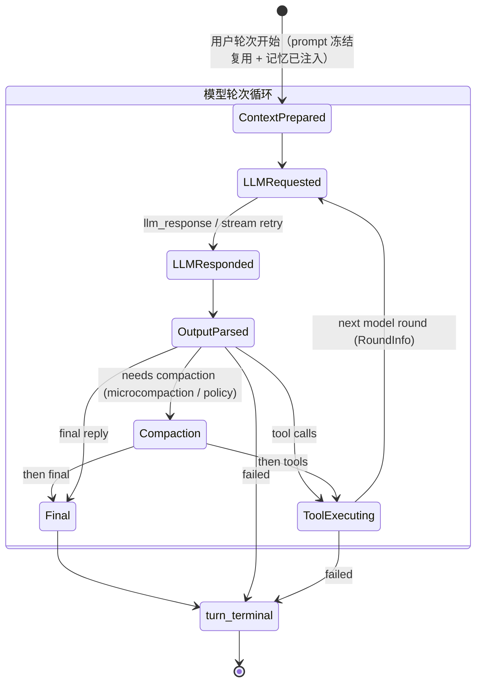
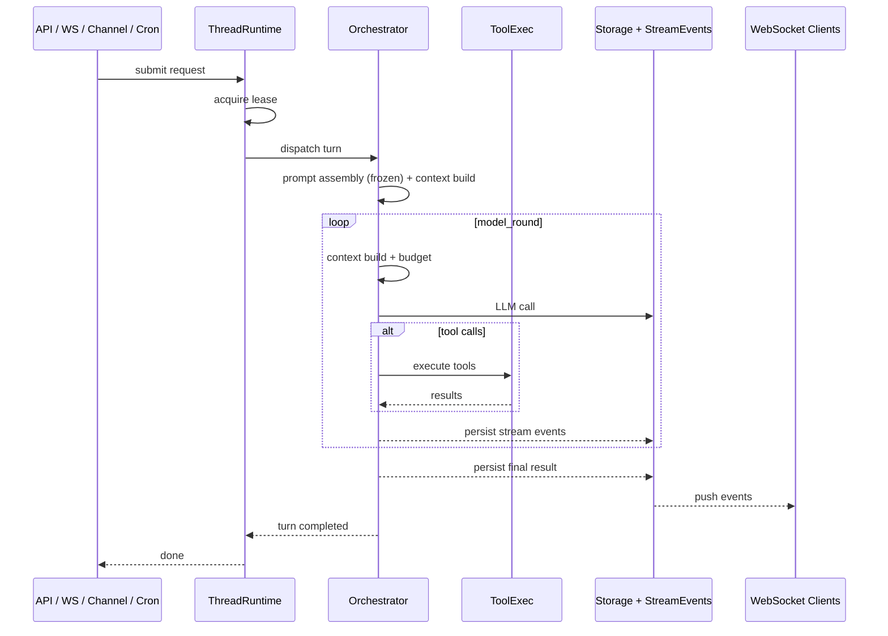

# 智能体核心设计

## 1. 设计目标

本文档定义"单个智能体线程"在 wunder 中的真实运行方式：线程是什么、它经历哪些状态、prompt/记忆/工具/恢复为什么必须作为结构化语义存在，以及 orchestrator 如何承担完整执行链路。

## 2. 不可破坏的约束

- 线程首次确定后的 `system prompt` 必须冻结，后续用户轮次不得改写。
- 长期记忆只允许在线程初始化阶段通过 snapshot 注入一次。
- 协作态、事件态、前端态不得反向污染线程认知态。
- 工具治理必须由运行时结构保证，不能退化为 prompt 约定。
- 用户轮次与模型轮次必须独立计量，不能混为一次"消息交互"。
- waiting、resume、crash recovery 必须是显式状态，而不是隐式约定。

## 3. 核心定义：四层运行时单元

**单智能体**不是一个页面对象，也不是一个聊天室对象，而是一个带严格边界的**线程运行时单元**。这个单元同时包含 4 个层面：

1. **线程状态** — `thread_id`、当前 turn、waiting state、resume plan、frozen prompt 引用、execution lease。
2. **认知上下文** — system prompt、developer/user context、memory snapshot、工具 observation、上下文压缩状态。
3. **执行治理** — tool surface、审批策略、沙箱策略、重试治理、动态工具挂载、模型能力约束。
4. **现实外壳** — 工作区文件、流式事件、公开投影、数据库记忆、运行指标。

## 4. 三层时间尺度

线程内的交互被拆为三个时间层级：

```
线程 (Thread)
 └─ 用户轮次 1 (User Round)
 │   ├─ 模型轮次 1 (Model Round): 模型调用 + 工具执行
 │   ├─ 模型轮次 2 (Model Round): 模型再次调用
 │   └─ ...
 ├─ 用户轮次 2 (User Round)
 │   └─ ...
 └─ ...
```

- **线程**：单智能体的完整认知容器，贯穿一次会话的整个生命周期。
- **用户轮次**：用户发来一次输入，到智能体产出最终回复之间的全过程。一轮用户轮次可包含多轮模型轮次（工具循环）。
- **模型轮次**：模型一次 API 调用 + 输出解析。如果模型返回了工具调用，则执行工具后进入下一轮模型轮次。

## 5. 线程生命周期

### 5.1 线程状态

线程运行时状态由 `ThreadRuntimeStatus` 枚举定义（`crates/wunder-runtime/src/orchestrator/thread_runtime.rs`），线程的 lease、排队与 dispatch 由 `crates/wunder-runtime/src/services/runtime/thread/runtime.rs` 管理：

| 状态 | 含义 | 是否活跃 |
| --- | --- | --- |
| `NotLoaded` | 线程尚未加载到运行时 | 否 |
| `Idle` | 空闲，等待用户输入 | 否 |
| `Running` | 正在执行模型推理或工具调用 | 是 |
| `Queued` | 已接受请求，排队等待 lease | 是 |
| `WaitingApproval` | 等待用户/管理员审批 | 是 |
| `WaitingUserInput` | 等待用户补充输入 | 是 |
| `SystemError` | 遇到不可恢复错误 | 否 |

### 5.2 线程状态图


```mermaid
stateDiagram-v2
  [*] --> NotLoaded: thread registered
  NotLoaded --> Idle: loaded
  Idle --> Queued: accept user turn
  Queued --> Running: lease acquired
  Running --> WaitingApproval: approval needed
  Running --> WaitingUserInput: user input needed
  WaitingApproval --> Queued: approved / denied
  WaitingUserInput --> Queued: input received
  Running --> Idle: turn completed
  Running --> SystemError: unrecoverable
  Queued --> SystemError: unrecoverable
  SystemError --> Idle: reset / resumed
```

### 5.3 Turn 状态

orchestrator 通过 `ActiveTurnRegistry` / `ActiveTurnSnapshot`（`crates/wunder-runtime/src/orchestrator/turn_state.rs`）登记正在执行的轮次：

| 字段 | 作用 |
| --- | --- |
| session_id | 所属会话 |
| turn_id | 当前用户轮次 ID |
| pending_approval_ids | 待审批的工具调用 |
| waiting_for_user_input | 是否等待用户输入 |

模型轮次计数由执行主循环的 `RoundInfo::new(user_round, model_round)`（`orchestrator/execute.rs`）承担；重试治理由 `retry_governor.rs` 负责，不挂在轮次状态上。

## 6. 用户轮次流水线

一轮用户轮次由 `orchestrator/execute.rs` 的主循环驱动（user_round / model_round），执行过程通过统一的事件流对外可观测。

### 6.1 可观测事件类型

事件类型定义在 `crates/wunder-runtime/src/orchestrator/event_stream.rs`：

| 事件类型 | 含义 | 所属阶段组 |
| --- | --- | --- |
| `context_usage` | 上下文用量报告 | 上下文准备 |
| `llm_request` | 模型 API 请求已发出 | 模型轮次 |
| `llm_output_delta` | 模型输出增量（流式） | 模型轮次 |
| `llm_response` | 模型返回响应 | 模型轮次 |
| `llm_stream_retry` | 流式中断后重试 | 模型轮次 |
| `tool_call` | 发起工具调用 | 工具执行 |
| `tool_output_delta` | 工具输出增量（流式） | 工具执行 |
| `tool_result` | 工具返回结果（内嵌模型观察裁剪后的 `model_observation`） | 工具执行 |
| `turn_terminal` | 用户轮次终态（完成/失败/停止原因） | 终态 |

压缩、记忆提取等内部工作流以事件/标记形式通知前端（见 `docs/设计文档/上下文压缩设计.md`），不作为独立线程运行态。

### 6.2 执行循环


```mermaid
stateDiagram-v2
  [*] --> ContextPrepared: 用户轮次开始（prompt 冻结复用 + 记忆已注入）
  state "模型轮次循环" as mr {
    ContextPrepared --> LLMRequested
    LLMRequested --> LLMResponded: llm_response / stream retry
    LLMResponded --> OutputParsed
    OutputParsed --> Compaction: needs compaction (microcompaction / policy)
    OutputParsed --> ToolExecuting: tool calls
    Compaction --> ToolExecuting: then tools
    Compaction --> Final: then final
    ToolExecuting --> LLMRequested: next model round (RoundInfo)
  }
  OutputParsed --> Final: final reply
  Final --> turn_terminal
  turn_terminal --> [*]

  OutputParsed --> turn_terminal: failed
  ToolExecuting --> turn_terminal: failed
```

### 6.3 设计要点

- **模型轮次循环**：`LLMRequested → LLMResponded → OutputParsed → ToolExecuting → LLMRequested` 构成循环。每次循环即一轮模型轮次，由 `RoundInfo` 计量。
- **可观测性**：每次阶段切换产生上述事件，封装在 stream events 中，是管理侧状态页的核心数据源。
- **失败安全**：循环中任何一步都可能转入失败终态，`turn_terminal` 事件携带停止原因，终止当前用户轮次并记录错误上下文。

## 7. 执行主链

### 7.1 请求入口

单智能体请求可从以下入口进入：

- `/wunder` 与 `/wunder/ws`（标准 API 与 WebSocket）
- `/wunder/chat/*` 与 `/wunder/chat/ws`（聊天入口）
- 外部渠道接入 `ChannelHub`
- cron 调度
- MCP 执行入口

这些入口最终都交给 ThreadRuntime，再 dispatch 到 orchestrator。

### 7.2 执行主链时序


```mermaid
sequenceDiagram
  participant Ingress as API / WS / Channel / Cron
  participant Thread as ThreadRuntime
  participant Orch as Orchestrator
  participant Tools as ToolExec
  participant Store as Storage + StreamEvents
  participant WS as WebSocket Clients

  Ingress->>Thread: submit request
  Thread->>Thread: acquire lease
  Thread->>Orch: dispatch turn
  Orch->>Orch: prompt assembly (frozen) + context build
  loop model_round
    Orch->>Orch: context build + budget
    Orch->>Store: LLM call
    alt tool calls
      Orch->>Tools: execute tools
      Tools-->>Orch: results
    end
    Orch-->>Store: persist stream events
  end
  Orch-->>Store: persist final result
  Store-->>WS: push events
  Orch-->>Thread: turn completed
  Thread-->>Ingress: done
```

## 8. Prompt、Context 与记忆冻结

### 8.1 Prompt 组装结构

Prompt 由 orchestrator 的 `prompt.rs` 模块组装，包含：

| 组成部分 | 含义 |
| --- | --- |
| 基础指令 | 身份、行为约束、格式要求 |
| 开发者上下文 | 开发者注入的额外信息 |
| 用户上下文 | 用户级上下文 |
| 可用智能体列表 | 可调用的子智能体 |
| 记忆快照 | 长期记忆一次性注入 |

### 8.2 Prompt 冻结规则

1. 首轮线程初始化时确定 system prompt
2. 之后轮次直接复用已冻结的 prompt
3. 任何情况下不允许后续轮次改写已冻结的 prompt

### 8.3 记忆注入为什么只能一次

- 线程进入 steady state 后，不应因记忆库变化而漂移 system prompt。
- 再次注入会破坏模型侧提示词缓存。
- 记忆后续可通过工具检索，但不应回写线程 system prompt。

### 8.4 Context 设计

- context 预算显式预留给 system prompt 和必要观察项。
- 长对话依赖 compaction（`orchestrator/compaction_policy.rs` 决策、`microcompaction.rs` 本地微压缩、摘要压缩见 `memory.rs::maybe_compact_messages`；`memory_compaction_budget/window` 是压缩后消息窗口的预算助手，与长期记忆无关）、truncation 和 history normalization。详见 `docs/设计文档/上下文压缩设计.md`。
- overflow recovery 必须走明确恢复链，不静默丢上下文。

## 9. 工具面与执行治理

### 9.1 三层工具体系

1. **Tool surface** — 哪些工具可见、可调用。
2. **Tool execution** — orchestrator 的 tool_exec / tool_parallel 模块负责调度。
3. **Tool implementation** — `crates/wunder-runtime/src/services/tools/` 中的具体实现。

### 9.2 工具治理链

orchestrator 提供完整的治理链路：

```
工具调用解析 → 并行打包 → 权限检查 → 审批判定 → 沙盒策略 → 执行 → 重试 → 结果归一化 → 日志
```

## 10. Waiting 与 Recovery

### 10.1 Waiting 类型

| 类型 | 触发条件 |
| --- | --- |
| 审批等待 | 工具调用需要用户/管理员确认 |
| 用户输入 | 智能体请求用户补充信息 |

子智能体不是线程运行态：子智能体由 `crates/wunder-runtime/src/services/subagents/` 管理并通过 `/wunder/chat/sessions/{id}/subagents` 查询，主线程不进入"等待子智能体"状态。

### 10.2 恢复场景

| 场景 | 设计要求 |
| --- | --- |
| 中断恢复 | 保留 waiting 状态，不降级为重新开始 |
| 崩溃恢复 | 从 session 状态和 stream events 恢复 |
| 上下文溢出 | 先压缩 → 再恢复 → 必要时回退安全历史 |

### 10.3 Execution Lease

线程通过 ThreadRuntime 的 lease 保证执行互斥：同一时刻只有一个 owner 可以执行线程。超时自动释放，防止崩溃后死锁。

## 11. 模块边界

### 11.1 整体分层

```
crates/wunder-runtime/src/
├── orchestrator/           ← 智能体执行调度引擎
│   ├── execute.rs          ← Turn 执行主流程（user_round / model_round）
│   ├── turn_state.rs       ← ActiveTurnRegistry / ActiveTurnSnapshot
│   ├── thread_runtime.rs   ← ThreadRuntimeStatus 状态定义
│   ├── prompt.rs           ← Prompt 组装与冻结
│   ├── context.rs          ← 上下文管理
│   ├── compaction_policy.rs        ← 上下文压缩策略
│   ├── microcompaction.rs(+目录)   ← 近距工具结果微压缩
│   ├── memory_compaction_budget.rs ← 记忆压缩预算
│   ├── memory_compaction_window.rs ← 记忆压缩窗口
│   ├── llm.rs              ← 模型调用
│   ├── tool_exec.rs        ← 工具执行调度
│   ├── tool_parallel.rs    ← 工具并行执行
│   ├── retry_governor.rs   ← 重试治理
│   ├── result_normalizer.rs← 结果归一化
│   ├── event_stream.rs     ← 事件流产出
│   ├── stream_persist.rs   ← 流式持久化
│   ├── memory.rs           ← 记忆注入
│   └── ...                 ← 其他支撑模块
├── services/runtime/       ← 运行时调度层
│   └── thread/             ← 线程运行时（lease、queue、dispatch）
├── services/tools/         ← 工具实现层
├── services/memory*        ← 记忆管理
├── api/                    ← HTTP/WS 路由
├── storage/                ← 存储后端
└── core/                   ← 配置、鉴权、审批、state

crates/wunder-core/         ← 跨形态低依赖基础能力（鉴权、配置、schema、存储抽象等）
```

### 11.2 边界原则

- orchestrator 负责完整的 turn 执行链路，不依赖外部模块完成核心执行语义。
- ThreadRuntime 负责线程调度（lease、排队、dispatch），不重复 orchestrator 的执行逻辑。
- 工具实现放在 `crates/wunder-runtime/src/services/tools/`，不在 orchestrator 中堆叠业务逻辑。
- API 层只做鉴权、校验和接线，不承担执行逻辑。

## 12. 与 projection 的边界

- 单智能体线程负责认知推进；子智能体由 `crates/wunder-runtime/src/services/subagents/` 管理，是父线程持有的临时工作单元（原 `MissionRuntime` 多智能体协同运行时已随蜂群编排在 0.5.0 移除）。
- user world 属于 projection plane。
- projection 只应消费公开事件和 stream events。
- projection 不应直接篡改 thread prompt、memory snapshot 或 turn state。

**一句话总结**：单智能体负责"一个 agent 怎样思考与执行"，子智能体负责任务内的临时并行派生，projection 负责"外部如何看到这次执行"。

## 13. 验收标准

- 新线程、续跑线程、恢复线程都能走统一 orchestrator 主链。
- `system prompt` 冻结与一次性记忆注入在结构上得到保证。
- tool surface、approval、sandbox、retry 都有明确运行时落点。
- waiting、resume、crash recovery 可被明确观测和回放。
- 新增执行语义优先放到 orchestrator，不会分散到其他层。

## 14. 相关文档

- `docs/设计文档/01-系统总体设计.md`
- `docs/设计文档/03-实时投影系统设计.md`
- `docs/API文档.md`

## 持久子智能体池与取消边界

> 本节于 2026-10-08 由 `docs/方案/归档/04-协作蜂群与任务系统设计.md` 迁入，保留原文措辞。子智能体是现行保留能力，与已移除的蜂群编排无关。

子智能体是父会话持有的可复用执行单元，不进入普通工作线程目录。关系及历史持久化于 `chat_sessions`，每次执行使用独立 `session_runs` 账本；UI 展示独立目录并通过既有父会话事件和查询补水。完成或中断仅结束本次运行，下一轮由主智能体选择复用同一个 session，而非批量自动重启。

运行时 `runtime/thread/child_runs.rs` 维护有界活动登记和每次运行的取消令牌。登记发生在异步交接前，monitor 的取消和子任务准入使用一致锁顺序；子线程监控登记重置回合标志不会清除运行取消令牌。登记保留祖先链，即使中间运行结束，其后台后代仍可被根会话取消。执行流读完收敛后释放准入，延迟回流继续持有原令牌；重新分派使用新的身份，旧 guard 不会误删新运行。

取消入口同时处理 monitor、scheduler、目标续跑和排队任务；数据库后代遍历按 256 条分页，普通用户 fork 保持独立。运行登记容量为 8192、深度为 32，持久关系遍历设 65536 节点保护并显式报错。SQLite/PostgreSQL 工作目录过滤发生在分页之前，不改变总数和偏移语义。工具描述引导先 list，再 send/resume。

## 子智能体协作消息（2026-09-23）

> 本节于 2026-10-08 由 `docs/方案/归档/04-协作蜂群与任务系统设计.md` 迁入，保留原文措辞与日期。

- 入口为 `subagent_control.send/report`；运行中投递由共享 ThreadRuntime 领域的 Mailboxes 管理，模型执行链在下一次模型调用前及正常结束前消费。工具执行途中不插入消息，不修改冻结 system prompt，不额外注入长期记忆。
- `send` 仅控制直接子线程；`report` 仅允许临时子智能体汇报自己的直接父线程。租户通过 user/session 双键和 durable 父子关系验证。
- 收件箱是执行轮次内临时态，64 条／256 KiB，单条 20000 UTF-8 字节；最近 256 个 ID 保存定长摘要用于轮内重试去重。正常结束与关闭接收窗口共用锁，异常/中断时未应用消息通过 `subagent_message.delivery=not_applied` 收敛；accepted 不是 durable 或已应用承诺。
- 已消费消息由接收线程追加到模型上下文及实时事件，发送者不直接写目标上下文。空闲父线程汇报与完成唤醒进入既有 agent_tasks；不另建队列或表，不直接启动第二条 orchestrator 链。
- 持久入队使用 insert-only 事务，避免重试覆盖 running/terminal 任务。SQLite 使用 IMMEDIATE 事务，PostgreSQL 使用线程级事务 advisory lock；容量检查、重复 ID 内容核对和插入原子完成，每线程最多 64 个待执行/执行中任务。
- SQLite 的消息入队复用一个按需建立的专用连接与互斥写入口，避免逐消息开连接和 WAL 关闭开销；跨存储实例/进程竞争仍由 IMMEDIATE 事务保证。过期消息仅取消该队列项并发布 not_applied，不能取消父线程或发布父线程错误终态。
- 延迟投递保存来源 run_id，消费时拒绝已取消或被重新分派的旧运行；完成回流在执行前再次检查 wait 已收集标记。停止仍由线程运行时统一级联，继续聊天不自动恢复全部子线程。
- wait 使用父线程范围的 watch 版本通知，先订阅再读快照避免漏通知。durable run ledger 是状态真相，跨进程与异常路径至少每 5 秒补查，等待截止时间不延长。
- wait 收到未消费消息时以 `message_received` 提前结束等待，保留子任务活动状态，下一模型动作边界处理消息。完成通知过长时仅发送有界摘要和引用，完整结果留在子线程。
- `agent_queue.enabled=false` 控制普通新任务准入，不阻止已接受任务排空；内部汇报使用同一任务账本，舵机首次内部投递按需启动唯一消费循环。
